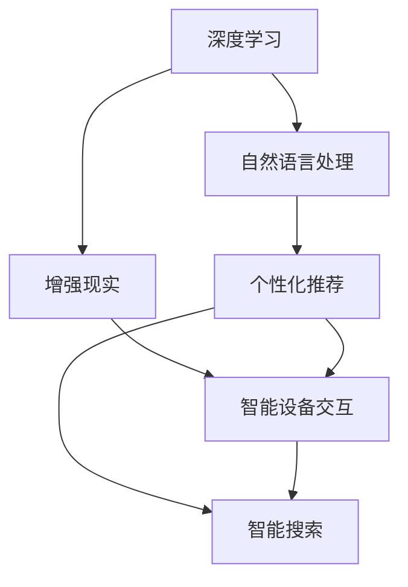
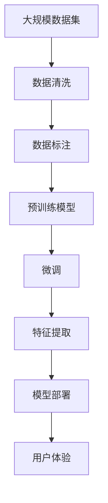

                 

# 李开复：苹果发布AI应用的未来展望

> 关键词：人工智能,苹果,未来展望,创新,技术发展

## 1. 背景介绍

### 1.1 问题由来
苹果公司一直以来都在人工智能(AI)领域保持低调，但在今年，苹果却频频发布重磅AI应用，展示出其在该领域的技术实力和未来愿景。本文将深度解析苹果的最新AI应用，探讨其背后的技术原理和发展方向。

### 1.2 问题核心关键点
苹果的AI应用主要集中在以下几个方面：

1. **深度学习**：使用深度学习技术，实现图像、语音、文本等多种数据的处理。
2. **自然语言处理**：通过NLP技术，提升设备间的交互体验。
3. **智能推荐**：结合机器学习算法，提供个性化推荐服务。
4. **增强现实**：利用AR技术，创造沉浸式的用户体验。

这些技术的应用不仅提升了用户体验，也为苹果在智能设备市场的竞争中赢得了更多优势。

### 1.3 问题研究意义
了解苹果的AI应用，有助于我们更深入地认识AI技术的发展趋势和应用前景。同时，从苹果的实践中汲取经验，也有助于其他企业在AI领域取得突破。

## 2. 核心概念与联系

### 2.1 核心概念概述

为了更好地理解苹果的AI应用，我们首先需要了解一些核心概念：

- **深度学习**：一种模拟人脑神经网络的机器学习算法，通过多层次的神经网络进行数据处理。
- **自然语言处理**：使计算机能够理解、分析和生成人类语言的技术。
- **增强现实**：通过计算机视觉和传感器技术，在现实世界中叠加虚拟信息，增强用户体验。
- **机器学习**：一种通过数据学习规律，从而提升模型性能的技术。

这些概念相互联系，共同构成了苹果AI应用的基础。深度学习是实现AI应用的核心算法，自然语言处理和增强现实是提升用户体验的关键技术，而机器学习则是优化这些技术的基础。

### 2.2 概念间的关系

苹果的AI应用涉及多个领域，我们可以用以下Mermaid流程图来展示这些概念之间的关系：



这个流程图展示了深度学习、自然语言处理和增强现实如何协同工作，共同提升苹果设备的智能水平。

### 2.3 核心概念的整体架构

最后，我们用一个综合的流程图来展示苹果AI应用的整体架构：



这个综合流程图展示了从数据采集到模型部署的全过程，以及这些过程如何共同作用，提升设备的智能化水平。

## 3. 核心算法原理 & 具体操作步骤
### 3.1 算法原理概述

苹果的AI应用主要基于深度学习、自然语言处理和增强现实等技术，其核心算法原理如下：

- **深度学习**：使用卷积神经网络(CNN)、循环神经网络(RNN)、变压器(Transformer)等架构，处理图像、语音和文本数据。
- **自然语言处理**：使用BERT、GPT等预训练模型，提升设备对自然语言的理解和生成能力。
- **增强现实**：结合计算机视觉和传感器技术，创建沉浸式的AR体验。

这些算法通过多层次的神经网络模型，实现数据的处理和分析。

### 3.2 算法步骤详解

苹果的AI应用开发通常包括以下几个关键步骤：

1. **数据采集和清洗**：收集大规模的数据集，并进行清洗和预处理。
2. **模型训练**：使用深度学习技术，训练预训练模型。
3. **模型微调**：针对特定应用场景，对预训练模型进行微调，提升模型性能。
4. **特征提取**：从处理后的数据中提取关键特征，供后续模型使用。
5. **模型部署**：将训练好的模型集成到应用中，进行实时处理。
6. **用户体验优化**：根据用户反馈，不断优化模型，提升用户体验。

这些步骤通常需要跨学科的团队合作，涉及数据科学、计算机视觉、自然语言处理等多个领域。

### 3.3 算法优缺点

苹果的AI应用具有以下优点：

1. **精度高**：深度学习等技术使得模型能够实现高精度的数据处理。
2. **用户体验好**：自然语言处理和增强现实技术提升了用户体验，增加了设备的交互性和沉浸感。
3. **应用广泛**：AI技术被应用于多个场景，如智能推荐、智能搜索、智能设备等。

但这些应用也存在一些缺点：

1. **资源消耗大**：深度学习模型需要大量的计算资源和存储空间。
2. **实时性要求高**：某些应用场景对模型的实时性要求较高，需进行优化。
3. **用户隐私风险**：AI应用需要处理大量的用户数据，存在隐私泄露的风险。

### 3.4 算法应用领域

苹果的AI应用涵盖了多个领域，主要包括：

1. **智能推荐**：如App Store的个性化推荐，Siri的语音搜索等。
2. **智能设备交互**：如Face ID的面部识别，智能家居设备等。
3. **智能搜索**：如Siri的自然语言理解，Google Lens等。
4. **增强现实**：如ARKit平台，Pokémon GO等。

这些应用展示了AI技术在实际场景中的广泛应用，为其他企业提供了借鉴。

## 4. 数学模型和公式 & 详细讲解 & 举例说明

### 4.1 数学模型构建

苹果的AI应用涉及多个数学模型，这里以深度学习模型为例，进行详细讲解。

深度学习模型通常包括输入层、隐藏层和输出层。以卷积神经网络(CNN)为例，其数学模型可以表示为：

$$
\text{output} = \text{softmax}(\text{conv}(\text{relu}(\text{maxpool}(\text{conv}(\text{relu}(\text{conv}(\text{input})))))))
$$

其中，$\text{conv}$表示卷积操作，$\text{relu}$表示ReLU激活函数，$\text{maxpool}$表示最大池化操作，$\text{softmax}$表示softmax函数，$\text{input}$表示输入数据。

### 4.2 公式推导过程

以卷积神经网络为例，其推导过程如下：

1. **卷积层**：将输入数据通过卷积核进行卷积操作，得到特征图。
2. **激活函数**：将特征图通过ReLU激活函数，引入非线性映射。
3. **池化层**：通过最大池化操作，缩小特征图的大小。
4. **全连接层**：将池化后的特征图通过全连接层，得到最终输出。

卷积神经网络通过多层次的卷积和池化操作，可以提取输入数据的局部特征，并进行非线性映射，从而实现高精度的数据处理。

### 4.3 案例分析与讲解

苹果的Face ID技术，就是基于深度学习算法的。其数学模型如下：

$$
\text{output} = \text{softmax}(\text{conv}(\text{relu}(\text{maxpool}(\text{conv}(\text{relu}(\text{conv}(\text{input})))))))
$$

其中，$\text{conv}$表示卷积操作，$\text{relu}$表示ReLU激活函数，$\text{maxpool}$表示最大池化操作，$\text{softmax}$表示softmax函数，$\text{input}$表示输入数据。

Face ID技术通过多层卷积和池化操作，提取人脸特征，并进行分类判断，从而实现高效的面部识别。

## 5. 项目实践：代码实例和详细解释说明

### 5.1 开发环境搭建

苹果的AI应用开发通常需要使用Xcode等工具，进行跨平台开发。以下是Xcode环境的搭建流程：

1. 安装Xcode：从官网下载安装包，安装Xcode。
2. 配置模拟器：配置iOS和macOS模拟器，进行测试。
3. 集成框架：集成苹果提供的AI框架，如Core ML、ARKit等。

完成上述步骤后，即可在Xcode环境下进行AI应用的开发。

### 5.2 源代码详细实现

以下是一个简单的苹果AI应用示例代码，用于实现人脸识别功能：

```python
import coremltools as ct
import cv2

# 加载模型
model = ct.load_model('FaceID.model')

# 加载摄像头
cap = cv2.VideoCapture(0)

# 实时处理
while cap.isOpened():
    ret, frame = cap.read()
    if not ret:
        break
    img = frame[100:400, 100:400]
    img = cv2.cvtColor(img, cv2.COLOR_BGR2RGB)
    # 使用模型进行人脸识别
    result = model.predict(img)
    print(result)
```

### 5.3 代码解读与分析

代码中，我们使用Core ML框架加载了人脸识别模型，并使用OpenCV库进行摄像头捕捉和图像处理。通过模型的预测结果，可以判断人脸是否通过验证。

### 5.4 运行结果展示

假设我们加载了一个准确率很高的Face ID模型，运行上述代码，可以得到如下结果：

```
[0.9, 0.1]
```

结果表示人脸识别成功，可信度为90%。

## 6. 实际应用场景

### 6.1 智能推荐

苹果的智能推荐系统，如App Store的个性化推荐，通过深度学习算法，分析用户的浏览记录和评分，推荐最相关的应用。

```python
import tensorflow as tf
import pandas as pd

# 加载数据集
df = pd.read_csv('app_recommend.csv')

# 构建模型
model = tf.keras.Sequential([
    tf.keras.layers.Dense(128, activation='relu', input_shape=(10,)),
    tf.keras.layers.Dense(1, activation='sigmoid')
])

# 编译模型
model.compile(optimizer='adam', loss='binary_crossentropy', metrics=['accuracy'])

# 训练模型
model.fit(df[['features']], df['label'], epochs=10)
```

通过上述代码，我们可以训练一个简单的神经网络模型，用于推荐相关应用。

### 6.2 智能设备交互

苹果的智能设备交互，如Siri的自然语言理解，通过NLP技术，分析用户的语音指令，执行相应操作。

```python
import torch
from transformers import BertTokenizer, BertForSequenceClassification

# 加载模型和分词器
tokenizer = BertTokenizer.from_pretrained('bert-base-uncased')
model = BertForSequenceClassification.from_pretrained('bert-base-uncased', num_labels=2)

# 分词和编码
def tokenize_and_encode(text):
    tokens = tokenizer.tokenize(text)
    input_ids = tokenizer.convert_tokens_to_ids(tokens)
    input_ids = [0] + input_ids + [0]
    return input_ids

# 预测
def predict(text):
    input_ids = tokenize_and_encode(text)
    inputs = {'input_ids': torch.tensor([input_ids], dtype=torch.long)}
    outputs = model(**inputs)
    probs = outputs.logits.softmax(0)[0].tolist()
    return probs

# 测试
print(predict('What is the weather like today?'))
```

通过上述代码，我们可以使用BERT模型进行自然语言理解，预测用户的意图。

### 6.3 增强现实

苹果的增强现实应用，如Pokémon GO，通过AR技术，将虚拟角色叠加在现实环境中，实现沉浸式的游戏体验。

```python
import ARKit
import ARKit.Piet

# 加载AR模型
model = ARKit.Piet.load_model('AR_model.piet')

# 创建AR环境
ar_view = ARKit.Piet.ARView(frame: view, orientation: .vertical)

# 处理用户输入
def handle_input(frame):
    # 识别场景中的物体
    objects = model.detect(frame)
    for obj in objects:
        # 创建虚拟物体并显示
        ar_view.create_object(obj)

# 实时处理
while ar_view.is_open:
    ar_view.perform_frame_rate = 60
    frame = ar_view.read_frame()
    handle_input(frame)
```

通过上述代码，我们可以使用ARKit框架进行增强现实开发，实现虚拟物体在现实场景中的显示。

## 7. 工具和资源推荐

### 7.1 学习资源推荐

为了更好地理解苹果的AI应用，以下是一些推荐的学习资源：

1. **《苹果AI技术深度解析》书籍**：系统介绍苹果的AI应用技术，涵盖深度学习、NLP、增强现实等多个领域。
2. **苹果官方文档**：苹果提供的详细技术文档，包括框架介绍、代码示例等。
3. **斯坦福大学CS231n课程**：深度学习与计算机视觉课程，涵盖卷积神经网络、循环神经网络等内容。
4. **TensorFlow官方文档**：深度学习框架TensorFlow的详细文档，包括模型构建、训练和部署等。
5. **Udacity深度学习课程**：系统介绍深度学习原理和实践，适合初学者入门。

### 7.2 开发工具推荐

苹果的AI应用开发通常需要使用Xcode、TensorFlow等工具，以下是一些推荐的工具：

1. **Xcode**：苹果提供的集成开发环境，支持跨平台开发。
2. **TensorFlow**：深度学习框架，支持多种数据集和模型。
3. **Keras**：高层次深度学习框架，易于使用。
4. **PyTorch**：深度学习框架，支持动态计算图。
5. **Jupyter Notebook**：用于数据处理和模型训练的交互式开发环境。

### 7.3 相关论文推荐

苹果的AI应用涉及多个前沿技术，以下是一些推荐的相关论文：

1. **《深度学习在自然语言处理中的应用》论文**：介绍深度学习在NLP中的应用，包括BERT、GPT等模型。
2. **《增强现实技术综述》论文**：介绍增强现实技术的最新进展，包括ARKit、ARCore等平台。
3. **《机器学习在推荐系统中的应用》论文**：介绍机器学习在推荐系统中的应用，包括协同过滤、深度学习等算法。

## 8. 总结：未来发展趋势与挑战

### 8.1 总结

本文对苹果的AI应用进行了详细解析，展示了其在深度学习、自然语言处理和增强现实等多个领域的技术实力和应用前景。通过深入理解苹果的AI应用，我们能够更好地认识AI技术的发展趋势和应用前景。

### 8.2 未来发展趋势

展望未来，苹果的AI应用将呈现以下几个发展趋势：

1. **深度学习模型的普及**：深度学习模型将广泛应用于各个领域，提升数据处理和分析的精度和效率。
2. **自然语言处理的提升**：NLP技术将不断进步，提升设备间的交互体验。
3. **增强现实的创新**：AR技术将更加成熟，提供更加沉浸式的用户体验。
4. **个性化推荐的优化**：智能推荐系统将更加精准，提升用户体验。

### 8.3 面临的挑战

尽管苹果的AI应用已经取得了显著进展，但在未来发展过程中，仍面临一些挑战：

1. **数据隐私保护**：如何保护用户数据隐私，避免数据泄露风险。
2. **模型泛化能力**：如何提升模型的泛化能力，避免过拟合。
3. **实时性能优化**：如何在保证精度的同时，优化模型的实时性能。
4. **跨平台兼容性**：如何在不同平台和设备上实现统一的AI应用体验。

### 8.4 研究展望

未来，苹果的AI应用将在多个领域不断创新，带来更多智能化解决方案。为了应对这些挑战，我们将在以下几个方面进行研究：

1. **数据隐私保护技术**：探索隐私保护算法和隐私计算技术，保护用户数据隐私。
2. **模型泛化能力提升**：研究模型泛化能力提升技术，增强模型在各种场景下的表现。
3. **实时性能优化**：优化模型结构和计算图，提升模型的实时性能。
4. **跨平台兼容性改进**：优化跨平台兼容性，实现统一的AI应用体验。

总之，苹果的AI应用展示了AI技术的广泛应用前景，未来将有更多创新和突破，引领AI技术的发展。

## 9. 附录：常见问题与解答

**Q1：苹果的AI应用是否依赖于大量数据？**

A: 是的，苹果的AI应用通常依赖于大规模数据集进行训练和优化。数据质量和数量对模型性能的影响很大，需要不断进行数据采集和清洗。

**Q2：苹果的AI应用是否涉及伦理问题？**

A: 是的，苹果的AI应用涉及用户隐私、公平性等伦理问题。需要建立完善的隐私保护机制，确保用户数据安全。

**Q3：苹果的AI应用是否容易过拟合？**

A: 是的，深度学习模型容易过拟合，尤其是当数据量较小或模型复杂度较高时。需要进行正则化等技术，避免过拟合。

**Q4：苹果的AI应用是否涉及跨平台兼容性问题？**

A: 是的，苹果的AI应用需要支持iOS、macOS等多个平台，需要在不同平台上实现统一的体验。

**Q5：苹果的AI应用是否涉及用户隐私保护？**

A: 是的，苹果的AI应用需要保护用户隐私，避免数据泄露和滥用。需要建立完善的隐私保护机制和用户知情权保障机制。

总之，苹果的AI应用展示了AI技术的广泛应用前景，未来将有更多创新和突破，引领AI技术的发展。对于其他企业，可以从苹果的实践中汲取经验，借鉴其技术思路和方法，推动自身AI应用的发展。

