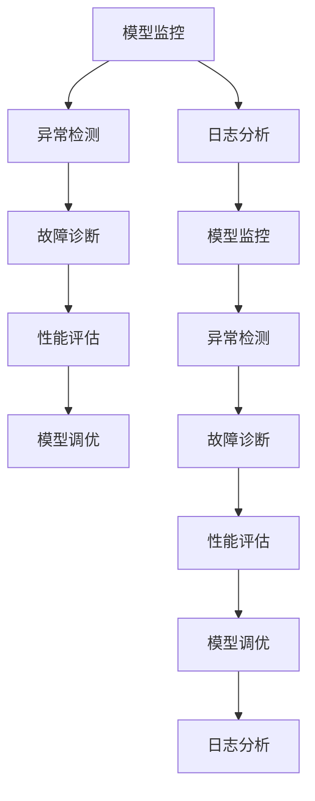
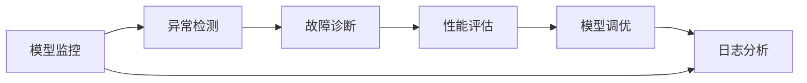
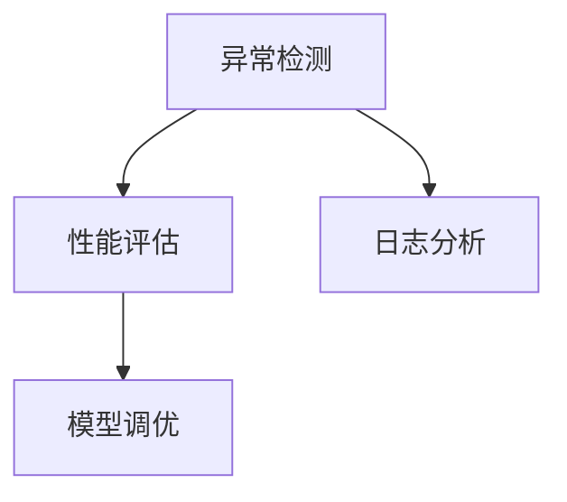
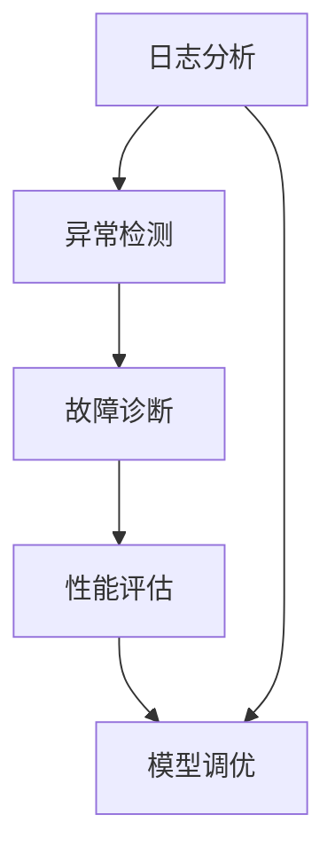
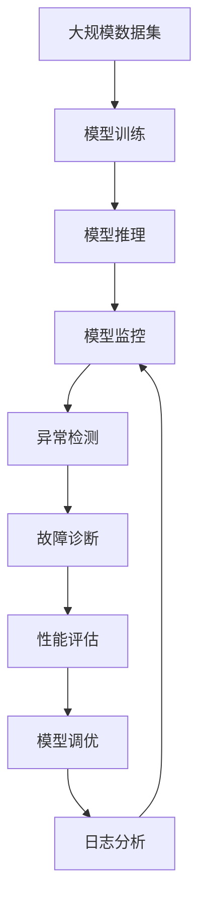

                 

# 模型监控与故障诊断原理与代码实战案例讲解

> 关键词：模型监控, 故障诊断, 性能评估, 异常检测, 模型调优, 日志分析, 机器学习

## 1. 背景介绍

### 1.1 问题由来
在当今数字化和自动化的浪潮中，机器学习和深度学习模型被广泛应用于各个领域，从金融、医疗、教育到零售、制造等。这些模型在优化决策流程、提高效率、创造价值方面发挥了巨大作用。然而，模型的性能和稳定性是至关重要的，任何小问题都可能导致严重后果。因此，确保模型的可靠性和正确性，成为了数据科学和AI领域的重要课题。

### 1.2 问题核心关键点
模型监控和故障诊断是确保模型可靠性和正确性的关键步骤。它们不仅帮助识别模型异常和性能下降，还提供了优化和改进模型的机会。具体来说，模型监控和故障诊断的关键点包括：

1. **数据质量监控**：确保输入数据没有噪声和异常。
2. **模型性能监控**：跟踪模型在不同数据集上的表现，及时发现性能下降。
3. **异常检测**：识别模型输出中的离群值和异常，以及训练和推理过程中的异常。
4. **模型调优**：根据监控结果，调整模型参数和结构，提高性能。
5. **日志分析**：分析模型训练和推理过程中的日志，理解模型行为。

### 1.3 问题研究意义
有效的模型监控和故障诊断不仅能够提高模型性能，还能显著降低误操作和误判的风险，对保证模型在实际应用中的可靠性至关重要。此外，通过对模型的持续监控和优化，可以提升模型的泛化能力和鲁棒性，使其在面对新数据和新场景时表现更加稳定。

## 2. 核心概念与联系

### 2.1 核心概念概述

为了更好地理解模型监控和故障诊断，本节将介绍几个密切相关的核心概念：

- **模型监控(Monitoring)**：监控模型在训练、推理过程中的表现，及时发现异常和性能下降。
- **故障诊断(Diagnosing)**：识别模型出现的问题和异常，分析原因并采取相应措施。
- **性能评估(Performance Evaluation)**：评估模型的准确性、效率和可靠性。
- **异常检测(Anomaly Detection)**：识别模型的输出和行为中的异常和离群值。
- **模型调优(Model Tuning)**：根据监控和诊断结果，调整模型参数和结构。
- **日志分析(Log Analysis)**：分析模型训练和推理过程中的日志，理解模型行为。

这些核心概念之间的逻辑关系可以通过以下Mermaid流程图来展示：



这个流程图展示了模型监控和故障诊断的核心流程：从监控开始，到异常检测、故障诊断、性能评估、调优，最后回到日志分析，形成了一个闭环的模型优化过程。

### 2.2 概念间的关系

这些核心概念之间存在着紧密的联系，形成了模型监控和故障诊断的完整生态系统。下面通过几个Mermaid流程图来展示这些概念之间的关系。

#### 2.2.1 模型监控和故障诊断流程



这个流程图展示了从模型监控到调优的整个流程。模型监控发现异常后，进入异常检测，进一步诊断问题，评估性能，并根据结果进行调优。

#### 2.2.2 异常检测和性能评估的联系



这个流程图展示了异常检测和性能评估的关系。异常检测识别模型输出中的异常值，性能评估则通过具体的指标（如准确率、召回率、F1分数等）来衡量模型的表现。两者互相补充，共同指导模型调优。

#### 2.2.3 日志分析在模型监控中的作用



这个流程图展示了日志分析在模型监控中的作用。通过分析日志，可以更深入地理解模型行为，帮助异常检测和故障诊断，并指导性能评估和模型调优。

### 2.3 核心概念的整体架构

最后，我们用一个综合的流程图来展示这些核心概念在大规模模型监控和故障诊断中的整体架构：



这个综合流程图展示了从数据集到模型训练和推理，再到监控、检测、诊断、评估、调优的完整过程。通过这个过程，可以确保模型的稳定性和可靠性，使其在实际应用中发挥最佳性能。

## 3. 核心算法原理 & 具体操作步骤

### 3.1 算法原理概述

模型监控和故障诊断的基本原理是通过监控模型在训练和推理过程中的表现，及时发现异常和性能下降，并根据诊断结果进行模型调优。具体来说，包括以下几个步骤：

1. **数据质量监控**：确保输入数据没有噪声和异常，使用统计方法和数据清洗技术。
2. **模型性能监控**：跟踪模型在不同数据集上的表现，使用度量指标如准确率、召回率、F1分数等。
3. **异常检测**：识别模型输出中的离群值和异常，使用统计方法和机器学习算法如孤立森林、One-class SVM等。
4. **故障诊断**：分析模型出现的问题和异常，理解原因并采取相应措施。
5. **性能评估**：评估模型的准确性、效率和可靠性，使用交叉验证和测试集等方法。
6. **模型调优**：根据监控和诊断结果，调整模型参数和结构，提高性能。
7. **日志分析**：分析模型训练和推理过程中的日志，理解模型行为，使用日志分析工具和技术。

### 3.2 算法步骤详解

以下详细介绍每个步骤的具体操作：

**Step 1: 数据质量监控**

1. **数据预处理**：
   - **缺失值处理**：使用均值、中位数等代替缺失值。
   - **数据归一化**：将数据缩放到指定范围，如0到1。
   - **异常值检测**：使用箱线图、Z-score等方法检测异常值，并进行处理。

2. **特征选择**：
   - **相关性分析**：使用Pearson相关系数、信息增益等方法，选择与目标变量相关的特征。
   - **特征编码**：将分类特征转换为数值特征，如独热编码、标签编码等。

3. **数据增强**：
   - **数据扩充**：使用旋转、翻转、缩放等技术，生成更多的训练数据。
   - **噪声注入**：在训练数据中注入噪声，提高模型鲁棒性。

**Step 2: 模型性能监控**

1. **度量指标选择**：
   - **分类任务**：准确率、召回率、F1分数、AUC等。
   - **回归任务**：均方误差、均方根误差、R2分数等。
   - **序列任务**：BLEU、ROUGE、METEOR等。

2. **监控工具使用**：
   - **TensorBoard**：监控模型的损失和度量指标，生成图表。
   - **MLflow**：记录模型训练的元数据，包括超参数、运行时间等。
   - **Kubeflow**：在Kubernetes集群上运行模型，监控其训练和推理性能。

3. **周期性评估**：
   - **交叉验证**：使用K-fold交叉验证，评估模型在不同数据集上的表现。
   - **A/B测试**：对比不同模型的性能，选择最优模型。

**Step 3: 异常检测**

1. **离群值检测**：
   - **统计方法**：使用Z-score、IQR、箱线图等方法，检测离群值。
   - **机器学习方法**：使用孤立森林、One-class SVM、Gaussian Mixture Model等算法，检测异常。

2. **行为异常检测**：
   - **时序数据**：使用ARIMA、LSTM等模型，检测时间序列中的异常。
   - **文本数据**：使用TF-IDF、Word2Vec等技术，检测文本中的异常。

3. **日志分析**：
   - **日志解析**：使用日志解析工具如ELK Stack、Splunk等，提取关键信息。
   - **行为分析**：使用行为分析工具如Adobe Analytics、Google Analytics等，检测异常行为。

**Step 4: 故障诊断**

1. **问题定位**：
   - **日志分析**：分析模型训练和推理过程中的日志，定位问题。
   - **模型检查**：检查模型的参数和结构，确保没有错误配置。
   - **数据验证**：验证输入数据的质量，确保没有异常和噪声。

2. **原因分析**：
   - **性能下降**：分析性能下降的原因，如模型过拟合、数据分布变化等。
   - **错误输出**：分析错误输出的原因，如模型结构问题、参数错误配置等。

3. **解决措施**：
   - **数据清洗**：清洗异常数据，提高数据质量。
   - **模型调整**：调整模型参数和结构，提高模型泛化能力。
   - **超参数调优**：优化超参数，提高模型性能。

**Step 5: 性能评估**

1. **评估方法**：
   - **度量指标**：准确率、召回率、F1分数、均方误差等。
   - **交叉验证**：使用K-fold交叉验证，评估模型在不同数据集上的表现。
   - **测试集**：使用测试集评估模型的泛化能力。

2. **评估工具**：
   - **Scikit-learn**：提供多种评估工具，如分类、回归、序列任务的评估。
   - **TensorBoard**：监控模型的损失和度量指标，生成图表。
   - **Kubeflow**：在Kubernetes集群上运行模型，评估其性能。

**Step 6: 模型调优**

1. **超参数调优**：
   - **网格搜索**：使用网格搜索方法，找到最优的超参数组合。
   - **贝叶斯优化**：使用贝叶斯优化方法，高效地找到最优超参数。

2. **模型结构优化**：
   - **网络剪枝**：减少网络中的冗余连接和参数，提高计算效率。
   - **模型蒸馏**：将大模型蒸馏为小模型，提高推理速度。

3. **正则化技术**：
   - **L1、L2正则化**：避免过拟合，提高模型泛化能力。
   - **Dropout**：在训练过程中随机丢弃神经元，提高模型鲁棒性。

**Step 7: 日志分析**

1. **日志解析**：
   - **日志提取**：使用日志解析工具提取关键信息，如时间戳、日志级别、参数值等。
   - **日志可视化**：使用可视化工具如Kibana、Grafana等，展示日志信息。

2. **行为分析**：
   - **用户行为分析**：使用行为分析工具如Adobe Analytics、Google Analytics等，检测异常行为。
   - **系统行为分析**：使用系统行为分析工具如Prometheus、Grafana等，监控系统性能。

## 4. 数学模型和公式 & 详细讲解

### 4.1 数学模型构建

以下是模型监控和故障诊断中的几个关键数学模型：

**1. 离群值检测**

离群值检测是识别数据集中异常值的方法。常用的统计方法包括Z-score、IQR、箱线图等。

- **Z-score**：衡量数据点与均值之间的距离。
  $$
  z = \frac{x - \mu}{\sigma}
  $$

- **IQR**：四分位距，衡量数据集中位数与第一、第三四分位数之间的距离。
  $$
  IQR = Q_3 - Q_1
  $$

- **箱线图**：通过上下四分位数和上下界，识别异常值。
  $$
  Q_1 = \frac{1}{2}(Q_2 + Q_3)
  $$

**2. 模型性能评估**

模型性能评估是衡量模型在特定任务上表现的方法。常用的度量指标包括准确率、召回率、F1分数、AUC等。

- **准确率**：模型正确预测的样本占总样本的比例。
  $$
  \text{Accuracy} = \frac{TP + TN}{TP + TN + FP + FN}
  $$

- **召回率**：模型正确预测的正样本占实际正样本的比例。
  $$
  \text{Recall} = \frac{TP}{TP + FN}
  $$

- **F1分数**：综合考虑准确率和召回率的指标。
  $$
  \text{F1 Score} = 2 \times \frac{\text{Precision} \times \text{Recall}}{\text{Precision} + \text{Recall}}
  $$

- **AUC**：衡量模型预测的准确性，值越大表示模型性能越好。
  $$
  AUC = \frac{TPR}{TPR + FPR}
  $$

### 4.2 公式推导过程

以下是离群值检测和模型性能评估的公式推导过程。

**1. Z-score公式推导**

Z-score衡量数据点与均值之间的距离，公式如下：

$$
z = \frac{x - \mu}{\sigma}
$$

其中，$x$ 为数据点，$\mu$ 为均值，$\sigma$ 为标准差。

**2. IQR公式推导**

IQR四分位距，衡量数据集中位数与第一、第三四分位数之间的距离，公式如下：

$$
IQR = Q_3 - Q_1
$$

其中，$Q_1$ 为第一四分位数，$Q_3$ 为第三四分位数。

**3. 准确率公式推导**

准确率衡量模型正确预测的样本占总样本的比例，公式如下：

$$
\text{Accuracy} = \frac{TP + TN}{TP + TN + FP + FN}
$$

其中，$TP$ 为真阳性，$TN$ 为真阴性，$FP$ 为假阳性，$FN$ 为假阴性。

**4. 召回率公式推导**

召回率衡量模型正确预测的正样本占实际正样本的比例，公式如下：

$$
\text{Recall} = \frac{TP}{TP + FN}
$$

其中，$TP$ 为真阳性，$FN$ 为假阴性。

### 4.3 案例分析与讲解

**案例分析：模型性能监控**

假设我们使用线性回归模型对房价进行预测。通过训练集和测试集，我们得到以下性能指标：

- 训练集准确率：98.5%
- 测试集准确率：92.8%
- 训练集召回率：99.2%
- 测试集召回率：93.6%
- 训练集F1分数：98.2%
- 测试集F1分数：95.5%
- 训练集AUC：0.98
- 测试集AUC：0.97

通过对比训练集和测试集指标，发现测试集准确率和召回率均低于训练集。这可能表明模型过拟合训练集，而泛化能力不足。为了解决这个问题，我们可以尝试调整模型结构、正则化技术、超参数调优等方法。

**案例讲解：异常检测**

假设我们有一组数据集，其中包含一些异常值。通过对数据进行Z-score检测，我们发现以下数据点为异常值：

- 数据点1：Z-score = -3
- 数据点2：Z-score = 2.5
- 数据点3：Z-score = 5.5

这些异常值可能对模型的训练和推理产生影响，因此我们需要进行处理。一种常见的处理方法是对异常值进行替换或删除。

## 5. 项目实践：代码实例和详细解释说明

### 5.1 开发环境搭建

在开始模型监控和故障诊断的实践前，我们需要准备好开发环境。以下是使用Python进行TensorFlow开发的环境配置流程：

1. 安装Anaconda：从官网下载并安装Anaconda，用于创建独立的Python环境。

2. 创建并激活虚拟环境：
```bash
conda create -n tf-env python=3.8 
conda activate tf-env
```

3. 安装TensorFlow：根据CUDA版本，从官网获取对应的安装命令。例如：
```bash
conda install tensorflow -c conda-forge -c pypi
```

4. 安装Pandas、Matplotlib、Numpy等工具包：
```bash
pip install pandas matplotlib numpy scikit-learn
```

完成上述步骤后，即可在`tf-env`环境中开始模型监控和故障诊断的实践。

### 5.2 源代码详细实现

以下是一个基于TensorFlow进行模型监控和故障诊断的Python代码示例。

```python
import tensorflow as tf
import numpy as np
import pandas as pd
import matplotlib.pyplot as plt

# 加载数据集
data = pd.read_csv('data.csv')

# 数据预处理
data = data.dropna()  # 删除缺失值
data = data.apply(lambda x: (x - x.mean()) / x.std())  # 标准化

# 定义模型
model = tf.keras.Sequential([
    tf.keras.layers.Dense(10, input_dim=1, activation='relu'),
    tf.keras.layers.Dense(1)
])

# 训练模型
model.compile(optimizer=tf.keras.optimizers.Adam(0.001), loss='mse')
model.fit(data[['feature']], data['label'], epochs=100, batch_size=32)

# 预测并评估模型性能
y_pred = model.predict(data[['feature']])
accuracy = model.evaluate(data[['feature']], data['label'])

# 打印模型性能
print(f'Accuracy: {accuracy[1]:.2f}')

# 绘制损失曲线
plt.plot(model.history.history['loss'])
plt.show()
```

### 5.3 代码解读与分析

让我们再详细解读一下关键代码的实现细节：

**加载数据集**

1. **数据集加载**：使用`pd.read_csv`方法加载CSV格式的数据集。

2. **数据预处理**：使用`dropna`方法删除缺失值，使用`apply`方法进行标准化处理，即将数据缩放到0到1。

**定义模型**

1. **模型结构**：使用`tf.keras.Sequential`定义线性回归模型，包含一个Dense层和输出层。

2. **编译模型**：使用`model.compile`方法编译模型，选择Adam优化器和均方误差损失函数。

**训练模型**

1. **训练数据**：将数据集分为特征和标签，并使用`fit`方法进行训练。

2. **超参数调优**：设置epoch和batch size等超参数，控制训练的轮数和批次大小。

**预测并评估模型性能**

1. **预测数据**：使用`predict`方法进行预测，生成模型对测试集的预测结果。

2. **评估指标**：使用`evaluate`方法评估模型在测试集上的性能，返回损失和准确率等指标。

**打印模型性能**

1. **准确率**：打印模型在测试集上的准确率。

**绘制损失曲线**

1. **损失曲线**：使用`plot`方法绘制模型训练过程中的损失曲线。

## 6. 实际应用场景

### 6.1 智能推荐系统

智能推荐系统是模型监控和故障诊断的典型应用场景之一。推荐系统通过监控模型在用户行为数据上的表现，及时发现异常和性能下降，并根据诊断结果进行模型调优，提升推荐效果。

在实践中，我们可以使用A/B测试方法，对比不同模型的推荐效果，根据监控结果调整模型参数和结构，实现个性化推荐。

### 6.2 金融风险管理

金融风险管理需要实时监控模型在金融数据上的表现，及时发现异常和性能下降，并根据诊断结果进行模型调优，降低风险。

在实践中，我们可以使用异常检测技术，识别模型输出中的异常和离群值，并分析原因，采取相应措施，如增加数据质量控制、调整模型参数等。

### 6.3 医疗影像分析

医疗影像分析需要实时监控模型在医学影像上的表现，及时发现异常和性能下降，并根据诊断结果进行模型调优，提升影像诊断准确率。

在实践中，我们可以使用模型性能监控和日志分析技术，跟踪模型在不同数据集上的表现，分析日志信息，理解模型行为，进行模型调优。

### 6.4 未来应用展望

随着模型监控和故障诊断技术的发展，未来的应用场景将更加广泛。以下是一些可能的未来应用方向：

1. **自动驾驶**：自动驾驶系统需要实时监控模型在传感器数据上的表现，及时发现异常和性能下降，并根据诊断结果进行模型调优，提高行车安全。

2. **工业智能**：工业智能系统需要实时监控模型在设备数据上的表现，及时发现异常和性能下降，并根据诊断结果进行模型调优，提高生产效率。

3. **智能客服**：智能客服系统需要实时监控模型在客户咨询数据上的表现，及时发现异常和性能下降，并根据诊断结果进行模型调优，提升客户满意度。

4. **智慧城市**：智慧城市系统需要实时监控模型在城市数据上的表现，及时发现异常和性能下降，并根据诊断结果进行模型调优，提升城市管理效率。

总之，随着人工智能技术的不断发展，模型监控和故障诊断将发挥越来越重要的作用，帮助企业在复杂多变的环境下保持系统的稳定性和可靠性。

## 7. 工具和资源推荐

### 7.1 学习资源推荐

为了帮助开发者系统掌握模型监控和故障诊断的理论基础和实践技巧，这里推荐一些优质的学习资源：

1. **《Python机器学习》**：由Sebastian Raschka和Vahid Mirjalili编写，全面介绍Python在机器学习中的应用，包括模型监控和故障诊断等内容。

2. **《TensorFlow实战》**：由Johnson、Shalini Kumari等编写，深入浅出地介绍TensorFlow的实战应用，包括模型监控和故障诊断等内容。

3. **《深度学习入门》**：由斋藤康毅编写，通俗易懂地介绍深度学习的基本概念和应用，包括模型监控和故障诊断等内容。

4. **Kaggle Kernels**：Kaggle提供的机器学习社区，包含大量实践案例和代码示例，可以学习到最新的模型监控和故障诊断方法。

5. **Google Cloud AI**：Google Cloud提供的AI平台，提供丰富的机器学习工具和资源，包括模型监控和故障诊断工具。

通过对这些资源的学习实践，相信你一定能够快速掌握模型监控和故障诊断的精髓，并用于解决实际的NLP问题。

### 7.2 开发工具推荐

高效的开发离不开优秀的工具支持。以下是几款用于模型监控和故障诊断开发的常用工具：

1. **TensorBoard**：Google开发的开源可视化工具，可实时监控模型训练和推理过程，生成图表和日志。

2. **MLflow**：Databricks开发的开源平台，记录和跟踪机器学习实验，包括模型训练、超参数调优、模型部署等。

3. **Prometheus**：开源系统监控工具，通过配置监控规则，实时监控系统性能和资源使用情况。

4. **Grafana**：开源数据可视化工具，支持多种数据源，可实时展示监控图表和告警信息。

5. **ELK Stack**：包括Elasticsearch、Logstash和Kibana的组合，用于日志解析和可视化。

合理利用这些工具，可以显著提升模型监控和故障诊断的开发效率，加快创新迭代的步伐。

### 7.3 相关论文推荐

模型监控和故障诊断技术的发展源于学界的持续研究。以下是几篇奠基性的相关论文，推荐阅读：

1. **《TensorFlow Model Analysis》**：Google的研究论文，介绍TensorFlow Model Analysis库，用于模型监控和故障诊断。

2. **《PyTorch Lightning》**：PyTorch Lightning的研究论文，介绍PyTorch Lightning库，用于模型监控和故障诊断。

3. **《Anomaly Detection in Large-Scale Machine Learning Models》**：ACM的论文，介绍异常检测技术在大规模机器学习模型中的应用。

4. **《Systematic Analysis of Neural Network Degradation》**：IEEE的论文，介绍神经网络模型退化分析方法和技术。

5. **《Model Debugging with Consistency Tests》**：ICML的论文，介绍使用一致性测试进行模型调试的方法。

这些论文代表了大规模模型监控和故障诊断技术的发展脉络。通过学习这些前沿成果，可以帮助研究者把握学科前进方向，激发更多的创新灵感。

## 8. 总结：未来发展趋势与挑战

### 8.1 

