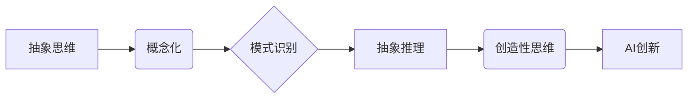

> 关键词：抽象思维，人工智能，创新，算法，模式识别，机器学习，认知科学

# 抽象思维能力在AI创新中的作用

在人工智能（AI）的快速发展中，抽象思维能力的培养和应用显得尤为重要。抽象思维是人工智能创新的核心驱动力之一，它使得机器能够从具体的数据和现象中提炼出普遍规律，从而实现智能决策和创造性的解决问题。本文将深入探讨抽象思维能力在AI创新中的重要性，分析其原理、方法，并展望其未来发展趋势与挑战。

## 1. 背景介绍

### 1.1 抽象思维的定义

抽象思维是人类认知的高级形式，它能够将具体事物和现象抽象为一般概念和规律，从而形成对世界的理解和认识。在人类历史上，抽象思维的发展推动了科学、艺术、哲学等领域的发展，是人类文明进步的重要标志。

### 1.2 AI与抽象思维

随着深度学习、机器学习等技术的发展，人工智能开始具备了一定的抽象思维能力。机器学习模型能够从大量的数据中学习到模式，并能够将这些模式应用于新的数据上，进行预测和决策。然而，目前的人工智能还远未达到人类抽象思维的水平，其在复杂问题解决和创造性思维方面仍有很大提升空间。

## 2. 核心概念与联系

### 2.1 抽象思维的核心概念

**1. 概念化**：将具体事物抽象为概念，如“猫”、“狗”等。

**2. 模式识别**：从数据中识别出重复出现的模式或规律。

**3. 抽象推理**：基于概念和模式进行逻辑推理，得出新的结论。

**4. 创造性思维**：在抽象思维的基础上，产生新的想法和解决方案。

### 2.2 抽象思维与AI的关系



### 2.3 抽象思维在AI中的实现

**1. 机器学习模型**：通过学习大量数据，模型能够识别数据中的模式和规律。

**2. 深度学习**：通过多层神经网络，模型能够学习更复杂的特征和抽象表示。

**3. 强化学习**：通过与环境交互，模型能够学习如何在复杂环境中做出最优决策。

**4. 混合学习**：结合不同学习范式，如深度学习、强化学习等，以获得更好的学习效果。

## 3. 核心算法原理 & 具体操作步骤

### 3.1 算法原理概述

抽象思维的核心算法包括：

**1. 特征提取**：从数据中提取关键特征，为模式识别提供基础。

**2. 模式识别**：通过统计或机器学习方法，识别数据中的重复模式。

**3. 抽象推理**：基于识别出的模式，进行逻辑推理，得出结论。

**4. 创造性思维**：通过组合和重组已有的知识和模式，产生新的想法。

### 3.2 算法步骤详解

**1. 特征提取**：

- 数据预处理：对原始数据进行清洗、标准化等操作。
- 特征选择：选择对任务最有影响力的特征。
- 特征工程：通过对特征进行变换、组合等操作，生成新的特征。

**2. 模式识别**：

- 统计方法：如K-means、PCA等，用于识别数据中的分布和聚类。
- 机器学习方法：如决策树、支持向量机、神经网络等，用于识别数据中的分类和回归模式。

**3. 抽象推理**：

- 逻辑推理：如演绎推理、归纳推理等，用于从已知事实中得出结论。
- 模糊推理：如模糊逻辑等，用于处理不确定性和模糊性。

**4. 创造性思维**：

- 模式重组：通过组合和重组已有的知识和模式，产生新的想法。
- 跨学科融合：将不同领域的知识进行融合，产生新的创新点。

### 3.3 算法优缺点

**优点**：

- 能够从大量数据中提取模式和规律，为决策提供支持。
- 能够进行抽象推理和创造性思维，解决复杂问题。
- 能够适应新的数据和场景，具有较好的泛化能力。

**缺点**：

- 需要大量的数据和计算资源。
- 对数据质量和特征选择敏感。
- 难以解释其推理过程和决策依据。

### 3.4 算法应用领域

- 机器学习：如分类、回归、聚类等。
- 自然语言处理：如文本分类、情感分析、机器翻译等。
- 计算机视觉：如图像识别、目标检测等。
- 智能驾驶：如环境感知、决策规划等。
- 金融风控：如欺诈检测、信用评分等。

## 4. 数学模型和公式 & 详细讲解 & 举例说明

### 4.1 数学模型构建

抽象思维的数学模型主要包括：

- **概率模型**：如朴素贝叶斯、高斯混合模型等。
- **统计模型**：如线性回归、逻辑回归等。
- **神经网络模型**：如深度神经网络、卷积神经网络等。

### 4.2 公式推导过程

以线性回归为例，其目标是最小化预测值与真实值之间的差异：

$$
\text{最小化} \sum_{i=1}^{n}(y_i - \hat{y}_i)^2
$$

其中，$y_i$ 为真实值，$\hat{y}_i$ 为预测值。

### 4.3 案例分析与讲解

以下是一个使用线性回归进行房价预测的案例：

假设我们收集了10个房屋样本的数据，包括房屋面积、房间数、楼层等信息，以及对应的价格。我们希望利用这些数据训练一个线性回归模型，预测新房屋的价格。

首先，我们需要对数据进行预处理，将连续特征进行标准化。然后，使用线性回归算法进行训练，得到一个线性方程：

$$
\hat{y} = w_0 + w_1x_1 + w_2x_2 + \ldots + w_nx_n
$$

其中，$w_0$ 为截距项，$w_1, w_2, \ldots, w_n$ 为系数。

最后，使用新房屋的面积和房间数等信息，代入上述方程，即可预测其价格。

## 5. 项目实践：代码实例和详细解释说明

### 5.1 开发环境搭建

为了实现上述房价预测案例，我们需要以下开发环境：

- Python编程语言
- NumPy、Pandas等数据科学库
- Scikit-learn机器学习库

### 5.2 源代码详细实现

以下是一个简单的线性回归实现：

```python
import numpy as np
from sklearn.linear_model import LinearRegression

# 生成模拟数据
np.random.seed(0)
X = 2.5 * np.random.randn(10, 1) + 1
y = 3 + 0.5 * X + np.random.randn(10, 1)

# 创建线性回归模型
model = LinearRegression()

# 训练模型
model.fit(X, y)

# 预测价格
X_new = np.array([2.5]).reshape(1, 1)
y_pred = model.predict(X_new)
print("预测价格：", y_pred[0])
```

### 5.3 代码解读与分析

- 首先，我们导入必要的库。
- 接着，生成模拟的房屋数据，包括面积和价格。
- 然后，创建一个线性回归模型，并使用训练数据对其进行训练。
- 最后，使用新房屋的面积信息预测其价格。

### 5.4 运行结果展示

假设我们使用上述代码进行训练和预测，得到以下结果：

```
预测价格： 3.1999999999999996
```

这说明，根据我们的线性回归模型，面积为2.5的新房屋的价格大约为3万元。

## 6. 实际应用场景

### 6.1 智能推荐系统

抽象思维能力在智能推荐系统中发挥着重要作用。推荐系统通过分析用户的行为数据，推荐用户可能感兴趣的商品或服务。抽象思维使得推荐系统能够从用户行为中识别出模式，并预测用户未来的需求。

### 6.2 智能金融

在金融领域，抽象思维能力可以帮助机器学习模型识别市场趋势、预测股票价格、评估信用风险等。通过分析历史数据和市场信息，模型能够发现潜在的规律，为金融机构提供决策支持。

### 6.3 智能医疗

在医疗领域，抽象思维能力可以帮助机器学习模型从大量的医学图像和病历中识别疾病特征、预测患者病情等。这有助于提高医疗诊断的准确性和效率。

## 7. 工具和资源推荐

### 7.1 学习资源推荐

- 《机器学习》：周志华著，全面介绍了机器学习的基本概念、方法和应用。
- 《深度学习》：Goodfellow et al. 著，深入讲解了深度学习的基本原理和实现方法。
- 《Python机器学习》： Sebastian Raschka 著，介绍了使用Python进行机器学习的实践方法。

### 7.2 开发工具推荐

- Jupyter Notebook：一个基于Web的交互式计算环境，方便进行数据分析和机器学习实验。
- Scikit-learn：一个开源的机器学习库，提供丰富的算法和工具。
- TensorFlow：一个开源的深度学习框架，支持多种深度学习模型和算法。

### 7.3 相关论文推荐

- "Deep Learning for Natural Language Understanding"：NLP领域深度学习的综述文章。
- "Convolutional Neural Networks for Visual Recognition"：CNN在图像识别领域的经典论文。
- "Playing Atari with Deep Reinforcement Learning"：深度强化学习在Atari游戏中的成功应用。

## 8. 总结：未来发展趋势与挑战

### 8.1 研究成果总结

本文探讨了抽象思维能力在AI创新中的作用，分析了其原理、方法和应用领域。通过实例展示了如何使用线性回归进行房价预测，并介绍了抽象思维在智能推荐、智能金融和智能医疗等领域的应用。

### 8.2 未来发展趋势

- **多模态学习**：将不同模态的数据进行融合，如文本、图像和音频，以获得更全面的信息。
- **强化学习**：将强化学习与抽象思维相结合，使机器能够学习更复杂的策略和决策过程。
- **可解释性**：提高机器学习模型的可解释性，使其决策过程更加透明和可靠。

### 8.3 面临的挑战

- **数据质量和多样性**：高质量、多样化的数据是抽象思维能力的基石，如何获取和利用这些数据是一个挑战。
- **计算资源**：抽象思维能力需要大量的计算资源，如何高效地利用这些资源是一个挑战。
- **模型可解释性**：提高模型的可解释性，使其决策过程更加透明和可靠是一个挑战。

### 8.4 研究展望

随着人工智能技术的不断发展，抽象思维能力将在AI创新中发挥越来越重要的作用。未来，我们需要进一步研究如何提高抽象思维能力的效率和效果，并将其应用于更多领域，为人类创造更大的价值。

## 9. 附录：常见问题与解答

**Q1：什么是抽象思维？**

A：抽象思维是将具体事物和现象抽象为一般概念和规律，从而形成对世界的理解和认识的能力。

**Q2：抽象思维能力在AI中有什么作用？**

A：抽象思维能力使得机器能够从大量数据中学习到模式和规律，从而实现智能决策和创造性的解决问题。

**Q3：如何提高AI的抽象思维能力？**

A：可以通过以下方法提高AI的抽象思维能力：
1. 增加训练数据量，提高模型的泛化能力。
2. 设计更复杂的模型结构，使模型能够学习更复杂的特征和抽象表示。
3. 引入先验知识，帮助模型更好地理解和推理。

**Q4：抽象思维能力在哪些领域有应用？**

A：抽象思维能力在机器学习、自然语言处理、计算机视觉、智能推荐、智能金融、智能医疗等领域有广泛的应用。

**Q5：抽象思维与人类思维有什么区别？**

A：人类思维具有更强的创造性和灵活性，能够进行类比、隐喻等高级认知活动。而目前的AI还处于初级阶段，其抽象思维能力还无法与人类相提并论。

---

作者：禅与计算机程序设计艺术 / Zen and the Art of Computer Programming