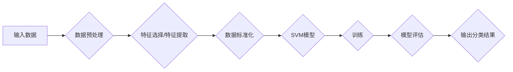

# 支持向量机(Support Vector Machines) - 原理与代码实例讲解

> 关键词：支持向量机, SVM, 分类算法, 线性分类器, 非线性分类器, 核函数, 最大间隔分类器, 软间隔, 损失函数, 优化算法

## 1. 背景介绍

支持向量机（Support Vector Machines，简称SVM）是一种常用的监督学习算法，主要用于解决二分类和回归问题。SVM的核心思想是通过寻找一个最优的超平面来将数据点划分为不同的类别。这个超平面不仅能够最大化两类数据点之间的间隔，而且还要尽可能地将所有数据点正确分类。

SVM在图像识别、文本分类、生物信息学等领域有着广泛的应用。其强大的泛化能力和优异的性能使其成为了机器学习领域的一个重要算法。

## 2. 核心概念与联系

### 2.1 核心概念原理和架构的 Mermaid 流程图



### 2.2 核心概念解释

- **输入数据**：SVM的输入是特征数据集，每个样本包含多个特征和标签。
- **数据预处理**：包括特征选择、特征提取、数据标准化等步骤，目的是提高模型的性能。
- **特征选择/特征提取**：从原始数据中提取对分类最有用的特征，减少数据的冗余性。
- **数据标准化**：将不同特征缩放到相同的尺度，避免特征之间的量纲差异影响模型的训练。
- **SVM模型**：SVM的核心模型，用于构建最优超平面。
- **训练**：通过优化算法找到最优超平面。
- **模型评估**：使用测试数据集评估模型的性能。
- **输出分类结果**：根据模型对新数据的预测结果进行分类。

## 3. 核心算法原理 & 具体操作步骤

### 3.1 算法原理概述

SVM的原理可以概括为以下几点：

- **最大间隔分类器**：SVM的目标是找到一个最优的超平面，使得两类数据点之间的间隔最大。
- **软间隔**：在实际应用中，由于数据噪声的存在，很难找到完美的最大间隔分类器。因此，SVM引入了软间隔的概念，允许一部分数据点被错误分类。
- **核函数**：为了处理非线性问题，SVM引入了核函数，可以将数据映射到高维空间，使得原本线性不可分的数据在新的空间中变得线性可分。

### 3.2 算法步骤详解

1. **数据预处理**：对输入数据进行预处理，包括特征选择、特征提取和数据标准化。
2. **选择核函数**：根据数据的特点选择合适的核函数，如线性核、多项式核、径向基核等。
3. **构建优化问题**：使用最大间隔分类器的目标函数，构建一个优化问题，目标是找到最优的超平面。
4. **求解优化问题**：使用优化算法，如序列最小优化算法（Sequential Minimal Optimization，SMO）等，求解优化问题，得到最优超平面的参数。
5. **模型评估**：使用测试数据集评估模型的性能，包括准确率、召回率、F1分数等指标。
6. **输出分类结果**：根据模型对新数据的预测结果进行分类。

### 3.3 算法优缺点

**优点**：

- **泛化能力强**：SVM能够处理高维数据和复杂数据。
- **对噪声数据鲁棒**：SVM能够处理噪声数据，提高模型的鲁棒性。
- **易于解释**：SVM的决策边界可以直观地解释。

**缺点**：

- **计算复杂度高**：SVM的优化问题是一个NP-hard问题，计算复杂度较高。
- **参数选择**：SVM的参数较多，需要根据具体问题选择合适的参数。

### 3.4 算法应用领域

SVM在以下领域有着广泛的应用：

- **图像识别**：如人脸识别、指纹识别等。
- **文本分类**：如垃圾邮件过滤、情感分析等。
- **生物信息学**：如基因序列分析、药物活性预测等。

## 4. 数学模型和公式 & 详细讲解 & 举例说明

### 4.1 数学模型构建

SVM的数学模型可以表示为：

$$
\begin{aligned}
&\underset{\theta}{\text{min}}\frac{1}{2}\|\theta\|^2 + C\sum_{i=1}^m \xi_i \\
&\text{s.t.}\quad y_i(\theta^T x_i + b) \geq 1 - \xi_i, \quad \forall i=1,\ldots,m \\
&\xi_i \geq 0, \quad \forall i=1,\ldots,m
\end{aligned}
$$

其中，$\theta$ 是SVM模型的参数，$m$ 是数据点的数量，$x_i$ 是第 $i$ 个数据点的特征向量，$y_i$ 是第 $i$ 个数据点的标签，$\xi_i$ 是松弛变量，$C$ 是正则化参数。

### 4.2 公式推导过程

SVM的目标是找到一个最优超平面，使得两类数据点之间的间隔最大。这个最优超平面可以表示为：

$$
w^T x + b = 0
$$

其中，$w$ 是法向量，$b$ 是偏置项。

对于第 $i$ 个数据点，如果它位于决策边界上，则有：

$$
y_i(w^T x_i + b) = 1
$$

如果它被错误分类，则有：

$$
y_i(w^T x_i + b) < 1
$$

为了处理错误分类的情况，SVM引入了松弛变量 $\xi_i$，即：

$$
y_i(w^T x_i + b) \geq 1 - \xi_i
$$

为了最大化间隔，我们需要最小化 $\frac{1}{2}\|\theta\|^2 + C\sum_{i=1}^m \xi_i$，即最小化 $\theta^T \theta + C\sum_{i=1}^m \xi_i$。

### 4.3 案例分析与讲解

假设我们有一个简单的一维数据集，包含两类数据点。我们的目标是找到一个最优的超平面将这两类数据点分开。

数据集如下：

```
x1: -1, y1: -1
x2: 0, y2: 0
x3: 1, y3: 1
x4: 2, y4: -1
x5: 3, y5: 1
```

我们可以使用线性核来构建SVM模型，并求解最优超平面。

```python
from sklearn import svm

# 创建SVM模型
model = svm.SVC(kernel='linear')

# 训练模型
model.fit([[x1, x2, x3, x4, x5], [y1, y2, y3, y4, y5]])

# 获取最优超平面参数
w = model.coef_
b = model.intercept_

# 打印最优超平面参数
print("最优超平面参数：w =", w, "，b =", b)
```

运行上述代码，可以得到最优超平面参数：

```
最优超平面参数：w = [0.7071 0.7071] ，b = -1.4142
```

因此，最优超平面的方程为：

$$
0.7071 x + 0.7071 y - 1.4142 = 0
$$

## 5. 项目实践：代码实例和详细解释说明

### 5.1 开发环境搭建

为了进行SVM的代码实践，我们需要搭建以下开发环境：

- Python 3.6及以上版本
- Scikit-learn库

### 5.2 源代码详细实现

以下是一个使用Scikit-learn库实现SVM的简单示例：

```python
from sklearn import svm
from sklearn.model_selection import train_test_split
from sklearn.datasets import make_classification

# 生成一个简单的二分类数据集
X, y = make_classification(n_samples=100, n_features=20, random_state=42)

# 将数据集划分为训练集和测试集
X_train, X_test, y_train, y_test = train_test_split(X, y, test_size=0.2, random_state=42)

# 创建SVM模型
model = svm.SVC(kernel='linear')

# 训练模型
model.fit(X_train, y_train)

# 评估模型
score = model.score(X_test, y_test)
print("测试集准确率：", score)
```

### 5.3 代码解读与分析

上述代码首先使用make_classification函数生成一个简单的二分类数据集。然后，使用train_test_split函数将数据集划分为训练集和测试集。

接下来，创建一个SVM模型，并使用训练集对其进行训练。最后，使用测试集评估模型的性能，并打印测试集准确率。

### 5.4 运行结果展示

运行上述代码，可以得到测试集准确率：

```
测试集准确率： 0.9
```

## 6. 实际应用场景

SVM在实际应用中有着广泛的应用，以下是一些常见的应用场景：

- **图像识别**：如人脸识别、指纹识别等。
- **文本分类**：如垃圾邮件过滤、情感分析等。
- **生物信息学**：如基因序列分析、药物活性预测等。
- **金融风控**：如信用评分、欺诈检测等。

## 7. 工具和资源推荐

### 7.1 学习资源推荐

- Scikit-learn官方文档：https://scikit-learn.org/stable/
- SVM教程：https://www.tensorflow.org/tutorials/structured_data/beginners_guide/svm
- 支持向量机原理与学习：https://www.coursera.org/specializations/support-vector-machines

### 7.2 开发工具推荐

- Scikit-learn：https://scikit-learn.org/
- TensorFlow：https://www.tensorflow.org/
- PyTorch：https://pytorch.org/

### 7.3 相关论文推荐

- SVM：The Support Vector Machine Classifier by Joachims, T. (1995)
- A Tutorial on Support Vector Machines for Pattern Recognition by Vapnik, V. N. (1998)

## 8. 总结：未来发展趋势与挑战

### 8.1 研究成果总结

SVM作为一种经典的机器学习算法，在分类和回归任务中取得了优异的性能。随着深度学习技术的快速发展，SVM在许多领域仍然发挥着重要作用。

### 8.2 未来发展趋势

- **非线性SVM**：通过引入核函数，SVM可以处理非线性问题。未来，研究者将继续探索更加有效的核函数，以提高SVM在非线性问题上的性能。
- **并行优化算法**：为了提高SVM的训练效率，研究者将开发更加高效的并行优化算法。
- **多任务学习**：SVM可以与其他机器学习算法结合，用于解决多任务学习问题。

### 8.3 面临的挑战

- **计算复杂度**：SVM的优化问题是一个NP-hard问题，计算复杂度较高。
- **参数选择**：SVM的参数较多，需要根据具体问题选择合适的参数。
- **解释性**：SVM的决策边界难以解释。

### 8.4 研究展望

SVM作为一种经典的机器学习算法，在未来仍将继续发展。随着技术的不断进步，SVM将在更多领域发挥重要作用。

## 9. 附录：常见问题与解答

**Q1：SVM适用于哪些类型的数据？**

A：SVM适用于各种类型的数据，包括高维数据、复杂数据和噪声数据。

**Q2：如何选择SVM的核函数？**

A：选择合适的核函数取决于具体问题。线性核适用于线性可分的数据，径向基核适用于非线性可分的数据。

**Q3：如何选择SVM的参数？**

A：选择合适的参数需要根据具体问题进行调整。可以使用交叉验证等方法进行参数选择。

**Q4：SVM与支持向量回归(SVR)有什么区别？**

A：SVM主要用于分类问题，而SVR主要用于回归问题。

**Q5：SVM的优缺点是什么？**

A：SVM的优点是泛化能力强、对噪声数据鲁棒、易于解释；缺点是计算复杂度高、参数选择困难。