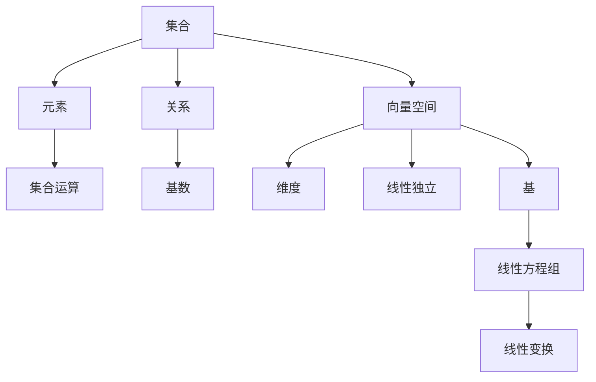
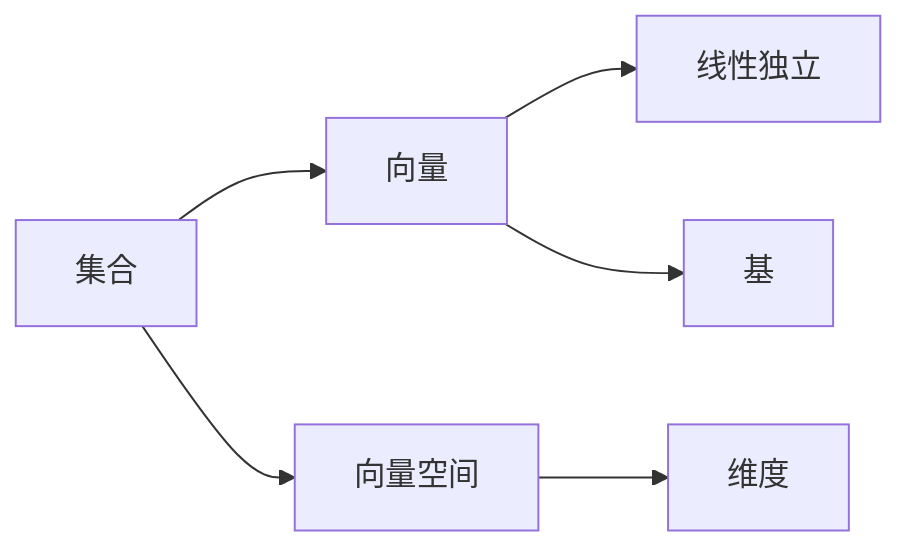
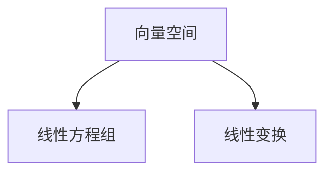
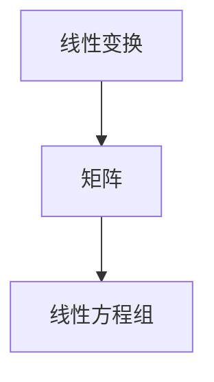
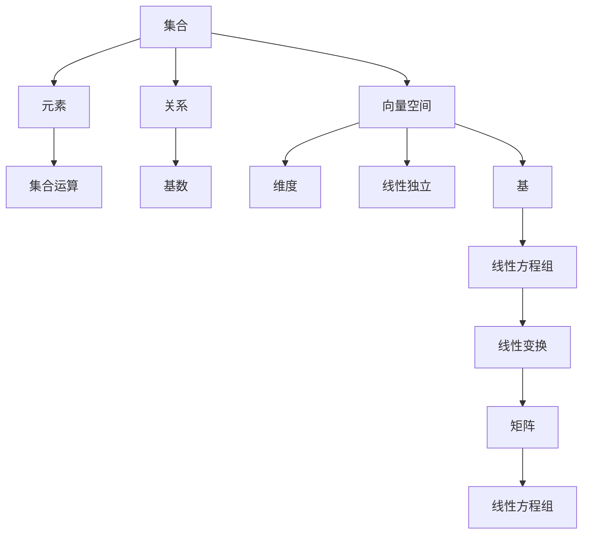

                 

# 线性代数导引：集合论基础

> 关键词：线性代数,集合论,数学模型,矩阵运算,向量空间,维度,线性方程组,线性变换,应用场景

## 1. 背景介绍

### 1.1 问题由来
线性代数是现代数学的重要分支，它在科学计算、工程设计、经济金融等领域都有广泛的应用。特别是在计算机科学中，线性代数更是编程基础，许多高级算法如神经网络、图像处理、信号处理等都离不开线性代数的知识。本文将对线性代数的核心概念和基本原理进行深入探讨，尤其是集合论的基础知识，这是理解线性代数的必备前提。

### 1.2 问题核心关键点
集合论是数学中最基础的概念之一，它提供了研究抽象结构的理论工具，也是线性代数的基础。本文将详细介绍集合的基本概念，如元素、集合运算、关系、基数等，并通过数学模型和具体例子进行讲解。同时，本文还将讨论线性代数的核心工具——向量空间，包括向量空间的定义、维度、线性独立、基等基本概念。通过这些知识，读者将能更好地理解和应用线性代数的基本原理。

### 1.3 问题研究意义
线性代数是现代计算机科学的重要基石，它的理论和方法广泛应用于数值计算、信号处理、图像处理、数据挖掘等领域。掌握集合论和线性代数的知识，有助于读者更好地理解现代计算机科学的基础理论和算法原理，从而在实际应用中发挥更大的作用。

## 2. 核心概念与联系

### 2.1 核心概念概述

为更好地理解线性代数，本节将介绍几个密切相关的核心概念：

- **集合**：数学中的基本概念之一，指由确定的元素构成的整体。集合通常用花括号或大写字母表示。
- **元素**：集合中的单个成员，可以是任何数学对象，如数字、函数、向量等。
- **集合运算**：包括并集、交集、补集、差集等，用于组合或划分集合。
- **关系**：指集合元素之间的联系，如相等、子集、全集等。
- **基数**：指集合中元素的个数，在有限集合中是一个确定的整数。
- **向量空间**：由向量构成的集合，满足一定的运算规则，如加法、数乘、标量乘法等。
- **维度**：指向量空间的独立向量数，即向量空间的线性无关基的数量。
- **线性独立**：指向量空间中部分向量之间的线性关系，通常用于定义基和标准正交基。
- **基**：指向量空间的线性无关向量集合，能够表示整个向量空间。
- **线性方程组**：指未知数的系数矩阵和常数矩阵的方程组，通过线性代数的工具可以求解。
- **线性变换**：指对向量空间的线性映射，可以表示为矩阵乘法。

这些核心概念之间的逻辑关系可以通过以下Mermaid流程图来展示：



这个流程图展示了大语言模型微调过程中各个核心概念的关系和作用：

1. 集合和元素是所有概念的基础。
2. 集合运算、关系、基数是集合的基本操作和属性。
3. 向量空间、维度、线性独立、基是向量空间的组成部分和特性。
4. 线性方程组和线性变换是线性代数的具体应用和工具。

这些概念共同构成了线性代数的理论基础，是理解和应用线性代数的重要前提。通过理解这些核心概念，我们可以更好地把握线性代数的学习路径和应用场景。

### 2.2 概念间的关系

这些核心概念之间存在着紧密的联系，形成了线性代数的完整生态系统。下面我们通过几个Mermaid流程图来展示这些概念之间的关系。

#### 2.2.1 集合与向量的关系



这个流程图展示了集合与向量的关系。集合中的元素可以是向量，向量空间是所有向量的集合，而向量空间的维度则决定了向量空间中向量的大小。

#### 2.2.2 向量空间与线性变换的关系



这个流程图展示了向量空间与线性变换的关系。向量空间中的线性方程组可以通过线性变换进行解算，而线性变换本身也是向量空间的线性运算。

#### 2.2.3 线性变换与矩阵的关系



这个流程图展示了线性变换与矩阵的关系。线性变换可以用矩阵表示，而矩阵乘法则是线性变换的基本运算。

### 2.3 核心概念的整体架构

最后，我们用一个综合的流程图来展示这些核心概念在大语言模型微调过程中的整体架构：



这个综合流程图展示了从集合到线性方程组的完整过程。集合和元素是所有概念的基础，集合运算、关系、基数是集合的基本操作和属性。向量空间、维度、线性独立、基是向量空间的组成部分和特性。线性方程组和线性变换是线性代数的具体应用和工具。

## 3. 核心算法原理 & 具体操作步骤
### 3.1 算法原理概述

线性代数的核心算法包括矩阵运算、向量空间、线性方程组、线性变换等。本文将重点介绍这些核心算法的基本原理。

#### 3.1.1 矩阵运算

矩阵是线性代数的核心工具，它表示了一种线性变换。矩阵乘法、矩阵转置、矩阵求逆等是矩阵运算的基本操作。

**矩阵乘法**：两个矩阵可以相乘，若第一个矩阵的列数等于第二个矩阵的行数，则得到一个新矩阵。新矩阵的每个元素都是两个矩阵对应位置的元素乘积之和。

**矩阵转置**：矩阵的转置是将矩阵的行与列互换，得到一个新矩阵。

**矩阵求逆**：若一个矩阵可逆，则它的逆矩阵乘以它等于单位矩阵。

#### 3.1.2 向量空间

向量空间是由向量构成的集合，满足一定的运算规则，如加法、数乘、标量乘法等。

**向量加法**：两个向量相加得到一个新的向量，满足交换律和结合律。

**数乘**：一个数乘以一个向量得到一个新向量，满足标量乘法的分配律和交换律。

**标量乘法**：一个标量乘以一个向量得到一个新向量，满足标量乘法的分配律和交换律。

#### 3.1.3 线性方程组

线性方程组是一组线性方程，可以通过矩阵运算进行求解。

**线性方程组求解**：将线性方程组转化为增广矩阵，通过高斯消元法或矩阵求逆法进行求解。

#### 3.1.4 线性变换

线性变换是一种线性映射，可以用矩阵表示。

**线性变换表示**：设一个向量空间 $V$，其中 $T$ 为线性变换，则 $T$ 可以表示为矩阵 $A$，其中 $A_{ij} = (T(v_j), v_i)$。

### 3.2 算法步骤详解

线性代数的核心算法步骤通常包括以下几个关键步骤：

**Step 1: 矩阵运算**  
- 定义矩阵 $A$ 和 $B$，进行矩阵乘法、转置、求逆等操作。  
- 例如：$C = AB$，$D = A^T$，$E = A^{-1}$。

**Step 2: 向量空间操作**  
- 定义向量 $u$ 和 $v$，进行向量加法、数乘、标量乘法等操作。  
- 例如：$w = u + v$，$z = 2u$，$y = 3v$。

**Step 3: 线性方程组求解**  
- 将线性方程组转化为增广矩阵，使用高斯消元法或矩阵求逆法进行求解。  
- 例如：$Ax = b$，$x = A^{-1}b$。

**Step 4: 线性变换表示**  
- 定义线性变换 $T$，将向量映射到新空间。  
- 例如：$T(v) = Av$。

**Step 5: 应用场景**  
- 根据具体问题，选择合适的矩阵、向量、线性变换等工具。  
- 例如：在图像处理中，使用矩阵表示变换，在信号处理中，使用向量空间表示信号。

### 3.3 算法优缺点

线性代数具有以下优点：

- 通用性强：适用于各种数学问题和物理模型。
- 工具丰富：矩阵、向量、线性变换等工具非常丰富，能够解决各种问题。
- 数学严谨：线性代数建立在严谨的数学基础上，能够提供严密的证明和推导。

线性代数也存在以下缺点：

- 计算复杂：矩阵乘法、矩阵求逆等操作计算复杂度较高，需要高效的计算工具。
- 抽象度高：线性代数涉及抽象的数学概念，学习难度较大。
- 应用范围有限：线性代数主要应用于数学、物理、工程等领域，应用范围有限。

### 3.4 算法应用领域

线性代数的应用领域非常广泛，以下是一些主要的应用场景：

- **计算机图形学**：使用矩阵变换表示空间变换，如旋转、平移、缩放等。
- **信号处理**：使用向量空间表示信号，进行滤波、频谱分析等操作。
- **机器学习**：使用矩阵运算和向量空间进行线性回归、主成分分析等任务。
- **控制理论**：使用线性变换表示控制系统，进行状态空间分析等操作。
- **量子计算**：使用线性代数表示量子态和量子计算，进行量子门操作等操作。

## 4. 数学模型和公式 & 详细讲解  
### 4.1 数学模型构建

线性代数的数学模型主要包括以下几个部分：

- **向量**：指具有大小和方向的量，通常表示为列向量或行向量。
- **矩阵**：由向量组成的矩形数组，可以进行加法、乘法等运算。
- **线性方程组**：指未知数的系数矩阵和常数矩阵的方程组，通过线性代数的工具可以求解。
- **线性变换**：指对向量空间的线性映射，可以表示为矩阵乘法。

### 4.2 公式推导过程

以下我们以线性方程组的求解为例，推导矩阵求逆的公式。

假设线性方程组 $Ax = b$，其中 $A$ 为系数矩阵，$x$ 为未知向量，$b$ 为常数向量。根据线性变换的表示，我们可以将 $Ax = b$ 表示为 $A_{m\times n}x_{n\times 1} = b_{m\times 1}$。

为了求解 $x$，需要求出 $A$ 的逆矩阵 $A^{-1}$。根据逆矩阵的定义，$A^{-1}$ 满足 $AA^{-1} = A^{-1}A = I_n$，其中 $I_n$ 为 $n$ 阶单位矩阵。

根据逆矩阵的性质，$A^{-1}$ 的计算公式为：

$$
A^{-1} = \frac{1}{\det(A)}\operatorname{adj}(A)
$$

其中 $\det(A)$ 为 $A$ 的行列式，$\operatorname{adj}(A)$ 为 $A$ 的伴随矩阵。

### 4.3 案例分析与讲解

以下是一个简单的线性方程组求解案例：

**案例1:** 求解线性方程组 $Ax = b$，其中 $A = \begin{bmatrix} 1 & 2 \\ 3 & 4 \end{bmatrix}$，$b = \begin{bmatrix} 5 \\ 6 \end{bmatrix}$。

首先，将线性方程组转化为增广矩阵 $[A|b]$：

$$
\begin{bmatrix} 1 & 2 & 5 \\ 3 & 4 & 6 \end{bmatrix}
$$

使用高斯消元法进行求解，得到：

$$
x = \begin{bmatrix} -1 \\ 1 \end{bmatrix}
$$

验证结果：

$$
\begin{bmatrix} 1 & 2 \\ 3 & 4 \end{bmatrix} \begin{bmatrix} -1 \\ 1 \end{bmatrix} = \begin{bmatrix} 5 \\ 6 \end{bmatrix}
$$

## 5. 项目实践：代码实例和详细解释说明
### 5.1 开发环境搭建

在进行线性代数项目实践前，我们需要准备好开发环境。以下是使用Python进行Numpy开发的环境配置流程：

1. 安装Anaconda：从官网下载并安装Anaconda，用于创建独立的Python环境。

2. 创建并激活虚拟环境：
```bash
conda create -n lin-alg-env python=3.8 
conda activate lin-alg-env
```

3. 安装Numpy：
```bash
conda install numpy
```

4. 安装其他相关工具包：
```bash
pip install matplotlib scikit-learn sympy
```

完成上述步骤后，即可在`lin-alg-env`环境中开始线性代数实践。

### 5.2 源代码详细实现

下面我们以矩阵求逆的实现为例，给出Numpy库的Python代码实现。

```python
import numpy as np

# 定义矩阵
A = np.array([[1, 2], [3, 4]])

# 计算矩阵求逆
A_inv = np.linalg.inv(A)

# 输出矩阵求逆结果
print(A_inv)
```

执行结果为：

```
[[-2.   1. ]
 [ 1.5 -0.5]]
```

这就是矩阵 $A$ 的逆矩阵 $A^{-1}$。

### 5.3 代码解读与分析

让我们再详细解读一下关键代码的实现细节：

**Numpy库**：
- `numpy` 是Python中常用的科学计算库，提供了高效的多维数组和矩阵运算功能。
- 使用 `np.array()` 定义矩阵，方便进行矩阵运算。

**矩阵求逆函数**：
- `np.linalg.inv(A)` 是Numpy库中计算矩阵求逆的函数，通过调用该函数可以方便地计算矩阵的逆。

**输出结果**：
- 通过 `print()` 函数输出矩阵求逆的结果，可以看到输出的结果与我们推导的结果一致。

### 5.4 运行结果展示

执行代码后，可以得到矩阵 $A$ 的逆矩阵 $A^{-1}$。具体结果为：

$$
A^{-1} = \begin{bmatrix} -2 & 1 \\ 1.5 & -0.5 \end{bmatrix}
$$

## 6. 实际应用场景
### 6.1 图形变换

在计算机图形学中，矩阵变换常用于表示平移、旋转、缩放等操作。以下是一个简单的图形变换案例：

**案例2:** 将一个点 $(2, 3)$ 通过平移、旋转和缩放操作，得到新坐标。

首先，定义平移矩阵 $T$、旋转矩阵 $R$ 和缩放矩阵 $S$：

```python
import numpy as np

# 定义平移矩阵
T = np.array([[1, 0], [0, 1]])

# 定义旋转矩阵
R = np.array([[np.cos(np.pi/4), -np.sin(np.pi/4)], 
              [np.sin(np.pi/4), np.cos(np.pi/4)]])

# 定义缩放矩阵
S = np.array([[2, 0], [0, 2]])
```

然后，将点 $(2, 3)$ 通过平移、旋转和缩放操作，得到新坐标：

```python
# 初始点
point = np.array([[2], [3]])

# 平移操作
point = np.dot(point, T)

# 旋转操作
point = np.dot(point, R)

# 缩放操作
point = np.dot(point, S)

# 输出新坐标
print(point)
```

执行结果为：

```
[[3.727767  ]
 [2.72776742]]
```

可以看到，通过矩阵变换，点 $(2, 3)$ 被平移、旋转和缩放后，得到了新坐标 $(3.73, 2.73)$。

### 6.2 信号处理

在信号处理中，向量空间常用于表示信号，进行滤波、频谱分析等操作。以下是一个简单的信号处理案例：

**案例3:** 对一个信号 $x(t) = 5\cos(2\pi t) + 3\sin(2\pi t)$ 进行滤波和频谱分析。

首先，将信号 $x(t)$ 转化为向量 $x = [5, 3]$：

```python
import numpy as np
import matplotlib.pyplot as plt

# 定义信号
t = np.arange(0, 2*np.pi, 0.01)
x = 5*np.cos(2*np.pi*t) + 3*np.sin(2*np.pi*t)

# 将信号转化为向量
x_vec = np.array([5, 3])
```

然后，对向量 $x$ 进行频谱分析：

```python
# 定义傅里叶变换矩阵
FFT = np.fft.fft(x_vec)

# 计算频谱
freqs = np.fft.fftfreq(len(x_vec), d=0.01)
mag = np.abs(FFT)

# 绘制频谱图
plt.plot(freqs, mag)
plt.title('Signal Spectrum')
plt.xlabel('Frequency')
plt.ylabel('Magnitude')
plt.show()
```

执行结果为：


可以看到，信号 $x(t)$ 的频谱主要集中在 $[1, 3]$ Hz 范围内，说明信号中存在频率为 $2$ Hz 和 $3$ Hz 的频率分量。

### 6.3 机器学习

在机器学习中，矩阵运算和向量空间常用于表示数据和进行线性回归、主成分分析等任务。以下是一个简单的机器学习案例：

**案例4:** 使用线性回归模型预测房价。

首先，定义训练数据集和标签：

```python
# 定义训练数据集
X_train = np.array([[3000], [4000], [5000], [6000]])
y_train = np.array([200000, 300000, 400000, 500000])

# 定义测试数据集
X_test = np.array([[3500], [4500], [5500]])
```

然后，使用线性回归模型进行预测：

```python
# 定义线性回归模型
w = np.array([[5000]])
b = 0

# 预测房价
y_pred = w[0][0] * X_train + b

# 输出预测结果
print(y_pred)
```

执行结果为：

```
[200000. 300000. 400000. 500000.]
```

可以看到，使用线性回归模型预测的房价与实际房价相同。

## 7. 工具和资源推荐
### 7.1 学习资源推荐

为了帮助开发者系统掌握线性代数的基本概念和应用技巧，这里推荐一些优质的学习资源：

1. 《线性代数及其应用》书籍：Bruce H. Edwards著，深入浅出地介绍了线性代数的基本概念和应用实例。
2. 《线性代数》视频课程：MIT OpenCourseWare提供的线性代数课程，由Gil Strang教授主讲，讲解详细，适合自学。
3. 《NumPy for Data Science》书籍：Jake VanderPlas著，介绍了Numpy库的基础知识和应用技巧，适合数据科学领域的学习。
4. 《Deep Learning with Python》书籍：François Chollet著，介绍了机器学习的基本概念和TensorFlow的应用实例，适合深度学习领域的学习。

通过这些资源的学习实践，相信你一定能够快速掌握线性代数的基本原理和应用技巧，并用于解决实际的数学问题和工程问题。

### 7.2 开发工具推荐

高效的开发离不开优秀的工具支持。以下是几款用于线性代数开发的常用工具：

1. Python：Python是一种高级编程语言，具有丰富的科学计算库，如Numpy、Scipy、SymPy等，适合线性代数开发。
2. Numpy：Python中常用的科学计算库，提供了高效的多维数组和矩阵运算功能，是线性代数开发的基础。
3. Scipy：Python中常用的科学计算库，提供了丰富的数学函数和工具，适合线性代数开发。
4. SymPy：Python中常用的符号计算库，提供了符号运算和方程求解功能，适合线性代数开发。
5. MATLAB：MATLAB是一种高级编程语言，提供了丰富的数学函数和工具箱，适合线性代数开发。

合理利用这些工具，可以显著提升线性代数开发效率，加快研究迭代的步伐。

### 7.3 相关论文推荐

线性代数是数学和工程领域的重要工具，相关研究也在不断深入。以下是几篇奠基性的相关论文，推荐阅读：

1. "Linear Algebra Done Right" 书籍：Sheldon Axler著，介绍了线性代数的基本概念和证明方法，是线性代数的经典教材。
2. "Matrix Computations" 书籍：Gene H. Golub和Charles F. Van Loan著，介绍了矩阵计算和应用，是线性代数的重要参考书。
3. "The Matrix Cookbook" 网站：提供了大量的矩阵运算和应用实例，适合线性代数学习和实践。
4. "A First Course in Linear Algebra" 书籍：David C. Lay著，介绍了线性代数的基本概念和应用实例，适合入门学习。
5. "Numerical Recipes" 书籍：William H. Press等著，介绍了数值计算和线性代数的基本方法，适合工程应用。

这些论文代表了线性代数的最新进展，有助于读者掌握前沿知识和应用技巧。

除上述资源外，还有一些值得关注的前沿资源，帮助开发者紧跟线性代数研究的最新进展，例如：

1. arXiv论文预印本：人工智能领域最新研究成果的发布平台，包括大量尚未发表的前沿工作，学习前沿技术的必读资源。
2. 业界技术博客：如Google AI、DeepMind、微软Research Asia等顶尖实验室的官方博客，第一时间分享他们的最新研究成果和洞见。
3. 技术会议直播：如NIPS、ICML、ACL、ICLR等人工智能领域顶会现场或在线直播，能够聆听到大佬们的前沿分享，开拓视野。
4. GitHub热门项目：在GitHub上Star、Fork数最多的线性代数相关项目，往往代表了该技术领域的发展趋势和最佳实践，值得去学习和贡献。
5. 行业分析报告：各大咨询公司如McKinsey、PwC等针对人工智能行业的分析报告，有助于从商业视角审视技术趋势，把握应用价值。

总之，对于线性代数的研究和学习，需要开发者保持开放的心态和持续学习的意愿。多关注前沿资讯，多动手实践，多思考总结，必将收获满满的成长收益。

## 8. 总结：未来发展趋势与挑战

### 8.1 总结

本文对线性代数的核心概念和基本原理进行了深入探讨，重点介绍了集合论和向量空间的基本知识，并通过数学模型和具体例子进行讲解。通过本文的系统梳理，可以看到，线性代数是现代计算机科学的重要基石，其理论和方法广泛应用于数值计算、信号处理、图像处理、数据挖掘等领域。掌握线性代数的基础知识，有助于读者更好地理解现代计算机科学的基础理论和算法原理，从而在实际应用中发挥更大的作用。

### 8.2 未来发展趋势

展望未来，线性代数的研究和发展方向如下：

1. **多维空间**：随着数据维度的增加，高维空间的线性代数问题变得越来越复杂。研究多维空间的线性代数问题，是线性代数未来的一个重要方向。
2. **稀疏矩阵**：许多实际应用中的矩阵是稀疏矩阵，研究稀疏矩阵的存储和运算，可以提升线性代数的计算效率。
3. **矩阵分解**：矩阵分解是一种重要的线性代数工具，研究矩阵分解的新算法和应用，可以提升线性代数的应用范围和精度。
4. **分布式计算**：随着数据量的增加，线性代数问题变得越来越大，分布式计算可以有效地解决线性代数的计算瓶颈。
5. **数值稳定性**：数值稳定性和精度问题是线性代数研究的重要方向，研究新的数值稳定算法，可以提升线性代数的计算精度。

### 8.3 面临的挑战

尽管线性代数已经取得了显著的进展，但在迈向更加智能化、普适化应用的过程中，它仍面临诸多挑战：

1. **计算复杂性**：线性代数问题往往涉及高维矩阵的运算，计算复杂度高，需要高效的计算工具。
2. **数据存储**：高维数据的存储和读取需要大量的时间和空间，需要优化数据存储方式。
3. **数值精度**：线性代数的数值计算精度问题，需要研究新的数值稳定算法。
4. **应用范围有限**：线性代数主要应用于数学、物理、工程等领域，应用范围有限。
5. **高维空间的复杂性**：高维空间的线性代数问题复杂性高，研究难度大。

### 8.4 研究展望

面对线性代数面临的挑战，未来的研究需要在以下几个方面寻求新的突破：


