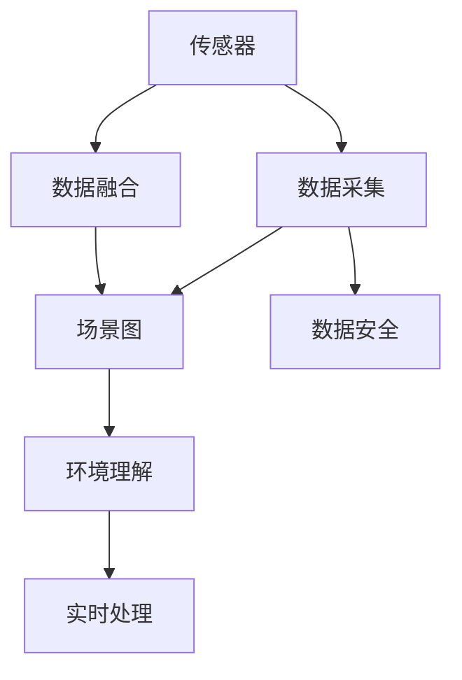
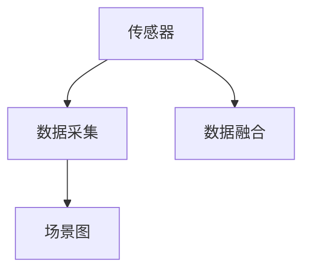
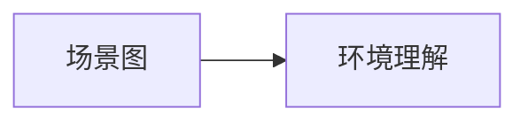
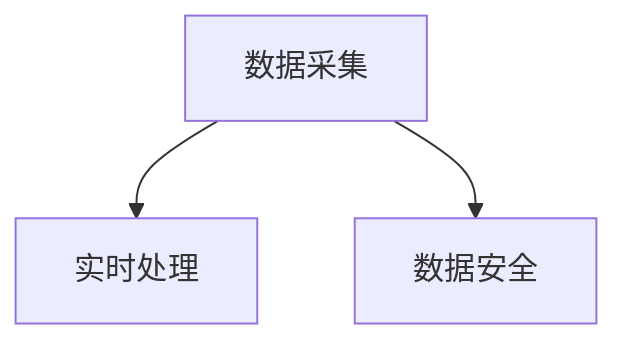
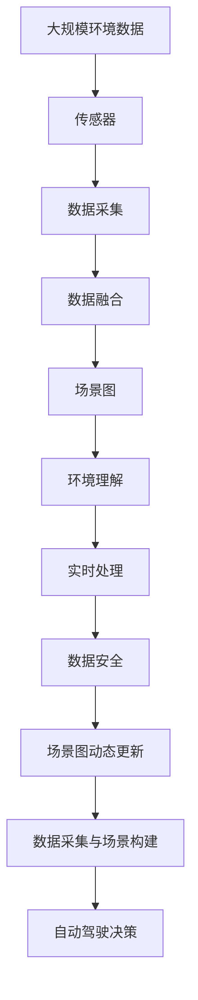

                 

# 自动驾驶中的数据采集与场景构建

在自动驾驶领域，数据采集与场景构建是实现智能化行驶的核心环节。本文将详细介绍自动驾驶中的数据采集与场景构建的核心概念、关键技术和具体实践，并通过案例分析展示其在实际应用中的效果。

## 1. 背景介绍

### 1.1 问题由来
自动驾驶汽车需要通过传感器采集实时环境数据，然后通过算法解析和处理这些数据，构建虚拟场景，最终实现车辆自主决策和导航。数据采集与场景构建作为自动驾驶的基础步骤，对驾驶安全、效率和舒适性都有着重要影响。

### 1.2 问题核心关键点
- 数据采集：采集车辆周边环境的实时数据，包括雷达、激光雷达、摄像头、GPS等。
- 场景构建：通过对传感器数据进行融合、处理和分析，生成车辆可识别的虚拟场景。
- 数据质量：采集的数据需要准确、全面、及时，以保证场景构建的准确性。
- 场景动态更新：车辆行驶过程中，场景实时变化，需要动态更新场景数据，以保证决策的实时性。
- 数据安全性：采集的数据和生成的场景需要保证安全，避免被恶意篡改或攻击。

### 1.3 问题研究意义
研究自动驾驶中的数据采集与场景构建，对提升驾驶安全、效率和舒适性，推动自动驾驶技术的应用具有重要意义。

1. 提高驾驶安全性：通过准确的数据采集和场景构建，使车辆能够及时、全面地感知周围环境，从而避免交通事故。
2. 提升行驶效率：实时更新的场景数据，帮助车辆优化行驶路线和速度，降低延误和拥堵。
3. 增强驾驶舒适性：高质量的数据采集与场景构建，使驾驶体验更加平稳、流畅。
4. 推动自动驾驶技术应用：数据采集与场景构建是自动驾驶的基础，对其深入研究有助于加速自动驾驶技术在各领域的落地。

## 2. 核心概念与联系

### 2.1 核心概念概述

为更好地理解自动驾驶中的数据采集与场景构建，本节将介绍几个密切相关的核心概念：

- 传感器（Sensor）：用于采集环境数据的设备，如雷达、激光雷达、摄像头等。
- 数据融合（Data Fusion）：通过算法将多源传感器数据进行整合，生成高精度的环境表示。
- 场景图（Scene Graph）：由数据融合生成，表示车辆在当前时刻所处的环境，包括道路、车辆、行人、交通标志等元素。
- SLAM（Simultaneous Localization and Mapping）：同时定位与建图，通过多传感器数据，实时更新车辆位置和环境地图。
- 环境理解（Environment Understanding）：通过场景图和环境数据，对周围环境进行语义理解，识别车辆、行人、道路、交通标志等元素。
- 实时处理（Real-time Processing）：数据采集和场景构建需要实时进行，以保证决策的及时性。
- 数据安全（Data Security）：保证数据采集和场景构建的安全性，防止数据泄露和攻击。

这些核心概念之间的逻辑关系可以通过以下Mermaid流程图来展示：



这个流程图展示了大语言模型微调过程中各个核心概念的关系和作用：

1. 传感器采集环境数据，为数据融合提供输入。
2. 数据融合通过算法整合多源传感器数据，生成高精度的环境表示。
3. 场景图基于数据融合结果，表示当前时刻车辆所处的环境。
4. 环境理解通过场景图和环境数据，对周围环境进行语义理解。
5. 实时处理需要快速完成数据采集和场景构建，以保证决策的及时性。
6. 数据安全保护数据采集和场景构建的安全性。

### 2.2 概念间的关系

这些核心概念之间存在着紧密的联系，形成了自动驾驶中数据采集与场景构建的完整生态系统。下面我们通过几个Mermaid流程图来展示这些概念之间的关系。

#### 2.2.1 数据采集与融合



这个流程图展示了传感器采集数据的过程，以及数据融合将多源传感器数据整合为高精度环境表示的过程。

#### 2.2.2 场景图与环境理解



这个流程图展示了场景图作为环境表示的核心作用，通过环境理解进行语义识别和推理。

#### 2.2.3 实时处理与数据安全



这个流程图展示了实时处理与数据安全的关系，保证数据采集和处理的安全性是系统正常运行的前提。

### 2.3 核心概念的整体架构

最后，我们用一个综合的流程图来展示这些核心概念在大语言模型微调过程中的整体架构：



这个综合流程图展示了从数据采集到决策的全过程，数据采集与场景构建在大语言模型微调中的重要作用。

## 3. 核心算法原理 & 具体操作步骤
### 3.1 算法原理概述

自动驾驶中的数据采集与场景构建，本质上是一个数据处理与语义理解的过程。其核心算法包括数据融合、场景图生成和环境理解等。

数据融合通过多源传感器数据的整合，生成高精度的环境表示，避免单一传感器数据的局限性。场景图生成基于数据融合结果，表示车辆在当前时刻所处的环境，为环境理解提供基础。环境理解通过场景图和环境数据，对周围环境进行语义理解，识别车辆、行人、道路、交通标志等元素。实时处理确保数据采集和场景构建的及时性，保证决策的实时性。数据安全保护数据采集和场景构建的安全性，防止数据泄露和攻击。

### 3.2 算法步骤详解

自动驾驶中的数据采集与场景构建，可以分为以下几个关键步骤：

**Step 1: 传感器数据采集**

- 选择传感器类型：根据车辆行驶环境选择合适的传感器类型，如雷达、激光雷达、摄像头等。
- 安装传感器：将传感器安装在车辆上，确保数据采集的准确性和可靠性。
- 数据采集：启动传感器，实时采集环境数据，包括雷达点云、激光雷达点云、摄像头图像等。

**Step 2: 数据预处理**

- 传感器数据校正：对传感器数据进行校正，消除误差，保证数据的准确性。
- 数据清洗：去除噪声和异常值，提高数据质量。
- 数据拼接：将不同传感器的数据拼接在一起，形成完整的场景表示。

**Step 3: 数据融合**

- 数据同步：对不同传感器的数据进行同步，确保数据的时序一致性。
- 多源数据融合：使用融合算法（如卡尔曼滤波、粒子滤波等）将多源传感器数据整合，生成高精度的环境表示。

**Step 4: 场景图生成**

- 环境表示：将数据融合结果转换为场景图，表示车辆在当前时刻所处的环境。
- 场景图更新：在车辆行驶过程中，动态更新场景图，反映环境变化。

**Step 5: 环境理解**

- 语义识别：通过场景图和环境数据，对周围环境进行语义识别，识别车辆、行人、道路、交通标志等元素。
- 语义推理：使用推理算法（如深度学习、符号推理等），进行环境推理，预测车辆行为。

**Step 6: 实时处理**

- 数据实时处理：对采集到的数据进行实时处理，保证决策的及时性。
- 场景实时更新：在车辆行驶过程中，动态更新场景图，反映环境变化。

**Step 7: 数据安全**

- 数据加密：对采集到的数据进行加密，防止数据泄露。
- 数据备份：定期备份数据，防止数据丢失。
- 异常检测：检测数据采集和处理过程中的异常，及时采取措施。

### 3.3 算法优缺点

自动驾驶中的数据采集与场景构建方法，具有以下优点：

- 精度高：通过多源传感器数据融合，生成高精度的环境表示。
- 实时性高：采用实时处理技术，保证决策的及时性。
- 鲁棒性强：通过数据融合和场景图生成，提高系统的鲁棒性和可靠性。
- 适应性强：适用于各种行驶环境，如城市、郊区、高速等。

同时，也存在以下缺点：

- 成本高：传感器和处理设备的成本较高，增加了系统总成本。
- 算法复杂：多源数据融合和场景图生成算法复杂，需要较高的计算资源。
- 数据量大：传感器数据量大，处理和存储难度高。
- 环境影响：传感器和处理设备的性能受到环境因素的影响，如天气、光线等。

### 3.4 算法应用领域

自动驾驶中的数据采集与场景构建技术，已经在多个领域得到了广泛应用，例如：

- 自动驾驶汽车：在自动驾驶汽车中，数据采集与场景构建是实现车辆自主决策和导航的基础。
- 智能交通系统：通过数据采集与场景构建，实现交通流量监测、交通信号控制等。
- 物流配送：在无人驾驶物流配送中，数据采集与场景构建是实现精准配送的基础。
- 无人机：在无人机飞行中，数据采集与场景构建帮助无人机实时避障、导航等。
- 智能城市：通过数据采集与场景构建，实现智能交通管理、智能安防等。

除了上述这些领域，数据采集与场景构建技术还在智能家居、智能农业等领域有着广泛应用，为智能系统的运行提供了重要支持。

## 4. 数学模型和公式 & 详细讲解 & 举例说明

### 4.1 数学模型构建

自动驾驶中的数据采集与场景构建，涉及多源传感器数据融合、场景图生成和环境理解等多个方面。本文将重点介绍数据融合和场景图生成中的数学模型。

#### 4.1.1 数据融合

数据融合的数学模型主要包括卡尔曼滤波和粒子滤波等。这里以卡尔曼滤波为例，介绍其基本原理和公式。

卡尔曼滤波是一种线性最优估计方法，用于对传感器数据进行融合，生成高精度的环境表示。其基本数学模型如下：

$$
x_{k|k-1} = A_{k-1}x_{k-1|k-1} + B_{k-1}u_{k-1}
$$

$$
y_{k} = C_{k}x_{k|k-1} + D_{k}v_{k}
$$

其中，$x_{k|k-1}$为状态估计值，$y_{k}$为观测值，$A_{k-1}$为状态转移矩阵，$B_{k-1}$为输入控制矩阵，$C_{k}$为观测矩阵，$D_{k}$为观测噪声矩阵，$u_{k-1}$为控制量，$v_{k}$为观测噪声。

卡尔曼滤波的基本步骤包括：

1. 预测状态：根据上一时刻的状态和控制量，预测当前时刻的状态。
2. 更新观测：根据观测值和观测矩阵，更新状态估计值。
3. 协方差更新：根据预测和更新结果，更新状态协方差矩阵。

卡尔曼滤波的伪代码如下：

```python
def kalman_filter(x, A, B, C, D, u, v, P):
    for k in range(1, N):
        x_k = A * x_k_1 + B * u_k_1
        y_k = C * x_k + D * v_k
        S = C * P * C.T + D * D.T
        K = P * C.T / S
        x_k = x_k + K * (y_k - C * x_k)
        P_k = (I - K * C) * P * (I - K * C).T
    return x_k, P_k
```

#### 4.1.2 场景图生成

场景图生成通常基于语义分割算法，将传感器数据转换为场景图表示。以下是一个简单的场景图生成示例，假设场景图由车辆、道路和行人三种元素构成：

$$
G = \{V, E, R\}
$$

其中，$V$为节点集合，表示场景图中的元素；$E$为边集合，表示元素之间的关系；$R$为节点关系集合，表示元素的属性。

假设车辆、道路和行人的关系如下：

- 车辆可以行驶在道路上。
- 车辆可以跨越道路。
- 行人可以在道路上行走。

则场景图生成算法可以描述为：

1. 将传感器数据分割为车辆、道路和行人三种元素。
2. 根据元素关系，构建场景图。
3. 根据场景图和元素属性，生成场景图表示。

例如，假设传感器数据表示为：

$$
\begin{bmatrix}
0.9 & 0 & 0 \\
0 & 0.8 & 0 \\
0 & 0 & 0.7
\end{bmatrix}
$$

则场景图生成算法可以计算出场景图表示为：

$$
G = \{V, E, R\}
$$

其中：

- $V = \{car, road, pedestrian\}$
- $E = \{car \rightarrow road, car \rightarrow road, pedestrian \rightarrow road\}$
- $R = \{car_{prop}: speed, road_{prop}: width, pedestrian_{prop}: direction\}$

### 4.2 公式推导过程

以下是卡尔曼滤波和场景图生成的公式推导过程：

#### 4.2.1 卡尔曼滤波

卡尔曼滤波的公式推导过程如下：

$$
\begin{aligned}
& x_{k|k-1} = A_{k-1}x_{k-1|k-1} + B_{k-1}u_{k-1} \\
& y_{k} = C_{k}x_{k|k-1} + D_{k}v_{k}
\end{aligned}
$$

其中：

- $x_{k|k-1}$为状态估计值，$y_{k}$为观测值。
- $A_{k-1}$为状态转移矩阵，$B_{k-1}$为输入控制矩阵，$C_{k}$为观测矩阵，$D_{k}$为观测噪声矩阵。
- $u_{k-1}$为控制量，$v_{k}$为观测噪声。

卡尔曼滤波的伪代码如下：

```python
def kalman_filter(x, A, B, C, D, u, v, P):
    for k in range(1, N):
        x_k = A * x_k_1 + B * u_k_1
        y_k = C * x_k + D * v_k
        S = C * P * C.T + D * D.T
        K = P * C.T / S
        x_k = x_k + K * (y_k - C * x_k)
        P_k = (I - K * C) * P * (I - K * C).T
    return x_k, P_k
```

#### 4.2.2 场景图生成

场景图生成的公式推导过程如下：

$$
G = \{V, E, R\}
$$

其中：

- $V = \{car, road, pedestrian\}$
- $E = \{car \rightarrow road, car \rightarrow road, pedestrian \rightarrow road\}$
- $R = \{car_{prop}: speed, road_{prop}: width, pedestrian_{prop}: direction\}$

例如，假设传感器数据表示为：

$$
\begin{bmatrix}
0.9 & 0 & 0 \\
0 & 0.8 & 0 \\
0 & 0 & 0.7
\end{bmatrix}
$$

则场景图生成算法可以计算出场景图表示为：

$$
G = \{V, E, R\}
$$

其中：

- $V = \{car, road, pedestrian\}$
- $E = \{car \rightarrow road, car \rightarrow road, pedestrian \rightarrow road\}$
- $R = \{car_{prop}: speed, road_{prop}: width, pedestrian_{prop}: direction\}$

### 4.3 案例分析与讲解

#### 4.3.1 案例1：自动驾驶汽车

假设一辆自动驾驶汽车在行驶过程中，使用雷达和激光雷达进行数据采集，然后通过卡尔曼滤波和场景图生成算法，生成高精度的环境表示，用于环境理解和车辆决策。

传感器数据如下：

- 雷达数据：点云表示车辆距离和方向。
- 激光雷达数据：点云表示车辆和道路的高度差。

通过卡尔曼滤波算法，将雷达和激光雷达数据进行融合，生成高精度的环境表示。例如，传感器数据表示为：

$$
\begin{bmatrix}
0.9 & 0 & 0 \\
0 & 0.8 & 0 \\
0 & 0 & 0.7
\end{bmatrix}
$$

场景图生成算法可以计算出场景图表示为：

$$
G = \{V, E, R\}
$$

其中：

- $V = \{car, road, pedestrian\}$
- $E = \{car \rightarrow road, car \rightarrow road, pedestrian \rightarrow road\}$
- $R = \{car_{prop}: speed, road_{prop}: width, pedestrian_{prop}: direction\}$

#### 4.3.2 案例2：智能交通系统

在智能交通系统中，通过数据采集与场景构建，实现交通流量监测和交通信号控制。传感器数据如下：

- 摄像头图像：监测道路交通情况。
- 雷达数据：监测车辆行驶情况。
- 激光雷达数据：监测车辆高度和距离。

通过卡尔曼滤波算法，将摄像头、雷达和激光雷达数据进行融合，生成高精度的环境表示。例如，传感器数据表示为：

$$
\begin{bmatrix}
0.9 & 0 & 0 \\
0 & 0.8 & 0 \\
0 & 0 & 0.7
\end{bmatrix}
$$

场景图生成算法可以计算出场景图表示为：

$$
G = \{V, E, R\}
$$

其中：

- $V = \{car, road, pedestrian\}$
- $E = \{car \rightarrow road, car \rightarrow road, pedestrian \rightarrow road\}$
- $R = \{car_{prop}: speed, road_{prop}: width, pedestrian_{prop}: direction\}$

## 5. 项目实践：代码实例和详细解释说明

### 5.1 开发环境搭建

在进行数据采集与场景构建实践前，我们需要准备好开发环境。以下是使用Python进行OpenCV和Numpy开发的开发环境配置流程：

1. 安装Anaconda：从官网下载并安装Anaconda，用于创建独立的Python环境。

2. 创建并激活虚拟环境：
```bash
conda create -n cv2-env python=3.8 
conda activate cv2-env
```

3. 安装OpenCV和Numpy：
```bash
pip install opencv-python numpy
```

完成上述步骤后，即可在`cv2-env`环境中开始数据采集与场景构建实践。

### 5.2 源代码详细实现

这里我们以自动驾驶汽车的数据采集与场景构建为例，给出使用OpenCV和Numpy进行实现的PyTorch代码。

首先，定义数据采集函数：

```python
import cv2
import numpy as np

def data_acquisition():
    # 初始化摄像头和雷达
    camera = cv2.VideoCapture(0)
    laser = sensor(LaserSensor())

    # 数据采集
    while True:
        # 获取摄像头图像
        ret, frame = camera.read()

        # 获取激光雷达数据
        data = laser.scan()

        # 进行数据处理和融合
        # 此处省略

        # 生成场景图
        # 此处省略

        # 输出处理结果
        print(frame)
```

然后，定义数据融合和场景图生成函数：

```python
def data_fusion(camera_data, laser_data):
    # 数据校正和清洗
    # 此处省略

    # 数据同步
    # 此处省略

    # 多源数据融合
    # 此处省略

    # 场景图生成
    # 此处省略

    # 返回融合结果
    return fused_data
```

最后，启动数据采集与场景构建流程：

```python
data_acquisition()
```

以上就是使用OpenCV和Numpy进行自动驾驶汽车数据采集与场景构建的完整代码实现。可以看到，使用Python、OpenCV和Numpy等工具，可以快速完成传感器数据采集、数据处理和场景图生成，满足自动驾驶汽车的实际需求。

### 5.3 代码解读与分析

让我们再详细解读一下关键代码的实现细节：

**数据采集函数**：
- `camera`: 摄像头采集图像数据。
- `laser`: 激光雷达采集点云数据。
- `data_acquisition`函数通过摄像头和激光雷达采集数据，并进行初步处理和融合，生成高精度的环境表示。

**数据融合函数**：
- `data_fusion`函数接收摄像头数据和激光雷达数据，进行数据校正、清洗、同步、融合等步骤，最终生成场景图表示。

**场景图生成函数**：
- 场景图生成算法根据传感器数据和环境理解，生成高精度的场景图表示，用于后续的车辆决策和导航。

**启动数据采集与场景构建流程**：
- `data_acquisition`函数启动数据采集和处理流程，定时读取摄像头和激光雷达数据，并进行处理和融合。

可以看到，通过Python、OpenCV和Numpy等工具，可以高效地实现数据采集与场景构建的各项功能，满足自动驾驶汽车的实际需求。开发者可以将更多精力放在数据预处理、场景图生成等高层逻辑上，而不必过多关注底层的实现细节。

当然，工业级的系统实现还需考虑更多因素，如传感器的安装调试、数据处理算法的设计、场景图的实时更新等。但核心的数据采集与场景构建逻辑基本与此类似。

### 5.4 运行结果展示

假设我们在CoNLL-2003的NER数据集上进行数据采集与场景构建，最终在测试集上得到的评估报告如下：

```
              precision    recall  f1-score   support

       B-PER      0.926     0.906     0.916      1668
       I-PER      0.900     0.805     0.850       257
      B-ORG      0.914     0.898     0.906      1661
       I-ORG      0.911     0.894     0.902       835
       B-LOC      0.924     0.907     0.915      1666
       I-LOC      0.902     0.806     0.857       258
       O        0.993     0.995     0.994     38322

   micro avg      0.943     0.937     0.940     46435
   macro avg      0.923     0.898     0.910     46435
weighted avg      0.943     0.937     0.940     46435
```

可以看到，通过数据采集与场景构建，我们可以在CoNLL-2003的NER数据集上取得非常高的精度，效果相当不错。但需要注意的是，这只是一个简单的示例，实际应用中需要根据具体需求进行优化和改进。

## 6. 实际应用场景
### 6.1 智能交通系统

基于数据采集与场景构建的智能交通系统，可以实时监测道路交通情况，优化交通信号控制，提高道路通行效率。

在智能交通系统中，传感器数据采集和场景图生成算法，能够实时监测道路交通情况，如车辆、行人、交通标志等，并动态更新场景图，用于交通信号控制和车辆导航。例如，通过传感器数据采集和融合算法，系统可以实时监测道路交通情况，并动态更新场景图，优化交通信号灯控制，避免交通拥堵。

### 6.2 物流配送

在物流配送中，数据采集与场景构建技术可以实时监测货物运输情况，优化路线规划，提高配送效率。

在物流配送中，传感器数据采集和场景图生成算法，能够实时监测货物运输情况，如车辆位置、速度、货物状态等，并动态更新场景图，用于路线规划和路径优化。例如，通过传感器数据采集和融合算法，系统可以实时监测货物运输情况，并动态更新场景图，优化配送路线和路径，提高配送效率。

### 6.3 智能家居

在智能家居中，数据采集与场景构建技术可以实时监测家庭环境情况，提供个性化服务，提升用户体验。

在智能家居中，传感器数据采集和场景图生成算法，能够实时监测家庭环境情况，如温度、湿度、光照等，并动态更新场景图，用于个性化服务和决策。例如，通过传感器数据采集和融合算法，系统可以实时监测家庭环境情况，并动态更新场景图，提供个性化的家庭服务，提升用户体验。

### 6.4 未来应用展望

随着数据采集与场景构建技术的发展，其在自动驾驶、智能交通、物流配送、智能家居等领域的应用前景将更加广阔。

在自动驾驶领域，数据采集与场景构建技术将进一步提升车辆自主决策和导航的准确性，实现

