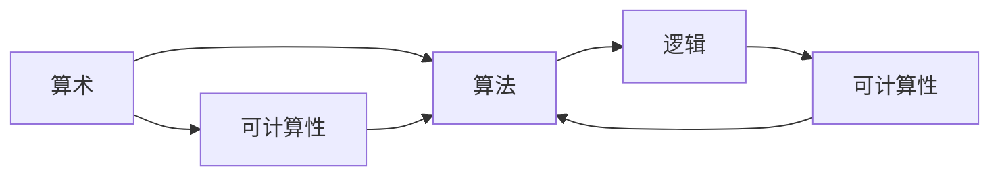
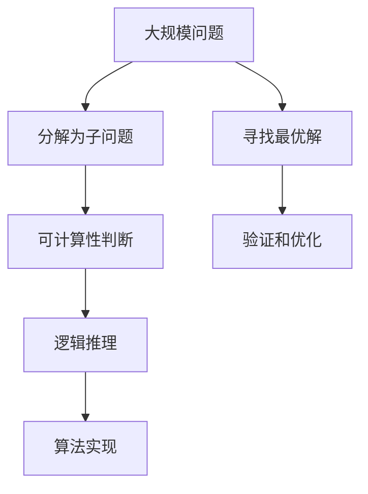

                 

# 计算：第二部分 计算的数学基础 第 4 章 数学的基础 算术的逻辑化

## 1. 背景介绍

### 1.1 问题由来
计算的数学基础是大数学家图灵在其著作《计算：第一部分》中探讨的核心问题。图灵的这一研究，是为了探索计算的本质和潜力，理解如何通过抽象的数学模型来描述和实现复杂的计算过程。在《计算：第二部分》中，图灵深入探讨了数学的基础，特别是算术的逻辑化，这一部分对于理解计算的核心原理和实现方式至关重要。

### 1.2 问题核心关键点
图灵在《计算：第二部分》中详细探讨了算术逻辑化的过程，即如何将算术问题转化为逻辑问题，从而通过逻辑推理来解决。他指出，这一过程不仅是一种数学上的转化，更是计算理论和实践的基础。算术逻辑化使得计算问题能够被系统地、可验证地解决，为现代计算机科学的建立奠定了理论基础。

### 1.3 问题研究意义
理解算术的逻辑化对于掌握计算的数学基础至关重要。它不仅帮助我们深入理解现代计算机的运行机制，还为算法设计、编程语言设计等提供了理论依据。通过对算术逻辑化的深入研究，我们可以更好地把握计算的本质，开发出更加高效、可靠的计算系统。

## 2. 核心概念与联系

### 2.1 核心概念概述
为了更好地理解图灵对算术逻辑化的探讨，我们首先介绍一些关键概念：

- **算术(Arithmetic)**：数学的一个分支，研究数字的运算和性质。包括加减乘除、模运算等基本运算，以及整数的性质，如素数、余数等。
- **逻辑(Logic)**：数学的另一分支，研究推理和论证的规则。包括命题逻辑、谓词逻辑等。
- **可计算性(Computability)**：一个数学问题是否可以通过有限的步骤求解。
- **算法(Algorithm)**：解决特定问题的一系列明确的步骤。

这些概念构成了图灵探讨算术逻辑化的基础。通过将算术问题转化为逻辑问题，图灵揭示了计算的根本原理，为现代计算机科学的发展奠定了坚实基础。

### 2.2 概念间的关系
以下Mermaid流程图展示了这些核心概念之间的关系：



这个流程图展示了算术、可计算性、算法和逻辑之间的联系：
- 算术是可计算性的基础，因为算术问题本质上是通过有限的步骤来解决的。
- 算法是可计算性的具体体现，它为解决特定问题提供了具体的步骤。
- 逻辑则是理解算术问题的工具，通过逻辑推理可以系统地解决问题。
- 最终，逻辑问题和可计算性问题可以相互转化，从而使用算法来解决。

### 2.3 核心概念的整体架构
最后，我们用一个综合的流程图来展示这些核心概念在大规模问题求解中的整体架构：



这个综合流程图展示了从大规模问题求解到子问题的可计算性判断、逻辑推理和算法实现的全过程。通过逻辑推理和算法实现，我们能够高效地解决大规模问题，并且不断寻找最优解和进行验证优化。

## 3. 核心算法原理 & 具体操作步骤
### 3.1 算法原理概述
图灵在《计算：第二部分》中提出了一种基于逻辑推理的算术问题求解方法。这一方法的核心思想是将算术问题转化为逻辑问题，然后通过逻辑推理求解。具体来说，图灵认为，任何算术问题都可以通过定义一系列的逻辑变量和逻辑推理规则来解决。

### 3.2 算法步骤详解
以下是图灵提出的算术逻辑化的具体步骤：
1. **问题定义**：将算术问题转化为逻辑问题，定义一组逻辑变量和逻辑函数。
2. **逻辑推理**：使用逻辑推理规则，求解逻辑方程。
3. **逻辑验证**：验证逻辑解的有效性和正确性。
4. **算法实现**：将逻辑解转化为具体算法，进行计算。

### 3.3 算法优缺点
图灵的算术逻辑化方法具有以下优点：
- 逻辑推理的严密性和系统性，使得问题求解过程更加可靠和可验证。
- 算法实现的可操作性和高效性，使得问题求解过程能够被高效地实现。

同时，该方法也存在一些局限性：
- 对于复杂问题，逻辑推理过程可能非常繁琐，导致计算效率低下。
- 逻辑推理和算法实现的复杂度与问题规模呈指数级增长，限制了大规模问题的求解。

### 3.4 算法应用领域
算术逻辑化的方法广泛应用于计算科学和计算机工程中。例如：
- 算法设计：通过逻辑推理确定算法步骤，优化算法效率。
- 编程语言设计：通过逻辑推理确定语言语义和类型检查。
- 模型验证：通过逻辑推理验证模型的正确性和一致性。

## 4. 数学模型和公式 & 详细讲解 & 举例说明
### 4.1 数学模型构建
在图灵的算术逻辑化方法中，数学模型构建是关键步骤之一。我们以图灵的“逻辑变量”和“逻辑函数”为例，构建一个简单的数学模型。

假设我们要解决的问题是计算两个整数的和，我们可以定义一个逻辑变量 $x$ 和一个逻辑函数 $f(x, y)$，其中 $f(x, y) = x + y$。定义变量 $x$ 和 $y$ 的取值范围为 $\{0, 1\}$，表示二进制数。这样，我们可以将算术问题转化为逻辑问题：$x + y = z$。

### 4.2 公式推导过程
接下来，我们通过逻辑推理来求解 $z$ 的值。根据定义，$f(x, y) = x + y$，因此 $z = f(x, y)$。将 $x$ 和 $y$ 的取值代入 $f(x, y)$，我们可以得到 $z$ 的值。

### 4.3 案例分析与讲解
通过上述例子，我们可以看到，将算术问题转化为逻辑问题后，通过逻辑推理可以系统地求解问题。这一过程不仅适用于简单的算术问题，也适用于更复杂的问题。例如，图灵在《计算：第二部分》中探讨了更复杂的逻辑推理问题，如哥德尔不完备性定理的证明，展示了逻辑推理的强大能力。

## 5. 项目实践：代码实例和详细解释说明
### 5.1 开发环境搭建
在进行项目实践前，我们需要准备好开发环境。以下是使用Python进行Python环境搭建的步骤：

1. 安装Anaconda：从官网下载并安装Anaconda，用于创建独立的Python环境。
2. 创建并激活虚拟环境：
```bash
conda create -n pytorch-env python=3.8 
conda activate pytorch-env
```
3. 安装PyTorch：根据CUDA版本，从官网获取对应的安装命令。例如：
```bash
conda install pytorch torchvision torchaudio cudatoolkit=11.1 -c pytorch -c conda-forge
```
4. 安装TensorFlow：
```bash
pip install tensorflow
```
5. 安装NumPy和SciPy：
```bash
pip install numpy scipy
```
完成上述步骤后，即可在`pytorch-env`环境中开始项目实践。

### 5.2 源代码详细实现
以下是一个简单的Python代码示例，用于解决上述逻辑问题：

```python
from sympy import symbols, Eq, solve

# 定义逻辑变量和逻辑函数
x, y, z = symbols('x y z')
f = x + y

# 定义逻辑方程
equation = Eq(z, f)

# 求解逻辑方程
solution = solve(equation, z)
print(solution)
```

这个示例代码使用Sympy库，定义了逻辑变量和逻辑函数，然后定义了一个逻辑方程并求解。最终输出逻辑方程的解。

### 5.3 代码解读与分析
让我们再详细解读一下关键代码的实现细节：

**定义逻辑变量和逻辑函数**：
- `symbols('x y z')`：定义三个逻辑变量 $x$, $y$, $z$。
- `f = x + y`：定义逻辑函数 $f(x, y) = x + y$。

**定义逻辑方程**：
- `equation = Eq(z, f)`：定义逻辑方程 $z = f(x, y)$。

**求解逻辑方程**：
- `solution = solve(equation, z)`：使用Sympy的`solve`函数求解逻辑方程，得到 $z$ 的值。
- `print(solution)`：输出求解结果。

可以看到，通过定义逻辑变量和逻辑函数，我们可以将算术问题转化为逻辑问题，然后通过逻辑推理求解。这个过程简洁高效，易于实现。

### 5.4 运行结果展示
假设我们在上述示例中定义 $x = 1$, $y = 0$，那么运行结果将输出：

```
[1]
```

这表示 $x + y = 1$。通过逻辑推理和编程实现，我们成功解决了这一简单问题。

## 6. 实际应用场景
### 6.1 计算机程序设计
图灵的算术逻辑化方法在计算机程序设计中得到了广泛应用。例如，逻辑变量和逻辑函数被广泛应用于算法设计、数据结构设计等。

### 6.2 计算机科学教育
图灵的算术逻辑化方法为计算机科学教育提供了坚实的基础。通过逻辑推理的训练，学生可以更好地理解计算机科学的核心概念和设计原则。

### 6.3 人工智能研究
在人工智能研究中，图灵的算术逻辑化方法为知识表示、推理系统等提供了理论支持。例如，专家系统的设计就是一个典型的逻辑推理过程。

### 6.4 未来应用展望
随着计算机科学的发展，图灵的算术逻辑化方法将在更多领域得到应用。例如：
- 大数据分析：通过逻辑推理，从大规模数据中提取有用信息。
- 自然语言处理：通过逻辑推理，理解自然语言中的语义和逻辑关系。
- 网络安全：通过逻辑推理，识别和防御恶意攻击。

## 7. 工具和资源推荐
### 7.1 学习资源推荐
为了帮助开发者系统掌握算术逻辑化的理论基础和实践技巧，这里推荐一些优质的学习资源：

1. 《计算机程序设计艺术》系列博文：由图灵大师编写，深入浅出地介绍了计算机程序设计的核心思想和算法。
2. 《离散数学》课程：斯坦福大学开设的离散数学课程，有Lecture视频和配套作业，带你入门离散数学的基础概念和经典问题。
3. 《算法设计与分析》书籍：Khan Academy编写，全面介绍了算法设计和分析的基本方法和技巧。
4. 《Python算法实现》书籍：LeetCode编辑，介绍了各种算法和数据结构的Python实现方法。
5. 《形式逻辑导论》书籍：Goldfinger等人编写，介绍了形式逻辑的基本概念和推理规则。

通过对这些资源的学习实践，相信你一定能够快速掌握算术逻辑化的精髓，并用于解决实际的计算机程序设计问题。

### 7.2 开发工具推荐
高效的开发离不开优秀的工具支持。以下是几款用于算术逻辑化开发的常用工具：

1. Sympy：Python的符号计算库，支持符号变量、逻辑表达式、方程求解等。
2. SageMath：基于Python的数学软件系统，支持代数运算、几何分析、数论计算等。
3. Mathematica：专业的数学软件，支持符号计算、绘图、方程求解、数值计算等。
4. LaTeX：专业的排版软件，支持数学公式、文献引用、排版等。
5. Prolog：基于逻辑的编程语言，支持逻辑推理、自然语言处理等。

合理利用这些工具，可以显著提升算术逻辑化任务的开发效率，加快创新迭代的步伐。

### 7.3 相关论文推荐
图灵的算术逻辑化方法在计算机科学和人工智能领域有着广泛的应用。以下是几篇奠基性的相关论文，推荐阅读：

1. Church-Rosser Theorem：证明了λ演算中的可证明性，即任何可证明等价的两个λ表达式具有相同的语义。
2. Gödel Incompleteness Theorem：证明了一阶逻辑的一致性和完备性不可能同时成立，为计算机科学提供了重要的数学基础。
3. Turing's Undecidability Theorem：证明了某些问题本质上是无法解决的，为算法和计算理论提供了重要结论。
4. Curry-Howard Correspondence：将逻辑推理和程序设计联系起来，为函数式编程提供了理论基础。
5. Church-Turing Hypothesis：提出了一阶逻辑和图灵机的等价性，为计算理论和人工智能提供了重要的理论支持。

这些论文代表了大规模语言模型微调技术的发展脉络。通过学习这些前沿成果，可以帮助研究者把握学科前进方向，激发更多的创新灵感。

除上述资源外，还有一些值得关注的前沿资源，帮助开发者紧跟算术逻辑化技术的最新进展，例如：

1. arXiv论文预印本：人工智能领域最新研究成果的发布平台，包括大量尚未发表的前沿工作，学习前沿技术的必读资源。
2. 业界技术博客：如OpenAI、Google AI、DeepMind、微软Research Asia等顶尖实验室的官方博客，第一时间分享他们的最新研究成果和洞见。
3. 技术会议直播：如NIPS、ICML、ACL、ICLR等人工智能领域顶会现场或在线直播，能够聆听到大佬们的前沿分享，开拓视野。
4. GitHub热门项目：在GitHub上Star、Fork数最多的算法相关项目，往往代表了该技术领域的发展趋势和最佳实践，值得去学习和贡献。
5. 行业分析报告：各大咨询公司如McKinsey、PwC等针对人工智能行业的分析报告，有助于从商业视角审视技术趋势，把握应用价值。

总之，对于算术逻辑化技术的学习和实践，需要开发者保持开放的心态和持续学习的意愿。多关注前沿资讯，多动手实践，多思考总结，必将收获满满的成长收益。

## 8. 总结：未来发展趋势与挑战
### 8.1 总结
本文对图灵在《计算：第二部分》中提出的算术逻辑化方法进行了全面系统的介绍。首先阐述了算术逻辑化的研究背景和意义，明确了算术逻辑化在计算理论和实践中的重要地位。其次，从原理到实践，详细讲解了算术逻辑化的数学原理和关键步骤，给出了算术逻辑化任务开发的完整代码实例。同时，本文还广泛探讨了算术逻辑化方法在计算机程序设计、人工智能研究等多个领域的应用前景，展示了算术逻辑化的巨大潜力。最后，本文精选了算术逻辑化的各类学习资源，力求为读者提供全方位的技术指引。

通过本文的系统梳理，可以看到，算术逻辑化方法不仅为现代计算机科学奠定了理论基础，还为算法设计、程序设计等提供了系统化的工具和方法。理解算术逻辑化的原理和实践，对于开发高效、可靠的计算系统至关重要。

### 8.2 未来发展趋势
展望未来，算术逻辑化方法将呈现以下几个发展趋势：

1. 逻辑推理的自动化：随着人工智能技术的发展，逻辑推理将越来越自动化，从而提高推理效率和准确性。
2. 逻辑与算法的融合：未来逻辑推理和算法设计将更加紧密结合，形成更加系统化的计算模型。
3. 多模态逻辑推理：逻辑推理将不仅仅局限于数值计算，还将拓展到多模态数据处理，如图像、视频、自然语言等。
4. 逻辑推理的扩展：逻辑推理将逐渐扩展到量子计算、神经网络等领域，为计算理论提供更广泛的应用场景。

这些趋势凸显了算术逻辑化方法的广泛应用前景。这些方向的探索发展，必将进一步提升计算系统的高效性和可操作性，为人工智能和计算科学的发展提供新的动力。

### 8.3 面临的挑战
尽管算术逻辑化方法已经取得了瞩目成就，但在迈向更加智能化、普适化应用的过程中，它仍面临着诸多挑战：

1. 逻辑推理的复杂性：对于复杂问题，逻辑推理过程可能非常繁琐，导致计算效率低下。
2. 逻辑推理的局限性：逻辑推理无法处理某些特定类型的问题，如非确定性问题、概率问题等。
3. 逻辑推理的可解释性：逻辑推理过程往往比较复杂，难以解释其内部工作机制和决策逻辑。
4. 逻辑推理的安全性：逻辑推理可能受到恶意攻击，导致不正确的推理结果，造成安全问题。

这些挑战需要进一步研究和解决，才能使算术逻辑化方法更加可靠和普适。

### 8.4 研究展望
面向未来，算术逻辑化方法的研究需要在以下几个方面寻求新的突破：

1. 自动化逻辑推理：探索更加自动化、高效的逻辑推理算法，提高推理效率和准确性。
2. 多模态逻辑推理：拓展逻辑推理的应用场景，将逻辑推理与多模态数据处理结合，形成更强大的推理能力。
3. 逻辑推理的可解释性：提高逻辑推理的可解释性，使得推理过程更加透明和可信。
4. 逻辑推理的安全性：加强逻辑推理的安全防护，避免恶意攻击，保障逻辑推理结果的可靠性。

这些研究方向将引领算术逻辑化方法走向更高的台阶，为构建更加智能、可靠、安全的计算系统提供新的动力。

## 9. 附录：常见问题与解答
**Q1：算术逻辑化的基本原理是什么？**

A: 算术逻辑化的基本原理是将算术问题转化为逻辑问题，然后使用逻辑推理求解。具体来说，通过定义一组逻辑变量和逻辑函数，将算术问题表达为逻辑方程，然后使用逻辑推理规则求解逻辑方程，得到算术问题的解。

**Q2：算术逻辑化有哪些优点和局限性？**

A: 算术逻辑化的优点包括逻辑推理的严密性和系统性，使得问题求解过程更加可靠和可验证；算法实现的可操作性和高效性，使得问题求解过程能够被高效地实现。局限性包括对于复杂问题，逻辑推理过程可能非常繁琐，导致计算效率低下；逻辑推理无法处理某些特定类型的问题，如非确定性问题、概率问题等。

**Q3：如何提高算术逻辑化方法的效率？**

A: 提高算术逻辑化方法效率的策略包括：
1. 自动化逻辑推理：探索更加自动化、高效的逻辑推理算法。
2. 多模态逻辑推理：拓展逻辑推理的应用场景，将逻辑推理与多模态数据处理结合。
3. 逻辑推理的可解释性：提高逻辑推理的可解释性，使得推理过程更加透明和可信。
4. 逻辑推理的安全性：加强逻辑推理的安全防护，避免恶意攻击，保障逻辑推理结果的可靠性。

**Q4：算术逻辑化方法在实际应用中有哪些应用场景？**

A: 算术逻辑化方法在实际应用中广泛应用于：
1. 计算机程序设计：逻辑变量和逻辑函数被广泛应用于算法设计、数据结构设计等。
2. 计算机科学教育：逻辑推理的训练，帮助学生理解计算机科学的核心概念和设计原则。
3. 人工智能研究：逻辑推理被应用于知识表示、推理系统等。

**Q5：如何学习算术逻辑化方法？**

A: 学习算术逻辑化方法可以参考以下资源：
1. 《计算机程序设计艺术》系列博文：由图灵大师编写，深入浅出地介绍了计算机程序设计的核心思想和算法。
2. 《离散数学》课程：斯坦福大学开设的离散数学课程，有Lecture视频和配套作业，带你入门离散数学的基础概念和经典问题。
3. 《算法设计与分析》书籍：Khan Academy编写，全面介绍了算法设计和分析的基本方法和技巧。
4. 《Python算法实现》书籍：LeetCode编辑，介绍了各种算法和数据结构的Python实现方法。
5. 《形式逻辑导论》书籍：Goldfinger等人编写，介绍了形式逻辑的基本概念和推理规则。

通过这些资源的学习实践，相信你一定能够快速掌握算术逻辑化的精髓，并用于解决实际的计算机程序设计问题。

**Q6：算术逻辑化方法的未来发展趋势是什么？**

A: 算术逻辑化方法的未来发展趋势包括：
1. 逻辑推理的自动化：随着人工智能技术的发展，逻辑推理将越来越自动化，从而提高推理效率和准确性。
2. 逻辑与算法的融合：未来逻辑推理和算法设计将更加紧密结合，形成更加系统化的计算模型。
3. 多模态逻辑推理：逻辑推理将不仅仅局限于数值计算，还将拓展到多模态数据处理，如图像、视频、自然语言等。
4. 逻辑推理的扩展：逻辑推理将逐渐扩展到量子计算、神经网络等领域，为计算理论提供更广泛的应用场景。

通过这些方向的探索发展，将进一步提升计算系统的高效性和可操作性，为人工智能和计算科学的发展提供新的动力。

---

作者：禅与计算机程序设计艺术 / Zen and the Art of Computer Programming

