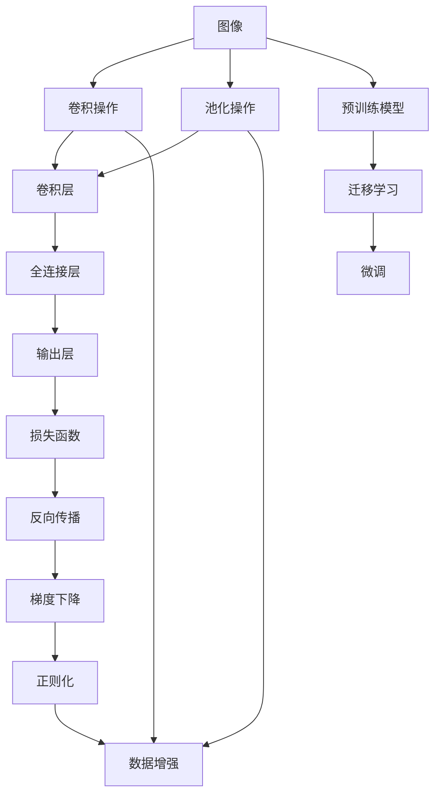
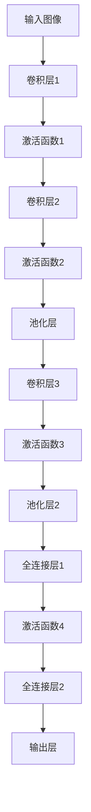
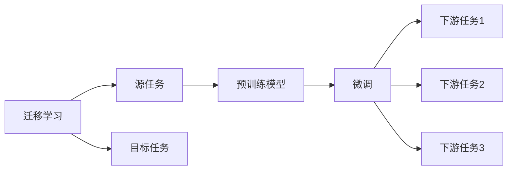
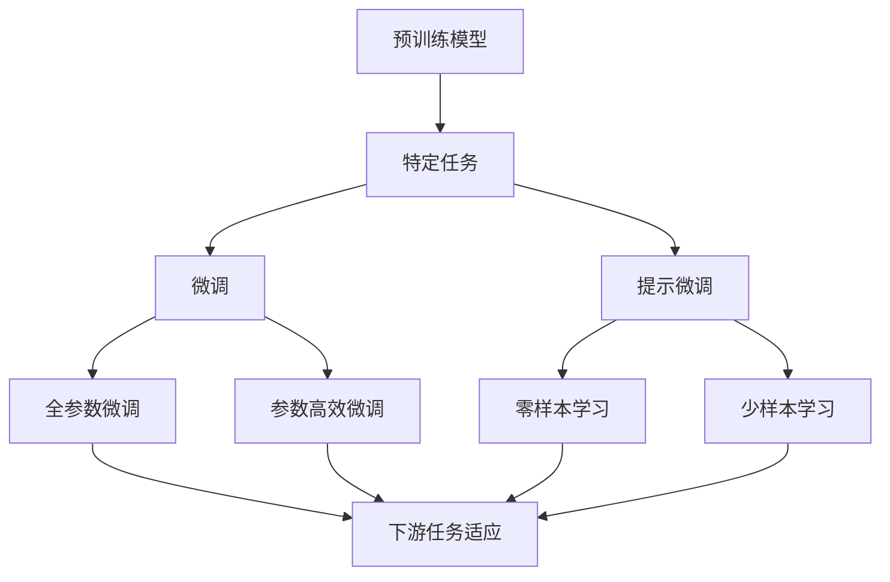
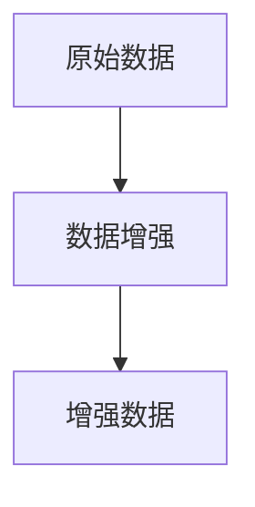
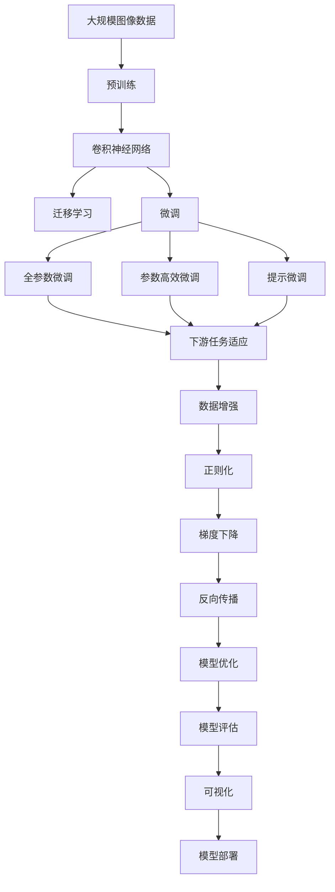

                 

# Python机器学习实战：深度学习在计算机视觉任务中的运用

> 关键词：Python,机器学习,深度学习,计算机视觉,卷积神经网络(CNN),迁移学习,迁移学习,预训练模型,计算机视觉任务,数据增强,正则化,梯度下降,反向传播,卷积操作,池化操作,全连接层,模型融合,模型优化,可视化,模型评估,算法优势,算法缺点,算法应用场景

## 1. 背景介绍

### 1.1 问题由来
计算机视觉(Computer Vision, CV)是人工智能领域的一个重要分支，旨在让计算机"看懂"图像和视频数据，实现对视觉信息的自动化处理。深度学习技术的兴起，尤其是卷积神经网络(CNN)的广泛应用，极大地推动了计算机视觉技术的发展。在诸如物体检测、人脸识别、图像分割、场景理解等诸多计算机视觉任务中，深度学习算法取得了显著的成果。

然而，由于不同任务之间数据分布的差异，许多模型对于特定任务的适应性仍显不足。此外，许多计算机视觉任务需要高昂的数据标注成本，限制了模型的训练规模和应用效果。因此，如何在保持模型泛化能力的同时，通过微调和迁移学习等方法提升特定任务的效果，成为当前计算机视觉研究的热点之一。

### 1.2 问题核心关键点
当前，计算机视觉任务中的深度学习模型主要基于卷积神经网络。其核心思想是通过在深度网络中进行特征提取和分类，实现对图像的高级表示和语义理解。为提升模型在特定任务上的性能，微调和迁移学习成为了两大主流方法。

微调的核心思想是将预训练模型在特定数据集上进行微小调整，以适应特定任务。而迁移学习则是在保持预训练模型泛化能力的前提下，通过迁移学习到目标任务的特征提取能力，从而快速提升模型性能。这两种方法不仅能有效降低数据标注成本，还能在多个计算机视觉任务中取得不错的效果。

### 1.3 问题研究意义
通过微调和迁移学习的方法，计算机视觉模型在特定任务上能够快速获得高性能，极大地提升了模型的应用价值。这些技术不仅能提高计算机视觉应用的效果，还能为许多垂直行业带来变革性的影响，例如：

- 医疗诊断：通过深度学习模型对医学影像进行自动检测和分析，帮助医生快速诊断疾病。
- 自动驾驶：在自动驾驶领域，通过计算机视觉技术实现车辆周围环境的实时感知，保证行车安全。
- 安防监控：在安防领域，通过深度学习模型进行人脸识别、行为分析等，提升安全防范水平。
- 农业生产：通过图像处理技术，对农作物生长状态进行检测和分析，优化农业生产流程。
- 智能制造：在工业生产中，通过深度学习技术对设备状态进行监控和预测，保障生产线的稳定运行。

此外，深度学习模型还能在娱乐、金融、教育等多个领域发挥重要作用，助力各行各业的数字化转型和智能化升级。因此，计算机视觉中的深度学习技术，具有深远的理论意义和实际应用价值。

## 2. 核心概念与联系

### 2.1 核心概念概述

为更好地理解深度学习在计算机视觉任务中的运用，本节将介绍几个密切相关的核心概念：

- 卷积神经网络(CNN)：一种专门用于处理图像和视频数据的深度学习模型，通过卷积操作提取图像特征，通过池化操作进行特征降维。
- 迁移学习(Transfer Learning)：将一个领域学习到的知识，迁移应用到另一个不同但相关的领域的学习范式。在计算机视觉中，常用于利用预训练模型适应新任务。
- 预训练模型(Pre-trained Model)：在大型数据集上进行预训练，学习到丰富的图像特征和语义表示的深度学习模型。如ImageNet预训练的ResNet、VGG等。
- 微调(Fine-tuning)：在预训练模型的基础上，使用特定任务的少量标注数据，对模型进行微小调整，以适应特定任务。常用于提升模型在特定数据集上的效果。
- 数据增强(Data Augmentation)：通过对训练数据进行变换，丰富训练数据的多样性，避免过拟合。如旋转、缩放、翻转等。
- 正则化(Regularization)：通过引入正则项，控制模型的复杂度，防止过拟合。如L2正则、Dropout等。
- 梯度下降(Gradient Descent)：通过反向传播算法计算损失函数对模型参数的梯度，以最小化损失函数。
- 反向传播(Backpropagation)：通过链式法则，计算损失函数对模型参数的梯度，从而更新参数。
- 卷积操作(Convolution)：在CNN中，卷积操作用于提取图像的局部特征，通过滑动窗口在输入图像上执行卷积运算，生成特征图。
- 池化操作(Pooling)：在CNN中，池化操作用于降维，通过在特征图上滑动窗口取最大值或平均值，生成特征图。
- 全连接层(Fully Connected Layer)：在CNN的最后一层，用于将卷积层和池化层提取的特征进行分类或回归。

这些核心概念之间的逻辑关系可以通过以下Mermaid流程图来展示：



这个流程图展示了大语言模型微调过程中各个核心概念的联系：

1. 输入图像经过卷积和池化操作，生成特征图。
2. 特征图经过全连接层和输出层，生成预测结果。
3. 预测结果与真实标签计算损失函数，进行反向传播和梯度下降，更新模型参数。
4. 通过正则化和数据增强等方法，避免过拟合。
5. 在预训练模型的基础上，通过迁移学习和微调，提升模型在特定任务上的效果。

### 2.2 概念间的关系

这些核心概念之间存在着紧密的联系，形成了计算机视觉深度学习模型的完整生态系统。下面我们通过几个Mermaid流程图来展示这些概念之间的关系。

#### 2.2.1 CNN结构概览



这个流程图展示了典型的卷积神经网络结构，包含多个卷积层、池化层和全连接层，用于提取图像特征并进行分类或回归。

#### 2.2.2 迁移学习与微调的关系



这个流程图展示了迁移学习的基本原理，以及它与微调的关系。迁移学习涉及源任务和目标任务，预训练模型在源任务上学习，然后通过微调适应各种下游任务（目标任务）。

#### 2.2.3 预训练模型的效果



这个流程图展示了预训练模型在不同微调方法下的效果。预训练模型在特定任务上，通过全参数微调、参数高效微调和提示微调等方法，可以提升模型性能。

#### 2.2.4 数据增强的重要性



这个流程图展示了数据增强的基本流程。通过对原始数据进行旋转、缩放、翻转等变换，生成更多的训练数据，从而丰富训练集的多样性。

### 2.3 核心概念的整体架构

最后，我们用一个综合的流程图来展示这些核心概念在大语言模型微调过程中的整体架构：



这个综合流程图展示了从预训练到微调，再到模型部署的完整过程。卷积神经网络通过在大规模图像数据上进行预训练，学习到图像特征的表示。在迁移学习范式下，通过微调适应特定任务，提升模型效果。数据增强和正则化等方法，避免模型过拟合。通过梯度下降和反向传播算法，更新模型参数，完成模型优化。最终通过模型评估和可视化等环节，部署上线服务，完成模型生命周期管理。

## 3. 核心算法原理 & 具体操作步骤
### 3.1 算法原理概述

深度学习在计算机视觉任务中的应用，主要基于卷积神经网络(CNN)结构。其核心思想是通过卷积操作提取图像特征，通过池化操作降维，然后通过全连接层进行分类或回归。

在训练过程中，模型通过反向传播算法计算损失函数对模型参数的梯度，以最小化损失函数。这一过程通常称为梯度下降。通过正则化等方法，控制模型的复杂度，避免过拟合。通过数据增强，增加训练集的多样性，提升模型的泛化能力。

具体来说，对于给定的输入图像 $x$，卷积神经网络通过卷积层和池化层提取特征，然后通过全连接层和输出层进行分类或回归。损失函数 $L$ 通常包括交叉熵损失、均方误差损失等，用于衡量模型预测输出与真实标签之间的差异。模型的优化目标是最小化损失函数 $L$：

$$
\theta^* = \mathop{\arg\min}_{\theta} L(M_{\theta}(x),y)
$$

其中，$M_{\theta}$ 为卷积神经网络，$x$ 为输入图像，$y$ 为真实标签，$\theta$ 为模型参数。

### 3.2 算法步骤详解

基于卷积神经网络的结构和训练过程，深度学习在计算机视觉任务中的应用通常包含以下几个关键步骤：

**Step 1: 准备预训练模型和数据集**
- 选择合适的预训练模型，如ResNet、VGG等，作为初始化参数。
- 准备特定任务的数据集，划分为训练集、验证集和测试集。一般要求标注数据与预训练数据的分布不要差异过大。

**Step 2: 设计任务适配层**
- 根据任务类型，在预训练模型顶层设计合适的输出层和损失函数。
- 对于分类任务，通常在顶层添加线性分类器和交叉熵损失函数。
- 对于生成任务，通常使用语言模型的解码器输出概率分布，并以负对数似然为损失函数。

**Step 3: 设置微调超参数**
- 选择合适的优化算法及其参数，如AdamW、SGD等，设置学习率、批大小、迭代轮数等。
- 设置正则化技术及强度，包括权重衰减、Dropout、Early Stopping等。
- 确定冻结预训练参数的策略，如仅微调顶层，或全部参数都参与微调。

**Step 4: 执行梯度训练**
- 将训练集数据分批次输入模型，前向传播计算损失函数。
- 反向传播计算参数梯度，根据设定的优化算法和学习率更新模型参数。
- 周期性在验证集上评估模型性能，根据性能指标决定是否触发 Early Stopping。
- 重复上述步骤直到满足预设的迭代轮数或 Early Stopping 条件。

**Step 5: 测试和部署**
- 在测试集上评估微调后模型 $M_{\hat{\theta}}$ 的性能，对比微调前后的精度提升。
- 使用微调后的模型对新样本进行推理预测，集成到实际的应用系统中。
- 持续收集新的数据，定期重新微调模型，以适应数据分布的变化。

以上是深度学习在计算机视觉任务中的微调流程。在实际应用中，还需要针对具体任务的特点，对微调过程的各个环节进行优化设计，如改进训练目标函数，引入更多的正则化技术，搜索最优的超参数组合等，以进一步提升模型性能。

### 3.3 算法优缺点

基于卷积神经网络的深度学习在计算机视觉任务中具有以下优点：
1. 强大特征提取能力：通过多层次卷积和池化操作，可以自动学习图像的高级特征表示。
2. 高效泛化能力：预训练模型在大型数据集上学习，具备较强的泛化能力，能在不同领域和任务上取得优异效果。
3. 实时性：卷积操作具有高效性，适合实时处理和推理。
4. 开源工具丰富：如TensorFlow、PyTorch等，提供了丰富的预训练模型和微调样例代码，方便开发者快速上手。

同时，该方法也存在一定的局限性：
1. 数据依赖度高：深度学习模型需要大量标注数据进行训练，获取高质量标注数据的成本较高。
2. 模型复杂度高：卷积神经网络参数量庞大，训练和推理需要大量计算资源。
3. 过拟合风险：模型复杂度高，容易过拟合，特别是在数据集较小的情况下。
4. 不透明性：深度学习模型通常被视为"黑盒"系统，难以解释其内部工作机制和决策逻辑。
5. 内存占用大：大规模模型在推理时，内存占用较高，需要优化推理效率。

尽管存在这些局限性，但就目前而言，基于卷积神经网络的深度学习仍是计算机视觉领域的主流方法。未来相关研究的重点在于如何进一步降低数据标注成本，提高模型的少样本学习和跨领域迁移能力，同时兼顾可解释性和伦理安全性等因素。

### 3.4 算法应用领域

深度学习在计算机视觉任务中的应用领域极其广泛，涵盖了以下多个方向：

- 图像分类：如物体识别、场景分类等，通过学习图像中的高级特征进行分类。
- 物体检测：如人脸检测、车辆检测等，在图像中定位出特定物体的区域。
- 目标分割：如语义分割、实例分割等，对图像中的每个像素进行分类。
- 行为识别：如动作识别、姿态估计等，通过分析人体关键点坐标进行行为识别。
- 图像生成：如风格迁移、图像修复等，生成具有特定风格或修复后的图像。
- 视频分析：如视频分类、动作跟踪等，对视频序列进行分析和理解。

除了上述这些经典任务外，深度学习在计算机视觉中的应用还扩展到了图像描述、图像超分辨率、图像去噪、图像生成对抗网络(GAN)等更多创新方向，为计算机视觉技术带来了新的突破。

## 4. 数学模型和公式 & 详细讲解  
### 4.1 数学模型构建

本节将使用数学语言对基于卷积神经网络的深度学习在计算机视觉任务中的运用进行更加严格的刻画。

记卷积神经网络为 $M_{\theta}:\mathcal{X} \rightarrow \mathcal{Y}$，其中 $\mathcal{X}$ 为输入空间，$\mathcal{Y}$ 为输出空间，$\theta \in \mathbb{R}^d$ 为模型参数。假设计算机视觉任务为分类任务，训练集为 $D=\{(x_i,y_i)\}_{i=1}^N, x_i \in \mathcal{X}, y_i \in \{1,2,...,K\}$。

定义模型 $M_{\theta}$ 在输入 $x$ 上的损失函数为 $\ell(M_{\theta}(x),y)$，则在数据集 $D$ 上的经验风险为：

$$
\mathcal{L}(\theta) = \frac{1}{N} \sum_{i=1}^N \ell(M_{\theta}(x_i),y_i)
$$

在实践中，我们通常使用基于梯度的优化算法（如SGD、Adam等）来近似求解上述最优化问题。设 $\eta$ 为学习率，$\lambda$ 为正则化系数，则参数的更新公式为：

$$
\theta \leftarrow \theta - \eta \nabla_{\theta}\mathcal{L}(\theta) - \eta\lambda\theta
$$

其中 $\nabla_{\theta}\mathcal{L}(\theta)$ 为损失函数对参数 $\theta$ 的梯度，可通过反向传播算法高效计算。

### 4.2 公式推导过程

以下我们以二分类任务为例，推导交叉熵损失函数及其梯度的计算公式。

假设模型 $M_{\theta}$ 在输入 $x$ 上的输出为 $\hat{y}=M_{\theta}(x) \in [0,1]$，表示样本属于正类的概率。真实标签 $y \in \{0,1\}$。则二分类交叉熵损失函数定义为：

$$
\ell(M_{\theta}(x),y) = -[y\log \hat{y} + (1-y)\log (1-\hat{y})]
$$

将其代入经验风险公式，得：

$$
\mathcal{L}(\theta) = -\frac{1}{N}\sum_{i=1}^N [y_i\log M_{\theta}(x_i)+(1-y_i)\log(1-M_{\theta}(x_i))]
$$

根据链式法则，损失函数对参数 $\theta_k$ 的梯度为：

$$
\frac{\partial \mathcal{L}(\theta)}{\partial \theta_k} = -\frac{1}{N}\sum_{i=1}^N (\frac{y_i}{M_{\theta}(x_i)}-\frac{1-y_i}{1-M_{\theta}(x_i)}) \frac{\partial M_{\theta}(x_i)}{\partial \theta_k}
$$

其中 $\frac{\partial M_{\theta}(x_i)}{\partial \theta_k}$ 可进一步递归展开，利用自动微分技术完成计算。

在得到损失函数的梯度后，即可带入参数更新公式，完成模型的迭代优化。重复上述过程直至收敛，最终得到适应下游任务的最优模型参数 $\theta^*$。

## 5. 项目实践：代码实例和详细解释说明
### 5.1 开发环境搭建

在进行计算机视觉任务微调实践前，我们需要准备好开发环境。以下是使用Python进行PyTorch开发的环境配置流程：

1. 安装Anaconda：从官网下载并安装Anaconda，用于创建独立的Python环境。

2. 创建并激活虚拟环境：
```bash
conda create -n pytorch-env python=3.8 
conda activate pytorch-env
```

3. 安装PyTorch：根据CUDA版本，从官网获取对应的安装命令。例如：
```bash
conda install pytorch torchvision torchaudio cudatoolkit=11.1 -c pytorch -c conda-forge
```

4. 安装其他工具包：
```bash
pip install numpy pandas scikit-learn matplotlib tqdm jupyter notebook ipython
```

完成上述步骤后，即可在`pytorch-env`环境中开始微调实践。

### 5.2 源代码详细实现

下面我们以图像分类任务为例，给出使用PyTorch对ResNet模型进行微调的PyTorch代码实现。

首先，定义图像分类任务的数据处理函数：

```python
from torchvision import datasets, transforms
from torch.utils.data import DataLoader

# 数据预处理
transform_train = transforms.Compose([
    transforms.Resize(224),
    transforms.RandomCrop(224),
    transforms.RandomHorizontalFlip(),
    transforms.ToTensor(),
    transforms.Normalize(mean=[0.485, 0.456, 0.406], std=[0.229, 0.224, 0.225])
])

transform_test = transforms.Compose([
    transforms.Resize(224),
    transforms.CenterCrop(224),
    transforms.ToTensor(),
    transforms.Normalize(mean=[0.485, 0.456, 0.406], std=[0.229, 0.224, 0.225])
])

# 加载数据集
train_dataset = datasets.CIFAR10(root='./data', train=True, download=True, transform=transform_train)
test_dataset = datasets.CIFAR10(root='./data', train=False, download=True, transform=transform_test)

# 定义数据加载器
train_loader = DataLoader(train_dataset, batch_size=32, shuffle=True, num_workers=4)
test_loader = DataLoader(test_dataset, batch_size=32, shuffle=False, num_workers=4)
```

然后，定义模型和优化器：

```python
from torchvision.models import resnet18
from torch.optim import SGD

# 加载预训练模型
model = resnet18(pretrained=True)

# 冻结预训练权重，只微调顶层
for param in model.parameters():
    param.requires_grad = False
model.fc[0].weight.requires_grad = True
model.fc[0].bias.requires_grad = True

# 定义优化器
optimizer = SGD(model.fc.parameters(), lr=0.001, momentum=0.9, weight_decay=0.0005)
```

接着，定义训练和评估函数：

```python
from torch.optim.lr_scheduler import StepLR

def train_epoch(model, data_loader, optimizer, device):
    model.train()
    train_loss = 0
    for images, labels in data_loader:
        images, labels = images.to(device), labels.to(device)
        optimizer.zero_grad()
        output = model(images)
        loss = criterion(output, labels)
        loss.backward()
        optimizer.step()
        train_loss += loss.item()
    return train_loss / len(data_loader)

def evaluate(model, data_loader, device):
    model.eval()
    test_loss = 0
    correct = 0
    with torch.no_grad():
        for images, labels in data_loader:
            images, labels = images.to(device), labels.to(device)
            output = model(images)
            test_loss += criterion(output, labels).item()
            pred = output.argmax(dim=1, keepdim=True)
            correct += pred.eq(labels.view_as(pred)).sum().item()
    test_loss /= len(data_loader.dataset)
    correct /= len(data_loader.dataset)
    return test_loss, correct

# 训练函数
def train(model, train_loader, optimizer, device, num_epochs):
    train_losses, test_losses = [], []
    for epoch in range(num_epochs):
        train_loss = train_epoch(model, train_loader, optimizer, device)
        test_loss, correct = evaluate(model, test_loader, device)
        train_losses.append(train_loss)
        test_losses.append(test_loss)
        print(f'Epoch {epoch+1}/{num_epochs}, train loss: {train_loss:.4f}, test loss: {test_loss:.4f}, accuracy: {correct:.4f}')
    return train_losses, test_losses
```

最后，启动训练流程并在测试集上评估：

```python
num_epochs = 10
device = torch.device('cuda' if torch.cuda.is_available() else 'cpu')

# 训练模型
train_losses, test_losses = train(model, train_loader, optimizer, device, num_epochs)

# 输出训练结果
plt.plot(train_losses, label='train loss')
plt.plot(test_losses, label='test loss')
plt.legend()
plt.show()
```

以上就是使用PyTorch对ResNet进行图像分类任务微调的完整代码实现。可以看到，得益于PyTorch的强大封装，我们可以用相对简洁的代码完成模型加载和微调。

### 5.3 代码解读与分析

让我们再详细解读一下关键代码的实现细节：

**数据预处理**：
- 定义了数据预处理函数，包括图像尺寸调整、随机裁剪、翻转、归一化等操作。
- 加载CIFAR-10数据集，并将其划分为训练集和测试集。

**模型和优化器**：
- 加载预训练的ResNet模型，并冻结除了全连接层以外的所有层权重，只微调全连接层的权重。
- 定义优化器，使用SGD算法，学习率为0.001，动量为0.9，权重衰减为0.0005。

**训练和评估函数**：
- 定义训练函数，使用随机梯度下降算法更新模型参数，并记录训练损失。
- 定义评估函数，使用测试集数据评估模型性能，并返回测试损失和准确率。
- 定义训练流程，通过多次迭代更新模型参数，并

