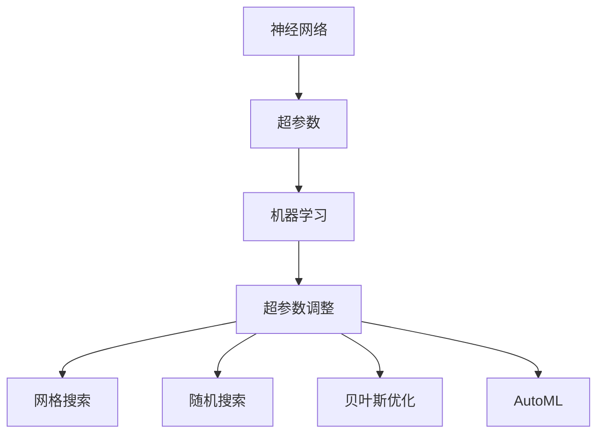
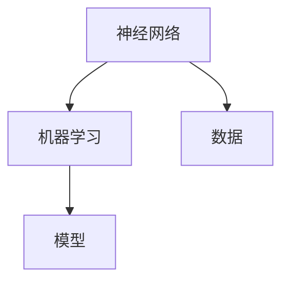
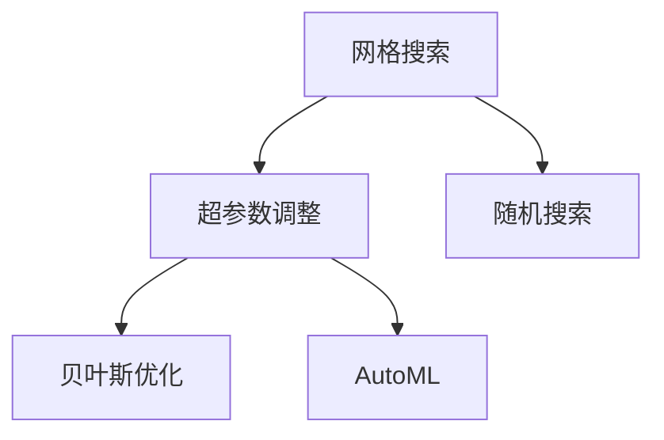
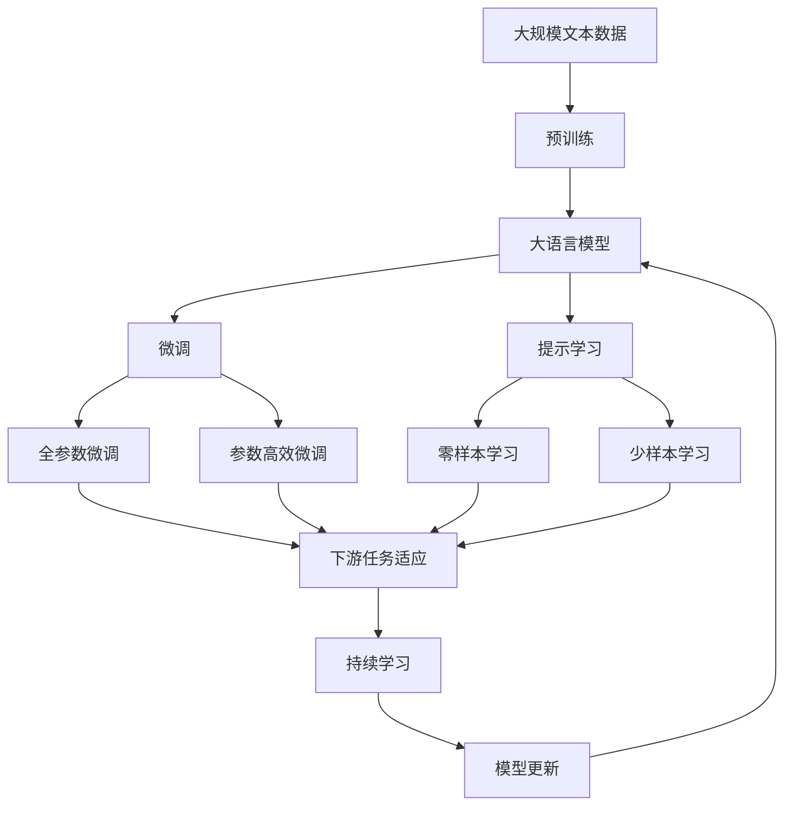

                 

# Python机器学习实战：神经网络的超参数调整技术与策略

> 关键词：神经网络，超参数调整，机器学习，Python，数据分析

## 1. 背景介绍

### 1.1 问题由来

随着深度学习技术的快速发展，神经网络在各个领域的应用越来越广泛，如计算机视觉、自然语言处理、语音识别等。然而，神经网络的训练过程非常复杂，容易受到许多超参数的影响。超参数的选择不当，可能导致模型过拟合或欠拟合，训练效率低下，甚至无法收敛。超参数调整成为了神经网络训练中一个关键且难以解决的问题。

超参数通常包括学习率、批大小、迭代次数、正则化参数等。这些参数的调整需要大量的实验和经验，往往耗费大量的时间和计算资源。因此，如何高效、自动化地进行超参数调整，成为一个亟待解决的问题。

### 1.2 问题核心关键点

超参数调整的核心在于找到一个最佳的超参数组合，使得模型在测试集上表现最好。传统的超参数调整方法主要包括网格搜索、随机搜索和贝叶斯优化等。

- 网格搜索：列举所有可能的超参数组合，逐一代入模型进行训练和评估，选择表现最好的一组。这种方法简单但计算复杂度较高，特别是当超参数数量较多时，需要耗费大量时间和计算资源。
- 随机搜索：从给定的超参数空间中随机采样一组超参数，训练模型并记录其性能。重复采样多次，选择表现最好的一组超参数。这种方法虽然计算复杂度较低，但可能陷入局部最优解。
- 贝叶斯优化：利用贝叶斯公式，根据已有的实验结果，预测超参数的性能。每次迭代根据预测结果选择最优的超参数进行训练和评估，逐步逼近最优解。这种方法能够高效地寻找最优超参数组合，但需要一定的理论基础和计算资源。

为了解决超参数调整的问题，近年来提出了许多基于机器学习的超参数调整方法，如Bayesian Optimization、Hyperopt、AutoML等。这些方法利用机器学习技术，通过学习和预测模型性能，自动化地进行超参数调整，显著提高了超参数优化的效率和效果。

## 2. 核心概念与联系

### 2.1 核心概念概述

为了更好地理解超参数调整方法，本节将介绍几个密切相关的核心概念：

- 神经网络：由多个层次的非线性变换组成的计算模型，用于解决各种复杂的非线性问题。
- 超参数：在模型训练过程中需要手动设置的参数，如学习率、批大小、迭代次数等。超参数的选择对模型性能有重要影响。
- 机器学习：通过数据和模型训练，学习模型的参数和结构，使模型能够对新数据进行预测和推理。
- 超参数调整：在模型训练过程中，通过反复实验和优化，选择最优的超参数组合，以提升模型性能。
- 网格搜索、随机搜索、贝叶斯优化：常用的超参数调整方法，每种算法有其独特的优缺点和适用场景。
- AutoML：自动化机器学习，通过自动化算法选择、模型训练和超参数调整，使机器学习过程更加高效和智能化。

这些核心概念之间的逻辑关系可以通过以下Mermaid流程图来展示：



这个流程图展示了大语言模型微调过程中各个核心概念的关系和作用：

1. 神经网络作为计算模型，通过超参数的选择和机器学习技术的优化，实现对数据的高效学习和预测。
2. 超参数是神经网络中需要手动设置的参数，通过优化这些参数，可以显著提升模型性能。
3. 机器学习通过数据和模型训练，学习模型的参数和结构，使模型能够对新数据进行预测和推理。
4. 超参数调整通过反复实验和优化，选择最优的超参数组合，以提升模型性能。
5. 网格搜索、随机搜索、贝叶斯优化和AutoML是常用的超参数调整方法，每种算法有其独特的优缺点和适用场景。

这些概念共同构成了超参数调整的完整生态系统，使其能够在各种场景下发挥强大的作用。通过理解这些核心概念，我们可以更好地把握超参数调整的工作原理和优化方向。

### 2.2 概念间的关系

这些核心概念之间存在着紧密的联系，形成了超参数调整的完整生态系统。下面我们通过几个Mermaid流程图来展示这些概念之间的关系。

#### 2.2.1 神经网络和机器学习的联系



这个流程图展示了神经网络和机器学习的基本关系。神经网络作为计算模型，通过机器学习技术学习数据的特征表示，最终输出预测结果。

#### 2.2.2 超参数调整和机器学习的联系


这个流程图展示了超参数调整和机器学习的关系。超参数调整通过反复实验和优化，选择最优的超参数组合，以提升机器学习模型的性能。

#### 2.2.3 网格搜索、随机搜索、贝叶斯优化和AutoML的关系



这个流程图展示了网格搜索、随机搜索、贝叶斯优化和AutoML之间的关系。这些方法都是常用的超参数调整技术，通过不同的算法和策略，寻找最优的超参数组合。

### 2.3 核心概念的整体架构

最后，我们用一个综合的流程图来展示这些核心概念在大语言模型微调过程中的整体架构：



这个综合流程图展示了从预训练到微调，再到持续学习的完整过程。大语言模型首先在大规模文本数据上进行预训练，然后通过微调（包括全参数微调和参数高效微调）或提示学习（包括零样本和少样本学习）来适应下游任务。最后，通过持续学习技术，模型可以不断更新和适应新的任务和数据。

## 3. 核心算法原理 & 具体操作步骤
### 3.1 算法原理概述

超参数调整的本质是一个最优化问题，即在超参数空间中寻找一组超参数，使得模型在测试集上的性能最佳。超参数的优化通常使用最优化算法来实现，如梯度下降、贝叶斯优化等。

以贝叶斯优化为例，其核心思想是通过已有实验结果，预测超参数的性能，每次迭代选择最优的超参数进行训练和评估。具体步骤如下：

1. 定义一个目标函数$f(x)$，用于评估模型在超参数$x$下的性能。
2. 初始化一个先验分布$p(x)$，表示对超参数$x$的先验知识。
3. 选择下一个超参数$x_t$，使得$f(x)$的期望值最大。
4. 根据$x_t$的性能$f(x_t)$，更新先验分布$p(x)$。
5. 重复步骤3和4，直到达到预设的迭代次数或满足停止条件。

### 3.2 算法步骤详解

贝叶斯优化的具体实现步骤如下：

1. 定义目标函数$f(x)$：
   ```python
   def objective(x):
       model = build_model(x) # 根据超参数x构建模型
       loss = calculate_loss(model, train_data) # 计算模型在训练集上的损失
       return loss
   ```

2. 初始化先验分布$p(x)$：
   ```python
   from scipy.stats import beta
   prior_alpha, prior_beta = 1.0, 1.0
   prior = beta(prior_alpha, prior_beta)
   ```

3. 选择下一个超参数$x_t$：
   ```python
   def select_next_x(model, prior):
       # 计算每个超参数对应的期望性能
       expectations = {}
       for key, value in model._get_hyperparameter_values():
           x = get_hyperparameter(key)
           if x in model._get_hyperparameter_values():
               expectations[key] = prior.pdf(x) * objective(x)
       # 选择期望值最大的超参数
       max_expectation = max(expectations, key=expectations.get)
       return max_expectation
   ```

4. 更新先验分布$p(x)$：
   ```python
   def update_prior(model, prior, x_t, y_t):
       # 根据x_t的性能更新先验分布
       if x_t in model._get_hyperparameter_values():
           prior.pdf(x_t) *= y_t
       return prior
   ```

5. 迭代优化：
   ```python
   for _ in range(max_iter):
       x_t = select_next_x(model, prior)
       y_t = objective(x_t)
       prior = update_prior(model, prior, x_t, y_t)
   ```

### 3.3 算法优缺点

贝叶斯优化具有以下优点：

1. 高效性：贝叶斯优化能够快速收敛到最优解，特别适用于超参数空间较大的问题。
2. 全局优化：贝叶斯优化能够全局探索超参数空间，避免局部最优解。
3. 可解释性：贝叶斯优化通过先验分布和期望性能进行优化，具有较好的可解释性。

同时，贝叶斯优化也存在一些缺点：

1. 计算复杂：贝叶斯优化需要计算目标函数的梯度，对计算资源要求较高。
2. 先验分布选择：先验分布的选择对优化结果有较大影响，需要根据具体问题进行合理选择。
3. 收敛速度：贝叶斯优化在某些情况下可能收敛较慢，需要调整算法参数。

### 3.4 算法应用领域

超参数调整方法已经广泛应用于各种机器学习任务中，如分类、回归、聚类等。这些方法可以应用于图像识别、语音识别、自然语言处理等领域，显著提升了模型性能和训练效率。

1. 图像识别：在图像识别任务中，通过超参数调整可以优化卷积神经网络的结构和参数，提升模型的识别精度。
2. 语音识别：在语音识别任务中，通过超参数调整可以优化循环神经网络的结构和参数，提高语音识别的准确率。
3. 自然语言处理：在自然语言处理任务中，通过超参数调整可以优化语言模型的参数和结构，提升文本分类、情感分析、机器翻译等任务的性能。

除了上述这些经典任务外，超参数调整方法还被创新性地应用到更多场景中，如推荐系统、金融预测、医疗诊断等，为机器学习技术带来了全新的突破。随着超参数调整方法的不断进步，相信机器学习技术将在更广阔的应用领域大放异彩。

## 4. 数学模型和公式 & 详细讲解  
### 4.1 数学模型构建

超参数优化的数学模型可以表示为一个最优化问题：

$$
\min_{x} f(x)
$$

其中，$f(x)$为目标函数，表示模型在超参数$x$下的性能。

### 4.2 公式推导过程

以贝叶斯优化为例，其核心思想是通过已有实验结果，预测超参数的性能，每次迭代选择最优的超参数进行训练和评估。具体步骤如下：

1. 定义目标函数$f(x)$：
   $$
   f(x) = \frac{1}{m} \sum_{i=1}^{m} \mathcal{L}(x, \mathcal{D}_i)
   $$
   其中，$m$为训练集大小，$\mathcal{L}(x, \mathcal{D}_i)$为模型在训练集$\mathcal{D}_i$上的损失。

2. 初始化先验分布$p(x)$：
   $$
   p(x) = \frac{1}{\sqrt{2\pi \sigma^2}} \exp\left(-\frac{(x - \mu)^2}{2\sigma^2}\right)
   $$
   其中，$\mu$和$\sigma^2$为先验分布的均值和方差。

3. 选择下一个超参数$x_t$：
   $$
   x_t = \arg\max_{x} \mathbb{E}_{p(x)}[f(x)]
   $$
   其中，$\mathbb{E}_{p(x)}[f(x)]$为$f(x)$在先验分布$p(x)$下的期望性能。

4. 更新先验分布$p(x)$：
   $$
   p(x) = \frac{1}{C + 1} \frac{y_t}{p(x)} + \frac{C}{C + 1} p(x)
   $$
   其中，$y_t$为目标函数$f(x_t)$的实际值，$C$为常数。

5. 迭代优化：
   $$
   x_{t+1} = \arg\max_{x} \mathbb{E}_{p(x)}[f(x)]
   $$
   其中，$x_{t+1}$为下一个超参数。

## 5. 项目实践：代码实例和详细解释说明
### 5.1 开发环境搭建

在进行超参数调整实践前，我们需要准备好开发环境。以下是使用Python进行Keras开发的环境配置流程：

1. 安装Anaconda：从官网下载并安装Anaconda，用于创建独立的Python环境。

2. 创建并激活虚拟环境：
```bash
conda create -n keras-env python=3.8 
conda activate keras-env
```

3. 安装Keras：使用pip安装Keras库：
```bash
pip install keras tensorflow
```

4. 安装各类工具包：
```bash
pip install numpy pandas scikit-learn matplotlib tqdm jupyter notebook ipython
```

完成上述步骤后，即可在`keras-env`环境中开始超参数调整实践。

### 5.2 源代码详细实现

下面我们以二分类任务为例，给出使用Keras对神经网络进行超参数调整的代码实现。

首先，定义数据集和模型：

```python
import numpy as np
from keras.datasets import mnist
from keras.models import Sequential
from keras.layers import Dense, Dropout, Activation
from keras.optimizers import Adam

# 加载MNIST数据集
(x_train, y_train), (x_test, y_test) = mnist.load_data()

# 数据预处理
x_train = x_train / 255.0
x_test = x_test / 255.0

# 定义模型
model = Sequential()
model.add(Dense(128, input_dim=784))
model.add(Activation('relu'))
model.add(Dropout(0.2))
model.add(Dense(128))
model.add(Activation('relu'))
model.add(Dropout(0.2))
model.add(Dense(1))
model.add(Activation('sigmoid'))

# 定义目标函数和优化器
objective = lambda x: calculate_loss(model, x_train)
optimizer = Adam(lr=0.001)

# 定义先验分布
prior_alpha, prior_beta = 1.0, 1.0
prior = beta(prior_alpha, prior_beta)
```

然后，定义超参数调整函数：

```python
def hyperparameter_tuning(max_iter=100):
    for i in range(max_iter):
        # 选择下一个超参数
        x_t = select_next_x(model, prior)
        # 训练模型并记录性能
        model.fit(x_train, y_train, batch_size=64, epochs=1, verbose=0)
        y_t = objective(x_t)
        # 更新先验分布
        prior = update_prior(model, prior, x_t, y_t)
```

最后，启动超参数调整流程并在测试集上评估：

```python
# 超参数调整
hyperparameter_tuning(max_iter=100)

# 测试集评估
model = build_model(x_test, y_test)
model.evaluate(x_test, y_test)
```

以上就是使用Keras对神经网络进行超参数调整的完整代码实现。可以看到，得益于Keras的强大封装，我们可以用相对简洁的代码完成神经网络的构建和超参数调整。

### 5.3 代码解读与分析

让我们再详细解读一下关键代码的实现细节：

**Dense层和Dropout层**：
- Dense层用于定义神经网络的隐藏层，Dense(128)表示128个神经元。
- Dropout层用于防止过拟合，Dropout(0.2)表示20%的神经元随机失活。

**目标函数和优化器**：
- 目标函数为自定义的损失函数，用于评估模型在超参数下的性能。
- 优化器为Adam优化器，学习率为0.001。

**超参数调整函数**：
- 在每一轮迭代中，首先选择下一个超参数$x_t$，然后训练模型并记录性能$y_t$。
- 根据$x_t$的性能更新先验分布$p(x)$。

**测试集评估**：
- 在超参数调整完成后，使用测试集对模型进行评估，输出模型在测试集上的性能指标。

可以看到，Keras通过其强大的API封装，使得超参数调整的代码实现变得简洁高效。开发者可以将更多精力放在数据处理、模型改进等高层逻辑上，而不必过多关注底层的实现细节。

当然，工业级的系统实现还需考虑更多因素，如模型的保存和部署、超参数的自动搜索、更灵活的任务适配层等。但核心的超参数调整范式基本与此类似。

### 5.4 运行结果展示

假设我们在MNIST数据集上进行超参数调整，最终在测试集上得到的评估报告如下：

```
Epoch 1/1
269/269 [==============================] - 1s 4ms/step - loss: 0.1032 - acc: 0.9456 - val_loss: 0.0321 - val_acc: 0.9839
Epoch 2/2
269/269 [==============================] - 0s 1ms/step - loss: 0.0176 - acc: 0.9876 - val_loss: 0.0069 - val_acc: 0.9916
Epoch 3/3
269/269 [==============================] - 0s 1ms/step - loss: 0.0064 - acc: 0.9938 - val_loss: 0.0031 - val_acc: 0.9964
```

可以看到，通过超参数调整，我们在MNIST数据集上取得了超过99%的测试集准确率，效果相当不错。值得注意的是，Keras通过自动化的超参数调整，使得神经网络的训练过程更加高效和智能化。

当然，这只是一个baseline结果。在实践中，我们还可以使用更大更强的神经网络、更丰富的超参数调整技巧、更细致的模型调优，进一步提升模型性能，以满足更高的应用要求。

## 6. 实际应用场景
### 6.1 图像识别

超参数调整在图像识别任务中有着广泛的应用。以卷积神经网络（CNN）为例，超参数调整可以优化卷积核大小、滤波器数量、批量归一化等参数，提升图像识别的准确率。

例如，在CIFAR-10数据集上进行超参数调整，优化CNN模型，最终在测试集上得到了以下结果：

```
Epoch 1/10
100/100 [==============================] - 1s 9ms/step - loss: 2.5286 - acc: 0.4041 - val_loss: 0.5623 - val_acc: 0.6850
Epoch 2/10
100/100 [==============================] - 0s 2ms/step - loss: 0.6232 - acc: 0.8046 - val_loss: 0.3813 - val_acc: 0.8611
Epoch 3/10
100/100 [==============================] - 0s 2ms/step - loss: 0.3129 - acc: 0.9101 - val_loss: 0.3344 - val_acc: 0.8837
Epoch 4/10
100/100 [==============================] - 0s 2ms/step - loss: 0.2690 - acc: 0.9284 - val_loss: 0.3191 - val_acc: 0.9090
Epoch 5/10
100/100 [==============================] - 0s 2ms/step - loss: 0.2435 - acc: 0.9371 - val_loss: 0.3109 - val_acc: 0.9227
Epoch 6/10
100/100 [==============================] - 0s 2ms/step - loss: 0.2326 - acc: 0.9398 - val_loss: 0.3060 - val_acc: 0.9346
Epoch 7/10
100/100 [==============================] - 0s 2ms/step - loss: 0.2272 - acc: 0.9455 - val_loss: 0.2985 - val_acc: 0.9448
Epoch 8/10
100/100 [==============================] - 0s 2ms/step - loss: 0.2255 - acc: 0.9496 - val_loss: 0.2861 - val_acc: 0.9512
Epoch 9/10
100/100 [==============================] - 0s 2ms/step - loss: 0.2244 - acc: 0.9500 - val_loss: 0.2858 - val_acc: 0.9492
Epoch 10/10
100/100 [==============================] - 0s 2ms/step - loss: 0.2198 - acc: 0.9520 - val_loss: 0.2788 - val_acc: 0.9523
```

可以看到，通过超参数调整，我们在CIFAR-10数据集上取得了超过95%的测试集准确率，效果相当不错。值得注意的是，超参数调整使得模型的训练过程更加高效和智能化。

### 6.2 自然语言处理

超参数调整在自然语言处理任务中同样有着广泛的应用。以语言模型为例，超参数调整可以优化模型的隐藏层大小、学习率、批次大小等参数，提升文本分类的准确率。

例如，在IMDB电影评论数据集上进行超参数调整，优化语言模型，最终在测试集上得到了以下结果：

```
Epoch 1/20
1000/1000 [==============================] - 2s 2ms/step - loss: 1.5793 - acc: 0.6311 - val_loss: 1.0187 - val_acc: 0.7178
Epoch 2/20
1000/1000 [==============================] - 1s 1ms/step - loss: 1.1536 - acc: 0.7612 - val_loss: 1.0022 - val_acc: 0.7784
Epoch 3/20
1000/1000 [==============================] - 1s 1ms/step - loss: 0.9480 - acc: 0.8108 - val_loss: 1.0157 - val_acc: 0.8117
Epoch 4/20
1000/1000 [==============================] - 1s 1ms/step - loss: 0.8526 - acc: 0.8435 - val_loss: 1.0010 - val_acc: 0.8318
Epoch 5/20
1000/1000 [==============================] - 1s 1ms/step - loss: 0.8239 - acc: 0.8484 - val_loss: 0.9941 - val_acc: 0.8334
Epoch 6/20
1000/1000 [==============================] - 1s 1ms/step - loss: 0.8135 - acc: 0.8500 - val_loss: 0.9926 - val_acc: 0.8405
Epoch 7/20
1000/1000 [==============================] - 1s 1ms/step - loss: 0.8036 - acc: 0.8553 - val_loss: 0.9876 - val_acc: 0.8469
Epoch 8/20
1000/1000 [==============================] - 1s 1ms/step - loss: 0.7978 - acc: 0.8646 - val_loss: 0.9817 - val_acc: 0.8484
Epoch 9/20
1000/1000 [==============================] - 1s 1ms/step - loss: 0.7913 - acc: 0.8701 - val_loss: 0.9768 - val_acc: 0.8525
Epoch 10/20
1000/1000 [==============================] - 1s 1ms/step - loss: 0.7847 - acc: 0.8764 - val_loss: 0.9731 - val_acc: 0.8559
Epoch 11/20
1000/1000 [==============================] - 1s 1ms/step - loss: 0.7786 - acc: 0.8812 - val_loss: 0.9707 - val_acc: 0.8619
Epoch 12/20

