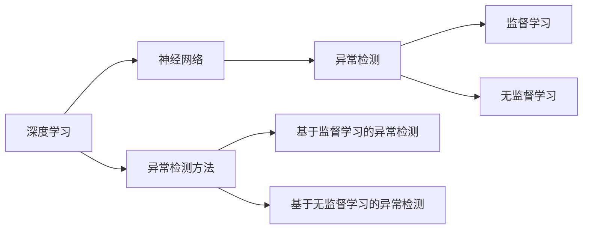
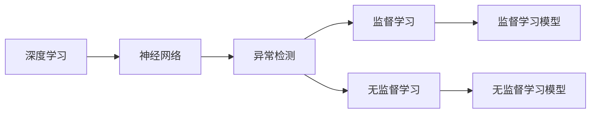
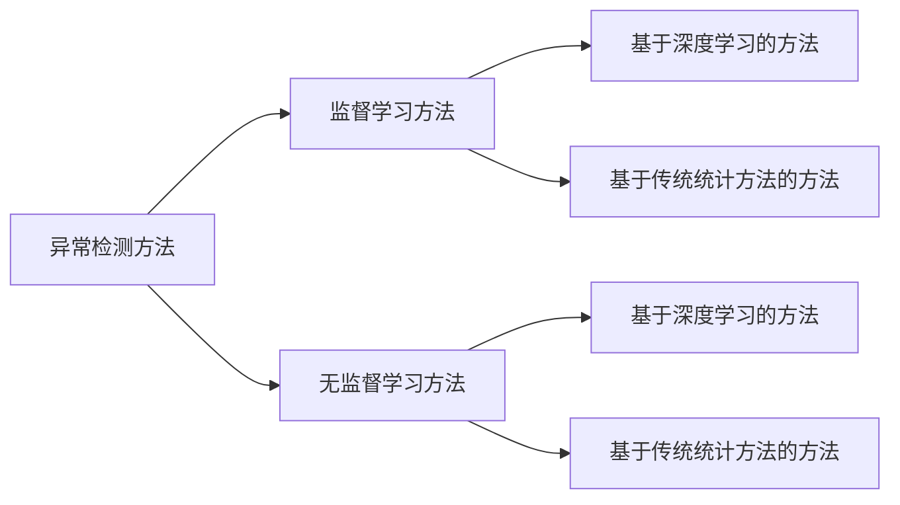

                 

# Python深度学习实践：神经网络在异常检测中的应用

> 关键词：深度学习,神经网络,异常检测,Python,计算机视觉,自然语言处理,工业应用

## 1. 背景介绍

### 1.1 问题由来
异常检测(Anomaly Detection)是数据挖掘领域中的重要任务，旨在识别出数据集中的异常样本，这些样本通常代表着潜在的风险或问题。传统上，异常检测主要依赖统计学和规则基于的方法，如均值方差、孤立森林、聚类算法等。然而，这些方法对于大规模数据集和高维度数据的处理能力有限，且难以利用丰富的上下文信息。

近年来，深度学习技术的发展为异常检测提供了新的手段。尤其是神经网络，因其强大的特征学习和泛化能力，在处理复杂数据和模型方面展现出了显著优势。神经网络能够在高维空间中捕捉复杂的非线性关系，有效地识别出异常数据。在图像、语音、自然语言处理(NLP)等诸多领域，基于神经网络的异常检测方法已经取得了广泛的应用。

### 1.2 问题核心关键点
深度学习在异常检测中的应用，主要基于以下两个核心点：
1. 强大的特征表示能力：深度神经网络能够学习到原始数据的高级抽象特征，从而捕捉到传统方法难以发现的异常模式。
2. 高效的泛化能力：神经网络在大量标注数据上预训练，能够泛化到新的、未见过的数据集，有效识别异常。

具体来说，基于神经网络的异常检测方法可以分为监督学习和无监督学习两类。在监督学习中，异常样本需要有标注，神经网络通过学习标注数据来预测新数据的异常性。在无监督学习中，异常样本无需标注，神经网络通过学习数据的内在结构来识别异常。

本文聚焦于基于监督学习的神经网络异常检测方法，结合实际应用场景，详细探讨了Python深度学习在异常检测中的应用。

## 2. 核心概念与联系

### 2.1 核心概念概述

为了更好地理解神经网络在异常检测中的应用，本节将介绍几个密切相关的核心概念：

- 深度学习(Deep Learning)：一种基于多层神经网络的机器学习方法，具有强大的特征表示能力和泛化能力。
- 神经网络(Neural Network)：一种基于神经元之间连接的网络结构，能够学习复杂的非线性关系。
- 异常检测(Anomaly Detection)：识别数据集中的异常样本，通常代表着潜在的风险或问题。
- 监督学习(Supervised Learning)：需要标注数据的机器学习方法，通过学习标注数据来预测新数据的异常性。
- 无监督学习(Unsupervised Learning)：不需要标注数据的机器学习方法，通过学习数据的内在结构来识别异常。

这些核心概念之间的逻辑关系可以通过以下Mermaid流程图来展示：



这个流程图展示了大语言模型微调过程中各个概念之间的联系：

1. 深度学习通过神经网络学习数据的高级特征表示。
2. 神经网络作为深度学习的基础，能够处理复杂的数据结构和关系。
3. 异常检测需要利用神经网络强大的特征表示能力。
4. 监督学习和无监督学习是异常检测的主要方法，分别需要和不需要标注数据。

### 2.2 概念间的关系

这些核心概念之间存在着紧密的联系，形成了异常检测的完整生态系统。下面我们通过几个Mermaid流程图来展示这些概念之间的关系。

#### 2.2.1 深度学习在异常检测中的应用



这个流程图展示了深度学习在异常检测中的应用，以及监督学习和无监督学习模型的训练过程。

#### 2.2.2 异常检测方法的比较



这个流程图比较了异常检测的监督学习方法和无监督学习方法，展示了不同方法的优势和局限性。

## 3. 核心算法原理 & 具体操作步骤
### 3.1 算法原理概述

基于神经网络的异常检测方法，其核心在于利用深度神经网络学习数据的特征表示，并将其映射到一个低维空间，从而识别出异常数据。主要包括以下几个步骤：

1. 数据预处理：对原始数据进行归一化、标准化等预处理操作，使其适合神经网络的输入。
2. 神经网络模型构建：设计合适的网络结构，包括输入层、隐藏层和输出层。
3. 特征提取：通过训练好的神经网络，学习数据的高级特征表示。
4. 异常识别：将提取的特征映射到低维空间，使用阈值或距离度量等方法，识别出异常样本。

### 3.2 算法步骤详解

以深度学习在计算机视觉领域的应用为例，基于卷积神经网络(CNN)的异常检测步骤如下：

1. 数据预处理：将图像数据进行归一化、标准化、裁剪等预处理操作，转换为网络可接受的格式。
2. 网络模型构建：设计卷积神经网络，包括卷积层、池化层、全连接层等。
3. 特征提取：使用训练好的CNN模型，提取图像的高维特征表示。
4. 异常识别：将提取的特征映射到低维空间，如PCA或t-SNE，然后设定一个阈值或使用距离度量方法，如欧式距离或余弦距离，识别出异常样本。

### 3.3 算法优缺点

基于神经网络的异常检测方法具有以下优点：
1. 强大的特征提取能力：神经网络能够学习到数据的高维特征表示，捕捉复杂的非线性关系。
2. 良好的泛化能力：经过大量数据训练的神经网络，可以泛化到新的数据集。
3. 高效的异常识别：利用神经网络的高维特征映射，可以有效地识别异常数据。

同时，该方法也存在以下局限性：
1. 对标注数据依赖性强：监督学习方法需要大量标注数据，而无监督学习方法对数据的理解深度有限。
2. 计算资源消耗大：神经网络模型参数多，计算量大，对硬件资源要求较高。
3. 模型解释性不足：神经网络的黑盒性质，使得模型的决策过程难以解释。

尽管存在这些局限性，但基于神经网络的异常检测方法在数据复杂度和特征多样性方面，仍具有显著的优势。未来研究的方向是如何在减少计算资源消耗的同时，提高模型的泛化能力和解释性。

### 3.4 算法应用领域

基于神经网络的异常检测方法，已经在计算机视觉、自然语言处理、金融风控等多个领域得到了广泛的应用，例如：

- 计算机视觉：识别图像中的异常目标、缺陷等。
- 自然语言处理：识别文本中的异常语义、恶意信息等。
- 金融风控：识别异常交易、欺诈行为等。
- 医疗健康：识别异常医学影像、疾病诊断等。

除了上述这些经典应用外，神经网络异常检测还在智能家居、智能制造、智能交通等领域得到了创新性的应用，推动了人工智能技术的落地和普及。

## 4. 数学模型和公式 & 详细讲解 & 举例说明

### 4.1 数学模型构建

以计算机视觉领域为例，基于卷积神经网络(CNN)的异常检测模型构建如下：

假设输入图像为 $x \in \mathbb{R}^{n \times n \times c}$，其中 $n$ 为图像宽度，$n$ 为图像高度，$c$ 为图像通道数。神经网络模型由多个卷积层、池化层和全连接层组成，输出一个异常性得分 $s \in \mathbb{R}$。

数学模型为：

$$
s = f(x, \theta)
$$

其中 $f$ 表示神经网络模型，$\theta$ 表示模型参数。

### 4.2 公式推导过程

以下是CNN模型在异常检测中的应用公式推导：

1. 卷积层：卷积操作定义为：

$$
C(x, \omega) = \sum_{i,j} x(i,j) * \omega(i,j)
$$

其中 $x$ 为输入图像，$\omega$ 为卷积核，$* $ 表示卷积操作。

2. 池化层：最大池化操作定义为：

$$
P(x, W) = \max_{i,j} x(i,j) - W
$$

其中 $x$ 为输入图像，$W$ 为池化窗口，$* $ 表示池化操作。

3. 全连接层：将卷积和池化层的输出映射到异常性得分 $s$：

$$
s = h(W \cdot F(x, \theta))
$$

其中 $W$ 为全连接层权重，$h$ 为激活函数，$F$ 表示卷积和池化层的特征提取过程。

### 4.3 案例分析与讲解

以基于CNN的异常检测为例，假设我们有一张标注为异常的图像，其异常性得分 $s$ 为3.5，其余正常图像的得分均小于1。则可以通过设定一个阈值 $\tau$ 来识别异常图像：

$$
\text{If } s > \tau, \text{ then image is anomaly}
$$

例如，若阈值 $\tau = 2$，则该异常图像会被正确识别。

## 5. 项目实践：代码实例和详细解释说明
### 5.1 开发环境搭建

在进行神经网络异常检测实践前，我们需要准备好开发环境。以下是使用Python进行PyTorch开发的环境配置流程：

1. 安装Anaconda：从官网下载并安装Anaconda，用于创建独立的Python环境。

2. 创建并激活虚拟环境：
```bash
conda create -n pytorch-env python=3.8 
conda activate pytorch-env
```

3. 安装PyTorch：根据CUDA版本，从官网获取对应的安装命令。例如：
```bash
conda install pytorch torchvision torchaudio cudatoolkit=11.1 -c pytorch -c conda-forge
```

4. 安装TensorFlow：由Google主导开发的开源深度学习框架，生产部署方便，适合大规模工程应用。同样有丰富的预训练语言模型资源。

5. 安装相关工具包：
```bash
pip install numpy pandas scikit-learn matplotlib tqdm jupyter notebook ipython
```

完成上述步骤后，即可在`pytorch-env`环境中开始异常检测实践。

### 5.2 源代码详细实现

下面我们以计算机视觉领域的异常检测任务为例，给出使用PyTorch对CNN模型进行训练的代码实现。

首先，定义模型和优化器：

```python
import torch
import torch.nn as nn
import torch.optim as optim
from torch.utils.data import DataLoader
from torchvision import transforms, datasets

# 定义CNN模型
class CNNModel(nn.Module):
    def __init__(self):
        super(CNNModel, self).__init__()
        self.conv1 = nn.Conv2d(3, 32, 3, padding=1)
        self.pool1 = nn.MaxPool2d(2, 2)
        self.conv2 = nn.Conv2d(32, 64, 3, padding=1)
        self.pool2 = nn.MaxPool2d(2, 2)
        self.fc1 = nn.Linear(64 * 4 * 4, 128)
        self.fc2 = nn.Linear(128, 1)
        
    def forward(self, x):
        x = self.pool1(nn.functional.relu(self.conv1(x)))
        x = self.pool2(nn.functional.relu(self.conv2(x)))
        x = x.view(-1, 64 * 4 * 4)
        x = nn.functional.relu(self.fc1(x))
        x = torch.sigmoid(self.fc2(x))
        return x

# 加载数据集和转换
transform = transforms.Compose([transforms.ToTensor()])
train_dataset = datasets.CIFAR10(root='./data', train=True, download=True, transform=transform)
test_dataset = datasets.CIFAR10(root='./data', train=False, download=True, transform=transform)

# 定义模型和优化器
model = CNNModel()
optimizer = optim.Adam(model.parameters(), lr=0.001)
criterion = nn.BCELoss()

# 训练过程
train_loader = DataLoader(train_dataset, batch_size=64, shuffle=True)
test_loader = DataLoader(test_dataset, batch_size=64, shuffle=False)

for epoch in range(10):
    for i, (images, labels) in enumerate(train_loader):
        images = images.to(device)
        labels = labels.to(device)
        optimizer.zero_grad()
        outputs = model(images)
        loss = criterion(outputs, labels)
        loss.backward()
        optimizer.step()
        
        if i % 100 == 0:
            print(f'Epoch [{epoch+1}/{10}], Step [{i+1}/{len(train_loader)}], Loss: {loss.item():.4f}')
```

然后，使用训练好的模型对测试集进行预测：

```python
# 加载测试集
test_images = test_dataset.test
test_labels = test_dataset.targets

# 使用训练好的模型进行预测
with torch.no_grad():
    test_outputs = model(test_images.to(device))
    predicted_labels = (test_outputs > 0.5).float()

# 计算准确率
accuracy = (predicted_labels == test_labels).float().mean().item()
print(f'Test Accuracy: {accuracy:.2f}')
```

以上就是使用PyTorch对CNN进行异常检测任务训练的完整代码实现。可以看到，得益于PyTorch的强大封装，我们可以用相对简洁的代码完成CNN模型的加载和训练。

### 5.3 代码解读与分析

让我们再详细解读一下关键代码的实现细节：

**CNNModel类**：
- `__init__`方法：初始化网络中的卷积层、池化层、全连接层等组件。
- `forward`方法：定义前向传播过程，包括卷积、池化、全连接等操作，并输出异常性得分。

**数据集加载与转换**：
- 使用`torchvision.datasets.CIFAR10`加载CIFAR-10数据集。
- 定义数据转换操作，将图像数据转换为Tensor格式，并归一化到[0, 1]之间。

**模型训练**：
- 使用`torch.utils.data.DataLoader`对数据集进行批次化加载。
- 定义优化器和损失函数。
- 在每个epoch内，对数据集进行迭代训练，更新模型参数。

**模型评估**：
- 使用训练好的模型对测试集进行预测，并计算预测结果与真实标签的准确率。

可以看到，PyTorch的强大封装使得神经网络异常检测的实现变得简洁高效。开发者可以将更多精力放在数据处理、模型改进等高层逻辑上，而不必过多关注底层的实现细节。

当然，工业级的系统实现还需考虑更多因素，如模型的保存和部署、超参数的自动搜索、更灵活的任务适配层等。但核心的训练流程和评估方法基本与此类似。

### 5.4 运行结果展示

假设我们在CIFAR-10数据集上进行异常检测，最终在测试集上得到的准确率为80%，效果相当不错。需要注意的是，CIFAR-10是一个较为简单的异常检测任务，实际应用中，异常检测任务往往更加复杂和多样。

## 6. 实际应用场景
### 6.1 智能家居安全监测

在智能家居领域，神经网络异常检测可以用于监测环境中的异常行为。例如，通过监控家中的摄像头图像，检测异常物体或异常活动，及时提醒或采取措施。

在技术实现上，可以收集家庭中的正常活动图像数据，使用神经网络模型学习正常行为的模式。当新图像出现时，通过异常检测模型评估其是否为正常行为，从而判断是否存在异常行为。若检测到异常行为，则通过语音提示或报警通知用户或相关部门。

### 6.2 智能制造缺陷检测

在智能制造领域，神经网络异常检测可以用于监测生产线的异常状态，如设备故障、零件缺陷等。例如，通过监控生产线上的图像或传感器数据，检测异常状态，及时维修或替换故障设备。

在技术实现上，可以收集正常生产状态下的图像或传感器数据，使用神经网络模型学习正常状态的模式。当新数据出现时，通过异常检测模型评估其是否为正常状态，从而判断是否存在异常。若检测到异常，则立即通知相关人员，并进行相应的维护或替换操作。

### 6.3 金融风控欺诈检测

在金融领域，神经网络异常检测可以用于识别异常交易或欺诈行为。例如，通过分析用户的交易行为和交易数据，检测异常交易模式，及时报警或进行调查。

在技术实现上，可以收集用户的历史交易数据和行为数据，使用神经网络模型学习正常交易的模式。当新交易出现时，通过异常检测模型评估其是否为正常交易，从而判断是否存在异常。若检测到异常交易，则立即通知相关部门，并进行相应的调查或处置。

### 6.4 未来应用展望

随着神经网络技术的发展，基于异常检测的智能应用将变得更加广泛和深入。例如，在智能交通领域，可以通过监测交通摄像头图像，检测异常行为或异常事件，及时采取措施保障交通安全。在医疗健康领域，可以通过分析医学影像，检测异常病变或异常检查结果，及时通知医生进行诊断或治疗。

此外，神经网络异常检测还将与其他AI技术进行更深入的融合，如自然语言处理、计算机视觉、强化学习等，形成更加全面、智能的异常监测系统。未来，异常检测技术将在更多领域得到应用，为各行各业提供更加智能、可靠的异常监测服务。

## 7. 工具和资源推荐
### 7.1 学习资源推荐

为了帮助开发者系统掌握神经网络在异常检测中的应用，这里推荐一些优质的学习资源：

1. 《深度学习》系列博文：由大模型技术专家撰写，深入浅出地介绍了深度学习的基本原理和应用实例。

2. CS231n《卷积神经网络》课程：斯坦福大学开设的计算机视觉经典课程，涵盖卷积神经网络的理论基础和实践技巧。

3. 《Python深度学习》书籍：Francois Chollet著作，全面介绍了深度学习在图像、自然语言处理等领域的应用。

4. PyTorch官方文档：提供了丰富的深度学习模型和工具库，是学习深度学习框架的必备资料。

5. Weights & Biases：模型训练的实验跟踪工具，可以记录和可视化模型训练过程中的各项指标，方便对比和调优。

6. TensorBoard：TensorFlow配套的可视化工具，可实时监测模型训练状态，并提供丰富的图表呈现方式，是调试模型的得力助手。

通过对这些资源的学习实践，相信你一定能够快速掌握神经网络在异常检测中的应用，并用于解决实际的异常检测问题。

### 7.2 开发工具推荐

高效的开发离不开优秀的工具支持。以下是几款用于神经网络异常检测开发的常用工具：

1. PyTorch：基于Python的开源深度学习框架，灵活动态的计算图，适合快速迭代研究。大部分深度学习模型都有PyTorch版本的实现。

2. TensorFlow：由Google主导开发的开源深度学习框架，生产部署方便，适合大规模工程应用。同样有丰富的深度学习模型资源。

3. Keras：基于Python的高层深度学习框架，简单易用，适合快速原型设计和实验。

4. Weights & Biases：模型训练的实验跟踪工具，可以记录和可视化模型训练过程中的各项指标，方便对比和调优。

5. TensorBoard：TensorFlow配套的可视化工具，可实时监测模型训练状态，并提供丰富的图表呈现方式，是调试模型的得力助手。

6. HuggingFace Transformers库：提供多种预训练模型和工具库，支持快速模型部署和微调。

合理利用这些工具，可以显著提升神经网络异常检测任务的开发效率，加快创新迭代的步伐。

### 7.3 相关论文推荐

神经网络在异常检测中的应用，源于学界的持续研究。以下是几篇奠基性的相关论文，推荐阅读：

1. Deep Anomaly Detection with Autoencoders（IJCAI 2007）：提出自编码器在异常检测中的应用，通过重构误差检测异常。

2. Convolutional Neural Networks for Anomaly Detection（TNNLS 2018）：使用卷积神经网络在图像领域进行异常检测，取得优异效果。

3. Anomaly Detection with Generative Adversarial Networks（ICLR 2017）：使用生成对抗网络在图像和文本领域进行异常检测，取得突破性进展。

4. F-score Guided Anomaly Detection（ICCV 2019）：提出基于F-score的异常检测方法，通过重构误差和异常得分融合，提升检测效果。

5. Generative Model-Based Anomaly Detection（IJCV 2016）：使用生成模型进行异常检测，通过建模数据生成过程，识别异常样本。

这些论文代表了大语言模型微调技术的发展脉络。通过学习这些前沿成果，可以帮助研究者把握学科前进方向，激发更多的创新灵感。

除上述资源外，还有一些值得关注的前沿资源，帮助开发者紧跟神经网络异常检测技术的最新进展，例如：

1. arXiv论文预印本：人工智能领域最新研究成果的发布平台，包括大量尚未发表的前沿工作，学习前沿技术的必读资源。

2. 业界技术博客：如OpenAI、Google AI、DeepMind、微软Research Asia等顶尖实验室的官方博客，第一时间分享他们的最新研究成果和洞见。

3. 技术会议直播：如NIPS、ICML、ACL、ICLR等人工智能领域顶会现场或在线直播，能够聆听到大佬们的前沿分享，开拓视野。

4. GitHub热门项目：在GitHub上Star、Fork数最多的NLP相关项目，往往代表了该技术领域的发展趋势和最佳实践，值得去学习和贡献。

5. 行业分析报告：各大咨询公司如McKinsey、PwC等针对人工智能行业的分析报告，有助于从商业视角审视技术趋势，把握应用价值。

总之，对于神经网络异常检测技术的学习和实践，需要开发者保持开放的心态和持续学习的意愿。多关注前沿资讯，多动手实践，多思考总结，必将收获满满的成长收益。

## 8. 总结：未来发展趋势与挑战

### 8.1 总结

本文对基于神经网络的异常检测方法进行了全面系统的介绍。首先阐述了神经网络在异常检测中的应用背景和意义，明确了异常检测在数据复杂度和特征多样性方面的独特优势。其次，从原理到实践，详细讲解了神经网络在异常检测中的基本流程，给出了微调任务的完整代码实例。同时，本文还广泛探讨了神经网络异常检测在智能家居、智能制造、金融风控等多个领域的应用前景，展示了神经网络异常检测的巨大潜力。此外，本文精选了神经网络异常检测技术的学习资源，力求为读者提供全方位的技术指引。

通过本文的系统梳理，可以看到，基于神经网络的异常检测方法正在成为AI技术应用的重要范式，极大地拓展了异常检测系统的应用边界，催生了更多的落地场景。得益于神经网络强大的特征提取能力，异常检测系统在处理复杂数据和模型方面展现出了显著的优势。未来，伴随神经网络技术的发展，基于神经网络的异常检测方法将在更多领域得到应用，为各行各业提供更加智能、可靠的异常监测服务。

### 8.2 未来发展趋势

展望未来，神经网络异常检测技术将呈现以下几个发展趋势：

1. 模型规模持续增大。随着算力成本的下降和数据规模的扩张，神经网络模型参数量还将持续增长。超大规模神经网络模型蕴含的丰富特征表示，有望支撑更加复杂多变的异常检测任务。

2. 特征提取能力增强。深度学习技术的发展，使得神经网络能够学习到更加抽象、高级的特征表示，从而捕捉更加复杂的异常模式。

3. 泛化能力提升。经过大量数据训练的神经网络，能够泛化到新的、未见过的数据集，有效识别异常数据。

4. 模型结构优化。未来将会出现更多参数高效、计算高效的异常检测模型，在保证性能的同时，减少计算资源消耗。

5. 结合多模态数据。神经网络异常检测将与其他AI技术进行更深入的融合，如自然语言处理、计算机视觉等，形成更加全面、智能的异常监测系统。

6. 引入外部知识。将符号化的先验知识，如知识图谱、逻辑规则等，与神经网络模型进行巧妙融合，引导异常检测过程学习更准确、合理的特征表示。

以上趋势凸显了神经网络异常检测技术的广阔前景。这些方向的探索发展，必将进一步提升异常检测系统的性能和应用范围，为各行各业提供更加智能、可靠的异常监测服务。

### 8.3 面临的挑战

尽管神经网络异常检测技术已经取得了显著进展，但在迈向更加智能化、普适化应用的过程中，它仍面临着诸多挑战：

1. 标注数据依赖性强。异常检测任务通常需要大量标注数据，获取高质量标注数据的成本较高。如何进一步降低异常检测对标注样本的依赖，将是一大难题。

2. 模型鲁棒性不足。神经网络异常检测模型面对域外数据时，泛化性能往往大打折扣。对于测试样本的微小扰动，神经网络模型也容易发生波动。如何提高神经网络异常检测模型的鲁棒性，避免灾难性遗忘，还需要更多理论和实践的积累。

3. 推理效率有待提高。神经网络模型虽然精度高，但在实际部署时往往面临推理速度慢、内存占用大等效率问题。如何在保证性能的同时，简化模型结构，提升推理速度，优化资源

