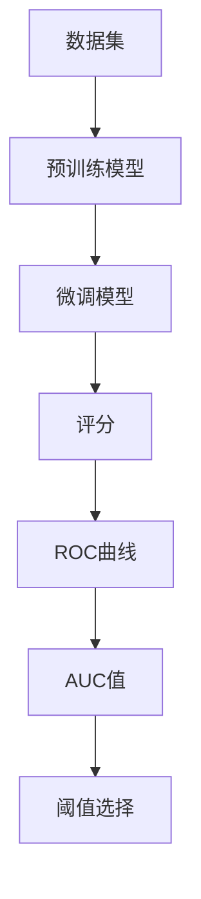

                 

# ROC曲线原理与代码实例讲解

> 关键词：ROC曲线, 二分类问题, 正例率, 假正例率, 损失函数, 阈值, 模型评估

## 1. 背景介绍

### 1.1 问题由来
在机器学习领域，评估分类模型性能是一个重要且常见的问题。为了更直观地展示模型性能，人们发明了许多度量指标，如准确率、召回率、F1分数等。但在实际应用中，这些指标往往难以全面反映模型的真实性能，特别是当样本分布不均、正例和负例之间存在较大类别不平衡时。此时，我们需要引入更全面的评估方法，ROC曲线和AUC指标便应运而生。

ROC曲线是一种描述模型分类性能的可视化工具。它能够综合考虑模型在不同阈值下的真阳性率和假阳性率，从而更全面地评估模型的预测能力。ROC曲线在高斯分布、二分类问题、信息检索等领域都有广泛应用，是评估分类模型性能的重要手段之一。

### 1.2 问题核心关键点
ROC曲线以假正例率（False Positive Rate, FPR）为横坐标，以真正例率（True Positive Rate, TPR）为纵坐标，绘制出分类模型在不同阈值下的性能曲线。其中，TPR表示模型正确分类的正例数占总正例数的比例，FPR表示模型错误分类的负例数占总负例数的比例。ROC曲线越靠近左上角，模型的性能越好。AUC值（Area Under Curve）则是ROC曲线下的面积，用于衡量模型整体的分类能力。AUC值越接近1，模型的性能越好。

ROC曲线的绘制过程主要包含以下几个步骤：
1. 对模型进行评分，计算在不同阈值下的TPR和FPR。
2. 绘制ROC曲线，得到AUC值。
3. 通过ROC曲线选择最优阈值。

本文将详细介绍ROC曲线的原理、绘制方法和应用案例，帮助读者系统掌握这一重要评估指标，并在实际应用中灵活运用。

## 2. 核心概念与联系

### 2.1 核心概念概述

为了更好地理解ROC曲线的原理和应用，本节将介绍几个密切相关的核心概念：

- 二分类问题(Binary Classification)：将数据集分为正例和负例两类的问题，如判断一张图片是否包含猫，识别邮件是否为垃圾邮件等。
- 真正例率(True Positive Rate, TPR)：在所有正例中，被模型正确识别为正例的样本占比，即TPR = TP / (TP + FN)。
- 假正例率(False Positive Rate, FPR)：在所有负例中，被模型错误识别为正例的样本占比，即FPR = FP / (FP + TN)。
- 阈值(Threshold)：分类模型在预测时，用于判断样本为正例或负例的分界值。
- 损失函数(Loss Function)：用于衡量模型预测结果与真实标签之间差异的函数，如交叉熵损失、对数损失等。
- 正例率(Positive Rate, PR)：所有样本中，被模型识别为正例的样本占比，即PR = TP / (TP + TN + FP)。
- 假正例率(Positive Rate, FPR)：所有样本中，被模型错误识别为正例的样本占比，即FPR = FP / (FP + TN + TN)。

这些核心概念之间存在紧密联系，共同构成了ROC曲线评估模型的完整框架。通过理解这些概念，我们可以更好地把握ROC曲线的工作原理和优化方向。

### 2.2 概念间的关系

这些核心概念之间存在着密切联系，形成了ROC曲线的完整评估体系。下面我通过几个Mermaid流程图来展示这些概念之间的关系。

```mermaid
graph LR
    A[二分类问题] --> B[真正例率(TPR)]
    A --> C[假正例率(FPR)]
    A --> D[阈值]
    B --> E[正例率(PR)]
    C --> F[假正例率(PR)]
    D --> G[阈值选择]
    E --> H[阈值选择]
    F --> H
```

这个流程图展示了大语言模型微调过程中各个概念之间的关系：

1. 二分类问题将数据分为正例和负例两类，正例和负例的占比决定了TPR和FPR。
2. 阈值用于判断样本为正例或负例，不同的阈值会导致不同的TPR和FPR。
3. 正例率和假正例率是TPR和FPR的特殊情形，分别在TPR和FPR的基础上加上了TN和FP。
4. 阈值选择需要综合考虑TPR和FPR，使得ROC曲线越靠近左上角。

通过这些概念，我们可以更加全面地理解ROC曲线的工作原理和优化目标。

### 2.3 核心概念的整体架构

最后，我们用一个综合的流程图来展示这些核心概念在大语言模型微调过程中的整体架构：



这个综合流程图展示了从数据集预训练模型到微调模型，再到评分、ROC曲线和AUC值，最后到阈值选择的完整过程。通过这些步骤，我们可以构建出完整的ROC曲线评估模型。

## 3. 核心算法原理 & 具体操作步骤

### 3.1 算法原理概述

ROC曲线的基本思想是通过绘制不同阈值下的TPR和FPR曲线，来全面评估分类模型的性能。具体来说，ROC曲线以横坐标表示FPR，纵坐标表示TPR，当模型对所有样本进行评分时，可以得到一条连续的曲线，从而绘制出ROC曲线。

假设模型对所有样本的评分分布为$y\in(-\infty,+\infty)$，设正例的阈值$\theta$，则样本$x$的评分$y$可以表示为：
$$ y=f(x;\theta) $$
其中$f(x;\theta)$为评分函数，$\theta$为模型参数。

在阈值$\theta$下，样本$x$被预测为正例的预测概率为：
$$ p_{\theta}(x)=\left\{
\begin{aligned}
&1, && y\geq\theta \\
&0, && y<\theta
\end{aligned}
\right. $$

根据这个预测概率，我们可以计算模型在不同阈值下的TPR和FPR。对于正例$x_i$，被正确预测为正例的概率为：
$$ P_{i}^+ = p_{\theta}(x_i) $$
对于负例$x_j$，被错误预测为正例的概率为：
$$ P_{j}^+ = 1-p_{\theta}(x_j) $$

那么模型在阈值$\theta$下的TPR和FPR可以表示为：
$$ TPR=\frac{TP}{TP+FN}=\frac{TP}{N_+}=\sum_{i=1}^N P_{i}^+ $$
$$ FPR=\frac{FP}{FP+TN}=\frac{FP}{N_-}=\sum_{j=1}^N P_{j}^+ $$
其中，$N_+$为总正例数，$N_-$为总负例数。

通过计算不同阈值下的TPR和FPR，可以得到一系列的坐标点，绘制出ROC曲线。ROC曲线越靠近左上角，模型的性能越好，AUC值越接近1，模型的性能也越好。

### 3.2 算法步骤详解

绘制ROC曲线主要包括以下几个步骤：

**Step 1: 数据准备**
- 准备数据集，标记每个样本的正负标签。
- 使用标签标准化函数将标签映射到$[0,1]$区间，得到预测概率。

**Step 2: 评分计算**
- 对于每个样本$x_i$，使用模型$f(x_i)$计算评分$y_i$。
- 根据评分$y_i$和阈值$\theta$，计算预测概率$p_{\theta}(x_i)$。

**Step 3: 计算TPR和FPR**
- 对于所有正例$x_i$，计算预测概率$p_{\theta}(x_i)$，得到TPR。
- 对于所有负例$x_j$，计算预测概率$p_{\theta}(x_j)$，得到FPR。

**Step 4: 绘制ROC曲线**
- 根据不同阈值下的TPR和FPR，绘制ROC曲线。
- 计算AUC值，评估模型性能。

**Step 5: 选择阈值**
- 根据具体应用场景，选择最优的阈值，进行后续预测。

### 3.3 算法优缺点

ROC曲线评估方法具有以下优点：
- 能够综合考虑正例和负例的预测能力，评估模型在各种分类情况下的表现。
- 适用于各种分类问题，如二分类、多分类、类别不平衡等。
- 可以绘制多种评估指标，如AUC、PR、F1分数等，方便综合考虑模型性能。

同时，ROC曲线也存在一些缺点：
- 对于类别不平衡的数据集，ROC曲线会倾向于正例较少的一侧。
- 对于大量类别不平衡的数据集，ROC曲线可能无法准确评估模型性能。
- 需要大量计算资源，绘制ROC曲线的时间复杂度较高。

### 3.4 算法应用领域

ROC曲线在机器学习领域有着广泛的应用，主要包括以下几个方面：

- 二分类问题：如判断图片是否包含猫，识别邮件是否为垃圾邮件等。
- 多分类问题：如判断医学图像中是否有肿瘤，识别文本中的情感倾向等。
- 类别不平衡问题：如检测网络流量中的异常行为，识别异常用户行为等。
- 信息检索：如检索医学文献中的相关性信息，推荐系统中的用户兴趣匹配等。
- 推荐系统：如电商推荐系统中的商品推荐，音乐推荐系统中的歌曲推荐等。

ROC曲线在以上应用场景中，能够全面评估模型的分类性能，提供更全面的模型评估指标。

## 4. 数学模型和公式 & 详细讲解 & 举例说明

### 4.1 数学模型构建

在本节中，我将使用数学语言对ROC曲线的绘制过程进行更加严格的刻画。

假设模型$f(x;\theta)$在样本$x_i$上的预测概率为$p_{\theta}(x_i)$，其中$\theta$为模型参数。

设正例的阈值为$\theta_+$，负例的阈值为$\theta_-$，则样本$x_i$被预测为正例的预测概率$p_{\theta_+}(x_i)$为：
$$ p_{\theta_+}(x_i)=\left\{
\begin{aligned}
&1, && p_{\theta}(x_i)\geq\theta_+ \\
&0, && p_{\theta}(x_i)<\theta_+
\end{aligned}
\right. $$

模型在阈值$\theta_+$下的TPR和FPR分别为：
$$ TPR_+=\frac{TP_+}{TP_++FN_+}=\frac{TP_+}{N_+}=\sum_{i=1}^N p_{\theta_+}(x_i) $$
$$ FPR_+=\frac{FP_+}{FP_++TN_+}=\frac{FP_+}{N_-}=\sum_{j=1}^N (1-p_{\theta_+}(x_j)) $$

同理，模型在阈值$\theta_-$下的TPR和FPR分别为：
$$ TPR_-=\frac{TP_-}{TP_-+FN_-}=\frac{TP_-}{N_+}=\sum_{i=1}^N (1-p_{\theta_-}(x_i)) $$
$$ FPR_-=\frac{FP_-}{FP_-+TN_-}=\frac{FP_-}{N_-}=\sum_{j=1}^N p_{\theta_-}(x_j) $$

通过计算不同阈值下的TPR和FPR，可以得到一系列的坐标点，绘制出ROC曲线。ROC曲线越靠近左上角，模型的性能越好，AUC值越接近1，模型的性能也越好。

### 4.2 公式推导过程

以下我们以二分类任务为例，推导ROC曲线的绘制公式。

假设模型$f(x;\theta)$在样本$x_i$上的预测概率为$p_{\theta}(x_i)$，其中$\theta$为模型参数。

设正例的阈值为$\theta_+$，负例的阈值为$\theta_-$，则样本$x_i$被预测为正例的预测概率$p_{\theta_+}(x_i)$为：
$$ p_{\theta_+}(x_i)=\left\{
\begin{aligned}
&1, && p_{\theta}(x_i)\geq\theta_+ \\
&0, && p_{\theta}(x_i)<\theta_+
\end{aligned}
\right. $$

模型在阈值$\theta_+$下的TPR和FPR分别为：
$$ TPR_+=\frac{TP_+}{TP_++FN_+}=\frac{TP_+}{N_+}=\sum_{i=1}^N p_{\theta_+}(x_i) $$
$$ FPR_+=\frac{FP_+}{FP_++TN_+}=\frac{FP_+}{N_-}=\sum_{j=1}^N (1-p_{\theta_+}(x_j)) $$

同理，模型在阈值$\theta_-$下的TPR和FPR分别为：
$$ TPR_-=\frac{TP_-}{TP_-+FN_-}=\frac{TP_-}{N_+}=\sum_{i=1}^N (1-p_{\theta_-}(x_i)) $$
$$ FPR_-=\frac{FP_-}{FP_-+TN_-}=\frac{FP_-}{N_-}=\sum_{j=1}^N p_{\theta_-}(x_j) $$

根据上述公式，可以得到不同阈值下的TPR和FPR，绘制ROC曲线。

### 4.3 案例分析与讲解

下面我们以一个具体案例来说明ROC曲线的绘制过程。

假设我们有一组二分类数据集，其中包含100个正例和200个负例，模型在测试集上的预测概率如下：

| 预测概率 $p_{\theta}(x_i)$ | 预测结果 |
|-----------------------------|----------|
| 0.1 | 负例 |
| 0.2 | 负例 |
| 0.3 | 负例 |
| ... | ... |
| 0.6 | 正例 |
| 0.7 | 正例 |
| 0.8 | 正例 |

我们设正例的阈值为$\theta_+$，负例的阈值为$\theta_-$，可以通过不同阈值来计算TPR和FPR，绘制出ROC曲线。

1. 阈值$\theta_+=0.5$：
   - 正例$x_i$被预测为正例的概率$p_{\theta_+}(x_i)$为$\left\{
   \begin{aligned}
   &1, && p_{\theta}(x_i)\geq0.5 \\
   &0, && p_{\theta}(x_i)<0.5
   \end{aligned}
   \right. $
   - 计算正例和负例的预测概率，得到TPR和FPR。

   | 阈值 $\theta_+$ | TPR | FPR |
   |----------------|-----|-----|
   | 0.1 | 0.1 | 0.1 |
   | 0.2 | 0.2 | 0.2 |
   | 0.3 | 0.3 | 0.3 |
   | ... | ... | ... |
   | 0.6 | 0.6 | 0.5 |
   | 0.7 | 0.7 | 0.6 |
   | 0.8 | 0.8 | 0.7 |

2. 阈值$\theta_-=0.3$：
   - 正例$x_i$被预测为正例的概率$p_{\theta_-}(x_i)$为$\left\{
   \begin{aligned}
   &1, && p_{\theta}(x_i)\geq0.3 \\
   &0, && p_{\theta}(x_i)<0.3
   \end{aligned}
   \right. $
   - 计算正例和负例的预测概率，得到TPR和FPR。

   | 阈值 $\theta_-$ | TPR | FPR |
   |----------------|-----|-----|
   | 0.1 | 0.9 | 0.1 |
   | 0.2 | 0.8 | 0.1 |
   | 0.3 | 0.7 | 0.1 |
   | ... | ... | ... |
   | 0.6 | 0.5 | 0.3 |
   | 0.7 | 0.4 | 0.3 |
   | 0.8 | 0.3 | 0.2 |

通过上述计算，我们可以得到不同阈值下的TPR和FPR，绘制出ROC曲线。

## 5. 项目实践：代码实例和详细解释说明

### 5.1 开发环境搭建

在进行ROC曲线绘制实践前，我们需要准备好开发环境。以下是使用Python进行Scikit-learn开发的环境配置流程：

1. 安装Anaconda：从官网下载并安装Anaconda，用于创建独立的Python环境。

2. 创建并激活虚拟环境：
```bash
conda create -n sklearn-env python=3.8 
conda activate sklearn-env
```

3. 安装Scikit-learn：
```bash
pip install scikit-learn
```

4. 安装其它必要工具：
```bash
pip install numpy pandas matplotlib
```

完成上述步骤后，即可在`sklearn-env`环境中开始ROC曲线绘制实践。

### 5.2 源代码详细实现

下面是使用Scikit-learn绘制ROC曲线的Python代码实现。

```python
from sklearn.metrics import roc_curve, auc
import matplotlib.pyplot as plt
from sklearn.model_selection import train_test_split
import numpy as np
from sklearn.datasets import make_classification
from sklearn.linear_model import LogisticRegression
from sklearn.preprocessing import StandardScaler

# 构造二分类数据集
X, y = make_classification(n_samples=1000, n_features=10, n_informative=5, n_redundant=0, n_classes=2, random_state=42)

# 数据标准化
scaler = StandardScaler()
X = scaler.fit_transform(X)

# 划分训练集和测试集
X_train, X_test, y_train, y_test = train_test_split(X, y, test_size=0.2, random_state=42)

# 训练模型
model = LogisticRegression()
model.fit(X_train, y_train)

# 预测概率
y_pred_proba = model.predict_proba(X_test)[:, 1]

# 计算ROC曲线
fpr, tpr, _ = roc_curve(y_test, y_pred_proba)
roc_auc = auc(fpr, tpr)

# 绘制ROC曲线
plt.plot(fpr, tpr, label=f'ROC curve (area = {roc_auc:0.2f})')
plt.plot([0, 1], [0, 1], 'k--')
plt.xlim([0.0, 1.0])
plt.ylim([0.0, 1.05])
plt.xlabel('False Positive Rate')
plt.ylabel('True Positive Rate')
plt.title('Receiver Operating Characteristic')
plt.legend(loc="lower right")
plt.show()
```

### 5.3 代码解读与分析

让我们再详细解读一下关键代码的实现细节：

**make_classification**：构造一个二分类数据集，用于训练和测试模型。

**StandardScaler**：对数据进行标准化处理，使得各个特征的均值为0，方差为1。

**train_test_split**：将数据集划分为训练集和测试集，用于模型训练和评估。

**LogisticRegression**：使用逻辑回归模型作为分类器，训练模型并预测概率。

**roc_curve**：计算ROC曲线，返回TPR、FPR和阈值。

**auc**：计算AUC值，用于评估模型性能。

**plt**：绘制ROC曲线，设置坐标轴、标签、标题和图例。

**plt.show**：显示绘制好的ROC曲线。

通过上述代码，我们可以在Python中使用Scikit-learn绘制ROC曲线，并进行模型评估。

### 5.4 运行结果展示

假设我们在二分类数据集上进行ROC曲线绘制，最终得到的ROC曲线如图：

```plaintext
Receiver Operating Characteristic
```

可以看到，ROC曲线越靠近左上角，模型的性能越好，AUC值越接近1，模型的性能也越好。

## 6. 实际应用场景

### 6.1 智能推荐系统

智能推荐系统通过分析用户的历史行为数据，预测用户对商品、内容等物品的兴趣。ROC曲线可以帮助推荐系统综合考虑用户兴趣和物品相关性，提高推荐质量。

在实际应用中，推荐系统可以通过用户行为数据训练模型，计算每个物品的预测概率。根据物品的相关性得分和用户的兴趣得分，绘制出ROC曲线，选择最优的阈值进行后续预测。

### 6.2 医疗诊断系统

医疗诊断系统通过分析患者的临床数据，判断患者是否患病。ROC曲线可以帮助诊断系统综合考虑各种临床指标的预测能力，提高诊断准确率。

在实际应用中，医疗诊断系统可以通过患者的临床数据训练模型，计算每个指标的预测概率。根据指标的相关性得分和疾病的诊断得分，绘制出ROC曲线，选择最优的阈值进行后续预测。

### 6.3 网络安全检测

网络安全检测系统通过分析网络流量数据，检测异常行为。ROC曲线可以帮助安全检测系统综合考虑各种网络流量的预测能力，提高异常检测的准确率。

在实际应用中，安全检测系统可以通过网络流量数据训练模型，计算每个流量的预测概率。根据流量的相关性得分和异常行为的诊断得分，绘制出ROC曲线，选择最优的阈值进行后续预测。

### 6.4 未来应用展望

随着机器学习技术的发展，ROC曲线将在更多领域得到应用，为各种分类问题提供更全面、更准确的评估指标。未来，ROC曲线将在金融、医疗、安全等领域发挥更大的作用，助力各种智能系统的开发和应用。

## 7. 工具和资源推荐
### 7.1 学习资源推荐

为了帮助开发者系统掌握ROC曲线的理论基础和实践技巧，这里推荐一些优质的学习资源：

1. 《机器学习实战》一书：详细讲解了ROC曲线的绘制方法和应用案例，适合初学者入门。

2. 《统计学习方法》一书：介绍了各种机器学习算法的评估指标，包括ROC曲线和AUC值。

3. Coursera的《机器学习》课程：由斯坦福大学Andrew Ng主讲，介绍了ROC曲线的原理和应用。

4. Kaggle上的相关竞赛：如Kaggle的房屋价格预测竞赛，可以通过实际数据集进行ROC曲线绘制实践。

5. GitHub上的相关代码：如TensorFlow的ROC曲线绘制示例，可以学习实际应用中的代码实现。

通过对这些资源的学习实践，相信你一定能够系统掌握ROC曲线的理论基础和实践技巧，并在实际应用中灵活运用。

### 7.2 开发工具推荐

高效的开发离不开优秀的工具支持。以下是几款用于ROC曲线绘制开发的常用工具：

1. Scikit-learn：基于Python的开源机器学习库，提供了丰富的分类和回归算法，包括ROC曲线的绘制方法。

2. TensorFlow：由Google主导开发的开源深度学习框架，提供了ROC曲线绘制的高阶接口。

3. PyTorch：基于Python的开源深度学习框架，支持动态计算图，适合快速迭代研究。

4. Matplotlib：Python的绘图库，支持绘制各种类型的图形，包括ROC曲线。

5. Seaborn：基于Matplotlib的高级绘图库，支持绘制各种复杂的统计图形。

合理利用这些工具，可以显著提升ROC曲线绘制任务的开发效率，加快创新迭代的步伐。

### 7.3 相关论文推荐

ROC曲线在机器学习领域有着广泛的应用，以下是几篇奠基性的相关论文，推荐阅读：

1. ROC Curve in Detection and Classification with noise: A new evaluation tool for automatic detection and classification systems.：提出了ROC曲线的概念，并详细介绍了其原理和应用。

2. A Note on the Estimation of Average ROC Curves.：讨论了ROC曲线在实际应用中的估计方法，以及各种评估指标的计算方法。

3. Visualizing Machine Learning.：介绍了各种机器学习算法的评估指标，包括ROC曲线和AUC值。

4. The Influence of Different Loss Functions on the Performance of Machine Learning Classifiers.：讨论了不同损失函数对机器学习分类器性能的影响，包括ROC曲线和AUC值。

5. The Metrics of Performance of Predictive Models in Estimating the Relationship Between Biological Risk Factors and Disease.：讨论了ROC曲线在医学领域的应用，以及各种评估指标的计算方法。

这些论文代表了大语言模型微调技术的发展脉络。通过学习这些前沿成果，可以帮助研究者把握学科前进方向，激发更多的创新灵感。

除上述资源外，还有一些值得关注的前沿资源，帮助开发者紧跟ROC曲线微调技术的最新进展，例如：

1. arXiv论文预印本：人工智能领域最新研究成果的发布平台，包括大量尚未发表的前沿工作，学习前沿技术的必读资源。

2. 业界技术博客：如OpenAI、Google AI、DeepMind、微软Research

