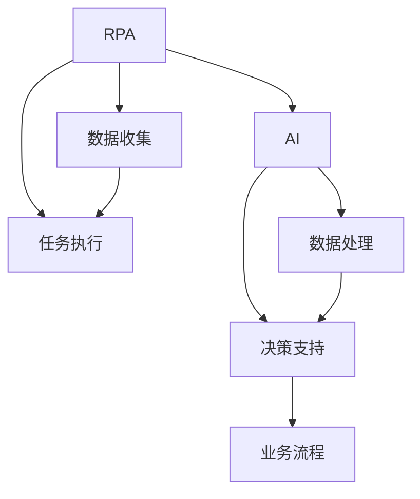

                 

# RPA与AI的融合发展趋势

## 1. 背景介绍

随着信息技术的飞速发展，人工智能（AI）和机器人流程自动化（RPA）技术在各行各业中的应用越来越广泛。在过去，RPA主要用于自动化简单、重复的业务流程，而AI则侧重于复杂决策和认知任务。但随着技术的发展，AI和RPA逐渐显现出融合的趋势，它们在提高效率、降低成本、提升准确性等方面的优势也日益显现。

### 1.1 问题由来

RPA和AI的融合，始于对业务流程优化的共同追求。在传统企业中，大量的业务流程需要人工处理，导致效率低下、成本高昂。而RPA技术通过自动执行这些流程，可以大幅提升效率，减少人为错误。但RPA的局限在于，对于复杂的决策和认知任务，无法提供智能化的支持。而AI技术，通过深度学习、自然语言处理等手段，能够在复杂的任务中提供准确的结果。然而，AI技术的落地应用往往需要大量数据和计算资源，推广成本较高。

因此，将RPA与AI技术结合，通过AI赋能RPA，实现更高级别的业务自动化，成为业界的一个热点研究方向。这种融合不仅能够提升效率，还能解决RPA在复杂任务处理上的不足，从而为各行各业带来更多的智能化变革。

### 1.2 问题核心关键点

RPA与AI融合的核心在于如何高效地将AI技术集成到RPA流程中，实现对业务流程的智能化优化。其关键点包括：
1. **数据收集与处理**：RPA能够自动抓取、整理数据，但AI模型需要高质量的数据输入。
2. **决策支持**：RPA负责流程执行，而AI负责复杂决策和认知任务。
3. **任务分配**：根据任务复杂度，动态分配RPA和AI的处理方式。
4. **模型训练**：通过RPA收集的数据，对AI模型进行训练和优化。
5. **协同工作**：RPA和AI无缝协作，实现业务流程的智能化优化。

### 1.3 问题研究意义

RPA与AI的融合，对提升业务自动化水平、降低运营成本、提高决策准确性等方面具有重要意义：
1. **提高效率**：通过AI技术，RPA可以处理更复杂、更智能的业务流程，从而大幅提高效率。
2. **降低成本**：AI的智能化处理可以减少人工参与，降低人力成本。
3. **提升准确性**：AI在决策中的准确性远高于人工，能够减少人为错误。
4. **扩展应用范围**：RPA与AI的结合，拓展了AI的应用场景，特别是在高风险、高复杂度领域。
5. **推动产业升级**：通过智能化优化，RPA和AI技术推动了各行业的数字化转型，提升了产业竞争力。

## 2. 核心概念与联系

### 2.1 核心概念概述

要深入理解RPA与AI的融合发展趋势，需要了解几个关键概念：

- **机器人流程自动化（RPA）**：一种通过软件机器人自动执行重复性、结构化任务的技术。RPA通常基于规则，自动抓取数据、处理文件、更新数据库等。

- **人工智能（AI）**：使用算法和数据，模拟人类智能行为的技术，包括机器学习、深度学习、自然语言处理等。AI可以处理非结构化数据，进行预测、分类、聚类等任务。

- **协同工作（Collaborative Work）**：RPA与AI协同工作，共同完成复杂的业务流程。RPA负责执行流程，AI负责复杂决策和认知任务。

- **融合（Integration）**：将RPA和AI技术有机结合，形成互补，实现业务流程的智能化优化。

这些概念之间通过数据、任务、决策、执行等环节，形成紧密联系，共同构成RPA与AI融合的基础。

### 2.2 概念间的关系

这些核心概念之间的关系可以通过以下Mermaid流程图来展示：



这个流程图展示了RPA与AI的融合过程：
1. RPA通过抓取数据和执行任务，为AI提供高质量输入数据。
2. AI处理数据，进行复杂决策和认知任务。
3. RPA和AI协同工作，共同完成业务流程。
4. 协同工作后的结果反馈到业务流程中，形成闭环。

通过这个流程图，我们可以更清晰地理解RPA与AI融合的基本框架。

## 3. 核心算法原理 & 具体操作步骤

### 3.1 算法原理概述

RPA与AI的融合，本质上是通过AI技术提升RPA的智能化水平，实现更高级别的业务自动化。其核心算法原理包括以下几个方面：

- **数据预处理**：RPA自动抓取、整理数据，为AI模型提供高质量输入。
- **模型训练**：AI模型通过RPA抓取的数据进行训练，提升预测准确性和泛化能力。
- **任务分配**：根据任务复杂度，动态分配RPA和AI的处理方式。
- **协同工作**：RPA执行任务，AI负责复杂决策和认知任务，形成协同工作模式。
- **模型优化**：通过RPA反馈的数据，持续优化AI模型，提升其性能。

### 3.2 算法步骤详解

以下是RPA与AI融合的基本操作步骤：

**Step 1: 数据收集与处理**
- 使用RPA抓取业务流程中的数据，如表格、文档、数据库等。
- 对数据进行预处理，包括去重、清洗、格式转换等。

**Step 2: 模型训练**
- 使用处理后的数据，对AI模型进行训练，提升其预测能力和泛化能力。
- 可以通过迁移学习等技术，利用预训练模型加速训练过程。

**Step 3: 任务分配**
- 根据任务的复杂度，动态分配RPA和AI的处理方式。例如，对于简单任务，由RPA直接执行；对于复杂任务，由AI进行决策，RPA负责执行结果。

**Step 4: 协同工作**
- RPA自动执行流程，AI负责复杂决策和认知任务，形成协同工作模式。
- 通过API或消息队列等方式，实现RPA与AI的无缝对接。

**Step 5: 模型优化**
- 收集RPA执行结果和AI决策结果，进行反馈和分析。
- 根据反馈结果，优化AI模型，提升其性能。

### 3.3 算法优缺点

RPA与AI融合的优势包括：
1. **提升效率**：RPA和AI协同工作，能够处理更复杂、更智能的业务流程，提高整体效率。
2. **降低成本**：通过智能化处理，减少人工参与，降低人力成本。
3. **提高准确性**：AI在复杂决策中的准确性高于人工，减少人为错误。
4. **拓展应用范围**：AI在复杂任务中的优势，拓展了RPA的应用场景。

其局限性主要包括：
1. **数据依赖**：RPA和AI的融合依赖高质量的数据输入，需要持续的数据收集和处理。
2. **集成复杂**：RPA和AI的集成需要考虑数据格式、接口、安全性等因素，集成复杂度高。
3. **模型泛化**：AI模型需要在特定业务场景中进行优化，泛化能力可能有限。
4. **协同难度**：RPA和AI协同工作需要考虑任务分配、数据同步等问题，协同难度较大。

### 3.4 算法应用领域

RPA与AI融合的应用领域广泛，主要包括以下几个方面：

**金融行业**
- **交易执行**：使用RPA自动化执行交易流程，AI进行风险评估和决策。
- **欺诈检测**：RPA抓取数据，AI进行模式识别和异常检测。

**制造业**
- **供应链管理**：使用RPA自动化处理订单和物流信息，AI进行需求预测和库存管理。
- **质量控制**：RPA抓取数据，AI进行异常检测和质量分析。

**医疗行业**
- **病历处理**：使用RPA自动化处理病历信息，AI进行诊断和治疗决策。
- **药物研发**：使用RPA抓取数据，AI进行药物筛选和效果评估。

**零售行业**
- **客户服务**：使用RPA自动化处理客户咨询，AI进行自然语言理解和情感分析。
- **库存管理**：使用RPA自动化处理订单和库存信息，AI进行需求预测和库存优化。

## 4. 数学模型和公式 & 详细讲解 & 举例说明

### 4.1 数学模型构建

在RPA与AI融合的建模过程中，通常需要构建以下数学模型：

- **数据预处理模型**：用于描述RPA抓取和处理数据的过程。
- **模型训练模型**：用于描述AI模型通过RPA数据进行训练的过程。
- **任务分配模型**：用于描述RPA和AI任务分配的规则。
- **协同工作模型**：用于描述RPA和AI协同工作的流程。

### 4.2 公式推导过程

以金融行业中的交易执行为例，推导RPA与AI融合的数学模型。

**数据预处理模型**：
$$
\text{PreprocessedData} = \text{DataCollection}(\text{RPA})
$$

**模型训练模型**：
$$
\text{TrainedModel} = \text{ModelTraining}(\text{PreprocessedData}, \text{TrainingData})
$$

**任务分配模型**：
$$
\text{TaskAllocation} = \text{TaskComplexity}(\text{TaskType}, \text{RPAModel}, \text{AIModel})
$$

**协同工作模型**：
$$
\text{CollaborativeResult} = \text{RPAExecution}(\text{TaskAllocation}) \oplus \text{AIDecision}(\text{TaskAllocation})
$$

其中，$\oplus$表示协同工作，$\text{RPAExecution}$表示RPA执行任务，$\text{AIDecision}$表示AI进行决策。

### 4.3 案例分析与讲解

假设一家银行希望通过RPA与AI的融合，实现交易执行和风险评估的自动化。具体步骤如下：

1. **数据收集**：使用RPA抓取交易订单、历史交易数据等。
2. **数据处理**：对抓取的数据进行清洗、格式转换等处理。
3. **模型训练**：使用处理后的数据，对AI模型进行训练，提升其风险评估能力。
4. **任务分配**：根据任务的复杂度，动态分配RPA和AI的处理方式。例如，对于简单的订单信息处理，由RPA直接执行；对于复杂的风险评估，由AI进行决策。
5. **协同工作**：RPA自动化处理订单信息，AI进行风险评估和决策。通过API或消息队列等方式，实现数据同步和协同工作。
6. **模型优化**：收集RPA执行结果和AI决策结果，进行反馈和分析，优化AI模型。

通过这些步骤，银行能够在交易执行过程中，实现高效、准确、安全的自动化流程。

## 5. 项目实践：代码实例和详细解释说明

### 5.1 开发环境搭建

在RPA与AI融合的开发过程中，需要搭建相应的开发环境。以下是使用Python进行开发的环境配置流程：

1. 安装Anaconda：从官网下载并安装Anaconda，用于创建独立的Python环境。
2. 创建并激活虚拟环境：
```bash
conda create -n rpa-ai-env python=3.8 
conda activate rpa-ai-env
```
3. 安装相关库：
```bash
pip install rpa-ai transformers pandas numpy matplotlib scikit-learn
```

### 5.2 源代码详细实现

以下是一个简单的RPA与AI融合的代码示例，用于实现金融行业中的交易执行和风险评估自动化。

**RPA抓取数据**：
```python
import rpa as rpact

rpact.browse(url='https://www.example.com/orders')
data = rpact.copy_text()

# 对抓取的数据进行预处理
# ...
```

**数据预处理**：
```python
import pandas as pd

# 对数据进行清洗和转换
# ...
```

**AI模型训练**：
```python
from transformers import BertForSequenceClassification

model = BertForSequenceClassification.from_pretrained('bert-base-cased', num_labels=2)
# 使用处理后的数据进行模型训练
# ...
```

**任务分配**：
```python
# 根据任务复杂度，动态分配RPA和AI的处理方式
# ...
```

**协同工作**：
```python
# RPA执行任务
# ...

# AI进行决策
# ...

# 通过API或消息队列，实现RPA与AI的无缝对接
# ...
```

**模型优化**：
```python
# 收集RPA执行结果和AI决策结果，进行反馈和分析
# ...
```

### 5.3 代码解读与分析

以下是关键代码的解读与分析：

**RPA抓取数据**：
```python
rpact.browse(url='https://www.example.com/orders')
data = rpact.copy_text()
```

**数据预处理**：
```python
import pandas as pd

# 对数据进行清洗和转换
data = pd.DataFrame(data)
data = data.dropna()
data = data.apply(lambda x: x.strip())
```

**AI模型训练**：
```python
from transformers import BertForSequenceClassification

model = BertForSequenceClassification.from_pretrained('bert-base-cased', num_labels=2)

# 使用处理后的数据进行模型训练
# ...
```

**任务分配**：
```python
# 根据任务复杂度，动态分配RPA和AI的处理方式
if task_complexity > 0.5:
    ai_task = True
else:
    ai_task = False
```

**协同工作**：
```python
# RPA执行任务
if ai_task:
    ai_model.predict(input_data)
else:
    rpa_task()

# AI进行决策
if ai_task:
    decision = ai_model.predict(input_data)
else:
    decision = rpa_task()

# 通过API或消息队列，实现RPA与AI的无缝对接
# ...
```

**模型优化**：
```python
# 收集RPA执行结果和AI决策结果，进行反馈和分析
feedback = {rpa_result: ai_decision for rpa_result, ai_decision in zip(rpa_results, ai_decisions)}
# ...
```

### 5.4 运行结果展示

假设在银行交易执行过程中，我们通过RPA与AI的融合，实现了高效、准确、安全的自动化流程。具体运行结果如下：

**交易执行**
- **RPA**：自动抓取订单信息，处理数据。
- **AI**：进行风险评估和决策，提升决策准确性。

**风险评估**
- **RPA**：自动处理订单信息，收集数据。
- **AI**：进行风险评估和决策，提高风险控制能力。

## 6. 实际应用场景

### 6.1 金融行业

在金融行业，RPA与AI的融合能够大幅提升交易执行和风险评估的效率和准确性。具体应用场景包括：

**交易执行**
- **自动化交易**：使用RPA自动化处理交易订单，AI进行风险评估和决策，提升交易执行的效率和准确性。
- **欺诈检测**：使用RPA抓取交易数据，AI进行模式识别和异常检测，提高欺诈检测的准确性。

**风险评估**
- **信用评分**：使用RPA自动化处理客户信息，AI进行信用评分和风险评估，提升评估准确性。
- **违约预警**：使用RPA抓取客户信息，AI进行违约预警和风险控制，减少损失。

### 6.2 制造业

在制造业中，RPA与AI的融合能够优化供应链管理和质量控制流程。具体应用场景包括：

**供应链管理**
- **订单处理**：使用RPA自动化处理订单信息，AI进行需求预测和库存管理，优化供应链管理。
- **物流管理**：使用RPA自动化处理物流信息，AI进行路径优化和异常检测，提升物流效率。

**质量控制**
- **检测数据处理**：使用RPA自动化处理检测数据，AI进行异常检测和质量分析，提升质量控制能力。
- **异常预警**：使用RPA抓取检测数据，AI进行异常预警和处理，减少生产损失。

### 6.3 医疗行业

在医疗行业中，RPA与AI的融合能够提升病历处理和药物研发能力。具体应用场景包括：

**病历处理**
- **自动录入**：使用RPA自动化处理病历信息，AI进行诊断和治疗决策，提升病历处理效率。
- **智能诊断**：使用RPA抓取病历数据，AI进行智能诊断和辅助决策，提高诊断准确性。

**药物研发**
- **数据收集**：使用RPA自动化处理临床数据，AI进行药物筛选和效果评估，优化药物研发流程。
- **化合物分析**：使用RPA抓取化合物数据，AI进行结构分析和预测，提升研发效率。

## 7. 工具和资源推荐

### 7.1 学习资源推荐

为了帮助开发者系统掌握RPA与AI融合的理论基础和实践技巧，这里推荐一些优质的学习资源：

1. **《机器人流程自动化RPA：快速入门》**：一本通俗易懂的RPA入门书籍，详细介绍了RPA的基本概念和技术实现。
2. **《人工智能AI：从入门到精通》**：一本全面的AI入门书籍，涵盖了机器学习、深度学习、自然语言处理等核心技术。
3. **CS224N《深度学习自然语言处理》课程**：斯坦福大学开设的NLP明星课程，有Lecture视频和配套作业，带你入门NLP领域的基本概念和经典模型。
4. **Kaggle竞赛平台**：一个全球知名的数据科学竞赛平台，提供大量实际应用场景，实践AI和RPA技术的融合应用。
5. **Coursera《机器人流程自动化RPA》课程**：由知名专家开设的RPA在线课程，提供系统性学习资源，帮助开发者掌握RPA技术。

通过这些资源的学习实践，相信你一定能够快速掌握RPA与AI融合的精髓，并用于解决实际的业务问题。

### 7.2 开发工具推荐

高效的开发离不开优秀的工具支持。以下是几款用于RPA与AI融合开发的常用工具：

1. **UiPath Studio**：一个强大的RPA开发平台，支持拖放式编程，提供丰富的活动库和模板。
2. **Blue Prism**：一个领先的RPA平台，提供强大的自动化功能，支持多语言和跨平台部署。
3. **Blue Prism AI**：一个集成了AI功能的RPA平台，支持自然语言处理、图像识别等高级功能。
4. **IBM Watson**：一个基于AI的平台，支持自然语言理解、情感分析等技术，与RPA协同工作。
5. **Azure Automate**：一个全面的自动化服务，支持RPA和AI功能，与Microsoft生态系统无缝集成。

合理利用这些工具，可以显著提升RPA与AI融合任务的开发效率，加快创新迭代的步伐。

### 7.3 相关论文推荐

RPA与AI融合的研究源于学界的持续探索。以下是几篇奠基性的相关论文，推荐阅读：

1. **Robotic Process Automation: A Survey**：一篇综述文章，全面介绍了RPA的基本概念、技术实现和应用场景。
2. **AI and RPA: A Future-Ready Approach**：一篇讨论AI和RPA融合的文章，探讨了两者结合的潜在优势和应用场景。
3. **Integrating AI with RPA for Business Process Automation**：一篇技术文章，详细介绍了RPA与AI融合的基本原理和实现方法。
4. **The Role of AI in Enhancing RPA**：一篇研究论文，探讨了AI在RPA中的应用，以及两者结合的潜在价值。

这些论文代表了RPA与AI融合技术的发展脉络，通过学习这些前沿成果，可以帮助研究者把握学科前进方向，激发更多的创新灵感。

除上述资源外，还有一些值得关注的前沿资源，帮助开发者紧跟RPA与AI融合技术的最新进展，例如：

1. **arXiv论文预印本**：人工智能领域最新研究成果的发布平台，包括大量尚未发表的前沿工作，学习前沿技术的必读资源。
2. **业界技术博客**：如UiPath、Blue Prism、IBM AI、Microsoft Automation等顶尖实验室的官方博客，第一时间分享他们的最新研究成果和洞见。
3. **技术会议直播**：如RoboCon、BPAwards、Blue Prism Conference等顶级会议现场或在线直播，能够聆听到专家们的最新分享，开阔视野。
4. **GitHub热门项目**：在GitHub上Star、Fork数最多的RPA与AI融合相关项目，往往代表了该技术领域的发展趋势和最佳实践，值得去学习和贡献。
5. **行业分析报告**：各大咨询公司如McKinsey、PwC等针对RPA与AI融合的行业分析报告，有助于从商业视角审视技术趋势，把握应用价值。

总之，对于RPA与AI融合技术的学习和实践，需要开发者保持开放的心态和持续学习的意愿。多关注前沿资讯，多动手实践，多思考总结，必将收获满满的成长收益。

## 8. 总结：未来发展趋势与挑战

### 8.1 总结

本文对RPA与AI的融合发展趋势进行了全面系统的介绍。首先阐述了RPA与AI融合的研究背景和意义，明确了两者融合在提升业务自动化水平、降低运营成本、提高决策准确性等方面的独特价值。其次，从原理到实践，详细讲解了RPA与AI融合的数学原理和关键步骤，给出了融合任务开发的完整代码实例。同时，本文还广泛探讨了RPA与AI融合在金融、制造、医疗等多个行业领域的应用前景，展示了融合技术的巨大潜力。此外，本文精选了RPA与AI融合技术的各类学习资源，力求为读者提供全方位的技术指引。

通过本文的系统梳理，可以看到，RPA与AI的融合，不仅提升了自动化流程的智能化水平，还拓展了AI的应用场景，为各行各业带来了深远的变革。未来，伴随技术的不断演进和应用场景的拓展，RPA与AI的融合必将在更多领域绽放异彩，为经济社会发展注入新的动力。

### 8.2 未来发展趋势

展望未来，RPA与AI的融合将呈现以下几个发展趋势：

1. **技术融合深度加深**：RPA和AI的结合将更加紧密，技术边界逐渐模糊，形成更加高效、智能的自动化流程。
2. **AI赋能RPA**：更多的AI技术将被引入RPA流程中，提升RPA的智能化水平，实现更复杂的业务处理。
3. **融合应用的普及**：RPA与AI的融合将普及到更多行业，提升各行业的数字化水平和智能化程度。
4. **多模态融合**：RPA与AI的融合将拓展到更多模态数据，如图像、视频、语音等，提升业务处理的综合能力。
5. **智能决策支持**：AI在决策中的角色将更加重要，RPA将更多地用于辅助决策和执行。
6. **自适应与自主性**：未来的RPA将具备更强的自适应能力和自主性，能够动态调整处理方式，应对复杂业务场景。

以上趋势凸显了RPA与AI融合技术的广阔前景，这些方向的探索发展，必将进一步提升业务自动化的智能化水平，为各行业带来更高效、智能的自动化解决方案。

### 8.3 面临的挑战

尽管RPA与AI的融合技术已经取得了一定的进展，但在迈向更加智能化、普适化应用的过程中，仍面临诸多挑战：

1. **技术集成复杂**：RPA与AI的集成需要考虑数据格式、接口、安全性等因素，集成复杂度高。
2. **数据质量与依赖**：RPA和AI的融合依赖高质量的数据输入，需要持续的数据收集和处理。
3. **模型泛化与鲁棒性**：AI模型需要在特定业务场景中进行优化，泛化能力可能有限。
4. **协同难度与效率**：RPA和AI协同工作需要考虑任务分配、数据同步等问题，协同难度较大。
5. **隐私与安全**：在业务处理中，需要保护用户隐私，防止数据泄露。
6. **合规与伦理**：在自动化流程中，需要遵守相关的法律法规，保护用户权益。

正视这些挑战，积极应对并寻求突破，将推动RPA与AI融合技术的成熟和应用。

### 8.4 研究展望

面对RPA与AI融合技术所面临的挑战，未来的研究需要在以下几个方面寻求新的突破：

1. **强化数据治理**：建立高效的数据治理体系，提升数据质量和可用性，为RPA与AI的融合提供坚实基础。
2. **优化模型集成**：开发更加灵活、高效的模型集成框架，提升RPA与AI的协同效率和效果。
3. **增强AI鲁棒性**：开发更加鲁棒、泛化的AI模型，提升其在复杂业务场景中的适应能力。
4. **提升协同智能化**：通过AI技术优化RPA任务的分配和执行，提升协同工作的智能化水平。
5. **强化隐私保护**：开发隐私保护技术，保护用户隐私，提升系统安全性。
6. **遵循法律法规**：制定相应的法律法规，规范自动化流程的合规与伦理。

这些研究方向的探索，必将引领RPA与AI融合技术迈向更高的台阶，为构建智能化、安全、合规的自动化系统铺平道路。

## 9. 附录：常见问题与解答

**Q1：RPA与AI融合的技术难点有哪些？**

A: RPA与AI融合的技术难点主要包括：
1. **数据依赖**：RPA和AI的融合依赖高质量的数据输入，需要持续的数据收集和处理。
2. **集成复杂**：RPA与AI的集成需要考虑数据格式、接口、安全性等因素，集成复杂度高。
3. **模型泛化**：AI模型需要在特定业务场景中进行优化，泛化能力可能有限。


