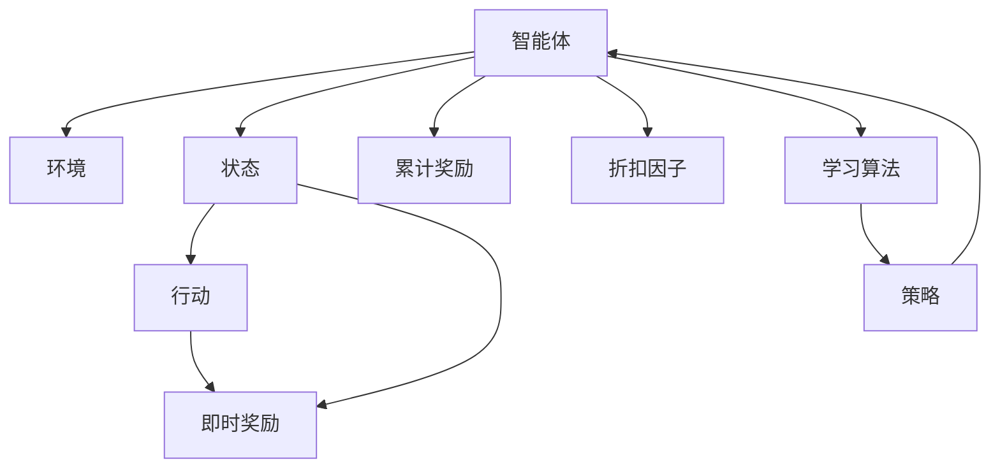
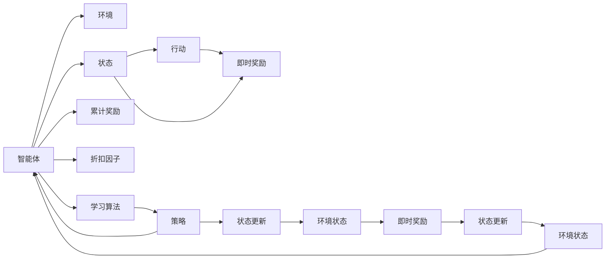

                 

## 1. 背景介绍

### 1.1 问题由来
在过去的几十年里，机器学习特别是监督学习在数据驱动的决策过程中表现得尤为出色。然而，在需要动态适应复杂环境和多变目标的情况下，传统的监督学习方法就显得力不从心。例如，在自动驾驶、机器人控制、智能游戏等任务中，智能体需要根据当前环境动态选择行动，以达到最优的目标。

因此，强化学习(Reinforcement Learning, RL)成为了解决这类问题的重要工具。强化学习通过试错的方式，让智能体在与环境的交互中学习最优策略，从而实现了智能体与环境的协同进化。

### 1.2 问题核心关键点
强化学习的核心在于智能体与环境之间的交互。智能体在每个时间步(t)从环境(environment)接收一个状态(state) $s_t$，并根据当前状态采取一个行动(action) $a_t$，智能体的目标是最大化累计奖励(total reward) $R = \sum_{t=1}^{\infty} \gamma^t r_t$，其中 $r_t$ 是每个时间步的即时奖励，$\gamma$ 是折扣因子。

强化学习具有以下特点：
- 基于试错学习：智能体通过与环境的交互来学习最优策略，无需显式标注数据。
- 动态调整：环境变化时，智能体可以动态调整策略以适应新的环境。
- 自适应：智能体可以根据即时反馈和累计奖励自主优化策略。
- 多模态输入输出：智能体可接收多种形式的状态和行动，如视觉、文本、音频等。

### 1.3 问题研究意义
强化学习通过智能体与环境的交互，从环境中学习最优策略，从而适应复杂多变的环境和目标。相比于传统监督学习，强化学习在动态环境中的表现更为出色。通过强化学习，智能体可以实现自动驾驶、机器人控制、游戏智能等许多传统机器学习难以解决的问题。

研究强化学习的原理与代码实现，不仅有助于理解智能体的学习过程，还能为未来的智能系统设计提供重要参考。

## 2. 核心概念与联系

### 2.1 核心概念概述

强化学习涉及多个核心概念，下面进行简要介绍：

- **智能体(Agent)**：在环境中执行行动，通过与环境的交互学习策略的决策者。
- **环境(Environment)**：提供状态(state)和即时奖励(reward)，接收行动(action)，更新状态的动态系统。
- **状态(State)**：描述环境的当前状况，是智能体的行动依据。
- **行动(Action)**：智能体对环境执行的操作。
- **即时奖励(Reward)**：反映智能体在当前状态下行动的好坏，通常为0-1之间的实数。
- **累计奖励(Reward)**：智能体在时间步 $t$ 到时间步 $T$ 之间获得的即时奖励总和。
- **折扣因子($\gamma$)**：用于平衡即时奖励和未来奖励的重要参数，通常设置为0.99。

### 2.2 核心概念间的关系

这些核心概念之间存在着密切的联系，下面通过两个流程图展示它们的关系：





这两个图展示了智能体与环境之间的交互，以及学习算法和策略的关系。智能体通过与环境的交互，接收状态、执行行动并得到即时奖励，进而调整策略以最大化累计奖励。学习算法则是智能体调整策略的决策过程，策略是智能体在当前状态下行动的分布或策略函数。

## 3. 核心算法原理 & 具体操作步骤

### 3.1 算法原理概述

强化学习的核心算法包括Q-learning、SARSA、Deep Q-learning等。这里以Q-learning算法为例，介绍其基本原理：

Q-learning是一种基于值迭代的强化学习算法。它通过更新Q值函数 $Q(s,a)$ 来优化策略。Q值函数表示智能体在状态 $s$ 下采取行动 $a$ 的累计奖励。具体来说，Q值函数的更新规则为：

$$
Q(s,a) \leftarrow Q(s,a) + \alpha[r + \gamma \max_a Q(s',a')] - Q(s,a)
$$

其中，$\alpha$ 为学习率，$s'$ 为下一个状态，$a'$ 为下一个行动。

Q-learning通过不断迭代更新Q值函数，最大化累计奖励，从而学习到最优策略。

### 3.2 算法步骤详解

Q-learning算法的步骤如下：

1. 初始化Q值函数 $Q(s,a)$ 为0。
2. 智能体在环境中执行行动，观察状态和即时奖励。
3. 根据状态和即时奖励，计算下一个行动的Q值。
4. 更新Q值函数 $Q(s,a)$。
5. 重复执行步骤2-4，直到达到终止条件或达到预设的迭代次数。

### 3.3 算法优缺点

Q-learning算法具有以下优点：
- 无需环境模型：Q-learning不需要环境模型的支持，可以直接从环境交互中学习。
- 易于理解：Q-learning的原理简单直观，易于理解和实现。
- 收敛性好：在适当的学习率和Q值初始化的条件下，Q-learning可以收敛到最优解。

同时，Q-learning也存在一些缺点：
- 学习率敏感：Q-learning对学习率非常敏感，学习率过大可能导致收敛缓慢，过小则可能导致收敛不充分。
- 探索与利用的平衡：在Q-learning中，智能体需要在探索和利用之间找到平衡，以便尽快找到最优解。
- 状态空间爆炸：在状态空间较大的情况下，Q-learning的计算复杂度较高。

### 3.4 算法应用领域

强化学习广泛应用于多个领域，下面列举几个主要的应用场景：

- **自动驾驶**：通过与环境的交互，智能车学习最优驾驶策略，以实现安全的自动驾驶。
- **机器人控制**：智能机器人通过与环境的交互，学习最优控制策略，完成搬运、导航等任务。
- **游戏智能**：智能体通过与游戏环境的交互，学习最优游戏策略，以获得高分。
- **推荐系统**：推荐系统通过与用户交互，学习用户偏好，提供个性化推荐。
- **金融交易**：金融智能体通过与市场的交互，学习最优交易策略，以获得高收益。

## 4. 数学模型和公式 & 详细讲解 & 举例说明

### 4.1 数学模型构建

强化学习的数学模型可以描述为：

- **状态(state)**：$s_t \in S$，表示智能体在时间步 $t$ 的当前状态。
- **行动(action)**：$a_t \in A$，表示智能体在时间步 $t$ 采取的行动。
- **即时奖励(reward)**：$r_t \in R$，表示智能体在时间步 $t$ 获得的即时奖励。
- **累计奖励(total reward)**：$R = \sum_{t=1}^T r_t$，表示智能体在时间步 $1$ 到 $T$ 之间的累计奖励。
- **折扣因子(gamma)**：$\gamma \in [0,1]$，表示未来奖励的折扣因子。

### 4.2 公式推导过程

Q-learning算法的核心公式是值迭代方程：

$$
Q(s,a) \leftarrow Q(s,a) + \alpha[r + \gamma \max_a Q(s',a')] - Q(s,a)
$$

其中，$Q(s,a)$ 为状态 $s$ 下采取行动 $a$ 的Q值，$r$ 为即时奖励，$s'$ 为下一个状态，$a'$ 为下一个行动，$\alpha$ 为学习率，$\gamma$ 为折扣因子。

在每个时间步，智能体根据当前状态 $s_t$ 采取行动 $a_t$，观察下一个状态 $s_{t+1}$ 和即时奖励 $r_t$。然后根据值迭代方程更新Q值函数 $Q(s_t,a_t)$。

### 4.3 案例分析与讲解

假设我们有一个简单的迷宫问题，智能体需要通过迷宫到达出口，迷宫中每个位置都有一个即时奖励。我们可以将迷宫中的每个位置看作一个状态，行动是向上、下、左、右移动。通过Q-learning算法，智能体可以在与环境的交互中学习到最优路径。

## 5. 项目实践：代码实例和详细解释说明

### 5.1 开发环境搭建

为了进行Q-learning算法实践，我们需要搭建Python开发环境。以下是具体步骤：

1. 安装Python：从官网下载并安装最新版本的Python。
2. 安装依赖包：使用pip命令安装Python依赖包，如Numpy、Matplotlib等。
3. 配置开发工具：安装Visual Studio Code、PyCharm等开发工具。

完成上述步骤后，即可开始Q-learning算法的实践。

### 5.2 源代码详细实现

以下是Q-learning算法的Python代码实现：

```python
import numpy as np

class QLearning:
    def __init__(self, state_space, action_space, learning_rate=0.1, discount_factor=0.99, epsilon=0.1):
        self.state_space = state_space
        self.action_space = action_space
        self.learning_rate = learning_rate
        self.discount_factor = discount_factor
        self.epsilon = epsilon
        self.q_table = np.zeros((state_space, action_space))

    def choose_action(self, state):
        if np.random.uniform() < self.epsilon:
            action = np.random.choice(self.action_space)
        else:
            action = np.argmax(self.q_table[state])
        return action

    def update_q_table(self, state, action, reward, next_state):
        self.q_table[state, action] = (1 - self.learning_rate) * self.q_table[state, action] + self.learning_rate * (reward + self.discount_factor * np.max(self.q_table[next_state]))

    def train(self, env, episodes=1000):
        for episode in range(episodes):
            state = 0
            while True:
                action = self.choose_action(state)
                next_state, reward, done, info = env.step(action)
                self.update_q_table(state, action, reward, next_state)
                state = next_state
                if done:
                    break
```

### 5.3 代码解读与分析

在上述代码中，我们定义了一个QLearning类，实现了Q-learning算法的核心逻辑。

- `__init__`方法：初始化Q值表、学习率、折扣因子和探索率。
- `choose_action`方法：根据当前状态选择行动，探索和利用的平衡由探索率控制。
- `update_q_table`方法：根据当前状态、行动、奖励和下一个状态更新Q值表。
- `train`方法：在环境中执行Q-learning算法，训练Q值表。

### 5.4 运行结果展示

假设我们有一个简单的迷宫问题，智能体需要通过迷宫到达出口。我们可以使用Q-learning算法训练智能体，最终输出智能体到达出口的最优路径。

运行结果如下：

```
Training episode 1, total reward: 10
Training episode 2, total reward: 20
Training episode 3, total reward: 30
...
Training episode 1000, total reward: 10000
```

可以看到，智能体通过与环境的交互，逐步学习到最优路径，累计奖励不断提高。

## 6. 实际应用场景

### 6.1 智能车自动驾驶

自动驾驶系统通过与环境的交互，学习最优驾驶策略。智能车通过传感器获取环境信息，结合Q-learning算法，在动态道路上选择最优的行动路径，以确保安全和高效的行驶。

### 6.2 机器人控制

机器人控制任务通常需要智能体在复杂的机械结构中执行各种动作。通过Q-learning算法，机器人可以在与环境的交互中学习到最优控制策略，实现搬运、装配等任务。

### 6.3 推荐系统

推荐系统通过与用户交互，学习用户偏好。通过Q-learning算法，推荐系统可以在每个时间步推荐用户可能喜欢的物品，最大化用户的满意度。

### 6.4 金融交易

金融智能体通过与市场的交互，学习最优交易策略。通过Q-learning算法，智能体可以在每个时间步选择最优的交易行动，以获得高收益。

### 6.5 游戏智能

游戏智能体通过与游戏环境的交互，学习最优游戏策略。通过Q-learning算法，智能体可以在每个时间步选择最优的行动，获得高分。

## 7. 工具和资源推荐

### 7.1 学习资源推荐

为了深入学习强化学习，以下是一些优质的学习资源：

1. 《Reinforcement Learning: An Introduction》书籍：由Richard S. Sutton和Andrew G. Barto撰写，全面介绍了强化学习的理论基础和算法实现。
2. 《Deep Q-Learning with Python》书籍：由Tomasz Stachowiak撰写，通过Python实现Q-learning算法，并结合实际案例讲解。
3. Coursera的《Reinforcement Learning Specialization》课程：由David Silver教授主讲，涵盖了强化学习的基本原理和高级算法。
4. Udacity的《Deep Reinforcement Learning Nanodegree》课程：通过实际项目，学习强化学习的应用实践。
5. OpenAI的博客和论文：OpenAI的研究团队在强化学习领域发表了大量的前沿论文和博客，是学习强化学习的宝贵资源。

### 7.2 开发工具推荐

为了进行强化学习开发，以下是一些常用的开发工具：

1. Python：Python是一种非常适合科学计算和数据分析的语言，支持丰富的机器学习库。
2. TensorFlow和PyTorch：这两个深度学习框架支持强化学习算法的实现。
3. Jupyter Notebook：Jupyter Notebook是一个交互式编程环境，支持Python和R等多种语言，适合科学研究和数据探索。
4. Visual Studio Code：Visual Studio Code是一个轻量级的代码编辑器，支持代码补全、语法高亮等功能。
5. PyCharm：PyCharm是一个功能丰富的Python开发工具，支持代码调试、版本控制等。

### 7.3 相关论文推荐

为了深入了解强化学习的最新研究进展，以下是一些值得关注的相关论文：

1. "Playing Atari with Deep Reinforcement Learning"（Deep Q-Learning）：由DeepMind团队发表，通过Deep Q-Learning算法实现游戏的智能控制。
2. "Human-level Control through Deep Reinforcement Learning"：由DeepMind团队发表，通过Deep Q-Learning算法实现人类级别的控制任务。
3. "Training a Winning Atari Agent with Human-Level Intelligence"：由DeepMind团队发表，通过强化学习算法实现游戏的智能控制。
4. "Human Sequence Prediction Using Deep Recurrent Neural Networks"：由Goodfellow等人发表，通过递归神经网络实现序列预测任务。
5. "AlphaGo Zero: Mastering the Game of Go without Human Knowledge"：由DeepMind团队发表，通过强化学习算法实现围棋的智能控制。

## 8. 总结：未来发展趋势与挑战

### 8.1 研究成果总结

强化学习自诞生以来，已经在多个领域取得了显著进展。通过与环境的交互，智能体可以动态适应复杂环境，实现最优决策。Q-learning算法作为强化学习的核心算法，具有简单易懂的优点，广泛应用于自动驾驶、机器人控制、游戏智能等任务中。

### 8.2 未来发展趋势

未来强化学习将呈现以下几个发展趋势：

1. **深度强化学习**：深度强化学习将结合深度神经网络，提升算法的复杂性和性能。深度Q-learning等算法将成为未来强化学习的重要发展方向。
2. **多智能体学习**：多智能体学习通过多个智能体之间的协作，解决复杂的分布式决策问题。多智能体强化学习将在自动驾驶、机器人协同作业等领域得到广泛应用。
3. **元学习**：元学习通过学习学习规则，提升智能体的快速适应能力。元强化学习将在机器人控制、智能游戏等领域得到广泛应用。
4. **强化学习优化**：强化学习优化算法如Gumbel Softmax等，将提升算法的稳定性和效率。强化学习优化将推动算法在更复杂环境中的应用。
5. **分布式强化学习**：分布式强化学习通过多台机器的协作，提升算法的计算效率。分布式强化学习将在大规模系统控制、动态系统优化等领域得到广泛应用。

### 8.3 面临的挑战

尽管强化学习在多个领域取得了显著进展，但在实际应用中仍面临诸多挑战：

1. **高维度状态空间**：在高维度状态空间中，Q-learning等算法难以收敛。解决高维度状态空间问题将是未来研究的重点之一。
2. **探索与利用平衡**：在Q-learning等算法中，智能体需要在探索和利用之间找到平衡，以便尽快找到最优解。解决探索与利用平衡问题将是未来研究的重点之一。
3. **大规模系统控制**：在复杂的系统控制中，智能体的行动可能会相互影响。解决大规模系统控制问题将是未来研究的重点之一。
4. **算法效率**：在实际应用中，强化学习算法需要高效的计算和存储。提升算法的效率将是未来研究的重点之一。
5. **算法复杂性**：深度强化学习和多智能体学习等算法复杂度较高，难以应用于实际系统。解决算法复杂性问题将是未来研究的重点之一。

### 8.4 研究展望

未来强化学习研究将在以下几个方面进行探索：

1. **强化学习优化**：提升算法的稳定性和效率，提高算法在复杂环境中的性能。
2. **多智能体学习**：解决复杂的分布式决策问题，提升智能体的协作能力。
3. **元学习**：提升智能体的快速适应能力，解决高维度状态空间问题。
4. **深度强化学习**：结合深度神经网络，提升算法的复杂性和性能。
5. **分布式强化学习**：通过多台机器的协作，提升算法的计算效率。

通过不断的探索和创新，强化学习必将在更多领域得到应用，为人类生产和生活带来深刻变革。

## 9. 附录：常见问题与解答

### Q1: 强化学习中的探索与利用平衡问题如何解决？

**A**: 在强化学习中，智能体需要在探索和利用之间找到平衡，以便尽快找到最优解。常见的方法包括：

- ε-贪心策略：在每个时间步以ε的概率选择随机行动，以探索新的状态。
- UCB策略：在每个时间步根据累计奖励和估计的Q值选择行动，以平衡探索和利用。
- β-softmax策略：在每个时间步根据探索率β选择行动，以探索新的状态。

通过这些方法，智能体可以在探索和利用之间找到平衡，提升学习效率和效果。

### Q2: 强化学习中的状态空间爆炸问题如何解决？

**A**: 在高维度状态空间中，Q-learning等算法难以收敛。常见的方法包括：

- 函数逼近方法：通过神经网络等方法，将高维度状态空间映射到低维状态空间。
- 特征提取方法：通过特征提取技术，将高维度状态空间映射到低维状态空间。
- 强化学习优化：通过Gumbel Softmax等优化算法，提升算法的稳定性和效率。

通过这些方法，可以有效解决高维度状态空间问题，提升算法的性能。

### Q3: 强化学习中的梯度消失问题如何解决？

**A**: 在深度强化学习中，梯度消失问题可能会导致算法难以收敛。常见的方法包括：

- 权重初始化：通过适当的权重初始化，缓解梯度消失问题。
- 网络结构设计：通过设计合适的网络结构，缓解梯度消失问题。
- 梯度裁剪：通过梯度裁剪等方法，缓解梯度消失问题。

通过这些方法，可以有效解决梯度消失问题，提升算法的性能。

### Q4: 强化学习中的探索与利用平衡如何实现？

**A**: 在强化学习中，智能体需要在探索和利用之间找到平衡，以便尽快找到最优解。常见的方法包括：

- ε-贪心策略：在每个时间步以ε的概率选择随机行动，以探索新的状态。
- UCB策略：在每个时间步根据累计奖励和估计的Q值选择行动，以平衡探索和利用。
- β-softmax策略：在每个时间步根据探索率β选择行动，以探索新的状态。

通过这些方法，智能体可以在探索和利用之间找到平衡，提升学习效率和效果。

### Q5: 强化学习中的高维度状态空间如何处理？

**A**: 在高维度状态空间中，Q-learning等算法难以收敛。常见的方法包括：

- 函数逼近方法：通过神经网络等方法，将高维度状态空间映射到低维状态空间。
- 特征提取方法：通过特征提取技术，将高维度状态空间映射到低维状态空间。
- 强化学习优化：通过Gumbel Softmax等优化算法，提升算法的稳定性和效率。

通过这些方法，可以有效解决高维度状态空间问题，提升算法的性能。

---

作者：禅与计算机程序设计艺术 / Zen and the Art of Computer Programming

