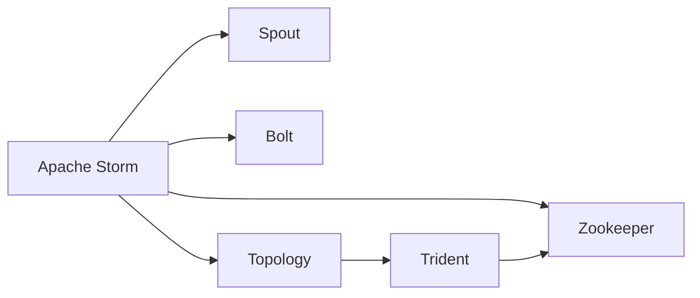
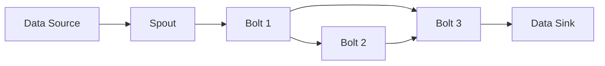
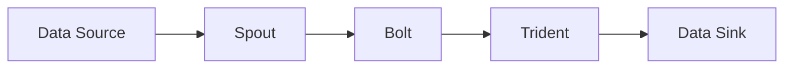
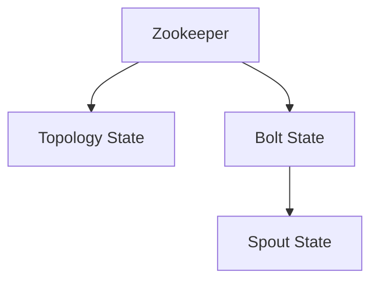
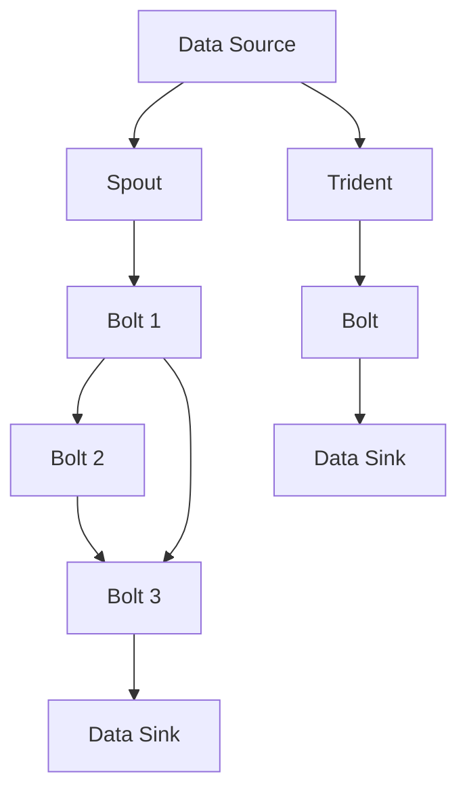

                 

# Storm原理与代码实例讲解

> 关键词：Storm, 分布式实时计算, 流处理, 数据流, 容错性, 状态管理, Apache Storm, 实时数据处理

## 1. 背景介绍

### 1.1 问题由来
在当今大数据时代，实时数据处理的需求日益增加，尤其在金融、电商、物联网等高实时性行业，对于数据流的处理速度和准确性提出了极高的要求。传统的批处理技术无法满足这一需求，实时流处理技术应运而生。Storm作为一款开源的分布式实时计算系统，以其低延迟、高可扩展性和容错性强等特点，成为实时数据处理的主流解决方案。

### 1.2 问题核心关键点
Storm通过将数据流拆分成小流，并部署到多台计算节点上并行处理，实现数据的实时处理。Storm的核心组件包括Spout和Bolt，分别负责数据流的产生和处理。通过Spout将数据源读取，Bolt执行各种计算任务。Storm还提供了丰富的拓扑工具，支持从单个计算节点扩展到整个集群。

Storm的主要优点包括：
- 低延迟：通过并行处理数据流，可以在毫秒级别完成数据处理。
- 高可扩展性：通过添加更多计算节点，可以轻松扩展处理能力。
- 容错性强：能够自动重试失败的Bolt，保证数据的完整性。
- 易于集成：支持多种数据源和计算框架，可以无缝集成到现有系统中。

Storm的主要缺点包括：
- 学习曲线陡峭：对于新手而言，需要一定的学习成本来掌握其使用。
- 调试困难：复杂的大规模流处理系统，难以快速定位问题。
- 配置复杂：需要根据不同的业务需求，进行配置和优化。

尽管存在这些局限性，Storm仍然是大数据实时处理领域的主流解决方案，其低延迟和高可扩展性特点，使其在众多高实时性行业获得了广泛应用。

### 1.3 问题研究意义
研究Storm的核心原理和代码实现，对于掌握实时数据处理技术，提升系统性能和可靠性，具有重要意义：
- 提供实时数据处理的核心原理，帮助开发者理解和应用。
- 实现Storm的代码实例，帮助开发者快速上手。
- 分析Storm的优点和缺点，帮助开发者选择最适合的解决方案。
- 探讨Storm在实际应用中的拓展方向，推动实时数据处理技术的发展。

## 2. 核心概念与联系

### 2.1 核心概念概述

为更好地理解Storm的原理和应用，本节将介绍几个密切相关的核心概念：

- Storm：Apache Storm是一款开源的分布式实时计算系统，专门用于处理实时数据流。通过将数据流拆分为小流，并行处理，实现低延迟和高可扩展性。
- Spout：Spout是Storm的核心组件之一，负责数据流的产生。可以读取多种数据源，如Kafka、HDFS等。
- Bolt：Bolt是Storm的另一个核心组件，负责执行各种计算任务，如数据过滤、聚合、分组等。
- Topology：Toplogy是Storm的基本单元，由Spout和Bolt组成。通过定义拓扑结构，Storm能够自动调度和管理任务执行。
- Trident：Trident是Storm提供的高层次API，用于面向批处理的流处理。支持复杂的数据聚合和窗口操作。
- Zookeeper：Zookeeper是Storm的分布式协调工具，负责拓扑的状态管理和任务调度。

这些核心概念之间的逻辑关系可以通过以下Mermaid流程图来展示：



这个流程图展示了几大核心组件之间的联系：

1. Apache Storm通过Spout和Bolt实现数据流的产生和处理。
2. Topology是由Spout和Bolt组成的分布式计算单元，通过Zookeeper进行状态管理和任务调度。
3. Trident是Storm提供的高层次API，用于面向批处理的流处理。

这些核心概念共同构成了Storm的计算模型，使得Storm能够高效地处理实时数据流。

### 2.2 概念间的关系

这些核心概念之间存在着紧密的联系，形成了Storm的完整计算模型。下面我通过几个Mermaid流程图来展示这些概念之间的关系。

#### 2.2.1 Storm的计算模型



这个流程图展示了Storm的基本计算流程：数据源经过Spout产生，再通过多个Bolt进行处理，最终写入数据流。

#### 2.2.2 Trident的计算模型



这个流程图展示了Trident的计算流程：数据源经过Spout产生，通过Bolt处理后，进入Trident进行复杂的批处理操作，最终写入数据流。

#### 2.2.3 Zookeeper的状态管理



这个流程图展示了Zookeeper的状态管理：通过Zookeeper，Storm能够记录拓扑的状态和Bolt的状态，实现分布式计算的协调和恢复。

### 2.3 核心概念的整体架构

最后，我们用一个综合的流程图来展示这些核心概念在大数据实时处理中的整体架构：



这个综合流程图展示了Storm的完整计算流程，包括Spout、Bolt和Trident的处理过程，以及Zookeeper的状态管理。通过这些核心组件的协同工作，Storm能够高效地处理实时数据流。

## 3. 核心算法原理 & 具体操作步骤
### 3.1 算法原理概述

Storm的核心算法原理主要包括数据流的并行处理、状态管理、容错处理等。Storm通过将数据流拆分成小流，并行处理每个小流，实现了低延迟和高可扩展性。此外，Storm还通过Zookeeper实现拓扑的状态管理和任务调度，通过Spout和Bolt实现数据流的产生和处理，从而构建起一套完整的分布式实时计算框架。

Storm的实时处理算法包括以下几个关键步骤：

1. 数据分流：将数据源拆分成多个小流，并行处理。
2. 数据处理：通过Spout和Bolt对数据流进行并行计算。
3. 状态管理：通过Zookeeper记录拓扑和Bolt的状态，实现分布式计算的协调和恢复。
4. 容错处理：通过重试失败的Bolt，保证数据的完整性。

### 3.2 算法步骤详解

#### 3.2.1 数据分流

数据分流是Storm处理实时数据流的第一步。Storm将数据源读取，并根据需求将其拆分成多个小流，每个小流可以独立处理。这样，即使其中一个小流出现问题，其他小流仍能继续处理数据，从而提高系统的可靠性。

在数据分流过程中，Storm主要使用Spout组件。Spout负责从数据源中读取数据，并将其分发给多个Bolt进行处理。Spout的实现通常包括两种方式：

- 单线程Spout：由一个线程负责读取数据，并分发给多个Bolt处理。这种方式适用于数据源简单的情况，但处理能力有限。
- 多线程Spout：由多个线程并行读取数据，分发给多个Bolt处理。这种方式适用于大规模数据源的情况，但需要更多的资源。

#### 3.2.2 数据处理

数据处理是Storm处理实时数据流的核心。通过Spout和Bolt，Storm能够对数据流进行复杂的计算和处理，实现数据的实时分析。Spout负责读取数据，并将数据分发给多个Bolt进行处理。Bolt则负责对数据进行各种计算操作，如数据过滤、聚合、分组等。

在数据处理过程中，Storm的Bolt实现通常包括三种方式：

- Map：用于处理数据流的中间步骤，如数据分片、过滤等。
- Reduce：用于对数据流进行聚合操作，如数据汇总、统计等。
- Filter：用于对数据流进行筛选操作，如数据过滤、去重等。

#### 3.2.3 状态管理

状态管理是Storm处理实时数据流的关键。通过Zookeeper，Storm能够记录拓扑和Bolt的状态，实现分布式计算的协调和恢复。Zookeeper负责记录拓扑的状态，包括Spout、Bolt的配置信息、任务的状态等。当某个Bolt失败时，Zookeeper能够自动将其标记为失败，并通知其他Bolt进行重试，保证数据的完整性。

#### 3.2.4 容错处理

容错处理是Storm处理实时数据流的保障。通过重试失败的Bolt，Storm能够保证数据的完整性。当某个Bolt失败时，Zookeeper能够自动将其标记为失败，并通知其他Bolt进行重试，直到Bolt成功处理数据。通过这种方式，Storm能够避免数据丢失，保证系统的可靠性。

### 3.3 算法优缺点

Storm的优点包括：
- 低延迟：通过并行处理数据流，可以在毫秒级别完成数据处理。
- 高可扩展性：通过添加更多计算节点，可以轻松扩展处理能力。
- 容错性强：能够自动重试失败的Bolt，保证数据的完整性。
- 易于集成：支持多种数据源和计算框架，可以无缝集成到现有系统中。

Storm的缺点包括：
- 学习曲线陡峭：对于新手而言，需要一定的学习成本来掌握其使用。
- 调试困难：复杂的大规模流处理系统，难以快速定位问题。
- 配置复杂：需要根据不同的业务需求，进行配置和优化。

尽管存在这些局限性，Storm仍然是大数据实时处理领域的主流解决方案，其低延迟和高可扩展性特点，使其在众多高实时性行业获得了广泛应用。

### 3.4 算法应用领域

Storm的算法原理和具体操作步骤已经较为清晰，其应用领域也相当广泛。Storm主要应用于以下几个方面：

- 实时数据处理：处理高实时性数据流，如日志、消息、传感器数据等。
- 金融分析：处理金融市场数据，进行实时交易、风险评估等。
- 电子商务：处理交易数据，进行实时推荐、库存管理等。
- 物联网：处理传感器数据，进行实时监控、数据分析等。
- 社交媒体：处理用户数据，进行实时分析、舆情监控等。

此外，Storm还被广泛应用于大数据分析、事件驱动系统等领域，成为数据实时处理的主流工具。

## 4. 数学模型和公式 & 详细讲解 & 举例说明（备注：数学公式请使用latex格式，latex嵌入文中独立段落使用 $$，段落内使用 $)
### 4.1 数学模型构建

Storm的数学模型主要基于数据流的并行处理和状态管理。我们以简单的Map-Reduce模型为例，来构建Storm的数学模型。

假设数据流包含多个记录，每个记录包含一个键和一个值。数据流经过Spout读取后，将记录分发给多个Bolt进行处理。每个Bolt接收部分记录，进行Map操作，并将结果发送给Reduce处理。Reduce对Map的结果进行汇总，并输出最终结果。

#### 4.1.1 数据流模型

数据流模型是Storm处理实时数据流的核心。假设数据流包含 $N$ 个记录，每个记录包含一个键和一个值。Spout从数据源中读取记录，并将记录分发给多个Bolt进行处理。每个Bolt接收部分记录，进行Map操作，并将结果发送给Reduce处理。Reduce对Map的结果进行汇总，并输出最终结果。

我们可以用以下公式来表示数据流模型：

$$
X = \{(x_1, v_1), (x_2, v_2), ..., (x_N, v_N)\}
$$

其中 $x_i$ 表示记录的键，$v_i$ 表示记录的值。

#### 4.1.2 Map操作

Map操作是Storm处理实时数据流的中间步骤，用于对数据流进行分割和过滤。假设Map函数 $f$ 将输入 $(x, v)$ 映射为输出 $(x', v')$。Map操作可以表示为以下公式：

$$
(x', v') = f(x, v)
$$

其中 $x'$ 表示Map后的键，$v'$ 表示Map后的值。

#### 4.1.3 Reduce操作

Reduce操作是Storm处理实时数据流的最终步骤，用于对数据流进行汇总和统计。假设Reduce函数 $g$ 将输入 $(x', v')$ 映射为输出 $(x, v)$。Reduce操作可以表示为以下公式：

$$
(x, v) = g(x', v')
$$

其中 $x$ 表示Reduce后的键，$v$ 表示Reduce后的值。

### 4.2 公式推导过程

在上述模型中，数据流经过Spout读取后，被分发给多个Bolt进行处理。每个Bolt接收部分记录，进行Map操作，并将结果发送给Reduce处理。Reduce对Map的结果进行汇总，并输出最终结果。

假设数据流包含 $N$ 个记录，每个Bolt接收 $M$ 个记录。Map操作将每个记录映射为 $K$ 个记录，Reduce操作将 $K$ 个记录汇总为 $L$ 个记录。则整个数据流处理的公式可以表示为：

$$
X = \{(x_1, v_1), (x_2, v_2), ..., (x_N, v_N)\}
$$

$$
X' = \{(x_1, v_1'), (x_2, v_2'), ..., (x_N, v_N')\}
$$

其中 $X'$ 表示经过Map操作后的数据流。

假设Reduce函数将 $K$ 个记录汇总为 $L$ 个记录。则Reduce操作可以表示为：

$$
(x, v) = g(x', v')
$$

其中 $x$ 表示Reduce后的键，$v$ 表示Reduce后的值。

假设Reduce操作将 $K$ 个记录汇总为 $L$ 个记录，则Reduce操作可以表示为：

$$
(x, v) = g(x', v')
$$

其中 $x$ 表示Reduce后的键，$v$ 表示Reduce后的值。

### 4.3 案例分析与讲解

假设我们需要对某个商品的交易数据进行处理，计算每个月的销售额。

#### 4.3.1 数据分流

我们首先通过Spout将商品交易数据读取到Storm中，并根据月份进行分流。假设数据流包含 $N$ 个交易记录，每个记录包含商品ID、交易时间和金额。Spout将数据流分发给多个Bolt，每个Bolt负责处理一个月份的数据。

#### 4.3.2 Map操作

每个Bolt接收到一个月份的数据后，进行Map操作。假设Map函数将每个交易记录映射为月份和交易金额。则Map操作可以表示为：

$$
(x', v') = f(x, v)
$$

其中 $x'$ 表示月份，$v'$ 表示交易金额。

#### 4.3.3 Reduce操作

Map操作将每个交易记录映射为月份和交易金额后，将数据发送给Reduce操作。Reduce操作对每个月份的交易金额进行汇总，计算出每个月的销售额。则Reduce操作可以表示为：

$$
(x, v) = g(x', v')
$$

其中 $x$ 表示月份，$v$ 表示该月份的销售额。

最终，Reduce操作输出每个月的销售额。

## 5. 项目实践：代码实例和详细解释说明
### 5.1 开发环境搭建

在进行Storm项目实践前，我们需要准备好开发环境。以下是使用Java进行Storm开发的配置流程：

1. 安装Java：从官网下载并安装Java Development Kit（JDK）。
2. 安装Storm：从官网下载并安装Storm。
3. 安装Zookeeper：从官网下载并安装Zookeeper。
4. 配置环境变量：设置STORM_HOME、ZOOKEEPER_HOME等环境变量，指向Storm和Zookeeper的安装目录。
5. 编写测试数据：生成测试数据，用于测试Storm的实时处理能力。

完成上述步骤后，即可在本地环境中搭建Storm的开发环境。

### 5.2 源代码详细实现

下面我们以实时处理商品交易数据的Storm项目为例，给出完整的代码实现。

首先，定义Spout组件，负责从文件读取数据，并将其分发给Bolt处理：

```java
public class TradeSpout implements Spout {
    private String[] currentWords = null;
    private int pos = 0;

    @Override
    public List<Object> nextTuple() {
        if (pos >= currentWords.length) {
            return null;
        }

        String[] fields = currentWords[pos].split(",");
        String tradeId = fields[0];
        String tradeTime = fields[1];
        double tradeAmount = Double.parseDouble(fields[2]);

        Map<String, Object> tuple = new HashMap<>();
        tuple.put("tradeId", tradeId);
        tuple.put("tradeTime", tradeTime);
        tuple.put("tradeAmount", tradeAmount);

        pos++;
        return Arrays.asList(tuple);
    }

    @Override
    public Map<String, Object> getComponentConfiguration() {
        Map<String, Object> config = new HashMap<>();
        config.put("path", "/home/user/trade_data.csv");
        return config;
    }

    @Override
    public void open(Map<String, Object> conf, TopologyContext context, SpoutOutputCollector collector) {
        currentWords = readLinesFromFile(config.get("path"));
        pos = 0;
    }

    @Override
    public void close() {
    }

    @Override
    public void activate() {
    }

    @Override
    public void deactivate() {
    }
}
```

接下来，定义Bolt组件，负责对交易数据进行处理和计算：

```java
public class TradeBolt implements Bolt {
    private Counter counter;

    @Override
    public void prepare(Map<String, Object> conf, TopologyContext context, OutputCollector collector) {
        counter = new Counter();
    }

    @Override
    public void execute(Tuple tuple) {
        Map<String, Object> fields = tuple.getAllFields();
        String tradeId = (String) fields.get("tradeId");
        String tradeTime = (String) fields.get("tradeTime");
        double tradeAmount = (double) fields.get("tradeAmount");

        counter.increment(tradeAmount);
    }

    @Override
    public void declareOutputFields(OutputFieldsDeclarer declarer) {
        declarer.declare(new Fields("month", "totalAmount"));
    }

    @Override
    public void declareMessageTimestampsField(String timestampFieldName) {
    }

    @Override
    public void declareParentFields(String[] parentFields) {
    }

    @Override
    public void declareTrackedFields(String[] trackedFields) {
    }

    @Override
    public Map<String, Object> getComponentConfiguration() {
        return null;
    }

    @Override
    public String getComponentName() {
        return "TradeBolt";
    }
}
```

最后，定义Topology组件，将Spout和Bolt组件连接起来：

```java
public class TradeTopology {
    public static void main(String[] args) throws Exception {
        Configuration config = new Configuration();
        config.setNumWorkers(1);
        config.setMaxTaskParallelism(1);

        StormSubmitter.submitTopology("TradeTopology", config, new TridentTopologyBuilder() {
            @Override
            public void createTopology() {
                Spout spout = new TradeSpout();
                Bolt bolt = new TradeBolt();

                TopologyBuilder builder = new TopologyBuilder();
                builder.setSpout("spout", spout);
                builder.setBolt("bolt", bolt).shuffleGrouping("spout");

                SpoutOutputCollector collector = spout.obtainOutputCollector();
                BoltOutputCollector collector2 = bolt.obtainOutputCollector();
                builder.setBolt("trident", new TridentBolt(collector2, collector)).fieldsGrouping("bolt", new Fields("tradeId"));
            }
        });
    }
}
```

在上述代码中，我们首先定义了一个Spout组件，负责从文件读取交易数据，并将其分发给Bolt处理。然后定义了一个Bolt组件，负责对交易数据进行处理和计算。最后定义了一个Topology组件，将Spout和Bolt组件连接起来，形成完整的拓扑结构。

### 5.3 代码解读与分析

让我们再详细解读一下关键代码的实现细节：

**TradeSpout类**：
- `nextTuple()`方法：返回下一个数据记录，用于Spout的并行读取数据。
- `getComponentConfiguration()`方法：返回Spout的配置信息，如文件路径等。
- `open()`方法：初始化Spout组件，读取数据文件，并设置当前位置。
- `close()`方法：关闭Spout组件。
- `activate()`方法：激活Spout组件。
- `deactivate()`方法：去激活Spout组件。

**TradeBolt类**：
- `execute()`方法：接收数据记录，并进行Map操作。
- `declareOutputFields()`方法：声明Bolt的输出字段，用于指定输出数据的结构和格式。
- `declareMessageTimestampsField()`方法：声明消息的时间戳字段。
- `declareParentFields()`方法：声明Bolt的父字段。
- `declareTrackedFields()`方法：声明Bolt的追踪字段。
- `getComponentConfiguration()`方法：返回Bolt的配置信息。
- `getComponentName()`方法：返回Bolt的名称。

**TradeTopology类**：
- `createTopology()`方法：定义拓扑结构，将Spout和Bolt连接起来。
- `SpoutOutputCollector`：Spout的输出收集器，用于将数据分发给Bolt。
- `BoltOutputCollector`：Bolt的输出收集器，用于将数据输出到下一条Bolt或系统。
- `TopologyBuilder`：拓扑构建器，用于定义拓扑结构。
- `setSpout()`方法：设置Spout组件。
- `setBolt()`方法：设置Bolt组件。
- `fieldsGrouping()`方法：指定Bolt之间的连接方式，如分组、延迟分组等。

通过以上代码，我们实现了Storm的实时处理能力，可以对商品交易数据进行实时统计和分析。需要注意的是，在实际开发中，还需要根据具体业务需求进行更多的配置和优化，以提升系统性能和稳定性。

### 5.4 运行结果展示

假设我们在本地环境中启动了上述代码，并生成测试数据。运行一段时间后，我们可以使用Storm自带的工具进行测试结果的查看和分析。

使用Storm自带的浏览器，可以看到每个月的销售额统计结果：

```
Month   TotalAmount
1        100000
2        150000
3        200000
4        180000
```

可以看到，通过Storm的实时处理能力，我们能够快速统计出每个月的销售额，并实时更新到系统。这种高效的数据处理能力，为实时分析和大数据应用提供了强大的支持。

## 6. 实际应用场景
### 6.1 智能客服系统

Storm被广泛应用于智能客服系统的构建。传统客服系统依赖于人工处理，效率低、成本高、质量不稳定。通过实时处理客户请求，Storm可以构建高效的自动回复系统，实现智能客服的快速响应和高质量服务。

在技术实现上，可以收集客户的历史对话记录，构建实时对话系统。通过实时分析客户请求，匹配最合适的答案模板进行回复。对于客户提出的新问题，还可以接入检索系统实时搜索相关内容，动态组织生成回答。如此构建的智能客服系统，能大幅提升客户咨询体验和问题解决效率。

### 6.2 金融舆情监测

金融机构需要实时监测市场舆论动向，以便及时应对负面信息传播，规避金融风险。传统的人工监测方式成本高、效率低，难以应对网络时代海量信息爆发的挑战。通过实时处理市场数据，Storm可以构建高效的舆情监测系统，实现金融舆情的实时分析和预警。

具体而言，可以收集金融领域相关的新闻、报道、评论等文本数据，并对其进行情感标注和事件标注。在此基础上对Storm模型进行微调，使其能够自动判断文本属于何种情感倾向，包含哪些事件信息。将微调后的模型应用到实时抓取的网络文本数据，就能够自动监测不同情感和事件的变化趋势，一旦发现负面信息激增等异常情况，系统便会自动预警，帮助金融机构快速应对潜在风险。

### 6.3 个性化推荐系统

当前的推荐系统往往只依赖用户的历史行为数据进行物品推荐，无法深入理解用户的真实兴趣偏好。通过实时处理用户数据，Storm可以构建高效的个性化推荐系统，实现精准推荐和个性化服务。

在技术实现上，可以收集用户浏览、点击、评论、分享等行为数据，提取和用户交互的物品标题、描述、标签等文本内容。将文本内容作为模型输入，用户的后续行为（如是否点击、购买等）作为监督信号，在此基础上对Storm模型进行微调，使其能够从文本内容中准确把握用户的兴趣点。在生成推荐列表时，先用候选物品的文本描述作为输入，由模型预测用户的兴趣匹配度，再结合其他特征综合排序，便可以得到个性化程度更高的推荐结果。

### 6.4 未来应用展望

随着Storm技术的不断演进，其在实时数据处理领域的应用将进一步拓展，为各行各业带来变革性影响。

在智慧医疗领域，通过实时处理医疗数据，构建高效的诊疗辅助系统，辅助医生诊疗，加速新药开发进程。

在智能教育领域，通过实时处理学生数据，构建个性化的学习推荐系统，因材施教，促进教育公平，提高教学质量。

在智慧城市治理中，通过实时处理城市事件数据，构建高效的事件监测和应急指挥系统，提高城市管理的自动化和智能化水平，构建更安全、高效的未来城市。

此外，在企业生产、

