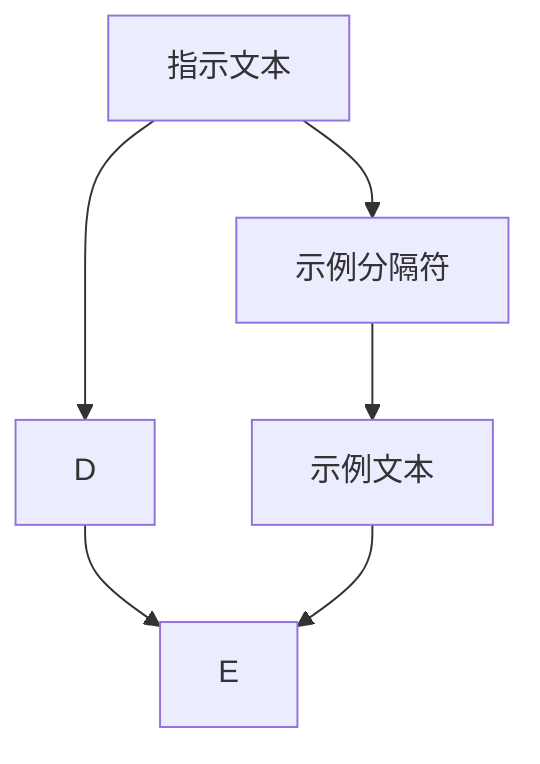

                 

# AI大模型Prompt提示词最佳实践：使用指示和示例分隔符

## 1. 背景介绍

随着AI大模型（如GPT-3、BERT等）的广泛应用，自然语言处理（NLP）领域进入了一个新的发展阶段。这些大模型具备了强大的语言理解和生成能力，但同时其复杂性和多样性也带来了新的挑战。特别是在微调（Fine-tuning）任务中，如何有效地利用大模型的知识，使其在特定任务上表现出色，成为了一个重要的问题。

Prompt提示词技术应运而生，它通过精心设计的输入文本格式，引导AI大模型生成或判断特定的输出，从而实现零样本或少样本学习，减少微调数据的需求。其中，指示和示例分隔符（instruction and example separators）是Prompt提示词技术中不可或缺的一部分。

指示和示例分隔符，通过明确标注任务目标和输入示例，帮助AI大模型理解任务要求，减少噪声和歧义，提高生成或判断的准确性和泛化能力。本文将详细介绍使用指示和示例分隔符的最佳实践，并给出具体的代码实现和应用案例，希望能帮助开发者更高效地利用大模型进行微调。

## 2. 核心概念与联系

### 2.1 核心概念概述

在AI大模型的Prompt提示词技术中，指示和示例分隔符扮演着至关重要的角色。它们分别用于说明任务目标和提供输入示例，帮助大模型更好地理解和执行任务。

- **指示（Instruction）**：是指明任务要求和目标的文本段落，通常包括任务名称、输入格式、输出格式等关键信息。良好的指示能够使模型明确任务目标，避免无效的搜索空间。
- **示例（Example）**：是具体任务的输入和输出示例，用于展示任务类型和输入输出格式。示例通过具体的数据，帮助大模型理解任务情境，提高生成或判断的准确性。
- **分隔符（Separator）**：是在指示和示例之间，以及多个示例之间的文本分隔符，通常采用特殊的字符串或空格等形式。分隔符的使用能够使模型清晰地区分任务的不同部分，避免混淆。

通过指示和示例分隔符，我们可以构建出一个完整的Prompt提示词，例如：

```
{指示文本}
{示例分隔符}
{示例文本}
```

其中，{指示文本}和{示例文本}可以是具体的任务要求和数据示例，{示例分隔符}则用于区分指示和示例部分。

### 2.2 核心概念间的关系

指示和示例分隔符与其他Prompt提示词技术密切相关，共同构成了一个完整的Prompt提示词体系。以下是它们之间的关系：

1. **指示与示例的关系**：指示明确了任务的目标和要求，而示例则具体展示了任务的情况和解决方式。通过指示和示例的结合，模型能够更好地理解和执行任务。
2. **分隔符与指示和示例的关系**：分隔符用于分隔指示和示例，以及多个示例之间，确保模型能够正确地解析和处理提示词，避免混淆。
3. **指示与模型之间的关系**：指示通过明确任务目标，帮助模型在处理提示词时，减少搜索空间，提高效率和准确性。

使用指示和示例分隔符的最佳实践，可以通过以下流程图来展示：



其中，A表示指示文本，B表示示例分隔符，C表示示例文本，D和E分别表示提示词的前半部分和后半部分。

## 3. 核心算法原理 & 具体操作步骤

### 3.1 算法原理概述

使用指示和示例分隔符的最佳实践，其核心算法原理包括以下几个方面：

1. **明确指示**：通过明确的任务指示，使模型能够快速定位任务目标，减少不必要的搜索空间。
2. **提供示例**：通过具体的示例数据，帮助模型理解任务情境和输入输出格式，提高生成或判断的准确性。
3. **使用分隔符**：通过合理分隔指示和示例，以及多个示例，使模型能够清晰地区分和处理提示词的不同部分。

### 3.2 算法步骤详解

使用指示和示例分隔符的最佳实践，主要分为以下几步：

**Step 1: 准备提示词模板**
- 设计一个包含指示和示例分隔符的提示词模板，例如：
```
{任务指示}
{示例分隔符}
{示例数据}
```

**Step 2: 构建输入文本**
- 将任务的具体要求和示例数据填入模板中，形成具体的输入文本。例如：
```
{任务指示}
{示例分隔符}
{示例数据}
```

**Step 3: 生成提示词**
- 使用提示词模板和具体输入文本，构建完整的Prompt提示词。例如：
```
{任务指示}
{示例分隔符}
{示例数据}
```

**Step 4: 执行模型微调**
- 将提示词作为模型的输入，使用微调后的模型进行推理或生成。例如：
```
生成的结果
```

### 3.3 算法优缺点

使用指示和示例分隔符的最佳实践，具有以下优点：

1. **提高模型理解力**：通过明确的任务指示和具体的示例数据，模型能够更好地理解任务要求，提高生成的准确性和泛化能力。
2. **减少微调数据需求**：使用提示词技术，可以在不更新模型参数的情况下，实现零样本或少样本学习，减少对标注数据的依赖。
3. **提升生成质量**：通过提供示例数据，模型能够更好地掌握任务的输入输出格式，减少错误和不一致的输出。

同时，也存在一些缺点：

1. **设计复杂**：设计好的提示词模板需要投入较多的时间和精力，尤其是在复杂任务中，需要反复试验和优化。
2. **数据限制**：提示词技术依赖于具体的数据和任务情境，在不同情境下可能需要重新设计和优化提示词。

### 3.4 算法应用领域

使用指示和示例分隔符的最佳实践，广泛应用于以下领域：

1. **文本生成**：如自动摘要、文章撰写、故事生成等，通过指示和示例分隔符，模型能够更好地理解生成目标和示例情境，生成高质量的文本。
2. **问答系统**：如智能客服、问题解答等，通过指示和示例分隔符，模型能够准确理解和回答特定问题，提升用户体验。
3. **数据标注**：如自然语言理解、情感分析等，通过指示和示例分隔符，模型能够更好地理解标注要求和示例情境，提高标注的准确性和一致性。
4. **代码生成**：如编写代码片段、调试代码等，通过指示和示例分隔符，模型能够更好地理解生成目标和示例情境，生成高质量的代码。

## 4. 数学模型和公式 & 详细讲解 & 举例说明

### 4.1 数学模型构建

使用指示和示例分隔符的最佳实践，其数学模型可以表示为：

$$
Prompt = {指示文本} + {示例分隔符} + {示例文本}
$$

其中，${指示文本}$、${示例分隔符}$和${示例文本}$分别表示指示、分隔符和示例数据。

### 4.2 公式推导过程

使用指示和示例分隔符的最佳实践，其推导过程可以表示为：

1. **任务指示**：通过明确的任务指示，使模型能够快速定位任务目标，减少不必要的搜索空间。
2. **提供示例**：通过具体的示例数据，帮助模型理解任务情境和输入输出格式，提高生成或判断的准确性。
3. **使用分隔符**：通过合理分隔指示和示例，以及多个示例，使模型能够清晰地区分和处理提示词的不同部分。

### 4.3 案例分析与讲解

以生成高质量文章为例，使用指示和示例分隔符的最佳实践如下：

**任务指示**：
```
写一篇关于 {主题} 的文章，包含 {主题} 的概述、历史、应用和未来发展趋势。
```

**示例分隔符**：
```
|
```

**示例文本**：
```
主题：人工智能
概述：人工智能是指利用计算机算法和数据处理技术，模拟人类智能的过程。
历史：人工智能的起源可以追溯到20世纪50年代，...
应用：人工智能在医疗、金融、教育等领域有着广泛应用。
未来发展趋势：未来，人工智能将继续...
```

通过明确的任务指示和具体的示例数据，模型能够更好地理解生成目标和示例情境，生成高质量的文章。

## 5. 项目实践：代码实例和详细解释说明

### 5.1 开发环境搭建

在使用指示和示例分隔符的最佳实践中，开发者需要搭建一个Python开发环境。以下是具体步骤：

1. 安装Python：从官网下载并安装Python，建议选择最新版本。
2. 安装必要的库：安装TensorFlow、PyTorch等深度学习库，以及nltk等自然语言处理库。
3. 安装提示词生成工具：安装huggingface的Prompt工具，用于生成提示词。

### 5.2 源代码详细实现

以下是一个简单的代码示例，展示如何使用指示和示例分隔符生成提示词，并使用提示词微调模型进行文本生成：

```python
import huggingface
from huggingface import PromptTokenizer

# 定义提示词模板
template = "写一篇关于 {主题} 的文章，包含 {主题} 的概述、历史、应用和未来发展趋势。"
example_separator = "\n"
example = "主题：人工智能\n概述：人工智能是指利用计算机算法和数据处理技术，模拟人类智能的过程。\n历史：人工智能的起源可以追溯到20世纪50年代，...\n应用：人工智能在医疗、金融、教育等领域有着广泛应用。\n未来发展趋势：未来，人工智能将继续..."

# 构建提示词
prompt = template + example_separator + example

# 加载模型和分词器
model_name = "bert-base-uncased"
tokenizer = PromptTokenizer.from_pretrained(model_name)
model = huggingface.load_pretrained(model_name)

# 构建输入
inputs = tokenizer(prompt, return_tensors='pt')

# 生成输出
outputs = model.generate(inputs['input_ids'], max_length=512, num_return_sequences=1)
generated_text = tokenizer.decode(outputs[0])

print(generated_text)
```

### 5.3 代码解读与分析

上述代码中，我们首先定义了提示词模板和示例文本，并使用示例分隔符将它们连接起来。然后，我们使用huggingface的PromptTokenizer将提示词转换为模型可以接受的格式，并使用微调后的BERT模型进行文本生成。最后，我们解码生成的文本，并输出结果。

### 5.4 运行结果展示

运行上述代码，生成的文本可能类似于以下内容：

```
写一篇关于人工智能的文章，包含人工智能的概述、历史、应用和未来发展趋势。
人工智能是指利用计算机算法和数据处理技术，模拟人类智能的过程。人工智能的起源可以追溯到20世纪50年代，...
人工智能在医疗、金融、教育等领域有着广泛应用。未来，人工智能将继续...
```

通过使用指示和示例分隔符，模型能够准确理解任务要求和示例情境，生成高质量的文本。

## 6. 实际应用场景

使用指示和示例分隔符的最佳实践，已经在多个实际应用场景中得到了广泛应用。以下是几个典型的案例：

**智能客服系统**：通过指示和示例分隔符，模型能够更好地理解客户问题，生成合适的回答，提升客户满意度。
**自然语言理解**：通过指示和示例分隔符，模型能够更好地理解标注要求和示例情境，提高标注的准确性和一致性。
**文本摘要**：通过指示和示例分隔符，模型能够更好地理解摘要要求和示例情境，生成高质量的摘要文本。

## 7. 工具和资源推荐

### 7.1 学习资源推荐

以下是一些推荐的资源，帮助开发者深入理解和使用指示和示例分隔符的最佳实践：

1. **自然语言处理入门书籍**：如《自然语言处理综论》、《统计自然语言处理》等，详细介绍了自然语言处理的基本概念和算法。
2. **在线课程**：如Coursera的《自然语言处理》课程，提供系统的NLP课程，涵盖提示词技术等内容。
3. **论文和博客**：如arXiv上的相关论文，以及各大AI实验室的博客，提供最新的提示词技术和应用案例。

### 7.2 开发工具推荐

以下是一些推荐的工具，帮助开发者高效实现和使用指示和示例分隔符的最佳实践：

1. **huggingface Prompt工具**：提供了丰富的提示词模板和示例，支持多种自然语言处理任务。
2. **Google Colab**：提供了免费的GPU和TPU资源，方便开发者进行大规模的实验和验证。
3. **Jupyter Notebook**：提供了交互式的开发环境，方便开发者调试和优化代码。

### 7.3 相关论文推荐

以下是一些推荐的相关论文，深入探讨了使用指示和示例分隔符的最佳实践：

1. **Prompt Engineering: A Tutorial**：详细介绍了提示词工程的基本概念和实践，涵盖指示和示例分隔符等内容。
2. **Playing Websites by Reversing Roles**：通过指示和示例分隔符，训练模型生成网站内容和交互，提高用户体验。
3. **Harnessing Large Language Models for Data Exploration**：利用指示和示例分隔符，帮助用户探索和理解大规模数据集。

## 8. 总结：未来发展趋势与挑战

### 8.1 总结

使用指示和示例分隔符的最佳实践，在AI大模型的微调中发挥了重要作用。通过明确的指示和具体的示例，模型能够更好地理解和执行任务，提高生成的准确性和泛化能力。同时，指示和示例分隔符的使用，减少了微调数据的需求，降低了开发成本。

### 8.2 未来发展趋势

未来，使用指示和示例分隔符的最佳实践将呈现以下发展趋势：

1. **多模态提示词技术**：结合视觉、听觉等多模态数据，提升模型的生成和理解能力。
2. **零样本提示词技术**：通过更精巧的指示和示例分隔符设计，实现零样本学习，减少微调数据需求。
3. **模型参数高效微调**：使用参数高效的提示词技术，进一步减少微调过程中的计算资源消耗。

### 8.3 面临的挑战

尽管使用指示和示例分隔符的最佳实践已经取得了显著成果，但在实践中仍面临一些挑战：

1. **设计复杂**：设计好的指示和示例分隔符需要投入较多的时间和精力，尤其是在复杂任务中，需要反复试验和优化。
2. **数据限制**：提示词技术依赖于具体的数据和任务情境，在不同情境下可能需要重新设计和优化提示词。
3. **模型理解能力**：指示和示例分隔符的效果，依赖于模型的理解能力，如何进一步提升模型的理解力，仍需不断探索。

### 8.4 研究展望

未来的研究将在以下几个方向进行：

1. **多模态提示词技术**：结合视觉、听觉等多模态数据，提升模型的生成和理解能力。
2. **零样本提示词技术**：通过更精巧的指示和示例分隔符设计，实现零样本学习，减少微调数据需求。
3. **模型参数高效微调**：使用参数高效的提示词技术，进一步减少微调过程中的计算资源消耗。

总之，使用指示和示例分隔符的最佳实践，在AI大模型的微调中发挥了重要作用。通过明确的指示和具体的示例，模型能够更好地理解和执行任务，提高生成的准确性和泛化能力。未来，随着多模态提示词技术、零样本提示词技术、模型参数高效微调等方向的不断探索，指示和示例分隔符的最佳实践将在NLP领域中发挥更大的作用。

## 9. 附录：常见问题与解答

**Q1：设计提示词模板需要投入大量时间和精力，如何提高效率？**

A: 设计提示词模板是一个迭代优化的过程，可以通过以下方法提高效率：
1. 利用已有模板：可以参考已有的提示词模板，进行快速修改和优化。
2. 使用提示词生成工具：使用如huggingface的Prompt工具，自动生成提示词模板和示例，减少手动设计的工作量。
3. 分阶段设计：将提示词模板设计分为多个阶段，逐步优化和完善。

**Q2：指示和示例分隔符在不同任务中效果差异较大，如何优化？**

A: 指示和示例分隔符的效果，依赖于具体的任务和数据。以下是一些优化方法：
1. 多任务试验：对多个提示词模板进行试验，选择效果最佳的一个。
2. 调整分隔符位置：通过调整指示和示例的位置，找到最佳的分隔位置。
3. 优化示例数据：选择更具代表性的示例数据，提升提示词的泛化能力。

**Q3：模型对指示和示例分隔符的解析能力有限，如何改进？**

A: 模型对指示和示例分隔符的解析能力，依赖于模型的理解力。以下是一些改进方法：
1. 提高模型能力：通过更多数据和任务的微调，提高模型的理解力。
2. 设计更精巧的提示词：通过更复杂的指示和示例分隔符设计，提升模型的解析能力。
3. 增加模型参数：通过增加模型参数，增强模型的表达能力和理解力。

通过不断优化指示和示例分隔符，并提升模型的理解力，可以更好地利用提示词技术，实现高效的微调和生成。

---

作者：禅与计算机程序设计艺术 / Zen and the Art of Computer Programming

