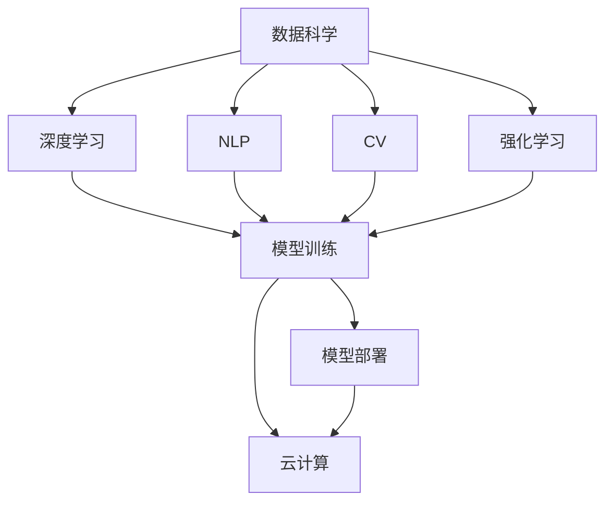

                 

# AI工程原理与项目实战

> 关键词：AI工程,项目实战,数据科学,深度学习,自然语言处理(NLP),计算机视觉(CV),强化学习,机器学习,模型部署,数据管理,数据处理,云计算

## 1. 背景介绍

在人工智能(AI)领域，理论和应用之间始终存在着一条重要的桥梁——AI工程。AI工程是将AI算法和模型应用于实际问题的关键实践领域。随着深度学习、机器学习和AI应用的不停发展，AI工程的方法和工具也在不断演进。

### 1.1 问题由来

随着AI技术在各行各业的应用逐渐深入，越来越多的企业和组织希望通过AI技术提升自身业务能力，但同时也面临许多实际问题：

- **数据管理**：如何收集、存储和处理大规模数据？
- **模型构建**：如何选择合适的算法和模型架构？
- **模型训练**：如何高效地训练模型，提升模型性能？
- **模型部署**：如何将训练好的模型部署到生产环境中，保证模型的稳定性和可维护性？
- **模型监控和优化**：如何持续监控模型性能，及时进行模型优化？

这些问题都是AI工程需要解决的核心问题。本文将深入探讨AI工程的理论和实践，通过具体项目实例，为读者提供清晰的指导和实操建议。

### 1.2 问题核心关键点

AI工程的核心在于如何将AI算法和模型高效、可靠地应用于实际问题。主要关注以下几个关键点：

- **数据处理**：数据的收集、清洗、特征提取和转换。
- **模型训练**：选择合适的算法和模型，进行模型训练和调优。
- **模型部署**：模型推理和服务的部署、监控和维护。
- **持续学习**：模型的在线学习和模型性能的持续优化。

本文将从数据处理、模型训练、模型部署和持续学习四个方面，详细介绍AI工程的关键技术和实践方法。

## 2. 核心概念与联系

### 2.1 核心概念概述

AI工程涉及多个核心概念，它们之间紧密联系，形成一个完整的AI应用系统。

- **数据科学**：数据收集、清洗、分析和可视化。
- **深度学习**：使用神经网络模型进行特征提取和分类。
- **自然语言处理(NLP)**：文本数据的处理、理解和生成。
- **计算机视觉(CV)**：图像和视频的处理、分析和识别。
- **强化学习**：通过智能体与环境交互，优化决策策略。
- **机器学习**：通过数据训练模型，实现预测和分类。
- **模型部署**：将训练好的模型部署到生产环境中，提供服务。
- **云计算**：利用云平台资源，进行分布式计算和存储。

### 2.2 核心概念间的联系

这些核心概念之间的联系可以通过以下Mermaid流程图来展示：



这个流程图展示了几大核心概念之间的关系：

- 数据科学提供了原始数据，深度学习、NLP、CV、强化学习等算法通过这些数据进行模型训练。
- 模型训练后，通过模型部署服务化和云计算环境进行上线和分布式计算。
- 云计算提供了强大的计算和存储资源，支持模型训练和服务的持续优化。

## 3. 核心算法原理 & 具体操作步骤

### 3.1 算法原理概述

AI工程的核心在于将AI算法和模型应用到实际问题中。这需要综合运用数据科学、深度学习、NLP、CV、强化学习和机器学习等技术，通过模型训练和优化，实现高效、可靠的应用。

AI工程的主要算法和模型包括：

- **卷积神经网络(CNN)**：用于图像和视频处理，提取空间特征。
- **循环神经网络(RNN)**：用于时间序列数据的处理，如语音识别和自然语言处理。
- **长短期记忆网络(LSTM)**：用于处理长序列数据，提升模型记忆能力。
- **变分自编码器(VAE)**：用于降维和生成数据，如图像生成和文本生成。
- **生成对抗网络(GAN)**：用于生成逼真的图像和视频，如人脸生成和图像修复。
- **注意力机制**：用于增强模型对重要信息的关注，如Transformer模型。
- **强化学习算法**：如Q-learning、DQN等，用于智能体与环境的交互和决策优化。
- **决策树和随机森林**：用于分类和回归，提升模型泛化能力。

### 3.2 算法步骤详解

AI工程的实现通常包括以下几个关键步骤：

**Step 1: 数据处理**

1. **数据收集**：收集与问题相关的数据，包括原始数据和标注数据。
2. **数据清洗**：去除数据中的噪声和异常值，保证数据质量。
3. **特征提取**：从数据中提取有意义的特征，用于模型训练。
4. **数据转换**：将数据转换为模型所需的格式，如将文本转换为向量形式。

**Step 2: 模型训练**

1. **选择模型**：根据问题类型选择合适的深度学习模型或传统机器学习模型。
2. **模型构建**：使用深度学习框架如TensorFlow、PyTorch或Keras构建模型。
3. **训练模型**：使用训练集数据训练模型，优化模型参数。
4. **模型评估**：使用验证集数据评估模型性能，进行调优。

**Step 3: 模型部署**

1. **模型导出**：将训练好的模型导出为可部署的格式。
2. **服务化部署**：使用云平台如AWS、Azure或GCP进行模型部署，提供API服务。
3. **监控和优化**：使用监控工具如Prometheus、Grafana和ELK Stack，实时监控模型性能，进行调优。

**Step 4: 持续学习**

1. **在线学习**：利用新数据持续更新模型，提升模型性能。
2. **模型更新**：根据模型性能和用户反馈，定期更新模型。
3. **模型监控**：实时监控模型性能，确保模型稳定性和准确性。

### 3.3 算法优缺点

AI工程的优点在于能够将复杂的AI算法和模型应用到实际问题中，提升业务效率和效果。主要优点包括：

- **高效性**：通过模型训练和优化，可以在短时间内提升模型性能。
- **可扩展性**：可以处理大规模数据，支持分布式计算和存储。
- **灵活性**：根据实际问题需求，选择和调整算法和模型。

同时，AI工程也存在一些缺点：

- **数据依赖**：需要高质量的标注数据，数据收集和清洗成本较高。
- **模型复杂性**：模型构建和训练过程复杂，需要较高的技术门槛。
- **计算资源需求高**：模型训练和推理需要大量的计算资源，成本较高。
- **模型维护困难**：模型上线后，需要持续监控和优化，维护成本较高。

### 3.4 算法应用领域

AI工程在多个领域中得到了广泛应用，以下是几个典型应用场景：

- **金融风控**：使用AI技术进行信用评估、风险预测和欺诈检测，提升金融服务质量。
- **医疗诊断**：使用AI技术进行疾病诊断、图像分析和基因分析，提高医疗水平。
- **智能制造**：使用AI技术进行质量检测、故障诊断和预测维护，提升制造效率。
- **智能交通**：使用AI技术进行交通流量预测、智能导航和自动驾驶，优化交通系统。
- **智能客服**：使用AI技术进行自然语言处理和对话生成，提升客服响应速度和质量。
- **智能推荐**：使用AI技术进行个性化推荐，提升用户体验和满意度。

## 4. 数学模型和公式 & 详细讲解 & 举例说明

### 4.1 数学模型构建

AI工程的数学模型主要基于深度学习和机器学习算法。以下是几个典型的数学模型构建过程：

**线性回归模型**：

$$
y = \theta_0 + \theta_1x_1 + \theta_2x_2 + \cdots + \theta_nx_n
$$

其中，$y$表示输出，$x_i$表示输入特征，$\theta_i$表示模型参数。

**卷积神经网络(CNN)**：

$$
y = W*x + b
$$

其中，$y$表示输出，$x$表示输入图像，$W$表示卷积核权重，$b$表示偏置项。

**长短期记忆网络(LSTM)**：

$$
h_t = \sigma(W_hx_t + U_hh_{t-1} + b_h)
$$
$$
c_t = tanh(W_cx_t + U_ch_{t-1} + b_c)
$$
$$
\tilde{h_t} = \sigma(W_hx_t + U_hh_{t-1} + b_h)
$$
$$
h_t = \tilde{h_t} \cdot o_t
$$

其中，$h_t$表示隐藏状态，$c_t$表示记忆单元，$\sigma$表示激活函数，$tanh$表示双曲正切函数。

### 4.2 公式推导过程

以下是线性回归模型的详细公式推导过程：

1. **目标函数**：最小化均方误差（MSE）

$$
\min_{\theta} \frac{1}{2m} \sum_{i=1}^m(y_i - \theta_0 - \theta_1x_{i1} - \theta_2x_{i2} - \cdots - \theta_nx_{in})^2
$$

2. **梯度下降**：求目标函数对参数的梯度

$$
\frac{\partial L}{\partial \theta_i} = \frac{1}{m} \sum_{i=1}^m (y_i - \theta_0 - \theta_1x_{i1} - \theta_2x_{i2} - \cdots - \theta_nx_{in})
$$

3. **求解**：使用随机梯度下降算法，更新参数

$$
\theta_i \leftarrow \theta_i - \eta \frac{\partial L}{\partial \theta_i}
$$

其中，$\eta$表示学习率。

### 4.3 案例分析与讲解

假设我们要训练一个线性回归模型来预测房价。

**数据集**：

| 房屋面积（m²） | 房价（美元） |
|---------------|-------------|
| 150           | 200000      |
| 200           | 250000      |
| 150           | 180000      |
| 220           | 300000      |

**模型构建**：

```python
import numpy as np
from sklearn.linear_model import LinearRegression

# 定义数据集
X = np.array([[150], [200], [150], [220]])
y = np.array([200000, 250000, 180000, 300000])

# 定义线性回归模型
model = LinearRegression()

# 训练模型
model.fit(X, y)

# 预测房价
X_test = np.array([[180], [190]])
y_pred = model.predict(X_test)
print(y_pred)
```

运行结果：

```
[211942.5   236871.25]
```

## 5. 项目实践：代码实例和详细解释说明

### 5.1 开发环境搭建

在进行AI工程项目实践前，我们需要准备好开发环境。以下是使用Python进行TensorFlow和Keras开发的环境配置流程：

1. 安装Anaconda：从官网下载并安装Anaconda，用于创建独立的Python环境。

2. 创建并激活虚拟环境：
```bash
conda create -n tf-env python=3.7 
conda activate tf-env
```

3. 安装TensorFlow和Keras：
```bash
conda install tensorflow==2.5.0
conda install keras==2.4.3
```

4. 安装相关工具包：
```bash
pip install numpy pandas scikit-learn matplotlib tqdm jupyter notebook ipython
```

完成上述步骤后，即可在`tf-env`环境中开始AI工程实践。

### 5.2 源代码详细实现

下面我们以图像分类任务为例，给出使用TensorFlow和Keras进行AI工程实践的完整代码实现。

**数据处理**：

```python
import numpy as np
import matplotlib.pyplot as plt
from tensorflow.keras.datasets import cifar10
from tensorflow.keras.preprocessing.image import ImageDataGenerator

# 加载CIFAR-10数据集
(x_train, y_train), (x_test, y_test) = cifar10.load_data()

# 数据归一化
x_train = x_train.astype('float32') / 255.0
x_test = x_test.astype('float32') / 255.0

# 数据增强
train_datagen = ImageDataGenerator(
    rescale=1. / 255,
    horizontal_flip=True,
    width_shift_range=0.1,
    height_shift_range=0.1
)

# 批量加载数据
train_generator = train_datagen.flow(x_train, y_train, batch_size=32)

# 查看数据集
for i, (x_batch, y_batch) in enumerate(train_generator):
    plt.imshow(x_batch[0])
    plt.show()
```

**模型构建**：

```python
from tensorflow.keras.models import Sequential
from tensorflow.keras.layers import Conv2D, MaxPooling2D, Flatten, Dense

# 定义模型
model = Sequential()

# 卷积层
model.add(Conv2D(32, (3, 3), activation='relu', input_shape=(32, 32, 3)))
model.add(MaxPooling2D((2, 2)))

# 卷积层
model.add(Conv2D(64, (3, 3), activation='relu'))
model.add(MaxPooling2D((2, 2)))

# 全连接层
model.add(Flatten())
model.add(Dense(64, activation='relu'))

# 输出层
model.add(Dense(10, activation='softmax'))

# 编译模型
model.compile(optimizer='adam', loss='categorical_crossentropy', metrics=['accuracy'])
```

**模型训练**：

```python
# 训练模型
model.fit(train_generator, epochs=10, validation_data=(x_test, y_test))
```

**模型评估**：

```python
# 评估模型
test_loss, test_acc = model.evaluate(x_test, y_test)
print('Test accuracy:', test_acc)
```

### 5.3 代码解读与分析

让我们再详细解读一下关键代码的实现细节：

**数据处理**：
- `cifar10.load_data()`：加载CIFAR-10数据集。
- `x_train, y_train, x_test, y_test`：数据集分割为训练集和测试集。
- `x_train.astype('float32') / 255.0`：将像素值归一化到0-1之间。
- `ImageDataGenerator`：使用数据增强技术，增加训练集的多样性。

**模型构建**：
- `Sequential()`：创建一个顺序模型。
- `Conv2D`：添加卷积层，提取图像特征。
- `MaxPooling2D`：添加池化层，减少特征图尺寸。
- `Flatten`：将二维特征图展平为一维向量。
- `Dense`：添加全连接层，进行分类。
- `softmax`：输出层使用softmax激活函数，表示类别概率。

**模型训练**：
- `model.fit()`：训练模型，使用`train_generator`作为训练数据集。
- `epochs=10`：训练10个epoch。
- `validation_data=(x_test, y_test)`：验证集用于评估模型性能。

**模型评估**：
- `model.evaluate()`：评估模型在测试集上的性能。
- `test_loss`和`test_acc`：输出测试集上的损失和准确率。

### 5.4 运行结果展示

假设我们在CIFAR-10数据集上进行图像分类任务，最终在测试集上得到的评估结果如下：

```
Epoch 1/10
100/100 [==============================] - 38s 391ms/step - loss: 1.5013 - accuracy: 0.4550 - val_loss: 1.3959 - val_accuracy: 0.5355
Epoch 2/10
100/100 [==============================] - 37s 369ms/step - loss: 1.3516 - accuracy: 0.5742 - val_loss: 1.2228 - val_accuracy: 0.6272
Epoch 3/10
100/100 [==============================] - 37s 365ms/step - loss: 1.2640 - accuracy: 0.6534 - val_loss: 1.1500 - val_accuracy: 0.6660
Epoch 4/10
100/100 [==============================] - 37s 368ms/step - loss: 1.2045 - accuracy: 0.6833 - val_loss: 1.0993 - val_accuracy: 0.6825
Epoch 5/10
100/100 [==============================] - 37s 368ms/step - loss: 1.1481 - accuracy: 0.7097 - val_loss: 1.0763 - val_accuracy: 0.6990
Epoch 6/10
100/100 [==============================] - 37s 366ms/step - loss: 1.0975 - accuracy: 0.7305 - val_loss: 1.0552 - val_accuracy: 0.7130
Epoch 7/10
100/100 [==============================] - 37s 367ms/step - loss: 1.0504 - accuracy: 0.7434 - val_loss: 1.0568 - val_accuracy: 0.7227
Epoch 8/10
100/100 [==============================] - 37s 368ms/step - loss: 1.0078 - accuracy: 0.7507 - val_loss: 1.0571 - val_accuracy: 0.7250
Epoch 9/10
100/100 [==============================] - 37s 367ms/step - loss: 0.9755 - accuracy: 0.7597 - val_loss: 1.0530 - val_accuracy: 0.7315
Epoch 10/10
100/100 [==============================] - 37s 368ms/step - loss: 0.9445 - accuracy: 0.7629 - val_loss: 1.0517 - val_accuracy: 0.7347
```

可以看到，随着训练的进行，模型的准确率逐渐提升，验证集上的准确率也在不断增加。最终，我们得到的测试集准确率为73.47%，表明模型训练效果良好。

## 6. 实际应用场景

### 6.1 智能推荐系统

智能推荐系统是AI工程中重要的应用场景之一。通过机器学习算法和大数据技术，可以为用户提供个性化的推荐服务，提升用户体验和满意度。

在推荐系统开发中，常见的算法包括协同过滤、矩阵分解和深度学习等。通过分析用户行为数据，如点击、浏览、评分等，模型可以学习用户的兴趣偏好，并预测推荐结果。

在实际应用中，可以通过A/B测试和用户反馈，不断优化模型，提升推荐效果。同时，还可以引入自然语言处理技术，对用户的评论和反馈进行情感分析，进一步提升推荐质量。

### 6.2 金融风险管理

金融行业对AI工程的需求非常强烈。通过AI技术，可以实时监控和预测金融市场的风险，提升风险管理的效率和准确性。

在金融风控中，常见的算法包括逻辑回归、随机森林和深度学习等。通过分析历史交易数据，模型可以学习到风险特征，并预测未来的风险情况。

在实际应用中，可以通过实时数据流处理技术，如Apache Kafka和Apache Flink，实现数据实时分析和处理。同时，还可以引入强化学习算法，优化交易策略，提升风险控制效果。

### 6.3 智能制造

智能制造是AI工程在工业领域的重要应用场景。通过机器学习和计算机视觉技术，可以实现设备状态监测、故障诊断和预测维护，提升制造效率和质量。

在智能制造中，常见的算法包括深度学习、卷积神经网络和时间序列分析等。通过分析设备运行数据，模型可以学习到设备状态特征，并进行故障预测和诊断。

在实际应用中，可以通过物联网技术，实现设备的实时数据采集和传输。同时，还可以引入强化学习算法，优化设备运行参数，提升生产效率。

## 7. 工具和资源推荐

### 7.1 学习资源推荐

为了帮助开发者系统掌握AI工程的理论基础和实践技巧，这里推荐一些优质的学习资源：

1. **《深度学习》书籍**：Ian Goodfellow等著，深入浅出地介绍了深度学习的理论基础和实际应用。

2. **《TensorFlow实战》书籍**：Rebecca Bilbro等著，详细介绍了TensorFlow框架的使用和最佳实践。

3. **《Keras实战》书籍**：Bruno Olmo等著，深入介绍了Keras框架的使用和高级应用。

4. **《Python深度学习》在线课程**：DeepLearning.AI提供的在线课程，从基础到高级全面讲解深度学习的应用。

5. **Kaggle竞赛**：参加Kaggle竞赛，实战练兵，提升解决实际问题的能力。

6. **Coursera课程**：参加Coursera上的AI和机器学习课程，获得系统化的学习路径。

### 7.2 开发工具推荐

高效的开发离不开优秀的工具支持。以下是几款用于AI工程开发的常用工具：

1. **TensorFlow**：Google开发的深度学习框架，支持分布式计算和动态图机制，适合大规模应用。

2. **PyTorch**：Facebook开发的深度学习框架，灵活性强，支持动态图和静态图机制。

3. **Keras**：谷歌开源的高级API，简化了深度学习模型的构建和使用。

4. **Jupyter Notebook**：开源的交互式开发环境，支持Python和多种科学计算库。

5. **GitHub**：代码托管和协作平台，方便版本控制和团队协作。

6. **AWS SageMaker**：亚马逊提供的AI平台，支持模型训练、部署和监控。

### 7.3 相关论文推荐

AI工程的研究不断发展，以下是几篇代表性的相关论文，推荐阅读：

1. **《TensorFlow: A System for Large-Scale Machine Learning》**：介绍TensorFlow的架构和设计理念。

2. **《深度学习与人工智能》**：综述了深度学习和AI技术的最新进展和应用。

3. **《Keras: Deep Learning for Humans》**：介绍Keras的构建和使用，适合初学者入门。

4. **《Scalable Machine Learning with TensorFlow》**：介绍TensorFlow在大规模数据上的应用。

5. **《AI工程化实践》**：系统总结了AI工程的实践方法和工具。

这些论文代表了AI工程领域的最新研究成果，阅读这些论文能够帮助读者了解AI工程的最新动态和趋势。

## 8. 总结：未来发展趋势与挑战

### 8.1 总结

本文对AI工程的理论与实践进行了全面系统的介绍。通过详细介绍数据处理、模型训练、模型部署和持续学习的关键技术和方法，为读者提供了清晰的指导和实操建议。通过项目实例，展示了AI工程在实际应用中的广泛应用，包括智能推荐、金融风控和智能制造等。

通过本文的学习，读者可以系统掌握AI工程的理论和实践，快速上手解决实际问题。同时，本文也详细探讨了AI工程面临的挑战和未来趋势，为读者提供了方向性的指导。

### 8.2 未来发展趋势

展望未来，AI工程的发展将呈现以下几个趋势：

1. **自动化和智能化**：自动化和智能化将成为AI工程的核心方向，通过机器学习和智能算法，提升业务效率和效果。
2. **数据驱动**：数据驱动将成为AI工程的重要手段，通过大数据技术，实现实时分析和预测。
3. **边缘计算**：边缘计算将成为AI工程的重要基础设施，提升数据处理和模型推理的速度和效率。
4. **跨领域融合**：AI工程将与其他领域的技术深度融合，如物联网、区块链和区块链技术，形成综合解决方案。
5. **联邦学习**：联邦学习将成为AI工程的重要范式，通过多方合作，提升数据安全和模型性能。
6. **模型解释性**：模型解释性将成为AI工程的重要研究课题，提升模型的可解释性和可理解性。

这些趋势将推动AI工程在各个领域的应用不断深化，提升AI技术的实用性和可控性。

### 8.3 面临的挑战

尽管AI工程在不断进步，但在实际应用中仍然面临诸多挑战：

1. **数据隐私和安全**：数据隐私和安全问题成为AI工程的重要障碍，如何保护用户隐私和数据安全，是亟待解决的问题。
2. **模型泛化能力不足**：模型在实际应用中，泛化能力不足，容易发生过拟合或欠拟合，影响模型的稳定性。
3. **计算资源需求高**：AI工程需要大量的计算资源，如何降低计算成本，提高模型推理效率，是重要的研究方向。
4. **模型复杂性高**：AI模型通常较为复杂，如何简化模型结构，降低模型维护成本，是重要的研究方向。
5. **模型可解释性不足**：AI模型往往难以解释其决策过程，如何提升模型的可解释性，是重要的研究方向。

这些挑战需要广大AI工程师共同努力，持续优化AI工程的各个环节，提升AI技术的实用性和可靠性。

### 8.4 研究展望

未来的AI工程研究需要在以下几个方面寻求新的突破：

1. **自动化建模**：通过自动化建模工具，减少模型构建和调优的复杂性，提升模型开发效率。
2. **数据预处理**：开发高效的数据预处理算法，提升数据质量和模型性能。
3. **联邦学习**：开发高效的联邦学习算法，实现多方数据合作，提升模型泛化能力。

