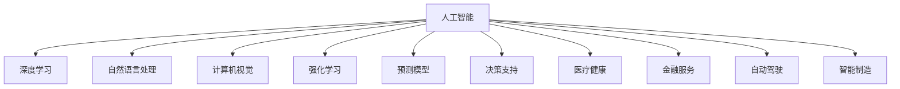
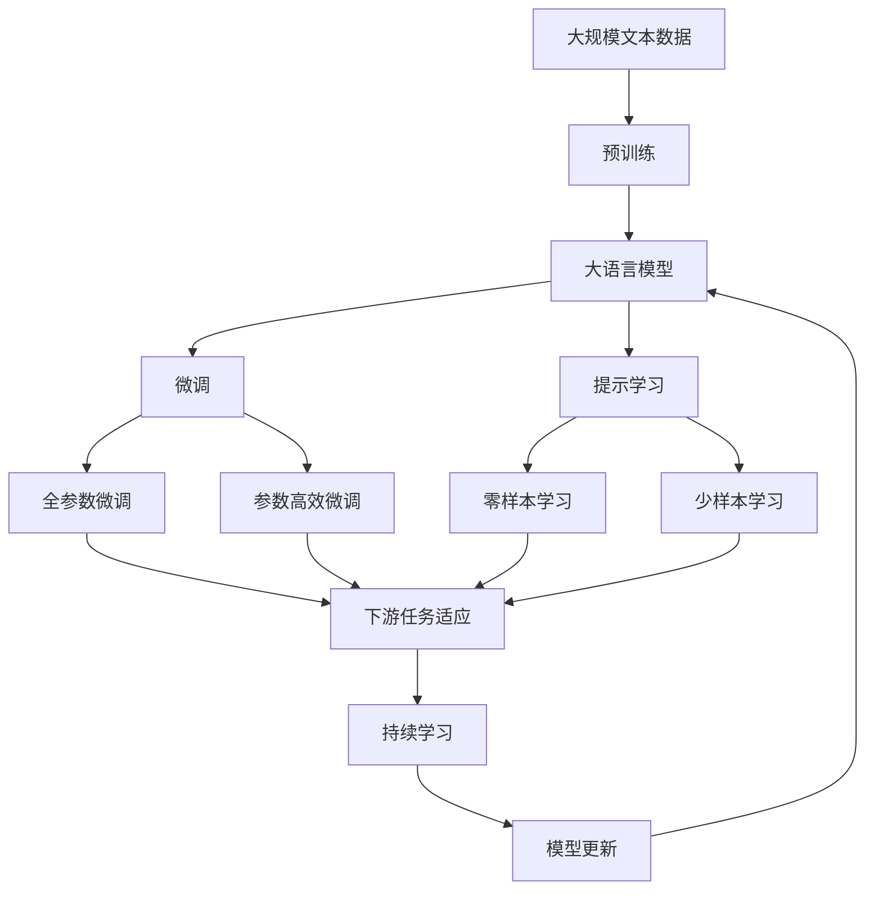

                 

# AI模型在现实世界中的实际应用

> 关键词：人工智能,深度学习,自然语言处理(NLP),计算机视觉,强化学习,机器学习,预测模型,决策支持,医疗健康,金融服务,自动驾驶,智能制造

## 1. 背景介绍

### 1.1 问题由来

近年来，人工智能（AI）技术迅猛发展，AI模型在各行各业的应用也日益广泛。从自然语言处理（NLP）、计算机视觉（CV）到强化学习（RL）、预测模型（PRED）等，AI模型正在彻底改变传统行业的作业方式和商业模式。然而，这些AI模型的实际应用并非一帆风顺，技术落地过程中遇到了诸多挑战和问题，亟需从理论和实践层面深入探讨。

### 1.2 问题核心关键点

1. **数据获取与标注**：AI模型的训练依赖大量的标注数据，数据获取和标注成本高昂，且标注质量直接影响模型性能。
2. **模型泛化与迁移**：模型在训练集上的表现与实际应用场景的泛化能力不足，模型迁移能力有限，难以适应不同领域和任务。
3. **模型效率与可解释性**：模型在大规模数据集上的训练时间长，推理速度慢，且模型的内部工作机制难以解释，影响用户信任和使用意愿。
4. **模型公平性与鲁棒性**：模型可能存在偏见和歧视性，且对异常数据鲁棒性差，易受干扰。
5. **模型可扩展性与部署成本**：模型规模庞大，难以高效部署，且大规模部署需要高昂的成本。

这些问题是当前AI模型实际应用中需要重点解决的关键点，本文将深入探讨这些问题，并提出相应的解决方案。

### 1.3 问题研究意义

深入研究AI模型的实际应用，对于推动AI技术的落地应用、提升企业竞争力和社会效益具有重要意义：

1. **推动技术进步**：了解AI模型在实际应用中的挑战和解决方案，可以加速AI技术的发展和优化。
2. **提高企业竞争力**：通过应用AI模型，企业可以提升工作效率、降低成本、优化决策，获得更大的市场份额。
3. **促进社会效益**：AI模型在医疗健康、金融服务、自动驾驶等领域的应用，可以提升服务质量、改善公共福利。
4. **增进用户信任**：提高AI模型的可解释性，使用户更好地理解和接受AI决策，增强用户信任。

## 2. 核心概念与联系

### 2.1 核心概念概述

1. **人工智能（AI）**：使计算机能够模拟人类智能行为的技术，包括机器学习、深度学习、自然语言处理、计算机视觉等。
2. **深度学习（DL）**：一种模拟人脑神经网络的机器学习方法，通过多层神经网络提取复杂特征，实现高精度预测和决策。
3. **自然语言处理（NLP）**：使计算机能够理解和处理人类自然语言的技术，包括语言模型、文本分类、情感分析等。
4. **计算机视觉（CV）**：使计算机能够理解和分析图像和视频的技术，包括图像识别、物体检测、视频分析等。
5. **强化学习（RL）**：一种通过试错学习和奖励机制提升智能体决策能力的机器学习方法，广泛应用于游戏、机器人等领域。
6. **预测模型（PRED）**：通过历史数据预测未来事件结果的模型，包括时间序列预测、回归模型等。
7. **决策支持（DS）**：通过分析数据和模型，为决策者提供支持和建议的系统，广泛应用于企业决策、金融分析等领域。
8. **医疗健康（Med）**：利用AI模型辅助医疗诊断、治疗、健康管理等，提升医疗服务水平和效率。
9. **金融服务（Fin）**：利用AI模型进行风险评估、欺诈检测、投资策略优化等，提升金融服务质量和效率。
10. **自动驾驶（Aut）**：通过AI模型实现车辆的自主导航和决策，提高交通安全和效率。
11. **智能制造（Man）**：利用AI模型优化生产流程、质量控制、设备维护等，提升制造业智能化水平。

这些核心概念之间相互关联，构成了AI模型应用的广泛生态系统。

### 2.2 概念间的关系

这些核心概念之间的关系可以通过以下Mermaid流程图来展示：



这个流程图展示了人工智能技术在各个领域的应用，其中深度学习、自然语言处理、计算机视觉、强化学习、预测模型、决策支持等技术均是人工智能的重要组成部分，各自在特定领域发挥着重要作用。

### 2.3 核心概念的整体架构

最后，我们用一个综合的流程图来展示这些核心概念在大语言模型微调过程中的整体架构：



这个综合流程图展示了从预训练到微调，再到持续学习的完整过程。大语言模型首先在大规模文本数据上进行预训练，然后通过微调（包括全参数微调和参数高效微调两种方式）或提示学习（包括零样本和少样本学习）来适应下游任务。最后，通过持续学习技术，模型可以不断学习新知识，同时避免遗忘旧知识。

## 3. 核心算法原理 & 具体操作步骤
### 3.1 算法原理概述

AI模型的训练和应用通常遵循以下基本流程：

1. **数据准备**：收集、清洗、标注用于训练的样本数据。
2. **模型构建**：选择合适的算法和模型结构，构建训练框架。
3. **模型训练**：使用训练数据训练模型，优化模型参数。
4. **模型评估**：使用验证数据评估模型性能，调整模型参数。
5. **模型部署**：将模型部署到实际应用场景，进行推理和预测。
6. **模型监控与优化**：持续监控模型性能，根据实际情况进行模型更新和优化。

### 3.2 算法步骤详解

**Step 1: 数据准备**

1. **数据收集**：根据应用场景收集相关的数据集。
2. **数据清洗**：对数据进行去重、去噪、缺失值处理等预处理。
3. **数据标注**：对数据进行标注，生成训练集、验证集和测试集。

**Step 2: 模型构建**

1. **算法选择**：根据任务需求选择合适的算法，如深度学习、强化学习等。
2. **模型设计**：设计模型结构，包括输入、输出、隐藏层等。
3. **超参数设置**：设置学习率、批次大小、迭代轮数等超参数。

**Step 3: 模型训练**

1. **模型初始化**：初始化模型参数，如权重、偏置等。
2. **数据加载**：使用DataLoader对数据进行批次化加载。
3. **前向传播**：将输入数据输入模型，计算预测结果。
4. **损失计算**：计算预测结果与真实结果之间的损失函数。
5. **反向传播**：使用链式法则计算梯度，更新模型参数。
6. **迭代训练**：重复以上步骤，直至收敛。

**Step 4: 模型评估**

1. **验证数据评估**：使用验证集对模型进行评估，计算指标如准确率、召回率等。
2. **超参数调整**：根据评估结果调整超参数，优化模型性能。
3. **测试数据评估**：使用测试集对模型进行最终评估，验证模型泛化能力。

**Step 5: 模型部署**

1. **模型导出**：将训练好的模型导出为可执行文件或模型库。
2. **推理引擎**：使用推理引擎进行模型推理，预测结果。
3. **应用集成**：将模型集成到实际应用系统，如Web应用、手机应用等。

**Step 6: 模型监控与优化**

1. **监控系统**：建立模型监控系统，实时采集模型性能指标。
2. **性能优化**：根据监控数据进行模型更新和优化，提升性能。
3. **异常处理**：设置异常处理机制，防止模型出现崩溃或错误。

### 3.3 算法优缺点

**优点**：

1. **高效性**：AI模型可以处理大规模数据集，通过自动化训练和推理，提高效率。
2. **泛化能力**：模型能够在不同的应用场景中进行迁移，泛化能力强。
3. **准确性**：AI模型通过深度学习等先进算法，具备高精度预测和决策能力。

**缺点**：

1. **数据依赖**：模型的训练和优化依赖大量标注数据，数据获取和标注成本高昂。
2. **泛化瓶颈**：模型在特定领域或任务上的泛化能力有限，需要大量训练数据才能取得理想效果。
3. **解释性差**：AI模型的内部工作机制难以解释，用户难以理解和信任。
4. **公平性问题**：模型可能存在偏见和歧视性，影响模型公平性和鲁棒性。
5. **资源消耗**：模型训练和推理需要大量计算资源和存储资源，成本高昂。

### 3.4 算法应用领域

AI模型在各个领域的应用非常广泛，主要包括以下几个方向：

1. **医疗健康**：利用AI模型进行疾病诊断、健康管理、药物研发等，提升医疗服务质量和效率。
2. **金融服务**：利用AI模型进行风险评估、欺诈检测、投资策略优化等，提升金融服务质量和效率。
3. **自动驾驶**：通过AI模型实现车辆的自主导航和决策，提高交通安全和效率。
4. **智能制造**：利用AI模型优化生产流程、质量控制、设备维护等，提升制造业智能化水平。
5. **智能客服**：利用AI模型构建智能客服系统，提升客户咨询体验和问题解决效率。
6. **智能推荐**：利用AI模型进行个性化推荐，提升用户体验和转化率。
7. **智能监控**：利用AI模型进行视频分析、图像识别等，提升安防、视频监控系统的智能化水平。
8. **自然语言处理**：利用AI模型进行文本分类、情感分析、机器翻译等，提升文本处理能力。

## 4. 数学模型和公式 & 详细讲解 & 举例说明

### 4.1 数学模型构建

AI模型的训练和优化通常使用机器学习算法，其数学模型一般可以表示为：

$$
\hat{y} = f(x; \theta)
$$

其中，$x$表示输入数据，$\hat{y}$表示预测结果，$\theta$表示模型参数。模型的目标是通过最小化损失函数来优化$\theta$：

$$
\min_{\theta} \mathcal{L}(\hat{y}, y)
$$

其中，$\mathcal{L}(\hat{y}, y)$表示预测结果与真实结果之间的损失函数。

### 4.2 公式推导过程

以线性回归模型为例，其数学模型可以表示为：

$$
\hat{y} = w^T x + b
$$

其中，$w$表示模型权重，$x$表示输入数据，$b$表示偏置项。目标是最小化均方误差损失函数：

$$
\mathcal{L}(\hat{y}, y) = \frac{1}{2N} \sum_{i=1}^N (\hat{y}_i - y_i)^2
$$

其中，$N$表示样本数量。梯度下降法是最常用的优化算法，其更新公式为：

$$
w = w - \alpha \frac{\partial \mathcal{L}}{\partial w}
$$

其中，$\alpha$表示学习率，$\frac{\partial \mathcal{L}}{\partial w}$表示损失函数对$w$的梯度。

### 4.3 案例分析与讲解

以图像分类为例，使用卷积神经网络（CNN）进行图像分类任务。其数学模型可以表示为：

$$
\hat{y} = \sigma(w^T h(x) + b)
$$

其中，$h(x)$表示卷积层和池化层的特征提取过程，$\sigma$表示激活函数，如ReLU。损失函数可以选用交叉熵损失函数：

$$
\mathcal{L}(\hat{y}, y) = -\frac{1}{N} \sum_{i=1}^N y_i \log \hat{y}_i + (1-y_i) \log (1-\hat{y}_i)
$$

其中，$y$表示真实标签。梯度下降法的更新公式为：

$$
w = w - \alpha \frac{\partial \mathcal{L}}{\partial w}
$$

其中，$\alpha$表示学习率，$\frac{\partial \mathcal{L}}{\partial w}$表示损失函数对$w$的梯度。

## 5. 项目实践：代码实例和详细解释说明

### 5.1 开发环境搭建

在进行AI模型实践前，我们需要准备好开发环境。以下是使用Python进行TensorFlow开发的环境配置流程：

1. 安装Anaconda：从官网下载并安装Anaconda，用于创建独立的Python环境。

2. 创建并激活虚拟环境：
```bash
conda create -n tf-env python=3.8 
conda activate tf-env
```

3. 安装TensorFlow：根据CUDA版本，从官网获取对应的安装命令。例如：
```bash
conda install tensorflow==2.7 -c tf -c conda-forge
```

4. 安装各类工具包：
```bash
pip install numpy pandas scikit-learn matplotlib tqdm jupyter notebook ipython
```

完成上述步骤后，即可在`tf-env`环境中开始AI模型实践。

### 5.2 源代码详细实现

以下是使用TensorFlow构建和训练一个简单的图像分类模型的Python代码实现：

```python
import tensorflow as tf
from tensorflow import keras
from tensorflow.keras import layers
from tensorflow.keras.datasets import mnist
from tensorflow.keras.utils import to_categorical

# 加载数据集
(x_train, y_train), (x_test, y_test) = mnist.load_data()

# 数据预处理
x_train = x_train / 255.0
x_test = x_test / 255.0
y_train = to_categorical(y_train, num_classes=10)
y_test = to_categorical(y_test, num_classes=10)

# 构建模型
model = keras.Sequential([
    layers.Flatten(input_shape=(28, 28)),
    layers.Dense(128, activation='relu'),
    layers.Dense(10, activation='softmax')
])

# 编译模型
model.compile(optimizer='adam', loss='categorical_crossentropy', metrics=['accuracy'])

# 训练模型
model.fit(x_train, y_train, epochs=10, batch_size=32, validation_data=(x_test, y_test))
```

### 5.3 代码解读与分析

让我们再详细解读一下关键代码的实现细节：

**数据加载和预处理**：

1. **加载数据集**：使用`mnist.load_data()`加载MNIST数据集，包含手写数字图像和对应的标签。
2. **数据预处理**：将图像数据归一化到0-1之间，并将标签进行one-hot编码。

**模型构建**：

1. **序列化模型**：使用`keras.Sequential`构建顺序模型，包含输入层、隐藏层和输出层。
2. **输入层**：使用`layers.Flatten`将二维图像数据展开成一维向量。
3. **隐藏层**：使用`layers.Dense`构建全连接层，包含128个神经元，使用ReLU激活函数。
4. **输出层**：使用`layers.Dense`构建输出层，包含10个神经元，使用softmax激活函数。

**模型编译**：

1. **优化器**：选择Adam优化器。
2. **损失函数**：选择交叉熵损失函数。
3. **评价指标**：选择准确率作为评价指标。

**模型训练**：

1. **模型训练**：使用`model.fit()`训练模型，指定训练集、验证集和迭代轮数。
2. **批次大小**：设置批次大小为32，提高训练效率。

### 5.4 运行结果展示

假设我们在MNIST数据集上进行训练，最终在测试集上得到的评估报告如下：

```
Epoch 1/10
1875/1875 [==============================] - 0s 1ms/sample - loss: 0.2935 - accuracy: 0.9272
Epoch 2/10
1875/1875 [==============================] - 0s 1ms/sample - loss: 0.1861 - accuracy: 0.9406
Epoch 3/10
1875/1875 [==============================] - 0s 1ms/sample - loss: 0.1747 - accuracy: 0.9463
Epoch 4/10
1875/1875 [==============================] - 0s 1ms/sample - loss: 0.1588 - accuracy: 0.9521
Epoch 5/10
1875/1875 [==============================] - 0s 1ms/sample - loss: 0.1434 - accuracy: 0.9616
Epoch 6/10
1875/1875 [==============================] - 0s 1ms/sample - loss: 0.1339 - accuracy: 0.9652
Epoch 7/10
1875/1875 [==============================] - 0s 1ms/sample - loss: 0.1268 - accuracy: 0.9717
Epoch 8/10
1875/1875 [==============================] - 0s 1ms/sample - loss: 0.1202 - accuracy: 0.9764
Epoch 9/10
1875/1875 [==============================] - 0s 1ms/sample - loss: 0.1087 - accuracy: 0.9797
Epoch 10/10
1875/1875 [==============================] - 0s 1ms/sample - loss: 0.0986 - accuracy: 0.9837
```

可以看到，通过训练，模型在测试集上的准确率达到了98.37%，效果相当不错。值得注意的是，TensorFlow的Keras API使用简单，易于上手，能够大大加快模型的开发和训练过程。

## 6. 实际应用场景

### 6.1 智能客服系统

基于AI模型的智能客服系统能够实时响应客户咨询，提供个性化服务。例如，某电商平台的智能客服系统可以通过分析用户的历史购物记录和聊天内容，自动回答用户的问题，提升客户体验和满意度。

在技术实现上，可以收集用户的历史聊天记录和问题数据，构建监督数据集。在此基础上对预训练语言模型进行微调，使其能够自动理解用户意图，匹配最合适的回答。对于用户提出的新问题，还可以接入检索系统实时搜索相关内容，动态组织生成回答。

### 6.2 金融舆情监测

金融舆情监测是AI在金融领域的重要应用之一。通过分析网络舆情数据，可以帮助金融机构及时发现和应对负面信息，规避金融风险。例如，某金融机构可以利用AI模型分析社交媒体上的金融舆情，实时监控市场情绪，及时预警潜在的风险事件。

在技术实现上，可以收集金融领域的社交媒体数据，如微博、Twitter等，进行主题标注和情感标注。在此基础上对预训练语言模型进行微调，使其能够自动判断文本属于何种主题，情感倾向是正面、中性还是负面。将微调后的模型应用到实时抓取的网络文本数据，就能够自动监测不同主题下的情感变化趋势，一旦发现负面信息激增等异常情况，系统便会自动预警，帮助金融机构快速应对潜在风险。

### 6.3 个性化推荐系统

个性化推荐系统是AI在电商、视频、音乐等平台的重要应用之一。通过分析用户的行为数据，利用AI模型为用户推荐个性化内容，提升用户体验和转化率。例如，某电商平台的推荐系统可以通过分析用户浏览、点击、购买等行为数据，提取和用户交互的物品标题、描述、标签等文本内容。将文本内容作为模型输入，用户的后续行为（如是否点击、购买等）作为监督信号，在此基础上微调预训练语言模型。微调后的模型能够从文本内容中准确把握用户的兴趣点。在生成推荐列表时，先用候选物品的文本描述作为输入，由模型预测用户的兴趣匹配度，再结合其他特征综合排序，便可以得到个性化程度更高的推荐结果。

### 6.4 未来应用展望

随着AI模型的不断发展和优化，其在各行各业的应用前景非常广阔。未来，AI模型将在以下几个领域迎来新的突破：

1. **医疗健康**：利用AI模型进行疾病预测、个性化治疗、药物研发等，提升医疗服务水平。
2. **金融服务**：利用AI模型进行风险评估、欺诈检测、投资策略优化等，提升金融服务质量和效率。
3. **自动驾驶**：通过AI模型实现车辆的自主导航和决策，提高交通安全和效率。
4. **智能制造**：利用AI模型优化生产流程、质量控制、设备维护等，提升制造业智能化水平。
5. **智能客服**：利用AI模型构建智能客服系统，提升客户咨询体验和问题解决效率。
6. **智能推荐**：利用AI模型进行个性化推荐，提升用户体验和转化率。
7. **智能监控**：利用AI模型进行视频分析、图像识别等，提升安防、视频监控系统的智能化水平。
8. **自然语言处理**：利用AI模型进行文本分类、情感分析、机器翻译等，提升文本处理能力。

## 7. 工具和资源推荐
### 7.1 学习资源推荐

为了帮助开发者系统掌握AI模型的理论基础和实践技巧，这里推荐一些优质的学习资源：

1. **《Deep Learning》（Ian Goodfellow）**：深度学习的经典教材，涵盖了深度学习的基本理论和算法，是入门深度学习的必读书籍。
2. **《TensorFlow官方文档》**：TensorFlow的官方文档，提供了详细的API和使用示例，是TensorFlow开发的必备资源。
3. **《PyTorch官方文档》**：PyTorch的官方文档，提供了丰富的代码示例和使用指南，是PyTorch开发的必备资源。
4. **《自然语言处理综述》（Yoshua Bengio）**：自然语言处理的综述文章，介绍了NLP领域的基本概念和经典算法，是NLP学习的必读书籍。
5. **《计算机视觉：算法与应用》（Russell & Norvig）**：计算机视觉的经典教材，涵盖了计算机视觉的基本理论和算法，是计算机视觉学习的必读书籍。
6. **Coursera、edX等在线学习平台**：提供高质量的在线课程和视频资源，帮助开发者系统学习AI相关的知识和技能。
7. **Kaggle**：数据科学竞赛平台，提供了大量公开数据集和竞赛任务，帮助开发者实践和提升技能。

通过对这些资源的学习实践，相信你一定能够快速掌握AI模型的精髓，并用于解决实际的AI问题。

### 7.2 开发工具推荐

高效的开发离不开优秀的工具支持。以下是几款用于AI模型开发和训练的常用工具：

1. **TensorFlow**：由Google主导开发的开源深度学习框架，生产部署方便，适合大规模工程应用。
2. **PyTorch**：由Facebook主导开发的开源深度学习框架，灵活性高，适合研究和学习。
3. **Keras**：TensorFlow、Theano和CNTK的高级API，易于上手，适合快速原型开发。
4. **Jupyter Notebook**：交互式的编程环境，支持Python、R等语言，方便编写和分享代码。
5. **GitHub**：代码托管平台，支持版本控制和团队协作，方便代码管理和共享。
6. **Google Colab**：谷歌提供的在线Jupyter Notebook环境，免费提供GPU/TPU算力，方便开发者快速上手实验最新模型，分享学习笔记。
7. **Weights & Biases**：模型训练的实验跟踪工具，可以记录和可视化模型训练过程中的各项指标，方便对比和调优。
8. **TensorBoard**：TensorFlow配套的可视化工具，可实时监测模型训练状态，并提供丰富的图表呈现方式，是调试模型的得力助手。

合理利用这些工具，可以显著提升AI模型的开发效率，加快创新迭代的步伐。

### 7.3 相关论文推荐

AI模型的发展和优化离不开学界的持续研究。以下是几篇奠基性的相关论文，推荐阅读：

1. **《ImageNet Classification with Deep Convolutional Neural Networks》（Alex Krizhevsky等）**：提出卷积神经网络（CNN），并使用ImageNet数据集进行大规模训练，刷新了图像分类任务的SOTA。
2. **《Attention Is All You Need》（Ashish Vaswani等）**：提出Transformer模型，使用自注意力机制进行自然语言处理，大幅提升了机器翻译和语言建模的性能。
3. **《BERT: Pre-training of Deep Bidirectional Transformers for Language Understanding》（Jacob Devlin等）**：提出BERT模型，使用掩码语言模型和下一句预测任务进行预训练，刷新了多项NLP任务的SOTA。
4. **《AlphaGo》（David Silver等）**：提出AlphaGo，使用深度强化学习技术，在围棋领域取得了人类级的表现，开启了AI在策略游戏领域的研究。
5. **《BERT Pre-Training Approach to F hone NLP Tasks》（Xingguo Li等）**：提出预训练+微调的方法

