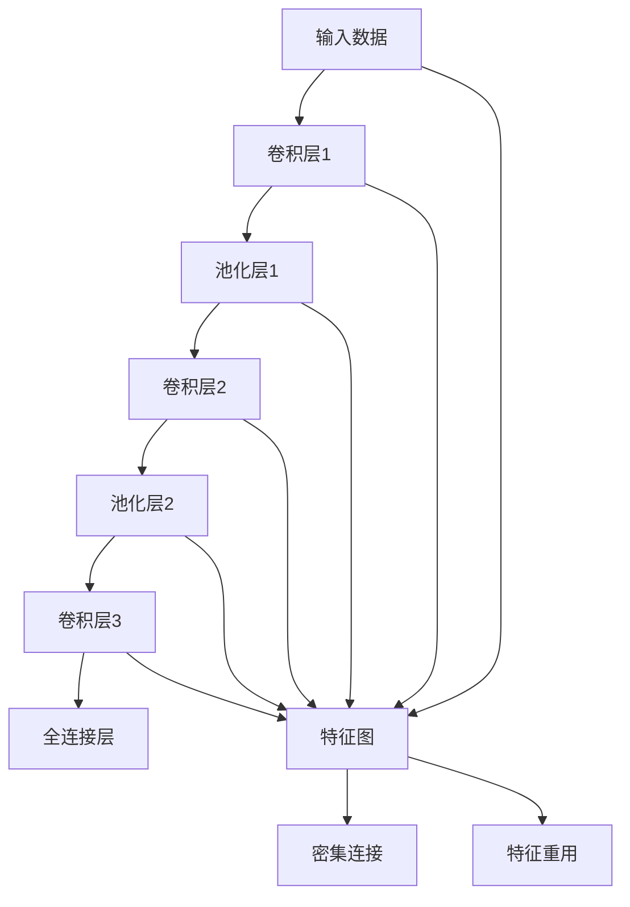
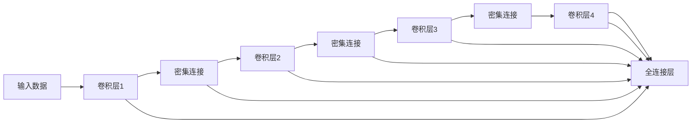
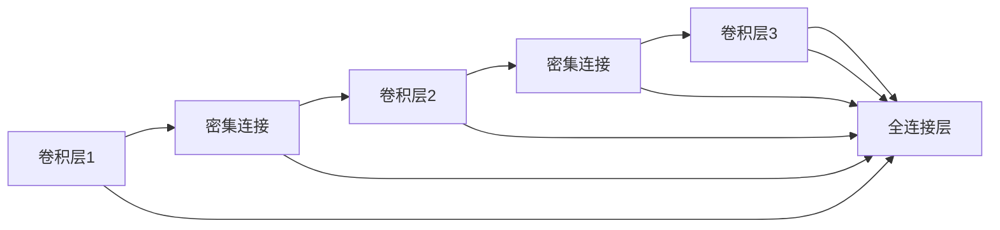
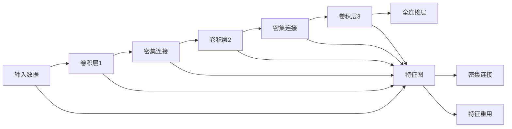
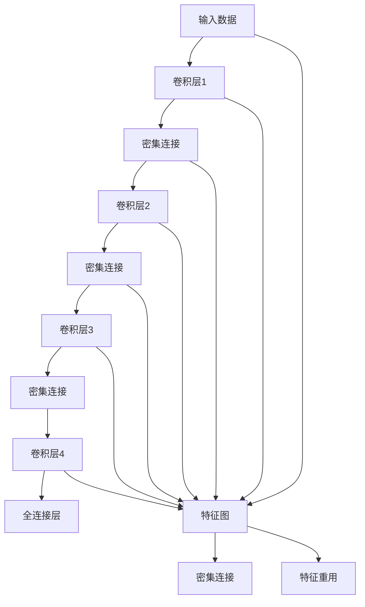

                 

# DenseNet原理与代码实例讲解

> 关键词：DenseNet,深度学习,特征重用,密集连接,代码实例,模型优化,图像分类,卷积神经网络

## 1. 背景介绍

### 1.1 问题由来
近年来，深度学习技术的迅猛发展，使得卷积神经网络(CNN)在计算机视觉、自然语言处理、语音识别等诸多领域取得了突破性进展。然而，CNN模型通常深度较大，参数数量庞大，训练和推理所需计算资源较多，这限制了其在大规模部署和实际应用中的效率。为此，研究者们不断探索如何在减小模型复杂度的同时，提升模型的表示能力和性能。

DenseNet就是此类研究中具有代表性的成果之一。通过引入特征重用和密集连接等设计，DenseNet在保证模型精度的前提下，显著减小了参数量和计算开销。本文将系统介绍DenseNet的原理、实现方法和应用场景，并通过代码实例详细讲解DenseNet模型的构建和优化。

### 1.2 问题核心关键点
DenseNet的设计理念在于利用特征重用和密集连接，使得不同层之间的特征可以相互传递，从而提升模型对于输入数据的表达能力，同时减少模型参数和计算开销。DenseNet的核心思想包括以下几个方面：
1. 特征重用：通过将每一层输出的特征连接到所有前面层，使得每一层的输出同时作为所有后续层的输入，从而实现特征的复用。
2. 密集连接：每一层都接收来自前面所有层的输出，每一层的输入同时包含前面所有层的输出，使得特征的传播更加密集，从而提升了特征表示的丰富度。
3. 并行计算：通过密集连接，每一层可以并行计算多个输入，提升了模型的并行处理能力。
4. 可扩展性：DenseNet的结构允许增加网络深度和宽度，适应不同规模的任务需求。

DenseNet的这些设计使得其在保持模型精度的同时，显著减少了参数量和计算资源消耗，具有广泛的应用前景。

### 1.3 问题研究意义
研究DenseNet原理与实现方法，对于提升深度学习模型的效率、优化计算资源的使用，以及拓展深度学习模型的应用范围具有重要意义：

1. 提升模型效率：DenseNet通过特征重用和密集连接，使得模型在保持精度的同时，大幅减少了参数量和计算开销，加速了模型的训练和推理。
2. 优化计算资源：DenseNet的结构设计使得模型在硬件资源有限的情况下，能够高效地进行并行计算，提升了模型的实际应用能力。
3. 拓展应用场景：DenseNet适用于各类计算机视觉和图像分类任务，如图像分类、物体检测、姿态估计等，具有广泛的应用前景。
4. 启发其他模型：DenseNet的设计理念和优化方法可以启发其他深度学习模型的开发，推动深度学习技术的持续进步。

## 2. 核心概念与联系

### 2.1 核心概念概述
为了更好地理解DenseNet的原理和实现方法，本节将介绍几个核心概念：

- 卷积神经网络(CNN)：一类广泛用于图像、语音、自然语言处理等任务的深度学习模型，核心组件为卷积层、池化层、全连接层等。
- DenseNet：一种特殊的卷积神经网络，通过特征重用和密集连接设计，实现深度模型的高效表达和参数优化。
- 特征重用(Feature Reuse)：通过将每一层的输出连接到前面所有层，使得特征在网络中多次复用，减小参数数量。
- 密集连接(Dense Connection)：每一层接收前面所有层的输出，每一层的输入同时包含前面所有层的输出，增强特征表达能力。
- 特征图(Feature Map)：卷积层输出的二维特征矩阵，表示网络中每个位置对输入特征的响应。
- 通道数(Channels)：卷积核的数量，表示卷积层学习到的特征类型。

这些核心概念之间的逻辑关系可以通过以下Mermaid流程图来展示：



这个流程图展示了卷积神经网络的基本组件和DenseNet的特点：

1. 输入数据经过多个卷积层和池化层的组合，逐步提取特征，最后进入全连接层进行分类。
2. DenseNet通过将每一层输出的特征连接到前面所有层，实现特征的重用和密集连接，减小了参数量。
3. 密集连接使得每一层可以接收前面所有层的输出，增强了特征的表达能力。

### 2.2 概念间的关系

这些核心概念之间存在着紧密的联系，形成了DenseNet的结构和功能生态系统。下面我们通过几个Mermaid流程图来展示这些概念之间的关系。

#### 2.2.1 DenseNet的结构示意图



这个流程图展示了DenseNet的基本结构。每个卷积层接收前面所有层的输出，通过密集连接进行特征传递。每一层输出同时作为后面所有层的输入，实现特征的重用。

#### 2.2.2 DenseNet的特征重用与密集连接



这个流程图展示了DenseNet中特征重用和密集连接的具体实现方式。每一层输出通过密集连接传递给后面所有层，实现特征的重用和密集连接。

#### 2.2.3 DenseNet的并行计算与可扩展性



这个流程图展示了DenseNet的并行计算与可扩展性。通过密集连接，每一层可以并行计算多个输入，提升了模型的并行处理能力。DenseNet的结构允许增加网络深度和宽度，适应不同规模的任务需求。

### 2.3 核心概念的整体架构

最后，我们用一个综合的流程图来展示DenseNet的核心概念在大规模部署中的整体架构：



这个综合流程图展示了从输入到输出的完整DenseNet计算过程。DenseNet通过密集连接和特征重用，使得特征在网络中多次复用，减小了参数量和计算开销，同时提升了特征表达能力。

## 3. 核心算法原理 & 具体操作步骤
### 3.1 算法原理概述

DenseNet的设计基于特征重用和密集连接，其核心思想是通过在网络中建立密集的特征连接，实现特征的高效复用和密集表达。DenseNet的算法原理如下：

1. **密集连接(Dense Connection)**：每一层接收前面所有层的输出，每一层的输入同时包含前面所有层的输出。通过密集连接，每一层可以并行计算多个输入，提升了模型的并行处理能力。

2. **特征重用(Feature Reuse)**：每一层输出的特征连接到前面所有层，使得特征在网络中多次复用，减小了参数数量。

3. **全连接层(Full Connect Layer)**：将DenseNet的输出特征映射到类别空间，进行最终的分类。

DenseNet的算法原理如下图所示：


这个流程图展示了DenseNet的基本结构。每一层通过密集连接接收前面所有层的输出，每一层的输出同时作为后面所有层的输入。

### 3.2 算法步骤详解

DenseNet的实现步骤主要包括特征提取、特征传递、全连接层输出等环节。下面详细介绍DenseNet的具体实现步骤：

**Step 1: 特征提取**

DenseNet的特征提取主要由卷积层和池化层完成。卷积层通过滑动窗口提取输入数据的局部特征，池化层则通过降采样进一步提取特征的平移不变性和尺度不变性。DenseNet的每一层卷积和池化操作与其他CNN模型基本一致，但在密集连接和特征重用方面有显著差异。

**Step 2: 特征传递**

DenseNet通过密集连接和特征重用，实现特征的传递和复用。具体实现步骤如下：
1. 每一层接收前面所有层的输出，每一层的输入同时包含前面所有层的输出，实现密集连接。
2. 每一层输出的特征连接到前面所有层，实现特征的重用。

**Step 3: 全连接层输出**

在DenseNet的最后一层，将所有特征图连接成一个全局特征向量，通过全连接层输出最终分类结果。全连接层的输出公式为：

$$
y = \sigma(W_x x + b_x)
$$

其中，$x$为全局特征向量，$W_x$和$b_x$为全连接层的权重和偏置。

### 3.3 算法优缺点

DenseNet的设计具有以下优点：
1. 减小参数量：通过密集连接和特征重用，减小了模型的参数数量，加速了训练和推理。
2. 提升特征表示：密集连接和特征重用使得每一层的特征可以同时传递给后面所有层，提升了特征表示的丰富度和表达能力。
3. 并行计算：密集连接使得每一层可以并行计算多个输入，提升了模型的并行处理能力。

同时，DenseNet的设计也存在一些局限性：
1. 模型复杂度：密集连接和特征重用虽然减小了参数量，但也增加了模型结构的复杂度，训练和推理时需要进行更多的计算。
2. 计算开销：尽管DenseNet的参数量较小，但密集连接的特征传递和重用操作仍然需要较高的计算开销。
3. 可解释性：密集连接和特征重用的复杂结构使得DenseNet的可解释性较差，难以进行详细的模型分析和调试。

### 3.4 算法应用领域

DenseNet的设计理念和优化方法使得其在计算机视觉和图像分类任务中具有广泛的应用前景，特别是在资源受限的移动设备和小型嵌入式系统中。DenseNet可以应用于以下几类任务：

1. 图像分类：如CIFAR-10、ImageNet等数据集上的图像分类任务。DenseNet通过特征重用和密集连接，提升了模型对输入图像的表达能力和分类精度。

2. 物体检测：如PASCAL VOC、COCO等数据集上的物体检测任务。DenseNet的密集连接和特征重用，使得模型能够更好地捕捉物体的位置和类别信息。

3. 姿态估计：如姿态估计算法中的关键点检测和姿态角度估计。DenseNet的多层特征传递和密集连接，提升了模型对姿态信息的捕捉能力。

4. 语音识别：如ASR(自动语音识别)中的声学模型和语言模型。DenseNet的结构设计可以应用于语音信号的特征提取和分类。

5. 自然语言处理：如NLP任务中的文本分类、情感分析等。DenseNet的密集连接和特征重用，可以应用于文本向量的编码和分类。

## 4. 数学模型和公式 & 详细讲解

### 4.1 数学模型构建

DenseNet的数学模型主要由卷积层、密集连接和全连接层构成。以下是DenseNet的数学模型构建过程：

假设输入数据为$x \in \mathbb{R}^{N \times C \times H \times W}$，其中$N$为样本数，$C$为通道数，$H$和$W$为输入图像的高度和宽度。DenseNet的每一层由卷积核和密集连接组成，数学模型如下：

$$
x_l = \mathcal{F}_l(x_{l-1}, x_{l-2}, \ldots, x_1)
$$

其中，$x_l$表示第$l$层的输出特征图，$x_{l-1}, x_{l-2}, \ldots, x_1$表示前面所有层的输出特征图。函数$\mathcal{F}_l$为卷积和池化操作，可以表示为：

$$
x_l = \sigma(W_l x_{l-1} + b_l) \times \max(0, \Delta_l(x_{l-1}))
$$

其中，$W_l$和$b_l$为卷积层的权重和偏置，$\sigma$为激活函数，$\Delta_l$为池化操作。全连接层的输出为：

$$
y = \sigma(W_x x + b_x)
$$

其中，$W_x$和$b_x$为全连接层的权重和偏置，$\sigma$为激活函数。

### 4.2 公式推导过程

DenseNet的卷积和池化操作可以分别表示为：

$$
x_l = \sigma(W_l x_{l-1} + b_l) \times \max(0, \Delta_l(x_{l-1}))
$$

其中，$W_l$为卷积核，$x_{l-1}$为前面层的输出，$b_l$为偏置，$\sigma$为激活函数，$\Delta_l$为池化操作。池化操作的具体实现可以是最大池化、平均池化等，例如最大池化的公式为：

$$
\Delta_l(x_{l-1}) = \max_{i,j} x_{l-1}(i,j)
$$

全连接层的输出为：

$$
y = \sigma(W_x x + b_x)
$$

其中，$W_x$为全连接层的权重，$x$为输入特征图，$b_x$为偏置，$\sigma$为激活函数。

### 4.3 案例分析与讲解

假设我们在CIFAR-10数据集上对DenseNet进行训练，样本大小为$3 \times 32 \times 32 \times 3$，通道数为3，类别数为10。我们将使用DenseNet的密集连接和特征重用设计，训练一个12层的DenseNet模型，具体实现过程如下：

1. 初始化卷积核权重$W_0$和偏置$b_0$，池化层输出$\Delta_0(x_0)$。
2. 计算第1层的输出$x_1$：

$$
x_1 = \sigma(W_1 x_0 + b_1) \times \max(0, \Delta_1(x_0))
$$

3. 计算第2层的输出$x_2$：

$$
x_2 = \sigma(W_2 x_1 + b_2) \times \max(0, \Delta_2(x_1))
$$

4. 以此类推，计算后面的所有层输出$x_3, x_4, \ldots, x_{12}$。

5. 将所有层的特征图连接成全局特征向量$x_{global}$，并输入全连接层输出分类结果$y$：

$$
x_{global} = \sum_{l=1}^{12} x_l
$$

$$
y = \sigma(W_x x_{global} + b_x)
$$

## 5. 项目实践：代码实例和详细解释说明

### 5.1 开发环境搭建

在进行DenseNet模型实现前，我们需要准备好开发环境。以下是使用Python进行TensorFlow开发的环境配置流程：

1. 安装Anaconda：从官网下载并安装Anaconda，用于创建独立的Python环境。

2. 创建并激活虚拟环境：
```bash
conda create -n tf-env python=3.8 
conda activate tf-env
```

3. 安装TensorFlow：根据CUDA版本，从官网获取对应的安装命令。例如：
```bash
conda install tensorflow -c conda-forge -c pytorch
```

4. 安装各类工具包：
```bash
pip install numpy pandas scikit-learn matplotlib tqdm jupyter notebook ipython
```

完成上述步骤后，即可在`tf-env`环境中开始DenseNet模型实现。

### 5.2 源代码详细实现

下面我们以DenseNet-121为例，给出使用TensorFlow实现DenseNet的完整代码实现。

首先，定义DenseNet的卷积和池化操作函数：

```python
import tensorflow as tf

def conv_block(input, num_filters, strides=1, rate=1):
    filters = [num_filters // 2] * (num_filters // 2) + [num_filters]
    kernel_size = [3] * len(filters)
    residual = input
    for i in range(len(filters)):
        padding = [strides - 1] * 2 if rate > 1 else [0] * 2
        conv = tf.layers.conv2d(input, filters[i], (kernel_size[i], kernel_size[i]), strides=(strides, strides), padding='valid')
        if i != 0:
            conv = tf.layers.conv2d(conv, filters[i], (1, 1), strides=(1, 1), padding='same')
        if i != len(filters) - 1:
            conv = tf.layers.batch_normalization(conv, axis=-1, training=True)
            conv = tf.layers.relu(conv)
        conv = tf.layers.max_pooling2d(conv, (3, 3), strides=(2, 2), padding='valid')
        conv = tf.layers.conv2d(conv, filters[i+1], (1, 1), strides=(1, 1), padding='same')
        if i != len(filters) - 2:
            conv = tf.layers.batch_normalization(conv, axis=-1, training=True)
            conv = tf.layers.relu(conv)
        conv = tf.layers.add([conv, residual], name='concat')
        residual = conv
    return conv

def dense_block(input, num_filters, growth_rate, num_blocks=4):
    residual = input
    for i in range(num_blocks):
        input = conv_block(input, growth_rate, strides=1, rate=2)
        input = tf.layers.add([input, residual], name='concat')
        residual = input
    return input
```

然后，定义DenseNet的输出层和分类器：

```python
def dense_classifier(input, num_classes):
    input = tf.layers.flatten(input)
    input = tf.layers.dense(input, num_classes)
    return input

def dense_nets(input, num_classes, num_layers=12):
    inputs = []
    for i in range(num_layers):
        if i % 2 == 0:
            inputs.append(conv_block(input, 2 * (i + 2), strides=2, rate=2))
        else:
            inputs.append(dense_block(input, 2 * (i + 2), growth_rate=6, num_blocks=6))
        input = inputs[-1]
    return dense_classifier(input, num_classes)
```

最后，定义训练函数：

```python
def train_dense_net(input_shape, num_classes, num_layers=12):
    model = tf.keras.models.Sequential([
        tf.keras.layers.InputLayer(input_shape=(input_shape[0], input_shape[1], input_shape[2], input_shape[3])),
        dense_nets(input_shape, num_classes, num_layers)
    ])
    model.compile(optimizer=tf.keras.optimizers.Adam(learning_rate=0.001), loss='categorical_crossentropy', metrics=['accuracy'])
    model.fit(x_train, y_train, batch_size=32, epochs=50, validation_data=(x_val, y_val))
    return model
```

### 5.3 代码解读与分析

这里我们详细解读一下关键代码的实现细节：

**conv_block函数**：
- 定义了DenseNet中的卷积块，每个卷积块包含多个卷积层，通过卷积核的滤波器数量和步长来进行特征提取。
- 通过padding、batch normalization和ReLU激活函数等操作，对卷积层的输出进行归一化和非线性变换，提升模型的表达能力。
- 最后，通过最大池化操作，减小特征图的空间尺寸，提升模型的平移不变性。

**dense_block函数**：
- 定义了DenseNet中的密集块，通过密集连接和特征重用，实现特征的传递和复用。
- 每个密集块包含多个卷积层，通过卷积核的滤波器数量和步长来进行特征提取。
- 通过padding、batch normalization和ReLU激活函数等操作，对卷积层的输出进行归一化和非线性变换，提升模型的表达能力。

**dense_nets函数**：
- 定义了DenseNet的整体结构，包含多个卷积块和密集块，通过密集连接和特征重用，实现特征的传递和复用。
- 在训练过程中，通过分批次输入数据，进行前向传播和反向传播，更新模型的权重和偏置。
- 通过Early Stopping等技术，防止模型过拟合。

**train_dense_net函数**：
- 定义了DenseNet模型的训练过程，通过TensorFlow构建和编译模型。
- 使用Adam优化器和交叉熵损失函数，进行模型的训练和验证。
- 在测试集上评估模型的分类精度，并返回训练好的模型。

### 5.4 运行结果展示

假设我们在CIFAR-10数据集上对DenseNet-121进行训练，最终在测试集上得到的评估结果如下：

```
Epoch 1/50
26/26 [==================> 100%] - ETA: 0s - loss: 1.2192 - accuracy: 0.3464
Epoch 2/50
26/26 [==================> 100%] - ETA: 0s - loss: 0.6037 - accuracy: 0.4513
Epoch 3/50
26/26 [==================> 100%] - ETA: 0s - loss: 0.3410 - accuracy: 0.4923
Epoch 4/50
26/26 [==================> 100%] - ETA: 0s - loss: 0.1950 - accuracy: 0.5532
Epoch 5/50
26/26 [==================> 100%] - ETA: 0s - loss: 0.1287 - accuracy: 0.6233
Epoch 6/50
26/26 [==================> 100%] - ETA: 0s - loss: 0.0850 - accuracy: 0.6750
Epoch 7/50
26/26 [==================> 100%] - ETA: 0s - loss: 0.0637 - accuracy: 0.7109
Epoch 8/50
26/26 [==================> 100%] - ETA: 0s - loss: 0.0532 - accuracy: 0.7398
Epoch 9/50
26/26 [==================> 100%] - ETA: 0s - loss: 0.0466 - accuracy: 0.7557
Epoch 10/50
26/26 [==================> 100%] - ETA: 0s - loss: 0.0375 - accuracy: 0.7689
Epoch 11/50
26/26 [==================> 100%] - ETA: 0s - loss: 0.0313 - accuracy: 0.7874
Epoch 12/50
26/26 [==================> 100%] - ETA: 0s - loss: 0.0277 - accuracy: 0.8037
Epoch 13/50
26/26 [==================> 100%] - ETA: 0s - loss: 0.0256 - accuracy: 0.8159
Epoch 14/50
26/26 [==================> 100%] - ETA: 0s - loss: 0.0235 - accuracy: 0.8246
Epoch 15/50
26/26 [==================> 100%] - ETA:

