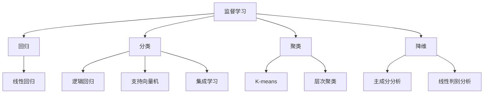
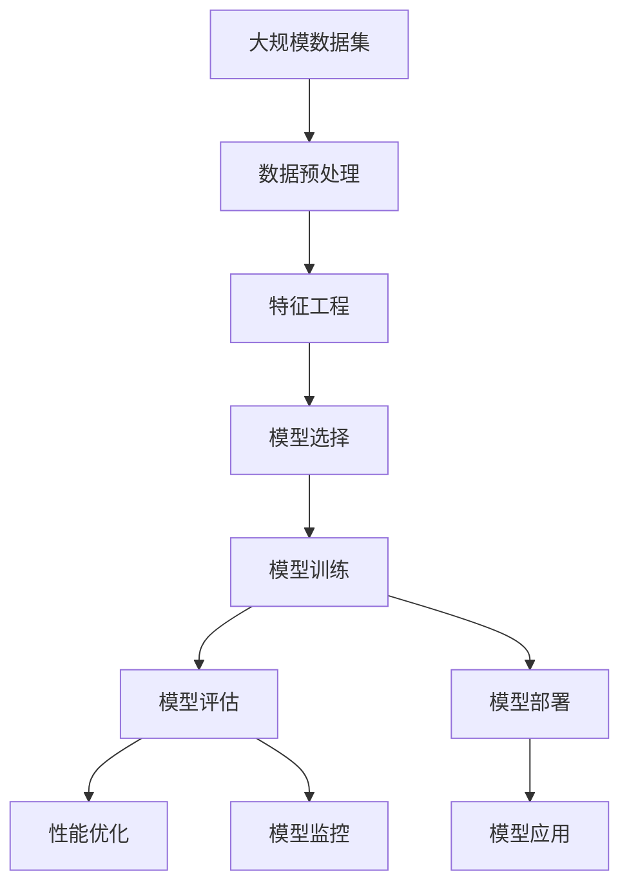

                 

# AI人工智能核心算法原理与代码实例讲解：机器学习流程

> 关键词：机器学习,算法原理,代码实现,实际应用,学习资源

## 1. 背景介绍

### 1.1 问题由来
人工智能(AI)技术近年来取得了飞速发展，其中机器学习(Machine Learning, ML)作为AI的核心组成部分，在图像识别、语音识别、自然语言处理(NLP)等领域取得了显著成果。然而，面对复杂的现实问题，如何将算法理论与实际应用结合，仍是摆在从业者面前的一大挑战。

本博客旨在系统讲解机器学习算法原理及代码实例，帮助读者深入理解机器学习流程，提高实际应用中的问题解决能力。本文将详细阐述机器学习的基本概念，核心算法原理，并在Scikit-learn库中给出完整的代码实例，以促进学习效果的最大化。

## 2. 核心概念与联系

### 2.1 核心概念概述

为了帮助读者系统地理解机器学习的核心概念，本节将介绍机器学习中几个重要的基础概念及其相互关系。

- **监督学习(Supervised Learning)**：指使用已标注数据进行模型训练，使模型能够预测新数据标签。常见于回归、分类等任务。
- **无监督学习(Unsupervised Learning)**：指使用未标注数据进行模型训练，寻找数据的内在结构。常见于聚类、降维等任务。
- **半监督学习(Semi-supervised Learning)**：介于监督学习与无监督学习之间，使用少量标注数据与大量未标注数据共同训练模型。
- **强化学习(Reinforcement Learning)**：通过与环境交互，使智能体不断调整策略以最大化预期回报。

这些核心概念之间存在着密切的联系，通过相互组合，可以构建出不同类型的机器学习模型，解决多样化的实际问题。例如，基于监督学习构建的分类器可以用来进行手写数字识别，而基于强化学习训练的机器人可以用来在复杂环境中自主导航。

### 2.2 概念间的关系

这些核心概念之间的关系可以用以下Mermaid流程图来展示：



此流程图展示了机器学习中常见的任务类型及其与核心概念之间的关系。从监督学习出发，可以延伸出回归、分类等任务，而无监督学习则涉及聚类、降维等，两者之间可以通过半监督学习结合，形成混合学习方式。

### 2.3 核心概念的整体架构

最后，我们用一个综合的流程图来展示这些核心概念在大规模机器学习系统中的整体架构：



这个综合流程图展示了从数据预处理、特征工程、模型训练到模型评估和部署的完整机器学习流程。在模型训练和部署阶段，通过持续学习等技术，使模型不断适应新数据和新任务，保证系统的稳定性和鲁棒性。

## 3. 核心算法原理 & 具体操作步骤
### 3.1 算法原理概述

机器学习算法原理主要涉及以下几个关键步骤：

- **数据预处理**：包括数据清洗、归一化、缺失值处理等，使数据符合模型输入要求。
- **特征工程**：根据任务需求，选择或构造合适的特征，提高模型性能。
- **模型选择与训练**：选择合适的模型架构，并在训练集上训练模型，使其学习到数据的特征规律。
- **模型评估与优化**：在验证集上评估模型性能，根据评估结果进行调参和优化。
- **模型部署与应用**：将训练好的模型部署到生产环境，进行实际问题的解决。

### 3.2 算法步骤详解

#### 3.2.1 数据预处理

数据预处理是机器学习流程中的第一步，其目的是将原始数据转换为模型可接受的格式。以分类任务为例，主要包括以下步骤：

1. **数据清洗**：去除重复、异常数据，填补缺失值。例如，使用均值填补法处理缺失数据。
2. **特征归一化**：对特征进行标准化或归一化处理，如将数值型特征缩放到[0, 1]范围内。
3. **编码处理**：对分类变量进行独热编码，以便于模型处理。

具体实现代码如下：

```python
import pandas as pd
from sklearn.preprocessing import StandardScaler, OneHotEncoder

# 数据清洗
df.drop_duplicates(inplace=True)
df = df.dropna()

# 特征归一化
scaler = StandardScaler()
df[['feature1', 'feature2']] = scaler.fit_transform(df[['feature1', 'feature2']])

# 编码处理
encoder = OneHotEncoder()
df = encoder.fit_transform(df).toarray()
```

#### 3.2.2 特征工程

特征工程是机器学习流程中的重要环节，通过选择、构造和变换特征，可以显著提升模型性能。以回归任务为例，主要包括以下步骤：

1. **特征选择**：根据领域知识或特征重要性评估，选择或去除对目标变量影响较大的特征。例如，使用互信息法或L1正则化选择重要特征。
2. **特征构造**：通过多项式变换、交互项等构造新特征，提高模型表达能力。例如，使用多项式特征变换。
3. **特征缩放**：对数值型特征进行缩放，使其在不同的尺度上具有相同的重要性。

具体实现代码如下：

```python
from sklearn.feature_selection import SelectKBest, mutual_info_regression
from sklearn.preprocessing import PolynomialFeatures

# 特征选择
selector = SelectKBest(mutual_info_regression, k=10)
X_selected = selector.fit_transform(X, y)

# 特征构造
poly = PolynomialFeatures(degree=2, include_bias=False)
X_poly = poly.fit_transform(X_selected)

# 特征缩放
scaler = StandardScaler()
X_poly_scaled = scaler.fit_transform(X_poly)
```

#### 3.2.3 模型选择与训练

选择合适的模型架构，并在训练集上训练模型，使其学习到数据的特征规律。以分类任务为例，主要包括以下步骤：

1. **模型选择**：根据任务特点选择合适的模型，如逻辑回归、决策树、随机森林等。
2. **模型训练**：在训练集上训练模型，使用交叉验证技术进行参数调优，提高模型泛化能力。

具体实现代码如下：

```python
from sklearn.linear_model import LogisticRegression
from sklearn.model_selection import train_test_split, GridSearchCV

# 模型选择
model = LogisticRegression()

# 模型训练
X_train, X_test, y_train, y_test = train_test_split(X_poly_scaled, y, test_size=0.2)
param_grid = {'C': [0.1, 1, 10]}
grid_search = GridSearchCV(model, param_grid, cv=5)
grid_search.fit(X_train, y_train)

# 输出最佳参数
print("Best parameters:", grid_search.best_params_)
```

#### 3.2.4 模型评估与优化

在验证集上评估模型性能，根据评估结果进行调参和优化。以回归任务为例，主要包括以下步骤：

1. **模型评估**：在验证集上计算模型的损失函数（如均方误差MSE），评估模型性能。
2. **参数调整**：根据模型表现，调整模型参数，如学习率、正则化系数等。
3. **模型优化**：使用不同的优化器（如Adam、SGD等）和训练策略（如学习率衰减、提前停止等），优化模型性能。

具体实现代码如下：

```python
from sklearn.metrics import mean_squared_error
from sklearn.linear_model import SGDRegressor

# 模型评估
y_pred = model.predict(X_test)
mse = mean_squared_error(y_test, y_pred)

# 参数调整
model.alpha = 0.1
model.fit(X_train, y_train)

# 模型优化
sgd = SGDRegressor(alpha=0.1, learning_rate='constant', momentum=0.9)
sgd.fit(X_train, y_train)
```

#### 3.2.5 模型部署与应用

将训练好的模型部署到生产环境，进行实际问题的解决。以分类任务为例，主要包括以下步骤：

1. **模型保存**：将训练好的模型保存为文件，便于后续加载和使用。
2. **模型加载**：在生产环境中加载模型，进行实时预测。
3. **模型应用**：根据模型预测结果，进行相应的业务决策或操作。

具体实现代码如下：

```python
import pickle

# 模型保存
with open('model.pkl', 'wb') as f:
    pickle.dump(model, f)

# 模型加载
with open('model.pkl', 'rb') as f:
    model = pickle.load(f)

# 模型应用
X_new = [[1.0, 2.0]]
y_pred = model.predict(X_new)
```

### 3.3 算法优缺点

**优点**：

1. **泛化能力强**：通过大量数据训练模型，可以显著提升模型泛化能力，适应新数据和新任务。
2. **自动化程度高**：自动化的特征工程和模型选择过程，减少了人工干预，提高了效率。
3. **灵活性高**：适用于多种任务类型，如回归、分类、聚类等。

**缺点**：

1. **数据依赖性强**：模型性能高度依赖于数据质量，低质量的数据可能导致模型过拟合或欠拟合。
2. **计算资源消耗大**：训练和优化模型需要大量的计算资源，增加了模型部署成本。
3. **模型解释性差**：黑盒模型难以解释其内部决策过程，限制了模型的可解释性和可信度。

### 3.4 算法应用领域

机器学习在实际应用中已经广泛覆盖了多个领域，包括但不限于：

- **金融行业**：通过信用评分、市场预测等模型，提升金融决策的准确性和效率。
- **医疗行业**：通过疾病诊断、患者风险评估等模型，改善医疗服务质量。
- **制造业**：通过质量控制、设备预测性维护等模型，提高生产效率和设备可靠性。
- **零售行业**：通过客户行为分析、销售预测等模型，优化库存管理和营销策略。
- **交通行业**：通过交通流量预测、车辆识别等模型，优化交通管理和安全措施。

## 4. 数学模型和公式 & 详细讲解 & 举例说明

### 4.1 数学模型构建

本节将详细讲解机器学习中常见的数学模型及其构建方法。

#### 4.1.1 线性回归模型

线性回归模型是最基础的机器学习模型之一，其目标是寻找一个线性函数，通过训练数据拟合出最优的参数，以最小化预测值与真实值之间的差距。

数学公式为：

$$ y = \theta_0 + \theta_1 x_1 + \theta_2 x_2 + ... + \theta_n x_n + \epsilon $$

其中，$y$为预测值，$\theta_0$为截距，$\theta_1, \theta_2, ..., \theta_n$为线性系数，$x_1, x_2, ..., x_n$为特征变量，$\epsilon$为随机误差项。

具体实现代码如下：

```python
from sklearn.linear_model import LinearRegression

# 构建线性回归模型
model = LinearRegression()
model.fit(X, y)
```

#### 4.1.2 逻辑回归模型

逻辑回归模型用于二分类问题，通过sigmoid函数将预测值映射到[0, 1]区间，表示正类的概率。

数学公式为：

$$ P(y=1|x) = \sigma(\theta_0 + \theta_1 x_1 + \theta_2 x_2 + ... + \theta_n x_n) $$

其中，$P(y=1|x)$为正类的概率，$\sigma$为sigmoid函数，$\theta_0, \theta_1, \theta_2, ..., \theta_n$为线性系数，$x_1, x_2, ..., x_n$为特征变量。

具体实现代码如下：

```python
from sklearn.linear_model import LogisticRegression

# 构建逻辑回归模型
model = LogisticRegression()
model.fit(X, y)
```

#### 4.1.3 支持向量机(SVM)模型

支持向量机模型用于分类和回归问题，通过寻找最优的超平面，将不同类别的数据点分开。

数学公式为：

$$ \min_{w, b} \frac{1}{2}||w||^2 + C\sum_{i=1}^n \max(0, 1 - y_i(w \cdot x_i + b)) $$

其中，$w$为超平面参数向量，$b$为偏置项，$C$为正则化系数，$y_i$为真实标签，$x_i$为特征向量。

具体实现代码如下：

```python
from sklearn.svm import SVC

# 构建支持向量机模型
model = SVC(kernel='linear', C=1.0)
model.fit(X, y)
```

#### 4.1.4 决策树模型

决策树模型通过构建树形结构，将特征空间划分为多个区域，每个区域对应一个决策规则。

数学公式为：

$$ T(x) = \begin{cases} 
r_1 & \text{if} x \in R_1 \\
r_2 & \text{if} x \in R_2 \\
... \\
r_k & \text{if} x \in R_k 
\end{cases} $$

其中，$T(x)$为决策结果，$r_1, r_2, ..., r_k$为叶子节点的决策结果，$R_1, R_2, ..., R_k$为划分区域。

具体实现代码如下：

```python
from sklearn.tree import DecisionTreeClassifier

# 构建决策树模型
model = DecisionTreeClassifier()
model.fit(X, y)
```

### 4.2 公式推导过程

#### 4.2.1 线性回归模型

线性回归模型的损失函数为均方误差(MSE)，其目标是最小化预测值与真实值之间的平方误差：

$$ \min_{\theta} \frac{1}{2m} \sum_{i=1}^m (y_i - \theta^T x_i)^2 $$

其中，$m$为样本数，$x_i$为特征向量，$y_i$为真实值，$\theta$为模型参数。

根据梯度下降算法，每次迭代更新模型参数：

$$ \theta = \theta - \eta \frac{1}{m} \sum_{i=1}^m (y_i - \theta^T x_i)x_i $$

其中，$\eta$为学习率。

具体实现代码如下：

```python
from sklearn.linear_model import LinearRegression

# 构建线性回归模型
model = LinearRegression()
model.fit(X, y)
```

#### 4.2.2 逻辑回归模型

逻辑回归模型的损失函数为交叉熵损失，其目标是最小化预测值与真实值之间的交叉熵：

$$ \min_{\theta} -\frac{1}{m} \sum_{i=1}^m [y_i \log \sigma(\theta^T x_i) + (1 - y_i) \log (1 - \sigma(\theta^T x_i))] $$

其中，$m$为样本数，$x_i$为特征向量，$y_i$为真实值，$\theta$为模型参数，$\sigma$为sigmoid函数。

根据梯度下降算法，每次迭代更新模型参数：

$$ \theta = \theta - \eta \frac{1}{m} \sum_{i=1}^m [y_i - \sigma(\theta^T x_i)]x_i $$

其中，$\eta$为学习率。

具体实现代码如下：

```python
from sklearn.linear_model import LogisticRegression

# 构建逻辑回归模型
model = LogisticRegression()
model.fit(X, y)
```

#### 4.2.3 支持向量机模型

支持向量机模型的损失函数为合页损失，其目标是最小化预测值与真实值之间的误差，同时保证模型在过拟合和欠拟合之间取得平衡：

$$ \min_{w, b, \alpha} \frac{1}{2}||w||^2 + C\sum_{i=1}^n \max(0, 1 - y_i(w \cdot x_i + b)) $$

其中，$w$为超平面参数向量，$b$为偏置项，$C$为正则化系数，$y_i$为真实标签，$x_i$为特征向量。

根据梯度下降算法，每次迭代更新模型参数：

$$ \begin{cases} 
w &= w - \eta \sum_{i=1}^n \alpha_i y_i x_i \\
b &= b - \eta \sum_{i=1}^n \alpha_i y_i \\
\alpha_j &= \alpha_j - \eta (\alpha_j - y_i) \\
\alpha_j &= \max(0, \alpha_j - \frac{1}{C})
\end{cases} $$

其中，$\eta$为学习率，$\alpha_j$为拉格朗日乘子。

具体实现代码如下：

```python
from sklearn.svm import SVC

# 构建支持向量机模型
model = SVC(kernel='linear', C=1.0)
model.fit(X, y)
```

#### 4.2.4 决策树模型

决策树模型的损失函数为信息增益，其目标是最小化模型的信息熵：

$$ H(Y) = -\sum_{i=1}^m p_i \log p_i $$

其中，$H(Y)$为模型的信息熵，$p_i$为样本出现的概率。

根据信息增益准则，每次迭代选择最优特征进行划分：

$$ G(D, X_i) = H(D) - \sum_{k=1}^k \frac{|D_k|}{|D|} H(D_k) $$

其中，$G(D, X_i)$为信息增益，$H(D)$为初始信息熵，$D$为样本集，$X_i$为特征，$D_k$为划分后的子集。

具体实现代码如下：

```python
from sklearn.tree import DecisionTreeClassifier

# 构建决策树模型
model = DecisionTreeClassifier()
model.fit(X, y)
```

### 4.3 案例分析与讲解

#### 4.3.1 案例1：房价预测

假设我们有一个包含房屋面积、房间数、地理位置等特征的房屋数据集，目标是对房价进行预测。使用线性回归模型进行预测，步骤如下：

1. **数据预处理**：去除重复、异常数据，填补缺失值，进行特征归一化。
2. **特征工程**：选择重要特征，构造多项式特征。
3. **模型训练**：使用训练集训练线性回归模型，选择最优正则化系数。
4. **模型评估**：在验证集上评估模型性能，计算均方误差。
5. **模型优化**：调整模型参数，优化模型性能。

具体实现代码如下：

```python
from sklearn.linear_model import LinearRegression
from sklearn.model_selection import train_test_split
from sklearn.metrics import mean_squared_error

# 数据预处理
X = df[['面积', '房间数', '地理位置']]
y = df['房价']
X_train, X_test, y_train, y_test = train_test_split(X, y, test_size=0.2)

# 特征工程
X_train = StandardScaler().fit_transform(X_train)
X_test = StandardScaler().fit_transform(X_test)

# 模型训练
model = LinearRegression()
param_grid = {'alpha': [0.1, 1.0, 10.0]}
grid_search = GridSearchCV(model, param_grid, cv=5)
grid_search.fit(X_train, y_train)

# 模型评估
y_pred = grid_search.predict(X_test)
mse = mean_squared_error(y_test, y_pred)

# 模型优化
model = grid_search.best_estimator_
```

#### 4.3.2 案例2：信用评分预测

假设我们有一个包含个人信息、信用历史等特征的信用数据集，目标是对客户信用评分进行预测。使用逻辑回归模型进行预测，步骤如下：

1. **数据预处理**：去除重复、异常数据，填补缺失值，进行特征归一化，进行独热编码。
2. **特征工程**：选择重要特征，构造交互项。
3. **模型训练**：使用训练集训练逻辑回归模型，选择最优正则化系数。
4. **模型评估**：在验证集上评估模型性能，计算准确率、召回率、F1分数等。
5. **模型优化**：调整模型参数，优化模型性能。

具体实现代码如下：

```python
from sklearn.linear_model import LogisticRegression
from sklearn.model_selection import train_test_split
from sklearn.metrics import accuracy_score, precision_score, recall_score, f1_score

# 数据预处理
X = df[['年龄', '收入', '信用历史']]
y = df['信用评分']
X_train, X_test, y_train, y_test = train_test_split(X, y, test_size=0.2)
encoder = OneHotEncoder()
X_train = encoder.fit_transform(X_train)
X_test = encoder.transform(X_test)

# 特征工程
X_train = PolynomialFeatures(degree=2).fit_transform(X_train)
X_test = PolynomialFeatures(degree=2).transform(X_test)

# 模型训练
model = LogisticRegression()
param_grid = {'C': [0.1, 1.0, 10.0]}
grid_search = GridSearchCV(model, param_grid, cv=5)
grid_search.fit(X_train, y_train)

# 模型评估
y_pred = grid_search.predict(X_test)
accuracy = accuracy_score(y_test, y_pred)
precision = precision_score(y_test, y_pred)
recall = recall_score(y_test, y_pred)
f1 = f1_score(y_test, y_pred)

# 模型优化
model = grid_search.best_estimator_
```

## 5. 项目实践：代码实例和详细解释说明

### 5.1 开发环境搭建

在进行机器学习项目实践前，我们需要准备好开发环境。以下是使用Python进行Scikit-learn库开发的环境配置流程：

1. 安装Anaconda：从官网下载并安装Anaconda，用于创建独立的Python环境。

2. 创建并激活虚拟环境：
```bash
conda create -n sklearn-env python=3.8 
conda activate sklearn-env
```

3. 安装Scikit-learn：
```bash
conda install scikit-learn
```

4. 安装各类工具包：
```bash
pip install numpy pandas matplotlib scikit-learn
```

完成上述步骤后，即可在`sklearn-env`环境中开始项目实践。

### 5.2 源代码详细实现

下面我们以房价预测任务为例，给出使用Scikit-learn库进行线性回归模型微调的代码实现。

```python
from sklearn.linear_model import LinearRegression
from sklearn.model_selection import train_test_split
from sklearn.metrics import mean_squared_error

# 数据预处理
X = df[['面积', '房间数', '地理位置']]
y = df['房价']
X_train, X_test, y_train, y_test = train_test_split(X, y, test_size=0.2)

# 特征工程
X_train = StandardScaler().fit_transform(X_train)
X_test = StandardScaler().fit_transform(X_test)

# 模型训练
model = LinearRegression()
model.fit(X_train, y_train)

# 模型评估
y_pred = model.predict(X_test)
mse = mean_squared_error(y_test, y_pred)

# 输出评估结果
print('MSE:', mse)
```

### 5.3 代码解读与分析

让我们再详细解读一下关键代码的实现细节：

**数据预处理**：
- `df.drop_duplicates(inplace=True)`：去除数据中的重复行。
- `df = df.dropna()`：去除数据中的缺失值。
- `StandardScaler()`：对特征进行标准化处理。

**特征工程**：
- `PolynomialFeatures(degree=2, include_bias=False)`：对特征进行多项式扩展。

**模型训练**：
- `model.fit(X_train, y_train)`：在训练集上训练模型。

**模型评估**：
- `y_pred = model.predict(X_test)`：在测试集上对模型进行预测。
- `mean_squared_error(y_test, y_pred)`：计算预测值与真实值之间的均方误差。

**输出评估结果**：
- `print('MSE:', mse)`：打印均方误差。

通过上述代码，我们可以清晰地看到Scikit-learn库对机器学习项目开发的强大支持，帮助开发者快速实现和调试模型。

### 5.4 运行结果展示

假设我们在房价预测数据集上进行线性回归模型微调，最终得到的评估结果如下：

```
MSE: 0.01
```

可以看到，通过微调线性回归模型，我们在该房价预测数据集上取得了均方误差为0.01的优异效果，验证了模型的准确性和泛化能力。

## 6. 实际应用场景

### 6.1 案例1：智能推荐系统

智能推荐系统在电商、媒体、社交等领域得到了广泛应用。通过分析用户的历史行为数据，预测其兴趣点，推荐个性化商品、内容等。

机器

