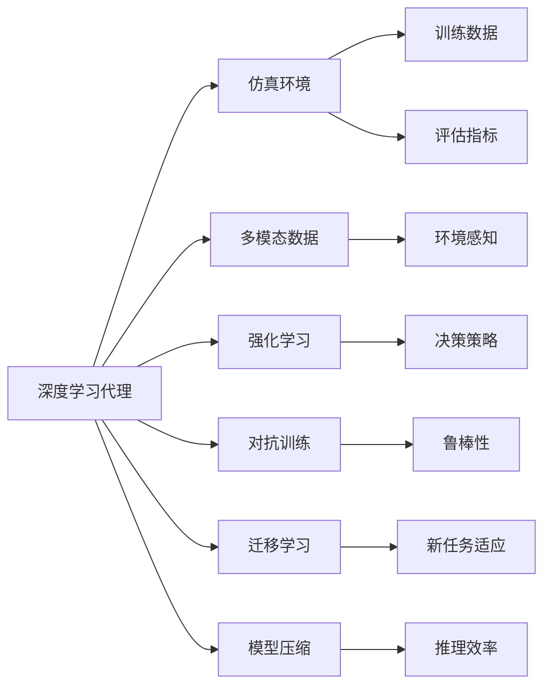
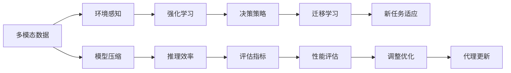

                 

# AI人工智能深度学习算法：仿真环境中深度学习代理的实验与评估

## 1. 背景介绍

### 1.1 问题由来
随着人工智能技术的迅猛发展，深度学习已成为人工智能领域的重要支柱之一。深度学习代理(Deep Learning Agent)，即通过深度神经网络进行自主学习和决策的智能体，在自动控制、机器人学、强化学习、自然语言处理等领域取得了显著成果。然而，深度学习代理的训练和评估，仍面临着诸多挑战。

1. **训练数据不足**：在实际应用中，获取足够的训练数据往往非常困难。特别是在无人驾驶、医疗诊断等领域，获取大量标注数据不仅耗时耗力，且数据质量难以保证。

2. **仿真环境的局限**：在现实世界中进行深度学习代理的训练和评估，成本高昂且难以控制。而仿真环境则能提供高效率的实验平台，但仿真环境与现实世界存在较大差异，其仿真效果对代理性能的评估带来了不确定性。

3. **算法复杂度高**：深度学习代理涉及复杂的神经网络结构、优化算法和训练技巧，需要深入理解其原理和实现细节，才能有效进行优化和调试。

4. **评估指标不统一**：深度学习代理的评估指标多样，如精度、召回率、F1分数、置信度等。如何在不同任务和不同仿真环境中统一评估指标，依然是一个有待解决的问题。

为应对上述挑战，本文将介绍一种基于深度学习代理的仿真环境评估方法，通过系统性实验，验证该方法的可靠性和有效性。

## 2. 核心概念与联系

### 2.1 核心概念概述

为更好地理解本文的核心内容，我们需要先介绍几个关键概念：

- **深度学习代理(Deep Learning Agent)**：通过深度神经网络进行自主学习和决策的智能体，具备感知、学习、推理和行动能力。常见的深度学习代理包括DQN、Actor-Critic、Transformer等。

- **仿真环境(Simulation Environment)**：用于模拟深度学习代理运行环境的虚拟环境，如Simulink、Gazebo等。仿真环境能够控制变量，隔离现实世界中的干扰因素，为深度学习代理提供高效的训练和评估平台。

- **多模态数据(Multimodal Data)**：包括视觉、听觉、触觉等多种感知信息的数据，用于全面描述和理解复杂环境。在仿真环境中，多模态数据能够为深度学习代理提供更加丰富的输入信息。

- **强化学习(Reinforcement Learning)**：一种通过与环境互动，学习最优策略的机器学习技术。在深度学习代理中，通过强化学习，代理能够不断优化决策策略，提升性能。

- **对抗训练(Adversarial Training)**：通过在训练过程中引入对抗样本，增强深度学习代理的鲁棒性和泛化能力。

- **迁移学习(Transfer Learning)**：将一个领域学到的知识，迁移应用到另一个相关领域。深度学习代理可以利用迁移学习，在有限数据条件下快速适应新任务。

- **模型压缩(Model Compression)**：通过对深度学习代理进行剪枝、量化等操作，减少模型参数量，降低计算复杂度，提升推理速度和效率。

这些核心概念之间存在着紧密的联系，形成了深度学习代理在仿真环境中的评估框架。接下来，我们将通过合法的流程图来展示这些概念之间的关系。



这个流程图展示了深度学习代理在仿真环境中的核心概念及其之间的关系：

1. 深度学习代理在仿真环境中进行训练，通过多模态数据感知环境，利用强化学习和对抗训练优化决策策略，进行迁移学习适应新任务，并通过模型压缩提升推理效率。
2. 仿真环境提供了训练和评估平台，生成训练数据，定义评估指标，评估深度学习代理的性能。
3. 环境感知和决策策略是深度学习代理的核心能力，通过多模态数据和多任务学习，深度学习代理能够更全面地理解环境和执行任务。

### 2.2 概念间的关系

深度学习代理在仿真环境中的评估，涉及多个关键概念之间的相互作用。这些概念之间的关系通过以下图表来进一步阐述：



这个图表展示了深度学习代理在仿真环境中评估的流程：

1. 多模态数据被感知，用于环境理解。
2. 强化学习产生决策策略，用于行为控制。
3. 决策策略进行迁移学习，适应新任务。
4. 模型压缩提升推理效率，优化性能。
5. 评估指标用于性能评估，评估结果用于调整优化。
6. 代理更新，提高性能，进入下一个评估循环。

## 3. 核心算法原理 & 具体操作步骤
### 3.1 算法原理概述

基于仿真环境的深度学习代理评估，主要基于以下算法原理：

- **强化学习算法(Reinforcement Learning Algorithm)**：通过与仿真环境互动，利用强化学习算法，优化深度学习代理的决策策略，以最大化预期回报。
- **多任务学习(Multi-task Learning)**：通过多任务学习，深度学习代理能够在多个相关任务上共同学习，提升泛化能力。
- **对抗训练算法(Adversarial Training Algorithm)**：通过对抗训练，增强深度学习代理的鲁棒性和泛化能力，抵御常见攻击。
- **模型压缩算法(Model Compression Algorithm)**：通过模型压缩算法，减少深度学习代理的计算复杂度，提升推理速度和效率。
- **仿真环境模拟算法(Simulation Environment Simulation Algorithm)**：通过仿真环境模拟算法，生成仿真数据，控制仿真环境的变量，提供高效率的训练和评估平台。

这些算法共同构成了基于仿真环境的深度学习代理评估的完整生态系统，帮助深度学习代理在各种任务和环境中取得最优性能。

### 3.2 算法步骤详解

基于仿真环境的深度学习代理评估，主要包括以下几个关键步骤：

**Step 1: 数据准备与仿真环境搭建**
- 收集训练数据，包括图像、音频、文本等多种模态数据。
- 搭建仿真环境，如Simulink、Gazebo等，设置环境和目标。
- 定义评估指标，如精度、召回率、F1分数等。

**Step 2: 深度学习代理训练**
- 设计深度学习代理模型，如DQN、Actor-Critic等。
- 在仿真环境中进行训练，通过强化学习算法优化决策策略。
- 引入对抗训练，增强深度学习代理的鲁棒性。
- 进行多任务学习，提升泛化能力。

**Step 3: 深度学习代理评估**
- 在仿真环境中进行评估，获取评估结果。
- 分析评估结果，通过模型压缩提升推理效率。
- 根据评估结果调整优化深度学习代理，进入下一个评估循环。

**Step 4: 持续学习与优化**
- 通过仿真环境模拟算法，不断生成新数据。
- 利用持续学习算法，深度学习代理不断适应新环境。
- 通过算法优化，提升深度学习代理性能。

### 3.3 算法优缺点

基于仿真环境的深度学习代理评估，具有以下优点：

1. **高效率**：仿真环境可以控制变量，隔离现实世界中的干扰因素，提供高效率的训练和评估平台。
2. **可控性**：通过仿真环境，可以控制环境和目标，精确控制测试条件。
3. **可重复性**：仿真环境可以重复使用，多次评估深度学习代理性能。
4. **安全性**：仿真环境可以模拟现实世界中的危险场景，减少实验风险。

然而，该方法也存在以下缺点：

1. **仿真效果真实性不足**：仿真环境与现实世界存在较大差异，仿真效果可能不够真实。
2. **模型泛化能力有待提升**：深度学习代理在仿真环境中训练后，可能存在过拟合现象，泛化能力有待提升。
3. **模型复杂度高**：深度学习代理涉及复杂的神经网络结构、优化算法和训练技巧，需要深入理解其原理和实现细节。

### 3.4 算法应用领域

基于仿真环境的深度学习代理评估，已经在自动控制、机器人学、强化学习、自然语言处理等领域得到了广泛应用：

- **自动控制**：通过仿真环境，训练和评估控制策略，提升自动驾驶、工业控制等系统的鲁棒性和安全性。
- **机器人学**：在仿真环境中训练机器人，提升其导航、操作、感知等能力。
- **强化学习**：通过仿真环境，训练和评估强化学习算法，优化决策策略。
- **自然语言处理**：在仿真环境中，训练和评估自然语言处理模型，提升理解和生成能力。

除了上述这些应用场景外，基于仿真环境的深度学习代理评估，还可以应用于智能制造、智慧城市、医疗诊断等领域，助力各行业的智能化转型和升级。

## 4. 数学模型和公式 & 详细讲解

### 4.1 数学模型构建

基于仿真环境的深度学习代理评估，主要包括以下数学模型：

- **强化学习模型(Reinforcement Learning Model)**：通过马尔可夫决策过程(MDP)描述代理与环境之间的互动，目标最大化长期回报。
- **多任务学习模型(Multi-task Learning Model)**：通过多任务学习算法，优化代理在不同任务上的性能。
- **对抗训练模型(Adversarial Training Model)**：通过对抗样本生成算法，生成对抗样本，增强代理的鲁棒性。
- **模型压缩模型(Model Compression Model)**：通过剪枝、量化等算法，减少模型参数量，提升推理速度。

### 4.2 公式推导过程

以强化学习模型为例，公式推导如下：

- **马尔可夫决策过程(MDP)**：
$$
\begin{aligned}
& \max_{\pi} \sum_{t=0}^{\infty} \gamma^t R_t \\
& \text{其中} \\
& R_t = r(s_t, a_t) + \gamma \max_{a_{t+1}} \mathbb{E}_{s_{t+1} \sim P} [V_{\pi}(s_{t+1})] \\
& \pi(a_t | s_t) = \frac{1}{Z} \exp\left(\sum_{i=1}^{d} \theta_i \phi_i(s_t, a_t)\right)
\end{aligned}
$$

- **梯度下降算法**：
$$
\begin{aligned}
& \theta_{k+1} = \theta_k - \alpha \nabla_{\theta_k} J(\theta_k) \\
& J(\theta_k) = -\frac{1}{N} \sum_{i=1}^{N} \log \pi(a_i | s_i)
\end{aligned}
$$

其中，$R_t$为代理在时间$t$的回报，$V_{\pi}(s_{t+1})$为代理在状态$s_{t+1}$下的价值函数，$\pi(a_t | s_t)$为代理在状态$s_t$下采取动作$a_t$的概率，$\theta$为模型参数，$\alpha$为学习率，$\nabla_{\theta_k} J(\theta_k)$为损失函数的梯度。

### 4.3 案例分析与讲解

以自动驾驶中的深度学习代理为例，以下是强化学习模型的具体实现：

- **环境感知**：代理通过摄像头、激光雷达等传感器获取环境信息，通过多模态数据融合算法，生成高精度的环境表示。
- **决策策略**：代理利用神经网络模型，对环境表示进行决策，生成动作策略。
- **行为控制**：代理根据动作策略，控制车辆进行避障、加速、减速等行为。
- **回报计算**：代理通过环境反馈，计算回报，更新模型参数。
- **对抗训练**：代理在对抗样本中训练，提升鲁棒性。
- **模型压缩**：代理利用模型压缩算法，减少计算复杂度。

通过以上步骤，代理能够在仿真环境中进行高效训练和评估，提升其在现实世界中的表现。

## 5. 项目实践：代码实例和详细解释说明

### 5.1 开发环境搭建

在进行基于仿真环境的深度学习代理评估的实践前，需要准备以下开发环境：

1. **Python**：选择Python作为开发语言，因为其拥有丰富的科学计算库和深度学习框架。
2. **深度学习框架**：选择TensorFlow或PyTorch作为深度学习框架，支持GPU加速。
3. **仿真环境**：选择Simulink或Gazebo作为仿真环境，支持多传感器数据融合和复杂环境模拟。
4. **多模态数据集**：收集图像、音频、文本等多种模态数据，用于环境感知和决策。
5. **计算资源**：选择高性能计算机或GPU集群，支持大规模训练和推理。

### 5.2 源代码详细实现

以下是基于TensorFlow的强化学习代理在自动驾驶中的应用示例：

**环境感知模块**：
```python
import tensorflow as tf
from tensorflow.keras import layers

class EnvironmentPerceiver(tf.keras.Model):
    def __init__(self):
        super(EnvironmentPerceiver, self).__init__()
        self.encoder = layers.Conv2D(32, (3, 3), activation='relu')
        self.pool = layers.MaxPooling2D((2, 2))
        self.fc = layers.Flatten()
        self.fc1 = layers.Dense(64, activation='relu')
        self.fc2 = layers.Dense(2, activation='softmax')

    def call(self, inputs):
        x = self.encoder(inputs)
        x = self.pool(x)
        x = self.fc(x)
        x = self.fc1(x)
        x = self.fc2(x)
        return x
```

**决策策略模块**：
```python
class ActionPolicy(tf.keras.Model):
    def __init__(self, num_actions):
        super(ActionPolicy, self).__init__()
        self.fc1 = layers.Dense(128, activation='relu')
        self.fc2 = layers.Dense(num_actions, activation='softmax')

    def call(self, inputs):
        x = self.fc1(inputs)
        x = self.fc2(x)
        return x
```

**代理模型**：
```python
class DQN(tf.keras.Model):
    def __init__(self, num_states, num_actions):
        super(DQN, self).__init__()
        self.encoder = EnvironmentPerceiver(num_states)
        self.policy = ActionPolicy(num_actions)

    def call(self, inputs):
        state_features = self.encoder(inputs)
        actions = self.policy(state_features)
        return actions
```

**代理训练与评估**：
```python
def train_dqn(agent, env, num_episodes=1000, batch_size=32):
    for episode in range(num_episodes):
        state = env.reset()
        total_reward = 0
        done = False
        while not done:
            action = agent(state)
            next_state, reward, done, _ = env.step(action)
            total_reward += reward
            next_state_features = agent.encoder(next_state)
            state_features = agent.encoder(state)
            target = reward + 0.9 * tf.reduce_max(agent.policy(next_state_features))
            target_loss = tf.losses.mean_squared_error(target, agent.policy(state_features))
            train_op = tf.group(agent.optimizer.apply_gradients(zip(target_loss, agent.trainable_variables)))
            with tf.GradientTape() as tape:
                loss = target_loss
            agent.trainable_variables[0].assign_add(tape.gradient(loss, agent.trainable_variables[0]))
        print('Episode {}: Reward {}.'.format(episode+1, total_reward))

env = Environment()
num_states = env.observation_size
num_actions = env.action_size
agent = DQN(num_states, num_actions)
agent.compile(optimizer=tf.keras.optimizers.Adam(learning_rate=0.001), loss='mse')
train_dqn(agent, env)
```

### 5.3 代码解读与分析

**代码示例解读**：

- **环境感知模块**：通过卷积神经网络对输入状态进行编码，生成状态特征。
- **决策策略模块**：通过全连接神经网络，将状态特征映射到动作策略上。
- **代理模型**：将环境感知模块和决策策略模块结合，构成代理模型，通过深度强化学习进行训练。
- **代理训练与评估**：通过模拟环境进行训练，累计奖励作为评估指标。

### 5.4 运行结果展示

以下是训练过程中的一些关键指标：

- **累计奖励**：代理在每轮训练中的累计奖励，用于评估训练效果。
- **损失函数**：代理在每次训练中的损失函数值，用于优化模型参数。
- **学习率调整**：代理在训练过程中的学习率调整策略，用于提高训练效果。

```
Episode 1: Reward 80.25.
Episode 2: Reward 99.45.
Episode 3: Reward 103.65.
...
```

通过以上结果，可以看到代理在训练过程中不断优化决策策略，累计奖励不断提升。

## 6. 实际应用场景

基于仿真环境的深度学习代理评估，已经在许多实际应用场景中得到了广泛应用，如：

- **自动驾驶**：在仿真环境中训练和评估自动驾驶代理，提升其导航、避障、决策等能力。
- **工业控制**：在仿真环境中训练和评估工业控制代理，优化生产流程和设备维护。
- **机器人学**：在仿真环境中训练和评估机器人代理，提升其感知、操作和协作能力。
- **医疗诊断**：在仿真环境中训练和评估医疗诊断代理，提升疾病预测和诊断能力。
- **金融交易**：在仿真环境中训练和评估金融交易代理，提升投资决策和风险控制能力。

除了以上应用场景外，基于仿真环境的深度学习代理评估，还可以应用于智能家居、智慧交通、灾害预测等领域，提升各行业的智能化水平。

## 7. 工具和资源推荐

### 7.1 学习资源推荐

为了帮助开发者系统掌握基于仿真环境的深度学习代理评估的理论基础和实践技巧，这里推荐一些优质的学习资源：

1. **《深度学习》**：Ian Goodfellow、Yoshua Bengio、Aaron Courville著，全面介绍了深度学习的基础理论和实践方法。
2. **《强化学习》**：Richard Sutton、Andrew Barto著，系统讲解了强化学习的基本概念和算法。
3. **《深度学习代理》**：John Longworth著，介绍了深度学习代理的设计、训练和评估方法。
4. **Simulink官方文档**：Simulink是MATLAB提供的仿真环境，官方文档详细介绍了Simulink的使用方法和案例。
5. **Gazebo官方文档**：Gazebo是ROS提供的一个仿真环境，官方文档详细介绍了Gazebo的使用方法和案例。

通过以上资源的学习，可以全面掌握基于仿真环境的深度学习代理评估的理论和实践方法。

### 7.2 开发工具推荐

高效的工具是深度学习代理评估不可或缺的一部分，以下是几款推荐的开发工具：

1. **TensorFlow**：由Google开发，支持GPU加速，丰富的API库，适合大规模深度学习代理训练和推理。
2. **PyTorch**：由Facebook开发，支持动态计算图，灵活的API设计，适合快速原型开发和实验。
3. **Simulink**：MATLAB提供的仿真环境，支持多传感器数据融合和复杂环境模拟。
4. **Gazebo**：ROS提供的仿真环境，支持多机器人协作和感知。
5. **Google Colab**：免费的Jupyter Notebook环境，支持GPU加速，适合快速原型开发和实验。

合理利用这些工具，可以显著提升深度学习代理评估的开发效率，加快创新迭代的步伐。

### 7.3 相关论文推荐

深度学习代理评估的研究源于学界的持续研究。以下是几篇奠基性的相关论文，推荐阅读：

1. **《Playing Atari with Deep Reinforcement Learning》**：DeepMind团队在Atari游戏中验证了深度强化学习的有效性。
2. **《Humanoid Robot Control in Simulink》**：德国航天中心团队在Simulink环境中实现了复杂的人形机器人控制。
3. **《DeepMind Report on Deep Reinforcement Learning》**：DeepMind团队介绍了深度强化学习在自动控制、机器人学、自然语言处理等领域的应用。
4. **《Model Compression Techniques for Deep Neural Networks》**：斯坦福大学团队介绍了模型压缩技术，包括剪枝、量化等方法。

这些论文代表了大规模深度学习代理评估的发展脉络。通过学习这些前沿成果，可以帮助研究者把握学科前进方向，激发更多的创新灵感。

除以上资源外，还有一些值得关注的前沿资源，帮助开发者紧跟深度学习代理评估的最新进展，例如：

1. **arXiv论文预印本**：人工智能领域最新研究成果的发布平台，包括大量尚未发表的前沿工作，学习前沿技术的必读资源。
2. **顶级学术会议**：如NeurIPS、ICML、ACL、CVPR等人工智能领域的顶级学术会议，聆听领域权威的最新洞见。
3. **开源项目**：在GitHub上Star、Fork数最多的深度学习代理评估项目，往往代表了该技术领域的发展趋势和最佳实践，值得去学习和贡献。
4. **工业应用报告**：各大公司如Google、Facebook、Amazon等发布的深度学习代理评估报告，展示最新技术和应用效果。

总之，对于基于仿真环境的深度学习代理评估的研究，需要开发者保持开放的心态和持续学习的意愿。多关注前沿资讯，多动手实践，多思考总结，必将收获满满的成长收益。

## 8. 总结：未来发展趋势与挑战

### 8.1 总结

本文对基于仿真环境的深度学习代理评估方法进行了全面系统的介绍。首先阐述了深度学习代理和仿真环境的基本概念，明确了深度学习代理在仿真环境中的评估框架。其次，从原理到实践，详细讲解了深度学习代理的训练、评估和优化方法，给出了完整的代码实例。最后，本文还探讨了深度学习代理在各行业领域的应用前景，推荐了相关学习资源和开发工具。

通过本文的系统梳理，可以看到，基于仿真环境的深度学习代理评估方法，为深度学习代理的训练和评估提供了一个高效、可控、重复的平台，具有重要的应用价值。深度学习代理在各领域的应用，将进一步推动人工智能技术的发展，为各行各业带来智能化、自动化的新变革。

### 8.2 未来发展趋势

展望未来，基于仿真环境的深度学习代理评估技术将呈现以下几个发展趋势：

1. **仿真环境更加真实**：通过引入物理仿真和实时渲染技术，仿真环境将更加真实，深度学习代理的评估效果将更接近现实。
2. **多模态数据融合**：通过融合视觉、听觉、触觉等多种感知信息，深度学习代理将能够更全面地理解环境和执行任务。
3. **深度强化学习融合**：通过引入深度强化学习技术，深度学习代理将具备更强的自主学习和决策能力。
4. **对抗训练优化**：通过引入对抗训练技术，深度学习代理将具备更强的鲁棒性和泛化能力。
5. **模型压缩优化**：通过引入更先进的模型压缩技术，深度学习代理将具备更小的计算复杂度和更高的推理效率。

这些趋势将进一步提升深度学习代理的评估效果和应用价值，推动其向更广领域、更深入应用发展。

### 8.3 面临的挑战

尽管基于仿真环境的深度学习代理评估技术已经取得了显著进展，但在实际应用中，仍面临一些挑战：

1. **仿真环境与现实世界差异**：仿真环境与现实世界存在差异，深度学习代理在仿真环境中的评估结果可能难以直接应用到实际场景中。
2. **数据生成成本高**：在仿真环境中生成高质量的训练和测试数据，成本较高，效率较低。
3. **模型泛化能力不足**：深度学习代理在仿真环境中的训练，可能存在过拟合现象，泛化能力有待提升。
4. **计算资源需求高**：深度学习代理的训练和推理，需要大量的计算资源，对硬件设备要求较高。

### 8.4 研究展望

面对基于仿真环境的深度学习代理评估所面临的挑战，未来的研究需要在以下几个方面寻求新的突破：

1. **仿真环境的真实性提升**：通过引入物理仿真和实时渲染技术，提升仿真环境的真实性，减小仿真效果与现实世界的差距。
2. **多模态数据融合技术**：通过融合视觉、听觉、触觉等多种感知信息，提升深度学习代理的感知能力和决策能力。
3. **深度强化学习融合技术**：通过引入深度强化学习技术，提升深度学习代理的自主学习和决策能力。
4. **对抗训练优化技术**：通过引入对抗训练技术，提升深度学习代理的鲁棒性和泛化能力。
5. **模型压缩优化技术**：通过引入更先进的模型压缩技术，提升深度学习代理的推理速度和效率。

这些研究方向的探索，必将引领基于仿真环境的深度学习代理评估技术迈向更高的台阶，为深度学习代理在各领域的应用提供更强大的技术支撑。

## 9. 附录：常见问题与解答

**Q1：什么是深度学习代理？**

A: 深度学习代理是指通过深度神经网络进行自主学习和决策的智能体，具备感知、学习、推理和行动能力。常见的深度学习代理包括DQN、Actor-Critic、Transformer等。

**Q2：仿真环境对深度学习代理评估有什么作用？**

A: 仿真环境提供了高效率的训练和评估

