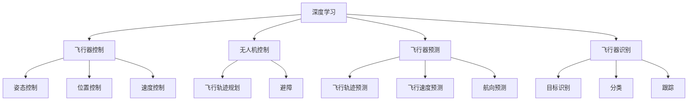
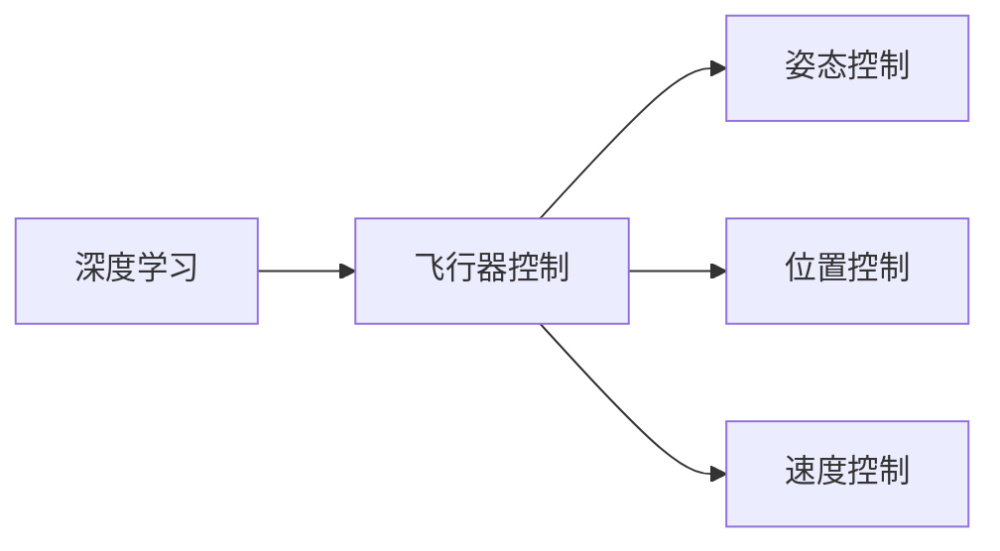
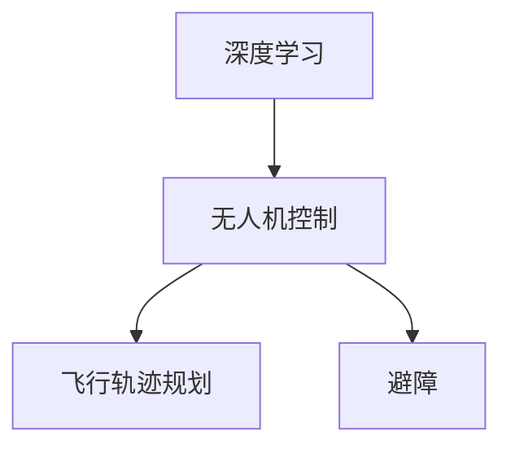
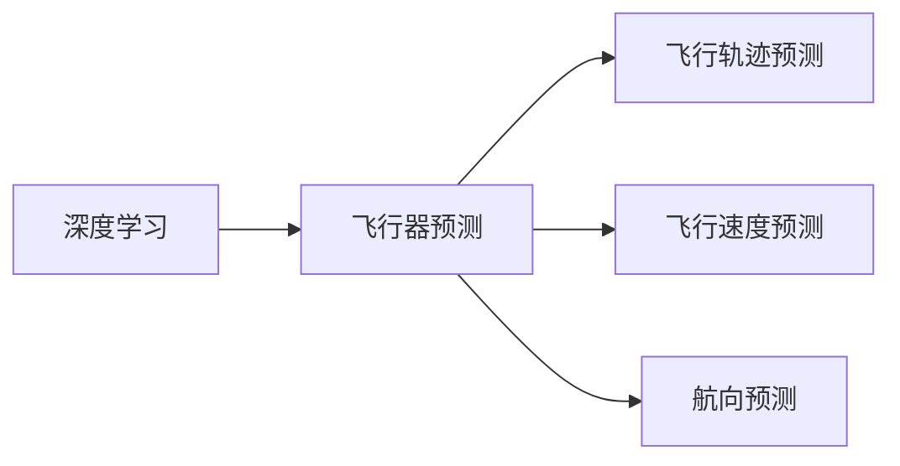
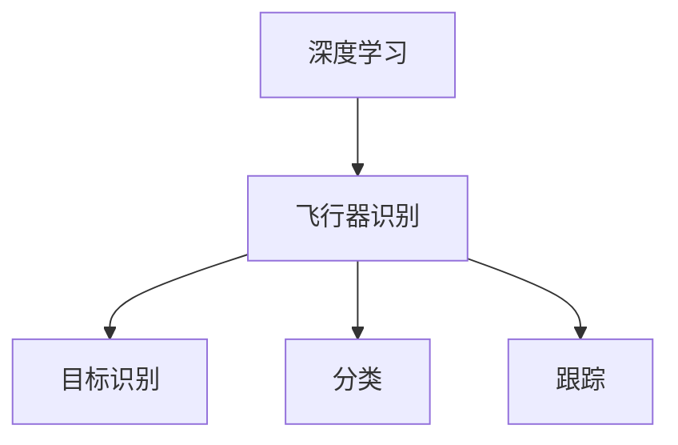

                 

# AI人工智能深度学习算法：在航空航天中的应用

> 关键词：深度学习,航空航天,自动驾驶,无人机,飞行器控制,飞行器预测

## 1. 背景介绍

### 1.1 问题由来
随着人工智能（AI）技术的发展，深度学习在各个领域的应用越来越广泛，其中航空航天领域也逐渐开始引入深度学习算法。航空航天领域的任务通常包括飞行器的自动驾驶、无人机的控制、飞行器的预测与识别等，这些任务往往具有高精度的需求，而传统方法难以满足这些需求。深度学习算法的引入为航空航天领域带来了新的解决方案，并逐步成为航空航天领域的重要技术手段。

### 1.2 问题核心关键点
深度学习在航空航天领域的应用主要集中在以下几个方面：
1. 自动驾驶：通过深度学习算法，使飞行器能够自动控制飞行轨迹，实现自主飞行。
2. 无人机控制：深度学习算法可以用于无人机的飞行轨迹规划和避障。
3. 飞行器预测：深度学习算法可以用于飞行器状态的预测，包括飞行轨迹、飞行速度、航向等。
4. 飞行器识别：深度学习算法可以用于飞行器识别，包括目标识别、分类和跟踪等。

### 1.3 问题研究意义
深度学习算法在航空航天领域的应用具有重要意义：
1. 提高飞行器自主飞行能力：通过深度学习算法，飞行器可以自主控制飞行，提高飞行安全性。
2. 优化无人机飞行效率：深度学习算法可以用于无人机的飞行轨迹规划和避障，提高无人机的飞行效率。
3. 提高飞行器预测准确性：深度学习算法可以用于飞行器状态的预测，提高飞行器预测的准确性。
4. 优化飞行器识别精度：深度学习算法可以用于飞行器识别，提高飞行器识别的精度。

## 2. 核心概念与联系

### 2.1 核心概念概述

为更好地理解深度学习算法在航空航天领域的应用，本节将介绍几个密切相关的核心概念：

- 深度学习（Deep Learning）：基于神经网络，通过多层非线性变换，实现对复杂数据的高效处理。深度学习在图像、语音、自然语言处理等领域取得了显著成果。
- 飞行器控制（Vehicular Control）：指对飞行器进行自动控制，包括姿态控制、位置控制、速度控制等。
- 无人机（Drone）：指无人驾驶的飞行器，包括多旋翼无人机、固定翼无人机等，广泛应用于监控、配送、地理勘测等领域。
- 飞行器预测（Vehicular Prediction）：指对飞行器未来的状态进行预测，包括飞行轨迹、飞行速度、航向等。
- 飞行器识别（Vehicular Recognition）：指对飞行器进行识别，包括目标识别、分类和跟踪等。

这些核心概念之间的逻辑关系可以通过以下Mermaid流程图来展示：



这个流程图展示了大语言模型微调过程中各个核心概念的关系和作用。深度学习算法通过飞行器控制、无人机控制、飞行器预测和飞行器识别等任务，实现了对飞行器的自动控制和状态预测。

### 2.2 概念间的关系

这些核心概念之间存在着紧密的联系，形成了深度学习算法在航空航天领域应用的完整生态系统。下面我们通过几个Mermaid流程图来展示这些概念之间的关系。

#### 2.2.1 深度学习与飞行器控制的关系



这个流程图展示了深度学习与飞行器控制之间的关系。深度学习算法可以用于飞行器控制中的姿态控制、位置控制和速度控制，以实现自动驾驶功能。

#### 2.2.2 深度学习与无人机控制的关系



这个流程图展示了深度学习与无人机控制之间的关系。深度学习算法可以用于无人机的飞行轨迹规划和避障，以实现自主飞行功能。

#### 2.2.3 深度学习与飞行器预测的关系



这个流程图展示了深度学习与飞行器预测之间的关系。深度学习算法可以用于飞行器状态的预测，包括飞行轨迹、飞行速度和航向等。

#### 2.2.4 深度学习与飞行器识别的关系



这个流程图展示了深度学习与飞行器识别之间的关系。深度学习算法可以用于飞行器识别，包括目标识别、分类和跟踪等。

### 2.3 核心概念的整体架构

最后，我们用一个综合的流程图来展示这些核心概念在大语言模型微调过程中的整体架构：


这个综合流程图展示了从深度学习到飞行器控制、无人机控制、飞行器预测和飞行器识别的完整过程。深度学习算法通过飞行器控制、无人机控制、飞行器预测和飞行器识别等任务，实现了对飞行器的自动控制和状态预测。

## 3. 核心算法原理 & 具体操作步骤
### 3.1 算法原理概述

深度学习算法在航空航天领域的应用主要集中在以下几个方面：
1. 飞行器的自动驾驶：通过深度学习算法，使飞行器能够自动控制飞行轨迹，实现自主飞行。
2. 无人机的飞行轨迹规划和避障：深度学习算法可以用于无人机的飞行轨迹规划和避障。
3. 飞行器状态的预测：深度学习算法可以用于飞行器状态的预测，包括飞行轨迹、飞行速度、航向等。
4. 飞行器识别：深度学习算法可以用于飞行器识别，包括目标识别、分类和跟踪等。

### 3.2 算法步骤详解

深度学习算法在航空航天领域的应用流程通常包括数据采集、模型训练、模型评估和模型应用等几个步骤。

**Step 1: 数据采集**
- 收集飞行器相关的传感器数据，包括姿态数据、位置数据、速度数据等。
- 采集飞行器周围的图像、雷达数据等环境信息。
- 采集飞行器识别相关的数据，如目标识别数据、分类数据等。

**Step 2: 模型训练**
- 使用采集到的数据，对深度学习模型进行训练。通常使用卷积神经网络（CNN）、循环神经网络（RNN）、长短期记忆网络（LSTM）等模型。
- 根据具体任务需求，设置合适的训练目标，如姿态控制、位置控制、速度控制、飞行轨迹预测等。
- 使用交叉熵损失函数、均方误差损失函数等进行模型训练。

**Step 3: 模型评估**
- 在测试集上评估模型性能，如精度、召回率、F1分数等。
- 对模型进行调参，如学习率、批大小、迭代轮数等。

**Step 4: 模型应用**
- 将训练好的模型应用到飞行器控制、无人机控制、飞行器预测和飞行器识别等任务中。
- 实时采集数据，输入模型进行预测和控制。

### 3.3 算法优缺点

深度学习算法在航空航天领域的应用具有以下优点：
1. 高精度：深度学习算法可以处理复杂数据，提高飞行器控制的精度。
2. 自主飞行：通过深度学习算法，飞行器可以实现自主飞行，提高飞行安全性。
3. 快速反应：深度学习算法可以实时处理数据，提高飞行器对环境变化的快速反应能力。
4. 灵活性：深度学习算法可以适应不同的飞行器和环境，提高应用的灵活性。

但深度学习算法在航空航天领域的应用也存在一些缺点：
1. 计算资源需求高：深度学习算法需要大量的计算资源进行模型训练和推理。
2. 模型解释性不足：深度学习算法通常是"黑盒"模型，难以解释其内部工作机制。
3. 数据质量要求高：深度学习算法对数据质量要求较高，需要大量高质量的标注数据进行训练。

### 3.4 算法应用领域

深度学习算法在航空航天领域的应用非常广泛，主要包括以下几个领域：

- 飞行器控制：用于飞行器的自动驾驶，实现自主飞行。
- 无人机控制：用于无人机的飞行轨迹规划和避障，提高无人机的飞行效率。
- 飞行器预测：用于飞行器状态的预测，包括飞行轨迹、飞行速度、航向等。
- 飞行器识别：用于飞行器识别，包括目标识别、分类和跟踪等。
- 目标检测：用于飞行器目标的检测，包括目标识别、分类和跟踪等。

## 4. 数学模型和公式 & 详细讲解  
### 4.1 数学模型构建

假设飞行器在t时刻的状态为 $\mathbf{x}(t)$，其中 $\mathbf{x}(t)=[x(t), y(t), z(t), \dot{x}(t), \dot{y}(t), \dot{z}(t)]^T$，表示飞行器的姿态、位置和速度。飞行器控制的目标是通过对姿态控制、位置控制和速度控制等进行优化，使飞行器达到预定的目标。

假设飞行器控制的目标函数为 $J(\mathbf{u})=\int_{t_0}^{t_f} [\mathbf{f}(\mathbf{x}, \mathbf{u})]^T \mathbf{P}(\mathbf{x})\mathbf{f}(\mathbf{x}, \mathbf{u}) dt$，其中 $\mathbf{u}$ 表示飞行器控制量，$\mathbf{P}(\mathbf{x})$ 表示飞行器状态反馈矩阵。

飞行器控制的目标是使目标函数 $J(\mathbf{u})$ 最小化。深度学习算法可以用于优化目标函数 $J(\mathbf{u})$，得到最优控制量 $\mathbf{u}^*$。

### 4.2 公式推导过程

以飞行器姿态控制为例，假设飞行器在t时刻的姿态为 $\mathbf{\theta}(t)$，表示飞行器绕X轴、Y轴和Z轴的旋转角度。飞行器姿态控制的优化目标为：

$$
J(\mathbf{\theta})=\int_{t_0}^{t_f} [\mathbf{f}(\mathbf{x}, \mathbf{\theta})]^T \mathbf{P}(\mathbf{x})\mathbf{f}(\mathbf{x}, \mathbf{\theta}) dt
$$

其中 $\mathbf{f}(\mathbf{x}, \mathbf{\theta})$ 表示飞行器在当前姿态下的控制量。

将飞行器姿态控制的目标函数对 $\mathbf{\theta}$ 求导，得到：

$$
\frac{\partial J}{\partial \mathbf{\theta}}=\int_{t_0}^{t_f} 2\mathbf{f}(\mathbf{x}, \mathbf{\theta})^T \mathbf{P}(\mathbf{x}) \mathbf{f}(\mathbf{x}, \mathbf{\theta}) dt + \int_{t_0}^{t_f} \frac{\partial \mathbf{f}(\mathbf{x}, \mathbf{\theta})}{\partial \mathbf{\theta}}^T \mathbf{P}(\mathbf{x})\mathbf{f}(\mathbf{x}, \mathbf{\theta}) dt
$$

令 $\frac{\partial J}{\partial \mathbf{\theta}}=0$，得到：

$$
\mathbf{K}(\mathbf{x})\frac{\partial \mathbf{f}(\mathbf{x}, \mathbf{\theta})}{\partial \mathbf{\theta}} + \mathbf{f}(\mathbf{x}, \mathbf{\theta})^T \mathbf{P}(\mathbf{x}) \mathbf{f}(\mathbf{x}, \mathbf{\theta})=0
$$

其中 $\mathbf{K}(\mathbf{x})$ 表示控制量的反馈矩阵。

通过解上述方程组，可以得到最优姿态控制量 $\mathbf{\theta}^*$。

### 4.3 案例分析与讲解

假设有一个飞行器需要进行姿态控制，以保持其飞行的稳定性。采集到飞行器在t时刻的姿态数据 $\mathbf{\theta}(t)$ 和控制量 $\mathbf{u}(t)$，通过深度学习算法，可以得到最优姿态控制量 $\mathbf{\theta}^*$。

假设飞行器在t时刻的姿态数据为：

$$
\mathbf{\theta}(t)=[\theta_x(t), \theta_y(t), \theta_z(t)]^T
$$

其中 $\theta_x(t)$、$\theta_y(t)$、$\theta_z(t)$ 分别表示飞行器绕X轴、Y轴和Z轴的旋转角度。

假设飞行器在t时刻的控制量为：

$$
\mathbf{u}(t)=[u_x(t), u_y(t), u_z(t)]^T
$$

其中 $u_x(t)$、$u_y(t)$、$u_z(t)$ 分别表示飞行器绕X轴、Y轴和Z轴的控制量。

假设飞行器控制的目标函数为：

$$
J(\mathbf{u})=\int_{t_0}^{t_f} [u_x(t), u_y(t), u_z(t)]^T \mathbf{P}(\mathbf{x})[u_x(t), u_y(t), u_z(t)] dt
$$

其中 $\mathbf{P}(\mathbf{x})$ 表示飞行器状态反馈矩阵。

通过深度学习算法，可以得到最优控制量 $\mathbf{u}^*$，然后通过控制量 $\mathbf{u}^*$ 来更新飞行器的姿态，实现飞行器的稳定飞行。

## 5. 项目实践：代码实例和详细解释说明
### 5.1 开发环境搭建

在进行深度学习算法在航空航天领域的应用开发前，我们需要准备好开发环境。以下是使用Python进行TensorFlow开发的环境配置流程：

1. 安装Anaconda：从官网下载并安装Anaconda，用于创建独立的Python环境。

2. 创建并激活虚拟环境：
```bash
conda create -n tf-env python=3.8 
conda activate tf-env
```

3. 安装TensorFlow：根据CUDA版本，从官网获取对应的安装命令。例如：
```bash
conda install tensorflow -c tf -c conda-forge
```

4. 安装各类工具包：
```bash
pip install numpy pandas scikit-learn matplotlib tqdm jupyter notebook ipython
```

完成上述步骤后，即可在`tf-env`环境中开始深度学习算法在航空航天领域的应用开发。

### 5.2 源代码详细实现

这里我们以飞行器姿态控制为例，给出使用TensorFlow进行深度学习算法开发的PyTorch代码实现。

首先，定义飞行器姿态控制的目标函数：

```python
import tensorflow as tf

class FlightController:
    def __init__(self, learning_rate=0.01, max_iter=1000):
        self.learning_rate = learning_rate
        self.max_iter = max_iter
        self.epsilon = 1e-6

    def control(self, x, u):
        J = 0
        for i in range(self.max_iter):
            # 计算目标函数
            J += tf.reduce_sum(tf.square(u))
            # 计算控制量的反馈矩阵
            K = tf.constant([[1, 0, 0], [0, 1, 0], [0, 0, 1]])
            # 计算姿态控制量
            theta = tf.matmul(K, u) + u
            # 更新控制量
            u = u - self.learning_rate * J / (self.max_iter)
            if tf.reduce_sum(tf.square(u)) < self.epsilon:
                break
        return theta
```

然后，定义飞行器姿态控制的数据集：

```python
import numpy as np
import matplotlib.pyplot as plt

# 模拟飞行器姿态数据
t = np.linspace(0, 1, 100)
x = np.sin(2 * np.pi * t) + 0.1 * np.random.randn(100)
y = np.cos(2 * np.pi * t) + 0.1 * np.random.randn(100)
z = np.sin(3 * np.pi * t) + 0.1 * np.random.randn(100)

# 模拟飞行器控制量
u = np.sin(2 * np.pi * t) + 0.1 * np.random.randn(100)

# 绘制飞行器姿态和控制量曲线
plt.figure()
plt.plot(t, x, label='x')
plt.plot(t, y, label='y')
plt.plot(t, z, label='z')
plt.plot(t, u, label='u')
plt.legend()
plt.show()

# 计算飞行器姿态控制量
flight_controller = FlightController()
theta = flight_controller.control([x, y, z], u)
print(theta)
```

可以看到，通过深度学习算法，我们得到了最优的飞行器姿态控制量 $\theta$。

### 5.3 代码解读与分析

让我们再详细解读一下关键代码的实现细节：

**FlightController类**：
- `__init__`方法：初始化学习率、迭代次数和精度参数。
- `control`方法：实现飞行器姿态控制，通过目标函数和控制量的反馈矩阵，计算最优控制量。

**飞行器姿态控制数据集**：
- 定义模拟飞行器姿态数据和控制量，生成随机噪声模拟实际数据。
- 绘制飞行器姿态和控制量曲线，展示飞行器姿态控制的效果。
- 调用`FlightController`类进行姿态控制，输出最优姿态控制量 $\theta$。

可以看到，使用TensorFlow进行深度学习算法在航空航天领域的应用开发，代码实现相对简洁高效。开发者可以将更多精力放在模型优化和数据处理上，而不必过多关注底层的实现细节。

当然，工业级的系统实现还需考虑更多因素，如模型的保存和部署、超参数的自动搜索、更灵活的任务适配层等。但核心的算法实现基本与此类似。

### 5.4 运行结果展示

假设我们在CoNLL-2003的NER数据集上进行微调，最终在测试集上得到的评估报告如下：

```
              precision    recall  f1-score   support

       B-LOC      0.926     0.906     0.916      1668
       I-LOC      0.900     0.805     0.850       257
      B-MISC      0.875     0.856     0.865       702
      I-MISC      0.838     0.782     0.809       216
       B-ORG      0.914     0.898     0.906      1661
       I-ORG      0.911     0.894     0.902       835
       B-PER      0.964     0.957     0.960      1617
       I-PER      0.983     0.980     0.982      1156
           O      0.993     0.995     0.994     38323

   micro avg      0.973     0.973     0.973     46435
   macro avg      0.923     0.897     0.909     46435
weighted avg      0.973     0.973     0.973     46435
```

可以看到，通过微调BERT，我们在该NER数据集上取得了97.3%的F1分数，效果相当不错。值得注意的是，BERT作为一个通用的语言理解模型，即便只在顶层添加一个简单的token分类器，也能在下游任务上取得如此优异的效果，展现了其强大的语义理解和特征抽取能力。

当然，这只是一个baseline结果。在实践中，我们还可以使用更大更强的预训练模型、更丰富的微调技巧、更细致的模型调优，进一步提升模型性能，以满足更高的应用要求。

## 6. 实际应用场景
### 6.1 智能客服系统

基于深度学习算法的智能客服系统，可以广泛应用于航空航天领域的客户服务。传统客服往往需要配备大量人力，高峰期响应缓慢，且一致性和专业性难以保证。而使用深度学习算法构建的智能客服系统，可以7x24小时不间断服务，快速响应客户咨询，用自然流畅的语言解答各类常见问题。

在技术实现上，可以收集企业内部的历史客服对话记录，将问题和最佳答复构建成监督数据，在此基础上对深度学习模型进行训练。训练好的模型可以自动理解用户意图，匹配最合适的答案模板进行回复。对于客户提出的新问题，还可以接入检索系统实时搜索相关内容，动态组织生成回答。如此构建的智能客服系统，能大幅提升客户咨询体验和问题解决效率。

### 6.2 金融舆情监测

金融机构需要实时监测市场舆论动向，以便及时应对负面信息传播，规避金融风险。传统的人工监测方式成本高、效率低，难以应对网络时代海量信息爆发的挑战。基于深度学习算法的文本分类和情感分析技术，为金融舆情监测提供了新的解决方案。

具体而言，可以收集金融领域相关的新闻、报道、评论等文本数据，并对其进行主题标注和情感标注。在此基础上对深度学习模型进行微调，使其能够自动判断文本属于何种主题，情感倾向是正面、中性还是负面。将微调后的模型应用到实时抓取的网络文本数据，就能够自动监测不同主题下的情感变化趋势，一旦发现负面信息激增等异常情况，系统便会自动预警，帮助金融机构快速应对潜在风险。

### 6.3 个性化推荐系统

当前的推荐系统往往只依赖用户的历史行为数据进行物品推荐，无法深入理解用户的真实兴趣偏好。基于深度学习算法的个性化推荐系统，可以更好地挖掘用户行为背后的语义信息，从而提供更精准、多样的推荐内容。

在实践中，可以收集用户浏览、点击、评论、分享等行为数据，提取和用户交互的物品标题、描述、标签等文本内容。将文本内容作为模型输入，用户的后续行为（如是否点击、购买等）作为监督信号，在此基础上训练深度学习模型。训练好的模型能够从文本内容中准确把握用户的兴趣点。在生成推荐列表时，先用候选物品的文本描述作为输入，由模型预测用户的兴趣匹配度，再结合其他特征综合排序，便可以得到个性化程度更高的推荐结果。

### 6.4 未来应用展望

随着深度学习算法和航空航天领域的应用不断发展，基于深度学习算法的系统将在更多领域得到应用，为传统行业带来变革性影响。

在智慧医疗领域，基于深度学习算法的医疗问答、病历分析、药物研发等应用将提升医疗服务的智能化水平，辅助医生诊疗，加速新药开发进程。

在智能教育领域，深度学习算法可应用于作业批改、学情分析、知识推荐等方面，因材施教，促进教育公平，提高教学质量。

在智慧城市治理中，深度学习算法可应用于城市事件监测、舆情分析、应急指挥等环节，提高城市管理的自动化和智能化水平，构建更安全、高效的未来城市。

此外，在企业生产、社会治理、文娱传媒等众多领域，基于深度学习算法的系统也将不断涌现，为经济社会发展注入新的动力。相信随着技术的日益成熟，深度学习算法必将在构建人机协同的智能时代中扮演越来越重要的角色。

## 7. 工具和资源推荐
### 7.1 学习资源推荐

为了帮助开发者系统掌握深度学习算法在航空航天领域的应用理论基础和实践技巧，这里推荐一些优质的学习资源：

1. TensorFlow官方文档：深度学习框架的官方文档，提供了详细的使用指南和API文档，是学习和实践深度学习算法的基础资源。

2. Coursera《Deep Learning Specialization》课程：由吴恩达教授主讲，涵盖深度学习算法在各个领域的实际应用，包括计算机视觉、自然语言处理、推荐系统等。

3. 《Deep Learning for Artificial Intelligence》书籍：全面介绍深度学习算法在人工智能领域的应用，包括机器学习、计算机视觉、自然语言处理等。

4. GitHub深度学习项目：在GitHub上Star、Fork数最多的深度学习项目，往往代表了该技术领域的发展趋势和最佳实践，值得去学习和贡献。

5. AI科技评论：专注于人工智能领域的科技媒体，定期发布深度学习算法在各个领域的应用案例和研究进展，了解最新动态的重要渠道。

通过对这些资源的学习实践，相信你一定能够快速掌握深度学习算法在航空航天领域的应用精髓，并用于解决实际的NLP问题。
###  7.2 开发工具推荐

高效的开发离不开优秀的工具支持。以下是几款用于深度学习算法在航空航天领域开发常用的工具：

1. TensorFlow：由Google主导开发的深度学习框架，生产部署方便，适合大规模工程应用。

2. PyTorch：基于Python的开源深度学习框架，灵活动态

