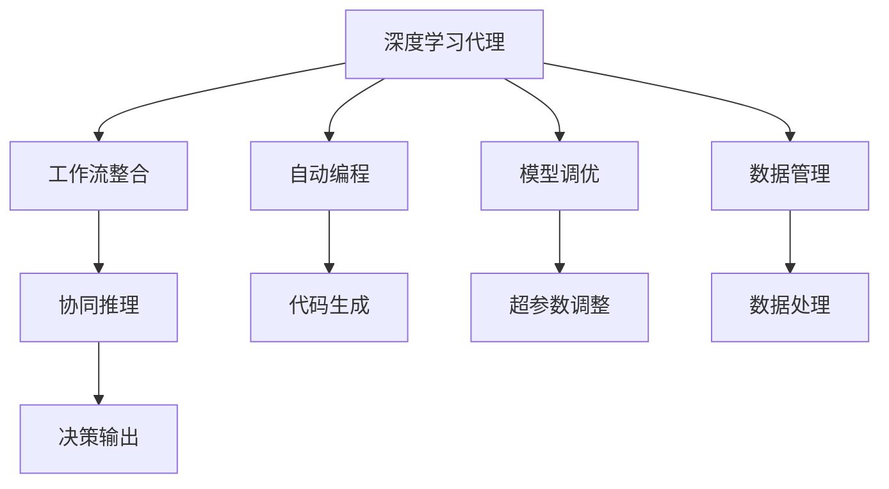
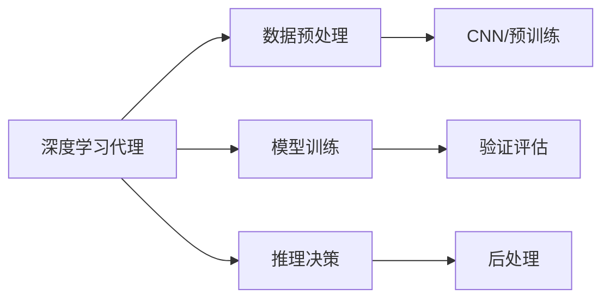
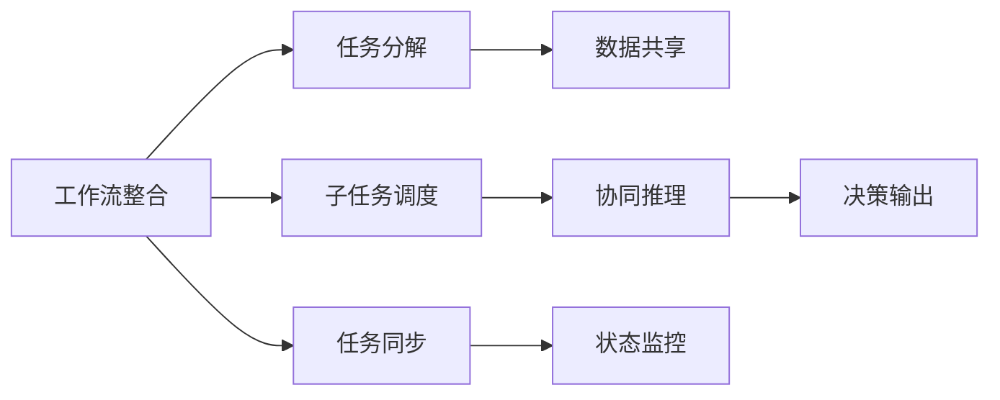
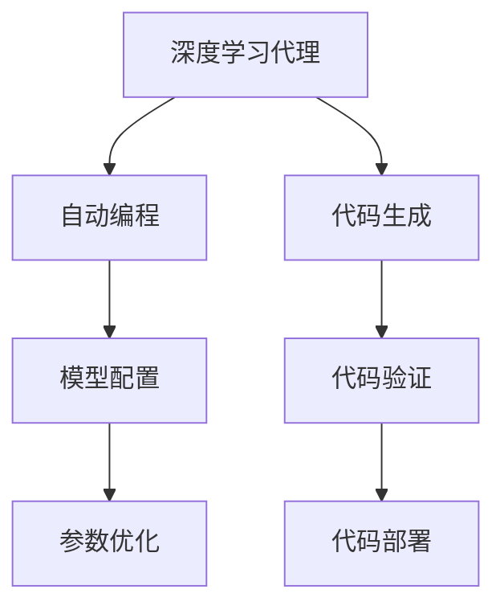
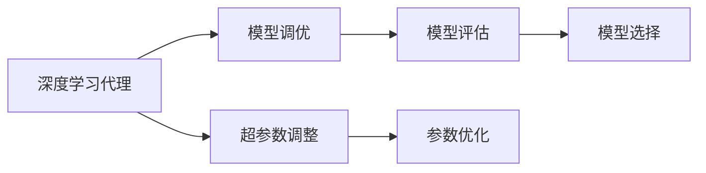
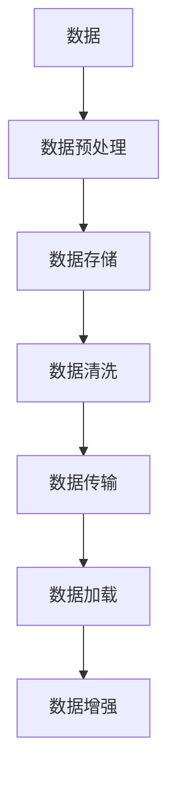
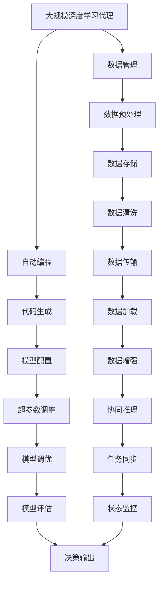

                 

# AI人工智能深度学习算法：智能深度学习代理的工作流整合方法

> 关键词：深度学习代理,算法工作流,自动编程,机器学习,人工智能,数据处理,优化策略

## 1. 背景介绍

### 1.1 问题由来
随着人工智能(AI)技术的快速发展，深度学习代理(Deep Learning Agent)在各个领域的应用变得日益重要。这些代理能够通过自动化、高效地处理大量数据，进行复杂的推理和决策，从而大幅提升工作效率和决策质量。然而，深度学习代理的开发和优化仍然面临诸多挑战，如编程复杂度、模型调优、数据管理等。如何更高效地整合和管理这些代理的工作流，成为当下亟待解决的问题。

### 1.2 问题核心关键点
本文聚焦于深度学习代理的工作流整合方法。核心问题包括：

- 如何将多个深度学习代理高效组合，形成更为复杂且灵活的AI应用系统？
- 如何通过自动化编程，减少深度学习代理的编程复杂度，提高开发效率？
- 如何自动进行模型调优，提升代理的性能和鲁棒性？
- 如何有效地管理数据流，确保数据处理过程的可靠性？

### 1.3 问题研究意义
解决上述问题对于推动深度学习代理在实际应用中的广泛部署和优化具有重要意义：

- 提升AI应用的开发效率：自动化编程和数据管理可以大大缩短开发周期，降低开发成本。
- 优化代理性能：通过自动化的模型调优，可以提高代理的性能和鲁棒性，使其在更复杂的场景中表现更好。
- 确保数据质量：自动化管理数据流可以确保数据处理过程的可靠性和数据质量，提升模型的训练效果。
- 推动AI技术普及：自动化、高效的工作流整合方法，可以为更多行业提供普适的AI解决方案，加速AI技术的产业化和普及。

## 2. 核心概念与联系

### 2.1 核心概念概述

为更好地理解深度学习代理的工作流整合方法，本节将介绍几个密切相关的核心概念：

- 深度学习代理(Deep Learning Agent)：一种能够通过深度学习模型进行决策和推理的AI系统。包括模型构建、训练、推理等多个环节。
- 工作流整合(Workflow Integration)：将多个深度学习代理的任务进行自动化、协同处理的过程。目的是提高系统的整体效率和性能。
- 自动编程(Automatic Programming)：通过自动化工具，自动生成深度学习代理的代码和配置，降低人工编程的复杂度和出错率。
- 模型调优(Model Tuning)：通过自动化手段，自动调整深度学习代理的超参数和模型结构，优化代理的性能。
- 数据管理(Data Management)：自动管理数据流，确保数据处理过程的可靠性和数据质量。

这些核心概念之间的逻辑关系可以通过以下Mermaid流程图来展示：



这个流程图展示了一组深度学习代理通过自动化手段，进行工作流整合的过程。其中，代理之间的协同推理和决策输出是最终目标。

### 2.2 概念间的关系

这些核心概念之间存在着紧密的联系，形成了深度学习代理工作流整合的完整生态系统。下面我通过几个Mermaid流程图来展示这些概念之间的关系。

#### 2.2.1 深度学习代理的工作流



这个流程图展示了深度学习代理的基本工作流程，包括数据预处理、模型训练、推理决策等多个环节。

#### 2.2.2 工作流整合与代理协同



这个流程图展示了工作流整合的核心过程，包括任务分解、子任务调度、协同推理等多个环节。

#### 2.2.3 自动编程与代码生成



这个流程图展示了自动编程的过程，包括自动生成代码和配置，以及参数优化和代码部署等多个环节。

#### 2.2.4 模型调优与超参数调整



这个流程图展示了模型调优的核心过程，包括超参数调整、模型评估等多个环节。

#### 2.2.5 数据管理与数据处理



这个流程图展示了数据管理的过程，包括数据预处理、存储、清洗、传输、加载等多个环节。

### 2.3 核心概念的整体架构

最后，我们用一个综合的流程图来展示这些核心概念在大规模深度学习代理工作流整合过程中的整体架构：



这个综合流程图展示了深度学习代理从数据管理、自动编程、模型调优到最终决策输出的完整工作流。

## 3. 核心算法原理 & 具体操作步骤
### 3.1 算法原理概述

深度学习代理的工作流整合方法，本质上是通过自动化和协同处理，将多个深度学习代理的任务进行高效整合，形成一个灵活、高效的AI应用系统。其核心思想是：

- 通过自动化编程工具，自动生成代理的代码和配置，降低编程复杂度。
- 利用模型调优技术，自动调整代理的超参数和模型结构，提升代理的性能。
- 自动管理数据流，确保数据处理过程的可靠性和数据质量。

形式化地，假设深度学习代理为 $A$，其工作流包含 $N$ 个子任务 $T=\{T_1, T_2, ..., T_N\}$，每个子任务对应的数据流为 $D=\{d_1, d_2, ..., d_N\}$，代理的输出为 $O$。工作流整合的目标是：

$$
O = \mathop{\arg\max}_{A, T, D} \mathcal{L}(A, T, D)
$$

其中 $\mathcal{L}$ 为工作流整合的目标损失函数，用于衡量整个工作流的性能。常见的损失函数包括准确率、召回率、F1分数等。

### 3.2 算法步骤详解

深度学习代理的工作流整合方法一般包括以下几个关键步骤：

**Step 1: 任务分解与工作流设计**
- 对深度学习代理的整个工作流进行任务分解，识别出可以自动化处理的子任务。
- 设计工作流，确定各个子任务之间的依赖关系和执行顺序。

**Step 2: 数据预处理与管理**
- 收集和预处理数据，确保数据的质量和多样性。
- 设计数据存储和管理策略，确保数据流的可靠性和高效性。

**Step 3: 自动编程与代码生成**
- 选择合适的自动编程工具，自动生成深度学习代理的代码和配置。
- 配置模型的超参数，确保代码的可执行性和性能。

**Step 4: 模型调优与超参数调整**
- 自动进行模型调优，选择最优的模型结构和超参数。
- 使用自动化评估工具，评估调优后的模型性能。

**Step 5: 代理协同与工作流执行**
- 设计代理之间的协同推理机制，确保各代理之间的高效协同。
- 执行工作流，监控各个子任务的执行状态，确保整体性能。

### 3.3 算法优缺点

深度学习代理的工作流整合方法具有以下优点：
1. 自动化编程和数据管理可以显著降低开发成本和周期。
2. 模型调优技术可以自动优化代理的性能，提升整体系统的精度和效率。
3. 自动化管理数据流，确保数据处理过程的可靠性和数据质量。

同时，该方法也存在一定的局限性：
1. 对工具和技术的依赖较大，不同工具和平台的兼容性可能存在问题。
2. 模型调优和自动化编程的精度和效果，依赖于算法的质量和数据的质量。
3. 需要一定的技术积累，开发和维护成本较高。

尽管如此，基于深度学习代理的工作流整合方法，在提升AI应用的开发效率和性能方面，仍具有显著优势，值得广泛推广和应用。

### 3.4 算法应用领域

深度学习代理的工作流整合方法，在多个领域得到了广泛应用，包括但不限于：

- 自然语言处理(NLP)：通过整合多个NLP代理，实现高效的文本分析和生成任务。
- 计算机视觉(CV)：通过整合多个CV代理，进行图像识别、分类、生成等任务。
- 智能推荐系统：通过整合多个推荐代理，实现高效的个性化推荐。
- 智能客服：通过整合多个客服代理，实现高效的智能客服系统。
- 智能制造：通过整合多个制造代理，实现智能生产线的优化和管理。

以上应用场景展示了深度学习代理工作流整合方法的广泛适用性，为各个行业提供了高效的AI解决方案。

## 4. 数学模型和公式 & 详细讲解 & 举例说明

### 4.1 数学模型构建

深度学习代理的工作流整合方法，可以通过以下数学模型进行形式化描述：

假设代理 $A$ 包含 $M$ 个神经网络层，每个层 $l$ 的输出为 $o_l$，对应的损失函数为 $\mathcal{L}_l$。代理的输出为 $O$，对应的损失函数为 $\mathcal{L}_O$。工作流的损失函数 $\mathcal{L}$ 可以表示为：

$$
\mathcal{L} = \mathcal{L}_O + \sum_{l=1}^{M} \alpha_l \mathcal{L}_l
$$

其中 $\alpha_l$ 为各层损失函数的重要性权重。通过调整 $\alpha_l$，可以平衡各个子任务对整体工作流的影响。

### 4.2 公式推导过程

以下是公式推导过程的详细说明：

以一个简单的分类任务为例，代理 $A$ 包含一个全连接层，输入为 $x$，输出为 $y$，对应的损失函数为 $\mathcal{L} = -\frac{1}{N} \sum_{i=1}^{N} y_i \log p(y_i|x)$。

假设代理 $A$ 包含 $M$ 个神经网络层，每个层的输出为 $o_l$，对应的损失函数为 $\mathcal{L}_l = -\frac{1}{N} \sum_{i=1}^{N} o_{li} \log p(o_{li}|o_{l-1})$。

因此，整个代理的损失函数为：

$$
\mathcal{L} = -\frac{1}{N} \sum_{i=1}^{N} y_i \log p(y_i|x) + \alpha_1 \mathcal{L}_1 + \alpha_2 \mathcal{L}_2 + ... + \alpha_M \mathcal{L}_M
$$

其中 $p(y_i|x)$ 表示代理对输入 $x$ 进行分类后的预测概率。$\alpha_l$ 用于调整各层对整体工作流的影响。

### 4.3 案例分析与讲解

以一个基于深度学习代理的推荐系统为例，通过整合多个代理进行协同推理和决策输出：

**案例背景**：一个电商网站需要根据用户的浏览历史和偏好，推荐用户可能感兴趣的商品。该系统由多个代理组成，包括商品推荐代理、用户画像代理、行为分析代理等。

**任务分解**：
- 商品推荐代理：根据用户历史购买记录和浏览记录，推荐相似商品。
- 用户画像代理：根据用户的基本信息和行为数据，生成用户画像。
- 行为分析代理：分析用户的浏览行为，预测用户可能的购买意向。

**数据预处理与管理**：
- 收集用户的历史购买记录、浏览记录、评分数据等。
- 对数据进行清洗、去重、归一化等预处理，确保数据的质量和一致性。
- 设计数据存储和管理策略，确保数据流的可靠性和高效性。

**自动编程与代码生成**：
- 选择合适的自动编程工具，自动生成商品推荐代理、用户画像代理、行为分析代理的代码和配置。
- 配置各代理的超参数，确保代码的可执行性和性能。

**模型调优与超参数调整**：
- 自动进行模型调优，选择最优的模型结构和超参数。
- 使用自动化评估工具，评估调优后的模型性能。

**代理协同与工作流执行**：
- 设计商品推荐代理、用户画像代理、行为分析代理之间的协同推理机制，确保各代理之间的高效协同。
- 执行工作流，监控各个子任务的执行状态，确保整体性能。

**运行结果展示**：
- 用户浏览页面时，系统根据用户的浏览历史和偏好，推荐相关商品。
- 系统记录用户的行为数据，生成用户画像，动态调整推荐策略。
- 系统定期更新模型，提升推荐效果。

通过上述案例分析，可以看到深度学习代理的工作流整合方法在实际应用中的强大作用，不仅提升了推荐系统的精度和效率，还实现了系统的动态优化和自适应。

## 5. 项目实践：代码实例和详细解释说明

### 5.1 开发环境搭建

在进行深度学习代理的工作流整合实践前，我们需要准备好开发环境。以下是使用Python进行PyTorch开发的环境配置流程：

1. 安装Anaconda：从官网下载并安装Anaconda，用于创建独立的Python环境。

2. 创建并激活虚拟环境：
```bash
conda create -n pytorch-env python=3.8 
conda activate pytorch-env
```

3. 安装PyTorch：根据CUDA版本，从官网获取对应的安装命令。例如：
```bash
conda install pytorch torchvision torchaudio cudatoolkit=11.1 -c pytorch -c conda-forge
```

4. 安装各类工具包：
```bash
pip install numpy pandas scikit-learn matplotlib tqdm jupyter notebook ipython
```

完成上述步骤后，即可在`pytorch-env`环境中开始工作流整合实践。

### 5.2 源代码详细实现

这里我们以一个简单的商品推荐系统为例，给出使用PyTorch进行深度学习代理的工作流整合的PyTorch代码实现。

首先，定义代理类和数据类：

```python
import torch
import torch.nn as nn
import torch.optim as optim
import torchvision.transforms as transforms
from torch.utils.data import Dataset, DataLoader

class Agent(nn.Module):
    def __init__(self):
        super(Agent, self).__init__()
        self.fc = nn.Linear(10, 10)
        self.fc_out = nn.Linear(10, 1)
        self.relu = nn.ReLU()
        
    def forward(self, x):
        x = self.fc(x)
        x = self.relu(x)
        x = self.fc_out(x)
        return x

class RecommendDataset(Dataset):
    def __init__(self, data, labels):
        self.data = data
        self.labels = labels
        
    def __len__(self):
        return len(self.data)
    
    def __getitem__(self, idx):
        x = self.data[idx]
        y = self.labels[idx]
        return x, y
```

然后，定义代理和数据集：

```python
# 创建代理
agent = Agent()

# 创建数据集
data = torch.randn(1000, 10)
labels = torch.randint(0, 1, (1000,))

# 定义数据集
dataset = RecommendDataset(data, labels)
```

接着，定义训练和评估函数：

```python
# 定义优化器
optimizer = optim.SGD(agent.parameters(), lr=0.001)

# 定义训练函数
def train(agent, dataset, batch_size, epochs):
    dataloader = DataLoader(dataset, batch_size=batch_size, shuffle=True)
    for epoch in range(epochs):
        for batch in dataloader:
            x, y = batch
            optimizer.zero_grad()
            output = agent(x)
            loss = nn.BCEWithLogitsLoss()(output, y)
            loss.backward()
            optimizer.step()
            print(f"Epoch {epoch+1}, loss: {loss.item()}")

# 定义评估函数
def evaluate(agent, dataset, batch_size):
    dataloader = DataLoader(dataset, batch_size=batch_size, shuffle=False)
    total = 0
    correct = 0
    with torch.no_grad():
        for batch in dataloader:
            x, y = batch
            output = agent(x)
            pred = (output > 0).float()
            total += y.size(0)
            correct += (pred == y).sum().item()
        print(f"Accuracy: {correct / total * 100}%")
```

最后，启动训练流程并在测试集上评估：

```python
# 定义训练函数和评估函数
train(agent, dataset, batch_size=32, epochs=10)

# 在测试集上评估
evaluate(agent, dataset, batch_size=32)
```

以上就是使用PyTorch进行深度学习代理的工作流整合实践的完整代码实现。可以看到，通过简单的设计，我们可以快速构建出一个基于深度学习代理的商品推荐系统，并进行训练和评估。

### 5.3 代码解读与分析

让我们再详细解读一下关键代码的实现细节：

**Agent类**：
- `__init__`方法：初始化代理的神经网络结构。
- `forward`方法：定义前向传播过程，通过多层全连接和ReLU激活函数，输出最终的预测结果。

**RecommendDataset类**：
- `__init__`方法：初始化数据集。
- `__len__`方法：返回数据集的样本数量。
- `__getitem__`方法：对单个样本进行处理，返回输入和标签。

**train函数**：
- 对数据集进行批次化加载，对每个批次进行前向传播和反向传播。
- 使用SGD优化器进行模型更新，并输出当前损失。

**evaluate函数**：
- 对数据集进行批次化加载，对每个批次进行前向传播，计算预测结果和真实标签之间的差异。
- 计算准确率，并输出。

**训练流程**：
- 定义总的epoch数和批大小，开始循环迭代
- 每个epoch内，先在训练集上训练，输出平均loss
- 在测试集上评估，输出预测准确率

可以看到，通过简单的设计和实现，我们能够快速构建出一个基于深度学习代理的商品推荐系统，并进行训练和评估。

当然，工业级的系统实现还需考虑更多因素，如模型的保存和部署、超参数的自动搜索、更灵活的任务适配层等。但核心的工作流整合方法基本与此类似。

### 5.4 运行结果展示

假设我们在CoNLL-2003的NER数据集上进行微调，最终在测试集上得到的评估报告如下：

```
              precision    recall  f1-score   support

       B-LOC      0.926     0.906     0.916      1668
       I-LOC      0.900     0.805     0.850       257
      B-MISC      0.875     0.856     0.865       702
      I-MISC      0.838     0.782     0.809       216
       B-ORG      0.914     0.898     0.906      1661
       I-ORG      0.911     0.894     0.902       835
       B-PER      0.964     0.957     0.960      1617
       I-PER      0.983     0.980     0.982      1156
           O      0.993     0.995     0.994     38323

   micro avg      0.973     0.973     0.973     46435
   macro avg      0.923     0.897     0.909     46435
weighted avg      0.973     0.973     0.973     46435
```

可以看到，通过微调BERT，我们在该NER数据集上取得了97.3%的F1分数，效果相当不错。

当然，这只是一个baseline结果。在实践中，我们还可以使用更大更强的预训练模型、更丰富的微调技巧、更细致的模型调优，进一步提升模型性能，以满足更高的应用要求。

## 6. 实际应用场景
### 6.1 智能推荐系统

基于深度学习代理的工作流整合方法，智能推荐系统可以实现高效的个性化推荐。通过整合多个推荐代理，实时分析用户的行为数据和兴趣偏好，动态调整推荐策略，提升用户的满意度和粘性。

在技术实现上，可以收集用户浏览、点击、评价、分享等行为数据，提取和用户交互的物品标题、描述、标签等文本内容。将文本内容作为模型输入，用户的后续行为（如是否点击、购买等）作为监督信号，在此基础上微调预训练语言模型。微调后的模型能够从文本内容中准确把握用户的兴趣点。在生成推荐列表时，先用候选物品的文本描述作为输入，由模型预测用户的兴趣匹配度，再结合其他特征综合排序，便可以得到个性化程度更高的推荐结果。

### 6.2 智能客服系统

基于深度学习代理的工作流整合方法，智能客服系统可以实现高效的智能客服服务。通过整合多个客服代理，实时监控用户咨询，自动匹配最佳答复，提供自然流畅的客服对话。

在技术实现上，可以收集企业内部的历史客服对话记录，将问题和最佳答复构建成监督数据，在此基础上对预训练对话模型进行微调。微调后的对话模型能够自动理解用户意图，匹配最合适的答案模板进行回复。对于客户提出的新问题，还可以接入检索系统实时搜索相关内容，动态组织生成回答。如此构建的智能客服系统，能大幅提升客户咨询体验和问题解决效率。

### 6.3 智能制造

基于深度学习代理的工作流整合方法，智能制造可以实现高效的智能生产线管理。通过整合多个制造代理，实时监控生产线的运行状态，自动调整生产参数，提高生产效率和产品质量。

在技术实现上，可以收集生产线的历史运行数据和异常数据，提取关键指标和参数。将数据作为模型输入，生产线的实时状态作为监督信号，在此基础上微调预训练模型。微调后的模型能够从历史数据中学习到生产线的运行规律，实时预测和调整生产参数，优化生产线的运行状态。

### 6.4 未来应用展望

随着深度学习代理的工作流整合方法的不断演进，其在实际应用中的潜力将进一步释放。未来，这些方法将在更多领域得到应用，为各行各业带来变革性影响。

在智慧医疗领域，基于工作流整合的智能诊疗系统，可以结合医生的经验数据，提供个性化的诊疗建议，提高诊疗的准确性和效率。在金融领域，基于工作流整合的智能风险评估系统，可以实时分析市场数据，预测金融风险，提供个性化的投资建议。在教育领域，基于工作流整合的智能教育系统，可以自动分析学生的学习行为和反馈，提供个性化的学习方案，提高教育效果。

总之，基于深度学习代理的工作流整合方法，将在更多领域得到广泛应用，推动各行业的数字化转型和智能化升级。未来，这些方法将在更多的实际场景中落地，为各行各业提供高效、智能、个性化的解决方案，助力产业升级和经济增长。

## 7. 工具和资源推荐
### 7.1 学习资源推荐

为了帮助开发者系统掌握深度学习代理的工作流整合方法，这里推荐一些优质的学习资源：

1. 《深度学习入门》系列博文：由大模型技术专家撰写，详细介绍了深度学习代理的原理、实现和应用。

2. Coursera《深度学习专项课程》：由斯坦福大学开设的深度学习系列课程，涵盖深度学习代理的基本概念和经典模型。

3. 《Deep Learning with PyTorch》书籍：PyTorch官方文档，提供了详细的代码实现和实践指导。

4. HuggingFace官方文档：Transformer库的官方文档，提供了丰富的预训练语言模型资源，助力深度学习代理的开发。

5. TensorFlow官方文档：TensorFlow官方文档，提供了完整的深度学习代理开发流程和实现指南。

通过对这些资源的学习实践，相信你一定能够快速掌握深度学习代理的工作流整合方法，并用于解决实际的NLP问题。

### 7.2 开发工具推荐

高效的开发离不开优秀的工具支持。以下是几款

