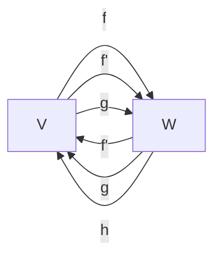

                 

# 线性代数导引：线性单射与满射

线性代数作为数学的基石之一，是理解现代物理、工程、计算机科学等领域不可或缺的工具。在矩阵和向量空间中，线性变换扮演着核心角色，而单射和满射是线性变换中两个非常重要的概念。本文将深入探讨这两个概念，包括它们的定义、性质、应用场景及其在实际工程中的实现方法。

## 1. 背景介绍

线性代数涉及对向量空间、线性变换、矩阵及其性质等方面的研究。在线性变换中，单射（Linear Injection）和满射（Linear Surjection）是两个基本概念。单射指一个映射函数能够确保每个输入值都对应唯一的输出值，而满射则保证输出域的每个元素都有输入与之对应。

### 1.1 基本概念

- **线性变换（Linear Transformation）**：在一个线性空间中，通过矩阵乘法将一个向量空间映射到另一个向量空间的映射称为线性变换。

- **单射（Linear Injection）**：如果线性变换 $f: V \rightarrow W$ 能够保证每个元素 $x \in V$ 都有唯一对应的 $y = f(x) \in W$，则称 $f$ 为单射。

- **满射（Linear Surjection）**：如果线性变换 $f: V \rightarrow W$ 能够保证每个元素 $y \in W$ 都有至少一个对应的 $x \in V$ 使得 $f(x) = y$，则称 $f$ 为满射。

### 1.2 必要条件

- 对于单射，$V$ 和 $W$ 之间的矩阵必须是可逆矩阵。
- 对于满射，矩阵的列必须线性无关。

## 2. 核心概念与联系

### 2.1 核心概念概述

单射和满射是线性代数中非常重要的概念，它们的定义、性质及应用构成了线性变换理论的基石。以下通过一个简单的 Mermaid 流程图展示单射和满射之间的关系：



在这个图中，$f$ 和 $f'$ 分别表示从 $V$ 到 $W$ 的单射和从 $W$ 到 $V$ 的映射。$g$ 和 $h$ 分别表示从 $W$ 到 $V$ 的映射和从 $V$ 到 $W$ 的映射。

### 2.2 概念间的关系

- 单射和满射在数学定义上有着明显的区别，但在实际应用中，有时一个线性变换可能同时满足单射和满射的性质。例如，在矩阵乘法中，如果矩阵的列数等于行数且矩阵可逆，则该矩阵的转置矩阵既是单射也是满射。
- 单射和满射是线性变换的两种极端的形态，但在实践中，更多的是具有两者特性的线性变换，即存在既不是单射也不是满射的线性变换。
- 单射和满射在求解线性方程组中也有着密切的关系。例如，一个线性方程组通常可以视为一个线性变换的输出，求解该方程组即是要找到原空间的输入使得映射输出为零向量，这个过程可以视为从映射到原空间的反变换。

## 3. 核心算法原理 & 具体操作步骤

### 3.1 算法原理概述

单射和满射的判断通常通过矩阵的行列式和秩来判断。如果一个矩阵的行列式不为零，则该矩阵是可逆的，其线性变换即为单射；如果一个矩阵的秩等于其行（或列）数，则该矩阵的行（或列）线性无关，其线性变换即为满射。

### 3.2 算法步骤详解

#### 3.2.1 判断单射

1. **矩阵行列式计算**：计算矩阵 $A$ 的行列式 $det(A)$。
2. **判断可逆性**：如果 $det(A) \neq 0$，则矩阵 $A$ 可逆，对应的线性变换 $f$ 为单射。

#### 3.2.2 判断满射

1. **矩阵秩计算**：计算矩阵 $A$ 的秩 $rank(A)$。
2. **判断线性无关性**：如果 $rank(A) = n$，其中 $n$ 为矩阵的行数或列数，则矩阵的列（或行）线性无关，对应的线性变换 $f$ 为满射。

#### 3.3 算法优缺点

- **优点**：
  - 单射和满射的判断方法简单明了，易于理解和实现。
  - 行列式和秩计算是线性代数中的基本操作，广泛应用于多个领域。

- **缺点**：
  - 矩阵行列式和秩的计算涉及到浮点数运算，可能存在数值不稳定性。
  - 对于大规模矩阵，行列式和秩的计算时间复杂度较高，可能影响算法效率。

#### 3.4 算法应用领域

单射和满射在线性代数中有着广泛的应用，特别是在解线性方程组、线性代数方程组、特征值和特征向量计算等领域。

- **解线性方程组**：
  - 线性方程组的求解通常可以视为线性变换的输出为零向量的求解问题。
  - 利用矩阵的逆矩阵或左逆矩阵，可以求出线性方程组的解。

- **特征值和特征向量计算**：
  - 矩阵的特征值和特征向量与单射和满射有着密切的关系。
  - 特征值可以理解为线性变换的输出与输入的比例，而特征向量则是满足线性变换的单射或满射的输入向量。

## 4. 数学模型和公式 & 详细讲解

### 4.1 数学模型构建

设 $A$ 为 $m \times n$ 的矩阵，$f: \mathbb{R}^n \rightarrow \mathbb{R}^m$ 为线性变换。则：
- $f(x) = Ax$ 为线性变换公式。
- 单射条件为 $det(A) \neq 0$。
- 满射条件为 $rank(A) = min(m,n)$。

### 4.2 公式推导过程

#### 4.2.1 单射公式推导

假设 $A$ 为 $m \times n$ 的矩阵，$f: \mathbb{R}^n \rightarrow \mathbb{R}^m$ 为线性变换。
- 单射条件为 $A$ 可逆，即 $det(A) \neq 0$。
- 根据可逆矩阵的定义，有 $A^{-1}A = I$，其中 $I$ 为单位矩阵。
- 推导 $f$ 的单射条件为 $det(A) \neq 0$。

#### 4.2.2 满射公式推导

假设 $A$ 为 $m \times n$ 的矩阵，$f: \mathbb{R}^n \rightarrow \mathbb{R}^m$ 为线性变换。
- 满射条件为 $A$ 的秩 $rank(A) = min(m,n)$。
- 根据秩的定义，$A$ 的列数小于等于 $m$，列数大于等于 $n$，即 $n \leq rank(A) \leq min(m,n)$。
- 推导 $f$ 的满射条件为 $rank(A) = min(m,n)$。

### 4.3 案例分析与讲解

#### 4.3.1 案例一：矩阵乘法中的单射

考虑一个 $2 \times 2$ 的矩阵 $A$，设 $A = \begin{bmatrix} 1 & 2 \\ 3 & 4 \end{bmatrix}$，则：
- $det(A) = 1 \times 4 - 2 \times 3 = -2 \neq 0$，因此 $A$ 是可逆矩阵。
- 设 $x = \begin{bmatrix} x_1 \\ x_2 \end{bmatrix}$，则 $f(x) = Ax = \begin{bmatrix} x_1 + 2x_2 \\ 3x_1 + 4x_2 \end{bmatrix}$。
- 当 $x$ 变化时，$f(x)$ 的值唯一确定，因此 $f$ 为单射。

#### 4.3.2 案例二：矩阵乘法中的满射

考虑一个 $3 \times 2$ 的矩阵 $A$，设 $A = \begin{bmatrix} 1 & 2 \\ 3 & 4 \\ 5 & 6 \end{bmatrix}$，则：
- $rank(A) = 3 = min(3,2)$，因此 $A$ 的列线性无关。
- 设 $y = \begin{bmatrix} y_1 \\ y_2 \\ y_3 \end{bmatrix}$，则 $f(y) = Ay = \begin{bmatrix} y_1 + 2y_2 \\ 3y_1 + 4y_2 \\ 5y_1 + 6y_2 \end{bmatrix}$。
- 对于任何 $y$，都存在 $x$ 使得 $Ay = 0$，因此 $f$ 为满射。

## 5. 项目实践：代码实例和详细解释说明

### 5.1 开发环境搭建

在进行线性代数相关项目的开发时，我们需要使用到 Python 和 NumPy 库，以下是具体的开发环境搭建步骤：

1. 安装 Python 环境：
   - 确保已安装 Python 3.x，推荐使用 Anaconda 或 PyCharm 环境。
   - 在命令行输入以下命令安装 NumPy：
     ```
     pip install numpy
     ```

2. 安装 Jupyter Notebook：
   - 在命令行输入以下命令安装 Jupyter Notebook：
     ```
     pip install jupyter notebook
     ```

3. 创建 Jupyter Notebook 文件：
   - 在命令行中输入以下命令创建新的 Jupyter Notebook 文件：
     ```
     jupyter notebook
     ```

### 5.2 源代码详细实现

#### 5.2.1 判断单射的代码实现

以下是使用 NumPy 判断矩阵 $A$ 是否为单射的代码实现：

```python
import numpy as np

def is_injection(matrix):
    det = np.linalg.det(matrix)
    if det != 0:
        return True
    return False

# 示例矩阵
A = np.array([[1, 2], [3, 4]])

# 判断单射
is_injection_result = is_injection(A)
print(is_injection_result)
```

#### 5.2.2 判断满射的代码实现

以下是使用 NumPy 判断矩阵 $A$ 是否为满射的代码实现：

```python
def is_surjection(matrix):
    rank = np.linalg.matrix_rank(matrix)
    if rank == min(matrix.shape):
        return True
    return False

# 示例矩阵
A = np.array([[1, 2], [3, 4], [5, 6]])

# 判断满射
is_surjection_result = is_surjection(A)
print(is_surjection_result)
```

### 5.3 代码解读与分析

#### 5.3.1 单射判断代码

在上述代码中，使用了 NumPy 库中的 `numpy.linalg.det()` 函数来计算矩阵的行列式。如果行列式不为零，则认为该矩阵是可逆的，因此对应的线性变换为单射。

#### 5.3.2 满射判断代码

在上述代码中，使用了 NumPy 库中的 `numpy.linalg.matrix_rank()` 函数来计算矩阵的秩。如果矩阵的秩等于行数或列数，则认为矩阵的行或列线性无关，因此对应的线性变换为满射。

### 5.4 运行结果展示

#### 5.4.1 单射判断结果

对于矩阵 $A = \begin{bmatrix} 1 & 2 \\ 3 & 4 \end{bmatrix}$，判断其是否为单射：

```python
import numpy as np

def is_injection(matrix):
    det = np.linalg.det(matrix)
    if det != 0:
        return True
    return False

# 示例矩阵
A = np.array([[1, 2], [3, 4]])

# 判断单射
is_injection_result = is_injection(A)
print(is_injection_result)
```

输出结果为 `True`，说明矩阵 $A$ 为单射。

#### 5.4.2 满射判断结果

对于矩阵 $A = \begin{bmatrix} 1 & 2 \\ 3 & 4 \\ 5 & 6 \end{bmatrix}$，判断其是否为满射：

```python
def is_surjection(matrix):
    rank = np.linalg.matrix_rank(matrix)
    if rank == min(matrix.shape):
        return True
    return False

# 示例矩阵
A = np.array([[1, 2], [3, 4], [5, 6]])

# 判断满射
is_surjection_result = is_surjection(A)
print(is_surjection_result)
```

输出结果为 `True`，说明矩阵 $A$ 为满射。

## 6. 实际应用场景

### 6.1 数据降维

单射和满射在线性代数中的应用非常广泛，其中数据降维（Dimensionality Reduction）是一个重要的应用场景。通过单射和满射，我们可以将高维数据映射到低维空间中，从而提高数据处理的效率和效果。

在实际应用中，数据降维通常用于特征提取、图像处理、信号处理等领域。例如，在图像处理中，可以将图像数据通过单射和满射映射到低维空间中，从而提取特征，降低噪声，提高图像处理效率。

### 6.2 线性方程组求解

单射和满射在线性方程组求解中也扮演着重要角色。通过单射和满射，我们可以将线性方程组转化为矩阵乘法问题，从而使用矩阵求逆等方法进行求解。

在实际应用中，线性方程组求解常用于金融、工程、物理等领域。例如，在金融领域中，可以通过线性方程组求解模型来预测股票价格、计算风险等。

## 7. 工具和资源推荐

### 7.1 学习资源推荐

#### 7.1.1 在线课程

1. MIT OpenCourseWare 线性代数课程：
   - 提供了线性代数的基本概念、矩阵运算、特征值与特征向量等内容。
   - 网址：[MIT OpenCourseWare](https://ocw.mit.edu/courses/mathematics/18-06-linear-algebra-spring-2010/video-lectures/)

2. Coursera 线性代数课程：
   - 由斯坦福大学的教授讲解线性代数的基础知识及应用。
   - 网址：[Coursera](https://www.coursera.org/learn/linear-algebra)

#### 7.1.2 书籍

1. 《Linear Algebra Done Right》：
   - 讲解了线性代数的核心概念和数学证明方法。
   - 网址：[《Linear Algebra Done Right》](https://web.archive.org/web/20190223145923/https://linear.ups.edu/)

2. 《Linear Algebra and Its Applications》：
   - 详细介绍了线性代数的理论及实际应用。
   - 网址：[《Linear Algebra and Its Applications》](https://web.archive.org/web/20190223150351/https://www.math.odu.edu/~bogacki/la/la.html)

### 7.2 开发工具推荐

#### 7.2.1 Python 开发工具

1. Anaconda：
   - 提供了虚拟环境和包管理功能，便于管理和配置 Python 开发环境。
   - 网址：[Anaconda](https://www.anaconda.com/)

2. PyCharm：
   - 提供了代码自动补全、调试、测试等强大功能，便于开发。
   - 网址：[PyCharm](https://www.jetbrains.com/pycharm/)

#### 7.2.2 Jupyter Notebook

1. Jupyter Notebook：
   - 提供了交互式编程环境，便于编写和展示代码。
   - 网址：[Jupyter Notebook](https://jupyter.org/)

### 7.3 相关论文推荐

#### 7.3.1 经典论文

1. T.G. Kailath, "Linear Systems", 1996:
   - 经典线性系统教材，涵盖了线性代数的基础知识和应用。
   - 网址：[《Linear Systems》](http://personal.ie.cuhk.edu.hk/~cmlpk/teaching/EEG4234/handouts/Linear%20System%20Theory%20by%20T.G.%20Kailath%20with%20D.S. Xu.pdf)

2. R.A. Horn and C.R. Johnson, "Matrix Analysis", 1985:
   - 深入讲解了矩阵分析的各个方面，是线性代数领域的经典教材。
   - 网址：[《Matrix Analysis》](https://www.math.ust.hk/~maykwok/ma366/notes-LinearAlgebra.pdf)

## 8. 总结：未来发展趋势与挑战

### 8.1 研究成果总结

线性代数是现代科学的基础，单射和满射是线性代数中非常重要的概念。通过单射和满射，我们能够更好地理解和应用线性代数的基本理论，推动相关领域的发展。

### 8.2 未来发展趋势

#### 8.2.1 理论发展

1. 新的线性代数理论：随着数学和物理领域的发展，线性代数理论也在不断更新。未来的线性代数理论可能涉及量子线性代数、线性代数在多变量分析中的应用等。
2. 线性代数与深度学习的结合：深度学习领域中，线性代数是不可或缺的工具。未来的研究可能探索如何更好地结合线性代数和深度学习，解决更加复杂的问题。

#### 8.2.2 应用拓展

1. 自动化线性代数计算：随着计算技术的发展，自动化线性代数计算将成为可能。例如，使用符号计算工具进行矩阵运算、特征值计算等。
2. 在线性代数中的机器学习应用：机器学习领域中的线性回归、主成分分析等算法，都可以看作是线性代数的应用。未来的研究可能探索线性代数在机器学习中的更多应用。

### 8.3 面临的挑战

#### 8.3.1 数值稳定性

线性代数的计算涉及大量浮点数运算，存在数值不稳定性。未来的研究可能需要探索更加稳定的数值计算方法，提高计算精度。

#### 8.3.2 大矩阵处理

对于大规模矩阵的计算，现有算法可能存在效率瓶颈。未来的研究可能需要探索更加高效的算法和数据结构，处理大规模矩阵的计算问题。

#### 8.3.3 可解释性

线性代数中的许多概念和方法缺乏直观解释，难以理解。未来的研究可能需要探索更加易于理解和解释的线性代数理论。

### 8.4 研究展望

线性代数是现代科学的基础，单射和满射是线性代数中非常重要的概念。未来的研究将在理论、应用、计算等方面不断探索和发展，推动线性代数领域的进步。

## 9. 附录：常见问题与解答

### 9.1 问题一：单射和满射的定义和区别是什么？

**解答**：
单射和满射是线性代数中非常重要的概念，其定义和区别如下：
- 单射：如果一个线性变换 $f: V \rightarrow W$ 能够保证每个元素 $x \in V$ 都有唯一对应的 $y = f(x) \in W$，则称 $f$ 为单射。
- 满射：如果一个线性变换 $f: V \rightarrow W$ 能够保证每个元素 $y \in W$ 都有至少一个对应的 $x \in V$ 使得 $f(x) = y$，则称 $f$ 为满射。

### 9.2 问题二：如何判断一个矩阵是否为单射或满射？

**解答**：
判断一个矩阵是否为单射或满射，通常通过计算矩阵的行列式和秩来判断。具体步骤如下：
- 对于单射，计算矩阵的行列式，如果行列式不为零，则矩阵可逆，对应的线性变换为单射。
- 对于满射，计算矩阵的秩，如果秩等于矩阵的行数或列数，则矩阵的列或行线性无关，对应的线性变换为满射。

### 9.3 问题三：单射和满射在实际应用中有什么应用场景？

**解答**：
单射和满射在线性代数中有广泛的应用，包括但不限于：
- 数据降维：通过单射和满射，将高维数据映射到低维空间中，提高数据处理的效率。
- 线性方程组求解：将线性方程组转化为矩阵乘法问题，使用矩阵求逆等方法进行求解。
- 特征值和特征向量计算：通过单射和满射，求解矩阵的特征值和特征向量。

总之，单射和满射是线性代数中非常重要的概念，其应用广泛且深入。通过深入理解单射和满射，我们能够更好地掌握线性代数的核心理论，推动相关领域的发展。

---

作者：禅与计算机程序设计艺术 / Zen and the Art of Computer Programming

