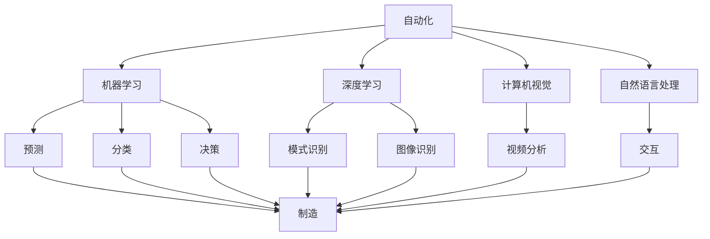
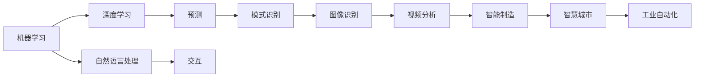
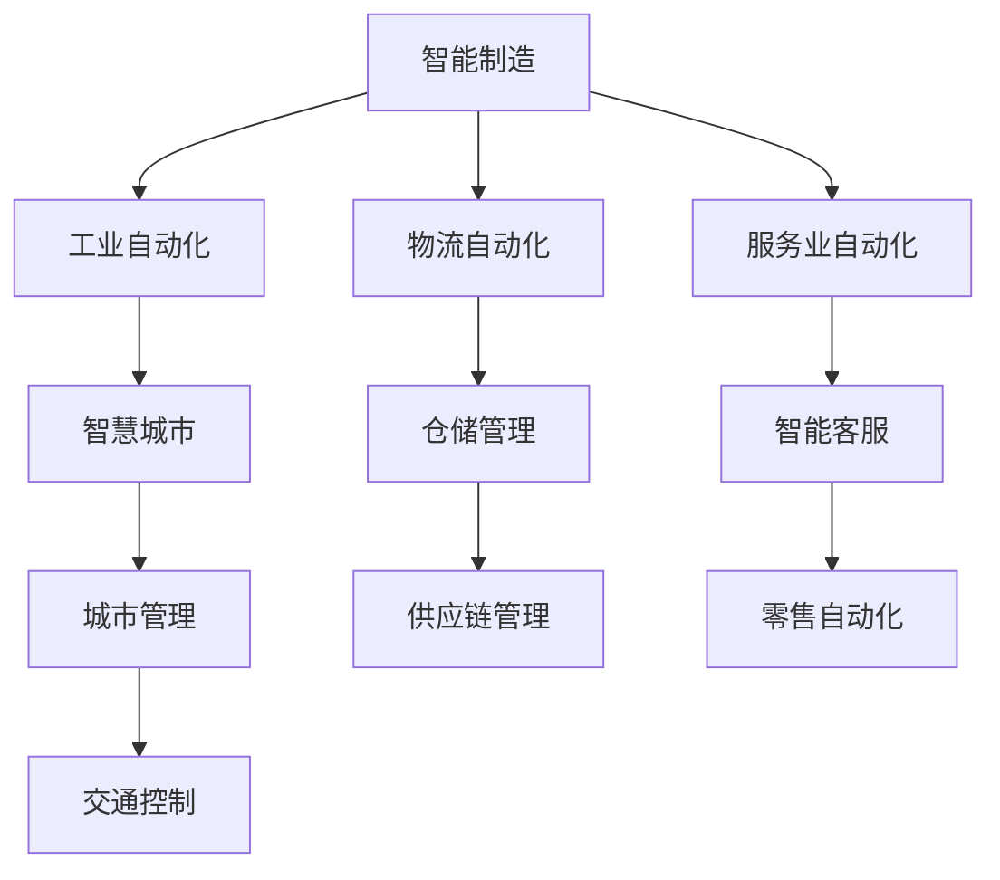
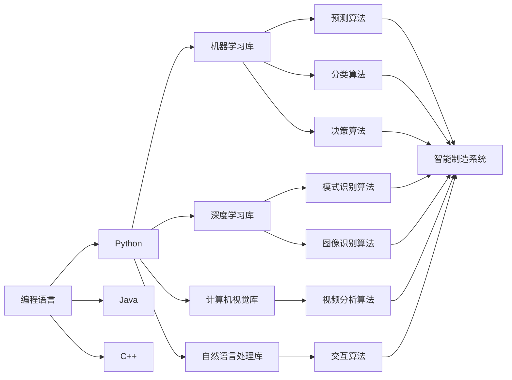
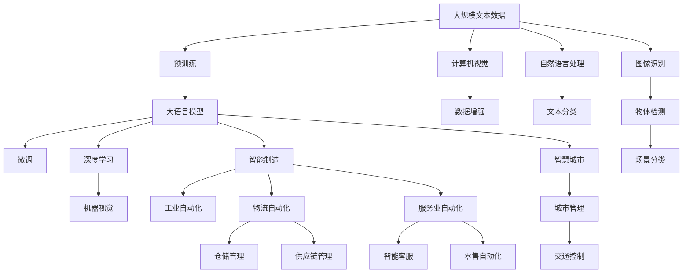

                 

# 自动化技术的前景与挑战

> 关键词：自动化,人工智能,机器学习,深度学习,机器视觉,自然语言处理,工业自动化,智慧城市,智能制造

## 1. 背景介绍

### 1.1 问题由来
随着科技的快速发展，自动化技术在各行各业得到了广泛的应用，极大地提高了生产效率和产品质量。特别是在制造业、物流业、服务业等领域，自动化技术的应用已经深入到了企业运作的各个环节。然而，在自动化技术蓬勃发展的同时，也面临着一系列的挑战和问题。本文将从多个角度深入探讨自动化技术的前景与挑战，为读者提供全面的视角。

### 1.2 问题核心关键点
自动化技术的发展，离不开先进的技术支持，包括机器学习、深度学习、计算机视觉、自然语言处理等。其中，机器学习和深度学习作为自动化技术的核心技术，在智能制造、智慧城市、智能客服等领域得到了广泛的应用。同时，自动化技术的应用，也面临着数据量大、处理速度快、系统复杂度高、人机交互自然化等挑战。

## 2. 核心概念与联系

### 2.1 核心概念概述

为更好地理解自动化技术的前景与挑战，本节将介绍几个关键概念及其相互联系：

- 自动化(Automation)：指通过计算机、机器人等技术，自动完成某些重复性、规律性的任务，从而提高效率、减少错误、降低成本。
- 机器学习(Machine Learning)：指让计算机系统通过数据学习规律，并利用这些规律进行预测、分类、决策等任务。
- 深度学习(Deep Learning)：基于神经网络，通过多层次的特征提取和处理，实现更为复杂的模式识别和预测任务。
- 计算机视觉(Computer Vision)：通过图像识别、视频分析等技术，让计算机系统理解和解释图像和视频数据。
- 自然语言处理(Natural Language Processing)：让计算机系统理解、处理、生成自然语言，从而实现人机交互。
- 工业自动化(Industrial Automation)：应用自动化技术于制造业、物流业等工业生产领域，提高生产效率和质量。
- 智慧城市(Smart City)：通过信息化的手段，实现城市管理的智能化，提高城市运行效率和居民生活质量。
- 智能制造(Smart Manufacturing)：通过自动化技术、信息技术和物联网技术，实现生产过程的智能化、自动化和高效化。

这些核心概念之间的关系可以通过以下Mermaid流程图来展示：



这个流程图展示了自动化技术与其他核心概念的关系：

1. 自动化技术通过机器学习、深度学习、计算机视觉、自然语言处理等技术实现。
2. 机器学习、深度学习、计算机视觉、自然语言处理等技术用于自动化任务的预测、分类、决策、模式识别、图像识别、视频分析、人机交互等。
3. 工业自动化、智慧城市、智能制造等应用领域，均离不开自动化技术的支撑。

### 2.2 概念间的关系

这些核心概念之间存在着紧密的联系，形成了自动化技术的完整生态系统。下面通过几个Mermaid流程图来展示这些概念之间的关系。

#### 2.2.1 自动化技术的学习范式



这个流程图展示了自动化技术的学习范式，即通过机器学习、深度学习、计算机视觉、自然语言处理等技术，实现预测、分类、模式识别、图像识别、视频分析、人机交互等自动化任务。

#### 2.2.2 自动化技术的应用场景



这个流程图展示了自动化技术在不同应用场景中的具体应用，包括智能制造、智慧城市、物流自动化、服务业自动化等。

#### 2.2.3 自动化技术的技术栈



这个流程图展示了自动化技术的常用技术栈，包括编程语言、机器学习库、深度学习库、计算机视觉库、自然语言处理库等，以及这些库提供的基础算法和应用场景。

### 2.3 核心概念的整体架构

最后，我们用一个综合的流程图来展示这些核心概念在大规模自动化任务中的整体架构：



这个综合流程图展示了从预训练到微调，再到具体自动化任务的整体架构。大语言模型通过预训练获得基础能力，再通过微调适配具体任务，最终应用于工业自动化、智慧城市、智能制造、服务业自动化等多个领域。同时，通过数据增强和自然语言处理等技术，进一步提升模型的性能和应用效果。

## 3. 核心算法原理 & 具体操作步骤

### 3.1 算法原理概述

自动化技术的前景与挑战，可以从其核心算法原理的演变来理解。以下是对机器学习、深度学习、计算机视觉、自然语言处理等核心算法的简要概述：

#### 3.1.1 机器学习

机器学习是一种通过数据训练模型，并利用模型进行预测和分类的技术。其核心算法包括监督学习、无监督学习和半监督学习。其中，监督学习通过标注数据训练模型，实现对特定任务的预测和分类。无监督学习通过未标注数据训练模型，发现数据中的隐含结构和规律。半监督学习结合标注数据和未标注数据，提高模型的预测精度。

#### 3.1.2 深度学习

深度学习是一种基于神经网络的机器学习技术，通过多层次的特征提取和处理，实现更为复杂的模式识别和预测任务。其核心算法包括前馈神经网络、卷积神经网络、循环神经网络等。这些网络结构可以应用于图像识别、语音识别、自然语言处理等任务，实现了从低层特征到高层语义的自动学习。

#### 3.1.3 计算机视觉

计算机视觉通过图像识别、视频分析等技术，让计算机系统理解和解释图像和视频数据。其核心算法包括卷积神经网络、循环神经网络、注意力机制等。这些算法可以实现对图像的分类、分割、检测、识别等任务，广泛应用于智能制造、智慧城市等领域。

#### 3.1.4 自然语言处理

自然语言处理通过语言理解、处理和生成，实现人机交互和信息处理。其核心算法包括词向量表示、语言模型、序列标注、序列生成等。这些算法可以实现对文本的分类、情感分析、机器翻译、对话系统等任务，广泛应用于智能客服、智能助手、智能聊天机器人等场景。

### 3.2 算法步骤详解

以下将详细介绍机器学习、深度学习、计算机视觉、自然语言处理等核心算法的操作步骤：

#### 3.2.1 机器学习算法步骤

1. 数据准备：收集标注数据，划分为训练集、验证集和测试集。
2. 模型选择：选择合适的机器学习算法，如线性回归、决策树、支持向量机等。
3. 特征工程：对数据进行特征提取和处理，生成适合算法的特征。
4. 模型训练：使用训练集数据，通过优化算法（如梯度下降）训练模型。
5. 模型评估：在验证集上评估模型性能，调整超参数。
6. 模型测试：在测试集上测试模型效果，生成最终模型。

#### 3.2.2 深度学习算法步骤

1. 数据准备：收集标注数据，划分为训练集、验证集和测试集。
2. 模型选择：选择合适的深度学习模型，如卷积神经网络、循环神经网络等。
3. 数据增强：对数据进行增强处理，如旋转、缩放、裁剪等，增加训练样本数量。
4. 模型训练：使用训练集数据，通过优化算法（如梯度下降）训练模型。
5. 模型评估：在验证集上评估模型性能，调整超参数。
6. 模型测试：在测试集上测试模型效果，生成最终模型。

#### 3.2.3 计算机视觉算法步骤

1. 数据准备：收集标注数据，划分为训练集、验证集和测试集。
2. 模型选择：选择合适的计算机视觉模型，如卷积神经网络、循环神经网络等。
3. 数据增强：对数据进行增强处理，如旋转、缩放、裁剪等，增加训练样本数量。
4. 模型训练：使用训练集数据，通过优化算法（如梯度下降）训练模型。
5. 模型评估：在验证集上评估模型性能，调整超参数。
6. 模型测试：在测试集上测试模型效果，生成最终模型。

#### 3.2.4 自然语言处理算法步骤

1. 数据准备：收集标注数据，划分为训练集、验证集和测试集。
2. 模型选择：选择合适的自然语言处理模型，如词向量表示、语言模型、序列标注等。
3. 数据增强：对数据进行增强处理，如回译、改写等，增加训练样本数量。
4. 模型训练：使用训练集数据，通过优化算法（如梯度下降）训练模型。
5. 模型评估：在验证集上评估模型性能，调整超参数。
6. 模型测试：在测试集上测试模型效果，生成最终模型。

### 3.3 算法优缺点

自动化技术中的核心算法具有以下优缺点：

#### 3.3.1 机器学习算法

**优点：**
- 适用于多种任务，包括分类、回归、聚类等。
- 可解释性强，易于理解和调试。

**缺点：**
- 需要大量标注数据，标注成本高。
- 模型训练时间长，计算资源需求大。

#### 3.3.2 深度学习算法

**优点：**
- 能够处理复杂的数据结构，如图像、语音、文本等。
- 自适应能力强，对噪声和异常值不敏感。

**缺点：**
- 模型复杂度高，训练和推理耗时较长。
- 需要大量的计算资源和数据。

#### 3.3.3 计算机视觉算法

**优点：**
- 能够处理高维数据，如图像、视频等。
- 适用于多种视觉任务，如图像分类、物体检测、场景分割等。

**缺点：**
- 需要大量的标注数据和计算资源。
- 对光照、角度等变化敏感。

#### 3.3.4 自然语言处理算法

**优点：**
- 能够处理自然语言数据，实现人机交互。
- 适用于多种自然语言处理任务，如机器翻译、情感分析、命名实体识别等。

**缺点：**
- 需要大量的标注数据和计算资源。
- 对语言结构和语义理解要求高。

### 3.4 算法应用领域

自动化技术的应用领域广泛，包括但不限于以下几个方面：

#### 3.4.1 工业自动化

工业自动化是自动化技术在制造业、物流业等领域的重要应用。通过引入机器人和自动化生产线，可以实现无人化操作，提高生产效率和产品质量。例如，在汽车制造、电子制造等行业，机器人被广泛应用于焊接、装配、检测等任务，提高了生产线的自动化水平。

#### 3.4.2 智慧城市

智慧城市是自动化技术在城市管理中的应用。通过物联网、云计算、大数据等技术，实现城市运行的智能化。例如，智慧交通系统通过智能信号灯、车联网、交通数据分析等技术，提高交通流量管理效率，减少交通拥堵。智能监控系统通过视频分析、人脸识别等技术，提升城市安全水平，防范犯罪行为。

#### 3.4.3 智能制造

智能制造是自动化技术在制造业中的应用。通过引入物联网、云计算、大数据等技术，实现生产过程的智能化和自动化。例如，智能工厂通过传感器、机器人、自动化生产线等设备，实现生产过程的实时监控和调度，提高生产效率和质量。智能仓储管理系统通过自动化仓储机器人、智能标签系统等技术，实现库存管理的智能化。

#### 3.4.4 服务业自动化

服务业自动化是自动化技术在服务业中的应用。通过引入智能客服、智能排班、智能推荐等技术，提高服务质量和效率。例如，智能客服系统通过自然语言处理、语音识别等技术，实现自动应答和智能推荐，提升客户体验。智能排班系统通过数据分析和预测，优化人员排班，提高服务效率。

#### 3.4.5 智慧医疗

智慧医疗是自动化技术在医疗行业中的应用。通过引入物联网、云计算、大数据等技术，实现医疗服务的智能化和高效化。例如，智慧医疗系统通过智能诊断、远程监控、医疗数据分析等技术，提高医疗服务的质量和效率。智能手术机器人通过自然语言处理、图像识别等技术，实现手术操作的智能化和精准化。

## 4. 数学模型和公式 & 详细讲解  
### 4.1 数学模型构建

本节将使用数学语言对自动化技术的核心算法进行更加严格的刻画。

设机器学习算法的训练数据为$X=\{x_i\}_{i=1}^N$，其中$x_i$为样本，$y_i$为标签。训练模型的目标是最小化损失函数$L$，即：

$$
\min_{\theta} L(\theta) = \frac{1}{N} \sum_{i=1}^N \ell(y_i, \hat{y}(\theta, x_i))
$$

其中，$\ell$为损失函数，$\hat{y}(\theta, x_i)$为模型预测结果。常见的损失函数包括均方误差、交叉熵、对数损失等。模型的优化目标是通过最小化损失函数，使得模型预测结果逼近真实标签。

### 4.2 公式推导过程

以线性回归为例，推导其数学模型和损失函数。

线性回归的数学模型为：

$$
y = \theta^T x + b
$$

其中，$x$为特征向量，$y$为预测结果，$\theta$为模型参数，$b$为截距。

常用的损失函数为均方误差：

$$
\ell(y, \hat{y}) = \frac{1}{2N} \sum_{i=1}^N (y_i - \hat{y}(\theta, x_i))^2
$$

将损失函数代入优化目标，得到：

$$
\min_{\theta} L(\theta) = \frac{1}{2N} \sum_{i=1}^N (y_i - \theta^T x_i - b)^2
$$

通过梯度下降等优化算法，求解最小化损失函数的目标参数$\theta$。

### 4.3 案例分析与讲解

假设我们在智慧城市交通管理系统中，使用机器学习算法预测交通流量，其数学模型和损失函数如下：

设交通流量为$y$，影响因素为$x$，包括时间、天气、道路状况等。设训练数据为$(x_i, y_i)$，$i=1,2,...,N$。

通过线性回归模型拟合，得到：

$$
y = \theta_0 + \theta_1 x_1 + \theta_2 x_2 + \cdots + \theta_n x_n
$$

其中，$\theta_0, \theta_1, \theta_2, \cdots, \theta_n$为模型参数，$x_1, x_2, \cdots, x_n$为特征向量。

假设损失函数为均方误差，则目标函数为：

$$
\min_{\theta} L(\theta) = \frac{1}{N} \sum_{i=1}^N (y_i - \hat{y}(\theta, x_i))^2
$$

使用梯度下降等优化算法，求解目标函数最小化的模型参数$\theta$。

## 5. 项目实践：代码实例和详细解释说明
### 5.1 开发环境搭建

在进行自动化技术开发前，我们需要准备好开发环境。以下是使用Python进行机器学习开发的常见环境配置流程：

1. 安装Python：从官网下载并安装Python，选择3.6+版本。
2. 安装PyTorch：使用pip安装，建议选择最新版本。
3. 安装Numpy、Pandas、Scikit-learn、Matplotlib等常用库。
4. 创建虚拟环境：使用venv命令创建虚拟环境，避免不同项目之间的依赖冲突。

完成上述步骤后，即可在虚拟环境中进行自动化技术的开发实践。

### 5.2 源代码详细实现

以下是一个简单的线性回归模型的Python代码实现，详细解读其工作原理：

```python
import numpy as np
from sklearn.linear_model import LinearRegression
from sklearn.metrics import mean_squared_error

# 准备数据
X = np.array([[1, 2], [2, 3], [3, 4], [4, 5]])
y = np.array([2, 4, 6, 8])

# 训练模型
model = LinearRegression()
model.fit(X, y)

# 预测结果
X_test = np.array([[1, 6], [2, 7], [3, 8]])
y_pred = model.predict(X_test)

# 评估模型
mse = mean_squared_error(y, y_pred)
print(f"Mean Squared Error: {mse:.3f}")
```

这段代码实现了线性回归模型的训练和预测，主要步骤如下：

1. 准备数据：将训练数据和标签存储在Numpy数组中。
2. 训练模型：使用sklearn库中的LinearRegression模型进行训练。
3. 预测结果：使用训练好的模型对测试数据进行预测。
4. 评估模型：计算预测结果与真实标签之间的均方误差。

### 5.3 代码解读与分析

让我们再详细解读一下关键代码的实现细节：

**准备数据**：
- 使用Numpy创建训练数据$X$和标签$y$，存储在二维数组中。
- 将训练数据和标签转换为Numpy数组，方便后续操作。

**训练模型**：
- 使用sklearn库中的LinearRegression模型，创建线性回归对象。
- 使用fit方法对训练数据进行拟合，得到模型参数$\theta$。

**预测结果**：
- 使用训练好的模型对测试数据$X_test$进行预测，得到预测结果$y_pred$。

**评估模型**：
- 使用mean_squared_error函数计算预测结果与真实标签之间的均方误差，评估模型性能。

## 6. 实际应用场景
### 6.1 智能制造

智能制造是自动化技术在制造业中的应用，其目标是实现生产过程的智能化和自动化。通过引入物联网、云计算、大数据等技术，可以实现生产过程的实时监控和调度，提高生产效率和质量。例如，智能工厂通过传感器、机器人、自动化生产线等设备，实现生产过程的实时监控和调度，提高生产效率和质量。智能仓储管理系统通过自动化仓储机器人、智能标签系统等技术，实现库存管理的智能化。

### 6.2 智慧城市

智慧城市是自动化技术在城市管理中的应用，其目标是实现城市运行的智能化。通过物联网、云计算、大数据等技术，可以实现城市管理的智能化。例如，智慧交通系统通过智能信号灯、车联网、交通数据分析等技术，提高交通流量管理效率，减少交通拥堵。智能监控系统通过视频分析、人脸识别等技术，提升城市安全水平，防范犯罪行为。

### 6.3 服务业自动化

服务业自动化是自动化技术在服务业中的应用，其目标是实现服务过程的智能化和高效化。通过引入智能客服、智能排班、智能推荐等技术，提高服务质量和效率。例如，智能客服系统通过自然语言处理、语音识别等技术，实现自动应答和智能推荐，提升客户体验。智能排班系统通过数据分析和预测，优化人员排班，提高服务效率。

### 6.4 未来应用展望

未来，自动化技术将继续向智能化、自动化、集成化方向发展，带来更广阔的应用前景。以下是几个可能的发展方向：

1. 智能化的进一步提升：通过引入深度学习、强化学习等技术，提高系统的智能化水平，实现更加复杂和高级的任务。
2. 自动化的全面推广：随着技术成本的降低，自动化技术将逐步推广到更多领域，实现全行业的智能化转型。
3. 集成化的深入发展：通过引入多模态数据和跨领域技术，实现自动化系统的集成化和协同化，提升系统的综合性能。

## 7. 工具和资源推荐
### 7.1 学习资源推荐

为了帮助开发者系统掌握自动化技术的前景与挑战，这里推荐一些优质的学习资源：

1. 《机器学习实战》一书：由Python专家编写，深入浅出地介绍了机器学习的原理和实践，适合初学者入门。
2. 《深度学习》课程：斯坦福大学开设的深度学习课程，涵盖深度学习的基本概念和经典模型，适合中高级学习者。
3. 《计算机视觉》课程：斯坦福大学开设的计算机视觉课程，涵盖计算机视觉的基本概念和经典模型，适合计算机视觉领域的学习者。
4. 《自然语言处理》课程：斯坦福大学开设的自然语言处理课程，涵盖自然语言处理的基本概念和经典模型，适合自然语言处理领域的学习者。
5. 《Python数据科学手册》一书：由Python专家编写，全面介绍了Python在数据科学中的应用，包括机器学习、深度学习、计算机视觉、自然语言处理等。

通过对这些资源的学习实践，相信你一定能够快速掌握自动化技术的核心算法和应用场景，并用于解决实际的自动化问题。

### 7.2 开发工具推荐

高效的开发离不开优秀的工具支持。以下是几款用于自动化技术开发的常用工具：

1. PyTorch：基于Python的开源深度学习框架，灵活动态的计算图，适合快速迭代研究。
2. TensorFlow：由Google主导开发的开源深度学习框架，生产部署方便，适合大规模工程应用。
3. scikit-learn：Python机器学习库，提供了丰富的机器学习算法和工具，适合快速原型开发。
4. OpenCV：计算机视觉库，提供了丰富的图像处理和计算机视觉算法，适合图像处理任务。
5. NLTK：自然语言处理库，提供了丰富的自然语言处理工具和算法，适合自然语言处理任务。

合理利用这些工具，可以显著提升自动化技术的开发效率，加快创新迭代的步伐。

### 7.3 相关论文推荐

自动化技术的发展源于学界的持续研究。以下是几篇奠基性的相关论文，推荐阅读：

1. 《Deep Learning》一书：深度学习领域的经典书籍，全面介绍了深度学习的基本概念和经典模型。
2. 《ImageNet Classification with Deep Convolutional Neural Networks》：深度学习在计算机视觉领域的奠基性论文，介绍了卷积神经网络的基本原理和应用。
3. 《A Survey on Deep Learning for Natural Language Processing》：自然语言处理领域的综述性论文，介绍了深度学习在自然语言处理中的应用。
4. 《Machine Learning: A Probabilistic Perspective》一书：机器学习领域的经典书籍，全面介绍了机器学习的基本概念和经典模型。

这些论文代表了大自动化技术的发展脉络。通过学习这些前沿成果，可以帮助研究者把握学科前进方向，激发更多的创新灵感。

除上述资源外，还有一些值得关注的前沿资源，帮助开发者紧跟自动化技术的前景与挑战，例如：

1. arXiv论文预印本：人工智能领域最新研究成果的发布平台，包括大量尚未发表的前沿工作，学习前沿技术的必读资源。
2. 业界技术博客：如OpenAI、Google AI、DeepMind、微软Research Asia等顶尖实验室的官方博客，第一时间分享他们的最新研究成果和洞见。
3. 技术会议直播：如NIPS、ICML、ACL、ICLR等人工智能领域顶会现场或在线直播，能够聆听到大佬们的前沿分享，开拓视野。
4. GitHub热门项目：在GitHub上Star、Fork数最多的自动化技术相关项目，往往代表了该技术领域的发展

