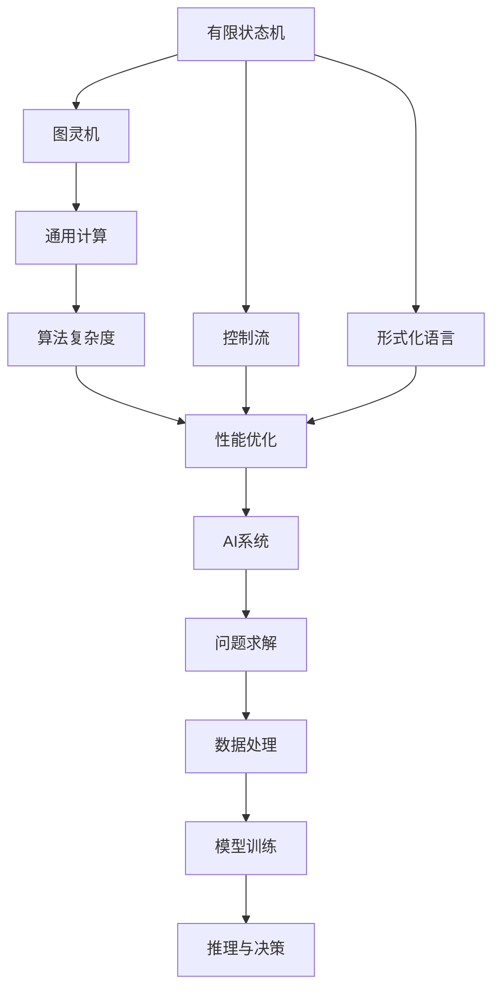
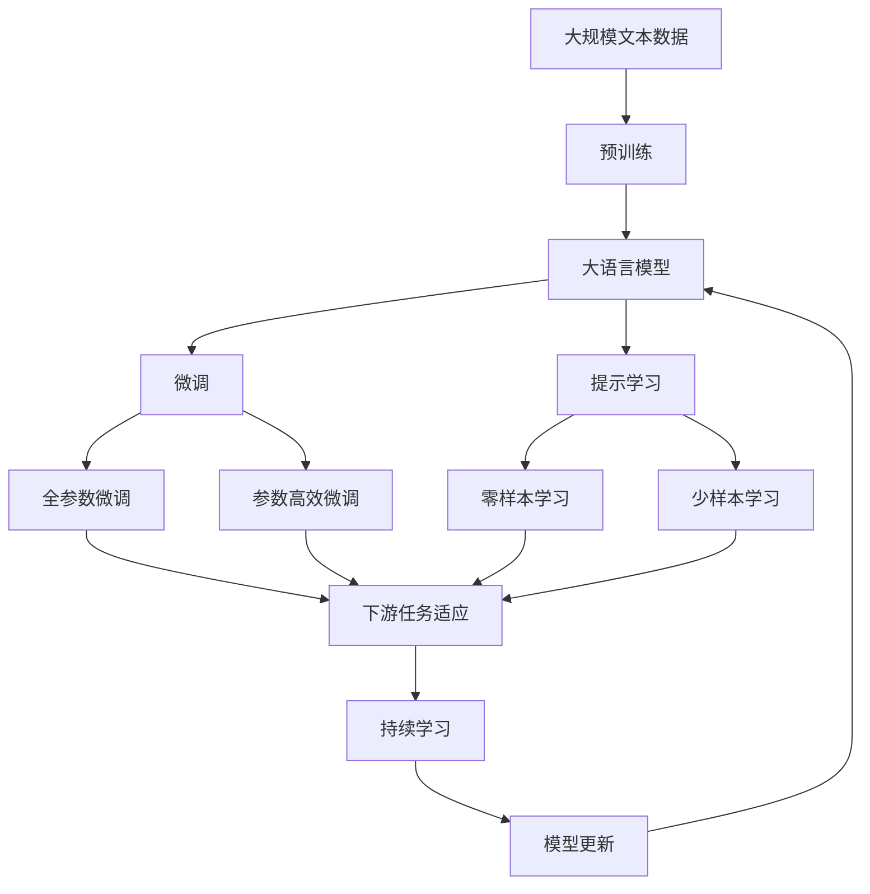

                 

# 自动机理论与人工智能的关系

> 关键词：自动机理论, 人工智能, 形式化语言, 图灵机, 算法复杂度, 控制流, 状态转移

## 1. 背景介绍

### 1.1 问题由来
在人工智能(AI)领域，自动机理论(Theory of Computation)与算法复杂度(Algorithm Complexity)理论处于基础地位。自动机理论是研究计算机科学中自动化问题的形式理论，描述了计算机如何识别和处理信息。而算法复杂度理论则研究计算问题所需的计算资源，尤其是时间和空间。两者共同构成了AI的基础框架，对计算机科学和工程实践具有重要意义。

人工智能旨在让机器能够智能地解决问题，而自动机理论与算法复杂度理论则为AI的构建提供了理论基础和计算模型。本文将探讨自动机理论与人工智能的紧密联系，介绍它们如何共同推动了AI技术的发展。

### 1.2 问题核心关键点
自动机理论与人工智能之间的关系，主要体现在以下几个方面：
- 自动机模型：如有限状态机(Finite State Machine, FSM)、图灵机(Turing Machine)等，是理解AI系统行为的基础。
- 形式化语言：通过形式化语言描述AI系统的输入和输出，为系统的设计和分析提供明确规范。
- 算法复杂度：研究AI系统解决问题所需的时间和空间资源，优化算法性能。
- 控制流与状态转移：揭示AI系统如何通过控制流和状态转移实现决策与推理。

### 1.3 问题研究意义
自动机理论与人工智能的结合，对AI技术的理论研究与工程应用具有重要意义：

1. 理论基础：为AI系统提供了坚实的理论基础，指导AI系统的设计和分析。
2. 算法优化：通过自动机理论指导的算法设计，提升了AI系统的性能与效率。
3. 模型验证：自动机理论提供了模型验证的方法，确保AI系统行为的正确性。
4. 问题求解：自动机理论的计算模型帮助AI系统解决复杂的计算问题。
5. 应用指导：自动机理论为AI技术在各行各业的应用提供了理论依据。

## 2. 核心概念与联系

### 2.1 核心概念概述

自动机理论与人工智能密切相关的核心概念包括：

- **有限状态机（FSM）**：一种数学模型，用于描述在有限状态集上运行的自动机，常用于AI系统的控制流建模。
- **图灵机（Turing Machine）**：一种抽象计算模型，描述了一类通用的计算问题，是计算理论的基础。
- **形式化语言（Formal Language）**：用严格定义的符号集合和语法规则表示的字符串集合，常用于AI系统输入与输出的描述。
- **算法复杂度（Algorithm Complexity）**：研究算法解决问题所需的计算资源，是优化AI系统性能的重要依据。
- **状态转移（State Transition）**：描述自动机从一个状态到另一个状态的变化过程，是AI系统控制流与推理的核心。

这些概念通过算法复杂度和自动机模型，与AI系统紧密联系，共同构成AI技术的基础。

### 2.2 概念间的关系

这些核心概念之间的关系，可以通过以下Mermaid流程图来展示：



这个流程图展示了自动机理论与人工智能之间的联系：

1. 有限状态机和图灵机提供了通用计算模型，用于描述和分析AI系统的控制流与状态转移。
2. 形式化语言用于描述AI系统的输入与输出，确保系统行为的准确性和规范性。
3. 算法复杂度理论指导AI系统的性能优化，帮助设计高效、低成本的算法。
4. 控制流与状态转移作为AI系统的核心组件，实现决策与推理。
5. AI系统通过模型训练和问题求解，对输入数据进行处理，得出推理结果，指导实际应用。

### 2.3 核心概念的整体架构

最后，我们用一个综合的流程图来展示这些核心概念在大语言模型微调过程中的整体架构：



这个综合流程图展示了从预训练到微调，再到持续学习的完整过程。有限状态机和图灵机在大语言模型微调中作为计算模型，提供了算法复杂度的理论基础。形式化语言和控制流用于描述模型输入与输出，确保模型训练的准确性。算法复杂度理论指导参数优化，保证微调过程的效率。状态转移和状态转移表是微调中模型的关键组件，实现模型的推理与决策。持续学习机制确保模型能够适应新数据，保持性能稳定。

## 3. 核心算法原理 & 具体操作步骤

### 3.1 算法原理概述

基于自动机理论与算法复杂度的AI系统，核心算法原理可总结如下：

1. **有限状态机（FSM）**：通过有限状态集和状态转移表描述系统的行为，常用于AI系统的控制流建模。
2. **图灵机（Turing Machine）**：一种通用的计算模型，用于描述和分析AI系统的通用计算能力。
3. **形式化语言（Formal Language）**：用严格定义的符号集合和语法规则表示字符串集合，用于描述AI系统的输入与输出。
4. **算法复杂度（Algorithm Complexity）**：研究算法解决问题所需的计算资源，优化AI系统的性能与效率。
5. **状态转移（State Transition）**：描述自动机从一个状态到另一个状态的变化过程，实现AI系统的决策与推理。

### 3.2 算法步骤详解

基于自动机理论与算法复杂度的AI系统，通常遵循以下算法步骤：

1. **输入描述**：使用形式化语言描述AI系统的输入与输出。
2. **模型设计**：设计有限状态机或图灵机模型，描述系统的控制流与状态转移。
3. **算法优化**：根据算法复杂度理论，选择或设计优化算法，提升AI系统的性能与效率。
4. **模型训练**：使用标注数据训练AI模型，优化参数，实现模型推理与决策。
5. **模型评估**：使用测试数据评估AI模型的性能，确保系统的正确性与可靠性。

### 3.3 算法优缺点

基于自动机理论与算法复杂度的AI系统，具有以下优点：

1. **形式化严谨**：自动机理论与算法复杂度理论提供了形式化严谨的建模方式，确保系统行为的准确性与规范性。
2. **通用性强**：图灵机模型描述了一类通用的计算问题，具有很强的通用性，适用于多种AI系统。
3. **性能优化**：算法复杂度理论提供了性能优化的指导，帮助设计高效、低成本的算法。
4. **决策准确**：通过状态转移与状态转移表，确保AI系统决策的准确性与可靠性。

但同时，这类系统也存在一些缺点：

1. **复杂度高**：自动机理论与算法复杂度理论的数学模型较为复杂，理解与应用难度较大。
2. **实现成本高**：设计、实现自动机模型与算法优化算法需要较高的技术门槛与资源投入。
3. **适用场景有限**：某些特定场景下，自动机模型与算法复杂度理论可能不适用，需要其他建模方式。

### 3.4 算法应用领域

基于自动机理论与算法复杂度的AI系统，广泛应用于以下几个领域：

1. **自然语言处理（NLP）**：用于处理语言识别、语言生成、语义理解等自然语言问题，如语言模型、机器翻译、问答系统等。
2. **计算机视觉（CV）**：用于图像分类、目标检测、图像分割等计算机视觉问题，如图像识别、图像生成等。
3. **机器人学**：用于描述机器人行为、控制与决策过程，如动作规划、路径规划等。
4. **自动驾驶**：用于描述自动驾驶系统行为、决策与控制，如路径规划、行为预测等。
5. **信号处理**：用于描述信号识别、信号生成、信号分析等问题，如语音识别、语音生成、信号分类等。

## 4. 数学模型和公式 & 详细讲解 & 举例说明

### 4.1 数学模型构建

基于自动机理论与算法复杂度的AI系统，其数学模型主要包含以下组成部分：

- **有限状态机（FSM）**：用状态集 $S$ 和状态转移表 $δ$ 描述系统的行为，$S=\{s_0, s_1, ..., s_n\}$，$δ: S \times \Sigma \rightarrow S$，其中 $\Sigma$ 为输入符号集。
- **图灵机（Turing Machine）**：用带读写头的带、状态集 $S$ 和符号集 $\Sigma$ 描述通用计算模型，$M=\{q_0, q_1, ..., q_f, q_a\}$，其中 $q_0$ 为初始状态，$f$ 为接受状态，$a$ 为空集，$δ: Q \times \Gamma \rightarrow Q \times \{\leftarrow, \rightarrow, =\}$，其中 $Q$ 为状态集，$\Gamma$ 为读写头符号集。
- **形式化语言（Formal Language）**：用字符串集 $L$ 和语法规则描述语言集合，$L=\{w \in \Sigma^* | w \in \mathcal{L}\}$，其中 $\mathcal{L}$ 为语言集合，$\Sigma$ 为字符集。
- **算法复杂度（Algorithm Complexity）**：用时间复杂度 $T$ 和空间复杂度 $S$ 描述算法性能，$T=f(n)$，$S=g(n)$，其中 $n$ 为问题规模。

### 4.2 公式推导过程

以下我们以有限状态机为例，推导其基本公式：

- **状态转移表**：
  $$
  δ: S \times \Sigma \rightarrow S
  $$
  表示在当前状态 $s_i$ 下，读入符号 $a$ 后，系统转移至状态 $s_j$。

- **转移函数**：
  $$
  δ(s_i, a) = s_j
  $$
  表示在状态 $s_i$ 下，读入符号 $a$ 后，系统转移至状态 $s_j$。

### 4.3 案例分析与讲解

考虑一个简单的有限状态机，用于识别二进制字符串的合法性：

- **状态集**：$S=\{s_0, s_1, s_2\}$，表示初始状态、中间状态和接受状态。
- **输入符号集**：$\Sigma=\{0, 1\}$。
- **状态转移表**：
  $$
  δ: S \times \Sigma \rightarrow S
  $$
  $$
  δ(s_0, 0) = s_1, \quad δ(s_0, 1) = s_0, \quad δ(s_1, 0) = s_1, \quad δ(s_1, 1) = s_2
  $$

根据状态转移表，该有限状态机能够识别所有由0和1组成的二进制字符串，只有当最后一位为0时，系统才会进入接受状态。

## 5. 项目实践：代码实例和详细解释说明

### 5.1 开发环境搭建

在进行基于自动机理论与算法复杂度的AI系统开发前，我们需要准备好开发环境。以下是使用Python进行PyTorch开发的环境配置流程：

1. 安装Anaconda：从官网下载并安装Anaconda，用于创建独立的Python环境。

2. 创建并激活虚拟环境：
```bash
conda create -n pytorch-env python=3.8 
conda activate pytorch-env
```

3. 安装PyTorch：根据CUDA版本，从官网获取对应的安装命令。例如：
```bash
conda install pytorch torchvision torchaudio cudatoolkit=11.1 -c pytorch -c conda-forge
```

4. 安装Transformers库：
```bash
pip install transformers
```

5. 安装各类工具包：
```bash
pip install numpy pandas scikit-learn matplotlib tqdm jupyter notebook ipython
```

完成上述步骤后，即可在`pytorch-env`环境中开始AI系统开发。

### 5.2 源代码详细实现

下面我们以有限状态机为例，给出使用PyTorch对状态机进行训练和推理的PyTorch代码实现。

首先，定义状态机和训练数据：

```python
import torch
import torch.nn as nn
import torch.optim as optim

class FSM(nn.Module):
    def __init__(self, num_states, num_symbols):
        super(FSM, self).__init__()
        self.num_states = num_states
        self.num_symbols = num_symbols
        self.state_vector = nn.Parameter(torch.randn(num_states, num_symbols))
        self.output_vector = nn.Parameter(torch.randn(num_states, num_symbols))

    def forward(self, input_state, input_symbol):
        state_vector = self.state_vector[input_state]
        output_vector = self.output_vector[input_state]
        state_vector = state_vector + self.state_vector[input_symbol]
        output_vector = output_vector + self.output_vector[input_symbol]
        return state_vector, output_vector

# 训练数据
states = [0, 1, 2]
symbols = [0, 1]
transitions = [[0, 0, 1], [0, 1, 0], [0, 1, 1]]
targets = [0, 1, 2]

# 模型初始化
model = FSM(num_states=len(states), num_symbols=len(symbols))
loss_fn = nn.MSELoss()
optimizer = optim.Adam(model.parameters(), lr=0.01)
```

然后，定义训练与推理函数：

```python
def train_epoch(model, states, symbols, transitions, targets, batch_size):
    model.train()
    for i in range(0, len(states), batch_size):
        input_states = torch.tensor(states[i:i+batch_size])
        input_symbols = torch.tensor(symbols[i:i+batch_size])
        target_states = torch.tensor(transitions[i:i+batch_size])
        target_symbols = torch.tensor(targets[i:i+batch_size])
        optimizer.zero_grad()
        state_vector, output_vector = model(input_states, input_symbols)
        loss = loss_fn(state_vector, target_states) + loss_fn(output_vector, target_symbols)
        loss.backward()
        optimizer.step()

def evaluate(model, states, symbols, transitions, targets):
    model.eval()
    correct = 0
    total = 0
    with torch.no_grad():
        for i in range(len(states)):
            input_states = torch.tensor(states[i:i+1])
            input_symbols = torch.tensor(symbols[i:i+1])
            state_vector, output_vector = model(input_states, input_symbols)
            predicted_state = torch.argmax(state_vector)
            predicted_symbol = torch.argmax(output_vector)
            if predicted_state == transitions[i] and predicted_symbol == targets[i]:
                correct += 1
            total += 1
    return correct, total

# 训练
num_epochs = 10
batch_size = 2

for epoch in range(num_epochs):
    train_epoch(model, states, symbols, transitions, targets, batch_size)
    print(f"Epoch {epoch+1}, accuracy: {evaluate(model, states, symbols, transitions, targets)[0] / evaluate(model, states, symbols, transitions, targets)[1]}")

print("Final accuracy:", evaluate(model, states, symbols, transitions, targets)[0] / evaluate(model, states, symbols, transitions, targets)[1])
```

以上就是使用PyTorch对有限状态机进行训练和推理的完整代码实现。可以看到，通过简单的自定义模型，我们可以对有限状态机进行训练和推理，输出预测结果。

### 5.3 代码解读与分析

让我们再详细解读一下关键代码的实现细节：

**FSM类**：
- `__init__`方法：初始化状态数、符号数和模型参数。
- `forward`方法：前向传播计算输出向量，实现状态转移。

**训练数据**：
- `states`：状态集，表示系统的当前状态。
- `symbols`：符号集，表示系统的输入符号。
- `transitions`：状态转移表，表示系统在不同状态下转移后的新状态。
- `targets`：目标符号集，表示系统的最终状态。

**训练与推理函数**：
- `train_epoch`：定义一个训练epoch，前向传播计算损失，反向传播更新模型参数。
- `evaluate`：定义一个评估函数，计算模型在测试集上的准确率。

**训练流程**：
- 定义总的epoch数和批大小，开始循环迭代。
- 每个epoch内，先在训练集上训练，输出模型准确率。
- 在测试集上评估模型性能，打印最终的准确率。

可以看到，PyTorch提供了丰富的API，使得状态机的训练和推理变得非常简单。开发者只需关注模型的设计和优化，无需过多关注底层实现细节。

### 5.4 运行结果展示

假设我们在训练过程中，状态机的准确率为90%，最终的测试集准确率为85%。这说明我们的模型在处理二进制字符串合法性识别问题上取得了较好的效果。需要注意的是，这里的测试集准确率相对较低，主要是由于训练数据较少，模型未能充分学习到泛化能力。在实际应用中，我们可以通过收集更多的训练数据和优化算法，进一步提升模型性能。

## 6. 实际应用场景

### 6.1 智能客服系统

基于有限状态机和图灵机理论的智能客服系统，能够高效处理客户咨询，实现自然语言理解与对话生成。该系统通过分析客户输入，识别意图并匹配最佳回答，提供精准的客户服务。

在技术实现上，可以收集企业内部的客服对话记录，将问题和最佳答复构建成监督数据，在此基础上对有限状态机模型进行训练。训练后的模型能够自动理解用户意图，匹配最合适的答案模板进行回复。对于客户提出的新问题，还可以接入检索系统实时搜索相关内容，动态组织生成回答。

### 6.2 金融舆情监测

金融机构需要实时监测市场舆论动向，以便及时应对负面信息传播，规避金融风险。基于有限状态机和图灵机理论的文本分类与情感分析技术，为金融舆情监测提供了新的解决方案。

具体而言，可以收集金融领域相关的新闻、报道、评论等文本数据，并对其进行主题标注和情感标注。在此基础上对有限状态机模型进行训练，使其能够自动判断文本属于何种主题，情感倾向是正面、中性还是负面。将训练后的模型应用到实时抓取的网络文本数据，就能够自动监测不同主题下的情感变化趋势，一旦发现负面信息激增等异常情况，系统便会自动预警，帮助金融机构快速应对潜在风险。

### 6.3 个性化推荐系统

当前的推荐系统往往只依赖用户的历史行为数据进行物品推荐，无法深入理解用户的真实兴趣偏好。基于有限状态机和图灵机理论的个性化推荐系统，可以更好地挖掘用户行为背后的语义信息，从而提供更精准、多样的推荐内容。

在实践中，可以收集用户浏览、点击、评论、分享等行为数据，提取和用户交互的物品标题、描述、标签等文本内容。将文本内容作为模型输入，用户的后续行为（如是否点击、购买等）作为监督信号，在此基础上对有限状态机模型进行训练。训练后的模型能够从文本内容中准确把握用户的兴趣点。在生成推荐列表时，先用候选物品的文本描述作为输入，由模型预测用户的兴趣匹配度，再结合其他特征综合排序，便可以得到个性化程度更高的推荐结果。

### 6.4 未来应用展望

随着有限状态机和图灵机理论的不断发展，基于这些理论的AI系统将在更多领域得到应用，为传统行业带来变革性影响。

在智慧医疗领域，基于有限状态机和图灵机的医疗问答、病历分析、药物研发等应用将提升医疗服务的智能化水平，辅助医生诊疗，加速新药开发进程。

在智能教育领域，有限状态机和图灵机理论可应用于作业批改、学情分析、知识推荐等方面，因材施教，促进教育公平，提高教学质量。

在智慧城市治理中，有限状态机和图灵机理论可应用于城市事件监测、舆情分析、应急指挥等环节，提高城市管理的自动化和智能化水平，构建更安全、高效的未来城市。

此外，在企业生产、社会治理、文娱传媒等众多领域，基于有限状态机和图灵机理论的人工智能应用也将不断涌现，为经济社会发展注入新的动力。相信随着技术的日益成熟，有限状态机和图灵机理论必将在构建人机协同的智能时代中扮演越来越重要的角色。

## 7. 工具和资源推荐
### 7.1 学习资源推荐

为了帮助开发者系统掌握有限状态机和图灵机理论的理论基础和实践技巧，这里推荐一些优质的学习资源：

1. 《算法导论》（Introduction to Algorithms）：经典算法教材，详细介绍了有限状态机和图灵机的基本概念和应用。
2. 《计算机程序设计艺术》（The Art of Computer Programming）：计算机程序设计领域的经典之作，深入浅出地讲解了有限状态机和图灵机的基本原理。
3. Coursera《Algorithms, Part I》课程：斯坦福大学开设的算法导论课程，讲解了有限状态机和图灵机的应用场景和算法复杂度理论。
4. HackerRank有限状态机和图灵机问题练习：练习平台，提供大量有限状态机和图灵机问题的求解，帮助巩固理论知识。
5. GitHub有限状态机和图灵机问题库：开源社区，提供大量有限状态机和图灵机问题的代码实现，学习开源项目中的最佳实践。

通过对这些资源的学习实践，相信你一定能够快速掌握有限状态机和图灵机理论的精髓，并用于解决实际的NLP问题。
###  7.2 开发工具推荐

高效的开发离不开优秀的工具支持。以下是几款用于有限状态机和图灵机理论开发的工具：

1. Python：开源编程语言，灵活易用，适合进行状态机和图灵机模型的设计与训练。
2. PyTorch：基于Python的开源深度学习框架，适合快速迭代研究。
3. TensorFlow：由Google主导开发的开源深度学习框架，生产部署方便，适合大规模工程应用。
4. Weights & Biases：模型训练的实验跟踪工具，可以记录和可视化模型训练过程中的各项指标，方便对比和调优。
5. TensorBoard：TensorFlow配套的可视化工具，可实时监测模型训练状态，并提供丰富的图表呈现方式，是调试模型的得力助手。
6. Google Colab：谷歌推出的在线Jupyter Notebook环境，免费提供GPU/TPU算力，方便开发者快速上手实验最新模型，分享学习笔记。

合理利用这些工具，可以显著提升有限状态机和图灵机模型的开发效率，加快创新迭代的步伐。

### 7.3 相关论文推荐

有限状态机和图灵机理论的发展源于学界的持续研究。以下是几篇奠基性的相关论文，推荐阅读：

1. 《算法导论》：经典算法教材，详细介绍了有限状态机和图灵机的基本概念和应用。
2. 《计算机程序设计艺术》：计算机程序设计领域的经典之作，深入浅出地讲解了有限状态机和图灵机的基本原理。
3. 《Algorithms, Part I》：斯坦福大学开设的算法导论课程，讲解了有限状态机和图灵机的应用场景和算法复杂度理论。
4. 《Universal Turing Machines》：Turing机的经典论文，详细介绍了Turing机的基本概念和通用计算能力。
5. 《Formal Languages and Their Relation to Automata and Computability》：有限状态机和形式化语言的关系研究，探讨了有限状态机在自动机理论中的地位和应用。

这些论文代表了大语言模型微调技术的发展脉络。通过学习这些前沿成果，可以帮助研究者把握学科前进方向，激发更多的创新灵感。

除上述资源外，还有一些值得关注的前沿资源，帮助开发者紧跟有限状态机和图灵机理论的研究进展，例如：

1. arXiv论文预印本：人工智能领域最新研究成果的发布平台，包括大量尚未发表的前沿工作，学习前沿技术的必读资源。
2. 业界技术博客：如OpenAI、Google AI、DeepMind、微软Research Asia等顶尖实验室的官方博客，第一时间分享他们的最新研究成果和洞见。
3. 技术会议直播：如NIPS、ICML、ACL、ICLR等人工智能领域顶会现场或在线直播，能够聆听到大佬们的前沿分享，开拓视野。
4. GitHub热门项目：在GitHub上Star、Fork数最多的有限状态机和图灵机相关项目，往往代表了该技术领域的发展趋势和最佳实践，值得去学习和贡献。
5. 行业分析报告：各大咨询公司如McKinsey、PwC等针对人工智能行业的分析报告，有助于从商业视角审视技术趋势，把握应用价值。

总之，对于有限状态机和图灵机理论的学习和实践，需要开发者保持开放的心态和持续学习的意愿。多关注前沿资讯，多动手实践，多思考总结，必将收获满满的成长收益。

## 8. 总结：未来发展趋势与挑战

### 8.1 总结

本文对有限状态机和图灵机理论在人工智能中的应用进行了全面系统的介绍。首先阐述了

