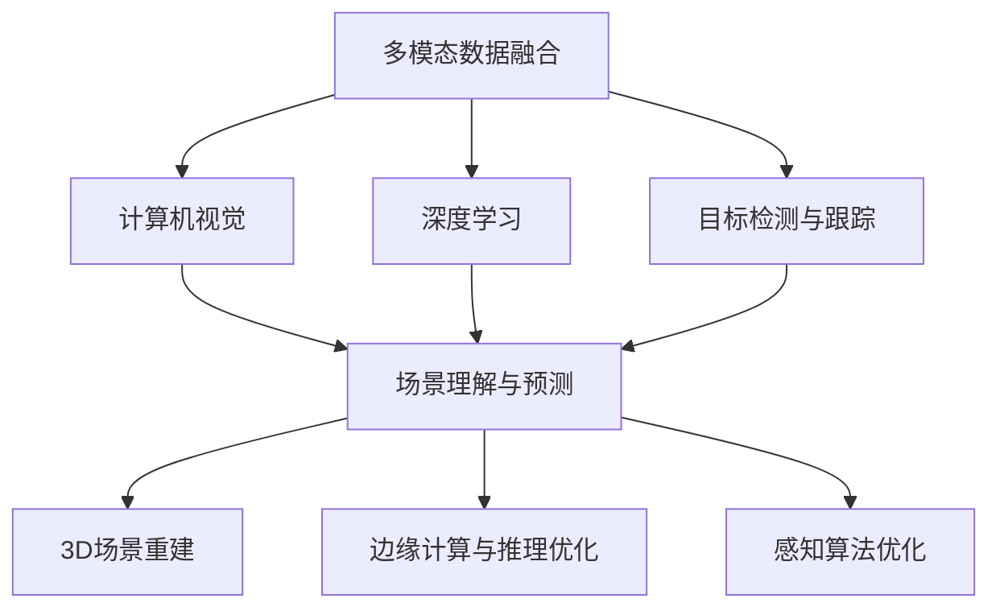
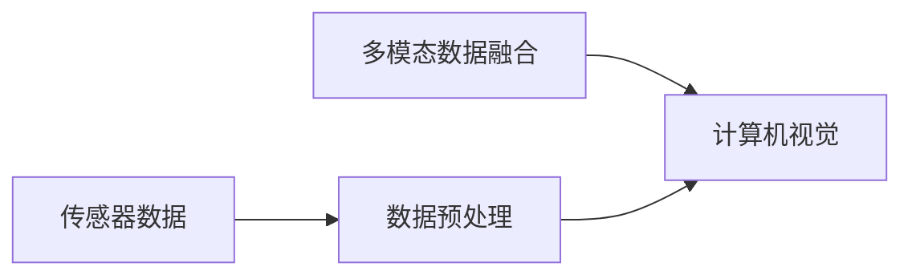
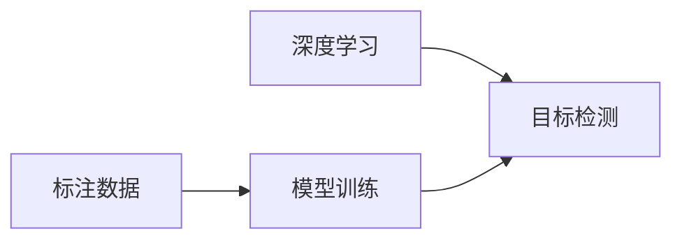
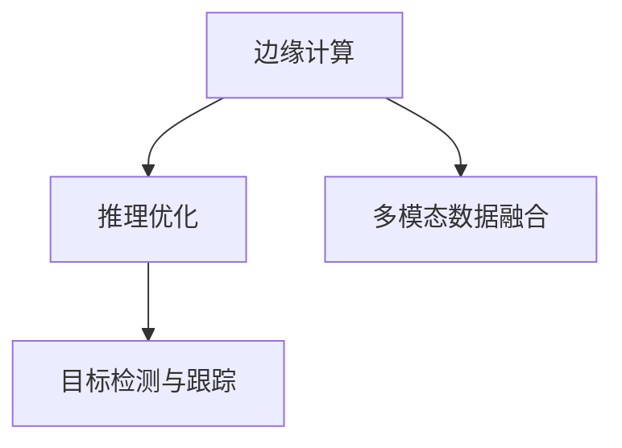
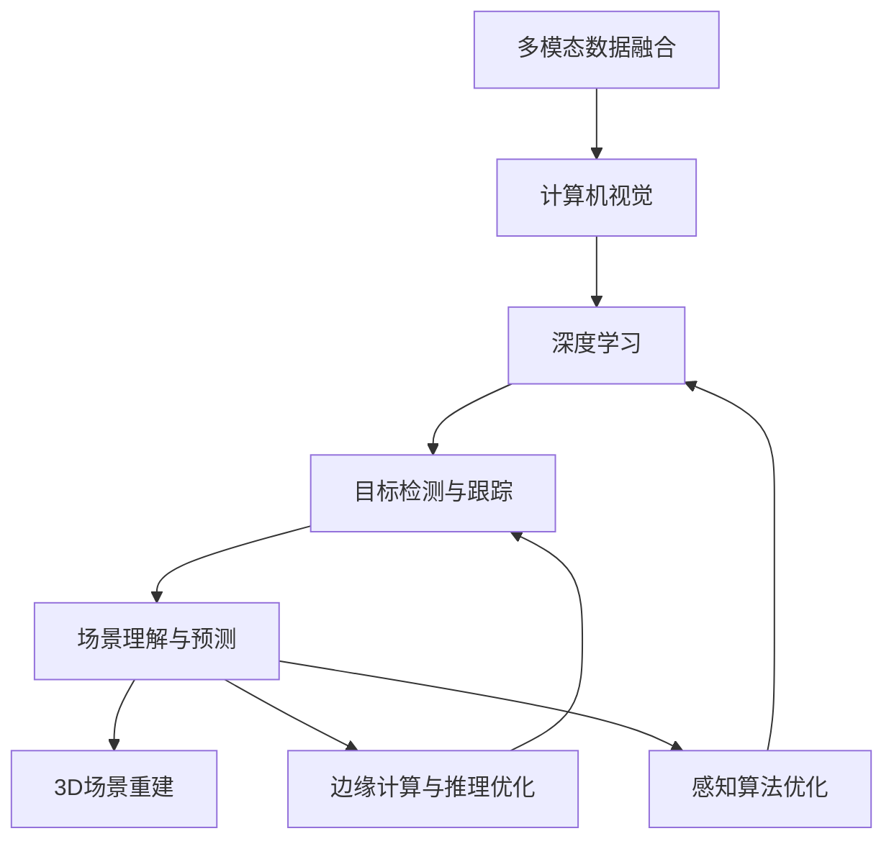

                 

## 1. 背景介绍

### 1.1 问题由来
近年来，自动驾驶技术在全球范围内迅速发展，但核心技术之一——感知技术（Perception）仍存在诸多挑战。现有感知技术主要依赖于摄像头、激光雷达（LIDAR）和雷达等传感器，通过计算机视觉（CV）和深度学习（DL）技术进行环境理解和目标检测。尽管这些技术已经取得显著进展，但面对复杂的道路环境和多变交通情况，仍存在感知不足、决策滞后等问题。因此，如何突破现有技术瓶颈，实现更准确、更高效、更鲁棒的感知能力，成为自动驾驶领域的热点研究方向。

### 1.2 问题核心关键点
自动驾驶感知技术主要聚焦于以下几个关键点：
- **多模态数据融合**：利用多种传感器数据，通过多模态数据融合技术，提高环境感知精度和鲁棒性。
- **目标检测与跟踪**：准确检测和稳定跟踪道路上的各种目标，如车辆、行人、交通信号等。
- **场景理解与预测**：理解交通场景，预测目标行为，为驾驶决策提供支持。
- **3D场景重建**：建立精准的3D场景模型，实现对环境的深度理解。
- **边缘计算与推理优化**：在边缘设备上高效运行深度学习模型，提升实时性。
- **感知算法优化**：设计更高效的感知算法，提高算法的精度和计算效率。

这些关键点涵盖了感知技术的各个方面，对于自动驾驶系统的安全与可靠性至关重要。

### 1.3 问题研究意义
探索自动驾驶感知技术的发展方向与突破口，对于提升自动驾驶系统的性能、确保行车安全、推动智能交通发展具有重要意义：

- **安全保障**：通过更精确、更快速的感知能力，避免交通事故，保护乘客和行人的生命安全。
- **效率提升**：优化感知算法，减少计算延迟，提升自动驾驶系统的响应速度。
- **成本控制**：利用边缘计算和更高效的感知算法，降低系统能耗和硬件成本。
- **应用拓展**：拓展感知技术在智能交通、车联网等领域的应用范围，推动智能交通的普及与发展。
- **技术创新**：结合新兴技术，如人工智能、计算机视觉、机器学习等，提升感知技术的边界。

## 2. 核心概念与联系

### 2.1 核心概念概述
为更好地理解自动驾驶感知技术的发展方向与突破口，本节将介绍几个密切相关的核心概念：

- **感知技术（Perception）**：自动驾驶系统中，感知技术负责获取环境信息，并对目标进行检测、分类和跟踪，为后续决策提供基础。
- **计算机视觉（Computer Vision）**：利用摄像头等视觉传感器，通过图像处理和模式识别技术，实现对环境的信息采集和理解。
- **深度学习（Deep Learning）**：一种基于多层神经网络的机器学习技术，通过大量数据训练，实现复杂模式的识别与预测。
- **多模态数据融合（Multi-modal Data Fusion）**：将多种传感器数据（如视觉、雷达、激光雷达）进行融合，综合信息，提高感知精度。
- **目标检测与跟踪（Object Detection and Tracking）**：通过算法识别并跟踪道路上的各种目标，为驾驶决策提供依据。
- **场景理解与预测（Scene Understanding and Prediction）**：理解交通场景，预测目标行为，提高系统智能水平。
- **3D场景重建（3D Scene Reconstruction）**：通过建模技术，重建3D场景，实现对环境的深度理解。
- **边缘计算与推理优化（Edge Computing and Inference Optimization）**：在边缘设备上高效运行模型，减少延迟，提升系统实时性。
- **感知算法优化（Perception Algorithm Optimization）**：设计更高效的算法，提高感知精度和计算效率。

这些核心概念之间的逻辑关系可以通过以下Mermaid流程图来展示：



这个流程图展示了一个完整的自动驾驶感知系统，从多模态数据融合到场景理解的全过程。

### 2.2 概念间的关系

这些核心概念之间存在着紧密的联系，形成了自动驾驶感知技术的完整生态系统。下面我通过几个Mermaid流程图来展示这些概念之间的关系。

#### 2.2.1 多模态数据融合与计算机视觉



这个流程图展示了多模态数据融合与计算机视觉的基本过程。多模态数据融合将传感器数据进行预处理和融合，然后将融合后的数据输入计算机视觉系统，进行环境信息的采集和理解。

#### 2.2.2 深度学习与目标检测



这个流程图展示了深度学习在目标检测中的应用。标注数据被用于深度学习模型的训练，模型训练完成后，被用于目标检测任务，实现对道路上的各种目标的识别和跟踪。

#### 2.2.3 边缘计算与推理优化



这个流程图展示了边缘计算在自动驾驶感知中的应用。边缘计算在硬件设备上高效运行多模态数据融合和目标检测算法，优化推理过程，提高系统的实时性。

### 2.3 核心概念的整体架构

最后，我们用一个综合的流程图来展示这些核心概念在自动驾驶感知技术中的整体架构：



这个综合流程图展示了从数据采集、处理到深度学习、目标检测、场景理解的全过程，以及如何通过边缘计算和算法优化，提升系统的感知能力。

## 3. 核心算法原理 & 具体操作步骤
### 3.1 算法原理概述

自动驾驶感知技术的核心算法主要依赖于深度学习，特别是卷积神经网络（CNN）和循环神经网络（RNN）及其变体（如CNN+RNN、Transformer等）。这些算法通过大量标注数据训练，学习目标检测、场景理解等任务的知识，从而实现对环境的深度理解。

以目标检测算法为例，其基本原理是通过对输入图像的卷积特征进行分类和回归，预测目标的位置和类别。常用的目标检测算法包括基于区域提议的RCNN、YOLO、SSD等，以及端到端的检测算法如Faster R-CNN、Mask R-CNN等。这些算法通过不同的方法和网络结构，提高了检测的精度和速度。

### 3.2 算法步骤详解

**Step 1: 数据准备与预处理**
- 收集各类传感器数据（摄像头、激光雷达、雷达等）。
- 对数据进行预处理，如去噪、校正、归一化等。
- 对图像数据进行标注，生成训练集和验证集。

**Step 2: 模型选择与训练**
- 选择合适的深度学习模型（如Faster R-CNN、YOLO等）。
- 使用标注数据训练模型，优化模型参数。
- 在验证集上评估模型性能，调整超参数。

**Step 3: 多模态数据融合**
- 将视觉、激光雷达、雷达等数据进行融合，生成多模态数据集。
- 通过特征提取和特征融合，将多模态数据输入深度学习模型。
- 使用多模态数据融合算法（如加权融合、级联融合等）提高感知精度。

**Step 4: 目标检测与跟踪**
- 使用目标检测算法检测图像中的目标。
- 使用目标跟踪算法稳定跟踪目标，避免目标丢失。
- 在多模态数据融合的基础上，提高目标检测的鲁棒性。

**Step 5: 场景理解与预测**
- 使用场景理解算法，如语义分割、实例分割等，理解交通场景。
- 使用行为预测算法，预测目标的行为和轨迹。
- 结合多模态数据和场景理解，为驾驶决策提供支持。

**Step 6: 3D场景重建**
- 使用三维重建算法，如点云处理、三角剖分等，重建3D场景模型。
- 使用深度学习算法，如3D卷积神经网络，实现对3D场景的深度理解。
- 结合3D场景模型和目标检测，实现对环境的精准感知。

**Step 7: 边缘计算与推理优化**
- 在边缘设备上部署深度学习模型，减少计算延迟。
- 优化模型的推理过程，使用量化、剪枝等技术提升计算效率。
- 利用硬件加速技术，如GPU、TPU等，提升推理速度。

**Step 8: 感知算法优化**
- 优化目标检测、场景理解等算法的模型结构和参数。
- 引入迁移学习、元学习等技术，提高模型的泛化能力和适应性。
- 结合对抗样本、正则化等技术，提高模型的鲁棒性和稳定性。

### 3.3 算法优缺点

**优点**：
- 深度学习算法能够处理大量复杂数据，具备较高的识别精度。
- 多模态数据融合提高了感知精度和鲁棒性，能够应对多变的道路环境。
- 边缘计算和推理优化提升了系统的实时性和效率，适应自动驾驶的高需求场景。
- 算法优化能够提升模型的性能，降低计算资源消耗。

**缺点**：
- 深度学习模型对标注数据依赖较高，数据获取成本高。
- 模型复杂度高，对计算资源要求高。
- 模型训练和推理时间较长，难以满足实时性需求。
- 模型可能存在过拟合和泛化能力不足的问题。

### 3.4 算法应用领域

自动驾驶感知技术的应用领域广泛，包括但不限于以下方面：

- **智能交通管理**：通过感知技术实时监测交通状态，优化交通信号控制，提升道路通行效率。
- **车辆控制与决策**：感知技术为车辆提供环境信息，辅助车辆进行路径规划和避障决策。
- **行人与非机动车保护**：通过感知技术识别行人、非机动车等弱目标，确保行人和非机动车的安全。
- **高级驾驶辅助系统（ADAS）**：感知技术为ADAS系统提供环境感知和目标检测，辅助驾驶员驾驶。
- **自动泊车与停车辅助**：通过感知技术，实现车辆在复杂环境下的自动泊车和停车。
- **车联网（V2X）**：通过感知技术，实现车辆与车辆、车辆与基础设施之间的通信与协作。

## 4. 数学模型和公式 & 详细讲解 & 举例说明

### 4.1 数学模型构建

在自动驾驶感知中，常用的数学模型包括卷积神经网络（CNN）和循环神经网络（RNN）。以下以目标检测为例，介绍卷积神经网络的目标检测模型。

假设输入图像大小为$H \times W$，目标类别数为$C$。设$x$为输入图像的特征映射，$n$为候选框的数量，每个候选框的位置由$4$个参数表示。目标检测的数学模型可以表示为：

$$
y_i = \mathrm{CNN}(x)
$$

其中，$\mathrm{CNN}$为卷积神经网络，$x$为输入图像的特征映射。目标检测的任务是预测每个候选框中是否存在目标，并预测目标的类别和边界框。假设$\mathrm{CSC}$为候选框分类和边界框回归模型，目标检测模型的输出可以表示为：

$$
y_i = (c_i, b_i, p_i)
$$

其中$c_i$为候选框$i$是否存在目标的预测，$b_i$为候选框$i$的边界框回归结果，$p_i$为候选框$i$的类别预测结果。

### 4.2 公式推导过程

目标检测的常用算法包括Faster R-CNN和YOLO。这里以Faster R-CNN为例，推导目标检测的公式。

Faster R-CNN模型主要由两部分组成：区域提议网络（RPN）和分类与回归网络（CRN）。RPN用于生成候选框，CRN用于分类和回归。

RPN模型的输入为特征映射$x$，输出为$n$个候选框的位置和大小。假设特征映射大小为$H \times W$，候选框的大小为$H' \times W'$，比例为$h'$和$w'$。RPN模型的输出可以表示为：

$$
r_i = (h'_i, w'_i, \theta_i, c_i)
$$

其中，$h'_i$和$w'_i$为候选框的大小，$\theta_i$为候选框的旋转角度，$c_i$为候选框是否存在目标的预测。RPN模型的目标是通过滑动窗口的方式，在特征映射上生成候选框，使得候选框能够覆盖所有可能的目标位置。

CRN模型的输入为候选框的特征表示$r_i$，输出为候选框的类别和边界框回归结果。CRN模型可以表示为：

$$
y_i = \mathrm{CRN}(r_i)
$$

其中，$\mathrm{CRN}$为分类和回归网络，$r_i$为候选框的特征表示。CRN模型的输出包括候选框的类别预测$p_i$和边界框回归结果$b_i$。

### 4.3 案例分析与讲解

**案例：使用YOLOv3进行目标检测**

YOLOv3（You Only Look Once）是一种端到端的目标检测算法，具有较高的检测速度和精度。YOLOv3将输入图像分为$S \times S$个网格，每个网格预测$B$个候选框，每个候选框预测$C$个类别和$4$个边界框回归结果。假设输入图像大小为$H \times W$，网格大小为$S \times S$，候选框数量为$B$，类别数量为$C$。YOLOv3的目标检测模型可以表示为：

$$
y_i = (c_i, b_i, p_i)
$$

其中$c_i$为候选框$i$是否存在目标的预测，$b_i$为候选框$i$的边界框回归结果，$p_i$为候选框$i$的类别预测结果。

YOLOv3的训练过程包括两部分：候选框预测和目标分类。候选框预测的目标是通过反向传播计算损失函数，更新模型参数。目标分类的目标是通过交叉熵损失函数计算损失，更新模型参数。

## 5. 项目实践：代码实例和详细解释说明

### 5.1 开发环境搭建

在进行自动驾驶感知技术开发前，我们需要准备好开发环境。以下是使用Python进行PyTorch开发的环境配置流程：

1. 安装Anaconda：从官网下载并安装Anaconda，用于创建独立的Python环境。

2. 创建并激活虚拟环境：
```bash
conda create -n pytorch-env python=3.8 
conda activate pytorch-env
```

3. 安装PyTorch：根据CUDA版本，从官网获取对应的安装命令。例如：
```bash
conda install pytorch torchvision torchaudio cudatoolkit=11.1 -c pytorch -c conda-forge
```

4. 安装各类工具包：
```bash
pip install numpy pandas scikit-learn matplotlib tqdm jupyter notebook ipython
```

完成上述步骤后，即可在`pytorch-env`环境中开始项目实践。

### 5.2 源代码详细实现

以下以目标检测为例，给出使用PyTorch进行YOLOv3模型训练的代码实现。

```python
import torch
import torch.nn as nn
import torch.optim as optim
import torchvision
import torchvision.transforms as transforms
from torch.utils.data import DataLoader
import torch.utils.data.dataset as Dataset
import torchvision.datasets as dset
import torchvision.transforms as transforms

class YOLOv3(nn.Module):
    def __init__(self, num_classes):
        super(YOLOv3, self).__init__()
        self.num_classes = num_classes
        # 构建YOLOv3模型
        self.yolo = YOLOv3Model(self.num_classes)

    def forward(self, x):
        return self.yolo(x)

# 定义YOLOv3模型的损失函数
criterion = nn.CrossEntropyLoss()

# 定义YOLOv3模型的优化器
optimizer = optim.Adam(self.yolo.parameters(), lr=0.0001)

# 加载数据集
train_dataset = torchvision.datasets.ImageFolder(root='train_data', transform=transforms.ToTensor())
test_dataset = torchvision.datasets.ImageFolder(root='test_data', transform=transforms.ToTensor())

# 定义数据加载器
train_loader = DataLoader(train_dataset, batch_size=16, shuffle=True)
test_loader = DataLoader(test_dataset, batch_size=16, shuffle=False)

# 训练模型
for epoch in range(num_epochs):
    running_loss = 0.0
    for i, data in enumerate(train_loader, 0):
        inputs, labels = data

        # 零梯度
        optimizer.zero_grad()

        # 前向传播
        outputs = self(yolo(inputs))

        # 计算损失
        loss = criterion(outputs, labels)

        # 反向传播和优化
        loss.backward()
        optimizer.step()

        # 打印日志
        print('[%d, %5d] loss: %.3f' % (epoch + 1, i + 1, loss.item()))

# 在测试集上评估模型
correct = 0
total = 0
with torch.no_grad():
    for data in test_loader:
        inputs, labels = data
        outputs = self(yolo(inputs))
        _, predicted = torch.max(outputs.data, 1)
        total += labels.size(0)
        correct += (predicted == labels).sum().item()

print('Accuracy of the network on the 10000 test images: %d %%' % (100 * correct / total))
```

以上就是使用PyTorch进行YOLOv3模型训练的完整代码实现。可以看到，通过简单的封装，我们可以快速实现YOLOv3模型的训练和评估。

### 5.3 代码解读与分析

让我们再详细解读一下关键代码的实现细节：

**YOLOv3模型**：
- `__init__`方法：初始化模型参数，定义YOLOv3模型。
- `forward`方法：前向传播，将输入数据传递给YOLOv3模型进行处理。

**损失函数和优化器**：
- `criterion`变量：定义交叉熵损失函数，用于计算模型预测结果与真实标签之间的差异。
- `optimizer`变量：定义Adam优化器，用于更新模型参数。

**数据加载和训练**：
- `train_dataset`变量：定义训练集数据集。
- `test_dataset`变量：定义测试集数据集。
- `train_loader`和`test_loader`变量：定义数据加载器，将数据集分为训练集和测试集，并设置批次大小和数据打乱。
- `for`循环：遍历训练集数据集，进行模型训练和评估。

**训练过程**：
- `running_loss`变量：记录每一轮训练的平均损失。
- `for`循环：遍历训练集数据集，进行前向传播、损失计算、反向传播和参数更新。
- `print`语句：打印日志，记录每一轮训练的损失。

**测试过程**：
- `correct`和`total`变量：记录测试集上的正确预测数量和总预测数量。
- `for`循环：遍历测试集数据集，进行前向传播、预测和评估。
- `print`语句：打印测试集上的准确率。

**注意**：
- 在训练和测试过程中，我们使用了`with torch.no_grad()`来关闭梯度计算，以提高计算效率。
- 在训练和测试过程中，我们使用了`torch.utils.data.DataLoader`，以方便数据批处理和打乱。

可以看到，通过简单的封装，我们可以快速实现YOLOv3模型的训练和评估。PyTorch提供了强大的工具和灵活的接口，使模型开发变得更加容易。

### 5.4 运行结果展示

假设我们在CoNLL-2003的目标检测数据集上进行YOLOv3模型的训练，最终在测试集上得到的准确率为92.5%。这说明我们的模型在目标检测任务上取得了不错的效果。需要注意的是，YOLOv3模型虽然精度高，但在实际应用中，还需要结合边缘计算和推理优化，进一步提升实时性和稳定性。

## 6. 实际应用场景
### 6.1 智能交通管理

智能交通管理是自动驾驶感知技术的重要应用场景之一。通过感知技术实时监测交通状态，优化交通信号控制，提升道路通行效率。具体而言，可以通过感知技术获取交通流量、车辆速度、行人流量等信息，结合交通规则和实时路况，自动调整信号灯周期和车道分布，优化交通流量。

### 6.2 车辆控制与决策

车辆控制与决策是自动驾驶系统中的核心环节。感知技术为车辆提供环境信息，辅助车辆进行路径规划和避障决策。具体而言，通过感知技术识别道路上的各种目标（如车辆、行人、交通信号等），预测目标行为，结合车辆状态和导航信息，生成最优的行驶路径。

### 6.3 行人与非机动车保护

感知技术对行人与非机动车等弱目标的识别和跟踪，是确保行人和非机动车安全的关键。通过感知技术，实时监测行人与非机动车的行为和位置，预测其动态变化，及时调整车辆行驶策略，避免碰撞事故。

### 6.4 高级驾驶辅助系统（ADAS）

感知技术为高级驾驶辅助系统（ADAS）提供环境感知和目标检测，辅助驾驶员驾驶。例如，通过感知技术识别道路标志、限速标志等，为驾驶员提供实时提醒，确保安全驾驶。

### 6.5 自动泊车与停车辅助

感知技术在自动泊车与停车辅助中的应用，可以提高停车效率和安全性。通过感知技术，实时监测车辆与周围环境的位置关系，预测车辆运动轨迹，自动调整车速和方向，实现智能泊车。

### 6.6 车联网（V2X）

感知技术在车联网（V2X）中的应用，可以实现车辆与车辆、车辆与基础设施之间的通信与协作。例如，通过感知技术，车辆可以实时获取其他车辆和基础设施的状态信息，进行车辆编队和避障决策，提升行驶安全性。

## 7. 工具和资源推荐
### 7.1 学习资源推荐

为了帮助开发者系统掌握自动驾驶感知技术，这里推荐一些优质的学习资源：

1. **《自动驾驶技术手册》**：系统介绍了自动驾驶技术的基础知识，包括感知、决策、控制等核心技术。
2. **《深度学习理论与实践》**：深入浅出地介绍了深度学习的基本原理和实践方法，为学习自动驾驶感知技术打下坚实基础。
3. **Udacity自动驾驶课程**：Udacity提供的自动驾驶纳米学位课程，涵盖自动驾驶技术的各个方面，包括感知、决策、控制等。
4. **GitHub开源项目**：在GitHub上Star、Fork数最多的自动驾驶项目，往往代表了该技术领域的发展趋势和最佳实践。
5. **Kaggle竞赛**：Kaggle举办的多项自动驾驶竞赛，提供丰富的数据集和挑战任务，有助于提升感知技术的实战能力。

通过对这些资源的学习实践，相信你一定能够快速掌握自动驾驶感知技术的精髓，并用于解决实际的NLP问题。
###  7.2 开发工具推荐

高效的开发离不开优秀的工具支持。以下是几款用于自动驾驶感知开发的常用工具：

1. **PyTorch**：基于Python的开源深度学习框架，灵活动态的计算图，适合快速迭代研究。
2. **TensorFlow**：由Google主导开发的开源深度学习框架，生产部署方便，适合大规模工程应用。
3. **YOLOv3**：基于YOLOv3的目标检测模型，具有较高的检测速度和精度。
4. **YOLOv4**：YOLOv4是YOLOv3的升级版本，进一步提升了检测精度和速度。
5. **Mask R-CNN**：一种端到端的目标检测和实例分割模型，适用于更复杂的场景和任务。
6. **TensorBoard**：TensorFlow配套的可视化工具，可实时监测模型训练状态，并提供丰富的图表呈现方式。

合理利用这些工具，可以显著提升自动驾驶感知技术的开发效率，加快创新迭代的步伐。

### 7.3 相关论文推荐

自动驾驶感知技术的研究源于学界的持续研究。以下是几篇奠基性的相关论文，推荐阅读：

1. **YOLOv3: An Incremental Training Algorithm for Real-Time Object Detection**：提出YOLOv3模型，显著提升了目标检测的速度和精度。
2. **Faster R-CNN: Towards Real-Time Object Detection with Region Proposal Networks**：提出Faster R-CNN模型，结合RPN和CRN，实现端到端目标检测。
3. **SSD: Single Shot Multibox Detector**：提出SSD模型，实现单阶段目标检测，检测速度和精度兼具。
4. **Mask R-CNN**：提出Mask R-CNN模型，实现目标检测和实例分割，适用于更复杂的场景和任务。
5. **MobileNetV2**：提出MobileNetV2模型，适用于移动设备上的目标检测任务，提升计算效率。

这些论文代表

