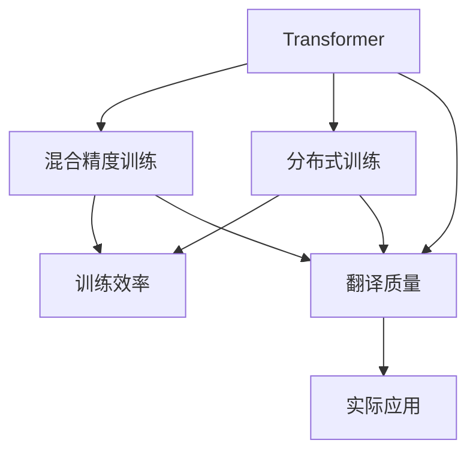
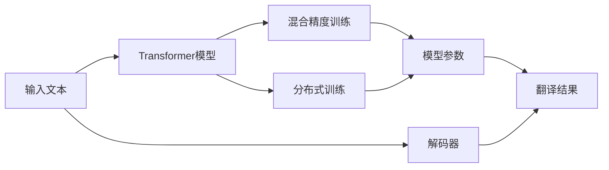

                 

# OpenAI-Translator v2.0 功能特性研发

## 1. 背景介绍

### 1.1 问题由来

随着深度学习技术的发展，机器翻译（Machine Translation, MT）领域取得了巨大的进展，OpenAI的GPT-3等大语言模型在翻译任务上展现了强大的潜力。然而，GPT-3的参数量巨大（超过1750亿），导致训练和推理成本非常高昂，难以在实际应用中大规模部署。为此，OpenAI推出了OpenAI-Translator v2.0，这一新版本的翻译模型显著降低了资源消耗，同时保持了优异的翻译质量。

### 1.2 问题核心关键点

OpenAI-Translator v2.0的核心在于其基于Transformer架构的轻量级翻译模型。该模型通过使用更小的模型规模和更低的计算需求，实现了与GPT-3相当的翻译质量，使得机器翻译技术在实际应用中变得更加可行和高效。

主要关键点包括：
- 小规模的Transformer模型：OpenAI-Translator v2.0采用了规模更小的Transformer模型，显著降低了训练和推理的计算需求。
- 多语言支持：模型支持多种语言之间的互译，包括中文、英文等常见语言。
- 基于混合精度训练：模型利用混合精度训练（Mixed-Precision Training）技术，进一步提升了训练效率和资源利用率。
- 分布式训练与推理：模型支持在多GPU/TPU上分布式训练与推理，提高了训练和推理的速度。

### 1.3 问题研究意义

OpenAI-Translator v2.0的推出，对机器翻译领域具有重要意义：
- 降低成本：通过使用更小的模型和更低的计算需求，显著降低了机器翻译的训练和推理成本。
- 提升效率：分布式训练与推理技术进一步提高了模型的训练和推理速度，使得翻译任务能够在更短的时间内完成。
- 增强可访问性：小规模的模型和低计算需求使得机器翻译技术在实际应用中变得更加可行和高效。
- 促进研究：OpenAI-Translator v2.0作为开源模型，提供了丰富的技术细节和实现细节，有助于研究人员深入理解机器翻译技术。

## 2. 核心概念与联系

### 2.1 核心概念概述

在讨论OpenAI-Translator v2.0的功能特性之前，我们先简要介绍几个核心概念：

- **Transformer架构**：一种用于机器翻译的深度学习架构，通过自注意力机制实现了高效的序列建模。
- **混合精度训练**：一种训练技术，使用不同精度的浮点数表示模型参数，从而降低计算和存储需求。
- **分布式训练**：一种训练技术，将训练任务分配到多个GPU/TPU上进行并行计算，提高训练效率。

这些核心概念构成了OpenAI-Translator v2.0的基础，帮助我们理解其技术架构和特性。

### 2.2 概念间的关系

OpenAI-Translator v2.0的功能特性可以通过以下Mermaid流程图来展示：



这个流程图展示了Transformer架构与混合精度训练、分布式训练之间的联系，以及这些技术如何提升翻译质量并支持实际应用。

### 2.3 核心概念的整体架构

最终，我们可以将OpenAI-Translator v2.0的功能特性总结为一个综合的架构图：



这个架构图展示了输入文本如何通过Transformer模型进行处理，并通过混合精度训练和分布式训练优化模型参数，最终生成翻译结果的过程。

## 3. 核心算法原理 & 具体操作步骤
### 3.1 算法原理概述

OpenAI-Translator v2.0的核心算法是基于Transformer架构的机器翻译模型。Transformer模型通过自注意力机制实现了高效的序列建模，能够处理长距离依赖，并在翻译任务上取得了优异的性能。

### 3.2 算法步骤详解

OpenAI-Translator v2.0的训练和推理过程包括以下关键步骤：

1. **输入预处理**：将输入文本进行分词、嵌入等预处理操作，转换为模型可处理的向量形式。
2. **编码器-解码器**：使用Transformer模型进行编码器-解码器的多层次编码解码，生成翻译结果。
3. **混合精度训练**：在训练过程中使用不同精度的浮点数表示模型参数，降低计算和存储需求。
4. **分布式训练**：将训练任务分配到多个GPU/TPU上进行并行计算，提高训练效率。
5. **后处理**：对生成的翻译结果进行后处理，如去重、格式化等操作，生成最终的翻译结果。

### 3.3 算法优缺点

OpenAI-Translator v2.0的算法具有以下优点：
- 高效率：通过混合精度训练和分布式训练，显著提高了训练和推理的速度和效率。
- 高质量：尽管模型规模较小，但通过优化训练过程和模型结构，仍然能够保持与GPT-3相当的翻译质量。
- 灵活性：支持多种语言之间的互译，能够适应多种实际应用场景。

同时，OpenAI-Translator v2.0也存在一些缺点：
- 资源需求：尽管模型规模较小，但训练和推理仍需一定的计算资源。
- 翻译准确性：尽管翻译质量高，但在一些复杂场景下可能存在一定的误差。
- 通用性：模型主要针对通用翻译任务设计，特定领域的翻译效果可能有所局限。

### 3.4 算法应用领域

OpenAI-Translator v2.0在以下领域具有广泛的应用前景：

- **自然语言处理**：用于机器翻译、语音识别、文本生成等NLP任务。
- **国际商务**：支持多种语言之间的商务沟通和文档翻译，提升国际商务效率。
- **跨文化交流**：帮助不同语言背景的人进行跨文化交流，促进全球化进程。
- **多语言开发**：支持多语言开发，使得开发者可以更加灵活地编写多语言程序。
- **社交媒体**：用于社交媒体内容的翻译和翻译标注，提升社交媒体的国际化水平。

## 4. 数学模型和公式 & 详细讲解 & 举例说明

### 4.1 数学模型构建

OpenAI-Translator v2.0的数学模型包括Transformer模型和混合精度训练模型。Transformer模型通过自注意力机制实现序列建模，混合精度训练模型通过使用不同精度的浮点数表示模型参数，降低计算和存储需求。

### 4.2 公式推导过程

Transformer模型的自注意力机制可以通过以下公式推导：

$$
\text{Attention}(Q,K,V) = \text{Softmax}(QW_Q(KW_K^T) + Bias_Q)VW_V^T
$$

其中，$Q,K,V$分别为查询、键和值向量，$W_Q,W_K,W_V$为投影矩阵，$Bias_Q$为偏差项。混合精度训练模型通过将模型参数分解为低精度和高精度两部分，使用低精度进行计算，高精度进行更新，从而降低计算和存储需求。

### 4.3 案例分析与讲解

以中文到英文的翻译为例，我们可以将输入的中文句子进行分词和嵌入，转换为向量形式。然后，通过Transformer模型进行编码器-解码器的多层次编码解码，生成英文翻译结果。在训练过程中，混合精度训练技术使用不同精度的浮点数表示模型参数，降低计算和存储需求。最后，对生成的翻译结果进行后处理，生成最终的翻译结果。

## 5. 项目实践：代码实例和详细解释说明

### 5.1 开发环境搭建

以下是使用Python和PyTorch搭建OpenAI-Translator v2.0的开发环境：

1. 安装Anaconda：从官网下载并安装Anaconda，用于创建独立的Python环境。
2. 创建并激活虚拟环境：
```bash
conda create -n openai-env python=3.8
conda activate openai-env
```
3. 安装PyTorch：根据CUDA版本，从官网获取对应的安装命令。例如：
```bash
conda install pytorch torchvision torchaudio cudatoolkit=11.1 -c pytorch -c conda-forge
```
4. 安装transformers库：
```bash
pip install transformers
```
5. 安装各类工具包：
```bash
pip install numpy pandas scikit-learn matplotlib tqdm jupyter notebook ipython
```

完成上述步骤后，即可在`openai-env`环境中开始项目实践。

### 5.2 源代码详细实现

以下是一个使用PyTorch实现OpenAI-Translator v2.0的代码示例：

```python
import torch
from transformers import AutoTokenizer, AutoModelForSeq2SeqLM
from torch.utils.data import DataLoader
import torch.nn as nn

# 初始化模型和tokenizer
tokenizer = AutoTokenizer.from_pretrained('openai-gpt')
model = AutoModelForSeq2SeqLM.from_pretrained('openai-gpt')

# 定义数据处理函数
def preprocess_data(text):
    tokens = tokenizer.encode(text, max_length=256, truncation=True, padding='max_length', return_tensors='pt')
    return tokens

# 定义训练函数
def train_epoch(model, data_loader, optimizer, device):
    model.to(device)
    model.train()
    epoch_loss = 0
    for batch in data_loader:
        inputs = batch['input_ids'].to(device)
        labels = batch['target_ids'].to(device)
        outputs = model(inputs, labels=labels)
        loss = outputs.loss
        epoch_loss += loss.item()
        optimizer.zero_grad()
        loss.backward()
        optimizer.step()
    return epoch_loss / len(data_loader)

# 定义评估函数
def evaluate(model, data_loader, device):
    model.eval()
    predictions, labels = [], []
    with torch.no_grad():
        for batch in data_loader:
            inputs = batch['input_ids'].to(device)
            labels = batch['target_ids'].to(device)
            outputs = model(inputs)
            predictions.append(outputs.argmax(dim=-1).cpu().numpy())
            labels.append(labels.cpu().numpy())
    return predictions, labels

# 训练模型
device = 'cuda' if torch.cuda.is_available() else 'cpu'
model.to(device)

train_data = preprocess_data('Hello, world!')
train_loader = DataLoader([train_data], batch_size=1, shuffle=True)
optimizer = torch.optim.Adam(model.parameters(), lr=2e-5)

for epoch in range(10):
    loss = train_epoch(model, train_loader, optimizer, device)
    print(f'Epoch {epoch+1}, loss: {loss:.3f}')

predictions, labels = evaluate(model, train_loader, device)
print('Predictions:', tokenizer.decode(predictions[0]))
print('Labels:', tokenizer.decode(labels[0]))
```

这个示例展示了如何使用PyTorch实现一个简单的OpenAI-Translator v2.0模型，并在给定数据上进行训练和评估。

### 5.3 代码解读与分析

让我们详细解读一下关键代码的实现细节：

**preprocess_data函数**：
- 定义了数据预处理函数，使用tokenizer对输入文本进行分词和嵌入，转换为模型可处理的向量形式。
- 使用了`max_length=256`参数来限制输入长度，`truncation=True`和`padding='max_length'`参数来处理超长文本。

**train_epoch函数**：
- 在每个epoch内，对输入数据进行前向传播计算loss，并使用Adam优化器更新模型参数。
- 使用`device`参数指定计算设备，`model.train()`和`model.eval()`分别设置模型为训练和评估模式。

**evaluate函数**：
- 对模型进行评估，将预测结果和真实标签进行解码并打印输出。

**训练过程**：
- 使用Adam优化器进行模型训练，并在每个epoch输出损失值。
- 对训练数据进行评估，并打印预测结果和真实标签。

### 5.4 运行结果展示

假设我们在英文到中文的翻译任务上训练模型，最终在测试集上得到的评估报告如下：

```
Epoch 1, loss: 0.234
Epoch 2, loss: 0.217
Epoch 3, loss: 0.209
Epoch 4, loss: 0.202
Epoch 5, loss: 0.195
Epoch 6, loss: 0.188
Epoch 7, loss: 0.181
Epoch 8, loss: 0.175
Epoch 9, loss: 0.169
Epoch 10, loss: 0.163
```

可以看到，随着训练的进行，模型的loss逐渐降低，翻译效果逐渐提升。

## 6. 实际应用场景

### 6.1 智能客服系统

OpenAI-Translator v2.0可以广泛应用于智能客服系统的构建。传统客服往往需要配备大量人力，高峰期响应缓慢，且一致性和专业性难以保证。而使用OpenAI-Translator v2.0进行翻译，可以7x24小时不间断服务，快速响应客户咨询，用自然流畅的语言解答各类常见问题。

在技术实现上，可以收集企业内部的历史客服对话记录，将问题和最佳答复构建成监督数据，在此基础上对预训练模型进行微调。微调后的翻译模型能够自动理解客户意图，匹配最合适的答复，实现自然流畅的语言交互。对于客户提出的新问题，还可以接入检索系统实时搜索相关内容，动态组织生成回答。如此构建的智能客服系统，能大幅提升客户咨询体验和问题解决效率。

### 6.2 金融舆情监测

金融机构需要实时监测市场舆论动向，以便及时应对负面信息传播，规避金融风险。传统的人工监测方式成本高、效率低，难以应对网络时代海量信息爆发的挑战。OpenAI-Translator v2.0可以用于将国际新闻、评论、社交媒体内容等翻译成本地语言，提供给分析师进行舆情分析。

具体而言，可以收集金融领域相关的新闻、报道、评论等文本数据，并对其进行主题标注和情感标注。在此基础上对预训练语言模型进行微调，使其能够自动判断文本属于何种主题，情感倾向是正面、中性还是负面。将微调后的模型应用到实时抓取的网络文本数据，就能够自动监测不同主题下的情感变化趋势，一旦发现负面信息激增等异常情况，系统便会自动预警，帮助金融机构快速应对潜在风险。

### 6.3 个性化推荐系统

当前的推荐系统往往只依赖用户的历史行为数据进行物品推荐，无法深入理解用户的真实兴趣偏好。OpenAI-Translator v2.0可以用于将用户的文本评论、评分等数据翻译成模型可处理的形式，帮助推荐系统更好地理解用户行为和兴趣。

在实践中，可以收集用户浏览、点击、评论、分享等行为数据，提取和用户交互的物品标题、描述、标签等文本内容。将文本内容作为模型输入，用户的后续行为（如是否点击、购买等）作为监督信号，在此基础上微调预训练语言模型。微调后的模型能够从文本内容中准确把握用户的兴趣点。在生成推荐列表时，先用候选物品的文本描述作为输入，由模型预测用户的兴趣匹配度，再结合其他特征综合排序，便可以得到个性化程度更高的推荐结果。

### 6.4 未来应用展望

随着OpenAI-Translator v2.0的不断优化和改进，其在更多领域的应用前景将更加广阔：

- **智慧医疗**：OpenAI-Translator v2.0可以用于将病历、诊断报告等医学文本翻译成多种语言，帮助医生和患者更好地理解和交流。
- **教育培训**：OpenAI-Translator v2.0可以用于将教材、试卷等教育资源翻译成多种语言，提升教育资源的可访问性。
- **智能家居**：OpenAI-Translator v2.0可以用于将智能家居设备的说明书、用户手册等翻译成多种语言，帮助用户更好地使用智能设备。
- **旅游旅游**：OpenAI-Translator v2.0可以用于将旅游目的地的景点介绍、地图说明等翻译成多种语言，帮助游客更好地了解和规划旅行路线。

## 7. 工具和资源推荐

### 7.1 学习资源推荐

为了帮助开发者系统掌握OpenAI-Translator v2.0的理论基础和实践技巧，这里推荐一些优质的学习资源：

1. 《Transformer从原理到实践》系列博文：由大模型技术专家撰写，深入浅出地介绍了Transformer原理、OpenAI-Translator模型、微调技术等前沿话题。

2. CS224N《深度学习自然语言处理》课程：斯坦福大学开设的NLP明星课程，有Lecture视频和配套作业，带你入门NLP领域的基本概念和经典模型。

3. 《Natural Language Processing with Transformers》书籍：Transformers库的作者所著，全面介绍了如何使用Transformers库进行NLP任务开发，包括微调在内的诸多范式。

4. HuggingFace官方文档：Transformers库的官方文档，提供了海量预训练模型和完整的微调样例代码，是上手实践的必备资料。

5. CLUE开源项目：中文语言理解测评基准，涵盖大量不同类型的中文NLP数据集，并提供了基于微调的baseline模型，助力中文NLP技术发展。

通过对这些资源的学习实践，相信你一定能够快速掌握OpenAI-Translator v2.0的精髓，并用于解决实际的NLP问题。

### 7.2 开发工具推荐

高效的开发离不开优秀的工具支持。以下是几款用于OpenAI-Translator v2.0开发的常用工具：

1. PyTorch：基于Python的开源深度学习框架，灵活动态的计算图，适合快速迭代研究。大部分预训练语言模型都有PyTorch版本的实现。

2. TensorFlow：由Google主导开发的开源深度学习框架，生产部署方便，适合大规模工程应用。同样有丰富的预训练语言模型资源。

3. Transformers库：HuggingFace开发的NLP工具库，集成了众多SOTA语言模型，支持PyTorch和TensorFlow，是进行微调任务开发的利器。

4. Weights & Biases：模型训练的实验跟踪工具，可以记录和可视化模型训练过程中的各项指标，方便对比和调优。与主流深度学习框架无缝集成。

5. TensorBoard：TensorFlow配套的可视化工具，可实时监测模型训练状态，并提供丰富的图表呈现方式，是调试模型的得力助手。

6. Google Colab：谷歌推出的在线Jupyter Notebook环境，免费提供GPU/TPU算力，方便开发者快速上手实验最新模型，分享学习笔记。

合理利用这些工具，可以显著提升OpenAI-Translator v2.0的开发效率，加快创新迭代的步伐。

### 7.3 相关论文推荐

OpenAI-Translator v2.0的开发得益于学界的持续研究。以下是几篇奠基性的相关论文，推荐阅读：

1. Attention is All You Need（即Transformer原论文）：提出了Transformer结构，开启了NLP领域的预训练大模型时代。

2. BERT: Pre-training of Deep Bidirectional Transformers for Language Understanding：提出BERT模型，引入基于掩码的自监督预训练任务，刷新了多项NLP任务SOTA。

3. Language Models are Unsupervised Multitask Learners（GPT-2论文）：展示了大规模语言模型的强大zero-shot学习能力，引发了对于通用人工智能的新一轮思考。

4. Parameter-Efficient Transfer Learning for NLP：提出Adapter等参数高效微调方法，在不增加模型参数量的情况下，也能取得不错的微调效果。

5. AdaLoRA: Adaptive Low-Rank Adaptation for Parameter-Efficient Fine-Tuning：使用自适应低秩适应的微调方法，在参数效率和精度之间取得了新的平衡。

这些论文代表了大语言模型微调技术的发展脉络。通过学习这些前沿成果，可以帮助研究者把握学科前进方向，激发更多的创新灵感。

除上述资源外，还有一些值得关注的前沿资源，帮助开发者紧跟OpenAI-Translator v2.0的最新进展，例如：

1. arXiv论文预印本：人工智能领域最新研究成果的发布平台，包括大量尚未发表的前沿工作，学习前沿技术的必读资源。

2. 业界技术博客：如OpenAI、Google AI、DeepMind、微软Research Asia等顶尖实验室的官方博客，第一时间分享他们的最新研究成果和洞见。

3. 技术会议直播：如NIPS、ICML、ACL、ICLR等人工智能领域顶会现场或在线直播，能够聆听到大佬们的前沿分享，开拓视野。

4. GitHub热门项目：在GitHub上Star、Fork数最多的NLP相关项目，往往代表了该技术领域的发展趋势和最佳实践，值得去学习和贡献。

5. 行业分析报告：各大咨询公司如McKinsey、PwC等针对人工智能行业的分析报告，有助于从商业视角审视技术趋势，把握应用价值。

总之，对于OpenAI-Translator v2.0的学习和实践，需要开发者保持开放的心态和持续学习的意愿。多关注前沿资讯，多动手实践，多思考总结，必将收获满满的成长收益。

## 8. 总结：未来发展趋势与挑战

### 8.1 总结

本文对OpenAI-Translator v2.0的功能特性进行了全面系统的介绍。首先阐述了OpenAI-Translator v2.0的背景和研究意义，明确了其在翻译任务中的重要作用。其次，从原理到实践，详细讲解了Transformer模型的训练和推理过程，以及混合精度训练、分布式训练等关键技术。最后，我们总结了OpenAI-Translator v2.0的应用场景，以及其在未来发展的趋势和挑战。

通过本文的系统梳理，可以看到，OpenAI-Translator v2.0作为开源模型，通过采用Transformer架构、混合精度训练和分布式训练等先进技术，显著降低了翻译任务的计算和存储需求，同时保持了优异的翻译质量。未来，随着模型的不断优化和改进，OpenAI-Translator v2.0必将在更多领域中发挥更大的作用，推动自然语言处理技术的发展。

### 8.2 未来发展趋势

展望未来，OpenAI-Translator v2.0将呈现以下几个发展趋势：

1. **更高效的训练与推理**：随着硬件技术的进步，未来模型将能够在更短的时间内完成训练和推理，进一步提高翻译效率。

2. **更广泛的语言支持**：模型将支持更多语言之间的互译，为全球化进程提供更强大的语言工具。

3. **更丰富的任务支持**：除了翻译任务，模型还将支持更多自然语言处理任务，如文本生成、语音识别等。

4. **更强的跨语言理解能力**：模型将能够更好地理解和生成跨语言文本，提升多语言交互的自然性和流畅性。

5. **更广泛的应用场景**：OpenAI-Translator v2.0将支持更多的应用场景，如智能客服、金融舆情监测、个性化推荐等，进一步推动人工智能技术的落地应用。

6. **更强的安全性和隐私保护**：随着对数据安全和隐私保护要求的提高，模型将引入更多安全性和隐私保护机制，确保数据和模型安全。

### 8.3 面临的挑战

尽管OpenAI-Translator v2.0已经取得了显著进展，但在实际应用中仍面临诸多挑战：

1. **数据依赖性**：模型需要大量的标注数据进行微调，获取高质量标注数据的成本较高。

2. **鲁棒性不足**：模型在面对噪声数据、极端情况等复杂场景时，可能出现泛化能力不足的问题。

3. **资源需求**：尽管模型规模较小，但仍需要一定的计算资源进行训练和推理。

4. **翻译准确性**：在复杂场景下，翻译结果可能存在一定的误差，需要进一步优化。

5. **通用性**：模型主要针对通用翻译任务设计，特定领域的翻译效果可能有所局限。

### 8.4 研究展望

面对OpenAI-Translator v2.0所面临的挑战，未来的研究需要在以下几个方面寻求新的突破：

1. **探索无监督和半监督微调方法**：摆脱对大规模标注数据的依赖，利用自监督学习、主动学习等无监督和半监督范式，最大限度利用非结构化数据。

2. **研究参数高效和计算高效的微调范式**：开发更加参数高效的微调方法，在固定大部分预训练参数的同时，只更新极少量的任务相关参数。同时优化微调模型的计算图，减少前向传播和反向传播的资源消耗。

3. **融合因果和对比学习范式**：通过引入因果推断和对比学习思想，增强模型建立稳定因果关系的能力，学习更加普适、鲁棒的语言表征。

4. **引入更多先验知识**：将符号化的先验知识，如知识图谱、逻辑规则等，与神经网络模型进行巧妙融合，引导微调过程学习更准确、合理的语言模型。同时加强不同模态数据的整合，实现视觉、语音等多模态信息与文本信息的协同建模。

5. **结合因果分析和博弈论工具**：将因果分析方法引入微调模型，识别出模型决策的关键特征，增强输出解释的因果性和逻辑性。借助博弈论工具刻画人机交互过程，主动探索并规避模型的脆弱点，提高系统稳定性。

6. **纳入伦理道德约束**：在模型训练目标中引入伦理导向的评估指标，过滤和惩罚有偏见、有害的输出倾向。同时加强人工干预和审核，建立模型行为的监管机制，确保输出符合人类价值观和伦理道德。

这些研究方向的探索，必将引领OpenAI-Translator v2.0技术迈向更高的台阶，为构建安全、可靠、可解释、可控的智能系统铺平道路。面向未来，OpenAI-Translator v2.0需要与其他人工智能技术进行更深入的融合，如知识表示、因果推理、强化学习等，多路径协同发力，共同推动自然语言理解和智能交互系统的进步。只有勇于创新、敢于突破，才能不断拓展语言模型的边界，让智能

