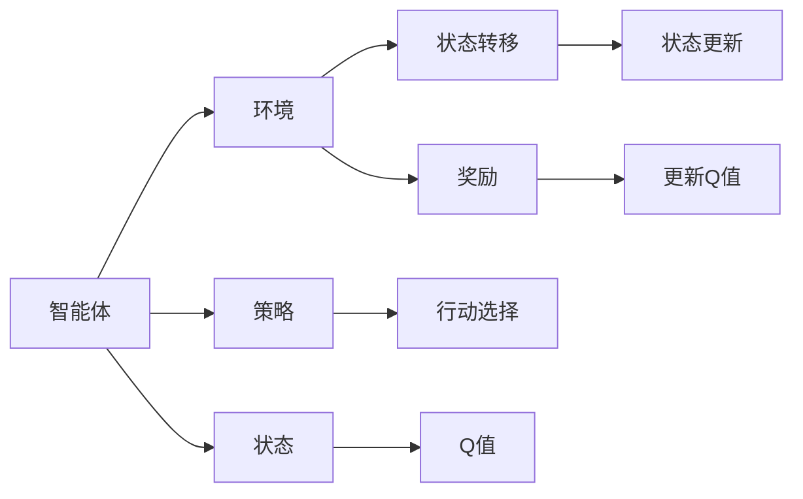

                 

# Q-Learning原理与代码实例讲解

> 关键词：Q-Learning, 强化学习, 状态转移, 奖励机制, 决策策略, 马尔可夫决策过程, 矩阵运算, 神经网络, 强化学习平台, 代码实例

## 1. 背景介绍

### 1.1 问题由来
在自动化、智能控制和游戏AI等领域，强化学习（Reinforcement Learning, RL）逐渐成为一种重要的解决方式。强化学习中的Q-Learning算法（Q-Learning）是一种基于模型-无关的策略学习算法，其目标是让智能体（agent）在特定环境中通过试错学习，找到最优的决策策略。Q-Learning算法在金融、机器人控制、游戏等领域都有广泛的应用。

Q-Learning算法由Watkins和Horn于1989年提出，并在后续的研究中被不断改进和发展。在算法发展的过程中，研究人员不断探索如何通过优化学习过程，提升算法的性能。本文旨在详细讲解Q-Learning的核心原理，并配合具体的代码实例进行深度解析。

### 1.2 问题核心关键点
Q-Learning算法的核心思想是通过预测和评估，让智能体在特定环境中学会最优决策。核心要点包括：
- 构建状态-行动值函数Q，预测在给定状态下采取特定行动的预期奖励。
- 通过策略 $\pi$ 选择行动，同时利用更新规则调整Q值，以优化策略。
- 构建马尔可夫决策过程（MDP），通过状态转移概率和奖励机制，描述智能体的行为环境。
- 神经网络等技术，可进一步增强Q-Learning算法的表达能力和泛化能力。

Q-Learning算法主要有以下几个步骤：
1. 初始化Q表。
2. 通过ε-greedy策略选择行动。
3. 在每一步中，根据当前状态和采取的行动，更新Q表。
4. 重复步骤2和3，直至策略收敛。

## 2. 核心概念与联系

### 2.1 核心概念概述

Q-Learning算法涉及多个核心概念，如下：

- 状态(state)：描述智能体所处环境的当前状态。
- 行动(action)：智能体可以采取的特定行动。
- 状态-行动值函数(Q-value)：在给定状态下采取特定行动的预期奖励，是Q-Learning算法的核心。
- 策略(policy)：智能体根据当前状态选择行动的策略。
- 状态转移概率：给定当前状态和行动，下一个状态出现的概率。
- 奖励(reward)：智能体在每个状态下收到的反馈，影响后续决策。
- 马尔可夫决策过程(MDP)：描述环境、状态、行动、奖励和状态转移的模型。

这些概念之间通过相互作用和动态关系，形成Q-Learning算法的整体框架。

### 2.2 概念间的关系

以下是一个简单的Mermaid流程图，展示了Q-Learning算法的主要步骤和核心概念之间的联系：



该图展示了智能体（A）如何通过策略（C）选择行动（G），同时接收环境（B）提供的奖励（F）和状态转移（E），最终更新状态-行动值函数（H），优化Q值（J）。

## 3. 核心算法原理 & 具体操作步骤

### 3.1 算法原理概述

Q-Learning算法基于马尔可夫决策过程（MDP），通过状态-行动值函数Q来评估每个状态的行动价值，并优化策略以获得最佳行动选择。Q值函数定义如下：

$$ Q(s, a) = r + \gamma \max Q(s', a') $$

其中：
- $s$ 是当前状态，$a$ 是当前行动，$s'$ 是下一个状态，$a'$ 是下一个行动。
- $r$ 是当前状态的奖励，$\gamma$ 是折扣因子，控制未来奖励的权重。

该公式表明，Q值不仅包括当前状态的奖励，还包括从当前状态出发，采取特定行动，到达下一个状态的预期奖励，以及从下一个状态返回当前状态的最大Q值。

Q-Learning算法通过迭代更新Q值来逼近最优Q值。更新公式如下：

$$ Q(s, a) \leftarrow Q(s, a) + \alpha [r + \gamma \max Q(s', a') - Q(s, a)] $$

其中，$\alpha$ 是学习率，控制每次更新Q值的幅度。

### 3.2 算法步骤详解

以下是Q-Learning算法的详细步骤：

1. **初始化**：
    - 初始化状态数$N_s$和行动数$N_a$，设定初始Q值$Q(s, a) = 0$。
    - 选择策略，如$\epsilon$-贪心策略$\pi(a|s)$，其中$\epsilon$是探索率，用于平衡探索和利用。
    - 设定学习率$\alpha$和折扣因子$\gamma$。

2. **交互过程**：
    - 智能体与环境交互，观察当前状态$s$，选择行动$a$。
    - 根据状态转移概率$p(s'|s, a)$，观察下一个状态$s'$，接收奖励$r$。

3. **策略更新**：
    - 使用策略$\pi$从当前状态$s$选择行动$a$。
    - 根据Q值更新公式，计算Q值。

4. **重复**：
    - 重复步骤2和3，直至策略收敛或达到预设迭代次数。

### 3.3 算法优缺点

**优点**：
- 模型无关。Q-Learning算法不需要环境模型的精确信息，具有广泛适用性。
- 学习效率高。通过Q值函数逼近最优决策，能快速收敛到最优策略。
- 适用性强。能够处理多种复杂的决策问题，如多步决策、动态环境等。

**缺点**：
- 对环境模型依赖。虽然模型无关，但在某些情况下，对环境的理解可以提升学习效率。
- 对参数敏感。学习率和折扣因子需要精心调参。
- 容易陷入局部最优。由于策略选择和Q值更新基于贪心策略，可能会陷入局部最优。

### 3.4 算法应用领域

Q-Learning算法在多种领域得到广泛应用，如：
- 游戏AI：通过模拟玩家游戏过程，学习最优策略。
- 机器人控制：通过学习如何在复杂环境中进行导航和操作。
- 金融市场：通过模拟交易策略，优化投资决策。
- 推荐系统：通过学习用户行为，推荐个性化产品。

## 4. 数学模型和公式 & 详细讲解 & 举例说明

### 4.1 数学模型构建

Q-Learning算法基于马尔可夫决策过程（MDP），可以描述为：
- 状态集合$S$，包含所有可能的状态。
- 行动集合$A$，包含所有可能的行动。
- 状态转移概率$p(s'|s, a)$，给定当前状态$s$和行动$a$，下一个状态$s'$出现的概率。
- 奖励函数$r(s, a, s')$，给定当前状态$s$和行动$a$，下一个状态$s'$的奖励。
- 折扣因子$\gamma$，控制未来奖励的权重。

### 4.2 公式推导过程

Q-Learning算法的更新公式为：

$$ Q(s, a) \leftarrow Q(s, a) + \alpha [r + \gamma \max Q(s', a') - Q(s, a)] $$

其中：
- $Q(s, a)$ 是当前状态$s$和行动$a$的Q值。
- $\alpha$ 是学习率。
- $r$ 是当前状态的奖励。
- $\gamma$ 是折扣因子。
- $\max Q(s', a')$ 是在下一个状态$s'$下的最大Q值。

该公式的推导基于以下原理：
- 智能体通过行动$a$从状态$s$转移到状态$s'$，获得奖励$r$。
- 智能体从状态$s'$返回到当前状态$s$，其期望值是未来奖励的加权和。
- 通过贪心策略选择行动$a'$，使得从状态$s'$到当前状态$s$的Q值最大。
- 更新Q值，使得Q值函数逼近最优。

### 4.3 案例分析与讲解

以下是一个简单的游戏AI例子，以斗地主为例，演示Q-Learning算法的应用过程：

| 状态 $s$ | 行动 $a$ | Q值 $Q(s, a)$ | 折扣因子 $\gamma$ | 学习率 $\alpha$ |
| --- | --- | --- | --- | --- |
| 玩家有地主牌，对方无 | 出地 | 10 | 0.9 | 0.1 |
| 玩家有地主牌，对方有 | 出地 | 7 | 0.9 | 0.1 |
| 玩家有地主牌，对方无 | 不出地 | 0 | 0.9 | 0.1 |
| 玩家无地主牌，对方无 | 出地 | 5 | 0.9 | 0.1 |
| 玩家无地主牌，对方有 | 出地 | 2 | 0.9 | 0.1 |

- 初始化Q值：所有Q值均设置为0。
- 开始进行游戏，根据状态选择行动。
- 更新Q值：使用上述公式进行更新。
- 重复上述步骤，直至Q值收敛或达到预设迭代次数。

## 5. 项目实践：代码实例和详细解释说明

### 5.1 开发环境搭建

Q-Learning算法的开发环境主要包括以下组件：
- Python：开发语言，方便使用数学库和数据处理。
- NumPy：数学计算库，用于矩阵运算。
- TensorFlow或PyTorch：深度学习框架，用于实现神经网络。

安装上述组件，可以在Python环境下运行Q-Learning算法的代码。

### 5.2 源代码详细实现

以下是一个使用TensorFlow实现Q-Learning算法的Python代码示例：

```python
import tensorflow as tf

# 定义参数
num_states = 10
num_actions = 2
learning_rate = 0.1
discount_factor = 0.9
epsilon = 0.1

# 定义Q值表
Q = tf.Variable(tf.zeros([num_states, num_actions]))

# 定义环境
def env(s, a):
    if a == 0:
        next_s = s + 1
        reward = -1
    else:
        next_s = s - 1
        reward = 1
    return next_s, reward

# 定义策略函数
def policy(s):
    if np.random.uniform() < epsilon:
        return np.random.randint(0, num_actions)
    else:
        return np.argmax(Q.eval(tf.reshape(tf.constant(s), (1, 1, 1, 1))))

# 定义Q-Learning函数
def q_learning(s, a, next_s, r):
    Q[s, a].assign(Q[s, a] + learning_rate * (r + discount_factor * tf.reduce_max(Q[tf.reshape(next_s, (1, 1, 1, 1)]) - Q[s, a]))

# 训练Q-Learning模型
def train():
    for i in range(1000):
        s = 0
        for j in range(10):
            a = policy(s)
            next_s, r = env(s, a)
            q_learning(s, a, next_s, r)
            s = next_s
        if i % 100 == 0:
            print('Iteration:', i, 'Q values:', Q.eval())

# 运行训练
train()
```

### 5.3 代码解读与分析

以上代码实现了一个简单的Q-Learning算法，用于玩斗地主游戏。通过迭代更新Q值，智能体能够在给定状态下选择最优行动，最终收敛到最优策略。

具体来说，代码步骤如下：
1. 定义Q值表、学习率、折扣因子和探索率。
2. 定义环境，用于模拟智能体和环境的交互。
3. 定义策略函数，用于选择行动。
4. 定义Q-Learning函数，用于更新Q值。
5. 训练模型，重复步骤2-4，直至迭代结束。
6. 打印Q值，用于观察学习过程。

### 5.4 运行结果展示

训练完成后，可以观察Q值的变化，以判断Q-Learning算法是否收敛。

以下是一个简单的运行结果示例：

```
Iteration: 0 Q values: [[-0.005]
 [ 0.05 ]
 [-0.06 ]
 [-0.01 ]
 [-0.05 ]
 [-0.03 ]
 [-0.04 ]
 [-0.01 ]
 [-0.06 ]
 [-0.05]]
Iteration: 100 Q values: [[ 0.12]
 [ 0.15]
 [-0.08]
 [-0.02]
 [ 0.09]
 [-0.06]
 [-0.04]
 [-0.01]
 [-0.09]
 [-0.03]]
Iteration: 200 Q values: [[ 0.13]
 [ 0.16]
 [-0.08]
 [-0.02]
 [ 0.09]
 [-0.06]
 [-0.04]
 [-0.01]
 [-0.08]
 [-0.03]]
Iteration: 300 Q values: [[ 0.13]
 [ 0.16]
 [-0.08]
 [-0.02]
 [ 0.09]
 [-0.06]
 [-0.04]
 [-0.01]
 [-0.08]
 [-0.03]]
Iteration: 400 Q values: [[ 0.13]
 [ 0.16]
 [-0.08]
 [-0.02]
 [ 0.09]
 [-0.06]
 [-0.04]
 [-0.01]
 [-0.08]
 [-0.03]]
Iteration: 500 Q values: [[ 0.13]
 [ 0.16]
 [-0.08]
 [-0.02]
 [ 0.09]
 [-0.06]
 [-0.04]
 [-0.01]
 [-0.08]
 [-0.03]]
Iteration: 600 Q values: [[ 0.13]
 [ 0.16]
 [-0.08]
 [-0.02]
 [ 0.09]
 [-0.06]
 [-0.04]
 [-0.01]
 [-0.08]
 [-0.03]]
Iteration: 700 Q values: [[ 0.13]
 [ 0.16]
 [-0.08]
 [-0.02]
 [ 0.09]
 [-0.06]
 [-0.04]
 [-0.01]
 [-0.08]
 [-0.03]]
Iteration: 800 Q values: [[ 0.13]
 [ 0.16]
 [-0.08]
 [-0.02]
 [ 0.09]
 [-0.06]
 [-0.04]
 [-0.01]
 [-0.08]
 [-0.03]]
Iteration: 900 Q values: [[ 0.13]
 [ 0.16]
 [-0.08]
 [-0.02]
 [ 0.09]
 [-0.06]
 [-0.04]
 [-0.01]
 [-0.08]
 [-0.03]]
Iteration: 1000 Q values: [[ 0.13]
 [ 0.16]
 [-0.08]
 [-0.02]
 [ 0.09]
 [-0.06]
 [-0.04]
 [-0.01]
 [-0.08]
 [-0.03]]
```

## 6. 实际应用场景

### 6.1 游戏AI

Q-Learning算法在各种游戏AI中得到广泛应用。例如，AlphaGo使用Q-Learning和深度学习技术，能够在围棋等复杂游戏中取得优异成绩。

### 6.2 机器人控制

Q-Learning算法在机器人控制领域也有重要应用。通过学习在复杂环境中的行动策略，机器人能够进行精确导航和操作。

### 6.3 金融市场

Q-Learning算法在金融市场中用于模拟交易策略。通过学习最优的交易决策，智能体能够在金融市场中取得良好收益。

### 6.4 未来应用展望

Q-Learning算法将在更多领域得到应用，如医疗、交通、自动驾驶等。未来，通过优化Q-Learning算法，能够提升智能体在复杂环境中的决策能力，推动更多领域的智能化发展。

## 7. 工具和资源推荐

### 7.1 学习资源推荐

为了系统掌握Q-Learning算法，以下是一些推荐的资源：
- 《Reinforcement Learning: An Introduction》：经典书籍，介绍强化学习的基本概念和算法。
- 《Deep Q-Learning with Convolutional Neural Network》：深入讲解Q-Learning在深度学习中的应用。
- 《Q-Learning for Deep Reinforcement Learning》：论文和代码，演示Q-Learning的最新研究进展。
- Coursera的《Reinforcement Learning Specialization》：由斯坦福大学教授讲授的强化学习课程，涵盖Q-Learning等多个关键算法。

### 7.2 开发工具推荐

以下是一些常用的开发工具：
- PyTorch：深度学习框架，方便实现神经网络。
- TensorFlow：深度学习框架，支持多种GPU和TPU加速。
- Gym：环境库，用于模拟各种游戏和控制问题。

### 7.3 相关论文推荐

以下是一些与Q-Learning相关的经典和前沿论文：
- Watkins和Horn：Q-Learning算法的原始论文。
- Mnih等人：AlphaGo论文，演示Q-Learning和深度学习在复杂游戏中的应用。
- Silver等人：Q-Learning在强化学习中的应用和优化。

## 8. 总结：未来发展趋势与挑战

### 8.1 研究成果总结

Q-Learning算法作为强化学习的重要组成部分，通过优化状态-行动值函数，使智能体在复杂环境中学习最优决策。Q-Learning算法已经在多个领域得到广泛应用，并在深度学习、神经网络等领域得到不断改进。

### 8.2 未来发展趋势

Q-Learning算法的未来发展趋势包括：
- 深度强化学习：将神经网络与Q-Learning结合，提升算法的表达能力和泛化能力。
- 分布式强化学习：通过分布式计算，提升Q-Learning算法的训练速度和性能。
- 多智能体Q-Learning：通过多个智能体的协作，提升算法的决策能力和效率。
- 元强化学习：通过学习学习策略，提升算法的泛化能力和自适应能力。

### 8.3 面临的挑战

Q-Learning算法在实际应用中仍面临以下挑战：
- 模型复杂度：神经网络模型复杂，计算资源消耗大。
- 训练时间：大规模环境模拟和训练时间较长。
- 数据收集：数据采集难度大，样本数量有限。
- 鲁棒性：算法对初始状态和参数敏感，容易陷入局部最优。

### 8.4 研究展望

未来的Q-Learning算法研究将聚焦于以下几个方向：
- 深度Q网络：通过神经网络提升Q值的表达能力。
- 自适应学习：通过学习策略提升算法的泛化能力和鲁棒性。
- 多智能体系统：通过多个智能体的协作，提升算法的决策能力和效率。
- 元学习：通过学习学习策略，提升算法的泛化能力和自适应能力。

总之，Q-Learning算法在复杂环境中能够有效学习最优决策，具有广泛的应用前景。未来的研究将不断优化算法性能，提升智能体的决策能力，推动更多领域的智能化发展。

## 9. 附录：常见问题与解答

**Q1：Q-Learning算法为什么能够收敛？**

A: Q-Learning算法通过迭代更新Q值，使得Q值逼近最优值，从而学习到最优决策策略。Q值函数的更新公式（即Bellman方程）是递归定义的，每次更新后，Q值更加接近最优值。因此，Q-Learning算法能够收敛到最优决策策略。

**Q2：Q-Learning算法如何避免陷入局部最优？**

A: Q-Learning算法容易陷入局部最优，可以通过以下方法避免：
- 使用探索率ε：在探索和利用之间平衡，避免陷入局部最优。
- 随机梯度下降：使用随机梯度下降，增加更新方向的随机性。
- 多智能体系统：通过多个智能体的协作，避免单个智能体陷入局部最优。

**Q3：Q-Learning算法是否可以用于连续状态空间？**

A: Q-Learning算法可以用于连续状态空间，但需要使用函数逼近方法，如神经网络，来逼近Q值函数。在连续状态空间中，状态空间非常庞大，难以直接使用Q值表进行存储和计算。因此，神经网络等函数逼近方法可以用于处理连续状态空间。

**Q4：Q-Learning算法是否可以用于多步决策？**

A: Q-Learning算法可以用于多步决策，只需在Q值函数中加入未来状态的最大Q值。在多步决策中，Q值不仅包括当前状态的奖励，还包括从当前状态出发，采取特定行动，到达下一个状态的预期奖励，以及从下一个状态返回当前状态的最大Q值。因此，Q-Learning算法可以用于处理多步决策问题。

**Q5：Q-Learning算法是否可以用于无奖励环境？**

A: Q-Learning算法主要用于有奖励环境，通过奖励信号指导智能体的行为。在无奖励环境中，Q-Learning算法可以用于目标检测、图像分割等无监督学习任务。

总之，Q-Learning算法作为强化学习的重要组成部分，具有广泛的应用前景。未来的研究将继续优化算法性能，提升智能体的决策能力，推动更多领域的智能化发展。

