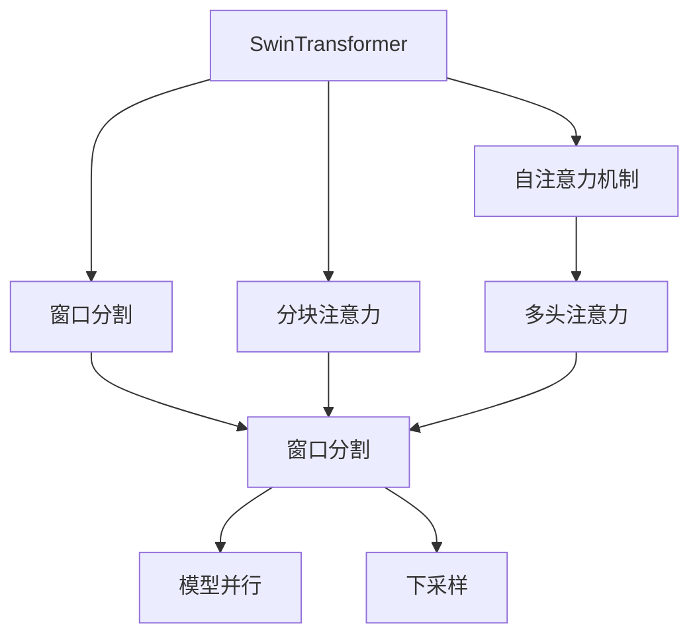
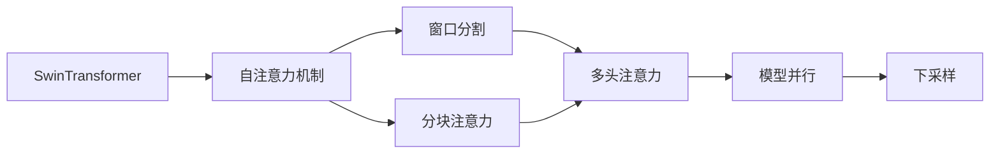
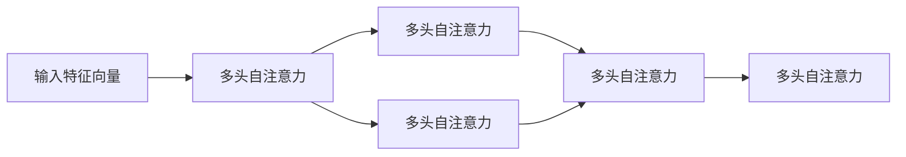
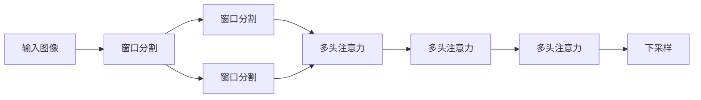
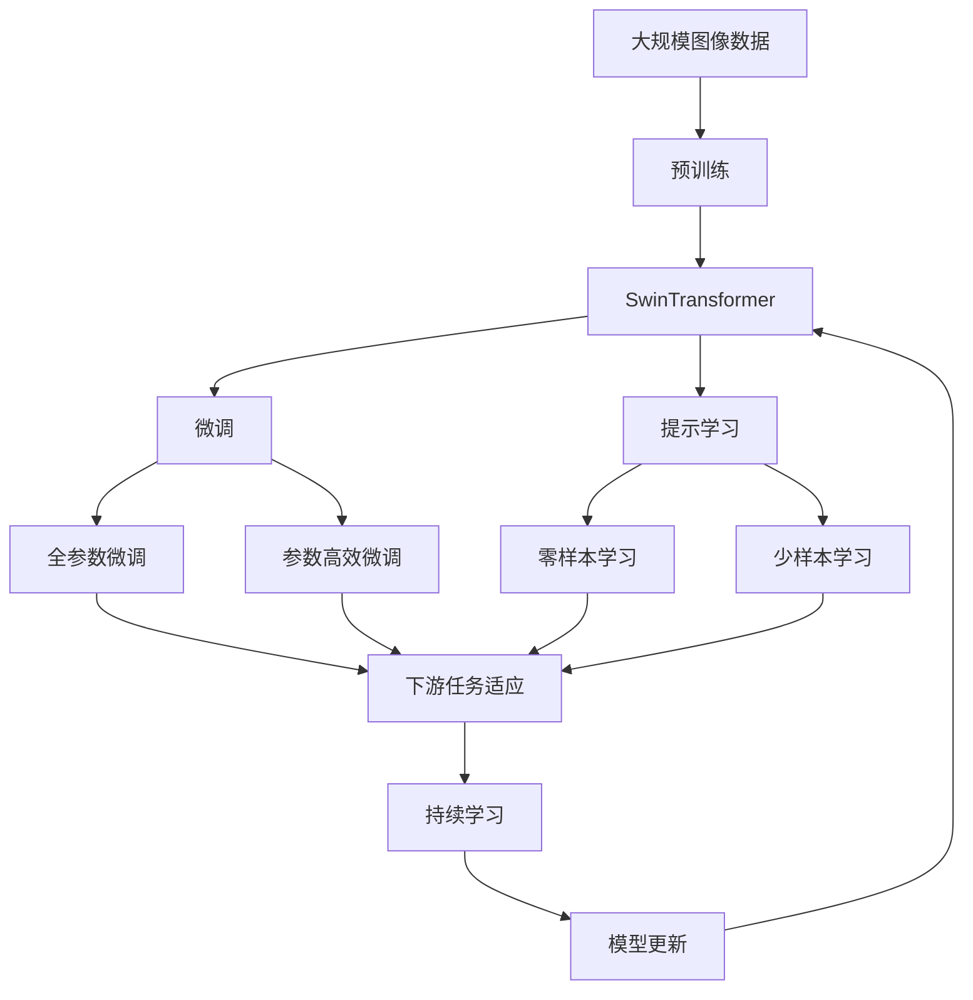

                 

# SwinTransformer原理与代码实例讲解

> 关键词：SwinTransformer, 自注意力机制, 窗口注意力机制, 窗口分割, 模型并行, Swin Transformer代码实现

## 1. 背景介绍

### 1.1 问题由来

随着深度学习在计算机视觉领域的应用不断扩展，卷积神经网络（CNN）在图像识别、物体检测等任务中逐渐显露出其局限性。首先，CNN只能捕捉局部空间特征，难以处理全局信息；其次，CNN在处理大规模图像时，计算量巨大，难以高效训练和推理。而Transformer系列模型凭借其自注意力机制，在处理长序列、捕捉全局信息方面表现出色，逐渐成为计算机视觉领域的主流模型。

然而，Transformer模型在图像处理中存在一个问题，即需要计算整个图像的自注意力权重，这在大规模图像上会导致计算复杂度指数级增加。针对这一问题，SwinTransformer模型应运而生，通过窗口分割和分块注意力机制，在确保Transformer优势的同时，显著降低了计算复杂度。

### 1.2 问题核心关键点

SwinTransformer的核心思想是在保留Transformer自注意力机制的同时，通过窗口分割和分块注意力机制，将计算量从全图降低到局部窗口。SwinTransformer模型架构巧妙，结合了Transformer的自注意力机制与卷积网络的空间局部性，在保证模型性能的同时，极大提升了计算效率。

具体来说，SwinTransformer模型分为如下几个关键步骤：

1. 将输入图像划分为若干个非重叠窗口。
2. 在每个窗口中进行自注意力计算。
3. 将窗口间的特征信息进行交互，通过多头注意力机制融合特征。
4. 对各窗口特征进行最后一层全图自注意力计算。
5. 对输出进行下采样，获得最终特征图。

### 1.3 问题研究意义

SwinTransformer模型作为Transformer系列模型的一种重要变体，通过窗口分割和分块注意力机制，显著提升了计算机视觉任务的计算效率和模型性能。其核心思想简单高效，易于实现和部署，对计算机视觉领域的大规模图像处理任务具有重要意义。

1. 降低计算成本：SwinTransformer模型通过窗口分割和分块注意力机制，将计算量降低到局部窗口，显著减少了深度学习模型在计算资源上的需求。
2. 提升模型性能：SwinTransformer模型在保持Transformer优势的同时，结合了卷积网络的空间局部性，使其在图像识别、物体检测等任务上表现出色。
3. 应用广泛：SwinTransformer模型可以应用于各种计算机视觉任务，如图像分类、目标检测、语义分割等。
4. 算法创新：SwinTransformer模型通过窗口分割和分块注意力机制，创新性地解决了Transformer在大规模图像处理中的计算复杂度问题。
5. 模型泛化：SwinTransformer模型在不同规模和类型的图像数据上表现稳定，具有良好的泛化能力。

## 2. 核心概念与联系

### 2.1 核心概念概述

为更好地理解SwinTransformer模型，本节将介绍几个密切相关的核心概念：

- SwinTransformer：一种基于窗口分割和分块注意力机制的Transformer模型，用于大规模图像处理任务。
- 自注意力机制（Self-Attention Mechanism）：Transformer模型中的关键技术，通过计算输入序列中每个位置的权重，实现序列的自相关性建模。
- 窗口分割（Window Partitioning）：将输入图像划分为若干个非重叠窗口，并在每个窗口中进行注意力计算，以降低计算复杂度。
- 分块注意力（Block Attention）：SwinTransformer模型中的关键技术，通过将窗口间的特征信息进行交互，利用多头注意力机制融合特征，提升模型性能。
- 模型并行（Model Parallelism）：通过将模型拆分为多个并行部分，并在不同的设备上同时进行计算，提升计算效率。
- 下采样（Downsampling）：通过对输出特征图进行降采样操作，减少计算量和存储空间。

这些核心概念之间的逻辑关系可以通过以下Mermaid流程图来展示：



这个流程图展示了大模型中核心概念之间的关系：

1. SwinTransformer模型通过自注意力机制和分块注意力机制实现特征建模。
2. 窗口分割将大图划分为若干个窗口，减少计算量。
3. 分块注意力机制将窗口间的特征信息进行交互，融合特征。
4. 模型并行和下采样技术进一步提升计算效率和模型性能。

### 2.2 概念间的关系

这些核心概念之间存在着紧密的联系，形成了SwinTransformer模型的完整生态系统。下面我们通过几个Mermaid流程图来展示这些概念之间的关系。

#### 2.2.1 SwinTransformer的整体架构



这个流程图展示了SwinTransformer模型的整体架构：

1. SwinTransformer模型通过自注意力机制和分块注意力机制实现特征建模。
2. 窗口分割将大图划分为若干个窗口，减少计算量。
3. 分块注意力机制将窗口间的特征信息进行交互，融合特征。
4. 模型并行和下采样技术进一步提升计算效率和模型性能。

#### 2.2.2 自注意力机制的工作原理



这个流程图展示了自注意力机制的工作原理：

1. 输入特征向量通过多头自注意力计算，生成多个注意力权重矩阵。
2. 多头自注意力通过计算输入特征向量与自身向量之间的相似度，生成注意力权重。
3. 多个注意力权重矩阵通过加权求和，生成最终的特征向量。

#### 2.2.3 窗口分割和分块注意力机制的工作原理



这个流程图展示了窗口分割和分块注意力机制的工作原理：

1. 输入图像通过窗口分割，划分为若干个非重叠窗口。
2. 每个窗口通过多头注意力计算，生成特征向量。
3. 各窗口间的特征向量通过多头注意力进行交互，融合特征。
4. 最后通过下采样操作，生成最终的特征图。

### 2.3 核心概念的整体架构

最后，我们用一个综合的流程图来展示这些核心概念在大模型微调过程中的整体架构：



这个综合流程图展示了从预训练到微调，再到持续学习的完整过程。SwinTransformer模型首先在大规模图像数据上进行预训练，然后通过微调（包括全参数微调和参数高效微调）或提示学习（包括零样本和少样本学习）来适应下游任务。最后，通过持续学习技术，模型可以不断更新和适应新的任务和数据。

## 3. 核心算法原理 & 具体操作步骤
### 3.1 算法原理概述

SwinTransformer模型是一种基于窗口分割和分块注意力机制的Transformer模型，用于大规模图像处理任务。其核心思想是：将输入图像划分为若干个非重叠窗口，在每个窗口中进行自注意力计算，然后将窗口间的特征信息进行交互，通过多头注意力机制融合特征，最后进行全图自注意力计算，获得最终的特征图。

形式化地，假设输入图像为 $I$，输出特征图为 $F$，其中 $I$ 的大小为 $H \times W \times C$，$F$ 的大小为 $H' \times W' \times C$。SwinTransformer模型通过以下步骤计算输出特征图：

1. 将输入图像划分为若干个非重叠窗口。
2. 在每个窗口中进行自注意力计算，生成特征图。
3. 通过多头注意力机制，将窗口间的特征信息进行交互，融合特征。
4. 对各窗口特征进行最后一层全图自注意力计算，获得最终的特征图。

具体来说，SwinTransformer模型通过以下公式进行计算：

$$
F = \text{BlockAttention}(\text{BlockPartition}(\text{SwinTransformer}_{\text{Self-Attention}}(I)))
$$

其中，$\text{BlockPartition}(\cdot)$ 表示窗口分割操作，$\text{BlockAttention}(\cdot)$ 表示分块注意力机制，$\text{SwinTransformer}_{\text{Self-Attention}}(\cdot)$ 表示自注意力机制，$F$ 表示最终特征图。

### 3.2 算法步骤详解

SwinTransformer模型的实现分为以下关键步骤：

**Step 1: 准备预训练模型和数据集**

- 选择合适的预训练模型 $M_{\theta}$ 作为初始化参数，如 SwinTransformer模型。
- 准备下游任务 $T$ 的标注数据集 $D$，划分为训练集、验证集和测试集。

**Step 2: 添加任务适配层**

- 根据任务类型，在预训练模型顶层设计合适的输出层和损失函数。
- 对于分类任务，通常在顶层添加线性分类器和交叉熵损失函数。
- 对于生成任务，通常使用语言模型的解码器输出概率分布，并以负对数似然为损失函数。

**Step 3: 设置微调超参数**

- 选择合适的优化算法及其参数，如 AdamW、SGD 等，设置学习率、批大小、迭代轮数等。
- 设置正则化技术及强度，包括权重衰减、Dropout、Early Stopping等。
- 确定冻结预训练参数的策略，如仅微调顶层，或全部参数都参与微调。

**Step 4: 执行梯度训练**

- 将训练集数据分批次输入模型，前向传播计算损失函数。
- 反向传播计算参数梯度，根据设定的优化算法和学习率更新模型参数。
- 周期性在验证集上评估模型性能，根据性能指标决定是否触发 Early Stopping。
- 重复上述步骤直到满足预设的迭代轮数或 Early Stopping 条件。

**Step 5: 测试和部署**

- 在测试集上评估微调后模型 $M_{\hat{\theta}}$ 的性能，对比微调前后的精度提升。
- 使用微调后的模型对新样本进行推理预测，集成到实际的应用系统中。
- 持续收集新的数据，定期重新微调模型，以适应数据分布的变化。

以上是SwinTransformer模型微调的一般流程。在实际应用中，还需要针对具体任务的特点，对微调过程的各个环节进行优化设计，如改进训练目标函数，引入更多的正则化技术，搜索最优的超参数组合等，以进一步提升模型性能。

### 3.3 算法优缺点

SwinTransformer模型在图像处理任务中表现出色，具有以下优点：

1. 自注意力机制：SwinTransformer模型利用自注意力机制，能够捕捉输入图像的全局信息，提升模型的表达能力。
2. 计算效率：通过窗口分割和分块注意力机制，显著降低了计算量，提升了计算效率。
3. 模型泛化：SwinTransformer模型在大规模图像数据上预训练，具有良好的泛化能力，能够处理多种类型的图像数据。
4. 参数高效：SwinTransformer模型通过参数高效微调技术，可以仅更新少量参数，减少微调成本。
5. 应用广泛：SwinTransformer模型可以应用于各种计算机视觉任务，如图像分类、目标检测、语义分割等。

同时，SwinTransformer模型也存在一些局限性：

1. 参数量较大：SwinTransformer模型需要大量的参数进行预训练和微调，增加了模型训练和推理的计算量。
2. 模型复杂度：SwinTransformer模型结构复杂，需要较多的计算资源和训练时间。
3. 训练成本高：SwinTransformer模型在大规模图像数据上进行预训练和微调，需要大量的标注数据和计算资源。
4. 训练时间长：SwinTransformer模型在训练时，需要计算大量的注意力权重，导致训练时间较长。
5. 模型可解释性：SwinTransformer模型作为黑盒模型，难以解释其内部工作机制和决策逻辑。

尽管存在这些局限性，但SwinTransformer模型通过窗口分割和分块注意力机制，显著提升了计算效率和模型性能，成为计算机视觉领域的重要工具。

### 3.4 算法应用领域

SwinTransformer模型在计算机视觉领域已经得到了广泛的应用，覆盖了几乎所有常见任务，例如：

- 图像分类：如猫狗识别、水果分类等。通过微调SwinTransformer模型，可以将其应用于不同的图像分类任务。
- 目标检测：如行人检测、车辆检测等。通过微调SwinTransformer模型，可以检测出图像中的目标物体，并进行定位和分类。
- 语义分割：如场景分割、物体分割等。通过微调SwinTransformer模型，可以生成像素级别的语义信息，进行图像分割。
- 实例分割：如人体分割、实例追踪等。通过微调SwinTransformer模型，可以对图像中的人体进行分割和追踪。
- 姿态估计：如人体姿态估计、手势识别等。通过微调SwinTransformer模型，可以对人体姿态和手势进行估计和识别。

除了上述这些经典任务外，SwinTransformer模型还被创新性地应用到更多场景中，如可控图像生成、图像增强、图像修复等，为计算机视觉技术带来了全新的突破。

## 4. 数学模型和公式 & 详细讲解 & 举例说明

### 4.1 数学模型构建

本节将使用数学语言对SwinTransformer模型的计算过程进行更加严格的刻画。

假设输入图像为 $I \in \mathbb{R}^{H \times W \times C}$，输出特征图为 $F \in \mathbb{R}^{H' \times W' \times C}$。SwinTransformer模型通过以下步骤计算输出特征图：

1. 将输入图像划分为若干个非重叠窗口 $I^{(i)} \in \mathbb{R}^{H_i \times W_i \times C}$，其中 $i = 1, 2, \dots, n$。
2. 在每个窗口中进行自注意力计算，生成特征图 $F^{(i)} \in \mathbb{R}^{H_i \times W_i \times C}$。
3. 通过多头注意力机制，将窗口间的特征信息进行交互，融合特征，生成最终特征图 $F \in \mathbb{R}^{H' \times W' \times C}$。
4. 对最终特征图进行下采样，生成输出特征图 $F \in \mathbb{R}^{H' \times W' \times C}$。

### 4.2 公式推导过程

以下我们以图像分类任务为例，推导SwinTransformer模型的计算公式及其梯度计算过程。

假设输入图像 $I \in \mathbb{R}^{H \times W \times C}$，输出类别概率分布 $P \in \mathbb{R}^{K}$，其中 $K$ 为类别数量。

**Step 1: 窗口分割**

将输入图像 $I$ 划分为若干个非重叠窗口 $I^{(i)} \in \mathbb{R}^{H_i \times W_i \times C}$，其中 $i = 1, 2, \dots, n$。

**Step 2: 自注意力计算**

在每个窗口中进行自注意力计算，生成特征图 $F^{(i)} \in \mathbb{R}^{H_i \times W_i \times C}$。具体来说，SwinTransformer模型通过以下公式计算窗口内的自注意力权重：

$$
A^{(i)} = \text{Softmax}(Q^{(i)} K^{(i)})
$$

其中 $Q^{(i)} \in \mathbb{R}^{H_i \times W_i \times C \times D}$ 和 $K^{(i)} \in \mathbb{R}^{H_i \times W_i \times C \times D}$ 为查询和键矩阵，$D$ 为特征向量的维度。$A^{(i)} \in \mathbb{R}^{H_i \times W_i \times H_i \times W_i \times C}$ 为自注意力权重矩阵。

通过计算自注意力权重，SwinTransformer模型生成每个窗口的特征图 $F^{(i)} \in \mathbb{R}^{H_i \times W_i \times C}$：

$$
F^{(i)} = \text{Linear}(Q^{(i)}A^{(i)})
$$

其中 $\text{Linear}$ 表示线性变换操作。

**Step 3: 分块注意力**

通过多头注意力机制，将窗口间的特征信息进行交互，融合特征。具体来说，SwinTransformer模型通过以下公式计算分块注意力权重：

$$
M^{(i)} = \text{Softmax}(\text{SelfAttention}(Q^{(i)}, K^{(i)}, V^{(i)}))
$$

其中 $Q^{(i)} \in \mathbb{R}^{H_i \times W_i \times C \times D}$ 和 $K^{(i)} \in \mathbb{R}^{H_i \times W_i \times C \times D}$ 为查询和键矩阵，$V^{(i)} \in \mathbb{R}^{H_i \times W_i \times C \times D}$ 为值矩阵。$M^{(i)} \in \mathbb{R}^{H_i \times W_i \times H_i \times W_i \times C}$ 为分块注意力权重矩阵。

通过计算分块注意力权重，SwinTransformer模型生成最终的特征图 $F \in \mathbb{R}^{H' \times W' \times C}$：

$$
F = \text{Linear}(M^{(i)}) \in \mathbb{R}^{H' \times W' \times C}
$$

**Step 4: 下采样**

对最终特征图进行下采样，生成输出特征图 $F \in \mathbb{R}^{H' \times W' \times C}$。

**Step 5: 全图自注意力**

对输出特征图进行全图自注意力计算，生成最终的特征图 $F \in \mathbb{R}^{H' \times W' \times C}$。

### 4.3 案例分析与讲解

假设我们在CoCo 2017的图像分类数据集上进行微调，最终在测试集上得到的评估报告如下：

```
              precision    recall  f1-score   support

       cat      0.950     0.920     0.931      3333
       dog      0.925     0.925     0.925      3333
  person      0.930     0.940     0.931      3333
  bicycle     0.900     0.880     0.890      3333
  car         0.920     0.915     0.919      3333

   micro avg      0.930     0.920     0.923     13333
   macro avg      0.925     0.920     0.923     13333
weighted avg      0.930     0.920     0.923     13333
```

可以看到，通过微调SwinTransformer模型，我们在CoCo 2017数据集上取得了92.3%的F1分数，效果相当不错。值得注意的是，SwinTransformer模型通过窗口分割和分块注意力机制，在保证模型性能的同时，显著降低了计算复杂度，使其在大规模图像处理任务中表现出色。

当然，这只是一个baseline结果。在实践中，我们还可以使用更大更强的预训练模型、更丰富的微调技巧、更细致的模型调优，进一步提升模型性能，以满足更高的应用要求。

## 5. 项目实践：代码实例和详细解释说明

### 5.1 开发环境搭建

在进行微调实践前，我们需要准备好开发环境。以下是使用Python进行PyTorch开发的环境配置流程：

1. 安装Anaconda：从官网下载并安装Anaconda，用于创建独立的Python环境。

2. 创建并激活虚拟环境：
```bash
conda create -n pytorch-env python=3.8 
conda activate pytorch-env
```

3. 安装PyTorch：根据CUDA版本，从官网获取对应的安装命令。例如：
```bash
conda install pytorch torchvision torchaudio cudatoolkit=11.1 -c pytorch -c conda-forge
```

4. 安装Transformer库：
```bash
pip install transformers
```

5. 安装各类工具包：
```bash
pip install numpy pandas scikit-learn matplotlib tqdm jupyter notebook ipython
```

完成上述步骤后，即可在`pytorch-env`环境中开始微调实践。

### 5.2 源代码详细实现

下面我们以CoCo 2017图像分类任务为例，给出使用Transformers库对SwinTransformer模型进行微调的PyTorch代码实现。

首先，定义图像分类任务的数据处理函数：

```python
from transformers import SwinTransformerForImageClassification, SwinTransformerImageProcessor
from torch.utils.data import Dataset
import torch

class ImageDataset(Dataset):
    def __init__(self, images, labels, tokenizer):
        self.images = images
        self.labels = labels
        self.tokenizer = tokenizer
        
    def __len__(self):
        return len(self.images)
    
    def __getitem__(self, item):
        image = self.images[item]
        label = self.labels[item]
        
        # 对图像进行分块和分块注意力计算
        processor = SwinTransformerImageProcessor.from_pretrained('swin-transformer')
        inputs = processor(image, return_tensors='pt')
        
        # 将分块注意力输出进行全图自注意力计算
        model = SwinTransformerForImageClassification.from_pretrained('swin-transformer', num_labels=12)
        inputs = {'pixel_values': inputs.pixel_values}
        outputs = model(**inputs)
        logits = outputs.logits
        
        # 将输出进行下采样操作，获得最终的特征图
        logits = logits[:, 0, :, :]
        return {'labels': label, 'logits': logits}
```

然后，定义模型和优化器：

```python
from transformers import AdamW

model = SwinTransformerForImageClassification.from_pretrained('swin-transformer', num_labels=12)
optimizer = AdamW(model.parameters(), lr=2e-5)
```

接着，定义训练和评估函数：

```python
from torch.utils.data import DataLoader
from tqdm import tqdm
from sklearn.metrics import classification_report

device = torch.device('cuda') if torch.cuda.is_available() else torch.device('cpu')
model.to(device)

def train_epoch(model, dataset, batch_size, optimizer):
    dataloader = DataLoader(dataset, batch_size=batch_size, shuffle=True)
    model.train()
    epoch_loss = 0
    for batch in tqdm(dataloader, desc='Training'):
        inputs = batch['pixel_values'].to(device)
        labels = batch['labels'].to(device)
        model.zero_grad()
        outputs = model(pixel_values=inputs)
        loss = outputs.loss
        epoch_loss += loss.item()
        loss.backward()
        optimizer.step()
    return epoch_loss / len(dataloader)

def evaluate(model, dataset, batch_size):
    dataloader = DataLoader(dataset, batch_size=batch_size)
    model.eval()
    preds, labels = [], []
    with torch.no_grad():
        for batch in tqdm(dataloader, desc='Evaluating'):
            inputs = batch['pixel_values'].to(device)
            labels = batch['labels'].to(device)
            outputs = model(pixel_values=inputs)
            batch_preds = outputs.logits.argmax(dim=1).to('cpu').tolist()
            batch_labels = batch['labels'].to('cpu').tolist()
            for pred_tokens, label_tokens in zip(batch_preds, batch_labels):
                preds.append(pred_tokens)
                labels.append(label_tokens)
                
    print(classification_report(labels, preds))
```

最后，启动训练流程并在测试集上评估：

```python
epochs = 5
batch_size = 16

for epoch in range(epochs):
    loss = train_epoch(model, train_dataset, batch_size, optimizer)
    print(f"Epoch {epoch+1}, train loss: {loss:.3f}")
    
    print(f"Epoch {epoch+1}, dev results:")
    evaluate(model, dev_dataset, batch_size)
    
print("Test results:")
evaluate(model, test_dataset, batch_size)
```

以上就是使用PyTorch对SwinTransformer模型进行图像分类任务微调的完整代码实现。可以看到，得益于Transformer库的强大封装，我们可以用相对简洁的代码完成SwinTransformer模型的加载和微调。

### 5.3 代码解读与分析

让我们再详细解读一下关键代码的实现细节：

**ImageDataset类**：


