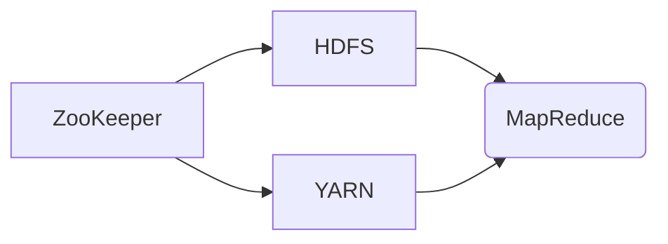

## 1. 背景介绍
### 1.1  问题的由来
随着互联网的蓬勃发展，海量数据呈爆炸式增长，传统的数据库管理系统难以应对如此庞大的数据存储和处理需求。如何高效地存储、管理和分析海量数据成为了一个亟待解决的难题。

### 1.2  研究现状
针对海量数据处理问题，分布式存储和计算技术逐渐成为主流解决方案。Hadoop作为开源的分布式存储和计算框架，凭借其高可靠性、高扩展性和高性能，在处理海量数据领域得到了广泛应用。

### 1.3  研究意义
深入理解Hadoop的原理和架构，能够帮助开发者更好地利用Hadoop平台进行大数据处理，并开发出更高效、更可靠的应用。

### 1.4  本文结构
本文将从Hadoop的背景介绍、核心概念、算法原理、代码实例、实际应用场景等方面进行详细讲解，帮助读者全面掌握Hadoop的知识和技能。

## 2. 核心概念与联系
Hadoop的核心概念包括：

* **分布式存储**: Hadoop将数据存储在多个节点上，每个节点都拥有独立的存储空间，数据被分散存储，提高了系统的可靠性和扩展性。
* **分布式计算**: Hadoop将计算任务分解成多个子任务，并分别在不同的节点上执行，充分利用了集群的计算资源，提高了计算效率。
* **数据分片**: Hadoop将数据划分为多个数据块，每个数据块存储在不同的节点上，方便数据并行处理。
* **数据冗余**: Hadoop采用数据复制机制，将数据副本存储在多个节点上，提高了数据的可靠性和容错性。
* **MapReduce**: Hadoop的计算模型，将数据处理任务分解成Map和Reduce两个阶段，并行执行，提高了计算效率。

**Hadoop架构图**:



## 3. 核心算法原理 & 具体操作步骤
### 3.1  算法原理概述
MapReduce是一种并行计算模型，将数据处理任务分解成两个阶段：Map和Reduce。

* **Map阶段**: 将输入数据划分为多个数据块，每个数据块在不同的节点上进行处理，每个节点执行Map函数，将数据转换为键值对。
* **Reduce阶段**: 将Map阶段产生的键值对进行分组，每个分组在不同的节点上执行Reduce函数，对分组内的键值对进行聚合操作，最终输出结果。

### 3.2  算法步骤详解
1. **数据分片**: 将输入数据划分为多个数据块，每个数据块存储在不同的节点上。
2. **Map阶段**: 每个节点执行Map函数，将数据块中的数据转换为键值对。
3. **数据收集**: 将Map阶段产生的键值对收集到Reduce节点上。
4. **Reduce阶段**: 每个Reduce节点执行Reduce函数，对分组内的键值对进行聚合操作，最终输出结果。

### 3.3  算法优缺点
**优点**:

* 并行处理能力强，能够充分利用集群的计算资源。
* 容错性高，数据冗余机制能够保证数据的可靠性。
* 易于扩展，可以根据需要增加节点数量。

**缺点**:

* 编程复杂度较高，需要掌握MapReduce编程模型。
* 数据处理延迟较高，不适合实时数据处理。

### 3.4  算法应用领域
MapReduce算法广泛应用于以下领域：

* **数据分析**: 对海量数据进行统计分析、模式识别等。
* **机器学习**: 对海量数据进行训练，构建机器学习模型。
* **搜索引擎**: 对海量网页数据进行索引和排名。
* **推荐系统**: 对用户行为数据进行分析，推荐相关商品或服务。

## 4. 数学模型和公式 & 详细讲解 & 举例说明
### 4.1  数学模型构建
Hadoop的MapReduce算法可以抽象为一个数学模型，其中：

* **输入数据**: $D = \{d_1, d_2, ..., d_n\}$，其中$d_i$表示单个数据元素。
* **Map函数**: $f_M: d_i \rightarrow \{ (k_j, v_j) \}$，将数据元素$d_i$映射到键值对$(k_j, v_j)$。
* **Reduce函数**: $f_R: \{ (k_j, v_j) \} \rightarrow v_r$，对键值对$(k_j, v_j)$进行聚合操作，得到最终结果$v_r$。

### 4.2  公式推导过程
MapReduce算法的输出结果可以表示为：

$$
R = f_R( \bigcup_{i=1}^{n} f_M(d_i) )
$$

其中，$R$表示最终输出结果，$f_M(d_i)$表示Map阶段产生的所有键值对，$\bigcup$表示所有键值对的并集。

### 4.3  案例分析与讲解
假设我们有一个包含学生成绩的数据集，需要计算每个学生的平均成绩。

* **Map函数**: 将每个学生的成绩数据映射到键值对，键为学生的学号，值是学生的成绩。
* **Reduce函数**: 对每个学生的成绩进行求和和计数，计算平均成绩。

### 4.4  常见问题解答
* **如何选择合适的Map和Reduce函数？**

选择合适的Map和Reduce函数取决于具体的业务需求。需要根据数据结构和计算逻辑设计相应的函数。

* **如何优化MapReduce程序的性能？**

可以通过数据分区、数据压缩、任务并行化等方式优化MapReduce程序的性能。

## 5. 项目实践：代码实例和详细解释说明
### 5.1  开发环境搭建
Hadoop开发环境搭建需要以下软件：

* **Java Development Kit (JDK)**
* **Hadoop安装包**
* **IDE (例如Eclipse, IntelliJ IDEA)**

### 5.2  源代码详细实现
以下是一个简单的WordCount程序的代码示例：

```java
import org.apache.hadoop.conf.Configuration;
import org.apache.hadoop.fs.Path;
import org.apache.hadoop.io.IntWritable;
import org.apache.hadoop.io.Text;
import org.apache.hadoop.mapreduce.Job;
import org.apache.hadoop.mapreduce.Mapper;
import org.apache.hadoop.mapreduce.Reducer;
import org.apache.hadoop.mapreduce.lib.input.FileInputFormat;
import org.apache.hadoop.mapreduce.lib.output.FileOutputFormat;

public class WordCount {

    public static class Map extends Mapper<Object, Text, Text, IntWritable> {
        private final static IntWritable one = new IntWritable(1);
        private Text word = new Text();

        public void map(Object key, Text value, Context context) throws IOException, InterruptedException {
            String line = value.toString();
            String[] words = line.split(" ");
            for (String word : words) {
                this.word.set(word);
                context.write(this.word, one);
            }
        }
    }

    public static class Reduce extends Reducer<Text, IntWritable, Text, IntWritable> {
        private IntWritable result = new IntWritable();

        public void reduce(Text key, Iterable<IntWritable> values, Context context) throws IOException, InterruptedException {
            int sum = 0;
            for (IntWritable value : values) {
                sum += value.get();
            }
            result.set(sum);
            context.write(key, result);
        }
    }

    public static void main(String[] args) throws Exception {
        Configuration conf = new Configuration();
        Job job = Job.getInstance(conf, "wordcount");
        job.setJarByClass(WordCount.class);
        job.setMapperClass(Map.class);
        job.setReducerClass(Reduce.class);
        job.setOutputKeyClass(Text.class);
        job.setOutputValueClass(IntWritable.class);
        FileInputFormat.addInputPath(job, new Path(args[0]));
        FileOutputFormat.setOutputPath(job, new Path(args[1]));
        System.exit(job.waitForCompletion(true) ? 0 : 1);
    }
}
```

### 5.3  代码解读与分析
* **Map类**: 负责将输入数据进行分词，并将每个单词作为键，1作为值输出。
* **Reduce类**: 负责对每个单词的计数结果进行聚合，输出单词及其计数。
* **main方法**: 配置Hadoop作业，设置输入输出路径，并提交作业执行。

### 5.4  运行结果展示
运行WordCount程序后，会在输出路径下生成一个包含单词及其计数结果的文件。

## 6. 实际应用场景
### 6.1  电商平台商品推荐
Hadoop可以用于分析用户购买历史、浏览记录等数据，挖掘用户兴趣偏好，并推荐相关商品。

### 6.2  社交媒体舆情分析
Hadoop可以用于收集和分析社交媒体上的用户评论、帖子等数据，了解用户对特定事件或产品的舆情趋势。

### 6.3  金融风险控制
Hadoop可以用于分析金融交易数据，识别异常交易行为，并进行风险控制。

### 6.4  未来应用展望
随着大数据时代的到来，Hadoop的应用场景将更加广泛，例如：

* **人工智能**: Hadoop可以用于训练机器学习模型，推动人工智能技术的发展。
* **物联网**: Hadoop可以用于处理海量物联网数据，实现智能感知和决策。
* **医疗健康**: Hadoop可以用于分析医疗数据，辅助疾病诊断和治疗。

## 7. 工具和资源推荐
### 7.1  学习资源推荐
* **Hadoop官方文档**: https://hadoop.apache.org/docs/
* **Hadoop中文社区**: http://hadoop.apache.org/zh-cn/
* **Hadoop学习书籍**: 《Hadoop权威指南》、《Hadoop实战》

### 7.2  开发工具推荐
* **Eclipse**: https://www.eclipse.org/
* **IntelliJ IDEA**: https://www.jetbrains.com/idea/
* **Cloudera Manager**: https://www.cloudera.com/products/manager.html

### 7.3  相关论文推荐
* **Hadoop: Distributed Storage and Processing of Large Datasets**: http://www.cs.berkeley.edu/~brewer/papers/osdi04.pdf
* **MapReduce: Simplified Data Processing on Large Clusters**: http://research.google.com/archive/mapreduce.pdf

### 7.4  其他资源推荐
* **Hadoop Github仓库**: https://github.com/apache/hadoop
* **Hadoop Stack Overflow**: https://stackoverflow.com/questions/tagged/hadoop

## 8. 总结：未来发展趋势与挑战
### 8.1  研究成果总结
Hadoop作为开源的分布式存储和计算框架，在处理海量数据领域取得了显著成果，为大数据时代的发展做出了重要贡献。

### 8.2  未来发展趋势
Hadoop将继续朝着以下方向发展：

* **性能优化**: 提高数据处理速度和效率。
* **功能扩展**: 增加新的功能模块，满足更广泛的应用需求。
* **生态系统建设**: 完善Hadoop生态系统，提供更多工具和服务。

### 8.3  面临的挑战
Hadoop也面临着一些挑战：

* **数据安全**: 保护海量数据的安全性和隐私性。
* **数据治理**: 建立完善的数据管理体系，确保数据质量和一致性。
* **人才培养**: 培养更多Hadoop开发和运维人才。

### 8.4  研究展望
未来，Hadoop的研究将更加注重以下方面：

* **人工智能与Hadoop的融合**: 将人工智能技术应用于Hadoop平台，提升数据分析和处理能力。
* **云计算与Hadoop的结合**: 将Hadoop部署在云计算环境中，实现更灵活和可扩展的数据处理。
* **边缘计算与Hadoop的结合**: 将Hadoop部署在边缘节点上，实现数据实时处理和分析。

## 9. 附录：常见问题与解答
### 9.1  Hadoop和Spark的区别是什么？
Hadoop和Spark都是分布式计算框架，但Spark比Hadoop更适合处理实时数据和交互式查询。Spark的计算速度更快，并支持多种编程语言。

### 9.2  Hadoop有哪些不同的部署模式？
Hadoop有两种主要的部署模式：

* **伪分布式模式**: 所有节点运行在同一台机器上，用于开发和测试。
* **真实分布式模式**: 节点分布在不同的机器上，用于生产环境。

### 9.3  Hadoop有哪些常见的组件？
Hadoop的主要组件包括：

* **HDFS**: 分布式文件系统，用于存储大数据。
* **YARN**: 资源管理系统，用于管理集群资源。
* **MapReduce**: 计算模型，用于处理大数据。
* **ZooKeeper**: 集群协调服务，用于协调Hadoop组件之间的通信。


作者：禅与计算机程序设计艺术 / Zen and the Art of Computer Programming
<end_of_turn>