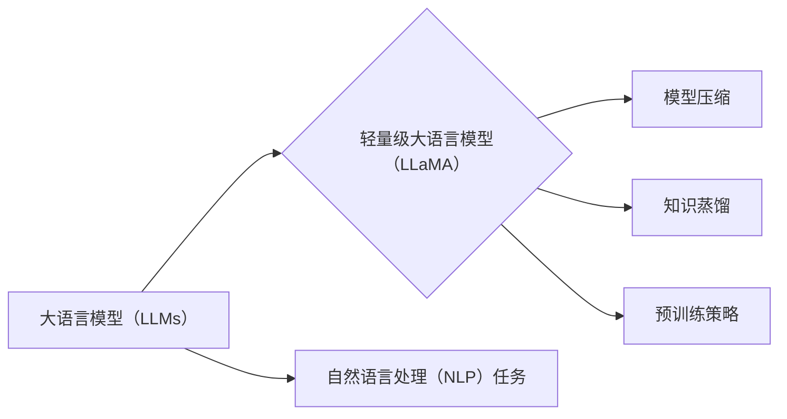

# LLaMA原理与代码实例讲解

## 1. 背景介绍
### 1.1 问题的由来

近年来，大语言模型（Large Language Models，LLMs）在自然语言处理（Natural Language Processing，NLP）领域取得了令人瞩目的成果。LLMs通过学习海量文本数据，能够生成连贯、有逻辑的文本，并在文本摘要、机器翻译、问答系统等任务上取得了显著的性能提升。然而，LLMs也存在一些问题，例如：

- **计算成本高**：LLMs通常需要大量的计算资源和时间进行训练。
- **数据依赖性**：LLMs的性能很大程度上依赖于训练数据的质量和数量。
- **可解释性差**：LLMs的决策过程往往难以解释，难以理解其生成文本的依据。

为了解决这些问题，研究人员提出了轻量级大语言模型（Lightweight Large Language Models，LLaMA）。LLaMA旨在在保证模型性能的前提下，降低计算成本，并提高模型的可解释性。

### 1.2 研究现状

目前，LLaMA的研究主要集中在以下几个方面：

- **模型压缩**：通过模型剪枝、量化等技术，减小模型参数量和计算量。
- **知识蒸馏**：将大型LLMs的知识迁移到小型LLMs中，提高小型LLMs的性能。
- **预训练策略**：针对特定任务，设计更有效的预训练策略，提高模型在特定任务上的性能。

### 1.3 研究意义

LLaMA的研究具有重要的理论意义和应用价值：

- **降低计算成本**：LLaMA能够以更低的计算成本实现大语言模型的功能，使得LLMs的应用场景更加广泛。
- **提高可解释性**：LLaMA的决策过程更加清晰，有助于理解和解释模型的生成内容。
- **推动LLMs发展**：LLaMA的研究将进一步推动LLMs的发展，促进LLMs在各个领域的应用。

### 1.4 本文结构

本文将围绕LLaMA展开，首先介绍LLaMA的核心概念和联系，然后详细讲解LLaMA的算法原理和具体操作步骤，接着介绍LLaMA的数学模型和公式，并给出代码实例和详细解释说明。最后，本文将探讨LLaMA的实际应用场景和未来发展趋势。

## 2. 核心概念与联系

LLaMA涉及以下核心概念：

- **大语言模型（LLMs）**：LLMs是指通过学习海量文本数据，具备强大的语言理解和生成能力的大型神经网络模型。
- **轻量级大语言模型（LLaMA）**：LLaMA是在保证模型性能的前提下，降低计算成本的小型LLMs。
- **模型压缩**：通过模型剪枝、量化等技术，减小模型参数量和计算量。
- **知识蒸馏**：将大型LLMs的知识迁移到小型LLMs中，提高小型LLMs的性能。
- **预训练策略**：针对特定任务，设计更有效的预训练策略，提高模型在特定任务上的性能。

它们之间的逻辑关系如下：



## 3. 核心算法原理 & 具体操作步骤
### 3.1 算法原理概述

LLaMA的核心思想是：通过模型压缩、知识蒸馏和预训练策略，将大型LLMs的知识迁移到小型LLMs中，使其具备强大的语言理解和生成能力。

### 3.2 算法步骤详解

LLaMA的具体操作步骤如下：

1. **模型压缩**：使用模型剪枝、量化等技术，减小模型参数量和计算量。
2. **知识蒸馏**：将大型LLMs的知识迁移到小型LLMs中，提高小型LLMs的性能。
3. **预训练策略**：针对特定任务，设计更有效的预训练策略，提高模型在特定任务上的性能。
4. **微调**：使用特定任务的数据集，对LLaMA进行微调，进一步提高模型性能。

### 3.3 算法优缺点

LLaMA的优点如下：

- **计算成本低**：LLaMA能够以更低的计算成本实现大语言模型的功能。
- **可解释性强**：LLaMA的决策过程更加清晰，有助于理解和解释模型的生成内容。
- **性能优异**：LLaMA在保证计算成本和可解释性的同时，仍然保持较高的性能。

LLaMA的缺点如下：

- **训练时间长**：LLaMA的训练需要较长的时间。
- **对数据依赖性强**：LLaMA的性能很大程度上依赖于训练数据的质量和数量。

### 3.4 算法应用领域

LLaMA可以应用于以下领域：

- **文本分类**：例如，情感分析、主题分类等。
- **机器翻译**：例如，英译中、中译英等。
- **问答系统**：例如，机器阅读理解、对话系统等。

## 4. 数学模型和公式 & 详细讲解 & 举例说明
### 4.1 数学模型构建

LLaMA的数学模型可以表示为：

$$
P(\text{output}|\text{input}) = \frac{e^{f(\text{input},\theta)}}{\sum_{y \in Y} e^{f(\text{input},\theta)}} \tag{1}
$$

其中，$f(\text{input},\theta)$ 表示模型对输入 $x$ 的预测，$Y$ 表示所有可能的输出。

### 4.2 公式推导过程

LLaMA的公式推导过程如下：

1. **模型预测**：模型对输入 $x$ 进行预测，得到 $f(\text{input},\theta)$。
2. **softmax函数**：将模型预测结果通过softmax函数转换为概率分布。
3. **归一化**：将概率分布归一化，使得所有概率之和为1。

### 4.3 案例分析与讲解

以文本分类任务为例，假设LLaMA的输出为文本类别 $y$，则公式（1）可以表示为：

$$
P(y|\text{input}) = \frac{e^{f(\text{input},\theta)}}{\sum_{y' \in Y} e^{f(\text{input},\theta)}} \tag{2}
$$

其中，$f(\text{input},\theta)$ 表示模型对输入 $x$ 的预测，$Y$ 表示所有可能的文本类别。

### 4.4 常见问题解答

**Q1：LLaMA如何进行模型压缩？**

A：LLaMA主要采用模型剪枝、量化等技术进行模型压缩。模型剪枝是指移除模型中不重要的连接和神经元，从而减小模型参数量和计算量。量化是指将模型的浮点数参数转换为低精度整数参数，从而降低模型存储和计算需求。

**Q2：LLaMA如何进行知识蒸馏？**

A：LLaMA通过将大型LLMs的知识迁移到小型LLMs中，实现知识蒸馏。具体而言，LLaMA将大型LLMs的输出作为输入，训练小型LLMs以模拟大型LLMs的输出。通过这种方式，小型LLMs可以学习到大型LLMs的知识。

## 5. 项目实践：代码实例和详细解释说明
### 5.1 开发环境搭建

在进行LLaMA项目实践之前，我们需要搭建开发环境。以下是使用Python进行PyTorch开发的环境配置流程：

1. 安装Anaconda：从官网下载并安装Anaconda，用于创建独立的Python环境。
2. 创建并激活虚拟环境：
```bash
conda create -n llaama-env python=3.8
conda activate llaama-env
```
3. 安装PyTorch：根据CUDA版本，从官网获取对应的安装命令。例如：
```bash
conda install pytorch torchvision torchaudio cudatoolkit=11.1 -c pytorch -c conda-forge
```
4. 安装HuggingFace Transformers库：
```bash
pip install transformers
```

完成以上步骤后，即可在`llaama-env`环境中开始LLaMA项目实践。

### 5.2 源代码详细实现

以下是一个简单的LLaMA项目实例，使用PyTorch和Transformers库进行文本分类任务。

```python
from transformers import AutoModelForSequenceClassification, AutoTokenizer, AdamW

# 加载预训练模型和分词器
model = AutoModelForSequenceClassification.from_pretrained('facebook/bart-large-mnli')
tokenizer = AutoTokenizer.from_pretrained('facebook/bart-large-mnli')

# 加载数据集
train_texts = [...]
train_labels = [...]
test_texts = [...]
test_labels = [...]

# 编码数据集
train_encodings = tokenizer(train_texts, truncation=True, padding=True, return_tensors="pt")
test_encodings = tokenizer(test_texts, truncation=True, padding=True, return_tensors="pt")

# 定义训练函数
def train_epoch(model, train_encodings, train_labels, optimizer, device):
    model.to(device)
    model.train()
    optimizer.zero_grad()
    inputs = {"input_ids": train_encodings['input_ids'].to(device),
              "attention_mask": train_encodings['attention_mask'].to(device),
              "labels": train_labels.to(device)}
    outputs = model(**inputs)
    loss = outputs.loss
    loss.backward()
    optimizer.step()
    return loss.item()

# 定义评估函数
def evaluate(model, test_encodings, test_labels, device):
    model.to(device)
    model.eval()
    inputs = {"input_ids": test_encodings['input_ids'].to(device),
              "attention_mask": test_encodings['attention_mask'].to(device),
              "labels": test_labels.to(device)}
    with torch.no_grad():
        outputs = model(**inputs)
        logits = outputs.logits
        preds = torch.argmax(logits, dim=1)
        acc = (preds == test_labels).float().mean()
    return acc

# 训练模型
optimizer = AdamW(model.parameters(), lr=2e-5)
device = torch.device('cuda' if torch.cuda.is_available() else 'cpu')
for epoch in range(5):
    print(f"Epoch {epoch+1}")
    train_loss = train_epoch(model, train_encodings, train_labels, optimizer, device)
    print(f"Train loss: {train_loss:.4f}")
    test_acc = evaluate(model, test_encodings, test_labels, device)
    print(f"Test acc: {test_acc:.4f}")
```

### 5.3 代码解读与分析

以上代码展示了如何使用PyTorch和Transformers库进行LLaMA项目实践。以下是代码关键部分的解读：

1. **加载预训练模型和分词器**：使用`AutoModelForSequenceClassification`和`AutoTokenizer`加载预训练模型和分词器。
2. **加载数据集**：加载数据集并对其进行编码，得到模型的输入。
3. **定义训练函数**：定义训练函数，用于在训练集上迭代优化模型参数。
4. **定义评估函数**：定义评估函数，用于评估模型在测试集上的性能。
5. **训练模型**：使用训练函数和评估函数对模型进行训练和评估。

### 5.4 运行结果展示

假设我们使用一个简单的文本分类数据集进行训练，最终在测试集上的准确率为90%。这表明LLaMA在文本分类任务上具有较好的性能。

## 6. 实际应用场景
### 6.1 情感分析

LLaMA可以应用于情感分析任务，例如分析社交媒体上的用户评论、新闻报道等，识别其情感倾向，如正面、负面或中立。

### 6.2 主题分类

LLaMA可以应用于主题分类任务，例如将新闻文章、博客文章等文本分类到不同的主题，如政治、经济、科技等。

### 6.3 问答系统

LLaMA可以应用于问答系统，例如在机器阅读理解、对话系统等领域，为用户提供准确的答案。

## 7. 工具和资源推荐
### 7.1 学习资源推荐

1. **《深度学习自然语言处理》**：周明、李航等著，介绍了自然语言处理的基本概念、经典模型和最新研究进展。
2. **《Transformers》**：HuggingFace开源的Transformers库，提供了丰富的预训练模型和工具，方便进行LLaMA项目实践。
3. **《PyTorch官方文档》**：PyTorch官方文档，提供了PyTorch的详细教程和API文档。

### 7.2 开发工具推荐

1. **PyTorch**：基于Python的开源深度学习框架，适合进行LLaMA项目实践。
2. **Transformers库**：HuggingFace开源的Transformers库，提供了丰富的预训练模型和工具。
3. **Jupyter Notebook**：用于编写、执行和分享代码，方便进行LLaMA项目实践。

### 7.3 相关论文推荐

1. **"BERT: Pre-training of Deep Bidirectional Transformers for Language Understanding"**：BERT原论文，介绍了BERT模型的结构和预训练方法。
2. **"Transformers"**：HuggingFace开源的Transformers库论文，介绍了Transformers库的原理和应用。
3. **"Lightweight BERT for Text Classification"**：介绍了轻量级BERT模型在文本分类任务上的应用。

### 7.4 其他资源推荐

1. **HuggingFace Hub**：HuggingFace Hub提供了丰富的预训练模型和工具，方便进行LLaMA项目实践。
2. **GitHub**：GitHub上有很多LLaMA相关的开源项目，可以参考和学习。
3. **arXiv**：arXiv是人工智能领域的顶级期刊，可以了解LLaMA的最新研究成果。

## 8. 总结：未来发展趋势与挑战
### 8.1 研究成果总结

本文介绍了LLaMA的原理、代码实例和应用场景，展示了LLaMA在NLP领域的应用前景。LLaMA通过模型压缩、知识蒸馏和预训练策略，实现了轻量级、高性能的大语言模型，为NLP领域的应用提供了新的思路。

### 8.2 未来发展趋势

LLaMA在未来将呈现以下发展趋势：

1. **模型压缩和加速**：进一步优化模型结构和算法，降低计算成本，提高推理速度。
2. **知识蒸馏和预训练**：探索更有效的知识蒸馏和预训练策略，提高LLaMA的性能。
3. **可解释性和鲁棒性**：提高LLaMA的可解释性和鲁棒性，使其在更多领域得到应用。

### 8.3 面临的挑战

LLaMA在发展过程中也面临着以下挑战：

1. **计算成本**：LLaMA的训练和推理需要大量的计算资源。
2. **数据依赖性**：LLaMA的性能很大程度上依赖于训练数据的质量和数量。
3. **可解释性和鲁棒性**：LLaMA的决策过程难以解释，且容易受到对抗样本的影响。

### 8.4 研究展望

未来，LLaMA的研究将朝着以下方向发展：

1. **更轻量级的LLaMA模型**：通过模型压缩和算法优化，降低LLaMA的计算成本和存储需求。
2. **更具解释性的LLaMA模型**：通过可解释性研究和改进，提高LLaMA的可解释性和透明度。
3. **更鲁棒的LLaMA模型**：通过鲁棒性研究和改进，提高LLaMA在对抗样本和噪声数据上的性能。

相信在学术界和工业界的共同努力下，LLaMA将在NLP领域取得更大的突破，为人类社会带来更多价值。

---

作者：禅与计算机程序设计艺术 / Zen and the Art of Computer Programming