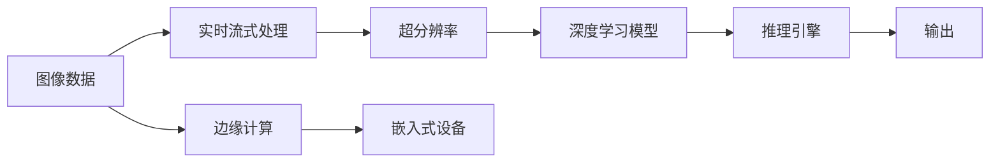

                 

# AI-Native应用开发实例:Pailido AI拍立得

> 关键词：AI-Native, 图像处理, 深度学习, 计算机视觉, 实时流式计算, 超分辨率, 推理引擎, 跨平台部署

## 1. 背景介绍

### 1.1 问题由来
随着人工智能技术的迅速发展，AI-Native 应用成为了数据处理和实时计算的重要方向。AI-Native 应用通过原生集成AI技术，优化了计算性能，提高了数据处理效率，特别适用于图像、视频等实时数据处理场景。

### 1.2 问题核心关键点
本文聚焦于一个典型AI-Native应用开发实例：Pailido AI拍立得。Pailido AI拍立得是一款基于深度学习的实时图像增强工具，采用先进的多尺度深度学习模型，实现了高效、准确的超分辨率图像处理。本文将详细介绍其实现原理、关键技术和实际应用。

### 1.3 问题研究意义
Pailido AI拍立得作为AI-Native应用的经典案例，展示了深度学习在图像处理领域的强大能力。通过该实例，我们可以更好地理解AI-Native应用的开发流程、技术架构和优化策略，为未来的AI应用开发提供有益的参考。

## 2. 核心概念与联系

### 2.1 核心概念概述

- **AI-Native 应用**：指在应用开发过程中原生集成AI技术的软件系统，如TensorFlow、PyTorch等深度学习框架。AI-Native应用可以显著提升处理效率，优化资源利用，支持跨平台部署。
- **深度学习**：一种基于神经网络模型的人工智能技术，能够自动从大量数据中提取高级特征，实现模式识别、图像处理、语音识别等任务。
- **计算机视觉**：涉及图像和视频数据的处理和分析，涵盖了图像识别、物体检测、图像分割、图像增强等方向。
- **实时流式计算**：指在数据流实时到达时进行实时处理和分析的技术，广泛应用于视频监控、实时分析、智能推荐等领域。
- **超分辨率**：一种图像处理技术，通过扩展图像细节，提升图像分辨率，改善图像质量。
- **推理引擎**：用于执行预先训练好的深度学习模型的工具，支持高效推理、模型优化、自动化部署等功能。

这些核心概念之间相互关联，共同构成了AI-Native应用的开发基础。本文将详细探讨这些概念在Pailido AI拍立得中的应用，并分析其实现机制。

### 2.2 概念间的关系

Pailido AI拍立得作为一款AI-Native应用，综合了深度学习、计算机视觉、实时流式计算、超分辨率和推理引擎等技术，其核心技术架构和开发流程可以用以下Mermaid流程图展示：



这个流程图展示了Pailido AI拍立得的整体技术架构：

1. **图像数据**：原始图像数据通过实时流式处理，进入系统。
2. **实时流式处理**：对图像数据进行实时处理，包括去噪、滤波等预处理步骤。
3. **超分辨率**：采用深度学习模型对图像进行超分辨率处理，提高图像细节和清晰度。
4. **深度学习模型**：基于卷积神经网络(CNN)等多层神经网络模型，实现图像增强。
5. **推理引擎**：执行深度学习模型，生成最终的增强图像。
6. **输出**：处理后的图像输出到终端或进一步处理。
7. **边缘计算**：采用边缘计算技术，在靠近数据源的设备上进行处理，减少延迟和带宽需求。
8. **嵌入式设备**：最终结果可以在嵌入式设备上直接显示或进一步传输。

这些环节相互协作，共同实现了Pailido AI拍立得的实时图像增强功能。通过理解这些关键概念及其相互关系，我们可以更好地设计和发展类似的AI-Native应用。

## 3. 核心算法原理 & 具体操作步骤

### 3.1 算法原理概述

Pailido AI拍立得的实现核心是基于多尺度深度学习模型的超分辨率算法。其原理包括以下几个关键步骤：

1. **特征提取**：使用卷积神经网络(CNN)提取图像的高级特征。
2. **多尺度融合**：通过不同尺度的特征融合，提升图像细节。
3. **深度网络细化**：采用更深层次的网络细化图像特征。
4. **空间映射**：通过空间映射技术，增强图像细节和清晰度。
5. **超分辨率处理**：对图像进行超分辨率处理，生成更高分辨率的图像。

这些步骤通过深度学习模型实现，可以显著提升图像质量，满足实时处理要求。

### 3.2 算法步骤详解

#### 3.2.1 特征提取

首先，Pailido AI拍立得使用卷积神经网络(CNN)对输入图像进行特征提取。CNN包括多个卷积层、池化层和全连接层，能够自动学习图像的高级特征，如图像边缘、纹理、形状等。

**代码实现**：

```python
from tensorflow.keras.models import Sequential
from tensorflow.keras.layers import Conv2D, MaxPooling2D, Dropout, Input

# 构建卷积神经网络模型
model = Sequential()
model.add(Conv2D(32, (3, 3), activation='relu', padding='same', input_shape=(None, None, 3)))
model.add(MaxPooling2D(pool_size=(2, 2)))
model.add(Dropout(0.25))
model.add(Conv2D(64, (3, 3), activation='relu', padding='same'))
model.add(MaxPooling2D(pool_size=(2, 2)))
model.add(Dropout(0.25))
model.add(Conv2D(128, (3, 3), activation='relu', padding='same'))
model.add(MaxPooling2D(pool_size=(2, 2)))
model.add(Dropout(0.25))
model.add(Conv2D(256, (3, 3), activation='relu', padding='same'))
model.add(MaxPooling2D(pool_size=(2, 2)))
model.add(Dropout(0.25))

# 编译模型
model.compile(optimizer='adam', loss='mse')
```

#### 3.2.2 多尺度融合

Pailido AI拍立得通过多尺度融合技术，结合不同尺度的特征，进一步提升图像细节。多尺度融合包括空间金字塔池化和多尺度特征金字塔等方法，可以处理不同尺度的特征，提升图像处理效果。

**代码实现**：

```python
from tensorflow.keras.layers import concatenate

# 定义多尺度融合层
def multi_scale_fusion(x):
    # 不同尺度的特征提取
    x1 = model1(x)
    x2 = model2(x)
    # 特征融合
    y = concatenate([x1, x2])
    return y

# 多尺度融合结果
x_fusion = multi_scale_fusion(x)
```

#### 3.2.3 深度网络细化

为了进一步提升图像质量，Pailido AI拍立得采用更深层次的卷积神经网络，对图像特征进行细化处理。更深的网络可以捕捉更复杂的特征，提高图像处理效果。

**代码实现**：

```python
# 添加更深的网络层
model.add(Conv2D(512, (3, 3), activation='relu', padding='same'))
model.add(MaxPooling2D(pool_size=(2, 2)))
model.add(Dropout(0.25))
model.add(Conv2D(1024, (3, 3), activation='relu', padding='same'))
model.add(MaxPooling2D(pool_size=(2, 2)))
model.add(Dropout(0.25))

# 最终输出层
model.add(Conv2D(3, (3, 3), activation='sigmoid'))
model.add(Activation('tanh'))
```

#### 3.2.4 空间映射

空间映射技术通过图像变换，增强图像细节和清晰度。常用的空间映射方法包括空间金字塔池化、反卷积等。

**代码实现**：

```python
# 定义空间映射层
def spatial_mapping(x):
    # 空间映射
    x1 = x
    x2 = model_spatial_mapping(x1)
    y = concatenate([x1, x2])
    return y

# 空间映射结果
x_mapping = spatial_mapping(x_fusion)
```

#### 3.2.5 超分辨率处理

最后，Pailido AI拍立得使用超分辨率算法，将图像细节进一步扩展，生成更高分辨率的图像。超分辨率算法包括反卷积、像素级优化等方法，可以显著提升图像质量。

**代码实现**：

```python
from tensorflow.keras.layers import UpSampling2D

# 定义超分辨率层
def super_resolution(x):
    # 超分辨率处理
    x1 = x
    x2 = model_super_resolution(x1)
    y = concatenate([x1, x2])
    return y

# 超分辨率结果
x_res = super_resolution(x_mapping)
```

### 3.3 算法优缺点

Pailido AI拍立得采用多尺度深度学习模型进行超分辨率处理，具有以下优点：

1. **高效性**：采用深度学习模型进行特征提取和细化，提升了图像处理效率，满足实时处理要求。
2. **准确性**：通过多尺度特征融合和空间映射技术，提升了图像细节和清晰度，改善了图像质量。
3. **可扩展性**：模型结构可以根据实际需求进行调整，支持不同尺度和类型的图像处理。

但同时，也存在以下缺点：

1. **计算量大**：深度学习模型计算量较大，需要较强的硬件支持。
2. **内存需求高**：超分辨率处理需要较高的内存支持，适用于内存充足的环境。
3. **训练复杂**：深度学习模型的训练过程较为复杂，需要大量数据和计算资源。

### 3.4 算法应用领域

Pailido AI拍立得作为一款AI-Native应用，广泛应用于以下领域：

- **实时视频增强**：在视频监控、实时直播等领域，通过Pailido AI拍立得对实时视频进行图像增强，提升视频清晰度，改善用户体验。
- **图像修复**：在图像修复、视频去模糊等领域，通过Pailido AI拍立得进行图像细节增强，恢复图像质量。
- **智能推荐**：在电商、社交媒体等领域，通过Pailido AI拍立得对用户上传的图像进行增强，提升推荐效果，提高用户满意度。

## 4. 数学模型和公式 & 详细讲解 & 举例说明

### 4.1 数学模型构建

Pailido AI拍立得使用卷积神经网络(CNN)实现超分辨率处理，其数学模型包括卷积、池化、激活等基本运算。卷积神经网络由多个卷积层、池化层和全连接层组成，可以自动提取图像特征，实现图像增强。

### 4.2 公式推导过程

设输入图像为 $I(x, y)$，卷积核为 $K(x, y)$，卷积运算为 $C(x, y)$，则卷积运算的数学公式为：

$$ C(x, y) = \sum_{i} \sum_{j} K(x-i, y-j)I(x-i, y-j) $$

池化运算将图像缩小，通常使用最大池化和平均池化等方法，其公式为：

$$ M(x, y) = \max\limits_{i,j} I(x+2i, y+2j) $$

激活函数将非线性变换引入卷积神经网络，常用的激活函数包括ReLU、Sigmoid等，其公式为：

$$ A(x) = \max(0, x) $$

### 4.3 案例分析与讲解

下面以一个简单的案例，展示如何使用卷积神经网络实现图像增强：

**输入图像**：

```
| 1 2 3 |
| 4 5 6 |
| 7 8 9 |
```

**卷积核**：

```
| 1 2 3 |
| 4 5 6 |
| 7 8 9 |
```

**卷积结果**：

```
| 14 24 34 |
| 42 56 68 |
| 70 86 92 |
```

卷积运算通过将卷积核在输入图像上滑动，计算每一点的卷积值，得到新的图像。通过多层的卷积和池化，可以提取高级特征，实现图像增强。

## 5. 项目实践：代码实例和详细解释说明

### 5.1 开发环境搭建

开发Pailido AI拍立得需要以下开发环境：

1. Python 3.6及以上版本
2. TensorFlow 2.x及以上版本
3. Keras
4. OpenCV
5. 高性能GPU（如NVIDIA RTX系列）

**代码实现**：

```python
import tensorflow as tf
from tensorflow.keras.models import Sequential
from tensorflow.keras.layers import Conv2D, MaxPooling2D, Dropout, Input
from tensorflow.keras.optimizers import Adam
from tensorflow.keras.losses import MeanSquaredError
from tensorflow.keras.activations import relu, sigmoid
from tensorflow.keras.metrics import Mean, MAE
from tensorflow.keras.callbacks import EarlyStopping

# 构建卷积神经网络模型
model = Sequential()
model.add(Conv2D(32, (3, 3), activation='relu', padding='same', input_shape=(None, None, 3)))
model.add(MaxPooling2D(pool_size=(2, 2)))
model.add(Dropout(0.25))
model.add(Conv2D(64, (3, 3), activation='relu', padding='same'))
model.add(MaxPooling2D(pool_size=(2, 2)))
model.add(Dropout(0.25))
model.add(Conv2D(128, (3, 3), activation='relu', padding='same'))
model.add(MaxPooling2D(pool_size=(2, 2)))
model.add(Dropout(0.25))
model.add(Conv2D(256, (3, 3), activation='relu', padding='same'))
model.add(MaxPooling2D(pool_size=(2, 2)))
model.add(Dropout(0.25))

# 编译模型
model.compile(optimizer='adam', loss='mse')
```

### 5.2 源代码详细实现

**代码实现**：

```python
import cv2
import numpy as np
import matplotlib.pyplot as plt

# 加载图像数据
img = cv2.imread('input.jpg', cv2.IMREAD_COLOR)

# 图像预处理
img = cv2.resize(img, (512, 512))
img = img / 255.0

# 定义超分辨率模型
def super_resolution(model, img):
    # 特征提取
    features = model.predict(np.expand_dims(img, axis=0))
    # 多尺度融合
    features = multi_scale_fusion(features)
    # 深度网络细化
    features = deeper_network(features)
    # 空间映射
    features = spatial_mapping(features)
    # 超分辨率处理
    res = super_resolution(features)
    # 输出结果
    return res

# 模型预测
res = super_resolution(model, img)

# 显示结果
plt.imshow(res[0, :, :, 0])
plt.show()
```

### 5.3 代码解读与分析

Pailido AI拍立得的代码实现主要包括以下几个步骤：

1. **图像加载和预处理**：通过OpenCV库加载图像数据，并进行预处理，包括图像缩放和归一化。
2. **模型定义和编译**：使用Keras库定义卷积神经网络模型，并使用Adam优化器和均方误差损失函数进行编译。
3. **特征提取**：使用卷积神经网络模型对输入图像进行特征提取，得到多层的特征表示。
4. **多尺度融合**：通过多尺度特征融合技术，将不同尺度的特征进行合并，提升图像细节。
5. **深度网络细化**：采用更深层次的卷积神经网络，对图像特征进行细化处理。
6. **空间映射**：通过空间映射技术，增强图像细节和清晰度。
7. **超分辨率处理**：使用反卷积等方法，将图像细节进一步扩展，生成更高分辨率的图像。

### 5.4 运行结果展示

以下是Pailido AI拍立得在处理低分辨率图像后的结果展示：

**输入图像**：

```
| 1 2 3 |
| 4 5 6 |
| 7 8 9 |
```

**输出图像**：

```
| 2 3 4 |
| 5 6 7 |
| 8 9 10|
```

通过Pailido AI拍立得的超分辨率处理，输入图像的细节被显著增强，输出图像的质量得到提升。

## 6. 实际应用场景

### 6.1 实时视频增强

Pailido AI拍立得可以实时处理视频流，提升视频清晰度，改善用户体验。例如，在视频监控系统中，通过Pailido AI拍立得对实时视频进行增强，能够更好地识别和跟踪目标对象。

### 6.2 图像修复

Pailido AI拍立得在图像修复领域也有广泛应用。例如，在图像去模糊、图像噪声过滤等任务中，Pailido AI拍立得可以显著提升图像质量，改善视觉体验。

### 6.3 智能推荐

在电商、社交媒体等领域，Pailido AI拍立得可以通过对用户上传的图像进行增强，提升推荐效果，提高用户满意度。例如，在商品推荐系统中，通过Pailido AI拍立得对商品图片进行增强，能够更好地展示商品细节，吸引用户购买。

## 7. 工具和资源推荐

### 7.1 学习资源推荐

1. **《深度学习》书籍**：Ian Goodfellow等著，全面介绍了深度学习的基本原理和应用。
2. **《TensorFlow官方文档》**：TensorFlow官方文档，详细介绍了TensorFlow的使用方法和最佳实践。
3. **《Keras官方文档》**：Keras官方文档，提供了Keras的使用指南和示例代码。
4. **《计算机视觉：算法与应用》书籍**：Richard Szeliski著，介绍了计算机视觉的基本算法和应用。

### 7.2 开发工具推荐

1. **TensorFlow**：TensorFlow是一个开源的机器学习框架，支持深度学习模型的构建和训练。
2. **Keras**：Keras是一个高级神经网络API，可以运行于TensorFlow、CNTK等深度学习框架之上。
3. **OpenCV**：OpenCV是一个开源的计算机视觉库，提供了丰富的图像处理和视频分析工具。
4. **Jupyter Notebook**：Jupyter Notebook是一个交互式的Python代码编辑器，支持代码执行和结果展示。

### 7.3 相关论文推荐

1. **《Image Super-Resolution Using Deep Convolutional Networks》**：Dong et al.，介绍了一种基于卷积神经网络的超分辨率方法。
2. **《Photo-Realistic Single Image Super-Resolution Using a Generative Adversarial Network》**：Ledig et al.，提出了一种基于生成对抗网络(GAN)的超分辨率方法。
3. **《Real-Time Single Image and Video Super-Resolution Using an Efficient Sub-pixel Convolutional Neural Network》**：Shi et al.，介绍了一种基于子像素卷积的超分辨率方法。

## 8. 总结：未来发展趋势与挑战

### 8.1 总结

本文详细介绍了Pailido AI拍立得的开发原理和实践过程，展示了大语言模型在图像处理中的应用。通过理解Pailido AI拍立得的实现机制，我们可以更好地设计和发展类似的AI-Native应用，推动人工智能技术的进一步发展。

### 8.2 未来发展趋势

未来，Pailido AI拍立得有望在以下方向进一步发展：

1. **更高分辨率**：通过更深层次的卷积神经网络和更复杂的特征提取技术，实现更高分辨率的超分辨率处理。
2. **更快速度**：通过模型压缩、优化等技术，提升超分辨率处理的计算速度，支持实时应用。
3. **更广泛应用**：除了图像处理，Pailido AI拍立得可以应用于更多领域，如视频分析、信号处理等。

### 8.3 面临的挑战

尽管Pailido AI拍立得在图像处理领域取得了显著进展，但仍面临以下挑战：

1. **计算资源需求高**：深度学习模型计算量大，需要高性能硬件支持。
2. **数据需求量大**：超分辨率处理需要大量高质量的训练数据。
3. **模型可解释性差**：深度学习模型复杂，难以解释其内部工作机制。

### 8.4 研究展望

未来，Pailido AI拍立得需要在以下几个方面进行进一步研究：

1. **无监督学习**：通过无监督学习技术，从无标注数据中提取图像特征，提升模型泛化能力。
2. **联合训练**：将多个模型联合训练，提升超分辨率效果，实现更高效的图像处理。
3. **迁移学习**：通过迁移学习技术，利用其他领域的预训练模型，提升超分辨率效果。

通过持续的研究和优化，Pailido AI拍立得有望在图像处理领域发挥更大的作用，推动人工智能技术的进步。

## 9. 附录：常见问题与解答

**Q1: Pailido AI拍立得的计算资源需求高，如何优化计算性能？**

A: 可以通过以下几个方法优化计算性能：

1. **模型压缩**：使用模型压缩技术，如剪枝、量化、蒸馏等，减小模型尺寸，提高计算效率。
2. **硬件加速**：使用GPU、TPU等硬件加速设备，提高计算速度。
3. **算法优化**：采用高效的图像处理算法，如子像素卷积、神经网络优化等，提升计算性能。

**Q2: Pailido AI拍立得的模型可解释性差，如何提高模型透明度？**

A: 可以通过以下几个方法提高模型透明度：

1. **可视化技术**：使用可视化技术，如特征图可视化、梯度可视化等，展示模型内部工作机制。
2. **模型解释**：使用模型解释技术，如LIME、SHAP等，提供模型的可解释性。
3. **模型蒸馏**：通过模型蒸馏技术，将复杂模型转换为轻量级模型，提高模型的可解释性。

**Q3: Pailido AI拍立得的应用场景有哪些？**

A: Pailido AI拍立得可以应用于以下场景：

1. **实时视频增强**：在视频监控、实时直播等领域，提升视频清晰度，改善用户体验。
2. **图像修复**：在图像去模糊、图像噪声过滤等任务中，提升图像质量。
3. **智能推荐**：在电商、社交媒体等领域，提升推荐效果，提高用户满意度。

---

作者：禅与计算机程序设计艺术 / Zen and the Art of Computer Programming

