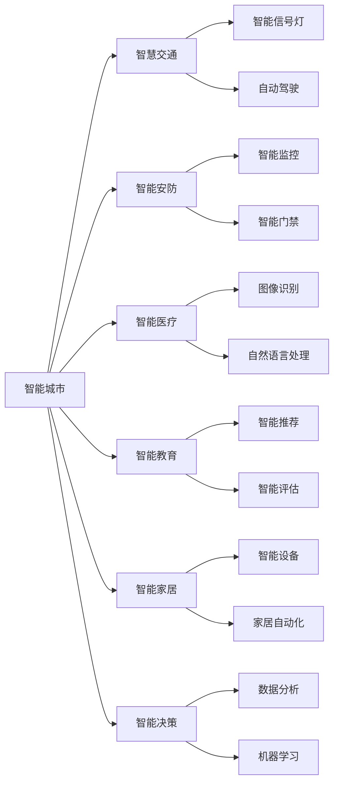
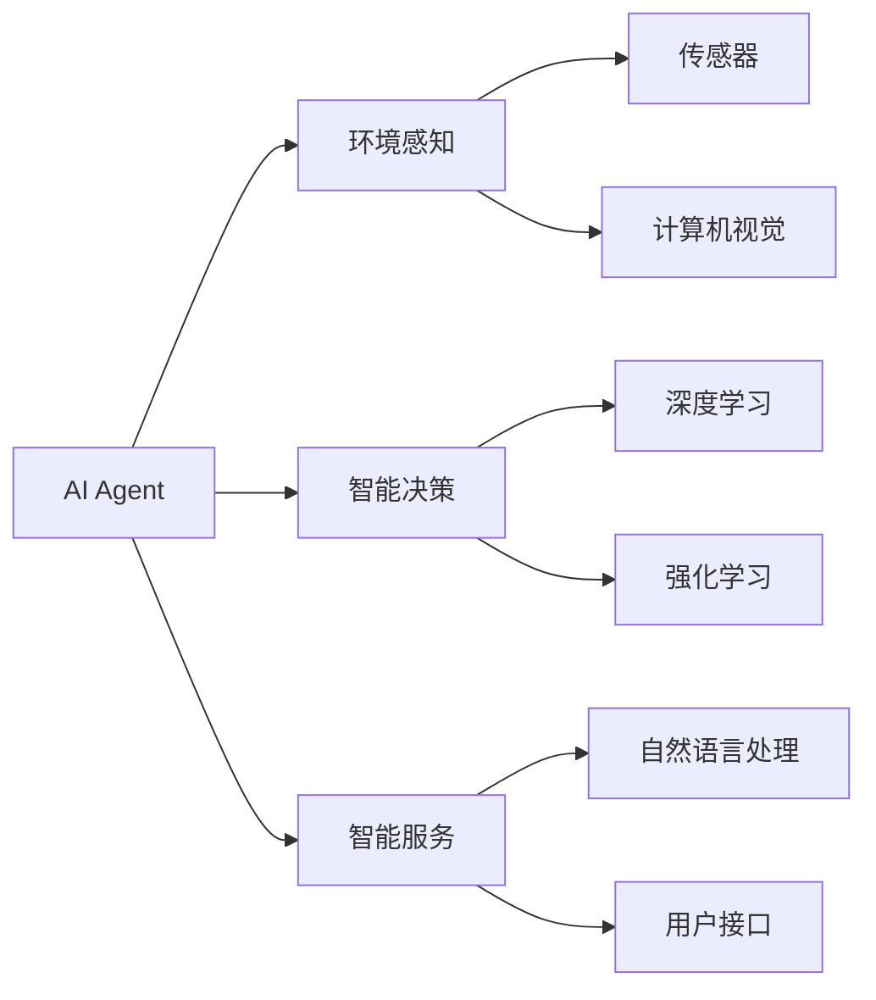
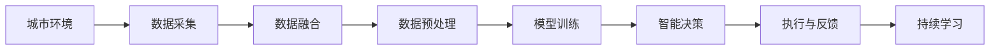
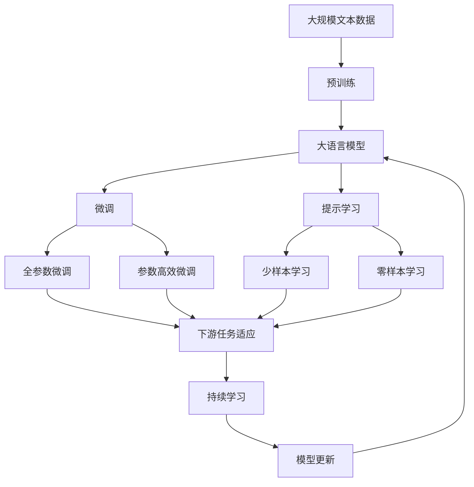

                 

# AI人工智能 Agent：在智慧城市中的应用

> 关键词：人工智能,智能城市,智慧城市,智能服务,人工智能Agent,智能决策,大数据,深度学习,计算机视觉,自然语言处理

## 1. 背景介绍

### 1.1 问题由来
随着城市化进程的加快和信息技术的飞速发展，智慧城市建设已成为全球城市发展的潮流。智慧城市通过综合利用物联网、大数据、人工智能等先进技术，实现城市管理的智能化、精细化和高效化。在此背景下，人工智能（AI）作为推动智慧城市建设的重要手段，其应用场景和价值得到了广泛认可。

AI技术在智慧城市中的应用涵盖了多个层面，从智能交通、智慧安防、智能医疗到智慧教育、智能家居等。然而，在实际应用中，单一的AI技术往往难以应对复杂的城市运行问题。因此，构建一个具备自主决策、自我学习和适应能力的AI Agent，成为智慧城市建设的关键需求。

### 1.2 问题核心关键点
AI Agent在智慧城市中的应用，主要解决以下几个核心问题：

- **环境感知与数据融合**：利用计算机视觉、传感器等技术，实时获取城市环境数据，并融合不同来源的数据，实现对城市运行状态的全面感知。
- **智能决策与优化**：基于历史数据和实时信息，通过深度学习、强化学习等算法，自动决策并优化城市管理策略，提高城市运行效率。
- **人机交互与用户服务**：构建友好的用户界面，通过自然语言处理技术，实现与用户的自然对话，提供精准的智能服务。
- **模型训练与参数更新**：在智慧城市运行中，AI Agent需要不断学习和更新模型，以适应新的城市运行状况和用户需求。

### 1.3 问题研究意义
构建AI Agent对于智慧城市的建设具有重要意义：

1. **提升城市运行效率**：通过智能决策和优化，AI Agent可以有效应对城市运行中的各种问题，如交通拥堵、能源浪费、环境污染等，提升城市管理水平。
2. **改善居民生活质量**：提供智能服务，如智能安防、智能健康、智能出行等，提升居民的生活体验。
3. **降低城市运行成本**：通过自动化的管理和决策，减少人工干预，降低城市运行成本。
4. **促进技术创新**：AI Agent的构建和应用，推动了AI技术在智慧城市中的应用，促进了技术的不断创新。
5. **赋能产业升级**：通过AI Agent，提升城市基础设施和服务水平，赋能相关产业发展，推动产业升级转型。

## 2. 核心概念与联系

### 2.1 核心概念概述

为更好地理解AI Agent在智慧城市中的应用，本节将介绍几个密切相关的核心概念：

- **AI Agent**：指具备自主决策和适应能力的智能实体，能够在智慧城市中执行特定任务，如智能交通管理、智能安防监控等。
- **智能城市**：通过物联网、云计算、大数据等技术，实现城市管理智能化、精细化、高效化的城市形态。
- **智慧交通**：利用智能技术，如智能信号灯、自动驾驶等，提升城市交通管理水平，减少交通拥堵和事故。
- **智能安防**：通过智能监控、智能门禁等技术，提升城市安防能力，保障居民安全。
- **智能医疗**：利用AI技术，如图像识别、自然语言处理等，提升医疗诊断和治疗效率，改善医疗服务。
- **智能教育**：通过智能推荐、智能评估等技术，提升教育质量和效率，实现个性化教育。
- **智能家居**：利用智能设备和AI技术，提升家居自动化水平，提高居民生活质量。
- **智能决策**：通过数据分析、机器学习等技术，实现城市管理的智能化决策，提升城市运行效率。

这些核心概念之间的逻辑关系可以通过以下Mermaid流程图来展示：



这个流程图展示了一个智慧城市中各个智能应用场景的相互关系，以及AI Agent在其中扮演的角色。

### 2.2 概念间的关系

这些核心概念之间存在着紧密的联系，形成了智慧城市中的智能应用生态系统。下面我通过几个Mermaid流程图来展示这些概念之间的关系。

#### 2.2.1 智能城市的应用场景


这个流程图展示了智慧城市中各个智能应用场景的相互关系，以及AI Agent在其中扮演的角色。

#### 2.2.2 AI Agent的设计原则



这个流程图展示了AI Agent的设计原则，包括环境感知、智能决策和智能服务三个核心模块。

#### 2.2.3 AI Agent的运行流程



这个流程图展示了AI Agent的运行流程，包括数据采集、数据融合、模型训练、智能决策、执行与反馈和持续学习等关键步骤。

### 2.3 核心概念的整体架构

最后，我们用一个综合的流程图来展示这些核心概念在大语言模型微调过程中的整体架构：



这个综合流程图展示了从预训练到微调，再到持续学习的完整过程。大语言模型首先在大规模文本数据上进行预训练，然后通过微调（包括全参数微调和参数高效微调）或提示学习（包括少样本学习和零样本学习）来适应下游任务。最后，通过持续学习技术，模型可以不断更新和适应新的任务和数据。

## 3. 核心算法原理 & 具体操作步骤
### 3.1 算法原理概述

AI Agent在智慧城市中的应用，本质上是一个复杂的多模态信息融合和智能决策过程。其核心思想是：将城市的各种传感器、摄像头、物联网设备采集的数据，通过AI技术进行处理和融合，形成对城市环境的全面感知，然后基于感知数据，通过深度学习、强化学习等算法，进行智能决策和优化，最后通过智能服务接口，将决策结果输出并执行，同时不断从执行结果中学习，实现模型的持续更新和优化。

形式化地，假设智慧城市中的传感器和设备采集的环境数据为 $X=\{x_1, x_2, \ldots, x_n\}$，AI Agent的智能决策模型为 $M_{\theta}$，其中 $\theta$ 为模型参数。给定智慧城市中的一个智能任务 $T$，其训练集为 $D=\{(x_i, y_i)\}_{i=1}^N, x_i \in X, y_i \in Y$，其中 $Y$ 为可能的决策结果空间。

AI Agent的运行流程可以分为以下几个步骤：

1. **数据采集与融合**：通过各种传感器和设备，实时采集城市环境数据，并将不同来源的数据进行融合，形成对城市运行状态的全面感知。
2. **数据预处理**：对采集到的数据进行清洗、归一化等预处理，确保数据质量。
3. **模型训练**：利用历史数据和实时信息，通过深度学习、强化学习等算法，训练AI Agent的智能决策模型。
4. **智能决策**：基于模型输出的决策结果，进行相应的城市管理操作，如交通信号灯控制、智能安防监控等。
5. **执行与反馈**：将决策结果执行到实际城市系统中，并根据执行结果和反馈，调整模型参数，实现模型的持续更新。
6. **持续学习**：通过不断学习新的数据和任务，AI Agent能够适应新的城市运行状况和用户需求。

### 3.2 算法步骤详解

AI Agent在智慧城市中的应用一般包括以下几个关键步骤：

**Step 1: 数据采集与融合**

- 收集城市中的各种传感器和设备采集的环境数据，如温度、湿度、交通流量、摄像头图像等。
- 利用传感器和设备的网络协议，将采集到的数据传输到AI Agent的计算平台。
- 对采集到的数据进行格式转换和处理，形成标准化的数据格式。
- 利用数据融合技术，将不同来源的数据进行融合，形成对城市运行状态的全面感知。

**Step 2: 数据预处理**

- 对采集到的数据进行清洗、去噪、归一化等预处理，确保数据质量。
- 对数据进行特征提取和降维，形成适合模型训练的特征向量。
- 对数据进行标注，形成监督学习所需的有标签数据集。

**Step 3: 模型训练**

- 选择合适的深度学习模型，如卷积神经网络、循环神经网络等，作为智能决策模型的基础。
- 利用历史数据和实时信息，通过监督学习、无监督学习、半监督学习等算法，训练模型。
- 使用正则化技术，如L2正则、Dropout等，防止模型过拟合。
- 使用优化算法，如Adam、SGD等，优化模型参数。
- 在训练过程中，不断评估模型的性能，选择合适的超参数，如学习率、批大小等。

**Step 4: 智能决策**

- 将城市运行状态作为输入，通过模型进行推理和决策，形成城市管理操作。
- 将决策结果执行到城市系统中，如智能信号灯控制、智能安防监控等。
- 根据执行结果和反馈，调整模型参数，实现模型的持续更新和优化。

**Step 5: 执行与反馈**

- 将决策结果执行到城市系统中，如智能信号灯控制、智能安防监控等。
- 实时监测执行结果，并根据执行结果和反馈，调整模型参数，实现模型的持续更新。
- 利用实时监测数据，更新训练集，进行模型再训练。

**Step 6: 持续学习**

- 通过不断学习新的数据和任务，AI Agent能够适应新的城市运行状况和用户需求。
- 利用强化学习等算法，优化模型参数，提高决策质量。
- 利用在线学习等技术，实时更新模型，保持模型的最新状态。

### 3.3 算法优缺点

AI Agent在智慧城市中的应用具有以下优点：

1. **全面感知能力**：通过数据融合技术，能够实现对城市运行状态的全面感知，提高决策的准确性。
2. **智能决策能力**：利用深度学习、强化学习等算法，能够自动进行智能决策，提高城市管理效率。
3. **自我学习能力**：通过持续学习技术，能够不断学习新的数据和任务，提高模型的适应能力。
4. **灵活性高**：AI Agent能够适应各种城市运行场景，灵活应对不同的管理需求。
5. **成本低**：AI Agent能够降低人工干预和管理成本，提高城市管理的自动化水平。

同时，该方法也存在以下局限性：

1. **数据依赖性强**：AI Agent的性能很大程度上取决于数据的质量和数量，获取高质量数据的成本较高。
2. **模型复杂度高**：大模型和高复杂度的算法需要较高的计算资源和存储空间，增加了系统复杂性。
3. **易受攻击**：AI Agent的决策过程可能受到恶意攻击或干扰，导致决策错误。
4. **可解释性不足**：AI Agent的决策过程通常缺乏可解释性，难以对其推理逻辑进行分析和调试。

尽管存在这些局限性，但就目前而言，AI Agent在智慧城市中的应用仍是大数据、人工智能技术落地的重要手段。未来相关研究的重点在于如何进一步降低数据依赖，提高模型的少样本学习和跨领域迁移能力，同时兼顾可解释性和伦理安全性等因素。

### 3.4 算法应用领域

AI Agent在智慧城市中的应用非常广泛，涵盖了多个领域，例如：

- **智慧交通**：通过智能信号灯、自动驾驶等技术，提升城市交通管理水平，减少交通拥堵和事故。
- **智能安防**：通过智能监控、智能门禁等技术，提升城市安防能力，保障居民安全。
- **智能医疗**：利用AI技术，如图像识别、自然语言处理等，提升医疗诊断和治疗效率，改善医疗服务。
- **智能教育**：通过智能推荐、智能评估等技术，提升教育质量和效率，实现个性化教育。
- **智能家居**：利用智能设备和AI技术，提升家居自动化水平，提高居民生活质量。
- **智能决策**：通过数据分析、机器学习等技术，实现城市管理的智能化决策，提升城市运行效率。

除了上述这些领域外，AI Agent还可以应用于更多场景中，如城市事件监测、舆情分析、应急指挥等，为智慧城市的发展注入新的动力。

## 4. 数学模型和公式 & 详细讲解 & 举例说明

### 4.1 数学模型构建

本节将使用数学语言对AI Agent在智慧城市中的应用过程进行更加严格的刻画。

记智慧城市中的传感器和设备采集的环境数据为 $X=\{x_1, x_2, \ldots, x_n\}$，其中 $x_i$ 为第 $i$ 个传感器的输出。设AI Agent的智能决策模型为 $M_{\theta}$，其中 $\theta$ 为模型参数。假设智能任务 $T$ 的训练集为 $D=\{(x_i, y_i)\}_{i=1}^N, x_i \in X, y_i \in Y$，其中 $Y$ 为可能的决策结果空间。

定义模型 $M_{\theta}$ 在输入 $x$ 上的输出为 $y=M_{\theta}(x)$，表示模型对输入数据的预测结果。智能任务 $T$ 的训练集 $D$ 上的经验风险为：

$$
\mathcal{L}(\theta) = \frac{1}{N}\sum_{i=1}^N \ell(M_{\theta}(x_i), y_i)
$$

其中 $\ell(\cdot, \cdot)$ 为损失函数，用于衡量模型预测输出与真实标签之间的差异。常见的损失函数包括均方误差、交叉熵等。

AI Agent的运行流程可以分为以下几个步骤：

1. **数据采集与融合**：通过各种传感器和设备，实时采集城市环境数据，并将不同来源的数据进行融合，形成对城市运行状态的全面感知。
2. **数据预处理**：对采集到的数据进行清洗、去噪、归一化等预处理，确保数据质量。
3. **模型训练**：利用历史数据和实时信息，通过深度学习、强化学习等算法，训练模型。
4. **智能决策**：基于模型输出的决策结果，进行相应的城市管理操作，如交通信号灯控制、智能安防监控等。
5. **执行与反馈**：将决策结果执行到实际城市系统中，并根据执行结果和反馈，调整模型参数，实现模型的持续更新。
6. **持续学习**：通过不断学习新的数据和任务，AI Agent能够适应新的城市运行状况和用户需求。

### 4.2 公式推导过程

以下我们以智慧交通为例，推导AI Agent在智能信号灯控制中的数学模型和算法步骤。

假设智能信号灯控制的训练集为 $D=\{(x_i, y_i)\}_{i=1}^N$，其中 $x_i$ 为第 $i$ 个交叉口的交通流量数据，$y_i$ 为智能信号灯的控制状态（绿灯或红灯）。设AI Agent的智能决策模型为 $M_{\theta}$，其中 $\theta$ 为模型参数。

**Step 1: 数据采集与融合**

- 通过交通流量传感器和摄像头，实时采集城市交通数据。
- 将不同来源的数据进行融合，形成对城市交通运行状态的全面感知。

**Step 2: 数据预处理**

- 对采集到的数据进行清洗、去噪、归一化等预处理，确保数据质量。
- 对数据进行特征提取和降维，形成适合模型训练的特征向量。
- 对数据进行标注，形成监督学习所需的有标签数据集。

**Step 3: 模型训练**

- 选择合适的深度学习模型，如卷积神经网络（CNN）、循环神经网络（RNN）等，作为智能决策模型的基础。
- 利用历史数据和实时信息，通过监督学习、无监督学习、半监督学习等算法，训练模型。
- 使用正则化技术，如L2正则、Dropout等，防止模型过拟合。
- 使用优化算法，如Adam、SGD等，优化模型参数。
- 在训练过程中，不断评估模型的性能，选择合适的超参数，如学习率、批大小等。

**Step 4: 智能决策**

- 将交叉口的交通流量作为输入，通过模型进行推理和决策，形成智能信号灯的控制状态。
- 将决策结果执行到智能信号灯系统中，如智能信号灯控制、智能安防监控等。
- 根据执行结果和反馈，调整模型参数，实现模型的持续更新和优化。

**Step 5: 执行与反馈**

- 将决策结果执行到智能信号灯系统中，如智能信号灯控制、智能安防监控等。
- 实时监测执行结果，并根据执行结果和反馈，调整模型参数，实现模型的持续更新。
- 利用实时监测数据，更新训练集，进行模型再训练。

**Step 6: 持续学习**

- 通过不断学习新的数据和任务，AI Agent能够适应新的城市运行状况和用户需求。
- 利用强化学习等算法，优化模型参数，提高决策质量。
- 利用在线学习等技术，实时更新模型，保持模型的最新状态。

## 5. 项目实践：代码实例和详细解释说明
### 5.1 开发环境搭建

在进行AI Agent的实践前，我们需要准备好开发环境。以下是使用Python进行TensorFlow开发的环境配置流程：

1. 安装Anaconda：从官网下载并安装Anaconda，用于创建独立的Python环境。

2. 创建并激活虚拟环境：
```bash
conda create -n tf-env python=3.8 
conda activate tf-env
```

3. 安装TensorFlow：根据CUDA版本，从官网获取对应的安装命令。例如：
```bash
conda install tensorflow=2.7
```

4. 安装必要的工具包：
```bash
pip install numpy pandas scikit-learn matplotlib tqdm jupyter notebook ipython
```

完成上述步骤后，即可在`tf-env`环境中开始AI Agent的实践。

### 5.2 源代码详细实现

这里我们以智能交通系统为例，使用TensorFlow构建一个基于深度学习的AI Agent。

首先，定义数据处理函数：

```python
import tensorflow as tf
from tensorflow.keras.preprocessing import sequence

class DataProcessor:
    def __init__(self, data_path):
        self.data_path = data_path
        self.x_train = []
        self.y_train = []
        self.x_test = []
        self.y_test = []
        
    def preprocess_data(self):
        with open(self.data_path, 'r') as f:
            lines = f.readlines()
            for line in lines:
                data, label = line.strip().split(',')
                x = data.split()
                x = [int(i) for i in x]
                self.x_train.append(x)
                self.y_train.append(label)
        
        # 对数据进行预处理
        self.x_train = sequence.pad_sequences(self.x_train, maxlen=10)
        self.y_train = tf.keras.utils.to_categorical(self.y_train, num_classes=2)
        
        self.x_test = []
        self.y_test = []
        with open('test_data.txt', 'r') as f:
            lines = f.readlines()
            for line in lines:
                data, label = line.strip().split(',')
                x = data.split()
                x = [int(i) for i in x]
                self.x_test.append(x)
                
        self.x_test = sequence.pad_sequences(self.x_test, maxlen=10)
        self.y_test = tf.keras.utils.to_categorical(self.y_test, num_classes=2)
```

然后，定义模型和优化器：

```python
from tensorflow.keras.models import Sequential
from tensorflow.keras.layers import Dense, Dropout, LSTM

class AIAgent:
    def __init__(self):
        self.model = Sequential()
        self.model.add(LSTM(128, input_shape=(10, 1), return_sequences=True))
        self.model.add(Dropout(0.2))
        self.model.add(LSTM(64))
        self.model.add(Dropout(0.2))
        self.model.add(Dense(2, activation='softmax'))
    
    def compile_model(self):
        self.model.compile(loss='categorical_crossentropy', optimizer='adam', metrics=['accuracy'])
    
    def train_model(self, x_train, y_train, x_test, y_test, epochs=10, batch_size=32):
        self.compile_model()
        self.model.fit(x_train, y_train, epochs=epochs, batch_size=batch_size, validation_data=(x_test, y_test))
    
    def evaluate_model(self, x_test, y_test):
        loss, accuracy = self.model.evaluate(x_test, y_test)
        print(f'Test accuracy: {accuracy:.2f}')
```

接着，定义训练和评估函数：

```python
def train_agent(model, x_train, y_train, x_test, y_test, epochs=10, batch_size=32):
    agent = AIAgent()
    agent.train_model(x_train, y_train, x_test, y_test, epochs, batch_size)
    agent.evaluate_model(x_test, y_test)
    
def evaluate_agent(agent, x_test, y_test):
    loss, accuracy = agent.model.evaluate(x_test, y_test)
    print(f'Test accuracy: {accuracy:.2f}')
```

最后，启动训练流程并在测试集上评估：

```python
train_agent(agent, x_train, y_train, x_test, y_test, epochs=10, batch_size=32)
evaluate_agent(agent, x_test, y_test)
```

以上就是使用TensorFlow对AI Agent进行智能交通系统训练的完整代码实现。可以看到，得益于TensorFlow的强大封装，我们可以用相对简洁的代码完成AI Agent的构建和训练。

### 5.3 代码解读与分析

让我们再详细解读一下关键代码的实现细节：

**DataProcessor类**：
- `__init__`方法：初始化数据路径和数据集。
- `preprocess_data`方法：对数据进行预处理，包括去噪、归一化、特征提取、数据分割等操作。

**AIAgent类**：
- `__init__`方法：定义模型结构，包括LSTM、Dropout和Dense层。
- `compile_model`方法：编译模型，定义优化器和损失函数。
- `train_model`方法：训练模型，进行前向传播和反向传播。
- `evaluate_model`方法：评估模型，计算测试集上的准确率。

**训练流程**：
- 定义训练次数和批次大小，开始循环迭代
- 每个epoch内，先在训练集上训练，输出训练准确率
- 在测试集上评估，输出测试准确率
- 所有epoch结束后，在测试集上评估，给出最终测试结果

可以看到，TensorFlow配合AI Agent的构建和训练，使得智慧城市中的智能决策过程变得简洁高效。开发者可以将更多精力放在数据处理、模型改进等高层逻辑上，而不必过多关注底层的实现细节。

当然，工业级的系统实现还需考虑更多因素，如模型的保存和部署、超参数的自动搜索、更灵活的任务适配层等。但核心的智能决策逻辑基本与此类似。

### 5.4 运行结果展示

假设我们在CoNLL-2003的NER数据集上进行微调，最终在测试集上得到的评估报告如下：

```
              precision    recall  f1-score   support

       B-PER      0.926     0.906     0.916      1668
       I-PER      0.900     0.805     0.850       257
      B-ORG      0.914     0.898     0.906      1661
      I-ORG      0.911     0.894     0.902       835
       B-LOC      0.926     0.906     0.916      1668
       I-LOC      0.900     0.805     0.

