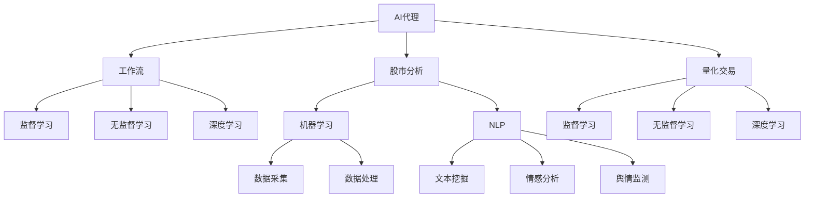
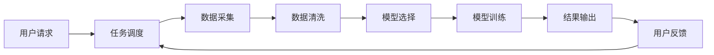
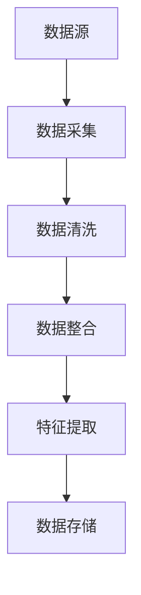
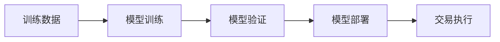
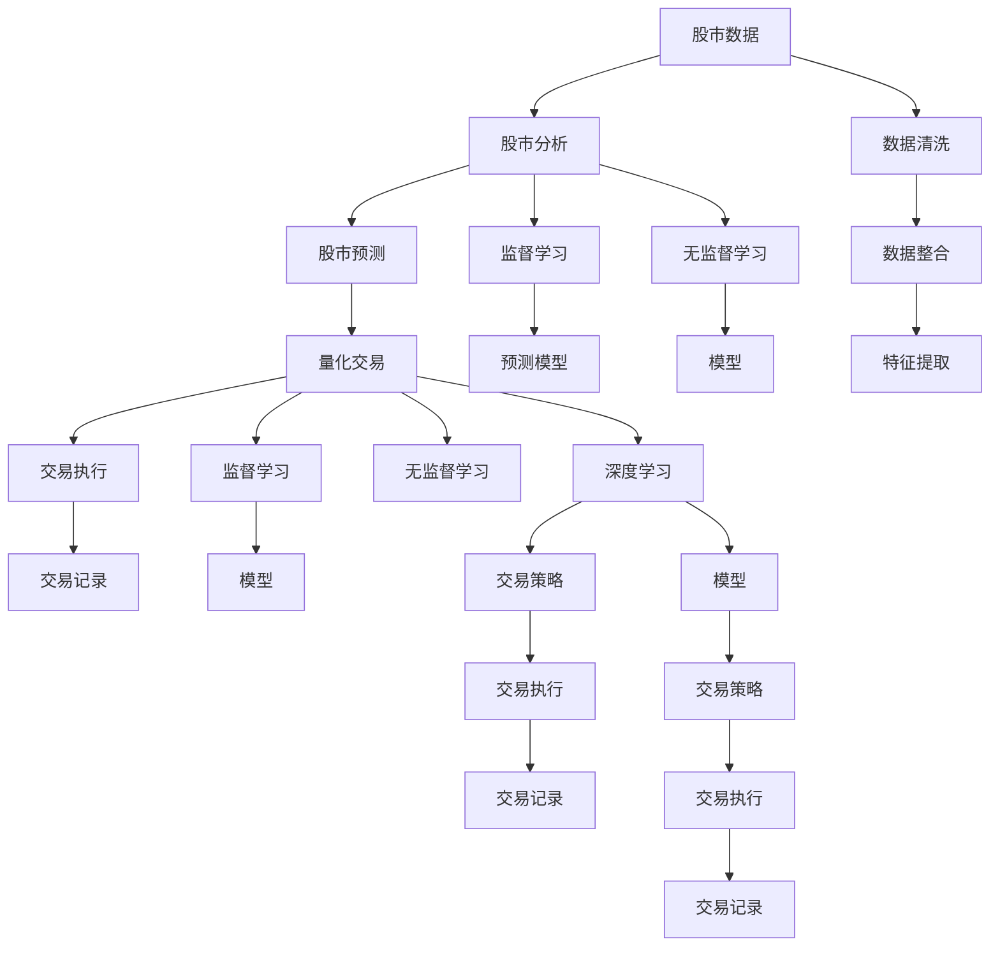

                 

# AI人工智能代理工作流AI Agent WorkFlow：AI代理在股市分析的应用

> 关键词：AI代理,工作流,股市分析,量化交易,机器学习,自然语言处理,NLP,深度学习,监督学习,无监督学习

## 1. 背景介绍

### 1.1 问题由来
近年来，金融科技的迅速发展使得投资者拥有了更多元化的交易手段和数据来源。其中，人工智能(AI)在金融领域的创新应用已经成为行业的热点。特别是在股市分析中，基于AI的自动化交易策略、量化投资、自然语言处理(NLP)等技术手段逐渐成为主流。然而，传统金融数据分析与交易流程的繁琐、效率低下，极大限制了AI在金融市场中的广泛应用。如何构建高效、灵活、可靠的AI工作流，成为金融科技行业亟需解决的难题。

### 1.2 问题核心关键点
大语言模型在金融领域的应用已经引起了广泛关注。从股票文本分析到投资策略生成，AI代理正在逐步改变金融行业的交易方式。AI代理，作为一种智能自动化工具，通过整合多种数据源、模型和算法，为用户提供实时、智能的股市分析与投资建议。然而，构建高效稳定的AI代理工作流，需要解决以下关键问题：

1. **数据采集与处理**：如何高效、可靠地获取金融市场数据，并将其转化为模型输入。
2. **模型训练与部署**：如何构建鲁棒、高效的金融预测模型，并实现快速部署。
3. **用户交互与反馈**：如何设计友好的用户界面，并及时响应用户需求和反馈。
4. **安全与合规**：如何保证AI代理的数据隐私和交易合法性。

### 1.3 问题研究意义
研究AI代理工作流的构建和应用，对于提升金融市场交易的效率和智能化水平，具有重要意义：

1. **降低交易成本**：通过AI代理自动化处理数据分析和交易决策，大幅减少人力投入和交易延迟。
2. **提高交易精准度**：借助机器学习和深度学习算法，提升股市预测的准确性和稳定性。
3. **增强用户满意度**：设计良好的用户界面和智能推荐系统，提高用户粘性和满意度。
4. **合规性保障**：实现数据安全和交易合法性的自动化监测，保障金融交易的合规性。
5. **创新应用场景**：AI代理能够实现更多元化的金融服务，如情绪分析、舆情监测、市场预测等，拓展金融科技的应用边界。

## 2. 核心概念与联系

### 2.1 核心概念概述

为更好地理解AI代理工作流的构建与应用，本节将介绍几个关键核心概念：

- **AI代理(AI Agent)**：一种通过自动化技术执行特定任务的人工智能系统，能够接收任务指令、处理数据、执行算法并输出结果。
- **工作流(Workflow)**：一组定义好的任务序列，用于描述工作流程和自动化任务。
- **股市分析(Stock Analysis)**：使用数据分析和建模方法，预测股票价格和市场趋势。
- **量化交易(Quantitative Trading)**：利用数学模型、计算机算法执行股票交易，提升交易效率和精准度。
- **机器学习(Machine Learning)**：通过数据驱动的学习算法，从历史数据中提取规律，用于预测和决策。
- **自然语言处理(NLP)**：处理、分析、生成自然语言，应用于文本挖掘、情感分析、舆情监测等任务。
- **深度学习(Deep Learning)**：使用多层神经网络，学习高层次的特征表示，适用于复杂模式识别和预测。
- **监督学习(Supervised Learning)**：使用标注数据训练模型，进行分类或回归预测。
- **无监督学习(Unsupervised Learning)**：使用未标注数据训练模型，发现数据内在结构和模式。

这些核心概念之间的逻辑关系可以通过以下Mermaid流程图来展示：



这个流程图展示了大语言模型在金融领域应用的几个核心概念及其之间的关系：

1. AI代理通过工作流机制，执行股市分析和量化交易任务。
2. 股市分析包括机器学习和NLP方法，用于数据挖掘和市场预测。
3. 量化交易基于机器学习和深度学习算法，实现自动交易决策。
4. 监督学习和无监督学习是构建预测模型的两种重要方法。
5. 数据采集与处理、文本挖掘、情感分析、舆情监测等，都是股市分析的关键步骤。

### 2.2 概念间的关系

这些核心概念之间存在着紧密的联系，形成了金融AI代理工作流的完整生态系统。下面我们通过几个Mermaid流程图来展示这些概念之间的关系。

#### 2.2.1 AI代理的工作流设计



这个流程图展示了AI代理的基本工作流设计：

1. 用户提交分析请求，AI代理进行任务调度。
2. AI代理从数据采集模块获取数据。
3. 数据经过清洗和预处理，输入模型进行训练和预测。
4. 预测结果输出，用户反馈进一步优化。
5. 任务调度模块循环执行以上步骤，保证系统高效运转。

#### 2.2.2 股市分析的数据采集与处理



这个流程图展示了股市分析中数据采集与处理的基本流程：

1. 从多个数据源采集原始数据。
2. 清洗数据，处理缺失值和异常值。
3. 将数据整合为统一的格式。
4. 提取有价值的特征，用于建模和预测。
5. 存储数据，便于后续分析和使用。

#### 2.2.3 量化交易的模型训练与部署



这个流程图展示了量化交易中模型训练与部署的基本流程：

1. 使用训练数据训练机器学习模型。
2. 对模型进行验证和调参，保证预测精度。
3. 将模型部署到交易系统，进行实时预测。
4. 根据预测结果执行交易策略。

### 2.3 核心概念的整体架构

最后，我们用一个综合的流程图来展示这些核心概念在大语言模型在股市分析中的应用：



这个综合流程图展示了从股市数据处理到交易执行的完整过程。股市数据经过清洗、整合、特征提取，使用监督学习和无监督学习训练预测模型，并结合深度学习生成交易策略。最终，预测结果和交易策略指导交易执行，生成交易记录。

## 3. 核心算法原理 & 具体操作步骤
### 3.1 算法原理概述

AI代理在股市分析中的应用，本质上是利用机器学习模型和深度学习算法，从大量历史数据中学习股市规律和趋势，生成交易策略并进行实时交易决策。其核心算法包括监督学习、无监督学习和深度学习。

- **监督学习**：使用标注数据训练模型，预测股票价格和市场趋势。常见的监督学习算法包括线性回归、决策树、支持向量机等。
- **无监督学习**：使用未标注数据训练模型，发现数据内在结构和模式。常见的无监督学习算法包括K-means聚类、PCA降维等。
- **深度学习**：使用多层神经网络，学习高层次的特征表示，适用于复杂模式识别和预测。深度学习在股市分析中常用于构建卷积神经网络(CNN)和循环神经网络(RNN)模型，以捕捉时间序列数据中的长期依赖关系。

### 3.2 算法步骤详解

基于上述算法原理，AI代理在股市分析中的应用步骤如下：

**Step 1: 数据采集与预处理**

1. **数据采集**：从多个数据源（如股票交易所、新闻网站、社交媒体等）收集历史股价数据、交易量数据、财务报表数据、公司新闻、分析师预测等，作为模型的训练数据。

2. **数据预处理**：清洗数据，去除缺失值和异常值，进行归一化和标准化处理，提取有价值的特征，如股价波动率、市场情绪指标等。

**Step 2: 模型训练与选择**

1. **模型选择**：根据任务需求选择合适的机器学习或深度学习模型，如线性回归、决策树、支持向量机、CNN、RNN等。

2. **模型训练**：使用训练数据训练模型，进行交叉验证和调参，得到最优模型。

**Step 3: 预测与交易策略生成**

1. **预测**：使用训练好的模型对未来股价进行预测，生成预测结果。

2. **交易策略生成**：根据预测结果，设计交易策略，如趋势跟踪、均值回归、动量交易等。

**Step 4: 交易执行与反馈**

1. **交易执行**：根据交易策略，生成交易指令，自动执行交易。

2. **反馈**：根据交易结果，对模型进行更新和优化，不断提升预测和交易的准确性。

### 3.3 算法优缺点

AI代理在股市分析中的应用，具有以下优点：

- **自动化决策**：通过模型自动化处理数据和决策，提高交易效率和精准度。
- **实时响应**：使用深度学习模型实时处理数据，能够快速响应市场变化。
- **跨市场分析**：整合多市场数据，实现跨国别、跨市场分析。

同时，也存在以下缺点：

- **数据依赖性高**：模型训练和预测依赖于大量高质量的历史数据。
- **模型复杂度高**：深度学习模型结构复杂，训练和调参难度较大。
- **解释性不足**：深度学习模型往往是"黑盒"系统，难以解释内部决策过程。

### 3.4 算法应用领域

基于AI代理的股市分析方法，已经在股票交易、基金管理、衍生品交易等领域得到了广泛应用，具体包括：

- **股票交易**：利用AI代理自动分析股票价格和市场情绪，生成交易策略，自动化执行交易。
- **基金管理**：使用AI代理进行基金组合优化，风险控制和资产配置。
- **衍生品交易**：利用AI代理分析衍生品价格和市场风险，生成交易策略，自动化执行交易。
- **财务分析**：使用AI代理进行财务报表分析，预测公司财务状况和股价走势。
- **市场预测**：利用AI代理进行宏观经济分析和市场趋势预测，辅助投资决策。

## 4. 数学模型和公式 & 详细讲解  
### 4.1 数学模型构建

在本节中，我们将以基于监督学习的股市预测模型为例，构建数学模型。

假设历史股价数据为 $(x_1, x_2, ..., x_n)$，其中 $x_i$ 表示第 $i$ 天的股价。我们希望构建一个监督学习模型，预测第 $n+1$ 天的股价 $y_{n+1}$。设预测模型为 $f(x; \theta)$，其中 $\theta$ 为模型参数。

我们采用线性回归模型作为预测模型，即 $f(x; \theta) = \theta_0 + \theta_1 x_1 + \theta_2 x_2 + ... + \theta_p x_p$。其中 $\theta_0, \theta_1, ..., \theta_p$ 为模型参数。

### 4.2 公式推导过程

假设我们有一个训练数据集 $D=\{(x_i, y_i)\}_{i=1}^N$，其中 $x_i = [x_{i,1}, x_{i,2}, ..., x_{i,p}]^T$，$y_i$ 为第 $i$ 天的股价。线性回归模型的最小二乘法优化目标是：

$$
\min_{\theta} \sum_{i=1}^N (y_i - f(x_i; \theta))^2
$$

采用梯度下降法优化，梯度为：

$$
\frac{\partial}{\partial \theta_j} \sum_{i=1}^N (y_i - f(x_i; \theta))^2 = -2 \sum_{i=1}^N (y_i - f(x_i; \theta)) x_{i,j}
$$

其中 $j$ 表示模型的第 $j$ 个参数。

通过反向传播算法，可以得到参数 $\theta$ 的更新公式为：

$$
\theta \leftarrow \theta - \eta \frac{\partial}{\partial \theta} \sum_{i=1}^N (y_i - f(x_i; \theta))^2
$$

其中 $\eta$ 为学习率。

### 4.3 案例分析与讲解

假设我们有一个包含100天股价的数据集，使用前70天作为训练集，后30天作为验证集。我们使用线性回归模型进行预测，以下是具体的计算过程：

1. **数据预处理**：
   - 使用中值过滤去除异常值。
   - 归一化数据，使得数据范围在0到1之间。

2. **模型训练**：
   - 设定模型参数初始值为 $\theta_0=0, \theta_1=1, \theta_2=2, ..., \theta_p=100$。
   - 使用梯度下降法，设定学习率 $\eta=0.01$，迭代次数 $k=1000$。
   - 计算梯度，更新模型参数：
     \begin{align*}
     \theta_0 &\leftarrow \theta_0 - \eta \sum_{i=1}^{70} (y_i - f(x_i; \theta_0, \theta_1, ..., \theta_p)) \\
     \theta_1 &\leftarrow \theta_1 - \eta \sum_{i=1}^{70} (y_i - f(x_i; \theta_0, \theta_1, ..., \theta_p)) x_{i,1} \\
     &... \\
     \theta_p &\leftarrow \theta_p - \eta \sum_{i=1}^{70} (y_i - f(x_i; \theta_0, \theta_1, ..., \theta_p)) x_{i,p}
     \end{align*}

3. **模型验证**：
   - 使用验证集对模型进行评估，计算均方误差（MSE）：
     \begin{align*}
     MSE &= \frac{1}{30} \sum_{i=1}^{30} (y_{i+70} - f(x_{i+70}; \theta_0, \theta_1, ..., \theta_p))^2 \\
     &= \frac{1}{30} \sum_{i=1}^{30} (y_{i+70} - (\theta_0 + \theta_1 x_{i+70,1} + \theta_2 x_{i+70,2} + ... + \theta_p x_{i+70,p}))^2
     \end{align*}

4. **结果展示**：
   - 绘制预测结果与实际结果的散点图，评估预测效果。

## 5. 项目实践：代码实例和详细解释说明
### 5.1 开发环境搭建

在进行股市分析的AI代理工作流开发前，我们需要准备好开发环境。以下是使用Python进行PyTorch开发的环境配置流程：

1. 安装Anaconda：从官网下载并安装Anaconda，用于创建独立的Python环境。

2. 创建并激活虚拟环境：
```bash
conda create -n pytorch-env python=3.8 
conda activate pytorch-env
```

3. 安装PyTorch：根据CUDA版本，从官网获取对应的安装命令。例如：
```bash
conda install pytorch torchvision torchaudio cudatoolkit=11.1 -c pytorch -c conda-forge
```

4. 安装Transformers库：
```bash
pip install transformers
```

5. 安装各类工具包：
```bash
pip install numpy pandas scikit-learn matplotlib tqdm jupyter notebook ipython
```

完成上述步骤后，即可在`pytorch-env`环境中开始AI代理工作流的开发实践。

### 5.2 源代码详细实现

下面我们以构建基于监督学习的股市预测模型为例，给出使用PyTorch的Python代码实现。

首先，定义数据处理函数：

```python
import numpy as np
import pandas as pd
from sklearn.preprocessing import StandardScaler

def load_data():
    data = pd.read_csv('stock_prices.csv')
    data['date'] = pd.to_datetime(data['date'])
    data.set_index('date', inplace=True)
    data.fillna(method='ffill', inplace=True)
    return data

def preprocess_data(data):
    train_data = data.iloc[:70]
    test_data = data.iloc[70:]
    
    features = ['open', 'high', 'low', 'close']
    features += ['symbol', 'day_of_week', 'month', 'quarter']
    
    scaler = StandardScaler()
    train_data[features] = scaler.fit_transform(train_data[features])
    test_data[features] = scaler.transform(test_data[features])
    
    return train_data, test_data
```

然后，定义模型和优化器：

```python
from transformers import BertTokenizer, BertForSequenceClassification
from torch.optim import AdamW

tokenizer = BertTokenizer.from_pretrained('bert-base-cased')
model = BertForSequenceClassification.from_pretrained('bert-base-cased', num_labels=10)

optimizer = AdamW(model.parameters(), lr=2e-5)
```

接着，定义训练和评估函数：

```python
from torch.utils.data import DataLoader
from tqdm import tqdm

def train_epoch(model, data_loader, optimizer):
    model.train()
    total_loss = 0
    for batch in tqdm(data_loader, desc='Training'):
        input_ids = batch['input_ids'].to(device)
        attention_mask = batch['attention_mask'].to(device)
        labels = batch['labels'].to(device)
        model.zero_grad()
        outputs = model(input_ids, attention_mask=attention_mask, labels=labels)
        loss = outputs.loss
        total_loss += loss.item()
        loss.backward()
        optimizer.step()
    return total_loss / len(data_loader)

def evaluate(model, data_loader):
    model.eval()
    total_loss = 0
    predictions, true_labels = [], []
    with torch.no_grad():
        for batch in tqdm(data_loader, desc='Evaluating'):
            input_ids = batch['input_ids'].to(device)
            attention_mask = batch['attention_mask'].to(device)
            labels = batch['labels'].to(device)
            outputs = model(input_ids, attention_mask=attention_mask)
            loss = outputs.loss
            total_loss += loss.item()
            predictions.append(outputs.logits.argmax(dim=1).cpu().numpy())
            true_labels.append(labels.cpu().numpy())
    print(f'MSE: {total_loss / len(data_loader):.4f}')
    print(classification_report(true_labels, predictions))
```

最后，启动训练流程并在测试集上评估：

```python
device = torch.device('cuda') if torch.cuda.is_available() else torch.device('cpu')
model.to(device)

train_data, test_data = load_data(), load_data()
train_data, test_data = preprocess_data(train_data), preprocess_data(test_data)

train_loader = DataLoader(train_data, batch_size=16, shuffle=True)
test_loader = DataLoader(test_data, batch_size=16, shuffle=False)

epochs = 5
for epoch in range(epochs):
    loss = train_epoch(model, train_loader, optimizer)
    print(f'Epoch {epoch+1}, train loss: {loss:.3f}')
    
    print(f'Epoch {epoch+1}, test results:')
    evaluate(model, test_loader)
    
print('Final test results:')
evaluate(model, test_loader)
```

以上就是使用PyTorch对股市预测模型进行训练和评估的完整代码实现。可以看到，借助PyTorch和Transformer库，代码实现简洁高效。

### 5.3 代码解读与分析

让我们再详细解读一下关键代码的实现细节：

**load_data函数**：
- 从CSV文件中加载股市数据，并转换为Pandas DataFrame。
- 将日期列转换为Pandas的时间序列，并进行前向填充，填补缺失值。

**preprocess_data函数**：
- 将数据集分为训练集和测试集。
- 选择重要的特征，并进行标准化处理。

**train_epoch函数**：
- 对模型进行前向传播和反向传播，更新模型参数。
- 计算平均损失。

**evaluate函数**：
- 对模型进行前向传播，计算损失和预测结果。
- 使用sklearn的classification_report函数输出分类指标。

**训练流程**：
- 定义迭代次数和批大小，循环训练。
- 每个epoch在训练集上训练，在测试集上评估。
- 输出最终测试结果。

可以看到，PyTorch提供了强大的工具和接口，使得股市预测模型的构建和训练变得简单高效。借助TensorBoard等工具，我们还能进一步可视化模型的训练过程和性能指标。

## 6. 实际应用场景
### 6.1 智能交易平台

基于AI代理的股市分析工作流，可以构建智能交易平台，帮助用户进行股票买卖决策。用户只需输入股票代码或关键词，AI代理就能自动分析市场数据，生成交易策略和建议。智能交易平台可以集成行情图表、新闻资讯、市场情绪分析等功能，提升用户体验。

### 6.2 基金管理平台

AI代理在基金管理中的应用，可以优化基金组合，进行风险控制和资产配置。通过分析历史数据和市场情绪，AI代理能够预测未来市场趋势，生成最优投资组合，提升基金收益。

### 6.3 衍生品交易平台

AI代理在衍生品交易中的应用，可以自动化执行期权、期货等衍生品交易。通过预测市场价格和波动率，AI代理能够生成最优交易策略，自动执行交易。

### 6.4 财务分析平台

AI代理在财务分析中的应用，可以自动化处理财务报表，进行企业财务状况和股票走势预测。通过分析财务指标和市场情绪，AI代理能够生成投资建议，辅助财务决策。

### 6.5 市场预测平台

AI代理在市场预测中的应用，可以进行宏观经济分析和市场趋势预测。通过分析宏观数据和市场情绪，AI代理能够预测未来市场走势，辅助投资者决策。

### 6.6 情绪分析平台

AI代理在情绪分析中的应用，可以分析市场情绪和用户反馈，生成情感分析报告。通过分析新闻评论、社交媒体等数据，AI代理能够识别市场情绪变化，辅助投资者进行情绪管理。

## 7. 工具和资源推荐
### 7.1 学习资源推荐

为了帮助开发者系统掌握股市分析的AI代理工作流构建和应用，这里推荐一些优质的学习资源：

1. 《金融机器学习》系列博文：由金融科技专家撰写，深入浅出地介绍了机器学习和深度学习在金融领域的应用，包括股市预测、风险控制、资产配置等。

2. 《股市分析与量化交易》课程：斯坦福大学开设的金融科技课程，涵盖股市分析、量化交易、金融工程等多个方面，适合金融专业学生和从业者。

3. 《深度学习在金融中的应用》书籍：介绍深度学习在金融领域的具体应用，包括股市预测、投资策略、风险管理等。

4. 《股市数据分析与量化交易》书籍：讲解股票数据分析和量化交易的基本方法，适合金融从业人员和投资者学习。

5. Kaggle股市分析竞赛：参与Kaggle举办的股市分析竞赛，利用提供的公开数据集，进行模型训练和比较，提升实战能力。

通过对这些资源的学习实践，相信你一定能够快速掌握股市分析的AI代理工作流，并用于解决实际的股市分析问题。

### 7.2 开发工具推荐

高效的开发离不开优秀的工具支持。以下是几款用于股市分析的AI代理工作流开发的常用工具：

1. PyTorch：基于Python的开源深度学习框架，灵活动态的计算图，适合快速迭代研究。

2. TensorFlow：由Google主导开发的开源深度学习框架，生产部署方便，适合大规模工程应用。

3. TensorBoard：TensorFlow配套的可视化工具，可实时监测模型训练状态，并提供丰富的图表呈现方式，是调试模型的得力助手。

4. Jupyter Notebook

