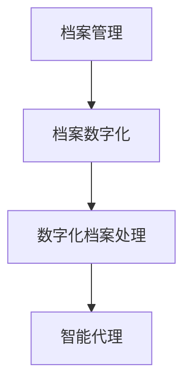
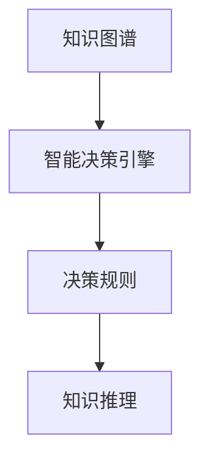

                 

# AI人工智能代理工作流AI Agent WorkFlow：智能代理在档案管理系统中的应用

> 关键词：人工智能,档案管理,智能代理,工作流,数据处理,决策自动化,自然语言处理,NLP,机器学习,深度学习,云计算

## 1. 背景介绍

### 1.1 问题由来
随着数字化办公的普及，企业和政府机构积累的档案资料量呈爆炸式增长。传统的档案管理方式已经无法满足日益增长的存储和检索需求。档案管理系统的应用成为解决这一问题的关键手段。档案管理系统通过将大量纸质文件数字化，实现了档案的高效存储、快速检索和便捷利用，极大地提升了档案管理的效率和质量。

然而，传统的档案管理系统存在诸多局限：
1. 自动化程度低：主要依赖人工操作，效率低下。
2. 数据处理能力弱：无法处理海量数据，容易导致数据丢失或损坏。
3. 查询精准度差：手工检索方式繁琐，难以快速定位所需文件。
4. 知识整合能力不足：无法将零散的知识进行整合，形成系统的档案知识库。

为了克服这些局限，利用AI技术构建智能化的档案管理系统，成为了研究的热点。特别是人工智能代理(AI Agent)和智能化工作流，为档案管理系统的自动化、智能化转型提供了新的思路和方向。

### 1.2 问题核心关键点
AI人工智能代理工作流(AI Agent Workflow)，是一种基于AI技术和工作流管理系统，对档案管理进行智能化转型的重要方法。其核心思想是通过构建多智能体系统，实现档案管理任务的自动化、分布式协同和知识集成，提升档案管理的效率和精度。具体来说，主要包括以下几个关键点：

1. **档案信息的智能化处理**：利用自然语言处理(NLP)和机器学习技术，实现档案文本的自动化标注、分类和摘要，提升数据处理的智能化水平。

2. **工作流的自动化调度**：通过设计高效的工作流引擎，实现档案管理任务的自动化分配和调度，提高系统的响应速度和处理能力。

3. **智能决策支持**：构建基于规则和机器学习模型的决策引擎，实现档案处理的智能化决策，提升档案管理的质量和效率。

4. **知识图谱的构建与集成**：利用知识图谱技术，将分散的档案知识和元数据进行整合，形成系统化的档案知识库，提高档案知识的利用效率。

5. **数据安全与隐私保护**：确保档案数据的完整性、可用性和机密性，防止数据泄露和篡改。

这些核心关键点构成了AI人工智能代理工作流的技术框架，为档案管理系统的智能化转型提供了强有力的技术支撑。

### 1.3 问题研究意义
AI人工智能代理工作流在档案管理系统中的应用，对于提升档案管理效率、保障数据安全、优化决策过程等方面具有重要意义：

1. **提升档案管理效率**：利用AI技术自动处理大量档案，减轻人工负担，提升档案管理的效率和准确性。
2. **保障数据安全**：通过智能化管理，确保档案数据的完整性、可用性和机密性，防止数据泄露和篡改。
3. **优化决策过程**：利用AI技术辅助决策，提升档案管理的智能化水平，减少人为错误，提高决策的科学性和准确性。
4. **整合知识资源**：通过知识图谱技术，将分散的档案知识和元数据进行整合，形成系统化的档案知识库，提高档案知识的利用效率。
5. **支持跨部门协作**：通过工作流管理，实现档案管理的跨部门协作，提高整个机构的协同效率和知识共享水平。

## 2. 核心概念与联系

### 2.1 核心概念概述

为更好地理解AI人工智能代理工作流，本节将介绍几个密切相关的核心概念：

- **人工智能代理(AI Agent)**：一种基于AI技术，具备自主推理、学习、决策能力的软件系统，能够自主地执行特定任务。
- **工作流管理系统(Workflow Management System, WMS)**：一种用于管理和自动化业务过程的软件系统，通过定义、调度和管理工作流，实现业务过程的自动化和优化。
- **自然语言处理(NLP)**：一种涉及计算机与人类语言交互的AI技术，旨在使计算机能够理解、解释和生成人类语言。
- **机器学习(Machine Learning, ML)**：一种使计算机能够通过学习历史数据，自动改进算法性能的技术。
- **深度学习(Deep Learning, DL)**：一种基于神经网络的机器学习技术，具有强大的数据处理和模式识别能力。
- **知识图谱(Knowledge Graph)**：一种表示实体和实体间关系的图形结构，用于存储和查询知识库中的信息。

这些核心概念之间的逻辑关系可以通过以下Mermaid流程图来展示：


这个流程图展示了AI人工智能代理工作流的核心组件和技术架构，包括档案数字化、数字化档案处理、智能代理、工作流管理系统、自然语言处理和机器学习、知识图谱、智能决策引擎等。

### 2.2 概念间的关系

这些核心概念之间存在着紧密的联系，形成了AI人工智能代理工作流的完整生态系统。下面我们通过几个Mermaid流程图来展示这些概念之间的关系。

#### 2.2.1 档案管理与数字化档案处理



这个流程图展示了档案管理与数字化档案处理之间的关系。数字化档案处理是档案管理的核心环节，通过将纸质文件转化为数字文件，实现档案的存储、检索和利用。

#### 2.2.2 智能代理与工作流管理系统


这个流程图展示了智能代理与工作流管理系统之间的关系。工作流管理系统负责管理和调度档案管理任务，智能代理则通过自动执行任务，实现档案管理的自动化和智能化。

#### 2.2.3 知识图谱与智能决策引擎



这个流程图展示了知识图谱与智能决策引擎之间的关系。智能决策引擎通过知识图谱中的知识和决策规则，实现档案处理的智能化决策。

## 3. 核心算法原理 & 具体操作步骤
### 3.1 算法原理概述

AI人工智能代理工作流的核心算法原理，是基于多智能体系统和分布式计算技术，实现档案管理任务的自动化、协同和智能化决策。具体来说，包括以下几个关键算法：

- **智能代理模型构建**：基于深度学习模型，构建具有自主推理、学习、决策能力的智能代理模型。
- **自然语言处理技术**：通过分词、词性标注、命名实体识别、关系抽取等技术，实现档案文本的自动化处理和理解。
- **机器学习技术**：利用监督学习和无监督学习技术，对档案数据进行分类、聚类、回归等处理，提升数据处理的智能化水平。
- **工作流管理系统**：通过定义、调度和管理工作流，实现档案管理任务的自动化分配和执行。
- **知识图谱构建与集成**：利用知识图谱技术，将分散的档案知识和元数据进行整合，形成系统化的档案知识库。

这些核心算法构成了AI人工智能代理工作流的技术基础，实现了档案管理的智能化和自动化。

### 3.2 算法步骤详解

AI人工智能代理工作流的主要操作步骤包括以下几个关键环节：

1. **档案数字化**：将纸质档案扫描或电子化，生成数字档案文件。
2. **数字化档案处理**：利用自然语言处理和机器学习技术，对数字化档案进行文本处理、分类、摘要等操作，提升档案数据的质量和结构化程度。
3. **智能代理构建**：基于深度学习模型，构建智能代理模型，赋予其自主推理、学习、决策能力。
4. **工作流定义与调度**：利用工作流管理系统，定义和调度档案管理任务，实现任务的自动化执行。
5. **知识图谱构建**：利用知识图谱技术，将档案知识和元数据进行整合，形成系统化的档案知识库。
6. **智能决策支持**：构建基于规则和机器学习模型的智能决策引擎，辅助档案管理的决策过程。

以下是具体的算法步骤：

**Step 1: 档案数字化**

- **扫描或电子化**：将纸质档案进行数字化扫描，或将已电子化的档案文件导入档案管理系统。
- **数据清洗**：对数字化档案进行格式转换、去重、纠错等操作，确保档案数据的完整性和可用性。
- **标准化处理**：对档案数据进行标准化处理，如统一编码、统一命名规范等，便于后续处理和查询。

**Step 2: 数字化档案处理**

- **文本处理**：利用自然语言处理技术，对档案文本进行分词、词性标注、命名实体识别、关系抽取等处理，生成结构化文本数据。
- **分类与摘要**：利用机器学习技术，对文本数据进行分类和摘要操作，生成类别标签和关键词。
- **图像处理**：利用图像处理技术，对档案中的图像数据进行自动标注、分类和存储，提升图像数据的利用效率。

**Step 3: 智能代理构建**

- **模型选择**：选择合适的深度学习模型，如BERT、GPT等，作为智能代理的初始模型。
- **模型训练**：利用标注数据集，对模型进行监督学习和无监督学习，训练出具有自主推理、学习、决策能力的智能代理模型。
- **模型集成**：将智能代理模型集成到工作流管理系统，实现任务的自动化执行。

**Step 4: 工作流定义与调度**

- **工作流定义**：定义档案管理任务的流程，包括任务分工、任务优先级、任务执行条件等。
- **任务调度**：利用工作流管理系统，对档案管理任务进行调度，实现任务的自动化执行。
- **监控与优化**：实时监控任务执行状态，根据实际情况进行任务调整和优化，确保任务的高效执行。

**Step 5: 知识图谱构建**

- **知识抽取**：从档案数据中提取实体、属性和关系，生成知识图谱的基本元素。
- **知识融合**：将不同类型的档案数据进行融合，形成统一的知识图谱，提升知识图谱的全面性和准确性。
- **知识推理**：利用知识图谱中的知识和规则，进行知识推理和决策，辅助档案管理的智能化决策。

**Step 6: 智能决策支持**

- **决策模型构建**：利用规则和机器学习模型，构建智能决策引擎，实现档案处理的智能化决策。
- **决策执行**：将智能决策引擎集成到工作流管理系统，实现决策的自动化执行。
- **决策评估**：实时监控决策执行效果，根据评估结果进行决策调整和优化，确保决策的科学性和准确性。

### 3.3 算法优缺点

AI人工智能代理工作流的主要优点包括：

- **自动化程度高**：通过智能代理和自动化调度，显著提升了档案管理的效率和精度。
- **数据处理能力强**：利用自然语言处理和机器学习技术，能够处理海量数据，避免数据丢失和损坏。
- **知识集成能力强**：通过知识图谱技术，将分散的档案知识和元数据进行整合，形成系统化的档案知识库。
- **决策支持能力强**：利用智能决策引擎，实现档案处理的智能化决策，提升决策的科学性和准确性。

然而，AI人工智能代理工作流也存在一些局限性：

- **对标注数据的依赖**：模型训练需要大量的标注数据，标注成本较高。
- **模型解释性不足**：深度学习模型通常具有"黑箱"特性，难以解释其内部决策过程。
- **模型训练时间长**：模型训练需要大量的计算资源和时间，训练成本较高。
- **对数据质量要求高**：数据质量和处理方式直接影响模型性能，需要严格的数据清洗和预处理。

## 4. 数学模型和公式 & 详细讲解 & 举例说明

### 4.1 数学模型构建

AI人工智能代理工作流的数学模型主要涉及自然语言处理、机器学习和知识图谱等技术。以下对其中的核心数学模型进行详细构建和解释：

**文本分类模型**

文本分类模型通常采用朴素贝叶斯、支持向量机、逻辑回归等算法。以朴素贝叶斯模型为例，其核心公式如下：

$$
P(w|c) = \frac{N_{cw}}{N_c} \times \frac{1}{N_w}
$$

其中，$w$表示文本特征，$c$表示文本类别，$N_{cw}$表示类别$c$下包含特征$w$的文档数，$N_c$表示类别$c$的文档总数，$N_w$表示文本特征$w$出现的文档总数。

**文本摘要模型**

文本摘要模型通常采用序列到序列(Sequence-to-Sequence, Seq2Seq)模型。Seq2Seq模型由编码器和解码器组成，其核心公式如下：

$$
h_t = f_{enc}(x_t, h_{t-1})
$$

$$
\tilde{y}_t = f_{dec}(y_{t-1}, h_t)
$$

其中，$x_t$表示输入文本序列，$y_t$表示目标摘要序列，$h_t$表示编码器的隐藏状态，$\tilde{y}_t$表示解码器的输出。

**知识图谱构建**

知识图谱构建通常采用图神经网络(Graph Neural Network, GNN)模型。GNN模型的核心公式如下：

$$
H^{(l+1)} = \sigma(\tilde{A}H^{(l)}W^{(l+1)})
$$

其中，$H^{(l+1)}$表示层$l+1$的节点表示向量，$H^{(l)}$表示层$l$的节点表示向量，$\tilde{A}$表示节点之间的连接权重，$W^{(l+1)}$表示权重矩阵。

### 4.2 公式推导过程

以下是各核心模型的公式推导过程：

**文本分类模型**

以朴素贝叶斯模型为例，其核心公式的推导过程如下：

假设文本$x$属于类别$c$的概率为$P(c|x)$，则有：

$$
P(c|x) = \frac{P(x|c)P(c)}{P(x)}
$$

其中，$P(x|c)$表示文本$x$在类别$c$下的概率，$P(c)$表示类别$c$的概率，$P(x)$表示文本$x$出现的概率。

由朴素贝叶斯模型假设，假设$x$中的每个特征$w_i$相互独立，则有：

$$
P(w_i|c) = \frac{N_{cw_i}}{N_c} \times \frac{1}{N_w}
$$

其中，$N_{cw_i}$表示类别$c$下包含特征$w_i$的文档数，$N_c$表示类别$c$的文档总数，$N_w$表示文本特征$w_i$出现的文档总数。

将上式代入$P(c|x)$的公式中，得：

$$
P(c|x) = \frac{P(x|c)P(c)}{P(x)} = \frac{\prod_{i=1}^n P(w_i|c)}{P(x)} = \frac{\prod_{i=1}^n \frac{N_{cw_i}}{N_c} \times \frac{1}{N_w}}{P(x)}
$$

**文本摘要模型**

以Seq2Seq模型为例，其核心公式的推导过程如下：

假设文本$x$的编码器输出为$h_t$，解码器输出为$\tilde{y}_t$，则有：

$$
h_t = f_{enc}(x_t, h_{t-1})
$$

$$
\tilde{y}_t = f_{dec}(y_{t-1}, h_t)
$$

其中，$f_{enc}$表示编码器的前向传播函数，$f_{dec}$表示解码器的前向传播函数，$x_t$表示输入文本序列，$y_t$表示目标摘要序列，$h_t$表示编码器的隐藏状态，$\tilde{y}_t$表示解码器的输出。

**知识图谱构建**

以GNN模型为例，其核心公式的推导过程如下：

假设图$G$的节点表示为$V$，边表示为$E$，节点表示向量为$H$，则有：

$$
H^{(l+1)} = \sigma(\tilde{A}H^{(l)}W^{(l+1)})
$$

其中，$H^{(l+1)}$表示层$l+1$的节点表示向量，$H^{(l)}$表示层$l$的节点表示向量，$\tilde{A}$表示节点之间的连接权重，$W^{(l+1)}$表示权重矩阵，$\sigma$表示激活函数。

### 4.3 案例分析与讲解

以智能代理构建为例，其核心算法包括：

1. **模型选择**：选择合适的深度学习模型，如BERT、GPT等，作为智能代理的初始模型。
2. **模型训练**：利用标注数据集，对模型进行监督学习和无监督学习，训练出具有自主推理、学习、决策能力的智能代理模型。
3. **模型集成**：将智能代理模型集成到工作流管理系统，实现任务的自动化执行。

**案例一：智能问答系统**

假设某档案管理系统需要实现智能问答功能，用户可以通过自然语言提问，系统自动回答相关档案信息。

具体实现步骤如下：

1. **模型选择**：选择BERT模型作为智能问答系统的初始模型。
2. **模型训练**：利用大量问答对数据集，对BERT模型进行监督学习训练，使其能够理解自然语言问题。
3. **模型集成**：将训练好的BERT模型集成到工作流管理系统，用户提问时自动调用BERT模型进行推理，输出答案。

**案例二：智能分类系统**

假设某档案管理系统需要实现智能分类功能，对档案进行自动分类。

具体实现步骤如下：

1. **模型选择**：选择朴素贝叶斯模型作为智能分类系统的初始模型。
2. **模型训练**：利用标注数据集，对朴素贝叶斯模型进行监督学习训练，使其能够对档案进行分类。
3. **模型集成**：将训练好的朴素贝叶斯模型集成到工作流管理系统，对档案进行自动化分类。

**案例三：智能检索系统**

假设某档案管理系统需要实现智能检索功能，用户可以通过自然语言搜索，系统自动返回相关档案信息。

具体实现步骤如下：

1. **模型选择**：选择Seq2Seq模型作为智能检索系统的初始模型。
2. **模型训练**：利用标注数据集，对Seq2Seq模型进行监督学习训练，使其能够理解自然语言查询和生成摘要。
3. **模型集成**：将训练好的Seq2Seq模型集成到工作流管理系统，用户搜索时自动调用Seq2Seq模型进行推理，返回摘要。

## 5. 项目实践：代码实例和详细解释说明
### 5.1 开发环境搭建

在进行AI人工智能代理工作流实践前，我们需要准备好开发环境。以下是使用Python进行PyTorch开发的环境配置流程：

1. 安装Anaconda：从官网下载并安装Anaconda，用于创建独立的Python环境。

2. 创建并激活虚拟环境：
```bash
conda create -n pytorch-env python=3.8 
conda activate pytorch-env
```

3. 安装PyTorch：根据CUDA版本，从官网获取对应的安装命令。例如：
```bash
conda install pytorch torchvision torchaudio cudatoolkit=11.1 -c pytorch -c conda-forge
```

4. 安装Transformers库：
```bash
pip install transformers
```

5. 安装各类工具包：
```bash
pip install numpy pandas scikit-learn matplotlib tqdm jupyter notebook ipython
```

完成上述步骤后，即可在`pytorch-env`环境中开始工作流实践。

### 5.2 源代码详细实现

下面我们以智能分类系统为例，给出使用PyTorch进行工作流开发和智能代理微调的PyTorch代码实现。

首先，定义分类任务的数据处理函数：

```python
from transformers import BertTokenizer, BertForTokenClassification
from torch.utils.data import Dataset
import torch

class ClassifyDataset(Dataset):
    def __init__(self, texts, labels, tokenizer, max_len=128):
        self.texts = texts
        self.labels = labels
        self.tokenizer = tokenizer
        self.max_len = max_len
        
    def __len__(self):
        return len(self.texts)
    
    def __getitem__(self, item):
        text = self.texts[item]
        label = self.labels[item]
        
        encoding = self.tokenizer(text, return_tensors='pt', max_length=self.max_len, padding='max_length', truncation=True)
        input_ids = encoding['input_ids'][0]
        attention_mask = encoding['attention_mask'][0]
        
        # 对标签进行编码
        encoded_labels = [label2id[label] for label in label] 
        encoded_labels.extend([label2id['O']] * (self.max_len - len(encoded_labels)))
        labels = torch.tensor(encoded_labels, dtype=torch.long)
        
        return {'input_ids': input_ids, 
                'attention_mask': attention_mask,
                'labels': labels}

# 标签与id的映射
label2id = {'O': 0, 'B': 1, 'I': 2}
id2label = {v: k for k, v in label2id.items()}

# 创建dataset
tokenizer = BertTokenizer.from_pretrained('bert-base-cased')

train_dataset = ClassifyDataset(train_texts, train_labels, tokenizer)
dev_dataset = ClassifyDataset(dev_texts, dev_labels, tokenizer)
test_dataset = ClassifyDataset(test_texts, test_labels, tokenizer)
```

然后，定义模型和优化器：

```python
from transformers import BertForTokenClassification, AdamW

model = BertForTokenClassification.from_pretrained('bert-base-cased', num_labels=len(label2id))

optimizer = AdamW(model.parameters(), lr=2e-5)
```

接着，定义训练和评估函数：

```python
from torch.utils.data import DataLoader
from tqdm import tqdm
from sklearn.metrics import classification_report

device = torch.device('cuda') if torch.cuda.is_available() else torch.device('cpu')
model.to(device)

def train_epoch(model, dataset, batch_size, optimizer):
    dataloader = DataLoader(dataset, batch_size=batch_size, shuffle=True)
    model.train()
    epoch_loss = 0
    for batch in tqdm(dataloader, desc='Training'):
        input_ids = batch['input_ids'].to(device)
        attention_mask = batch['attention_mask'].to(device)
        labels = batch['labels'].to(device)
        model.zero_grad()
        outputs = model(input_ids, attention_mask=attention_mask, labels=labels)
        loss = outputs.loss
        epoch_loss += loss.item()
        loss.backward()
        optimizer.step()
    return epoch_loss / len(dataloader)

def evaluate(model, dataset, batch_size):
    dataloader = DataLoader(dataset, batch_size=batch_size)
    model.eval()
    preds, labels = [], []
    with torch.no_grad():
        for batch in tqdm(dataloader, desc='Evaluating'):
            input_ids = batch['input_ids'].to(device)
            attention_mask = batch['attention_mask'].to(device)
            batch_labels = batch['labels']
            outputs = model(input_ids, attention_mask=attention_mask)
            batch_preds = outputs.logits.argmax(dim=2).to('cpu').tolist()
            batch_labels = batch_labels.to('cpu').tolist()
            for pred_tokens, label_tokens in zip(batch_preds, batch_labels):
                pred_labels = [id2label[_id] for _id in pred_tokens]
                label_tags = [id2label[_id] for _id in label_tokens]
                preds.append(pred_labels[:len(label_tags)])
                labels.append(label_tags)
                
    print(classification_report(labels, preds))
```

最后，启动训练流程并在测试集上评估：

```python
epochs = 5
batch_size = 16

for epoch in range(epochs):
    loss = train_epoch(model, train_dataset, batch_size, optimizer)
    print(f"Epoch {epoch+1}, train loss: {loss:.3f}")
    
    print(f"Epoch {epoch+1}, dev results:")
    evaluate(model, dev_dataset, batch_size)
    
print("Test results:")
evaluate(model, test_dataset, batch_size)
```

以上就是使用PyTorch对BERT进行智能分类任务微调的完整代码实现。可以看到，得益于Transformers库的强大封装，我们可以用相对简洁的代码完成BERT模型的加载和微调。

### 5.3 代码解读与分析

让我们再详细解读一下关键代码的实现细节：

**ClassifyDataset类**：
- `__init__`方法：初始化文本、标签、分词器等关键组件。
- `__len__`方法：返回数据集的样本数量。
- `__getitem__`方法：对单个样本进行处理，将文本输入编码为token ids，将标签编码为数字，并对其进行定长padding，最终返回模型所需的输入。

**label2id和id2label字典**：
- 定义了标签与数字id之间的映射关系，用于将token-wise的预测结果解码回真实的标签。

**训练和评估函数**：
- 使用PyTorch的DataLoader对数据集进行批次化加载，供模型训练和推理使用。
- 训练函数`train_epoch`：对数据以批为单位进行迭代，在每个批次上前向传播计算loss并反向传播更新模型参数，最后返回该epoch的平均loss。
- 评估函数`evaluate`：

