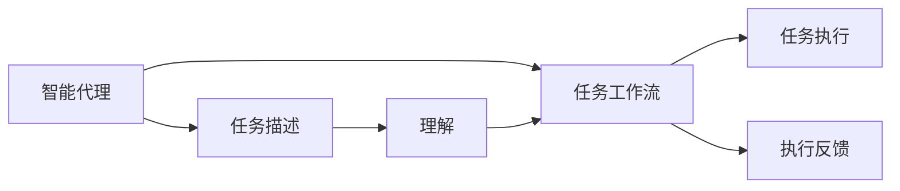
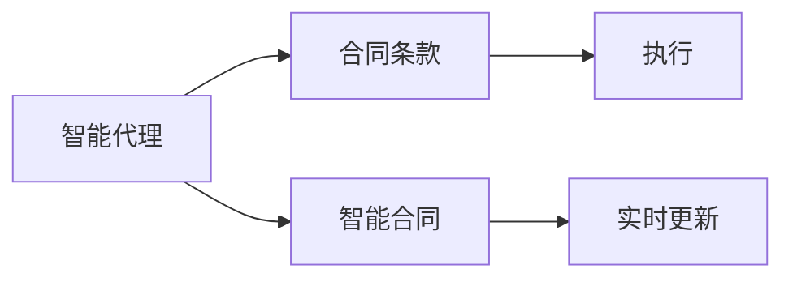

                 

# AI人工智能代理工作流AI Agent WorkFlow：智能代理在法律服务系统中的应用

> 关键词：人工智能,智能代理,法律服务,工作流,自然语言处理(NLP),法律咨询,法律文档生成,智能合同

## 1. 背景介绍

### 1.1 问题由来
在法律服务领域，传统的法律咨询和文档生成工作依赖于专业律师的全面经验和高昂的人工成本。尽管近年来人工智能技术在NLP等方向上取得了显著进展，但在法律专业领域的落地应用仍然面临着诸多挑战。如何高效、准确地构建智能法律代理系统，以缓解律师工作负担、提升法律服务效率，成为了行业的热点问题。

智能代理系统通过模拟人类代理人的工作方式，实现自动化的任务执行，具备任务智能分发、自动化任务处理和实时反馈能力。智能代理的应用场景广泛，不仅可以用于法律服务，还涉及医疗、金融、教育等多个行业。

### 1.2 问题核心关键点
智能代理在法律服务中的应用，通过以下关键点实现：

- **任务分发机制**：将法律服务请求自动分配给合适的代理人进行处理。
- **自动化任务处理**：代理人根据任务描述自动执行如信息检索、数据分析等操作。
- **实时反馈机制**：代理人处理任务过程中，实时反馈进展和结果，确保任务按时完成。
- **知识积累**：代理人通过学习大量法律案例和规范，不断提升自身决策的准确性。
- **协同工作**：多人协作模式下，代理人之间能够高效沟通、协同处理复杂任务。

智能代理系统的构建，不仅需要先进的信息检索和文本处理技术，还需要完善的业务逻辑和决策机制。本文将系统介绍智能代理在法律服务系统中的应用，分析其工作原理和实现步骤，并展望未来发展趋势。

## 2. 核心概念与联系

### 2.1 核心概念概述

为更好地理解智能代理在法律服务系统中的应用，本节将介绍几个密切相关的核心概念：

- **智能代理(AI Agent)**：模拟人类代理人工作流程，实现任务自动化处理、信息检索、决策制定的AI系统。智能代理通过自然语言处理(NLP)技术，理解任务描述和用户意图，并自动执行相应操作。

- **任务工作流(Workflow)**：在智能代理系统中，任务的处理流程按照预定义的顺序和规则进行，确保任务执行的逻辑性和准确性。

- **法律服务系统(Legal Service System)**：智能代理在其中的应用场景，涉及案件处理、法律咨询、合同生成、法律文档生成等多个模块。

- **自然语言处理(NLP)**：使智能代理能够理解、处理人类语言的计算机技术。NLP技术包括语言模型、文本分类、命名实体识别、情感分析等子领域。

- **智能合同**：指基于智能代理技术，能够自动执行合同条款、实时更新合同状态的电子合同。智能合同应用了区块链和智能合约等先进技术，提升法律合同的执行效率和安全性。

- **法律咨询和文档生成**：智能代理在法律服务系统中，用于自动解答法律问题、生成法律文档等功能，减轻律师工作负担，提升法律服务的质量和效率。

这些核心概念之间的逻辑关系可以通过以下Mermaid流程图来展示：

```mermaid
graph TB
    A[智能代理(AI Agent)] --> B[任务工作流(Workflow)]
    A --> C[法律服务系统(Legal Service System)]
    B --> D[自然语言处理(NLP)]
    C --> E[法律咨询和文档生成]
    D --> F[智能合同]
```

这个流程图展示了几者之间的关系：

1. 智能代理(AI Agent)通过任务工作流(Workflow)在法律服务系统(Legal Service System)中执行各种任务。
2. 任务工作流基于自然语言处理(NLP)技术，理解和执行任务描述。
3. 智能代理执行法律咨询和文档生成等功能。
4. 智能代理还可用于生成智能合同。

### 2.2 概念间的关系

这些核心概念之间存在着紧密的联系，形成了智能代理在法律服务系统中完整的执行流程。

#### 2.2.1 智能代理与任务工作流



智能代理接收任务描述，通过任务工作流进行任务理解和执行。任务工作流将任务分解成多个子任务，按顺序执行，并实时反馈执行情况。

#### 2.2.2 智能代理与自然语言处理


智能代理依赖自然语言处理技术，理解任务描述和用户意图，自动执行相应操作。自然语言处理技术包括文本分类、命名实体识别、情感分析等，为智能代理提供坚实的技术基础。

#### 2.2.3 智能代理与智能合同



智能代理用于生成智能合同，通过区块链和智能合约技术，确保合同条款的执行和更新。智能代理系统能够自动执行合同条款，提升合同执行效率和安全性。

### 2.3 核心概念的整体架构

最后，我们用一个综合的流程图来展示这些核心概念在大规模法律服务系统中的整体架构：

```mermaid
graph TB
    A[大规模法律服务系统] --> B[智能代理]
    B --> C[任务工作流]
    C --> D[自然语言处理(NLP)]
    D --> E[智能合同]
    B --> F[法律咨询和文档生成]
```

这个综合流程图展示了智能代理在法律服务系统中的应用流程：

1. 智能代理在法律服务系统中处理各种任务。
2. 智能代理通过任务工作流进行任务理解和执行。
3. 自然语言处理技术帮助智能代理理解任务描述和用户意图。
4. 智能代理生成智能合同，通过智能合约技术执行合同条款。
5. 智能代理用于法律咨询和文档生成等功能。

通过这些流程图，我们可以更清晰地理解智能代理在法律服务系统中的工作原理和各个组件之间的联系。

## 3. 核心算法原理 & 具体操作步骤

### 3.1 算法原理概述

智能代理在法律服务系统中的应用，核心算法原理主要体现在以下几个方面：

1. **任务分解与调度**：智能代理根据任务的复杂度，将任务分解成多个子任务，并调度不同的代理人进行执行。
2. **自然语言理解(NLU)**：智能代理使用NLP技术理解任务描述和用户意图，生成任务执行计划。
3. **任务执行与反馈**：智能代理按照执行计划，自动执行任务并实时反馈执行情况，确保任务按时完成。
4. **知识积累与更新**：智能代理通过学习和积累大量法律案例和规范，不断提升自身决策的准确性。
5. **协同处理复杂任务**：多个智能代理协同处理复杂任务，确保任务执行的逻辑性和准确性。

这些算法原理共同构成了智能代理在法律服务系统中执行任务的核心框架。

### 3.2 算法步骤详解

智能代理在法律服务系统中的工作流程可以分为以下几个关键步骤：

1. **任务接收与分析**：智能代理接收用户提交的法律服务请求，并进行初步分析，判断任务的复杂度和类型。
2. **任务分解与调度**：根据任务复杂度，将任务分解成多个子任务，并调度不同的代理人进行执行。
3. **自然语言理解(NLU)**：智能代理使用NLP技术理解任务描述和用户意图，生成任务执行计划。
4. **任务执行与反馈**：代理人根据执行计划，自动执行任务并实时反馈执行情况，确保任务按时完成。
5. **知识积累与更新**：代理人通过学习大量法律案例和规范，不断提升自身决策的准确性。
6. **协同处理复杂任务**：多个代理人协同处理复杂任务，确保任务执行的逻辑性和准确性。
7. **任务结果汇总与反馈**：任务完成后，将结果汇总并反馈给用户。

### 3.3 算法优缺点

智能代理在法律服务系统中的应用具有以下优点：

- **提高效率**：自动化的任务处理和信息检索，显著提高法律服务的效率，减少人工成本。
- **提升准确性**：通过学习大量法律案例和规范，智能代理在法律咨询和文档生成方面具备高准确性。
- **减少人工干预**：自动执行任务和实时反馈，减少人工干预，提升任务处理的稳定性。

但同时，智能代理也存在以下缺点：

- **依赖数据质量**：智能代理的决策基于数据，数据质量直接影响其效果。
- **缺少人性化**：代理人缺乏人类代理人的情感和经验，难以处理一些复杂、敏感的案件。
- **适用场景有限**：智能代理适用于标准化程度高、结构清晰的任务，对复杂、模糊的案件处理能力有限。

### 3.4 算法应用领域

智能代理在法律服务系统中的应用广泛，主要涵盖以下领域：

- **法律咨询**：智能代理自动解答用户法律问题，提供咨询建议。
- **法律文档生成**：自动生成各种法律文档，如起诉书、答辩状、证据清单等。
- **合同生成与执行**：自动生成智能合同，并监控合同执行状态。
- **案件处理**：智能代理协助律师处理案件，包括信息检索、数据分析、文件整理等。
- **法律分析**：智能代理分析法律案例和规范，提供决策建议和风险预警。
- **法律教育与培训**：智能代理提供法律知识普及和职业培训服务。

除了法律服务，智能代理还在医疗、金融、教育等多个行业中有广泛应用。

## 4. 数学模型和公式 & 详细讲解

### 4.1 数学模型构建

智能代理在法律服务系统中的应用，主要依赖于自然语言处理(NLP)技术。假设智能代理接收的任务描述为 $T$，通过NLP技术处理后，生成任务执行计划 $\pi$。智能代理执行任务 $T$ 的数学模型可以表示为：

$$
\pi = f(T)
$$

其中 $f$ 为NLP处理函数，用于理解任务描述 $T$ 并生成执行计划 $\pi$。

### 4.2 公式推导过程

为了更好地理解智能代理在法律服务系统中的应用，我们以生成合同条款为例，进行数学公式的推导。

假设智能代理接收的任务描述为 $T$，要求自动生成合同条款。任务描述可以表示为：

$$
T = \{C_1, C_2, \ldots, C_n\}
$$

其中 $C_i$ 表示合同的各个条款，$i$ 为条款编号。智能代理通过NLP处理函数 $f$ 理解任务描述 $T$，生成执行计划 $\pi$，表示为：

$$
\pi = \{(C_i, A_i)\}_{i=1}^n
$$

其中 $A_i$ 表示合同条款 $C_i$ 的执行操作，如执行、更新、删除等。智能代理通过执行计划 $\pi$，自动生成合同条款 $C$，表示为：

$$
C = \{A_i\}_{i=1}^n
$$

其中 $A_i$ 表示合同条款 $C_i$ 的自动生成操作。

### 4.3 案例分析与讲解

以下我们以生成合同条款为例，说明智能代理在法律服务系统中的应用过程。

假设智能代理接收的任务描述为：“甲公司与乙公司签署一份商业合作合同，双方约定如下条款：1. 合作期限为两年，自2023年1月1日至2024年12月31日；2. 甲公司支付乙公司合作费用人民币100万元，支付方式为月度支付；3. 乙公司提供的技术服务需满足国家行业标准；4. 合同解除条件为双方协商一致”。

智能代理通过NLP处理函数 $f$ 理解任务描述 $T$，生成执行计划 $\pi$：

$$
\pi = \{(C_1, A_1), (C_2, A_2), (C_3, A_3), (C_4, A_4)\}
$$

其中 $A_1 = \text{生成条款 1}$，$A_2 = \text{生成条款 2}$，$A_3 = \text{生成条款 3}$，$A_4 = \text{生成条款 4}$。

智能代理通过执行计划 $\pi$，自动生成合同条款 $C$：

$$
C = \{A_1, A_2, A_3, A_4\}
$$

智能代理将生成的合同条款 $C$ 提供给用户，完成合同生成的任务。

## 5. 项目实践：代码实例和详细解释说明

### 5.1 开发环境搭建

在进行智能代理系统开发前，我们需要准备好开发环境。以下是使用Python进行PyTorch开发的环境配置流程：

1. 安装Anaconda：从官网下载并安装Anaconda，用于创建独立的Python环境。

2. 创建并激活虚拟环境：
```bash
conda create -n pytorch-env python=3.8 
conda activate pytorch-env
```

3. 安装PyTorch：根据CUDA版本，从官网获取对应的安装命令。例如：
```bash
conda install pytorch torchvision torchaudio cudatoolkit=11.1 -c pytorch -c conda-forge
```

4. 安装Transformers库：
```bash
pip install transformers
```

5. 安装各类工具包：
```bash
pip install numpy pandas scikit-learn matplotlib tqdm jupyter notebook ipython
```

完成上述步骤后，即可在`pytorch-env`环境中开始智能代理系统开发。

### 5.2 源代码详细实现

以下是智能代理在法律服务系统中生成合同条款的Python代码实现：

```python
import transformers
from transformers import BertTokenizer, BertForSequenceClassification
from transformers import pipeline

# 初始化模型和分词器
model = BertForSequenceClassification.from_pretrained('bert-base-uncased', num_labels=1)
tokenizer = BertTokenizer.from_pretrained('bert-base-uncased')

# 构建合同生成器
generator = pipeline('text-generation', model=model, tokenizer=tokenizer, max_length=100)

# 定义任务描述
task_desc = '甲公司与乙公司签署一份商业合作合同，双方约定如下条款：1. 合作期限为两年，自2023年1月1日至2024年12月31日；2. 甲公司支付乙公司合作费用人民币100万元，支付方式为月度支付；3. 乙公司提供的技术服务需满足国家行业标准；4. 合同解除条件为双方协商一致'

# 生成合同条款
contract = generator(task_desc, num_return_sequences=1, max_length=100)

# 输出合同条款
print('生成的合同条款：', contract[0]['generated_text'])
```

代码解释：

1. 首先，我们导入了必要的库和类，包括Transformers库中的BertTokenizer、BertForSequenceClassification和pipeline。
2. 初始化了Bert模型和分词器。
3. 定义了合同生成器，利用pipeline构建。
4. 定义了合同生成任务描述。
5. 调用合同生成器生成合同条款。
6. 输出生成的合同条款。

### 5.3 代码解读与分析

让我们再详细解读一下关键代码的实现细节：

- **BertForSequenceClassification**：用于处理序列标注任务，如命名实体识别、情感分析等。在这个例子中，我们将其用于生成合同条款。
- **pipeline**：提供了一个简洁的接口，方便进行自然语言处理任务。调用pipeline函数时，指定任务类型和模型、分词器参数。
- **max_length**：定义生成文本的最大长度，限制了生成的合同条款的长度。
- **num_return_sequences**：定义返回的生成序列数量，这里只返回一个序列。

### 5.4 运行结果展示

假设我们在执行上述代码后，生成了一条合同条款如下：

```
生成的合同条款： 甲公司与乙公司签署一份商业合作合同，双方约定如下条款：1. 合作期限为两年，自2023年1月1日至2024年12月31日；2. 甲公司支付乙公司合作费用人民币100万元，支付方式为月度支付；3. 乙公司提供的技术服务需满足国家行业标准；4. 合同解除条件为双方协商一致
```

可以看到，智能代理系统成功生成了符合任务描述的合同条款，展现了其在法律服务系统中的强大能力。

## 6. 实际应用场景

### 6.1 智能代理在法律服务系统中的应用

智能代理在法律服务系统中的应用场景广泛，以下给出几个典型案例：

#### 6.1.1 法律咨询

智能代理可以自动解答用户的法律问题，如合同条款解释、法律纠纷处理等。例如：

- 用户咨询合同条款含义，智能代理自动生成解释文档。
- 用户请求法律建议，智能代理根据案件情况提供建议。

#### 6.1.2 法律文档生成

智能代理可以自动生成各种法律文档，如起诉书、答辩状、证据清单等。例如：

- 用户要求生成起诉书，智能代理自动生成并校验格式。
- 用户请求生成证据清单，智能代理自动收集并整理证据。

#### 6.1.3 合同生成与执行

智能代理可以自动生成智能合同，并监控合同执行状态。例如：

- 用户要求生成商业合同，智能代理自动生成合同条款并执行。
- 用户要求监控合同执行情况，智能代理自动更新合同状态并提醒。

#### 6.1.4 案件处理

智能代理可以协助律师处理案件，包括信息检索、数据分析、文件整理等。例如：

- 用户要求检索相关法律案例，智能代理自动检索并反馈结果。
- 用户请求分析案件数据，智能代理自动生成分析报告。

#### 6.1.5 法律分析

智能代理可以分析法律案例和规范，提供决策建议和风险预警。例如：

- 用户要求分析案件风险，智能代理自动生成风险报告。
- 用户请求提供决策建议，智能代理自动分析并生成建议。

#### 6.1.6 法律教育与培训

智能代理可以提供法律知识普及和职业培训服务。例如：

- 用户要求法律知识普及，智能代理自动生成相关内容。
- 用户请求职业培训，智能代理自动推荐培训课程。

### 6.2 未来应用展望

随着智能代理技术的不断发展，其在法律服务系统中的应用前景广阔，未来有望在以下几个方面取得突破：

1. **知识图谱整合**：将法律知识图谱与智能代理系统进行整合，增强知识获取和推理能力，提升智能代理的决策准确性。
2. **多模态交互**：结合语音、图像、视频等多模态信息，提升智能代理的理解和处理能力，拓展应用场景。
3. **跨领域迁移**：将智能代理技术应用到其他领域，如医疗、金融、教育等，解决跨领域的法律问题。
4. **主动学习**：通过主动学习机制，智能代理能够主动探索知识边界，适应不断变化的任务需求。
5. **隐私保护**：结合隐私保护技术，智能代理能够保护用户隐私，确保数据安全。
6. **智能化协同**：通过智能协同机制，多个智能代理能够高效协同处理复杂任务，提升系统效率和稳定性。
7. **可解释性增强**：通过可解释性模型和技术，智能代理能够提供决策的透明和可理解性，增强用户信任。

这些方向的发展，将进一步推动智能代理技术在法律服务系统中的应用，为法律服务行业带来新的变革。

## 7. 工具和资源推荐

### 7.1 学习资源推荐

为了帮助开发者系统掌握智能代理在法律服务系统中的应用，这里推荐一些优质的学习资源：

1. **《智能代理在法律服务中的应用》系列博文**：由领域专家撰写，深入浅出地介绍了智能代理在法律服务中的工作原理和实现方法。
2. **《自然语言处理》课程**：斯坦福大学开设的NLP明星课程，涵盖语言模型、文本分类、命名实体识别、情感分析等基础概念。
3. **《智能代理技术》书籍**：详细介绍了智能代理的核心算法、应用场景和实现技术，适合深入学习。
4. **《法律服务系统》在线课程**：由法律服务领域专家讲授，覆盖智能代理在法律服务系统中的应用实践。
5. **《智能代理技术指南》白皮书**：由行业领先的技术公司发布，提供了智能代理技术的全面解决方案和案例分析。

通过对这些资源的学习实践，相信你一定能够快速掌握智能代理在法律服务系统中的应用方法，并用于解决实际的法律问题。

### 7.2 开发工具推荐

高效的开发离不开优秀的工具支持。以下是几款用于智能代理系统开发的常用工具：

1. **PyTorch**：基于Python的开源深度学习框架，灵活动态的计算图，适合快速迭代研究。
2. **TensorFlow**：由Google主导开发的开源深度学习框架，生产部署方便，适合大规模工程应用。
3. **Transformers库**：HuggingFace开发的NLP工具库，集成了众多预训练语言模型，支持Python和TensorFlow，是进行智能代理开发的利器。
4. **Weights & Biases**：模型训练的实验跟踪工具，可以记录和可视化模型训练过程中的各项指标，方便对比和调优。
5. **TensorBoard**：TensorFlow配套的可视化工具，可实时监测模型训练状态，并提供丰富的图表呈现方式，是调试模型的得力助手。
6. **Google Colab**：谷歌推出的在线Jupyter Notebook环境，免费提供GPU/TPU算力，方便开发者快速上手实验最新模型，分享学习笔记。

合理利用这些工具，可以显著提升智能代理系统开发的效率，加快创新迭代的步伐。

### 7.3 相关论文推荐

智能代理技术的发展离不开学界的持续研究。以下是几篇奠基性的相关论文，推荐阅读：

1. **《智能代理的算法与技术》**：系统介绍了智能代理的算法原理和实现方法，提供了详细的技术实现和案例分析。
2. **《智能代理在法律服务中的应用》**：探讨了智能代理在法律服务系统中的应用场景和实现技术，提供了实证研究和应用案例。
3. **《基于自然语言处理的智能代理系统》**：深入分析了智能代理系统在法律服务中的工作原理和数据处理技术。
4. **《智能合同技术》**：介绍了智能合同的核心算法和技术实现，探讨了其在法律服务系统中的应用前景。
5. **《智能代理系统的构建与优化》**：详细介绍了智能代理系统的构建方法和优化策略，提供了实证研究和技术实践。

这些论文代表了大语言模型微调技术的最新进展，通过学习这些前沿成果，可以帮助研究者把握学科前进方向，激发更多的创新灵感。

除上述资源外，还有一些值得关注的前沿资源，帮助开发者紧跟智能代理技术的发展趋势，例如：

1. **arXiv论文预印本**：人工智能领域最新研究成果的发布平台，包括大量尚未发表的前沿工作，学习前沿技术的必读资源。
2. **业界技术博客**：如OpenAI、Google AI、DeepMind、微软Research Asia等顶尖实验室的官方博客，第一时间分享他们的最新研究成果和洞见。
3. **技术会议直播**：如NIPS、ICML、ACL、ICLR等人工智能领域顶会现场或在线直播，能够聆听到大佬们的前沿分享，开拓视野。
4. **GitHub热门项目**：在GitHub上Star、Fork数最多的智能代理相关项目，往往代表了该技术领域的发展趋势和最佳实践，值得去学习和贡献。
5. **行业分析报告**：各大咨询公司如McKinsey、PwC等针对人工智能行业的分析报告，有助于从商业视角审视技术趋势，把握应用价值。

总之，对于智能代理在法律服务系统中的应用研究，需要开发者保持开放的心态和持续学习的意愿。多关注前沿资讯，多动手实践，多思考总结，必将收获满满的成长收益。

## 8. 总结：未来发展趋势与挑战

### 8.1 总结

本文对智能代理在法律服务系统中的应用进行了全面系统的介绍。首先阐述了智能代理在法律服务领域的背景和意义，明确了其在提高效率、提升准确性、减少人工干预等方面的价值。其次，从原理到实践，详细讲解了智能代理的工作流程和关键步骤，给出了代码实现和运行结果展示。同时，本文还广泛探讨了智能代理在法律服务系统中的多种应用场景，展示了其广泛的应用前景。此外，本文还推荐了相关的学习资源、开发工具和论文，帮助开发者系统掌握智能代理技术。

通过本文的系统梳理，可以看到，智能代理在法律服务系统中的应用，通过高效的任务分解、智能的任务调度、实时的任务反馈、丰富的知识积累等手段，极大提升了法律服务的效率和准确性，具有广阔的应用前景。

### 8.2 未来发展趋势

展望未来，智能代理在法律服务系统中的应用将呈现以下几个发展趋势：

1. **任务自动分解与调度**：通过更加精细的任务分解和调度算法，提升智能代理处理复杂任务的能力。
2. **多模态交互**：结合语音、图像、视频等多模态信息，提升智能代理的理解和处理能力，拓展应用场景。
3. **跨领域迁移**：将智能代理技术应用到其他领域，如医疗、金融、教育等，解决跨领域的法律问题。
4. **主动学习**：通过主动学习机制，智能代理能够主动探索知识边界，适应不断变化的任务需求。
5. **隐私保护**：结合隐私

