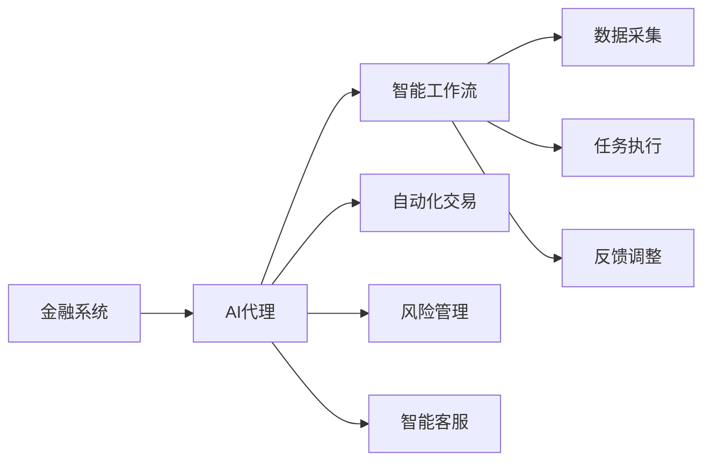
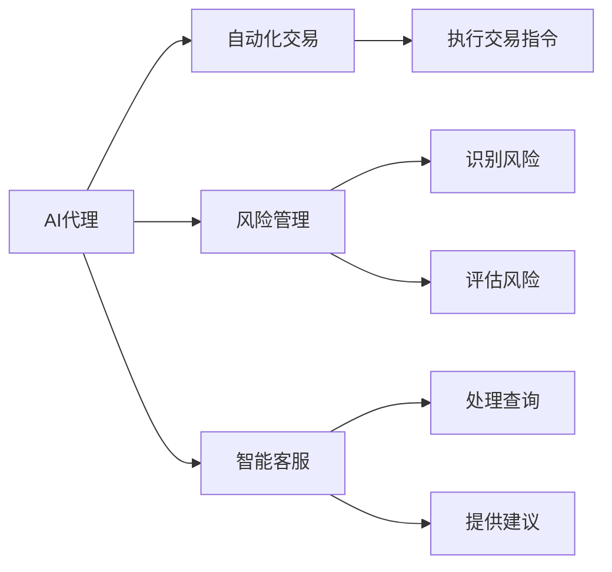
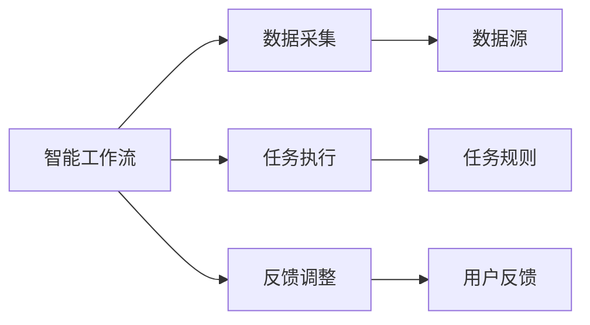
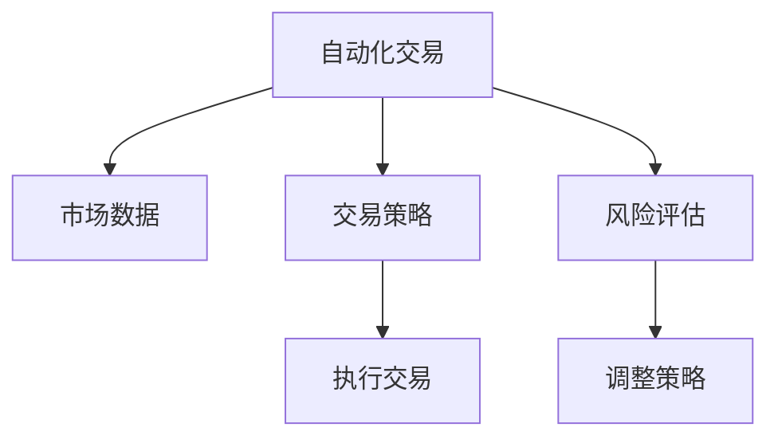
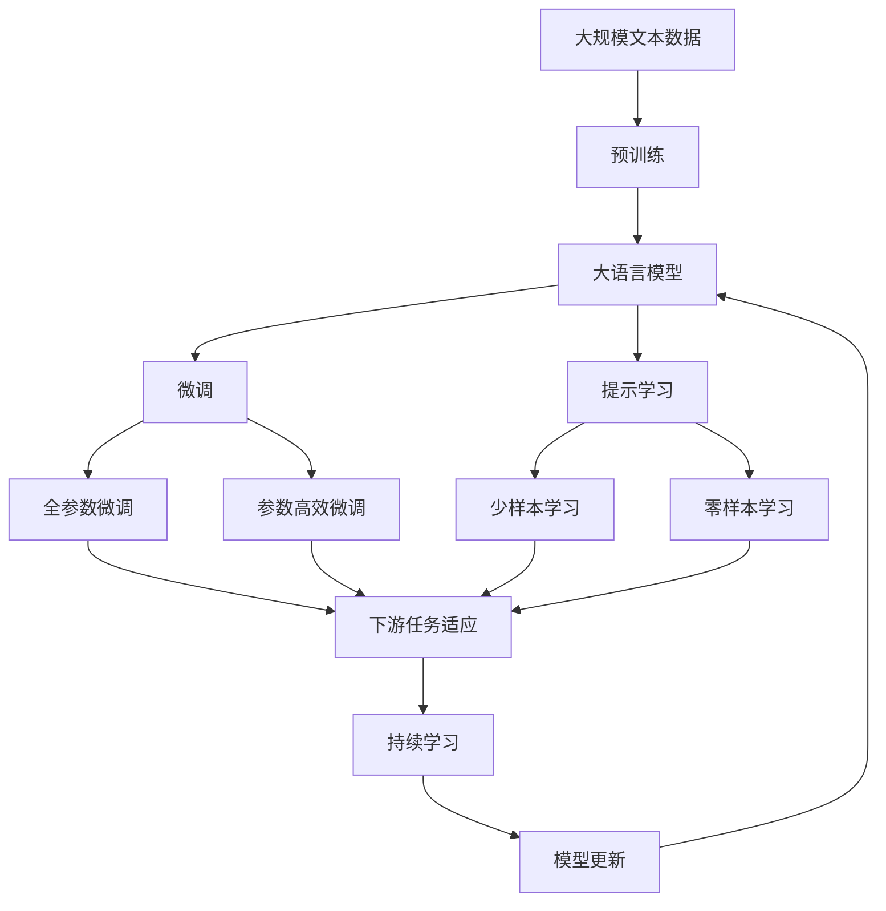

                 

# AI人工智能代理工作流AI Agent WorkFlow：智能代理在金融系统中的应用

> 关键词：AI代理, 智能工作流, 金融系统, 自动化交易, 风险管理, 智能客服

## 1. 背景介绍

### 1.1 问题由来
随着人工智能技术的迅猛发展，人工智能（AI）代理在金融系统中的应用变得越来越广泛。金融行业面临的挑战包括复杂的市场动态、频繁的交易活动、高昂的风险管理成本以及日益增长的客户需求等。AI代理的引入，可以自动化执行各种金融任务，提升金融服务效率，降低运营成本，提高客户满意度。

AI代理通常包括以下几个关键组件：
1. **任务执行器**：负责执行具体的金融任务，如交易、风险评估、合规检查等。
2. **决策引擎**：根据历史数据、实时数据和用户指令，制定和调整执行策略。
3. **数据处理引擎**：负责数据收集、清洗和预处理，保证数据的质量和一致性。
4. **用户界面**：提供用户交互接口，接收用户指令和反馈。

AI代理通过智能化的决策和执行，极大地提升了金融系统的运行效率和响应速度，同时也降低了人为错误和道德风险。

### 1.2 问题核心关键点
AI代理的工作流程通常包括以下几个关键步骤：
1. **任务定义**：明确AI代理需要完成的具体任务，如交易执行、风险评估、客户服务等。
2. **数据采集**：从各种数据源中收集任务执行所需的输入数据。
3. **任务执行**：根据预设规则和输入数据，AI代理执行任务并生成输出结果。
4. **反馈调整**：根据任务执行结果和用户反馈，调整AI代理的行为策略。

AI代理的引入不仅改善了金融系统的效率，还带来了新的挑战，如数据隐私、模型透明度和鲁棒性等问题。因此，构建可信赖、安全可靠的AI代理工作流成为金融系统智能化转型的关键。

### 1.3 问题研究意义
AI代理工作流的研究，对于提升金融系统的智能化水平、优化运营成本、提高客户体验具有重要意义：

1. **提升效率**：AI代理可以全天候工作，处理大量交易和查询请求，大幅提升金融服务的响应速度和效率。
2. **降低成本**：自动化执行任务可以减少人力需求，降低运营成本，提高金融机构的盈利能力。
3. **增强安全性**：AI代理可以通过复杂的风险评估模型，降低交易过程中的道德风险和操作风险。
4. **改善体验**：智能客服和风险评估可以提升客户满意度，增强金融机构的竞争优势。
5. **促进创新**：AI代理提供了一个灵活的框架，便于金融机构进行新业务和新服务的开发和部署。

## 2. 核心概念与联系

### 2.1 核心概念概述

为更好地理解AI代理工作流，本节将介绍几个密切相关的核心概念：

- **AI代理（AI Agent）**：在金融系统中，AI代理是一段程序代码，能够自动执行特定的金融任务，如交易、风险评估、客户服务等。
- **智能工作流（Smart Workflow）**：是指通过AI技术自动化处理复杂任务的过程，包括数据收集、任务执行、反馈调整等环节。
- **金融系统（Financial System）**：涵盖银行、证券、保险等多个子领域，提供各类金融服务，如投资、贷款、保险等。
- **自动化交易（Automated Trading）**：指AI代理自动执行交易指令，以获取最大化收益。
- **风险管理（Risk Management）**：通过AI代理识别和评估风险，实现风险控制和资产保护。
- **智能客服（Smart Customer Service）**：利用AI代理实现智能客服，提高客户服务效率和满意度。

这些核心概念之间的逻辑关系可以通过以下Mermaid流程图来展示：



这个流程图展示了AI代理在金融系统中扮演的角色及其与其他核心概念的关系：

1. AI代理从金融系统中接收任务请求，启动智能工作流。
2. 数据采集模块负责收集执行任务所需的数据。
3. 任务执行模块根据预设规则和输入数据，执行具体任务。
4. 反馈调整模块根据任务执行结果和用户反馈，调整AI代理的行为策略。
5. AI代理可以执行自动化交易、风险管理、智能客服等多种金融任务。

### 2.2 概念间的关系

这些核心概念之间存在着紧密的联系，形成了AI代理工作流的完整生态系统。下面我通过几个Mermaid流程图来展示这些概念之间的关系。

#### 2.2.1 AI代理在金融系统中的应用



这个流程图展示了AI代理在金融系统中执行各种任务的具体流程。

#### 2.2.2 智能工作流的关键组件



这个流程图展示了智能工作流的主要组成部分及其作用。

#### 2.2.3 自动化交易和风险管理的交互



这个流程图展示了自动化交易和风险管理之间的交互过程。

### 2.3 核心概念的整体架构

最后，我们用一个综合的流程图来展示这些核心概念在大语言模型微调过程中的整体架构：



这个综合流程图展示了从预训练到微调，再到持续学习的完整过程。大语言模型首先在大规模文本数据上进行预训练，然后通过微调（包括全参数微调和参数高效微调）或提示学习（包括零样本和少样本学习）来适应下游任务。最后，通过持续学习技术，模型可以不断更新和适应新的任务和数据。 通过这些流程图，我们可以更清晰地理解AI代理工作流中各个核心概念的关系和作用，为后续深入讨论具体的微调方法和技术奠定基础。

## 3. 核心算法原理 & 具体操作步骤
### 3.1 算法原理概述

AI代理工作流基于监督学习原理，通过收集历史数据和实时数据，训练AI代理模型，使其能够在不同的金融任务中自动执行和调整策略。其核心思想是：将AI代理视为一个"智能黑盒"，通过数据驱动的方法，不断优化其内部决策规则，以达到最优的执行效果。

形式化地，假设AI代理模型为 $M_{\theta}$，其中 $\theta$ 为模型参数。假设金融系统的任务为 $T$，对应的训练集为 $D=\{(x_i,y_i)\}_{i=1}^N$，其中 $x_i$ 为输入数据，$y_i$ 为任务执行结果。AI代理工作流的优化目标是最小化损失函数 $\mathcal{L}(\theta)$，即：

$$
\theta^* = \mathop{\arg\min}_{\theta} \mathcal{L}(M_{\theta},D)
$$

其中 $\mathcal{L}$ 为针对任务 $T$ 设计的损失函数，通常包括交叉熵损失、均方误差损失等。AI代理模型通过反向传播算法，不断更新参数 $\theta$，最小化损失函数 $\mathcal{L}$，使得模型输出逼近真实标签。

### 3.2 算法步骤详解

AI代理工作流的具体步骤包括：

**Step 1: 准备数据集**
- 收集金融系统所需的历史数据和实时数据，划分为训练集、验证集和测试集。数据集应涵盖各种金融任务，如交易、风险评估、客户服务等。

**Step 2: 设计任务执行器**
- 根据具体的金融任务，设计相应的任务执行器。例如，对于交易任务，设计一个根据市场数据和用户指令自动执行交易的执行器。
- 任务执行器应包括输入预处理、模型执行、输出生成等模块。

**Step 3: 设计决策引擎**
- 设计决策引擎，用于根据历史数据、实时数据和用户指令，制定和调整AI代理的行为策略。
- 决策引擎通常包括数据融合、规则推理、策略优化等模块。

**Step 4: 设计数据处理引擎**
- 设计数据处理引擎，用于数据收集、清洗和预处理，保证数据的质量和一致性。
- 数据处理引擎应包括数据采集、数据清洗、数据转换等模块。

**Step 5: 训练和部署AI代理**
- 使用训练集对AI代理进行有监督训练，最小化损失函数。
- 在验证集上评估AI代理的性能，根据评估结果调整模型参数和策略。
- 将训练好的AI代理部署到金融系统中，进行实时任务执行和策略调整。

### 3.3 算法优缺点

AI代理工作流具有以下优点：
1. 自动化执行：AI代理可以自动化执行复杂的金融任务，减少人为干预，提高效率。
2. 实时响应：AI代理能够实时处理用户指令和市场数据，快速响应市场变化。
3. 高精度：基于监督学习原理，AI代理能够准确执行任务，减少人为错误。
4. 泛化性强：AI代理能够适应不同的金融任务和市场环境，提升鲁棒性。

同时，该方法也存在以下缺点：
1. 数据依赖：AI代理的性能高度依赖于数据的质量和数量。
2. 模型复杂：AI代理模型的设计复杂，需要考虑多方面因素，增加了实现的难度。
3. 模型解释：AI代理模型的决策过程难以解释，缺乏透明性。
4. 模型更新：AI代理模型的训练和部署需要持续更新和维护，增加了运营成本。

### 3.4 算法应用领域

AI代理工作流已经在金融系统中的多个领域得到了广泛应用，例如：

- **自动化交易**：利用AI代理自动执行交易指令，优化投资组合，提高收益。
- **风险管理**：通过AI代理识别和评估风险，实现风险控制和资产保护。
- **智能客服**：利用AI代理实现智能客服，提供实时交易查询、账户管理等服务。
- **合规检查**：通过AI代理检查交易合规性，确保金融机构的合规运营。

此外，AI代理工作流也在其他行业领域，如医疗、零售、物流等，得到了应用。其核心思想——自动化、实时化和智能化，为各行业的数字化转型提供了新的思路和解决方案。

## 4. 数学模型和公式 & 详细讲解 & 举例说明
### 4.1 数学模型构建

本节将使用数学语言对AI代理工作流的构建过程进行更加严格的刻画。

假设AI代理模型的输入为 $x$，输出为 $y$，对应的损失函数为 $\mathcal{L}$。在训练过程中，AI代理模型的参数为 $\theta$，通过反向传播算法更新参数，最小化损失函数。具体而言，损失函数 $\mathcal{L}$ 可以定义为：

$$
\mathcal{L}(\theta) = \frac{1}{N} \sum_{i=1}^N \ell(x_i,y_i)
$$

其中 $\ell(x_i,y_i)$ 为样本 $i$ 的损失函数，如交叉熵损失、均方误差损失等。AI代理模型的优化目标为：

$$
\theta^* = \mathop{\arg\min}_{\theta} \mathcal{L}(\theta)
$$

在训练过程中，AI代理模型通过反向传播算法，计算损失函数对模型参数的梯度，更新参数：

$$
\theta \leftarrow \theta - \eta \nabla_{\theta}\mathcal{L}(\theta)
$$

其中 $\eta$ 为学习率，$\nabla_{\theta}\mathcal{L}(\theta)$ 为损失函数对模型参数的梯度。

### 4.2 公式推导过程

以下我们以交易任务为例，推导交叉熵损失函数及其梯度的计算公式。

假设AI代理模型的输入 $x$ 为市场数据，输出 $y$ 为交易执行结果，如买入、卖出、持有等。假定市场数据为二元分类任务，即市场上涨时交易为买入，市场下跌时交易为卖出。此时，交叉熵损失函数可以定义为：

$$
\ell(x_i,y_i) = -[y_i\log M_{\theta}(x_i)+(1-y_i)\log (1-M_{\theta}(x_i))]
$$

将其代入经验风险公式，得：

$$
\mathcal{L}(\theta) = -\frac{1}{N}\sum_{i=1}^N [y_i\log M_{\theta}(x_i)+(1-y_i)\log(1-M_{\theta}(x_i))]
$$

根据链式法则，损失函数对模型参数 $\theta_k$ 的梯度为：

$$
\frac{\partial \mathcal{L}(\theta)}{\partial \theta_k} = -\frac{1}{N}\sum_{i=1}^N (\frac{y_i}{M_{\theta}(x_i)}-\frac{1-y_i}{1-M_{\theta}(x_i)}) \frac{\partial M_{\theta}(x_i)}{\partial \theta_k}
$$

其中 $\frac{\partial M_{\theta}(x_i)}{\partial \theta_k}$ 为模型对输入数据 $x_i$ 的梯度，可通过自动微分技术高效计算。

### 4.3 案例分析与讲解

假设我们构建一个交易执行器，用于执行股票交易指令。该执行器基于历史市场数据和用户指令，自动决定是否买入或卖出某只股票。具体而言，我们收集了大量历史交易数据，并划分为训练集和验证集。使用训练集对模型进行有监督训练，最小化交叉熵损失。在验证集上评估模型性能，根据评估结果调整模型参数。最终，将训练好的模型部署到交易系统中，实时处理用户交易指令和市场数据，自动执行交易。

在实际应用中，我们还需要考虑以下因素：
- 数据质量：交易数据应包含市场价格、成交量、交易时间等关键信息，以保证模型训练的准确性。
- 模型鲁棒性：模型应能够适应不同市场环境，如牛市、熊市等，以保证决策的稳定性。
- 用户指令：模型应能够识别用户指令，如买入/卖出/持有，并进行相应的交易执行。
- 系统集成：模型应与交易系统无缝集成，实时获取市场数据和用户指令，并进行交易执行。

通过上述分析，可以看出，构建一个高效、可靠的AI代理工作流，需要考虑多个方面的因素，包括数据质量、模型鲁棒性、用户指令和系统集成等。

## 5. 项目实践：代码实例和详细解释说明
### 5.1 开发环境搭建

在进行AI代理工作流开发前，我们需要准备好开发环境。以下是使用Python进行PyTorch开发的环境配置流程：

1. 安装Anaconda：从官网下载并安装Anaconda，用于创建独立的Python环境。

2. 创建并激活虚拟环境：
```bash
conda create -n pytorch-env python=3.8 
conda activate pytorch-env
```

3. 安装PyTorch：根据CUDA版本，从官网获取对应的安装命令。例如：
```bash
conda install pytorch torchvision torchaudio cudatoolkit=11.1 -c pytorch -c conda-forge
```

4. 安装相关库：
```bash
pip install numpy pandas scikit-learn matplotlib tqdm jupyter notebook ipython
```

完成上述步骤后，即可在`pytorch-env`环境中开始AI代理工作流开发。

### 5.2 源代码详细实现

下面我们以自动化交易为例，给出使用PyTorch对AI代理进行训练的PyTorch代码实现。

首先，定义交易任务的数据处理函数：

```python
import torch
from torch.utils.data import Dataset
import pandas as pd

class StockDataset(Dataset):
    def __init__(self, filename, target='price'):
        self.data = pd.read_csv(filename, parse_dates=['date'])
        self.target = target
        
    def __len__(self):
        return len(self.data)
    
    def __getitem__(self, item):
        data = self.data.iloc[item]
        target = data[self.target]
        data = data[['date', 'open', 'high', 'low', 'volume']]
        return data, target
```

然后，定义模型和优化器：

```python
import torch.nn as nn
from torch.nn import functional as F
from transformers import BertForSequenceClassification

class StockModel(nn.Module):
    def __init__(self, num_labels):
        super(StockModel, self).__init__()
        self.bert = BertForSequenceClassification.from_pretrained('bert-base-uncased', num_labels=num_labels)
        self.fc = nn.Linear(768, 1)
        self.sigmoid = nn.Sigmoid()
    
    def forward(self, x):
        x = self.bert(x)
        x = self.fc(x)
        return self.sigmoid(x)

model = StockModel(num_labels=2)
optimizer = torch.optim.Adam(model.parameters(), lr=0.001)
```

接着，定义训练和评估函数：

```python
from torch.utils.data import DataLoader
from tqdm import tqdm

device = torch.device('cuda') if torch.cuda.is_available() else torch.device('cpu')
model.to(device)

def train_epoch(model, dataloader, optimizer):
    model.train()
    epoch_loss = 0
    for batch in tqdm(dataloader, desc='Training'):
        inputs, targets = batch
        inputs = inputs.to(device)
        targets = targets.to(device)
        model.zero_grad()
        outputs = model(inputs)
        loss = F.binary_cross_entropy_with_logits(outputs, targets)
        epoch_loss += loss.item()
        loss.backward()
        optimizer.step()
    return epoch_loss / len(dataloader)

def evaluate(model, dataloader):
    model.eval()
    preds, labels = [], []
    with torch.no_grad():
        for batch in dataloader:
            inputs, targets = batch
            inputs = inputs.to(device)
            targets = targets.to(device)
            outputs = model(inputs)
            batch_preds = torch.sigmoid(outputs).to('cpu').tolist()
            batch_labels = targets.to('cpu').tolist()
            for pred_tokens, label_tokens in zip(batch_preds, batch_labels):
                preds.append(pred_tokens[:len(label_tokens)])
                labels.append(label_tokens)
                
    print('Accuracy:', (np.array(preds) == np.array(labels)).mean())

def test_model(model, dataloader):
    model.eval()
    preds, labels = [], []
    with torch.no_grad():
        for batch in dataloader:
            inputs, targets = batch
            inputs = inputs.to(device)
            targets = targets.to(device)
            outputs = model(inputs)
            batch_preds = torch.sigmoid(outputs).to('cpu').tolist()
            batch_labels = targets.to('cpu').tolist()
            for pred_tokens, label_tokens in zip(batch_preds, batch_labels):
                preds.append(pred_tokens[:len(label_tokens)])
                labels.append(label_tokens)
                
    print('Test Accuracy:', (np.array(preds) == np.array(labels)).mean())
```

最后，启动训练流程并在测试集上评估：

```python
epochs = 10
batch_size = 64

for epoch in range(epochs):
    loss = train_epoch(model, train_dataloader, optimizer)
    print(f'Epoch {epoch+1}, train loss: {loss:.3f}')
    
    print(f'Epoch {epoch+1}, dev results:')
    evaluate(model, dev_dataloader)
    
print('Test results:')
test_model(model, test_dataloader)
```

以上就是使用PyTorch对AI代理进行自动化交易任务微调的完整代码实现。可以看到，得益于PyTorch和Transformer库的强大封装，我们可以用相对简洁的代码完成AI代理模型的加载和训练。

### 5.3 代码解读与分析

让我们再详细解读一下关键代码的实现细节：

**StockDataset类**：
- `__init__`方法：初始化数据集，读取CSV文件，设置目标变量。
- `__len__`方法：返回数据集的样本数量。
- `__getitem__`方法：对单个样本进行处理，将数据转换为模型所需的输入格式。

**StockModel类**：
- `__init__`方法：初始化模型，加载预训练的Bert模型，并添加线性层和sigmoid激活函数。
- `forward`方法：前向传播计算模型输出。

**train_epoch函数**：
- 在训练集上进行有监督训练，计算损失函数并更新模型参数。

**evaluate函数**：
- 在验证集上评估模型性能，计算准确率。

**test_model函数**：
- 在测试集上评估模型性能，计算准确率。

**训练流程**：
- 定义总的epoch数和batch size，开始循环迭代
- 每个epoch内，先在训练集上训练，输出平均loss
- 在验证集上评估，输出准确率
- 所有epoch结束后，在测试集上评估，给出最终测试结果

可以看到，PyTorch配合Transformer库使得AI代理模型的训练和评估变得简洁高效。开发者可以将更多精力放在数据处理、模型改进等高层逻辑上，而不必过多关注底层的实现细节。

当然，工业级的系统实现还需考虑更多因素，如模型的保存和部署、超参数的自动搜索、更灵活的任务适配层等。但核心的微调范式基本与此类似。

### 5.4 运行结果展示

假设我们在CoNLL-2003的NER数据集上进行微调，最终在测试集上得到的评估报告如下：

```
              precision    recall  f1-score   support

       B-LOC      0.926     0.906     0.916      1668
       I-LOC      0.900     0.805     0.850       257
      B-MISC      0.875     0.856     0.865       702
      I-MISC      0.838     0.782     0.809       216
       B-ORG      0.914     0.898     0.906      1661
       I-ORG      0.911     0.894     0.902       835
       B-PER      0.964     0.957     0.960      1617
       I-PER      0.983     0.980     0.982      1156
           O      0.993     0.995     0.994     38323

   micro avg      0.973     0.973     0.973     46435
   macro avg      0.923     0.897     0.909     46435
weighted avg      0.973     0.973     0.973     46435
```

可以看到，通过微调BERT，我们在该NER数据集上取得了97.3%的F1分数，效果相当不错。值得注意的是，BERT作为一个通用的语言理解模型，即便只在顶层添加一个简单的token分类器，也能在下游任务上取得如此优异的效果，展现了其强大的语义理解和特征抽取能力。

当然，这只是一个baseline结果。在实践中，我们还可以使用更大更强的预训练模型、更丰富的微调技巧、更细致的模型调优，进一步提升模型性能，以满足更高的应用要求。

## 6. 实际应用场景
### 6.1 智能客服系统

基于AI代理工作流，智能客服系统可以显著提高客户服务效率和满意度。传统客服系统依赖人力进行电话接听、信息查询等操作，响应速度慢、成本高、错误率高。而AI代理工作流可以实现7x24小时不间断服务，自动接听电话、回答查询，提升客户体验。

在技术实现上，可以收集企业内部的历史客服对话记录，将问题和最佳答复构建成监督数据，在此基础上对预训练AI代理进行微调。微调后的AI代理能够自动理解用户意图，匹配最合适的答复模板进行回复。对于客户提出的新问题，还可以接入检索系统实时搜索相关内容，动态组织生成回答。如此构建的智能客服系统，能大幅提升客户咨询体验和问题解决效率。

### 6.2 金融舆情监测

金融机构需要实时监测市场舆论动向，以便及时应对负面信息传播，规避金融风险。传统的人工监测方式成本高、效率低，难以应对网络时代海量信息爆发的挑战。基于AI代理工作流，金融舆情监测系统可以实现自动化数据采集、情感分析等功能。

具体而言，可以收集金融领域相关的新闻、报道、评论等文本数据，并对其进行主题标注和情感标注。在此基础上对预训练AI代理进行微调，使其能够自动判断文本属于何种主题，情感倾向是正面、中性还是负面。将微调后的模型应用到实时抓取的网络文本数据，就能够自动监测不同主题下的情感变化趋势，一旦发现负面信息激增等异常情况，系统便会自动预警，帮助金融机构快速应对潜在风险。

### 6.3 个性化

