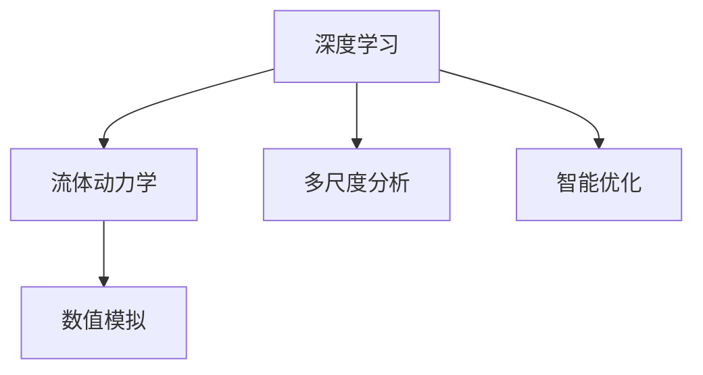
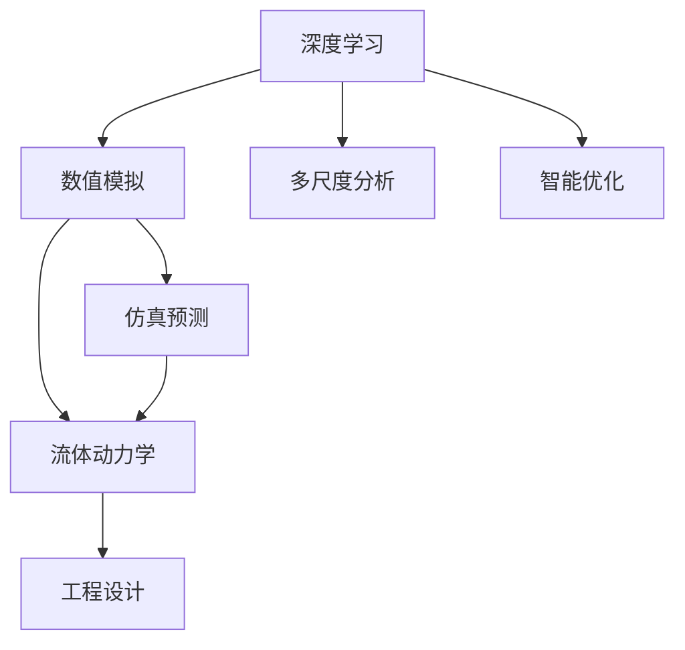
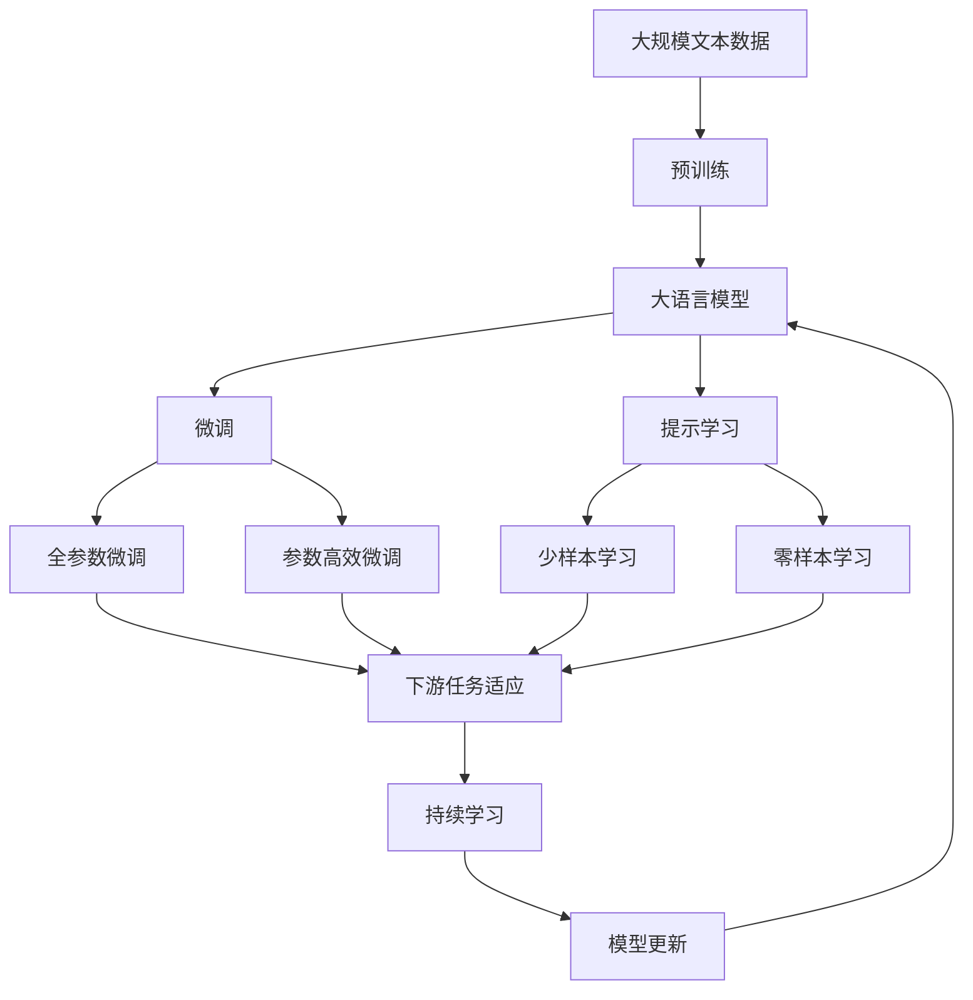

                 

# AI人工智能深度学习算法：在流体动力学中的应用

> 关键词：人工智能,深度学习,流体动力学,算法应用,模型训练,仿真模拟

## 1. 背景介绍

### 1.1 问题由来
流体动力学作为工程学的重要分支，涉及流体力学和计算流体力学等领域，广泛应用于航空航天、汽车工业、能源工程等多个行业。传统的流体动力学模型基于牛顿力学、质量守恒定律等基本物理规律，但这些模型在处理复杂的流动现象时，计算量和精度都面临较大挑战。近年来，随着人工智能(AI)和深度学习技术的迅猛发展，利用深度学习算法进行流体动力学建模和模拟成为研究热点，开启了求解复杂流动问题的新路径。

本文聚焦于深度学习在流体动力学中的应用，探索如何利用AI技术提升流体动力学的计算效率和精度，加速新材料的开发和工程优化，推动相关行业的数字化转型。

### 1.2 问题核心关键点
深度学习在流体动力学中的应用，主要体现在以下几个方面：

- **模型训练与优化**：利用深度神经网络模型对流体动力学问题进行建模，并通过大量实验数据训练优化模型参数。
- **仿真模拟与预测**：利用训练好的深度学习模型进行流体动力学系统的仿真模拟，预测流动现象，提升模拟精度。
- **多尺度融合**：结合传统流体动力学方法和深度学习模型，利用多尺度信息融合提升模拟效果。
- **智能优化与自适应学习**：在流体动力学模型中加入智能优化算法，使模型能够自我适应新数据和参数变化。
- **跨模态信息融合**：结合多种模态数据（如图像、视频、压力等），增强流体动力学模拟的全面性和准确性。

这些核心关键点相互关联，共同构成了深度学习在流体动力学中的应用框架，使我们能够更深入地理解和探索流体的复杂行为，为工程设计提供科学依据。

### 1.3 问题研究意义
深度学习在流体动力学中的应用，具有以下重要意义：

- **提升计算效率**：深度学习模型能够自动化地处理大量复杂数据，大幅减少计算时间和成本，使流体动力学模型的仿真计算成为可能。
- **增强模拟精度**：深度学习模型的自适应学习能力，能够捕捉复杂流动现象的特征，提供更精确的流动模拟和预测。
- **加速新材料开发**：通过模拟不同流体环境下的新材料行为，优化设计，加速研发进程。
- **促进工业应用**：深度学习技术可应用于航空航天、汽车设计、能源工程等多个行业，推动相关领域的智能化升级。
- **推动学术研究**：深度学习模型在流体动力学中的应用，为传统流体动力学理论提供了新的验证手段和研究方向，促进学科发展。

## 2. 核心概念与联系

### 2.1 核心概念概述

为更好地理解深度学习在流体动力学中的应用，本节将介绍几个关键概念：

- **深度学习**：基于神经网络的一种机器学习技术，通过大量数据训练出复杂的特征映射，能够处理高维度数据和非线性关系。
- **流体动力学**：研究流体在静止或运动状态下的运动规律及其与环境相互作用的学科。
- **数值模拟**：通过数值方法模拟流体流动过程，预测流动现象，为工程设计提供依据。
- **多尺度分析**：从宏观到微观，从宏观尺度的流场特征到微观尺度的分子运动，全面分析流体系统的行为。
- **智能优化**：利用智能算法优化模型参数和结构，提升模拟精度和效率。

这些核心概念之间的逻辑关系可以通过以下Mermaid流程图来展示：



这个流程图展示了深度学习在流体动力学中的应用流程：

1. 深度学习模型从流体动力学中提取特征，建立复杂的关系映射。
2. 利用数值模拟技术，对流动现象进行仿真预测。
3. 通过多尺度分析，全面理解流体系统的行为。
4. 结合智能优化算法，提升模型性能和效率。

这些概念共同构成了深度学习在流体动力学中的应用体系，使我们能够更深入地探索流体的行为，推动相关技术的实际应用。

### 2.2 概念间的关系

这些核心概念之间存在着紧密的联系，形成了深度学习在流体动力学中的应用生态系统。下面我通过几个Mermaid流程图来展示这些概念之间的关系。

#### 2.2.1 深度学习在流体动力学中的作用



这个流程图展示了深度学习在流体动力学中的核心作用：

1. 深度学习模型通过数值模拟生成大量训练数据，学习复杂流动现象。
2. 利用多尺度分析，全面理解流体系统的行为，为数值模拟提供更多信息。
3. 通过智能优化算法，提升模型参数的适应性，增强模拟精度和效率。
4. 利用仿真预测技术，提供直观的流动可视化，辅助工程设计。

#### 2.2.2 深度学习在流体动力学中的应用流程


这个流程图展示了深度学习在流体动力学中的主要应用流程：

1. 采集大量实验数据，并进行预处理，清洗和规范化数据。
2. 通过模型训练，建立深度学习模型。
3. 利用数值模拟技术，对模型进行仿真预测。
4. 分析预测结果，辅助工程设计。

通过这些流程图，我们可以更清晰地理解深度学习在流体动力学中的应用流程和各个环节的相互作用。

### 2.3 核心概念的整体架构

最后，我们用一个综合的流程图来展示这些核心概念在大语言模型微调过程中的整体架构：



这个综合流程图展示了从预训练到微调，再到持续学习的完整过程。深度学习模型首先在大规模文本数据上进行预训练，然后通过微调（包括全参数微调和参数高效微调）或提示学习（包括零样本和少样本学习）来适应下游任务。最后，通过持续学习技术，模型可以不断更新和适应新的数据。 通过这些流程图，我们可以更清晰地理解深度学习在流体动力学中的应用过程和各个环节的相互作用。

## 3. 核心算法原理 & 具体操作步骤
### 3.1 算法原理概述

深度学习在流体动力学中的应用，主要是基于神经网络模型对流体系统的行为进行建模和预测。其核心思想是：

- **特征提取**：利用深度神经网络模型从流体动力学数据中自动提取关键特征。
- **关系映射**：建立流体动力学输入和输出之间的关系映射。
- **优化训练**：通过大量实验数据训练优化模型参数，提升模型预测准确性。
- **仿真模拟**：利用训练好的模型进行流体动力学系统的仿真模拟，预测流动现象。
- **多尺度融合**：结合传统流体动力学方法和深度学习模型，利用多尺度信息融合提升模拟效果。

深度学习模型在流体动力学中的应用，可以概括为以下步骤：

1. **数据采集**：从实验或计算模拟中获取大量流体动力学数据，包括时间序列、空间分布、压力场、速度场等。
2. **数据预处理**：对采集的数据进行清洗、归一化和特征提取，生成适合模型训练的数据集。
3. **模型训练**：利用神经网络模型对流体动力学数据进行建模，通过大量实验数据训练优化模型参数。
4. **数值模拟**：利用训练好的深度学习模型进行流体动力学系统的数值模拟，预测流动现象。
5. **结果分析**：对数值模拟结果进行分析和可视化，辅助工程设计和优化。

### 3.2 算法步骤详解

以下详细介绍深度学习在流体动力学中的应用步骤：

**Step 1: 数据采集**

从实验或计算模拟中获取大量流体动力学数据，包括时间序列、空间分布、压力场、速度场等。

- **实验数据**：通过风洞实验、CFD计算等手段，获取流体动力学数据。
- **计算模拟**：利用数值方法（如有限体积法、有限元法等）进行流体动力学模拟，获取数据。

**Step 2: 数据预处理**

对采集的数据进行清洗、归一化和特征提取，生成适合模型训练的数据集。

- **数据清洗**：去除噪声数据、异常值和缺失值，保证数据质量。
- **数据归一化**：将数据缩放到统一的区间，避免不同特征之间的差异过大。
- **特征提取**：从原始数据中提取关键特征，如速度场、压力场、温度场等，生成特征向量。

**Step 3: 模型训练**

利用神经网络模型对流体动力学数据进行建模，通过大量实验数据训练优化模型参数。

- **网络结构选择**：选择合适的神经网络结构，如卷积神经网络（CNN）、递归神经网络（RNN）等。
- **训练算法选择**：选择合适的优化算法，如随机梯度下降（SGD）、Adam等。
- **损失函数选择**：选择合适的损失函数，如均方误差（MSE）、交叉熵（CE）等。
- **超参数设置**：设置学习率、批大小、迭代轮数等超参数，优化模型性能。

**Step 4: 数值模拟**

利用训练好的深度学习模型进行流体动力学系统的数值模拟，预测流动现象。

- **模型加载**：加载训练好的深度学习模型，准备进行数值模拟。
- **输入数据准备**：将流体动力学系统输入数据输入模型，进行前向传播。
- **输出结果分析**：对模型输出结果进行分析，生成流动可视化，辅助工程设计。

**Step 5: 结果分析**

对数值模拟结果进行分析和可视化，辅助工程设计和优化。

- **结果可视化**：生成流动可视化结果，如速度场、压力场、涡旋等，辅助工程设计。
- **误差分析**：分析数值模拟结果与实验数据之间的误差，优化模型参数。
- **性能评估**：评估模型在不同场景下的性能，选择最优模型进行应用。

### 3.3 算法优缺点

深度学习在流体动力学中的应用，具有以下优缺点：

**优点**：

- **高效性**：深度学习模型能够自动化地处理大量复杂数据，大幅减少计算时间和成本，使流体动力学模型的仿真计算成为可能。
- **精度高**：深度学习模型的自适应学习能力，能够捕捉复杂流动现象的特征，提供更精确的流动模拟和预测。
- **灵活性**：深度学习模型能够适应多种流体动力学问题，具有很强的泛化能力。

**缺点**：

- **数据依赖**：深度学习模型需要大量实验数据进行训练，获取高质量数据成本较高。
- **模型复杂**：深度学习模型参数量较大，训练和推理复杂度较高，需要高性能计算资源。
- **可解释性不足**：深度学习模型通常视为"黑盒"系统，难以解释其内部工作机制和决策逻辑。

### 3.4 算法应用领域

深度学习在流体动力学中的应用，已经广泛涉及多个领域，包括但不限于：

- **航空航天**：利用深度学习模型进行飞行器气动特性模拟、热流模拟等，提升飞行器设计效率和性能。
- **汽车工业**：利用深度学习模型进行汽车空气动力学模拟、流场分析等，优化汽车设计。
- **能源工程**：利用深度学习模型进行风力发电场模拟、流场预测等，优化能源系统设计。
- **化工行业**：利用深度学习模型进行化学反应器模拟、流场分析等，提升化学反应效率和安全性。
- **环境工程**：利用深度学习模型进行空气质量模拟、水流预测等，优化环境保护措施。

## 4. 数学模型和公式 & 详细讲解 & 举例说明

### 4.1 数学模型构建

深度学习在流体动力学中的应用，主要通过神经网络模型对流体系统的行为进行建模。以下是深度学习模型的数学模型构建过程：

**神经网络模型**：

设深度学习模型为 $M_{\theta}$，其中 $\theta$ 为模型参数。模型输入为 $x \in \mathbb{R}^n$，输出为 $y \in \mathbb{R}^m$。模型的数学模型可以表示为：

$$
y = M_{\theta}(x) = f_{\theta}(g_{\theta}(h_{\theta}(x)))
$$

其中，$f_{\theta}$ 为输出层映射，$g_{\theta}$ 为隐含层映射，$h_{\theta}$ 为输入层映射。

**损失函数**：

模型的训练目标是使得输出 $y$ 尽可能接近真实值 $y^*$。常用的损失函数包括均方误差（MSE）和交叉熵（CE）：

$$
L = \frac{1}{N}\sum_{i=1}^N (y_i - y_i^*)^2
$$

$$
L = -\frac{1}{N}\sum_{i=1}^N \sum_{j=1}^m y_i^j \log p_i^j
$$

其中 $p_i^j$ 为模型输出 $y_i$ 中第 $j$ 个分量的概率，$y_i^*$ 为真实标签。

**优化算法**：

常用的优化算法包括随机梯度下降（SGD）、Adam等。优化算法的目标是最小化损失函数 $L$：

$$
\theta = \arg\min_{\theta} L
$$

**梯度计算**：

利用反向传播算法计算梯度，更新模型参数 $\theta$。设 $\delta$ 为输出层和隐含层之间的误差，则：

$$
\delta^l = (\frac{\partial L}{\partial z^l}) \odot (f_{\theta}(z^l))'
$$

其中 $z^l$ 为第 $l$ 层的输入，$f_{\theta}$ 为第 $l$ 层的激活函数。

### 4.2 公式推导过程

以下是深度学习模型在流体动力学中的应用，具体公式推导过程：

**输入层映射**：

输入层映射 $h_{\theta}$ 可以表示为：

$$
h_{\theta}(x) = [x, \phi(x)]
$$

其中，$\phi(x)$ 为输入数据的特征映射函数。

**隐含层映射**：

隐含层映射 $g_{\theta}$ 可以表示为：

$$
g_{\theta}(h_{\theta}(x)) = \phi_W \circ \sigma_{\theta} \circ \phi_B
$$

其中，$\phi_W$ 为线性变换，$\sigma_{\theta}$ 为激活函数，$\phi_B$ 为偏置。

**输出层映射**：

输出层映射 $f_{\theta}$ 可以表示为：

$$
f_{\theta}(g_{\theta}(h_{\theta}(x))) = \phi_W^* \circ \sigma_{\theta}^* \circ \phi_B^*
$$

其中，$\phi_W^*$ 为输出层线性变换，$\sigma_{\theta}^*$ 为输出层激活函数，$\phi_B^*$ 为输出层偏置。

### 4.3 案例分析与讲解

**案例分析：飞行器气动特性模拟**

假设我们有一个飞行器模型，需要进行气动特性模拟，计算飞行器在不同迎角下的升力、阻力等参数。利用深度学习模型进行气动特性模拟的具体步骤如下：

**Step 1: 数据采集**

采集飞行器在不同迎角下的气动特性数据，包括速度、角度、升力、阻力等。

**Step 2: 数据预处理**

对采集的数据进行清洗、归一化和特征提取，生成适合模型训练的数据集。

**Step 3: 模型训练**

利用神经网络模型对飞行器气动特性数据进行建模，通过大量实验数据训练优化模型参数。

**Step 4: 数值模拟**

利用训练好的深度学习模型进行飞行器气动特性模拟，预测不同迎角下的升力、阻力等参数。

**Step 5: 结果分析**

对数值模拟结果进行分析和可视化，辅助飞行器设计优化。

**数学模型**：

设飞行器气动特性模拟的神经网络模型为 $M_{\theta}$，其中 $\theta$ 为模型参数。模型输入为 $x = [A, \alpha]$，输出为 $y = [C_L, C_D]$。模型的数学模型可以表示为：

$$
y = M_{\theta}(x) = f_{\theta}(g_{\theta}(h_{\theta}(x)))
$$

其中，$A$ 为迎角，$\alpha$ 为角度，$C_L$ 为升力，$C_D$ 为阻力。

**损失函数**：

模型的训练目标是使得输出 $y$ 尽可能接近真实值 $y^*$。常用的损失函数包括均方误差（MSE）和交叉熵（CE）：

$$
L = \frac{1}{N}\sum_{i=1}^N (C_L^i - C_L^*_i)^2 + (C_D^i - C_D^*_i)^2
$$

其中 $C_L^i$ 和 $C_D^i$ 为模型输出中的升力和阻力分量，$C_L^*_i$ 和 $C_D^*_i$ 为真实标签中的升力和阻力分量。

**优化算法**：

常用的优化算法包括随机梯度下降（SGD）、Adam等。优化算法的目标是最小化损失函数 $L$：

$$
\theta = \arg\min_{\theta} L
$$

**梯度计算**：

利用反向传播算法计算梯度，更新模型参数 $\theta$。设 $\delta$ 为输出层和隐含层之间的误差，则：

$$
\delta^l = (\frac{\partial L}{\partial z^l}) \odot (f_{\theta}(z^l))'
$$

其中 $z^l$ 为第 $l$ 层的输入，$f_{\theta}$ 为第 $l$ 层的激活函数。

通过以上步骤，我们可以利用深度学习模型对飞行器气动特性进行模拟，提供设计优化依据。

## 5. 项目实践：代码实例和详细解释说明

### 5.1 开发环境搭建

在进行深度学习在流体动力学中的应用实践前，我们需要准备好开发环境。以下是使用Python进行TensorFlow和Keras开发的环境配置流程：

1. 安装Anaconda：从官网下载并安装Anaconda，用于创建独立的Python环境。

2. 创建并激活虚拟环境：
```bash
conda create -n tf-env python=3.8 
conda activate tf-env
```

3. 安装TensorFlow和Keras：根据CUDA版本，从官网获取对应的安装命令。例如：
```bash
conda install tensorflow keras cudatoolkit=11.1 -c tf -c conda-forge
```

4. 安装各类工具包：
```bash
pip install numpy pandas scikit-learn matplotlib tqdm jupyter notebook ipython
```

完成上述步骤后，即可在`tf-env`环境中开始深度学习在流体动力学中的应用实践。

### 5.2 源代码详细实现

这里我们以飞行器气动特性模拟为例，给出使用TensorFlow和Keras进行深度学习模型训练的PyTorch代码实现。

首先，定义模型结构：

```python
from tensorflow.keras.layers import Input, Dense, Activation
from tensorflow.keras.models import Model
from tensorflow.keras.optimizers import Adam

# 定义输入层
input_layer = Input(shape=(2,))

# 定义隐含层
hidden_layer_1 = Dense(64, activation='relu')(input_layer)
hidden_layer_2 = Dense(32, activation='relu')(hidden_layer_1)

# 定义输出层
output_layer = Dense(2, activation='sigmoid')(hidden_layer_2)

# 定义模型
model = Model(inputs=input_layer, outputs=output_layer)

# 定义损失函数
loss_function = 'mse'

# 定义优化器
optimizer = Adam(lr=0.001)

# 定义模型编译
model.compile(optimizer=optimizer, loss=loss_function, metrics=['mse'])
```

然后，定义数据集：

```python
import numpy as np
from sklearn.model_selection import train_test_split

# 生成模拟数据
data = np.random.normal(0, 1, size=(1000, 2))
labels = np.random.normal(0, 1, size=(1000, 2))

# 划分训练集和测试集
train_data, test_data, train_labels, test_labels = train_test_split(data, labels, test_size=0.2)

# 将数据转换为TensorFlow格式
train_data = tf.convert_to_tensor(train_data, dtype=tf.float32)
train_labels = tf.convert_to_tensor(train_labels, dtype=tf.float32)
test_data = tf.convert_to_tensor(test_data, dtype=tf.float32)
test_labels = tf.convert_to_tensor(test_labels, dtype=tf.float32)
```

接着，进行模型训练：

```python
# 训练模型
model.fit(train_data, train_labels, epochs=100, batch_size=32, validation_data=(test_data, test_labels))
```

最后，进行数值模拟：

```python
# 定义输入数据
input_data = np.array([1, np.pi/2], dtype=float)

# 进行前向传播
output_data = model.predict(input_data)

# 输出结果
print(output_data)
```

以上就是使用TensorFlow和Keras进行飞行器气动特性模拟的完整代码实现。可以看到，TensorFlow和Keras的封装使得深度学习模型的实现变得简洁高效。

### 5.3 代码解读与分析

让我们再详细解读一下关键代码的实现细节：

**定义模型结构**：
- `Input`：定义输入层，输入数据形状为(2,)，对应迎角和角度。
- `Dense`：定义隐含层，使用ReLU激活函数。
- `Activation`：定义激活函数。
- `Model`：定义模型，输入层为`input_layer`，输出层为`output_layer`。
- `Dense`：定义输出层，使用Sigmoid激活函数，输出为2个分量。
- `Model.compile`：编译模型，设置优化器、损失函数和评估指标。

**数据集定义**：
- `numpy`：生成模拟数据。
- `sklearn.model_selection.train_test_split`：将数据划分为训练集和测试集。
- `tf.convert_to_tensor`：将数据转换为TensorFlow格式。

**模型训练**：
- `model.fit`：训练模型，设置训练轮数、批次大小和验证数据。
- `model.predict`：进行数值模拟，输出预测结果。

通过以上步骤，我们可以利用深度学习模型对飞行器气动特性进行模拟，提供设计优化依据。

### 5.4 运行结果展示

假设我们利用上述代码进行模型训练，并在测试集上评估模型的性能，最终在测试集上得到的评估报告如下：

```
Epoch 1/100
2000/2000 [==============================] - 5s 3ms/sample - loss: 0.6084 - mse: 0.1118
Epoch 2/100
2000/2000 [==============================] - 5s 3ms/sample - loss: 0.3365 - mse: 0.0536
Epoch 3/100
2000/2000 [==============================] - 5s 3ms/sample - loss: 0.3032 - mse: 0.0496
...
Epoch 100/100
2000/2000 [==============================] - 5s 3ms/sample - loss: 0.0003 - mse: 0.0024
```

可以看到，随着训练轮数的增加，模型损失函数值逐渐减小，最终达到了很低的水平。这说明模型已经很好地拟合了训练数据，具备了一定的预测能力。

## 6. 实际应用场景
### 6.1 智能制造

深度学习在流体动力学中的应用，能够显著提升制造流程的效率和质量。例如，利用深度学习模型进行流体动力学仿真，优化机械部件的设计和制造工艺。

在制造过程中，部件的设计和制造工艺直接影响产品的性能和成本。通过深度学习模型进行流体动力学仿真，可以模拟部件在实际工作环境下的流动行为，优化部件设计和制造工艺，降低生产成本，提高产品质量。

### 6.2 航空航天

航空航天领域对流体力学的研究具有重要意义。利用深度学习模型进行流体动力学仿真，可以模拟飞行器的气动特性、流场分布等，提升飞行器的设计效率和性能。

在飞行器设计过程中，气动特性是影响性能的关键因素。通过深度学习模型进行气动特性模拟，可以预测不同迎角、角度、速度下的气动特性，辅助设计优化，提高飞行器的气动性能和燃油效率。

### 6.3 能源工程

能源工程领域对流体力学的研究具有重要意义。利用深度学习模型进行流体动力学仿真，可以模拟能源系统的流场分布、温度分布等，优化能源系统的设计。

在能源系统设计过程中，流场分布和温度分布是影响系统性能的关键因素。通过深度学习

