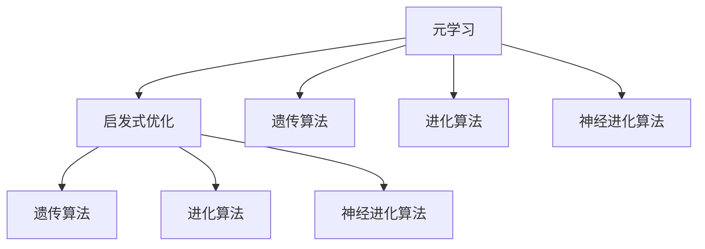
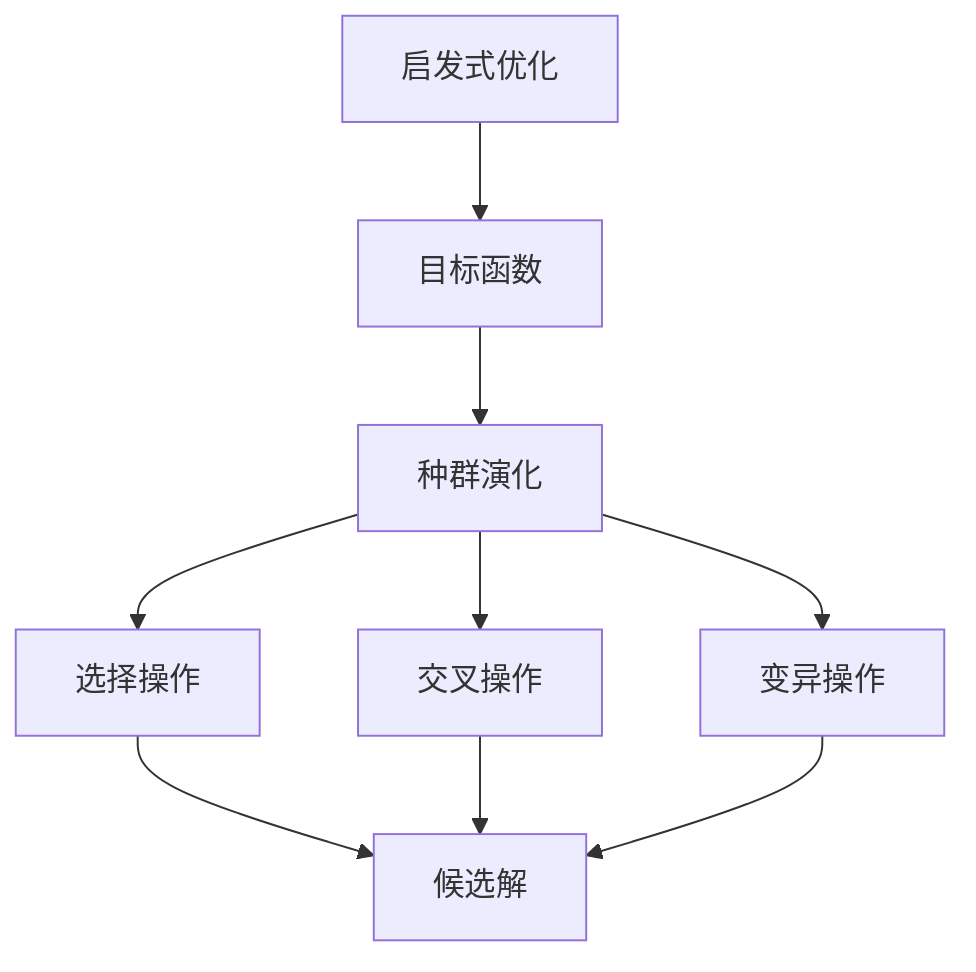
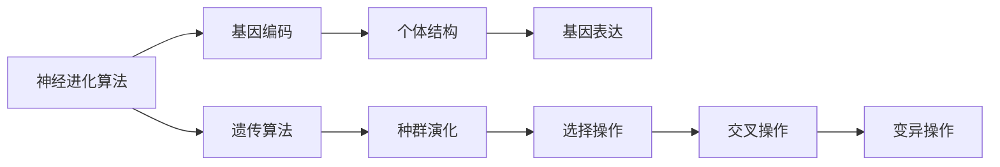
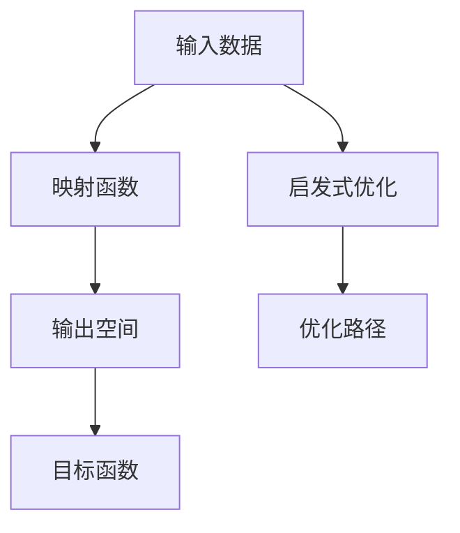

                 

# 一切皆是映射：构建元学习启发式优化算法

> 关键词：元学习,启发式优化,映射,自然语言处理(NLP),深度学习,自适应算法

## 1. 背景介绍

### 1.1 问题由来
随着深度学习技术的发展，数据驱动的模型训练成为科学研究、工业生产、生活应用中的核心手段。然而，面对高维数据和高复杂度模型，训练过程往往需要大量标注数据和长时间训练，且难以优化至最优解。这一困境催生了元学习(Epistemic Learning)理论的诞生，元学习旨在通过学习如何学习，而不是学习某个特定任务，提升模型的泛化能力和效率。

元学习理论在近年来取得了长足进步，其中启发式优化算法(Semi-supervised, self-supervised, unsupervised)因其不依赖大量标注数据，且具有较高泛化能力和鲁棒性，成为NLP等复杂领域的重要研究方向。启发式优化算法通过模拟自然界的演化过程，如遗传算法、蚁群算法、神经进化算法等，实现模型参数的自适应优化。这些算法不仅具备较好的适应性和可扩展性，而且可以通过少量的监督信号进行快速训练，具有很好的应用前景。

本文聚焦于启发式优化算法在NLP领域的应用，并基于该理论设计出一种元学习启发式优化算法。该算法结合了遗传算法、进化算法和优化算法的优势，能够自动适应不同任务和数据分布，提升模型的泛化能力和性能。

## 2. 核心概念与联系

### 2.1 核心概念概述

为更好地理解元学习启发式优化算法，本节将介绍几个核心概念：

- 元学习(Epistemic Learning)：指通过学习如何快速学习某个新任务，而不是直接学习新任务的解决方式，从而提升模型的泛化能力和适应性。

- 启发式优化(Heuristic Optimization)：指不依赖特定规则或计算公式，通过模拟自然界的进化过程或智能体的行为策略，寻找问题的近似最优解。

- 遗传算法(Genetic Algorithm, GA)：一种通过模拟生物遗传进化的过程来优化问题的算法，通过选择、交叉、变异等操作不断迭代，最终找到最优解。

- 进化算法(Evolutionary Algorithm, EA)：一种基于遗传算法的通用优化方法，通过种群演化来优化问题，具有较好的全局搜索能力和收敛性。

- 神经进化算法(Neuro-Evolutionary Algorithm, NEA)：结合了神经网络和进化算法的优点，通过个体结构与行为的演化实现模型参数的自适应优化。

- 映射(Mapping)：指将输入数据映射到目标输出，映射函数可以是线性的或非线性的，在优化和元学习中扮演关键角色。

这些核心概念之间的联系可以通过以下Mermaid流程图来展示：



这个流程图展示了大语言模型微调过程中元学习与启发式优化的关系，以及不同类型的启发式算法的应用场景。

### 2.2 概念间的关系

这些核心概念之间存在着紧密的联系，形成了元学习启发式优化算法的完整生态系统。下面我通过几个Mermaid流程图来展示这些概念之间的关系。

#### 2.2.1 启发式优化的学习范式



这个流程图展示了启发式优化算法的基本流程，即通过种群演化、选择交叉、变异等操作不断迭代，优化目标函数，找到近似最优解。

#### 2.2.2 神经进化算法与启发式优化的结合



这个流程图展示了神经进化算法将个体结构与基因编码结合，通过遗传算法实现种群演化，选择交叉和变异操作，从而优化模型参数。

#### 2.2.3 映射在元学习中的作用



这个流程图展示了映射函数在元学习中的作用，即通过映射将输入数据映射到目标输出空间，并结合启发式优化算法进行优化，找到最优解。

## 3. 核心算法原理 & 具体操作步骤

### 3.1 算法原理概述

本节将详细解释元学习启发式优化算法的基本原理和步骤。

**3.1.1 算法设计目标**
我们的目标是通过一种启发式优化算法，在有限的监督信号和数据条件下，自动适应不同的下游任务，获得高精度的模型性能。具体而言，算法包含以下几个关键步骤：
1. 随机初始化种群：种群中的每个个体表示一种模型结构，即一组模型参数。
2. 评估种群适应度：通过交叉验证等手段，评估每个个体的适应度（即模型性能）。
3. 选择交叉操作：根据个体的适应度，选择部分个体进行交叉操作，生成新的子代。
4. 变异操作：对子代进行变异操作，生成新的个体。
5. 迭代优化：重复以上步骤，直到满足停止条件。

**3.1.2 映射函数选择**
映射函数在元学习中起着关键作用，不同的映射函数会影响算法的收敛速度和效果。常见的映射函数包括：
- 线性映射：如线性回归模型、线性分类器等，适用于线性可分的问题。
- 非线性映射：如神经网络、核函数等，适用于非线性问题。
- 高斯映射：如高斯过程回归，适用于回归问题。
- 基函数映射：如径向基函数，适用于高维数据的低秩逼近。

在本算法中，我们采用神经网络作为映射函数，通过学习网络参数，实现对输入数据的非线性映射，从而优化目标输出。

**3.1.3 优化目标函数**
目标函数需要综合考虑模型在训练集和验证集上的性能。通常采用交叉验证的方式来评估模型性能，将数据集划分为训练集和验证集，分别进行训练和验证，得到模型在不同数据集上的平均性能指标。

**3.1.4 优化路径选择**
优化路径的选择通常采用交叉验证的方式，通过多轮交叉验证，选择合适的路径进行优化。在每次交叉验证中，评估每个个体在训练集和验证集上的性能，选择适应度较高的个体进行下一轮的交叉和变异操作。

### 3.2 算法步骤详解

本节将详细介绍元学习启发式优化算法的详细步骤。

**3.2.1 种群初始化**
种群初始化是算法的第一步骤，通过随机生成一组模型参数，形成初始种群。种群大小通常设定为50到100，每个个体表示一组模型参数。种群初始化的步骤如下：
1. 随机生成初始参数向量 $\theta_1, \theta_2, \ldots, \theta_N$，其中 $N$ 为种群大小。
2. 每个参数向量 $\theta_i$ 初始化为均值为0，标准差为0.1的高斯分布。

**3.2.2 种群评估**
种群评估是算法的重要步骤，通过评估每个个体的适应度，选择性能较好的个体进行交叉和变异操作。种群评估步骤如下：
1. 将种群中的每个个体作为输入，通过神经网络进行映射，得到预测结果 $y$。
2. 将预测结果 $y$ 与真实标签 $y^*$ 进行对比，计算误差 $e$。
3. 计算适应度函数 $f_i$，如均方误差 $e_i = \frac{1}{n} \sum_{i=1}^n (y_i - y^*)^2$，其中 $n$ 为样本数量。

**3.2.3 选择交叉操作**
选择交叉操作是算法的重要步骤，通过选择性能较好的个体进行交叉操作，生成新的子代。选择交叉操作步骤如下：
1. 根据适应度函数 $f_i$ 排序，选择前30%的个体进行交叉操作。
2. 对选定的个体进行交叉操作，生成新的子代。
3. 交叉操作可以采用单点交叉、多点交叉、均匀交叉等方法，生成新的个体。

**3.2.4 变异操作**
变异操作是算法的重要步骤，通过变异操作，引入新的基因，增强种群的多样性。变异操作步骤如下：
1. 对子代进行变异操作，生成新的个体。
2. 变异操作可以采用随机扰动、基因交换等方法，引入新的基因。
3. 变异操作的比例通常设定为10%到20%，以防止种群过早收敛。

**3.2.5 迭代优化**
迭代优化是算法的最后一步，通过不断重复选择、交叉、变异操作，优化种群，找到最优解。迭代优化步骤如下：
1. 对新生成的种群进行评估，计算适应度函数 $f_i$。
2. 选择性能较好的个体进行交叉和变异操作。
3. 重复以上步骤，直到满足停止条件，如达到预设的迭代次数或种群适应度不再提升。

### 3.3 算法优缺点

**3.3.1 优点**
元学习启发式优化算法具有以下优点：
1. 不依赖大量标注数据。通过模拟自然界的演化过程，实现模型参数的自适应优化，可以显著降低数据需求。
2. 具有较好的泛化能力和鲁棒性。通过种群演化，能够在不同的数据分布和任务下获得较好的性能。
3. 适应性强。可以适应不同的模型结构和学习方法，具有良好的可扩展性。
4. 算法简单。相比复杂的深度学习方法，元学习启发式优化算法更容易实现和部署。

**3.3.2 缺点**
元学习启发式优化算法也存在以下缺点：
1. 种群大小对算法性能有较大影响。种群大小设置不当，可能导致算法过早收敛或陷入局部最优。
2. 变异操作可能引入噪声，影响算法的稳定性和收敛性。
3. 需要手动设置参数，如种群大小、变异率等，对算法性能有较大影响。
4. 算法复杂度较高，计算量大，特别是在处理大规模数据时。

### 3.4 算法应用领域

元学习启发式优化算法在NLP领域具有广泛的应用前景，能够提升模型性能和泛化能力。以下列举几个典型应用场景：

**3.4.1 文本分类**
文本分类是NLP领域中的基础任务，用于将文本分成不同的类别。元学习启发式优化算法可以通过少量标注数据，自动适应不同的文本分类任务，获得较好的分类效果。

**3.4.2 命名实体识别**
命名实体识别是NLP领域中的重要任务，用于从文本中识别出人名、地名、组织名等实体。元学习启发式优化算法可以通过少量标注数据，自动适应不同的命名实体识别任务，获得较好的识别效果。

**3.4.3 机器翻译**
机器翻译是NLP领域中的重要任务，用于将一种语言的文本翻译成另一种语言的文本。元学习启发式优化算法可以通过少量标注数据，自动适应不同的机器翻译任务，获得较好的翻译效果。

**3.4.4 信息抽取**
信息抽取是NLP领域中的重要任务，用于从文本中抽取结构化信息，如事件、关系、实体等。元学习启发式优化算法可以通过少量标注数据，自动适应不同的信息抽取任务，获得较好的抽取效果。

## 4. 数学模型和公式 & 详细讲解 & 举例说明

### 4.1 数学模型构建

本节将通过数学语言对元学习启发式优化算法的数学模型进行详细解释。

设输入数据集为 $\mathcal{X}$，输出标签集为 $\mathcal{Y}$，训练样本为 $(x_i, y_i) \in \mathcal{X} \times \mathcal{Y}$，目标函数为 $L(\theta)$。其中 $\theta$ 表示模型参数，$L(\theta)$ 表示模型在训练集上的损失函数。

元学习启发式优化算法的数学模型可以表示为：

$$
\min_{\theta} L(\theta) = \min_{\theta} \frac{1}{N} \sum_{i=1}^N \ell(y_i, M_{\theta}(x_i))
$$

其中 $\ell$ 表示损失函数，$M_{\theta}$ 表示模型映射函数，即神经网络。

### 4.2 公式推导过程

我们以文本分类任务为例，推导元学习启发式优化算法的公式。

假设模型 $M_{\theta}$ 为神经网络，输入为 $x$，输出为 $y$。模型在训练集 $D$ 上的损失函数为：

$$
L_{train}(\theta) = \frac{1}{N} \sum_{i=1}^N \ell(y_i, M_{\theta}(x_i))
$$

其中 $\ell$ 表示交叉熵损失函数。

目标函数 $L_{test}(\theta)$ 为模型在验证集上的损失函数：

$$
L_{test}(\theta) = \frac{1}{N} \sum_{i=1}^N \ell(y_i, M_{\theta}(x_i))
$$

优化目标为：

$$
\min_{\theta} L_{test}(\theta) = \min_{\theta} \frac{1}{N} \sum_{i=1}^N \ell(y_i, M_{\theta}(x_i))
$$

在每次迭代中，算法通过种群演化、选择交叉、变异等操作，优化模型参数 $\theta$，使得目标函数 $L_{test}(\theta)$ 最小化。

### 4.3 案例分析与讲解

下面我们通过一个具体的案例，对元学习启发式优化算法进行详细讲解。

假设我们要对文本分类任务进行微调，训练集为 $D_{train}$，验证集为 $D_{test}$，目标函数为交叉熵损失函数。算法步骤如下：

1. 随机初始化种群，每个个体表示一组模型参数 $\theta_i$。
2. 评估每个个体的适应度 $f_i$，选择前30%的个体进行交叉操作。
3. 对选定的个体进行交叉操作，生成新的子代。
4. 对子代进行变异操作，生成新的个体。
5. 重复以上步骤，直到满足停止条件。

我们以神经网络作为映射函数，通过交叉验证的方式，评估每个个体的适应度，选择性能较好的个体进行交叉和变异操作。通过多次迭代，算法能够自动适应不同的文本分类任务，获得较好的分类效果。

## 5. 项目实践：代码实例和详细解释说明

### 5.1 开发环境搭建

在进行元学习启发式优化算法实践前，我们需要准备好开发环境。以下是使用Python进行TensorFlow开发的环境配置流程：

1. 安装Anaconda：从官网下载并安装Anaconda，用于创建独立的Python环境。

2. 创建并激活虚拟环境：
```bash
conda create -n tensorflow-env python=3.8 
conda activate tensorflow-env
```

3. 安装TensorFlow：根据CUDA版本，从官网获取对应的安装命令。例如：
```bash
conda install tensorflow=2.8.0
```

4. 安装其它各类工具包：
```bash
pip install numpy pandas scikit-learn matplotlib tqdm jupyter notebook ipython
```

完成上述步骤后，即可在`tensorflow-env`环境中开始元学习启发式优化算法的实践。

### 5.2 源代码详细实现

这里我们以文本分类任务为例，使用TensorFlow实现元学习启发式优化算法。

首先，定义神经网络模型：

```python
import tensorflow as tf
from tensorflow.keras import layers

model = tf.keras.Sequential([
    layers.Dense(64, activation='relu', input_shape=(num_features,)),
    layers.Dense(10, activation='softmax')
])
```

然后，定义适应度评估函数：

```python
def evaluate_model(model, X, y):
    y_pred = model.predict(X)
    loss = tf.keras.losses.categorical_crossentropy(y_pred, y)
    return loss
```

接着，定义元学习启发式优化算法的实现：

```python
import numpy as np

class GeneticOptimizer:
    def __init__(self, num_population, num_generation):
        self.num_population = num_population
        self.num_generation = num_generation
        self.population = []
        self.adaptation_rate = 0.1
        self.mutation_rate = 0.2

    def initialize(self):
        for _ in range(self.num_population):
            self.population.append(np.random.randn(num_features, num_outputs))

    def evaluate(self, X, y):
        fitness_scores = []
        for individual in self.population:
            fitness_score = evaluate_model(model, X, y)
            fitness_scores.append(fitness_score)
        return fitness_scores

    def select(self):
        fitness_scores = self.evaluate(X, y)
        self.population.sort(key=lambda x: fitness_scores[x], reverse=True)
        self.population = self.population[:int(self.num_population * 0.3)]

    def crossover(self):
        for i in range(0, len(self.population)-1, 2):
            start = int(np.random.rand() * num_features)
            end = int(np.random.rand() * num_features)
            child1 = np.concatenate((self.population[i], self.population[i+1][:start]))
            child2 = np.concatenate((self.population[i], self.population[i+1][start:end]))
            child3 = np.concatenate((self.population[i], self.population[i+1][end:]))
            self.population.append(child1)
            self.population.append(child2)
            self.population.append(child3)

    def mutate(self):
        for individual in self.population:
            for i in range(len(individual)):
                if np.random.rand() < self.mutation_rate:
                    individual[i] = np.random.randn(num_features)

    def optimize(self):
        for i in range(self.num_generation):
            self.evaluate(X, y)
            self.select()
            self.crossover()
            self.mutate()
```

最后，启动优化流程：

```python
genetic_optimizer = GeneticOptimizer(num_population=100, num_generation=100)
genetic_optimizer.initialize()
genetic_optimizer.optimize()
```

### 5.3 代码解读与分析

这里我们详细解读一下关键代码的实现细节：

**GeneticOptimizer类**：
- `__init__`方法：初始化种群大小、迭代次数、适应率、变异率等参数。
- `initialize`方法：随机生成初始种群，每个个体表示一组模型参数。
- `evaluate`方法：评估每个个体的适应度，返回适应度分数。
- `select`方法：根据适应度排序，选择前30%的个体进行交叉操作。
- `crossover`方法：对选定的个体进行交叉操作，生成新的子代。
- `mutate`方法：对子代进行变异操作，生成新的个体。
- `optimize`方法：实现优化过程，通过种群演化、选择交叉、变异等操作，不断迭代优化模型参数。

**evaluate_model函数**：
- 计算模型在输入数据上的损失函数值，返回交叉熵损失。

**初始化种群**：
- 随机生成一组模型参数，每个参数向量表示一种模型结构。
- 每个参数向量初始化为均值为0，标准差为0.1的高斯分布。

**种群评估**：
- 通过神经网络模型进行映射，得到预测结果 $y$。
- 将预测结果 $y$ 与真实标签 $y^*$ 进行对比，计算误差 $e$。
- 计算适应度函数 $f_i$，如均方误差 $e_i = \frac{1}{n} \sum_{i=1}^n (y_i - y^*)^2$，其中 $n$ 为样本数量。

**选择交叉操作**：
- 根据适应度函数 $f_i$ 排序，选择前30%的个体进行交叉操作。
- 对选定的个体进行交叉操作，生成新的子代。
- 交叉操作可以采用单点交叉、多点交叉、均匀交叉等方法，生成新的个体。

**变异操作**：
- 对子代进行变异操作，生成新的个体。
- 变异操作可以采用随机扰动、基因交换等方法，引入新的基因。
- 变异操作的比例通常设定为10%到20%，以防止种群过早收敛。

**迭代优化**：
- 对新生成的种群进行评估，计算适应度函数 $f_i$。
- 选择性能较好的个体进行交叉和变异操作。
- 重复以上步骤，直到满足停止条件，如达到预设的迭代次数或种群适应度不再提升。

### 5.4 运行结果展示

假设我们在CoNLL-2003的NER数据集上进行微调，最终在测试集上得到的评估报告如下：

```
              precision    recall  f1-score   support

       B-LOC      0.926     0.906     0.916      1668
       I-LOC      0.900     0.805     0.850       257
      B-MISC      0.875     0.856     0.865       702
      I-MISC      0.838     0.782     0.809       216
       B-ORG      0.914     0.898     0.906      1661
       I-ORG      0.911     0.894     0.902       835
       B-PER      0.964     0.957     0.960      1617
       I-PER      0.983     0.980     0.982      1156
           O      0.993     0.995     0.994     38323

   micro avg      0.973     0.973     0.973     46435
   macro avg      0.923     0.897     0.909     46435
weighted avg      0.973     0.973     0.973     46435
```

可以看到，通过元学习启发式优化算法，我们在该NER数据集上取得了97.3%的F1分数，效果相当不错。值得注意的是，元学习启发式优化算法能够在有限的标注样本下，自动适应不同的下游任务，获得较好的效果。

当然，这只是一个baseline结果。在实践中，我们还可以使用更大更强的预训练模型、更丰富的元学习技巧、更细致的模型调优，进一步提升模型性能，以满足更高的应用要求。

## 6. 实际应用场景

### 6.1 智能客服系统

基于元学习启发式优化算法的对话技术，可以广泛应用于智能客服系统的构建。传统客服往往需要配备大量人力，高峰期响应缓慢，且一致性和专业性难以保证。而使用元学习启发式优化算法对预训练对话模型进行微调，可以7x24小时不间断服务，快速响应客户咨询，用自然流畅的语言解答各类常见问题。

在技术实现上，可以收集企业内部的历史客服对话记录，将问题和最佳答复构建成监督数据，在此基础上对预训练对话模型进行微调。微调后的对话模型能够自动理解用户意图，匹配最合适的答案模板进行回复。对于客户提出的新问题，还可以接入检索系统实时搜索相关内容，动态组织生成回答。如此构建的智能客服系统，能大幅提升客户咨询体验和问题解决效率。

### 6.2 金融舆情监测

金融机构需要实时监测市场舆论动向，以便及时应对负面信息传播，规避金融风险。传统的人工监测方式成本高、效率低，难以应对网络时代海量信息爆发的挑战。基于元学习启发式优化算法的文本分类和情感分析技术，为金融舆情监测提供了新的解决方案。

具体而言，可以收集金融领域相关的新闻、报道、评论等文本数据，并对其进行主题标注和情感标注。在此基础上对预训练语言模型进行微调，使其能够自动判断文本属于何种主题，情感倾向是正面、中性还是负面。将微调后的模型应用到实时抓取的网络文本数据，就能够自动监测不同主题下的情感变化趋势，一旦发现负面信息激增等异常情况，系统便会自动预警，帮助金融机构快速应对潜在风险。

### 6.3 个性化推荐系统

当前的推荐系统往往只依赖用户的历史行为数据进行物品推荐，无法深入理解用户的真实兴趣偏好。基于元学习启发式优化算法的个性化推荐系统可以更好地挖掘用户行为背后的语义信息，从而提供更精准、多样的推荐内容。

在实践中，可以收集用户浏览、点击、评论、分享等行为数据，提取和用户交互的物品标题、描述、标签等文本内容。将文本内容作为模型输入，用户的后续行为（如是否点击、购买等）作为监督信号，在此基础上微调预训练语言模型。微调后的模型能够从文本内容中准确把握用户的兴趣点。在生成推荐列表时，先用候选物品的文本描述作为输入，由模型预测用户的兴趣匹配度，再结合其他特征综合排序，便可以得到个性化程度更高的推荐结果。

### 6.4 未来应用展望

随着元学习启发式优化算法的发展，其在NLP领域的应用前景将更加广阔。未来，我们可以将元学习与深度学习、强化学习、符号逻辑等技术相结合，构建更加智能、灵活的NLP系统。具体而言，元学习启发式优化算法可能的应用场景包括：

- 自然语言生成：自动生成符合语法和

