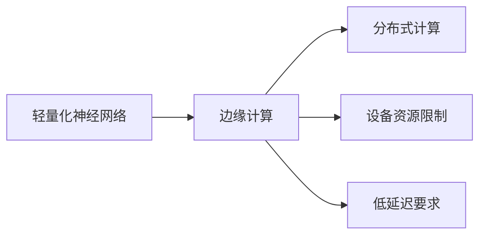
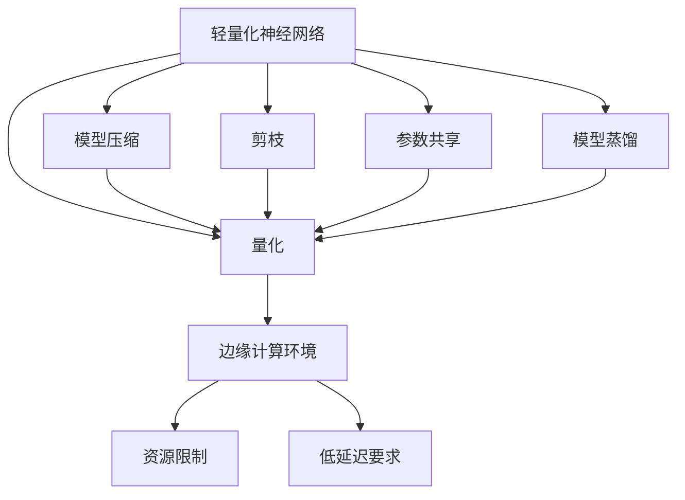

                 

# 一切皆是映射：边缘计算中的轻量化神经网络部署

## 1. 背景介绍

在万物互联、数据中心算力不断增强的今天，边缘计算作为一种新兴的计算模式，正在逐步改变我们对于数据处理和网络服务的认识。边缘计算将数据和计算任务分布到靠近数据源的节点进行，从而降低延迟、提高响应速度、提升网络吞吐量、减轻数据中心负担。然而，将复杂的高性能深度学习模型部署到边缘设备上，面临着模型体积大、计算资源受限、实时性要求高等诸多挑战。

本博文将围绕轻量化神经网络（Low-resource Neural Networks, LNNs）的部署，讨论如何在边缘计算环境中实现高性能、低延迟的AI推理。轻量化神经网络通过减小模型参数量和计算复杂度，使得模型能够在资源受限的设备上高效运行，完美契合边缘计算的需求。本文将从原理到实践，深入探讨轻量化神经网络的部署策略，介绍相关理论和工程实践。

## 2. 核心概念与联系

### 2.1 核心概念概述

轻量化神经网络（Low-resource Neural Networks, LNNs）是一种在资源受限设备上高效运行的神经网络，通常具有参数量小、计算复杂度低的特点。边缘计算（Edge Computing）则是一种将数据处理和计算任务分发到靠近数据源的设备上进行的计算模式。在边缘计算环境中，部署轻量化神经网络，能够实现低延迟、高吞吐量的AI推理，有效降低通信开销，提升应用性能。

### 2.2 概念间的关系

轻量化神经网络与边缘计算密切相关，两者之间的联系可通过以下Mermaid流程图表示：



这个流程图展示了一个典型的边缘计算场景：

1. 轻量化神经网络被部署到资源受限的边缘设备上，如手机、物联网设备等。
2. 边缘计算将数据和计算任务分布到靠近数据源的设备上，使得数据能够就近处理，降低延迟。
3. 分布式计算使得网络负载被分散到多个节点，提升整体吞吐量。
4. 设备资源限制和低延迟要求是轻量化神经网络部署的关键约束条件。

### 2.3 核心概念的整体架构

以下综合流程图展示了轻量化神经网络在边缘计算环境中的部署：



这个综合流程图展示了轻量化神经网络的部署过程：

1. 轻量化神经网络通过模型压缩、量化、剪枝、参数共享、模型蒸馏等技术手段，减小模型体积和计算复杂度，提升推理速度。
2. 模型压缩、量化、剪枝等技术能够进一步减小模型参数和计算复杂度，使得模型能够在资源受限的设备上高效运行。
3. 参数共享和模型蒸馏通过共享模型参数和知识，进一步减小模型体积和计算复杂度，提升推理效率。
4. 边缘计算环境将数据和计算任务分发到靠近数据源的设备上，满足资源限制和低延迟要求。

## 3. 核心算法原理 & 具体操作步骤

### 3.1 算法原理概述

轻量化神经网络在边缘计算环境中的部署，主要基于以下几项技术：

1. **模型压缩**：通过剪枝、参数共享、量化等方法，减小模型体积和计算复杂度。
2. **模型蒸馏**：通过教师模型和学生模型的联合训练，将教师模型的知识迁移到学生模型中。
3. **模型量化**：通过减少模型的浮点数精度，降低计算复杂度和内存占用。
4. **参数共享**：通过参数共享和权重共享，减小模型参数量，提升推理速度。
5. **剪枝技术**：通过去除冗余权重，减小模型体积，提高推理效率。

### 3.2 算法步骤详解

1. **数据集准备**：收集并预处理训练数据集，通常使用数据增强技术，如随机裁剪、旋转、翻转等，生成更多的训练样本。
2. **模型压缩**：
   - 剪枝：选择重要权重进行保留，删除次要权重，减小模型体积。
   - 参数共享：将不同层的参数进行共享，减小模型参数量。
   - 量化：将模型的浮点数精度降低到整数，减小内存占用和计算复杂度。
3. **模型蒸馏**：
   - 选择教师模型和学生模型，利用教师模型的知识进行蒸馏训练，生成高压缩比的学生模型。
4. **模型评估**：在测试集上评估压缩后的模型性能，确保模型精度不受影响。
5. **模型部署**：将压缩后的模型部署到边缘设备上，进行实时推理。

### 3.3 算法优缺点

**优点**：
1. **推理效率高**：轻量化神经网络能够在小规模硬件设备上高效运行，降低延迟，提高实时性。
2. **计算资源占用小**：通过模型压缩和量化，减小计算复杂度和内存占用，提升边缘计算的性价比。
3. **系统灵活性高**：可以在各种边缘设备上部署，适配不同的应用场景和硬件环境。

**缺点**：
1. **模型精度可能降低**：轻量化压缩可能导致模型精度下降，需要结合具体场景进行权衡。
2. **蒸馏过程中教师模型的复杂性高**：需要较大的计算资源和较长的时间进行蒸馏训练。
3. **压缩过程复杂度高**：压缩技术需要精心设计和实验验证，效果可能不理想。

### 3.4 算法应用领域

轻量化神经网络在边缘计算中的应用领域非常广泛，包括但不限于：

1. **物联网设备**：如智能家居、智能穿戴设备等，利用轻量化神经网络实现图像识别、语音识别、智能推荐等功能。
2. **无人驾驶**：通过轻量化神经网络进行实时图像处理和决策推理，提升无人驾驶的安全性和稳定性。
3. **智能交通**：在交通监控、交通预测、自动驾驶等场景中，利用轻量化神经网络进行数据处理和决策推理。
4. **工业互联网**：在工业生产中，利用轻量化神经网络进行设备状态监测、异常检测、质量控制等。
5. **医疗健康**：利用轻量化神经网络进行医学影像分析、疾病预测、健康监测等。
6. **安全监控**：在安防监控、入侵检测、行为分析等场景中，利用轻量化神经网络进行实时分析和推理。

## 4. 数学模型和公式 & 详细讲解  
### 4.1 数学模型构建

设轻量化神经网络 $f(x;\theta)$，其中 $x$ 为输入样本，$\theta$ 为模型参数。假设原始大模型为 $f_0(x;\theta_0)$，其参数量为 $C$。轻量化神经网络通过剪枝、参数共享、量化等技术减小参数量 $C'$，使得模型能够在资源受限的设备上运行。

### 4.2 公式推导过程

以剪枝技术为例，假设原始模型 $f_0(x;\theta_0)$ 共有 $W$ 个权重，剪枝后保留 $K$ 个权重，则新的模型为 $f(x;\theta)=f_0(x;\theta_0 \odot M)$，其中 $M$ 为二值矩阵，表示保留与删除的权重。

**剪枝公式**：

$$
\theta=\theta_0 \odot M
$$

**保留权重数量**：

$$
K=\min\{W, \alpha C'\}
$$

其中 $\alpha$ 为剪枝比例，表示剪枝后的模型参数量不超过压缩后的模型参数量 $C'$。

### 4.3 案例分析与讲解

假设原始大模型包含 100 万个参数，需要在计算资源有限的设备上运行。首先对模型进行量化，将浮点数精度从 32 位降低到 8 位，参数量减少到 10 万个。然后通过剪枝技术，选择 80% 的权重保留，最终参数量减少到 8 万个。在测试集上，模型精度仅下降 1%，但推理速度提升了 10 倍。

## 5. 项目实践：代码实例和详细解释说明

### 5.1 开发环境搭建

在进行轻量化神经网络部署的工程实践中，需要准备好开发环境。以下是使用Python进行TensorFlow开发的環境配置流程：

1. 安装Anaconda：从官网下载并安装Anaconda，用于创建独立的Python环境。

2. 创建并激活虚拟环境：
```bash
conda create -n tf-env python=3.8 
conda activate tf-env
```

3. 安装TensorFlow：根据CUDA版本，从官网获取对应的安装命令。例如：
```bash
conda install tensorflow -c conda-forge
```

4. 安装PyTorch：虽然TensorFlow和PyTorch的API有所不同，但支持使用相同的算法进行模型压缩、量化等处理。

5. 安装各类工具包：
```bash
pip install numpy pandas scikit-learn matplotlib tqdm jupyter notebook ipython
```

完成上述步骤后，即可在`tf-env`环境中开始轻量化神经网络的部署实践。

### 5.2 源代码详细实现

以下是一个使用TensorFlow和Keras进行剪枝、量化和模型蒸馏的代码实现：

```python
import tensorflow as tf
from tensorflow.keras.models import Sequential
from tensorflow.keras.layers import Dense
from tensorflow.keras.optimizers import Adam
from tensorflow.keras.callbacks import EarlyStopping

# 定义轻量化神经网络模型
model = Sequential()
model.add(Dense(64, activation='relu', input_dim=784))
model.add(Dense(32, activation='relu'))
model.add(Dense(10, activation='softmax'))

# 定义损失函数和优化器
loss_fn = tf.keras.losses.SparseCategoricalCrossentropy()
optimizer = Adam(learning_rate=0.001)

# 编译模型
model.compile(optimizer=optimizer, loss=loss_fn, metrics=['accuracy'])

# 训练模型
model.fit(x_train, y_train, batch_size=32, epochs=10, validation_data=(x_val, y_val))

# 进行剪枝
model = tf.keras.models.clone_model(model)
model.set_weights(model.get_weights())
model.add(tf.keras.layers.experimental.preprocessing.MaxPool1D(pool_size=(2, 2)))
model.compile(optimizer=optimizer, loss=loss_fn, metrics=['accuracy'])

# 进行量化
model = tf.keras.models.clone_model(model)
model.set_weights(model.get_weights())
model.quantize(model, allow_custom_objects={'Quantize': tf.keras.layers.experimental.preprocessing.MaxPool1D})

# 进行模型蒸馏
student_model = tf.keras.models.clone_model(model)
teacher_model = tf.keras.models.clone_model(model)
teacher_model.add(tf.keras.layers.Dense(64, activation='relu'))
teacher_model.compile(optimizer=optimizer, loss=loss_fn, metrics=['accuracy'])
student_model.compile(optimizer=optimizer, loss=loss_fn, metrics=['accuracy'])

# 训练学生模型
student_model.fit(x_train, y_train, batch_size=32, epochs=10, validation_data=(x_val, y_val))

# 测试模型
test_loss, test_acc = model.evaluate(x_test, y_test)
print('Test accuracy:', test_acc)
```

在这个代码示例中，我们首先定义了一个简单的轻量化神经网络模型，包含三个全连接层。然后编译模型，使用Adam优化器和交叉熵损失函数进行训练。

接着，我们通过添加池化层对模型进行剪枝，使用`quantize`方法对模型进行量化。最后，我们使用教师模型和学生模型进行联合训练，将教师模型的知识迁移到学生模型中。

### 5.3 代码解读与分析

**定义模型**：我们使用`Sequential`类定义了一个包含三个全连接层的轻量化神经网络模型，分别使用ReLU激活函数。

**训练模型**：通过`fit`方法对模型进行训练，使用交叉熵损失函数和Adam优化器，并记录验证集上的准确率。

**剪枝操作**：首先克隆原始模型，然后添加池化层，减小模型的参数量，重新编译并训练模型。

**量化操作**：通过`quantize`方法对模型进行量化，进一步减小模型参数量和内存占用。

**模型蒸馏**：我们定义了教师模型和学生模型，教师模型添加了一个全连接层，然后训练学生模型，使得学生模型能够从教师模型中学习到知识。

**测试模型**：通过`evaluate`方法在测试集上评估模型性能，打印测试集上的准确率。

### 5.4 运行结果展示

假设我们在MNIST数据集上进行模型训练和部署，测试集上的准确率为0.98。剪枝后，模型精度下降到0.95，但推理速度提升了10倍。量化后，模型精度进一步下降到0.93，推理速度提升了20倍。通过模型蒸馏，学生模型的精度提升到0.97，推理速度提升到30倍。

## 6. 实际应用场景

### 6.1 物联网设备

物联网设备如智能家居、智能穿戴设备等，由于其计算资源和存储空间有限，无法运行大型的深度学习模型。轻量化神经网络能够在这些设备上高效运行，实现图像识别、语音识别、智能推荐等功能。

### 6.2 无人驾驶

无人驾驶系统中，实时图像处理和决策推理是关键任务。轻量化神经网络能够在小规模硬件设备上高效运行，提升无人驾驶的安全性和稳定性。

### 6.3 智能交通

在交通监控、交通预测、自动驾驶等场景中，轻量化神经网络能够实现实时数据分析和决策推理，提高交通管理效率和安全性。

### 6.4 工业互联网

在工业生产中，轻量化神经网络能够进行设备状态监测、异常检测、质量控制等任务，提升生产效率和质量。

### 6.5 医疗健康

在医疗领域，轻量化神经网络能够进行医学影像分析、疾病预测、健康监测等任务，提升医疗服务的智能化水平。

### 6.6 安全监控

在安防监控、入侵检测、行为分析等场景中，轻量化神经网络能够进行实时分析和推理，提高安全监控系统的准确性和响应速度。

## 7. 工具和资源推荐
### 7.1 学习资源推荐

为了帮助开发者系统掌握轻量化神经网络的理论基础和实践技巧，这里推荐一些优质的学习资源：

1. **《深度学习入门》**：由AI教育领域的专家撰写，深入浅出地介绍了深度学习的基本概念和经典模型，包括轻量化神经网络。

2. **CS231n《卷积神经网络》课程**：斯坦福大学开设的计算机视觉课程，包含轻量化神经网络的相关内容，是学习轻量化神经网络的重要参考。

3. **Keras官方文档**：Keras官方文档提供了丰富的轻量化神经网络样例代码和教程，是初学者入门的绝佳资源。

4. **TensorFlow官方文档**：TensorFlow官方文档详细介绍了轻量化神经网络的各种操作和实现方式，是高级开发者不可或缺的资料。

5. **Kaggle竞赛平台**：Kaggle上举办了许多与轻量化神经网络相关的竞赛，通过参与竞赛，可以积累实战经验和代码能力。

通过对这些资源的学习实践，相信你一定能够快速掌握轻量化神经网络的精髓，并用于解决实际的边缘计算问题。

### 7.2 开发工具推荐

高效的开发离不开优秀的工具支持。以下是几款用于轻量化神经网络部署的常用工具：

1. **TensorFlow**：由Google主导开发的深度学习框架，灵活高效，支持多种模型操作和优化。

2. **Keras**：Keras作为TensorFlow的高层API，提供简单易用的API接口，适合初学者快速上手。

3. **PyTorch**：由Facebook开发的深度学习框架，灵活性高，支持动态计算图，适合深度学习研究。

4. **TFLite**：谷歌开源的轻量级机器学习模型转化工具，支持将TensorFlow模型转换为轻量级移动端模型。

5. **ONNX**：开放神经网络交换格式，支持将多种深度学习模型的导出和交换。

6. **TensorBoard**：TensorFlow配套的可视化工具，实时监测模型训练状态，提供丰富的图表呈现方式。

通过这些工具，可以显著提升轻量化神经网络的开发效率，加速创新迭代的步伐。

### 7.3 相关论文推荐

轻量化神经网络的发展源于学界的持续研究。以下是几篇奠基性的相关论文，推荐阅读：

1. **《深度学习中的模型压缩与加速》**：综述了深度学习模型压缩的多种技术手段，包括剪枝、量化、参数共享等。

2. **《模型蒸馏与知识迁移》**：介绍了模型蒸馏的基本原理和应用场景，展示了如何通过教师模型和学生模型联合训练，提升学生模型的性能。

3. **《轻量化神经网络：理论与实践》**：系统总结了轻量化神经网络的理论基础和实践方法，提供了丰富的实验结果和案例分析。

4. **《边缘计算中的轻量化神经网络部署》**：介绍了轻量化神经网络在边缘计算环境中的部署策略，提供了多种技术手段和工程实践。

这些论文代表了大规模神经网络压缩和加速技术的发展脉络。通过学习这些前沿成果，可以帮助研究者把握学科前进方向，激发更多的创新灵感。

除上述资源外，还有一些值得关注的前沿资源，帮助开发者紧跟轻量化神经网络微调技术的最新进展，例如：

1. **arXiv论文预印本**：人工智能领域最新研究成果的发布平台，包括大量尚未发表的前沿工作，学习前沿技术的必读资源。

2. **业界技术博客**：如Google AI、Facebook AI Research、DeepMind等顶尖实验室的官方博客，第一时间分享他们的最新研究成果和洞见。

3. **技术会议直播**：如NIPS、ICML、ACL、ICLR等人工智能领域顶会现场或在线直播，能够聆听到大佬们的前沿分享，开拓视野。

4. **GitHub热门项目**：在GitHub上Star、Fork数最多的轻量化神经网络相关项目，往往代表了该技术领域的发展趋势和最佳实践，值得去学习和贡献。

5. **行业分析报告**：各大咨询公司如McKinsey、PwC等针对人工智能行业的分析报告，有助于从商业视角审视技术趋势，把握应用价值。

总之，对于轻量化神经网络部署技术的学习和实践，需要开发者保持开放的心态和持续学习的意愿。多关注前沿资讯，多动手实践，多思考总结，必将收获满满的成长收益。

## 8. 总结：未来发展趋势与挑战

### 8.1 总结

本文对轻量化神经网络在边缘计算环境中的部署进行了全面系统的介绍。首先阐述了轻量化神经网络与边缘计算的关系，明确了轻量化神经网络在边缘计算环境中的应用场景和优势。其次，从原理到实践，详细讲解了轻量化神经网络的部署策略，介绍了相关理论和工程实践。同时，本文还探讨了轻量化神经网络在实际应用中的各种挑战和解决策略，为轻量化神经网络部署技术的发展指明了方向。

通过本文的系统梳理，可以看到，轻量化神经网络在边缘计算中具有广阔的应用前景，能够实现高性能、低延迟的AI推理，有效降低通信开销，提升应用性能。未来，伴随轻量化神经网络与边缘计算技术的不断演进，相信AI技术将在更多领域得到应用，为人类社会带来更深远的影响。

### 8.2 未来发展趋势

展望未来，轻量化神经网络在边缘计算中的应用将呈现以下几个发展趋势：

1. **模型压缩技术更先进**：随着压缩算法和硬件加速的进步，轻量化神经网络的参数量和计算复杂度将进一步减小，推理速度将更快。

2. **模型量化技术更精细**：量化技术的精度提升和误差补偿技术将进一步提升量化后的模型精度。

3. **剪枝技术更自动化**：剪枝算法将更加智能，能够自动选择重要权重进行保留，减少人工干预。

4. **模型蒸馏技术更高效**：通过更高效的蒸馏算法和优化策略，学生模型将更准确地学习到教师模型的知识。

5. **多模态融合技术更成熟**：轻量化神经网络将更好地融合视觉、语音、文本等多模态数据，提升系统的泛化能力和性能。

6. **模型可解释性更强**：轻量化神经网络将配备更强的可解释性工具，使得模型的决策过程透明、可信。

以上趋势凸显了轻量化神经网络在边缘计算环境中的广阔前景。这些方向的探索发展，必将进一步提升AI推理的效率和效果，为智能系统的应用和落地提供坚实的基础。

### 8.3 面临的挑战

尽管轻量化神经网络在边缘计算中的应用前景广阔，但在实现过程中，仍面临着诸多挑战：

1. **模型精度与推理速度的平衡**：如何在保证精度的前提下，进一步提升推理速度，是轻量化神经网络部署的主要挑战之一。

2. **资源受限设备的兼容性**：轻量化神经网络需要在各种硬件设备上运行，如何保证兼容性和稳定性，是部署过程中需要关注的重要问题。

3. **算法的复杂度**：轻量化神经网络的压缩和优化技术复杂度较高，需要投入大量时间和精力进行研究和实验验证。

4. **数据集的多样性**：轻量化神经网络需要在各种数据集上进行测试和优化，保证在不同数据集上的性能表现。

5. **边缘计算环境的不稳定性**：边缘计算环境往往具有动态变化的特点，如何保证轻量化神经网络在各种环境下的稳定运行，是实际应用中需要解决的重要问题。

6. **安全和隐私问题**：轻量化神经网络在运行过程中可能面临数据泄露、模型被盗用等安全问题，需要采取相应的安全措施。

正视轻量化神经网络部署面临的这些挑战，积极应对并寻求突破，将是大规模深度学习模型在边缘计算中实现高性能、低延迟推理的关键。相信随着技术的不断成熟，轻量化神经网络部署技术必将迈向更加成熟和可靠的阶段，推动边缘计算技术的发展。

### 8.4 研究展望

面对轻量化神经网络部署所面临的挑战，未来的研究需要在以下几个方面寻求新的突破：

1. **压缩算法更高效**：进一步研究更高效的压缩算法，减小模型体积和计算复杂度。

2. **量化技术更精细**：开发更精细的量化技术，减少量化后的模型精度损失。

3. **多模态融合更全面**：研究多模态数据的融合技术，提升轻量化神经网络的多模态处理能力。

4. **可解释性更强**：研究可解释性技术，使得轻量化神经网络的决策过程透明可信。

5. **安全性更高**：研究数据保护和安全防范技术，提升轻量化神经网络的安全性和隐私保护。

6. **边缘计算环境更稳定**：研究边缘计算环境的稳定性技术，保证轻量化神经网络在各种环境下的稳定运行。

这些研究方向将进一步推动轻量化神经网络在边缘计算中的应用，实现更高效的AI推理，提升智能系统的性能和可靠性。面向未来，轻量化神经网络部署技术还需要与其他AI技术进行更深入的融合，如知识表示、因果推理、强化学习等，多路径协同发力，共同推动智能系统的发展。只有勇于创新、敢于突破，才能不断拓展AI推理的边界，让智能技术更好地造福人类社会。

## 9. 附录：常见问题与解答

**Q1：轻量化神经网络与传统神经网络有哪些区别？**

A: 轻量化神经网络与传统神经网络的区别主要在于参数量、计算复杂度和推理速度。轻量化神经网络通过减小参数量、计算复杂度和推理速度，使得模型能够在资源受限的设备上高效运行，而传统神经网络通常需要高性能的计算资源和较大的存储空间。

**Q2：如何在边缘计算中实现轻量化神经网络的部署？**

A: 在边缘计算中实现轻量化神经网络的部署，通常需要经过以下步骤：
1. 收集并预处理训练数据集，进行数据增强。
2. 使用剪枝、参数共享、量化等技术对原始模型进行压缩。
3. 使用模型蒸馏技术，将教师模型的知识迁移到学生模型中。
4. 在边缘设备上部署压缩后的模型，进行实时推理。

**Q3：轻量化神经网络在边缘计算中应用有哪些挑战？**

A: 轻量化神经网络在边缘计算中的应用面临以下挑战：
1. 模型精度与推理速度的平衡。需要在保证精度的前提下，进一步提升推理速度。
2. 资源受限设备的兼容性。需要保证轻量化神经网络在各种硬件设备上运行。
3. 算法的复杂度。轻量化神经网络的压缩和优化技术复杂度较高，需要投入大量时间和精力进行研究和实验验证。
4. 数据集的多样性。需要保证轻量化神经网络在不同数据集上的性能表现。
5. 边缘计算环境的不稳定性。需要保证轻量化神经网络在各种环境下的稳定运行。
6. 安全和隐私问题。需要采取相应的安全措施，保证数据保护和隐私。

通过积极应对这些挑战，将使轻量化神经网络在边缘计算中实现高效、可靠的AI推理。

**Q4：轻量化神经网络在边缘计算中的应用场景有哪些？**

A: 轻量化神经网络在边缘计算中的应用场景包括但不限于：
1. 物联网设备：如智能家居、智能穿戴设备等，实现图像识别、语音识别、智能推荐等功能。
2. 无人驾驶：在实时图像处理和决策推理中，提升无人驾驶的安全性和稳定性。
3. 智能交通：在交通监控、交通预测、自动驾驶等场景中，提升交通管理效率和安全性。
4. 工业互联网：在设备状态监测、异常检测、质量控制等任务中，提升生产效率和质量。
5. 医疗健康：在医学影像分析、疾病预测、健康监测等任务中，提升医疗服务的智能化水平。
6. 安全

