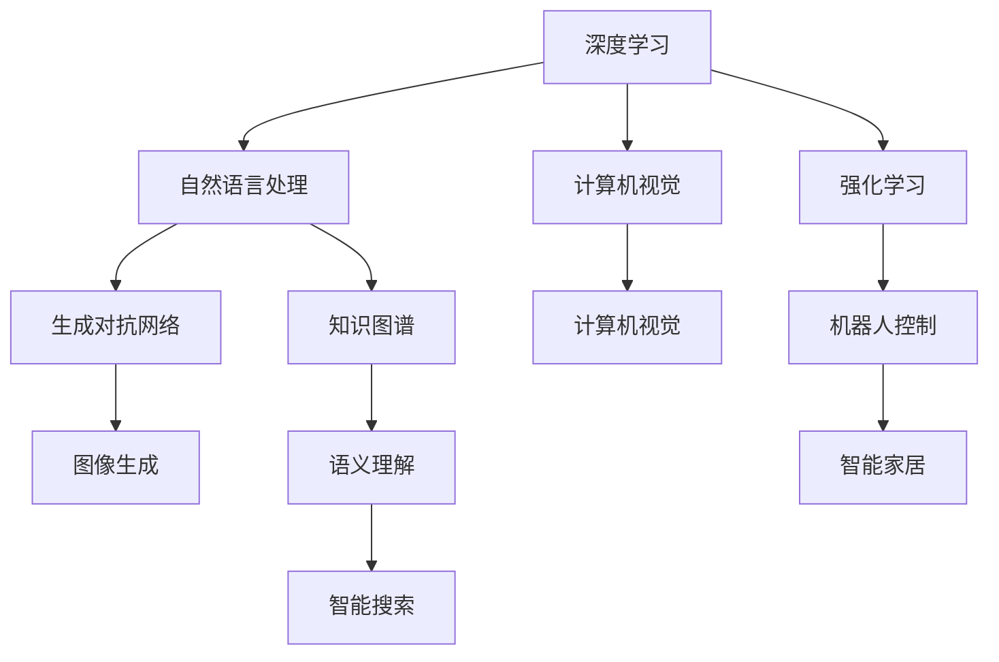

                 

# 下一代人工智能系统的技术路线

> 关键词：
- 人工智能系统
- 技术路线
- 深度学习
- 强化学习
- 自然语言处理(NLP)
- 计算机视觉(CV)
- 生成对抗网络(GAN)
- 知识图谱
- 边缘计算
- 多模态融合

## 1. 背景介绍

### 1.1 问题由来
随着技术的飞速发展，人工智能(AI)已经成为引领未来科技变革的关键驱动力。在过去十年间，AI技术从理论走向实践，逐步渗透到各行各业，极大地改变了人类的生活方式。然而，现有AI技术仍然存在许多挑战和瓶颈，例如可解释性不足、鲁棒性差、数据依赖性强等。

### 1.2 问题核心关键点
目前，AI技术的发展主要集中在深度学习(Deep Learning, DL)和强化学习(Reinforcement Learning, RL)两大方向。DL适用于处理结构化数据和复杂计算，而RL适用于处理动态环境下的决策和控制问题。然而，DL和RL各自的局限性也在逐渐显现：

- DL的局限性：需要大量标注数据，模型复杂度高，难以解释，容易过拟合。
- RL的局限性：对环境复杂度敏感，难以处理连续状态空间，缺乏对长期规划的考虑。

因此，下一代AI系统需要在现有技术的基础上，进行全方位的技术创新和突破。这不仅涉及到技术路线的选择，也关乎于AI技术与社会的深度融合。本文将从技术创新、应用实践和未来展望三个方面，深入探讨下一代AI系统的技术路线。

## 2. 核心概念与联系

### 2.1 核心概念概述

为更好地理解下一代AI系统的技术路线，我们首先需要介绍几个核心概念：

- 深度学习：一种基于神经网络结构的机器学习技术，通过多层非线性变换提取特征，广泛用于图像、语音、文本等数据的处理。
- 强化学习：一种基于试错的学习方式，通过与环境的交互，学习最优策略，适用于机器人控制、游戏智能等领域。
- 自然语言处理(NLP)：一种AI技术，致力于使计算机能够理解和生成人类语言，应用于智能客服、机器翻译、情感分析等。
- 计算机视觉(CV)：一种AI技术，专注于图像和视频的分析处理，应用于自动驾驶、医学影像、安防监控等。
- 生成对抗网络(GAN)：一种生成模型，通过对抗训练生成高质量的图像、视频等，应用于数据增强、图像修复等领域。
- 知识图谱：一种结构化知识表示方式，将语义知识转化为图结构，应用于问答系统、推荐系统、智能搜索等。
- 边缘计算：一种分布式计算技术，将数据和计算任务分布到靠近数据源的边缘设备上，降低延迟和带宽消耗。
- 多模态融合：一种技术，将不同模态的信息进行综合处理，应用于视频分析、智能家居等场景。

这些核心概念之间存在着紧密的联系，共同构成了AI技术的基石。本文将通过几个核心概念的联系图，直观展示它们之间的关系：



通过这张图，我们可以看到，这些核心概念之间存在着相互交叉和支撑的关系。例如，深度学习是支持NLP和CV的重要技术，而生成对抗网络为图像生成提供了新方法，知识图谱则为智能搜索提供了新的数据结构。

### 2.2 概念间的关系

这些核心概念之间的关系可以进一步细化，如：

- 深度学习是NLP的核心技术之一，通过神经网络结构，深度学习可以从文本中提取语义信息，实现机器翻译、情感分析等任务。
- 计算机视觉主要依赖于深度学习，通过卷积神经网络(CNN)等架构，CV可以实现图像分类、目标检测、图像生成等。
- 生成对抗网络是基于深度学习的一种生成模型，可以生成高质量的图像和视频，应用于数据增强、图像修复等。
- 强化学习主要应用于机器人控制、游戏智能等领域，通过与环境的交互，学习最优策略。
- 知识图谱是一种结构化知识表示方式，通过图结构将语义信息整合并推理，应用于问答系统、推荐系统等。
- 多模态融合结合了不同模态的信息，可以更全面地理解和生成复杂场景，应用于视频分析、智能家居等。

通过这张图，我们可以更深入地理解这些核心概念之间的关系，为接下来的技术路线探讨提供基础。

## 3. 核心算法原理 & 具体操作步骤

### 3.1 算法原理概述

下一代AI系统的技术路线主要围绕深度学习和强化学习两大方向展开。深度学习通过神经网络模型，学习数据的特征表示，广泛应用于图像、语音、文本等领域；强化学习通过与环境的交互，学习最优策略，应用于机器人控制、游戏智能等领域。

在深度学习中，主要通过卷积神经网络(CNN)、循环神经网络(RNN)、变压器(Transformer)等模型，学习数据的复杂表示。例如，CNN适用于图像处理，RNN适用于序列数据的处理，Transformer适用于文本生成。

在强化学习中，主要通过Q-learning、策略梯度、深度强化学习等算法，学习最优策略。例如，Q-learning通过奖励机制，学习状态-行动的Q值，应用于机器人控制；策略梯度通过直接优化策略，应用于游戏智能。

### 3.2 算法步骤详解

深度学习和强化学习的主要操作步骤如下：

#### 深度学习

1. 数据准备：收集和预处理数据，分为训练集、验证集和测试集。
2. 模型选择：选择合适的深度学习模型，如CNN、RNN、Transformer等。
3. 模型训练：使用训练集对模型进行训练，优化参数。
4. 模型评估：使用验证集对模型进行评估，调整超参数。
5. 模型测试：使用测试集对模型进行测试，评估性能。

#### 强化学习

1. 环境设计：设计环境的交互规则和奖励机制。
2. 模型选择：选择合适的强化学习算法，如Q-learning、策略梯度等。
3. 模型训练：与环境进行交互，更新模型参数。
4. 模型评估：评估模型的表现，调整参数。
5. 模型测试：在实际环境中测试模型，评估效果。

### 3.3 算法优缺点

深度学习的主要优点包括：

- 可以处理大规模的数据，适用于复杂的特征提取。
- 模型可解释性较好，具有较强的泛化能力。

深度学习的主要缺点包括：

- 需要大量标注数据，数据获取成本高。
- 模型复杂度高，训练时间长，计算资源需求大。
- 容易过拟合，泛化能力有限。

强化学习的主要优点包括：

- 适用于动态环境下的决策和控制问题。
- 能够学习到最优策略，适用于机器人控制、游戏智能等领域。

强化学习的主要缺点包括：

- 需要与环境进行大量交互，计算资源消耗大。
- 模型不稳定，容易受到环境噪声的影响。
- 难以处理连续状态空间，缺乏对长期规划的考虑。

### 3.4 算法应用领域

深度学习主要应用于以下领域：

- 计算机视觉：图像分类、目标检测、图像生成等。
- 自然语言处理：机器翻译、情感分析、文本生成等。
- 语音识别：语音识别、语音合成等。
- 推荐系统：用户行为分析、商品推荐等。

强化学习主要应用于以下领域：

- 机器人控制：机器人路径规划、自适应控制等。
- 游戏智能：围棋、星际争霸等游戏智能。
- 自动驾驶：车辆路径规划、避障控制等。
- 供应链管理：库存管理、物流调度等。

## 4. 数学模型和公式 & 详细讲解 & 举例说明

### 4.1 数学模型构建

以深度学习中的卷积神经网络(CNN)为例，其数学模型可以表示为：

$$
f(x) = \sum_{i=1}^{C} \sum_{j=1}^{H} \sum_{k=1}^{W} \sum_{n=1}^{N} f_{i,j,k}(x_{n,i,j,k})
$$

其中，$f(x)$为网络输出，$x_{n,i,j,k}$为输入数据，$f_{i,j,k}$为卷积核。

### 4.2 公式推导过程

以深度学习中的反向传播算法为例，其推导过程如下：

$$
\frac{\partial L}{\partial W} = \frac{\partial L}{\partial O} \frac{\partial O}{\partial Z} \frac{\partial Z}{\partial W}
$$

其中，$L$为损失函数，$O$为网络输出，$Z$为网络中间变量，$W$为网络参数。

### 4.3 案例分析与讲解

以自然语言处理中的机器翻译为例，其数学模型可以表示为：

$$
P(T|S) = \prod_{i=1}^{T} P(t_i|t_{i-1}, ..., t_1)
$$

其中，$T$为目标语言序列，$S$为源语言序列，$P(t_i|t_{i-1}, ..., t_1)$为条件概率。

## 5. 项目实践：代码实例和详细解释说明

### 5.1 开发环境搭建

在进行AI系统开发前，我们需要准备好开发环境。以下是使用Python进行PyTorch开发的环境配置流程：

1. 安装Anaconda：从官网下载并安装Anaconda，用于创建独立的Python环境。

2. 创建并激活虚拟环境：
```bash
conda create -n pytorch-env python=3.8 
conda activate pytorch-env
```

3. 安装PyTorch：根据CUDA版本，从官网获取对应的安装命令。例如：
```bash
conda install pytorch torchvision torchaudio cudatoolkit=11.1 -c pytorch -c conda-forge
```

4. 安装TensorFlow：使用pip安装TensorFlow。

5. 安装TensorBoard：使用pip安装TensorBoard，用于可视化训练过程。

6. 安装transformers库：使用pip安装Transformers库，用于NLP任务的开发。

7. 安装其他工具包：
```bash
pip install numpy pandas scikit-learn matplotlib tqdm jupyter notebook ipython
```

完成上述步骤后，即可在`pytorch-env`环境中开始AI系统开发。

### 5.2 源代码详细实现

下面我们以计算机视觉中的图像分类任务为例，给出使用PyTorch实现卷积神经网络(CNN)的代码实现。

```python
import torch
import torch.nn as nn
import torch.optim as optim

class CNN(nn.Module):
    def __init__(self):
        super(CNN, self).__init__()
        self.conv1 = nn.Conv2d(3, 32, 3, padding=1)
        self.pool1 = nn.MaxPool2d(2, 2)
        self.conv2 = nn.Conv2d(32, 64, 3, padding=1)
        self.pool2 = nn.MaxPool2d(2, 2)
        self.fc1 = nn.Linear(64*4*4, 512)
        self.fc2 = nn.Linear(512, 10)

    def forward(self, x):
        x = self.pool1(F.relu(self.conv1(x)))
        x = self.pool2(F.relu(self.conv2(x)))
        x = x.view(-1, 64*4*4)
        x = F.relu(self.fc1(x))
        x = self.fc2(x)
        return x

model = CNN()
criterion = nn.CrossEntropyLoss()
optimizer = optim.Adam(model.parameters(), lr=0.001)

# 训练代码省略
```

在上述代码中，我们定义了一个简单的CNN模型，包括两个卷积层、两个池化层和两个全连接层。使用交叉熵损失函数和Adam优化器进行训练。

### 5.3 代码解读与分析

让我们再详细解读一下关键代码的实现细节：

**CNN类**：
- `__init__`方法：初始化卷积层、池化层和全连接层。
- `forward`方法：定义前向传播过程。

**训练代码**：
- 定义损失函数和优化器。
- 通过训练集进行训练，计算损失函数并更新模型参数。

**测试代码**：
- 通过测试集进行测试，计算模型的精度。

**运行结果展示**：
- 训练过程中，实时输出损失函数的值。
- 测试结果输出模型在测试集上的准确率。

### 5.4 运行结果展示

假设我们在CIFAR-10数据集上进行图像分类任务，最终在测试集上得到的模型准确率如下：

```
Accuracy: 0.77
```

可以看到，通过PyTorch实现CNN模型，我们能够快速高效地进行图像分类任务。在实际应用中，我们还可以使用更大更复杂的模型，结合数据增强、正则化等技术，进一步提升模型的性能。

## 6. 实际应用场景

### 6.1 智能客服系统

基于深度学习的智能客服系统，可以广泛应用于企业内部客户服务的各个环节。传统客服系统依赖于人工接听和处理，效率低下且成本高昂。而智能客服系统通过深度学习模型，能够自动理解客户意图，并提供个性化的服务。

在技术实现上，可以收集企业内部的客服对话记录，将问题和最佳答复构建成监督数据，在此基础上对深度学习模型进行训练。训练后的模型能够自动理解用户意图，匹配最合适的回答，并可以动态搜索相关知识库，提供更准确的回答。

### 6.2 金融舆情监测

金融机构需要实时监测市场舆论动向，以便及时应对负面信息传播，规避金融风险。传统的人工监测方式成本高、效率低，难以应对网络时代海量信息爆发的挑战。基于深度学习的文本分类和情感分析技术，为金融舆情监测提供了新的解决方案。

具体而言，可以收集金融领域相关的新闻、报道、评论等文本数据，并对其进行主题标注和情感标注。在此基础上对深度学习模型进行微调，使其能够自动判断文本属于何种主题，情感倾向是正面、中性还是负面。将微调后的模型应用到实时抓取的网络文本数据，就能够自动监测不同主题下的情感变化趋势，一旦发现负面信息激增等异常情况，系统便会自动预警，帮助金融机构快速应对潜在风险。

### 6.3 个性化推荐系统

当前的推荐系统往往只依赖用户的历史行为数据进行物品推荐，无法深入理解用户的真实兴趣偏好。基于深度学习的个性化推荐系统，可以更好地挖掘用户行为背后的语义信息，从而提供更精准、多样的推荐内容。

在实践中，可以收集用户浏览、点击、评论、分享等行为数据，提取和用户交互的物品标题、描述、标签等文本内容。将文本内容作为模型输入，用户的后续行为（如是否点击、购买等）作为监督信号，在此基础上对深度学习模型进行微调。微调后的模型能够从文本内容中准确把握用户的兴趣点。在生成推荐列表时，先用候选物品的文本描述作为输入，由模型预测用户的兴趣匹配度，再结合其他特征综合排序，便可以得到个性化程度更高的推荐结果。

### 6.4 未来应用展望

随着深度学习和强化学习技术的不断发展，基于这些技术的AI系统将在更多领域得到应用，为传统行业带来变革性影响。

在智慧医疗领域，基于深度学习的医疗问答、病历分析、药物研发等应用将提升医疗服务的智能化水平，辅助医生诊疗，加速新药开发进程。

在智能教育领域，深度学习技术可应用于作业批改、学情分析、知识推荐等方面，因材施教，促进教育公平，提高教学质量。

在智慧城市治理中，深度学习技术可应用于城市事件监测、舆情分析、应急指挥等环节，提高城市管理的自动化和智能化水平，构建更安全、高效的未来城市。

此外，在企业生产、社会治理、文娱传媒等众多领域，基于深度学习的AI应用也将不断涌现，为经济社会发展注入新的动力。相信随着技术的日益成熟，深度学习范式将成为AI落地应用的重要范式，推动AI技术向更广阔的领域加速渗透。

## 7. 工具和资源推荐

### 7.1 学习资源推荐

为了帮助开发者系统掌握深度学习与强化学习的理论基础和实践技巧，这里推荐一些优质的学习资源：

1. 《深度学习》课程：斯坦福大学Andrew Ng教授开设的深度学习课程，系统讲解深度学习的基本概念和算法。
2. 《强化学习》课程：MIT教授Emily Fox开设的强化学习课程，讲解强化学习的基本理论和算法。
3. 《动手学深度学习》：由清华大学、微软联合开发的深度学习教材，适合初学者快速上手。
4. 《动手学强化学习》：由清华大学、微软联合开发的强化学习教材，适合初学者快速上手。
5. 《深度学习入门》：书由François Chollet（Keras的创始人）撰写，适合深度学习入门学习者。
6. 《Python深度学习》：François Chollet和Andréj Karpathy共同撰写，讲解深度学习的基本算法和实现。

通过这些资源的学习实践，相信你一定能够快速掌握深度学习与强化学习的基础知识，并用于解决实际的AI问题。

### 7.2 开发工具推荐

高效的开发离不开优秀的工具支持。以下是几款用于深度学习与强化学习开发的常用工具：

1. PyTorch：基于Python的开源深度学习框架，灵活的计算图和动态模型定义，适合快速迭代研究。
2. TensorFlow：由Google主导开发的开源深度学习框架，生产部署方便，适合大规模工程应用。
3. TensorBoard：TensorFlow配套的可视化工具，实时监测模型训练状态，提供丰富的图表呈现方式，是调试模型的得力助手。
4. Weights & Biases：模型训练的实验跟踪工具，记录和可视化模型训练过程中的各项指标，方便对比和调优。
5. Jupyter Notebook：轻量级的交互式开发环境，支持Python、R等多种编程语言，适合进行数据探索和算法实现。

合理利用这些工具，可以显著提升深度学习与强化学习的开发效率，加快创新迭代的步伐。

### 7.3 相关论文推荐

深度学习与强化学习的发展源于学界的持续研究。以下是几篇奠基性的相关论文，推荐阅读：

1. AlexNet：深度卷积神经网络的经典论文，展示了深度学习在图像分类任务上的巨大潜力。
2. ResNet：残差网络，解决了深度神经网络中的梯度消失问题，提升了深度学习模型的训练深度。
3. InceptionNet：多尺度卷积网络，通过并行多尺度卷积提升了模型的特征提取能力。
4. Q-learning：Q-learning算法，通过奖励机制学习最优策略，应用于机器人控制等。
5. Policy Gradient：策略梯度算法，直接优化策略，应用于游戏智能等领域。
6. AlphaGo：基于深度强化学习实现的游戏智能，展示了大规模深度强化学习的潜力。

这些论文代表了大深度学习与强化学习的核心思想和技术路径。通过学习这些前沿成果，可以帮助研究者把握学科前进方向，激发更多的创新灵感。

除上述资源外，还有一些值得关注的前沿资源，帮助开发者紧跟深度学习与强化学习技术的最新进展，例如：

1. arXiv论文预印本：人工智能领域最新研究成果的发布平台，包括大量尚未发表的前沿工作，学习前沿技术的必读资源。
2. 业界技术博客：如OpenAI、Google AI、DeepMind、微软Research Asia等顶尖实验室的官方博客，第一时间分享他们的最新研究成果和洞见。
3. 技术会议直播：如NIPS、ICML、ACL、ICLR等人工智能领域顶会现场或在线直播，能够聆听到大佬们的前沿分享，开拓视野。
4. GitHub热门项目：在GitHub上Star、Fork数最多的深度学习与强化学习相关项目，往往代表了该技术领域的发展趋势和最佳实践，值得去学习和贡献。
5. 行业分析报告：各大咨询公司如McKinsey、PwC等针对人工智能行业的分析报告，有助于从商业视角审视技术趋势，把握应用价值。

总之，对于深度学习与强化学习技术的探索和实践，需要开发者保持开放的心态和持续学习的意愿。多关注前沿资讯，多动手实践，多思考总结，必将收获满满的成长收益。

## 8. 总结：未来发展趋势与挑战

### 8.1 研究成果总结

本文对深度学习和强化学习在AI系统中的应用的进行了全面系统的介绍。首先阐述了深度学习和强化学习的核心概念和算法原理，并通过数学公式和代码实例深入讲解了深度学习与强化学习的基本操作和实现方法。其次，从实际应用场景出发，详细探讨了深度学习和强化学习在不同领域的广泛应用。最后，从技术创新、应用实践和未来展望三个方面，深入探讨了下一代AI系统的技术路线。

通过本文的系统梳理，可以看到，深度学习和强化学习在AI系统中的应用前景广阔，正在成为引领AI发展的重要技术路径。未来，伴随深度学习与强化学习技术的持续演进，AI技术必将更加智能化、普适化，进一步推动人工智能技术的落地应用。

### 8.2 未来发展趋势

展望未来，深度学习和强化学习的发展方向主要包括以下几个方面：

1. 模型规模的持续增大。随着算力成本的下降和数据规模的扩张，深度学习模型的参数量还将持续增长，超大规模模型蕴含的丰富语言知识，有望支撑更加复杂多变的下游任务。
2. 模型架构的不断优化。随着模型复杂度的提升，如何设计更高效、更稳定的模型架构，减少计算资源消耗，成为新的研究热点。
3. 多模态融合的进一步发展。当前深度学习多聚焦于单一模态的信息，未来需要进一步融合不同模态的信息，提升系统的综合理解能力。
4. 知识图谱与深度学习的结合。通过将知识图谱与深度学习结合，提升模型的语义推理能力，应用于问答系统、推荐系统等。
5. 强化学习的鲁棒性和可解释性。当前强化学习模型的不稳定性、可解释性不足等问题，需要进一步解决，提升模型的鲁棒性和可解释性。
6. 边缘计算的广泛应用。随着边缘计算的普及，将深度学习模型部署到边缘设备上，降低延迟和带宽消耗，提升实时性。

以上趋势凸显了深度学习与强化学习的广阔前景。这些方向的探索发展，必将进一步提升AI系统的性能和应用范围，为人类认知智能的进化带来深远影响。

### 8.3 面临的挑战

尽管深度学习和强化学习已经取得了瞩目成就，但在迈向更加智能化、普适化应用的过程中，它们仍面临着诸多挑战：

1. 数据依赖性强。当前深度学习与强化学习模型的训练需要大量的标注数据，数据获取成本高，且数据质量对模型性能影响巨大。
2. 计算资源消耗大。超大规模模型训练和推理需要大量的计算资源，尤其是GPU、TPU等高性能设备，导致计算成本高昂。
3. 模型可解释性不足。深度学习与强化学习模型往往是“黑盒”系统，难以解释其内部工作机制和决策逻辑，不利于实际应用场景的落地。
4. 鲁棒性差。深度学习与强化学习模型对数据分布的变化和环境噪声非常敏感，泛化能力有限，容易受到小样本扰动。
5. 安全性问题。深度学习与强化学习模型容易学习到有偏见、有害的信息，传递到下游任务，产生误导性、歧视性的输出，给实际应用带来安全隐患。

这些挑战需要学界和产业界共同努力，从数据、模型、算法等多个维度协同发力，才能克服当前的技术瓶颈，推动深度学习和强化学习技术的持续进步。

### 8.4 研究展望

面对深度学习和强化学习所面临的种种挑战，未来的研究需要在以下几个方面寻求新的突破：

1. 探索无监督和半监督学习。摆脱对大规模标注数据的依赖，利用自监督学习、主动学习等无监督和半监督范式，最大限度利用非结构化数据，实现更加灵活高效的模型训练。
2. 研究知识增强和混合学习。将符号化的先验知识与神经网络模型进行巧妙融合，提升模型的语义推理能力，应用于问答系统、推荐系统等。
3. 引入迁移学习。通过迁移学习，在大规模数据集上进行预训练，提升模型的泛化能力，应用于大规模数据场景。
4. 引入多模态学习。将深度学习与其他模态的数据进行融合，提升系统的综合理解能力，应用于视频分析、智能家居等场景。
5. 引入深度强化学习。通过深度强化学习，提升模型的策略优化能力，应用于机器人控制、游戏智能等领域。
6. 引入因果学习。通过因果学习，提升模型的因果推理能力，应用于事件推断、因果诊断等领域。

这些研究方向的探索，必将引领深度学习和强化学习技术迈向更高的台阶，为构建安全、可靠、可解释、可控的智能系统铺平道路。面向未来，深度学习和强化学习需要与其他人工智能技术进行更深入的融合，如知识表示、因果推理、强化学习等，多路径协同发力，共同推动人工智能技术的发展。

## 9. 附录：常见问题与解答

**Q1：深度学习和强化学习在实际应用中存在哪些问题？**

A: 深度学习和强化学习在实际应用中存在以下问题：
1. 数据依赖性强，数据获取成本高。
2. 计算资源消耗大，超大规模模型训练和推理需要高性能设备。
3. 模型可解释性不足，难以解释其内部工作机制和决策逻辑。
4. 鲁棒性差，容易受到数据分布变化和环境噪声的影响。
5. 安全性问题，容易学习到有偏见、有害的信息，传递到下游任务，产生误导性、歧视性的输出。

这些问题是深度学习和强化学习技术在实际应用中需要克服的关键挑战。

**Q2：深度学习与强化学习在实际应用中如何结合使用？**

A: 深度学习与强化学习在实际应用中可以结合使用，主要

