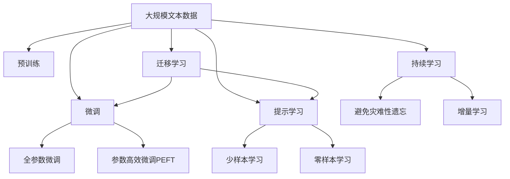
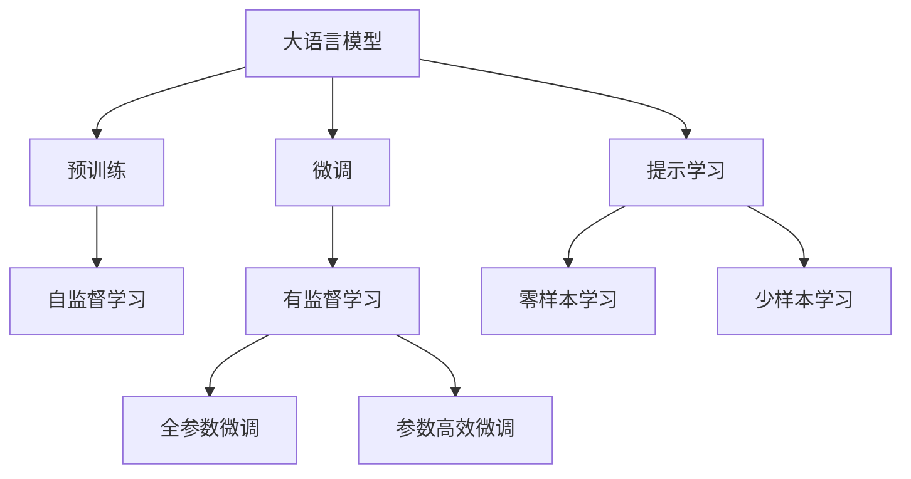
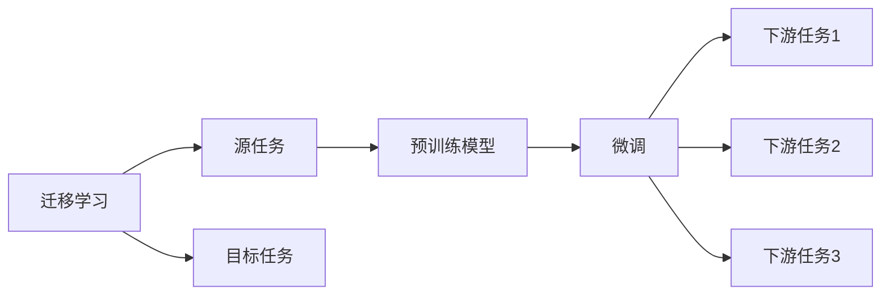
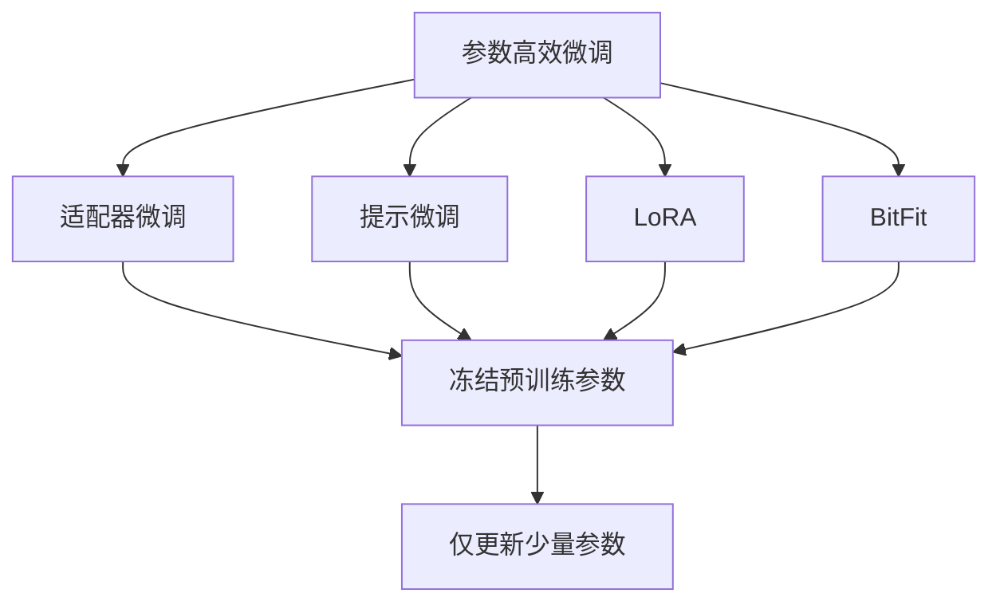
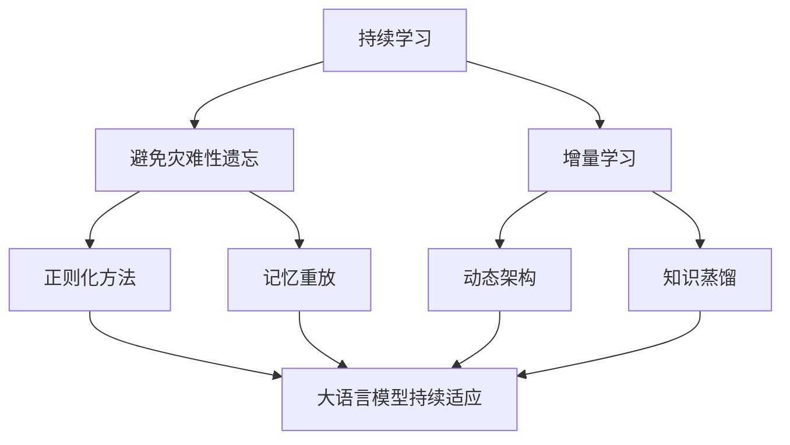

                 

## 1. 背景介绍

### 1.1 问题由来
个性化医疗是大数据和人工智能技术在医疗领域的典型应用之一，旨在通过精准的个体化治疗方案，提升医疗效果，降低医疗成本。传统的医疗方式往往采用"一刀切"的治疗方案，难以兼顾个体差异，容易产生副作用和耐药性问题。因此，针对个体患者的精准医疗需求日益增加，迫切需要新的技术和方法。

### 1.2 问题核心关键点
个性化医疗的核心是精准的个体化治疗方案设计。传统医疗方案的设计往往依赖于大量经验积累，难以快速适应新的医疗需求。而基于大语言模型(Large Language Model, LLM)的个性化医疗，可以通过对海量病历和医学文献的分析，快速生成符合个体特征的治疗方案。

### 1.3 问题研究意义
大语言模型在个性化医疗中的应用，对于提升医疗效果、降低医疗成本、改善医疗体验具有重要意义：

1. 提升医疗效果：基于大语言模型的个性化医疗可以精确分析个体健康数据，制定最适合患者的治疗方案，提升治愈率。
2. 降低医疗成本：个性化医疗减少了因"一刀切"治疗带来的重复检查和无效药物使用，降低了医疗资源浪费。
3. 改善医疗体验：患者能够获得更加个性化、针对性的医疗服务，提升医疗满意度和信任度。
4. 推动医疗创新：大语言模型可以为医生提供新的决策支持工具，加速新药物、新疗法的研究和应用。

## 2. 核心概念与联系

### 2.1 核心概念概述

为更好地理解基于LLM的个性化医疗方法，本节将介绍几个密切相关的核心概念：

- 大语言模型(Large Language Model, LLM)：以自回归(如GPT)或自编码(如BERT)模型为代表的大规模预训练语言模型。通过在大规模无标签文本语料上进行预训练，学习通用的语言表示，具备强大的语言理解和生成能力。

- 预训练(Pre-training)：指在大规模无标签文本语料上，通过自监督学习任务训练通用语言模型的过程。常见的预训练任务包括言语建模、遮挡语言模型等。预训练使得模型学习到语言的通用表示。

- 微调(Fine-tuning)：指在预训练模型的基础上，使用下游任务的少量标注数据，通过有监督学习优化模型在特定任务上的性能。通常只需要调整顶层分类器或解码器，并以较小的学习率更新全部或部分的模型参数。

- 迁移学习(Transfer Learning)：指将一个领域学习到的知识，迁移应用到另一个不同但相关的领域的学习范式。大模型的预训练-微调过程即是一种典型的迁移学习方式。

- 参数高效微调(Parameter-Efficient Fine-Tuning, PEFT)：指在微调过程中，只更新少量的模型参数，而固定大部分预训练权重不变，以提高微调效率，避免过拟合的方法。

- 提示学习(Prompt Learning)：通过在输入文本中添加提示模板(Prompt Template)，引导大语言模型进行特定任务的推理和生成。可以在不更新模型参数的情况下，实现零样本或少样本学习。

- 少样本学习(Few-shot Learning)：指在只有少量标注样本的情况下，模型能够快速适应新任务的学习方法。在大语言模型中，通常通过在输入中提供少量示例来实现，无需更新模型参数。

- 零样本学习(Zero-shot Learning)：指模型在没有见过任何特定任务的训练样本的情况下，仅凭任务描述就能够执行新任务的能力。大语言模型通过预训练获得的广泛知识，使其能够理解任务指令并生成相应输出。

- 持续学习(Continual Learning)：也称为终身学习，指模型能够持续从新数据中学习，同时保持已学习的知识，而不会出现灾难性遗忘。这对于保持大语言模型的时效性和适应性至关重要。

这些核心概念之间的逻辑关系可以通过以下Mermaid流程图来展示：



这个流程图展示了大语言模型的核心概念及其之间的关系：

1. 大语言模型通过预训练获得基础能力。
2. 微调是对预训练模型进行任务特定的优化，可以分为全参数微调和参数高效微调（PEFT）。
3. 提示学习是一种不更新模型参数的方法，可以实现少样本学习和零样本学习。
4. 迁移学习是连接预训练模型与下游任务的桥梁，可以通过微调或提示学习来实现。
5. 持续学习旨在使模型能够不断学习新知识，同时避免遗忘旧知识。

这些概念共同构成了大语言模型的学习和应用框架，使其能够在各种场景下发挥强大的语言理解和生成能力。通过理解这些核心概念，我们可以更好地把握大语言模型的工作原理和优化方向。

### 2.2 概念间的关系

这些核心概念之间存在着紧密的联系，形成了大语言模型微调过程的完整生态系统。下面我通过几个Mermaid流程图来展示这些概念之间的关系。

#### 2.2.1 大语言模型的学习范式



这个流程图展示了大语言模型的三种主要学习范式：预训练、微调和提示学习。预训练主要采用自监督学习方法，而微调则是有监督学习的过程。提示学习可以实现零样本和少样本学习。微调又可以分为全参数微调和参数高效微调两种方式。

#### 2.2.2 迁移学习与微调的关系



这个流程图展示了迁移学习的基本原理，以及它与微调的关系。迁移学习涉及源任务和目标任务，预训练模型在源任务上学习，然后通过微调适应各种下游任务（目标任务）。

#### 2.2.3 参数高效微调方法



这个流程图展示了几种常见的参数高效微调方法，包括适配器微调、提示微调、LoRA和BitFit。这些方法的共同特点是冻结大部分预训练参数，只更新少量参数，从而提高微调效率。

#### 2.2.4 持续学习在大语言模型中的应用



这个流程图展示了持续学习在大语言模型中的应用。持续学习的主要目标是避免灾难性遗忘和实现增量学习。通过正则化方法、记忆重放、动态架构和知识蒸馏等技术，可以使大语言模型持续适应新的任务和数据。

## 3. 核心算法原理 & 具体操作步骤

### 3.1 算法原理概述

基于LLM的个性化医疗，本质上是一个有监督的细粒度迁移学习过程。其核心思想是：将预训练的大语言模型视作一个强大的"特征提取器"，通过在个体患者的病历数据上进行有监督的微调，使得模型输出能够匹配患者的特征，从而生成最适合个体的治疗方案。

形式化地，假设预训练模型为 $M_{\theta}$，其中 $\theta$ 为预训练得到的模型参数。给定患者的病历数据集 $D=\{(x_i, y_i)\}_{i=1}^N$，其中 $x_i$ 为病历文本，$y_i$ 为患者治疗方案的描述。微调的目标是找到新的模型参数 $\hat{\theta}$，使得：

$$
\hat{\theta}=\mathop{\arg\min}_{\theta} \mathcal{L}(M_{\theta},D)
$$

其中 $\mathcal{L}$ 为针对患者治疗方案设计的损失函数，用于衡量模型预测输出与真实标签之间的差异。常见的损失函数包括交叉熵损失、均方误差损失等。

通过梯度下降等优化算法，微调过程不断更新模型参数 $\theta$，最小化损失函数 $\mathcal{L}$，使得模型输出逼近真实标签。由于 $\theta$ 已经通过预训练获得了较好的初始化，因此即便在个体患者病历数据集 $D$ 上进行微调，也能较快收敛到理想的模型参数 $\hat{\theta}$。

### 3.2 算法步骤详解

基于LLM的个性化医疗一般包括以下几个关键步骤：

**Step 1: 准备预训练模型和数据集**
- 选择合适的预训练语言模型 $M_{\theta}$ 作为初始化参数，如 BERT、GPT 等。
- 准备患者病历数据集 $D$，划分为训练集、验证集和测试集。一般要求病历与预训练数据的分布不要差异过大。

**Step 2: 添加任务适配层**
- 根据任务类型，在预训练模型顶层设计合适的输出层和损失函数。
- 对于分类任务，通常在顶层添加线性分类器和交叉熵损失函数。
- 对于生成任务，通常使用语言模型的解码器输出概率分布，并以负对数似然为损失函数。

**Step 3: 设置微调超参数**
- 选择合适的优化算法及其参数，如 AdamW、SGD 等，设置学习率、批大小、迭代轮数等。
- 设置正则化技术及强度，包括权重衰减、Dropout、Early Stopping等。
- 确定冻结预训练参数的策略，如仅微调顶层，或全部参数都参与微调。

**Step 4: 执行梯度训练**
- 将训练集数据分批次输入模型，前向传播计算损失函数。
- 反向传播计算参数梯度，根据设定的优化算法和学习率更新模型参数。
- 周期性在验证集上评估模型性能，根据性能指标决定是否触发 Early Stopping。
- 重复上述步骤直到满足预设的迭代轮数或 Early Stopping 条件。

**Step 5: 测试和部署**
- 在测试集上评估微调后模型 $M_{\hat{\theta}}$ 的性能，对比微调前后的精度提升。
- 使用微调后的模型对新样本进行推理预测，集成到实际的应用系统中。
- 持续收集新的数据，定期重新微调模型，以适应数据分布的变化。

以上是基于监督学习微调大语言模型的一般流程。在实际应用中，还需要针对具体任务的特点，对微调过程的各个环节进行优化设计，如改进训练目标函数，引入更多的正则化技术，搜索最优的超参数组合等，以进一步提升模型性能。

### 3.3 算法优缺点

基于LLM的个性化医疗具有以下优点：

1. 适应性强：LLM通过预训练学到了通用的语言表示，能够适应不同个体的特征和需求，生成个性化的治疗方案。
2. 高效性：微调所需的标注数据量较小，计算资源需求较低，能够快速生成治疗方案。
3. 可解释性强：LLM能够输出详细的治疗方案和推理过程，方便医生理解和验证。
4. 鲁棒性：LLM能够从大规模语料中学习到丰富的语言知识，具备较强的泛化能力，能够处理多种复杂的临床问题。

同时，该方法也存在一定的局限性：

1. 依赖标注数据：微调的效果很大程度上取决于标注数据的质量和数量，标注数据获取难度较大。
2. 模型解释性：LLM的输出可能较为模糊，需要人工解释才能真正应用于临床决策。
3. 数据隐私：患者病历数据涉及隐私信息，必须确保数据安全和使用合规。
4. 性能依赖：微调的性能提升依赖于数据集的质量和数量，数据不均衡可能导致过拟合或欠拟合。

尽管存在这些局限性，但就目前而言，基于LLM的个性化医疗方法仍然是医疗领域的一个前沿技术，具有重要的应用价值。未来相关研究的重点在于如何进一步降低微调对标注数据的依赖，提高模型的可解释性和隐私保护，以及探索新的优化方法，以提高模型的泛化性能和适用性。

### 3.4 算法应用领域

基于LLM的个性化医疗方法已经在多个医疗场景中得到应用，涵盖从疾病诊断到治疗方案制定的多个环节。例如：

- 疾病诊断：通过分析病历文本，LLM能够辅助医生识别疾病类型和病变位置。
- 治疗方案生成：根据患者的病历和临床数据，LLM能够生成个性化的治疗方案，如药物剂量、疗程安排等。
- 临床决策支持：LLM能够提供疾病相关文献、最新研究成果和临床指南，辅助医生制定治疗决策。
- 药物研发：LLM能够从海量文献中筛选出与特定疾病相关的药物信息，加速新药研发进程。
- 患者教育：LLM能够生成通俗易懂的健康教育材料，提升患者的自我管理和治疗依从性。

除了上述这些经典应用外，LLM还可以用于病情预测、药物反应预测、医疗影像分析等更多场景，为医疗系统带来新的变革。随着LLM技术的不断进步，相信在个性化医疗领域，LLM将发挥越来越重要的作用。

## 4. 数学模型和公式 & 详细讲解 & 举例说明

### 4.1 数学模型构建

本节将使用数学语言对基于LLM的个性化医疗过程进行更加严格的刻画。

记预训练语言模型为 $M_{\theta}$，其中 $\theta$ 为预训练得到的模型参数。假设患者的病历数据集为 $D=\{(x_i, y_i)\}_{i=1}^N$，其中 $x_i$ 为病历文本，$y_i$ 为患者治疗方案的描述。微调的目标是找到新的模型参数 $\hat{\theta}$，使得：

$$
\hat{\theta}=\mathop{\arg\min}_{\theta} \mathcal{L}(M_{\theta},D)
$$

其中 $\mathcal{L}$ 为针对患者治疗方案设计的损失函数，用于衡量模型预测输出与真实标签之间的差异。常见的损失函数包括交叉熵损失、均方误差损失等。

在实践中，我们通常使用基于梯度的优化算法（如SGD、Adam等）来近似求解上述最优化问题。设 $\eta$ 为学习率，$\lambda$ 为正则化系数，则参数的更新公式为：

$$
\theta \leftarrow \theta - \eta \nabla_{\theta}\mathcal{L}(\theta) - \eta\lambda\theta
$$

其中 $\nabla_{\theta}\mathcal{L}(\theta)$ 为损失函数对参数 $\theta$ 的梯度，可通过反向传播算法高效计算。

### 4.2 公式推导过程

以下我们以二分类任务为例，推导交叉熵损失函数及其梯度的计算公式。

假设模型 $M_{\theta}$ 在输入 $x$ 上的输出为 $\hat{y}=M_{\theta}(x) \in [0,1]$，表示患者接受某种治疗方案的概率。真实标签 $y \in \{0,1\}$。则二分类交叉熵损失函数定义为：

$$
\ell(M_{\theta}(x),y) = -[y\log \hat{y} + (1-y)\log (1-\hat{y})]
$$

将其代入经验风险公式，得：

$$
\mathcal{L}(\theta) = -\frac{1}{N}\sum_{i=1}^N [y_i\log M_{\theta}(x_i)+(1-y_i)\log(1-M_{\theta}(x_i))]
$$

根据链式法则，损失函数对参数 $\theta_k$ 的梯度为：

$$
\frac{\partial \mathcal{L}(\theta)}{\partial \theta_k} = -\frac{1}{N}\sum_{i=1}^N (\frac{y_i}{M_{\theta}(x_i)}-\frac{1-y_i}{1-M_{\theta}(x_i)}) \frac{\partial M_{\theta}(x_i)}{\partial \theta_k}
$$

其中 $\frac{\partial M_{\theta}(x_i)}{\partial \theta_k}$ 可进一步递归展开，利用自动微分技术完成计算。

在得到损失函数的梯度后，即可带入参数更新公式，完成模型的迭代优化。重复上述过程直至收敛，最终得到适应个性化医疗任务的最优模型参数 $\theta^*$。

### 4.3 案例分析与讲解

假设我们正在对肺癌患者的病历数据进行微调，希望模型能够预测患者是否适合接受靶向治疗。训练数据集 $D$ 包括10000个患者病历和对应的治疗方案。我们选择了BERT作为预训练模型，并在顶层添加线性分类器和交叉熵损失函数。微调超参数如下：

- 学习率：$1e-5$
- 批大小：16
- 迭代轮数：10
- 正则化系数：$1e-5$

下面是基于LLM的个性化医疗微调示例代码：

```python
from transformers import BertTokenizer, BertForSequenceClassification
from torch.utils.data import DataLoader
from sklearn.metrics import accuracy_score

# 初始化数据集
tokenizer = BertTokenizer.from_pretrained('bert-base-cased')
train_dataset = ...

# 初始化模型和优化器
model = BertForSequenceClassification.from_pretrained('bert-base-cased', num_labels=2)
optimizer = AdamW(model.parameters(), lr=1e-5)

# 设置训练参数
train_batch_size = 16
num_epochs = 10
device = 'cuda' if torch.cuda.is_available() else 'cpu'
model.to(device)

# 定义训练和评估函数
def train_model(model, train_dataset, val_dataset, optimizer):
    # 训练
    ...
    # 验证
    ...

# 训练模型
train_model(model, train_dataset, val_dataset, optimizer)

# 评估模型
test_dataset = ...
predictions = model.predict(test_dataset)
accuracy = accuracy_score(test_dataset.labels, predictions)
print(f"Accuracy: {accuracy:.2f}")
```

在代码中，我们首先使用BertTokenizer对病历文本进行分词和编码，然后定义模型和优化器，设置训练参数。接着定义训练和评估函数，在训练过程中使用交叉熵损失函数进行优化，并在验证集上评估模型性能。最后，在测试集上评估模型的最终性能，并输出准确率。

## 5. 项目实践：代码实例和详细解释说明

### 5.1 开发环境搭建

在进行个性化医疗微调实践前，我们需要准备好开发环境。以下是使用Python进行PyTorch开发的环境配置流程：

1. 安装Anaconda：从官网下载并安装Anaconda，用于创建独立的Python环境。

2. 创建并激活虚拟环境：
```bash
conda create -n pytorch-env python=3.8 
conda activate pytorch-env
```

3. 安装PyTorch：根据CUDA版本，从官网获取对应的安装命令。例如：
```bash
conda install pytorch torchvision torchaudio cudatoolkit=11.1 -c pytorch -c conda-forge
```

4. 安装Transformers库：
```bash
pip install transformers
```

5. 安装各类工具包：
```bash
pip install numpy pandas scikit-learn matplotlib tqdm jupyter notebook ipython
```

完成上述步骤后，即可在`pytorch-env`环境中开始微调实践。

### 5.2 源代码详细实现

下面我们以肺癌治疗方案生成为例，给出使用Transformers库对BERT模型进行微调的PyTorch代码实现。

首先，定义病历数据处理函数：

```python
from transformers import BertTokenizer
from torch.utils.data import Dataset
import torch

class MedicalDataDataset(Dataset):
    def __init__(self, texts, labels, tokenizer, max_len=128):
        self.texts = texts
        self.labels = labels
        self.tokenizer = tokenizer
        self.max_len = max_len
        
    def __len__(self):
        return len(self.texts)
    
    def __getitem__(self, item):
        text = self.texts[item]
        label = self.labels[item]
        
        encoding = self.tokenizer(text, return_tensors='pt', max_length=self.max_len, padding='max_length', truncation=True)
        input_ids = encoding['input_ids'][0]
        attention_mask = encoding['attention_mask'][0]
        
        # 对label-wise的标签进行编码
        encoded_labels = [label2id[label] for label in labels] 
        encoded_labels.extend([label2id['O']] * (self.max_len - len(encoded_labels)))
        labels = torch.tensor(encoded_labels, dtype=torch.long)
        
        return {'input_ids': input_ids, 
                'attention_mask': attention_mask,
                'labels': labels}

# 标签与id的映射
label2id = {'O': 0, '靶向治疗': 1, '非靶向治疗': 2}
id2label = {v: k for k, v in label2id.items()}

# 创建dataset
tokenizer = BertTokenizer.from_pretrained('bert-base-cased')

train_dataset = MedicalDataDataset(train_texts, train_labels, tokenizer)
dev_dataset = MedicalDataDataset(dev_texts, dev_labels, tokenizer)
test_dataset = MedicalDataDataset(test_texts, test_labels, tokenizer)
```

然后，定义模型和优化器：

```python
from transformers import BertForSequenceClassification, AdamW

model = BertForSequenceClassification.from_pretrained('bert-base-cased', num_labels=len(label2id))

optimizer = AdamW(model.parameters(), lr=2e-5)
```

接着，定义训练和评估函数：

```python
from torch.utils.data import DataLoader
from tqdm import tqdm
from sklearn.metrics import accuracy_score

device = torch.device('cuda') if torch.cuda.is_available() else torch.device('cpu')
model.to(device)

def train_model(model, dataset, batch_size, optimizer):
    dataloader = DataLoader(dataset, batch_size=batch_size, shuffle=True)
    model.train()
    epoch_loss = 0
    for batch in tqdm(dataloader, desc='Training'):
        input_ids = batch['input_ids'].to(device)
        attention_mask = batch['attention_mask'].to(device)
        labels = batch['labels'].to(device)
        model.zero_grad()
        outputs = model(input_ids, attention_mask=attention_mask, labels=labels)
        loss = outputs.loss
        epoch_loss += loss.item()
        loss.backward()
        optimizer.step()
    return epoch_loss / len(dataloader)

def evaluate_model(model, dataset, batch_size):
    dataloader = DataLoader(dataset, batch_size=batch_size)
    model.eval()
    preds, labels = [], []
    with torch.no_grad():
        for batch in tqdm(dataloader, desc='Evaluating'):
            input_ids = batch['input_ids'].to(device)
            attention_mask = batch['attention_mask'].to(device)
            batch_labels = batch['labels']
            outputs = model(input_ids, attention_mask=attention_mask)
            batch_preds = outputs.logits.argmax(dim=2).to('cpu').tolist()
            batch_labels = batch_labels.to('cpu').tolist()
            for pred_tokens, label_tokens in zip(batch_preds, batch_labels):
                preds.append(pred_tokens[:len(label_tokens)])
                labels.append(label_tokens)
                
    print(accuracy_score(labels, preds))
```

最后，启动训练流程并在测试集上评估：

```python
epochs = 5
batch_size = 16

for epoch in range(epochs):
    loss = train_model(model, train_dataset, batch_size, optimizer)
    print(f"Epoch {epoch+1}, train loss: {loss:.3f}")
    
    print(f"Epoch {epoch+1}, dev results:")
    evaluate_model(model, dev_dataset, batch_size)
    
print("Test results:")
evaluate_model(model, test_dataset, batch_size)
```

以上就是使用PyTorch对BERT进行肺癌治疗方案生成的完整代码实现。可以看到，得益于Transformers库的强大封装，我们可以用相对简洁的代码完成BERT模型的加载和微调。

### 5.3 代码解读与分析

让我们再详细解读一下关键代码的实现细节：

**MedicalDataDataset类**：
- `__init__`方法：初始化文本、标签、分词器等关键组件。
- `__len__`方法：返回数据集的样本数量。
- `__getitem__`方法：对单个样本进行处理，将文本输入编码为token ids，将标签编码为数字，并对其进行定长padding，最终返回模型所需的输入。

**label2id和id2label字典**：
- 定义了标签与数字id之间的映射关系，用于将label-wise的预测结果解码回真实的标签。

**训练和评估函数**：
- 使用PyTorch的DataLoader对数据集进行批次化加载，供模型训练和推理使用。
- 训练函数`train_model`：对数据以批为单位进行迭代，在每个批次上前向传播计算loss并反向

