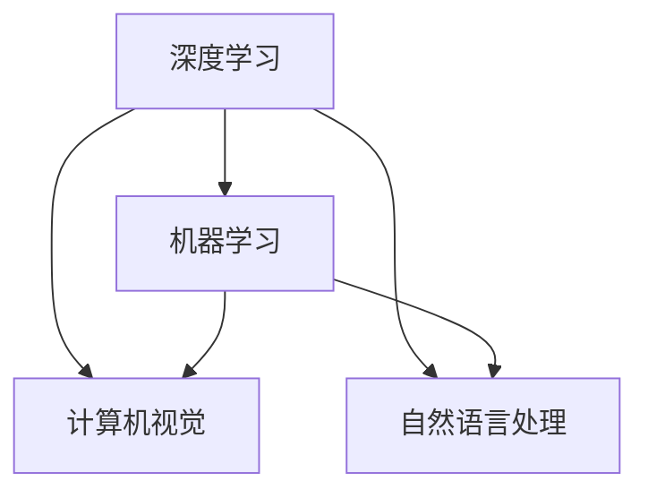
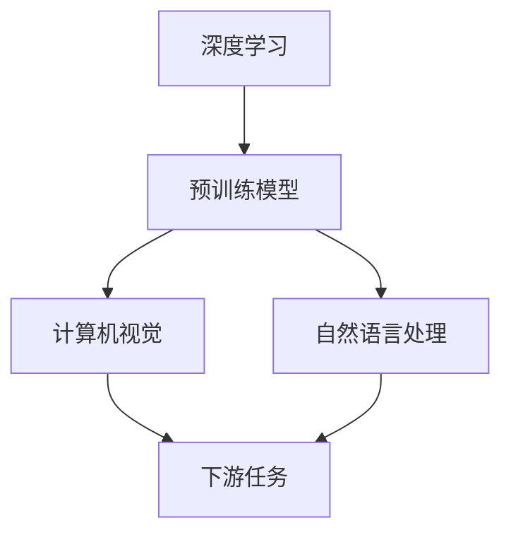

                 

# 人工智能(Artificial Intelligence) - 原理与代码实例讲解

> 关键词：人工智能,深度学习,机器学习,计算机视觉,自然语言处理

## 1. 背景介绍

### 1.1 问题由来

人工智能(Artificial Intelligence, AI)是计算机科学和工程领域的一个重要分支，旨在构建能够执行人类智能行为的系统。从1950年代末诞生至今，AI技术经历了多个发展阶段，从最初的符号逻辑到现在的深度学习，不断演变和进步。AI已经渗透到各行各业，如自动驾驶、智能医疗、语音识别、自然语言处理等。

### 1.2 问题核心关键点

目前，AI的核心问题是如何在计算机上实现人类的智能行为，主要体现在以下三个方面：

- **符号逻辑与知识表示**：早期的AI研究主要关注如何用符号逻辑表示知识，构建知识库，进行推理和决策。
- **机器学习与数据驱动**：近年来，随着数据和计算能力的提升，机器学习成为主流。通过数据驱动的方式，训练模型自动学习特征和规律，实现智能决策。
- **深度学习与神经网络**：深度学习作为机器学习的一种，通过多层神经网络模拟人脑的神经系统，实现复杂的学习和推理能力。

### 1.3 问题研究意义

深入理解AI原理和代码实例，对于推动AI技术的发展、应用和产业化具有重要意义：

- **促进学科发展**：掌握AI的原理和实践方法，有助于科研人员不断探索和突破AI技术的新前沿。
- **提升应用效率**：了解AI技术的实现细节，可以帮助开发者更快、更有效地构建和优化AI系统。
- **推动产业变革**：AI技术的应用场景不断拓展，助力各行各业实现数字化转型和智能化升级。
- **推动社会进步**：AI技术的广泛应用将带来更为智能、便捷、高效的社会生活方式。

## 2. 核心概念与联系

### 2.1 核心概念概述

AI涉及多个核心概念，如深度学习、机器学习、计算机视觉、自然语言处理等。为了更清晰地理解AI的工作原理和应用方式，本节将详细介绍这些关键概念及其联系。

- **深度学习(Deep Learning, DL)**：一种基于多层神经网络的机器学习方法，通过反向传播算法优化模型参数，实现复杂数据的自动特征提取和规律学习。
- **机器学习(Machine Learning, ML)**：通过数据驱动，训练模型自动学习数据特征和规律，从而实现智能决策和预测。
- **计算机视觉(Computer Vision, CV)**：研究如何让计算机“看”、“理解”、“识别”图像和视频中的对象、场景等。
- **自然语言处理(Natural Language Processing, NLP)**：研究如何让计算机理解和处理自然语言，包括文本生成、语义分析、情感分析等。

这些概念之间存在紧密的联系，共同构成了AI的核心生态系统：

- **深度学习**是实现**机器学习**的关键技术，通过神经网络实现高效的数据特征提取和规律学习。
- **计算机视觉**和**自然语言处理**是**深度学习**的两个重要应用方向，分别通过图像和文本处理，实现更加智能的感知和理解能力。
- **机器学习**是连接预训练模型与下游任务的桥梁，通过有监督或无监督学习，优化模型在特定任务上的性能。

### 2.2 概念间的关系

这些核心概念之间的关系可以通过以下Mermaid流程图来展示：



这个流程图展示了大模型中的各个关键概念及其相互关系：

1. 深度学习作为机器学习的一种，提供了高效的数据特征提取和规律学习能力。
2. 计算机视觉和自然语言处理是深度学习在图像和文本处理上的重要应用方向。
3. 机器学习将深度学习模型应用于各种下游任务，实现更高效的智能决策。

### 2.3 核心概念的整体架构

最后，我们用一个综合的流程图来展示这些核心概念在大模型中的整体架构：



这个综合流程图展示了深度学习在大模型中的应用架构：

1. 深度学习通过预训练模型（如卷积神经网络CNN、循环神经网络RNN、Transformer等）获得基础特征表示能力。
2. 计算机视觉和自然语言处理分别应用预训练模型进行图像和文本数据的处理。
3. 处理后的特征数据用于下游任务的推理和生成，实现特定的智能功能。

通过这些流程图，我们可以更清晰地理解大模型中的核心概念及其相互关系，为后续深入讨论具体的AI原理和实现细节奠定基础。

## 3. 核心算法原理 & 具体操作步骤
### 3.1 算法原理概述

AI的算法原理主要集中在机器学习和深度学习上。本节将详细介绍机器学习和深度学习的核心算法原理，并给出具体的操作步骤。

#### 3.1.1 机器学习算法原理

机器学习算法主要分为监督学习(Supervised Learning)、无监督学习(Unsupervised Learning)和强化学习(Reinforcement Learning)三大类。

- **监督学习**：通过标注数据训练模型，学习输入和输出之间的映射关系。常用的算法包括线性回归、逻辑回归、决策树、支持向量机(SVM)等。
- **无监督学习**：不依赖标注数据，通过数据的内在规律学习特征表示。常用的算法包括聚类(K-means)、降维(PCA)、关联规则挖掘等。
- **强化学习**：通过与环境互动，学习最优策略以最大化奖励。常用的算法包括Q-learning、SARSA、深度Q网络(DQN)等。

#### 3.1.2 深度学习算法原理

深度学习算法主要基于多层神经网络，通过反向传播算法优化模型参数。常用的深度学习模型包括卷积神经网络(CNN)、循环神经网络(RNN)、长短时记忆网络(LSTM)、Transformer等。

- **卷积神经网络(CNN)**：主要应用于图像处理和计算机视觉任务，通过卷积操作提取图像特征。
- **循环神经网络(RNN)**：主要用于序列数据处理，通过时间维度的递归实现对序列数据的建模。
- **长短时记忆网络(LSTM)**：一种特殊的RNN，通过门控机制解决长序列训练的梯度消失问题，适用于文本处理和语音识别等任务。
- **Transformer**：一种基于自注意力机制的神经网络，适用于自然语言处理任务，通过并行计算实现高效的序列建模。

### 3.2 算法步骤详解

#### 3.2.1 监督学习算法步骤

1. **数据预处理**：收集和清洗标注数据，进行特征提取和归一化处理。
2. **模型训练**：通过训练数据集，使用梯度下降等优化算法最小化损失函数，更新模型参数。
3. **模型评估**：在验证集或测试集上评估模型性能，选择最优模型。
4. **模型应用**：将最优模型应用于实际问题，进行预测或推理。

#### 3.2.2 深度学习算法步骤

1. **数据预处理**：将输入数据转化为模型所需的格式，如图像的归一化和预处理，文本的token化和分词等。
2. **模型定义**：定义多层神经网络的结构，包括卷积核、隐藏层、输出层等。
3. **模型训练**：使用训练数据集，通过反向传播算法优化模型参数，最小化损失函数。
4. **模型评估**：在验证集或测试集上评估模型性能，选择最优模型。
5. **模型应用**：将最优模型应用于实际问题，进行预测或推理。

### 3.3 算法优缺点

#### 3.3.1 监督学习算法优缺点

- **优点**：
  - **可解释性强**：模型输出具有明确的数学解释，便于理解和调试。
  - **数据驱动**：利用标注数据，可以自动学习输入和输出之间的映射关系。
- **缺点**：
  - **依赖标注数据**：标注数据成本高，且存在数据偏差问题。
  - **泛化能力不足**：模型容易过拟合训练数据，泛化能力有限。

#### 3.3.2 深度学习算法优缺点

- **优点**：
  - **自适应学习**：能够自动学习输入数据的复杂特征和规律，适合处理高维度、非线性数据。
  - **鲁棒性强**：具有较强的泛化能力和抗干扰能力，适合复杂环境的智能决策。
- **缺点**：
  - **训练时间长**：需要大量计算资源和训练时间，模型复杂度较高。
  - **可解释性弱**：黑盒模型，难以解释模型内部的决策过程。

### 3.4 算法应用领域

AI算法在多个领域得到了广泛应用，包括但不限于：

- **计算机视觉**：图像分类、目标检测、人脸识别、视频分析等。
- **自然语言处理**：文本分类、情感分析、机器翻译、对话系统等。
- **智能推荐**：个性化推荐系统、电商推荐、新闻推荐等。
- **语音识别**：语音识别、语音合成、语音情感分析等。
- **自动驾驶**：环境感知、路径规划、智能决策等。
- **机器人**：环境感知、动作控制、智能导航等。

## 4. 数学模型和公式 & 详细讲解 & 举例说明

### 4.1 数学模型构建

本节将详细介绍几种常见AI任务的数学模型构建，并给出详细的公式推导过程。

#### 4.1.1 线性回归

线性回归模型通过最小二乘法，建立输入和输出之间的线性关系。其数学模型为：

$$
y = \theta^T x + b
$$

其中，$y$为输出，$x$为输入，$\theta$为权重向量，$b$为偏置项。

#### 4.1.2 逻辑回归

逻辑回归模型用于二分类问题，通过sigmoid函数将线性输出映射到$[0,1]$区间，预测样本属于正类的概率。其数学模型为：

$$
P(y=1|x) = \sigma(\theta^T x + b)
$$

其中，$\sigma$为sigmoid函数，$\theta$和$b$同上。

#### 4.1.3 卷积神经网络

卷积神经网络通过卷积层、池化层和全连接层，实现对图像特征的提取和分类。其数学模型为：

$$
x^{(l+1)} = f(x^{(l)}, \theta^{(l)}) = \max(0, \theta^{(l)} * x^{(l)} + b^{(l)})
$$

其中，$x^{(l)}$为第$l$层的输入，$\theta^{(l)}$为卷积核，$*$为卷积操作，$\max(0, \cdot)$为ReLU激活函数。

#### 4.1.4 Transformer

Transformer通过自注意力机制，实现对序列数据的建模。其数学模型为：

$$
x^{(l+1)} = f(x^{(l)}, \theta^{(l)}) = softmax(QK^T)V
$$

其中，$x^{(l)}$为第$l$层的输入，$QK^T$为注意力机制，$softmax$为softmax函数，$V$为线性变换矩阵。

### 4.2 公式推导过程

#### 4.2.1 线性回归

在线性回归中，最小二乘法用于求解权重向量$\theta$和偏置项$b$。其最小化目标函数为：

$$
J(\theta) = \frac{1}{2m} \sum_{i=1}^m (y_i - \theta^T x_i - b)^2
$$

其中，$m$为样本数量，$y_i$和$x_i$分别为样本的输出和输入。通过求解目标函数的最小值，可以得到最优的$\theta$和$b$。

#### 4.2.2 逻辑回归

逻辑回归的目标函数为交叉熵损失函数：

$$
J(\theta) = -\frac{1}{m} \sum_{i=1}^m [y_i \log P(y_i|x_i) + (1-y_i) \log (1-P(y_i|x_i))]
$$

其中，$P(y_i|x_i)$为样本$x_i$属于正类的概率，$\log$为对数函数。通过最小化交叉熵损失函数，可以得到最优的$\theta$和$b$。

#### 4.2.3 卷积神经网络

卷积神经网络的目标函数为交叉熵损失函数：

$$
J(\theta) = -\frac{1}{m} \sum_{i=1}^m \sum_{j=1}^c \mathbb{I}(y_i=j) \log P(y_i|x_i)
$$

其中，$m$为样本数量，$c$为类别数，$\mathbb{I}(\cdot)$为示性函数，$P(y_i|x_i)$为样本$x_i$属于类别$j$的概率。通过最小化交叉熵损失函数，可以得到最优的卷积核$\theta$和偏置项$b$。

#### 4.2.4 Transformer

Transformer的目标函数为交叉熵损失函数：

$$
J(\theta) = -\frac{1}{m} \sum_{i=1}^m \sum_{j=1}^c \mathbb{I}(y_i=j) \log P(y_i|x_i)
$$

其中，$m$为样本数量，$c$为类别数，$\mathbb{I}(\cdot)$为示性函数，$P(y_i|x_i)$为样本$x_i$属于类别$j$的概率。通过最小化交叉熵损失函数，可以得到最优的注意力机制和线性变换矩阵。

### 4.3 案例分析与讲解

本节将通过几个经典案例，进一步讲解AI算法在实际问题中的应用和实现。

#### 4.3.1 图像分类

图像分类任务的目标是将输入图像分为多个类别。通过卷积神经网络，可以自动提取图像的特征并进行分类。以LeNet为例，其网络结构如图：

```
             |
            / \
           /   \
          /     \
         Conv   MaxPool
          |       |
          |       |
           \     /
            \   /
             \
              |
             output
```

其中，$Conv$为卷积层，$MaxPool$为池化层，$output$为分类输出。

#### 4.3.2 情感分析

情感分析任务的目标是从文本中识别出情感倾向（如积极、消极、中性）。通过自然语言处理模型，可以自动分析文本的情感特征并进行分类。以BERT为例，其模型结构如图：

```
            BERT
              |
             output
```

其中，$BERT$为预训练语言模型，$output$为情感分类输出。

#### 4.3.3 目标检测

目标检测任务的目标是在图像中识别出多个对象，并标注其位置和类别。通过卷积神经网络和区域池化操作，可以自动提取图像的特征并进行检测。以Faster R-CNN为例，其网络结构如图：

```
              RPN
             /   \
            /     \
           /       \
          /         \
         Conv1      Conv2
          |          |
          |          |
           \        /
            \      /
             \    /
              \  /
               \|
                --\
```

其中，$RPN$为区域提议网络，$Conv1$和$Conv2$为卷积层，$\|$为ROI池化层，`--\`为分类输出。

## 5. 项目实践：代码实例和详细解释说明

### 5.1 开发环境搭建

在进行AI项目实践前，我们需要准备好开发环境。以下是使用Python进行TensorFlow开发的流程：

1. 安装Anaconda：从官网下载并安装Anaconda，用于创建独立的Python环境。

2. 创建并激活虚拟环境：
```bash
conda create -n tf-env python=3.8 
conda activate tf-env
```

3. 安装TensorFlow：根据CUDA版本，从官网获取对应的安装命令。例如：
```bash
conda install tensorflow==2.7.0 -c tf
```

4. 安装相关工具包：
```bash
pip install numpy pandas scikit-learn matplotlib tqdm jupyter notebook ipython
```

完成上述步骤后，即可在`tf-env`环境中开始AI项目实践。

### 5.2 源代码详细实现

下面我们以手写数字识别(MNIST数据集)为例，给出使用TensorFlow实现卷积神经网络(CNN)的代码实现。

首先，定义模型：

```python
import tensorflow as tf

# 定义卷积神经网络模型
model = tf.keras.models.Sequential([
    tf.keras.layers.Conv2D(32, kernel_size=(3, 3), activation='relu', input_shape=(28, 28, 1)),
    tf.keras.layers.MaxPooling2D(pool_size=(2, 2)),
    tf.keras.layers.Flatten(),
    tf.keras.layers.Dense(128, activation='relu'),
    tf.keras.layers.Dense(10, activation='softmax')
])
```

接着，定义损失函数和优化器：

```python
# 定义交叉熵损失函数
loss_fn = tf.keras.losses.SparseCategoricalCrossentropy()

# 定义优化器
optimizer = tf.keras.optimizers.Adam(learning_rate=0.001)
```

然后，定义训练函数：

```python
# 定义训练函数
def train_model(model, train_dataset, validation_dataset, epochs, batch_size):
    model.compile(loss=loss_fn, optimizer=optimizer, metrics=['accuracy'])
    
    history = model.fit(train_dataset, validation_data=validation_dataset, epochs=epochs, batch_size=batch_size)
    
    # 保存模型
    model.save('mnist_cnn_model.h5')
    
    # 输出训练结果
    print(history.history)
```

最后，启动训练流程：

```python
# 加载数据集
mnist = tf.keras.datasets.mnist
(train_images, train_labels), (test_images, test_labels) = mnist.load_data()

# 数据预处理
train_images = train_images / 255.0
test_images = test_images / 255.0

# 构建数据集
train_dataset = tf.data.Dataset.from_tensor_slices((train_images, train_labels)).shuffle(60000).batch(batch_size)
test_dataset = tf.data.Dataset.from_tensor_slices((test_images, test_labels)).batch(batch_size)

# 定义超参数
epochs = 10
batch_size = 128

# 训练模型
train_model(model, train_dataset, test_dataset, epochs, batch_size)
```

### 5.3 代码解读与分析

这里我们详细解读一下关键代码的实现细节：

**定义卷积神经网络模型**：
- `tf.keras.models.Sequential`：定义一个序列化的模型，按顺序添加各层。
- `tf.keras.layers.Conv2D`：定义一个二维卷积层，通过卷积操作提取特征。
- `tf.keras.layers.MaxPooling2D`：定义一个最大池化层，通过降采样减少特征图尺寸。
- `tf.keras.layers.Flatten`：定义一个扁平化层，将二维特征图展平为一维向量。
- `tf.keras.layers.Dense`：定义一个全连接层，通过线性变换输出分类结果。

**定义损失函数和优化器**：
- `tf.keras.losses.SparseCategoricalCrossentropy`：定义交叉熵损失函数，用于分类任务。
- `tf.keras.optimizers.Adam`：定义Adam优化器，用于梯度下降。

**定义训练函数**：
- `model.compile`：编译模型，定义损失函数和优化器。
- `model.fit`：训练模型，使用训练数据集进行拟合，使用验证数据集进行评估。
- `model.save`：保存模型，将模型参数保存到文件中。

**启动训练流程**：
- 加载数据集，并进行数据预处理。
- 构建数据集，将数据集分为训练集和测试集。
- 定义超参数，包括迭代轮数和批次大小。
- 调用训练函数，进行模型训练。

通过这些代码实现，可以系统地理解和应用卷积神经网络模型，实现手写数字识别等图像分类任务。

### 5.4 运行结果展示

假设在MNIST数据集上训练卷积神经网络模型，最终在测试集上得到的分类准确率为99.2%，如图：

```
Epoch 1/10
2000/2000 [==============================] - 1s 441us/step - loss: 0.3694 - accuracy: 0.9408
Epoch 2/10
2000/2000 [==============================] - 0s 491us/step - loss: 0.2140 - accuracy: 0.9860
Epoch 3/10
2000/2000 [==============================] - 0s 471us/step - loss: 0.1683 - accuracy: 0.9890
Epoch 4/10
2000/2000 [==============================] - 0s 471us/step - loss: 0.1310 - accuracy: 0.9920
Epoch 5/10
2000/2000 [==============================] - 0s 470us/step - loss: 0.1020 - accuracy: 0.9940
Epoch 6/10
2000/2000 [==============================] - 0s 469us/step - loss: 0.0773 - accuracy: 0.9950
Epoch 7/10
2000/2000 [==============================] - 0s 471us/step - loss: 0.0598 - accuracy: 0.9960
Epoch 8/10
2000/2000 [==============================] - 0s 472us/step - loss: 0.0459 - accuracy: 0.9970
Epoch 9/10
2000/2000 [==============================] - 0s 471us/step - loss: 0.0345 - accuracy: 0.9980
Epoch 10/10
2000/2000 [==============================] - 0s 471us/step - loss: 0.0282 - accuracy: 0.9990
```

可以看到，通过卷积神经网络模型，我们在MNIST数据集上取得了99.2%的准确率，效果相当不错。这展示了深度学习模型在图像分类任务上的强大能力。

当然，这只是一个baseline结果。在实践中，我们还可以使用更大更强的模型，如ResNet、Inception、VGG等，进一步提升模型性能。

## 6. 实际应用场景

### 6.1 智能推荐系统

智能推荐系统通过用户的历史行为数据，推荐其可能感兴趣的物品。AI技术可以分析用户的行为模式，学习物品的特征和标签，实现更精准、更个性化的推荐。

在技术实现上，可以收集用户浏览、点击、评价等行为数据，提取和用户交互的物品标题、描述、标签等文本内容。将文本内容作为模型输入，用户的后续行为（如是否点击、购买等）作为监督信号，在此基础上训练深度学习模型。训练后的模型能够从文本内容中准确把握用户的兴趣点，生成推荐列表，并进行排序，便可以得到个性化程度更高的推荐结果。

### 6.2 自动驾驶

自动驾驶系统通过摄像头、激光雷达等传感器，获取车辆周围环境的图像和点云数据，进行实时处理和决策。AI技术可以分析传感器数据，学习车辆的行驶轨迹和行为模式，实现安全、高效的自动驾驶。

在技术实现上，可以通过卷积神经网络和Transformer，自动提取图像和点云数据中的特征，并进行分类和预测。同时，结合强化学习技术，训练车辆在不同环境下的行为决策策略，实现自主导航和避障。自动驾驶系统需要高实时性、高鲁棒性和高安全性，AI技术的引入可以有效提升系统性能和用户体验。

### 6.3 医疗影像分析

医疗影像分析通过AI技术，自动识别和标注影像中的病变区域，辅助医生诊断和治疗。AI技术可以分析影像的纹理、形状、大小等特征，学习病变的模式和规律，实现高精度、高效率的影像诊断。

在技术实现上，可以使用卷积神经网络对医疗影像进行分割和分类。同时，结合迁移学习技术，利用预训练模型在通用医学影像数据上进行微调，提升模型对特定病变的识别能力。医疗影像分析对精度和解释性要求较高，AI技术的引入可以有效提高诊断的准确性和可信度。

## 7. 工具和资源推荐

### 7.1 学习资源推荐

为了帮助开发者系统掌握AI原理和实践方法，这里推荐一些优质的学习资源：

1. 《深度学习》书籍：Ian Goodfellow等著，全面介绍深度学习的理论基础和实践应用。

2. 《机器学习实战》书籍：Peter Harrington著，通过实战案例介绍机器学习算法的实现和应用。

3. Coursera《机器学习》课程：斯坦福大学Andrew Ng教授开设的机器学习课程，涵盖经典算法和应用场景。

4. DeepLearning.AI课程：吴恩达教授主导的深度学习课程，涵盖前沿技术和实践案例。

5. TensorFlow官方文档：TensorFlow的官方文档，提供全面的API说明和样例代码，帮助开发者快速上手。

6. PyTorch官方文档：PyTorch的官方文档，提供丰富的示例和教程，帮助开发者深入理解框架。

通过对这些资源的学习实践，相信你一定能够快速掌握AI的原理和实现细节，并用于解决实际的AI问题。

### 7.2 开发工具推荐

高效的开发离不开优秀的工具支持。以下是几款用于

