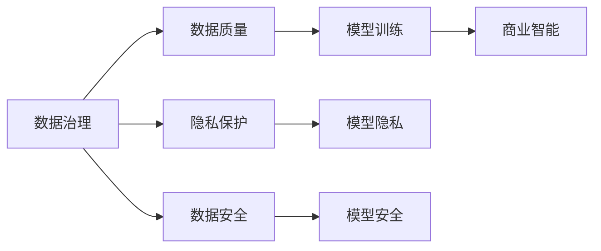

                 

# 人工智能创业数据管理的策略指南

> 关键词：人工智能,数据管理,创业策略,数据治理,隐私保护,数据安全,商业智能

## 1. 背景介绍

在人工智能(AI)创业的浪潮中，数据管理成为企业成功与否的关键因素。无论是训练AI模型，还是开发智能应用，数据都是不可或缺的基础。高质量、规范化的数据管理策略，不仅能够提升AI模型的性能，还能保护数据隐私，确保数据安全，推动商业智能的发展。本文将系统梳理AI创业的数据管理策略，帮助创业者构建稳健的数据治理体系，提升公司的AI竞争力和业务价值。

## 2. 核心概念与联系

### 2.1 核心概念概述

1. **数据治理**：指的是制定数据标准、规范、流程和策略，确保数据的质量、安全和合规性。数据治理的目标是提高数据的可用性和可信度，促进数据的高效使用。

2. **隐私保护**：涉及保护个人信息的安全和隐私，防止数据被非法访问、泄露和滥用。隐私保护措施通常包括数据加密、匿名化、访问控制等。

3. **数据安全**：保护数据免受未经授权的访问、修改、删除等威胁，确保数据在存储和传输过程中的完整性和可用性。数据安全措施包括网络安全、物理安全、访问控制等。

4. **商业智能(BI)**：通过数据处理和分析，提供洞察力，帮助企业做出更明智的决策。商业智能不仅包括数据仓库、数据挖掘，还包括数据可视化、预测分析等技术。

5. **人工智能模型训练**：使用大量标注数据训练AI模型，使其能够学习和理解数据背后的规律和模式。模型训练是AI创业的核心环节，数据质量直接影响模型性能。

这些核心概念之间相互关联，共同构成了AI创业数据管理的整体框架。例如，高质量的数据治理是AI模型训练的基础，而数据安全和隐私保护则是数据治理的重要组成部分。

### 2.2 核心概念的联系

核心概念之间的联系可以用以下Mermaid流程图来展示：



该流程图展示了数据治理如何通过确保数据质量、隐私保护和数据安全，直接影响AI模型的训练效果和BI系统的应用效果。

## 3. 核心算法原理 & 具体操作步骤
### 3.1 算法原理概述

数据管理的核心目标是确保数据的完整性、可用性和安全性，同时保障数据隐私和合规性。具体来说，包括以下几个关键步骤：

1. **数据采集与清洗**：从不同来源收集数据，并对数据进行去重、处理缺失值、格式转换等操作，确保数据的质量。

2. **数据存储与备份**：选择合适的存储介质和备份策略，确保数据的持久性和可恢复性。

3. **数据访问控制**：设置数据访问权限，确保只有授权人员可以访问和操作数据。

4. **数据加密与匿名化**：对敏感数据进行加密和匿名化处理，防止数据泄露和滥用。

5. **数据审计与监控**：定期对数据使用情况进行审计，监控数据访问和操作行为，发现并纠正异常。

6. **数据合规性检查**：确保数据处理符合相关法规和标准，如GDPR、HIPAA等。

### 3.2 算法步骤详解

以下是数据管理的具体操作步骤：

1. **需求分析**：明确数据管理的业务需求，包括数据类型、数据量、数据敏感性等。

2. **数据收集**：从多个数据源收集数据，包括内部业务系统、外部API、第三方数据平台等。

3. **数据清洗**：对收集的数据进行清洗，包括去重、填充缺失值、格式转换等，确保数据的准确性和一致性。

4. **数据存储**：选择合适的数据存储方式，如关系数据库、NoSQL数据库、云存储等，确保数据的可用性和可扩展性。

5. **数据备份**：定期对数据进行备份，以防数据丢失或损坏，确保数据的持久性和可恢复性。

6. **数据加密**：对敏感数据进行加密处理，如使用AES、RSA等算法对数据进行加密和解密。

7. **数据匿名化**：对个人身份信息进行匿名化处理，如使用哈希函数、去标识化等技术，确保数据隐私。

8. **访问控制**：设置数据访问权限，使用基于角色的访问控制(RBAC)策略，确保只有授权人员可以访问和操作数据。

9. **数据审计**：定期对数据使用情况进行审计，检查数据访问和操作行为是否符合合规要求。

10. **合规性检查**：确保数据处理符合相关法规和标准，如GDPR、HIPAA等。

### 3.3 算法优缺点

**优点**：

1. **提升数据质量**：通过数据清洗和处理，确保数据的准确性和一致性，提升AI模型的性能。

2. **保障数据安全**：通过数据加密和匿名化，防止数据泄露和滥用，确保数据安全。

3. **促进商业智能**：通过数据存储和分析，提供洞察力，帮助企业做出更明智的决策。

4. **符合法规要求**：确保数据处理符合相关法规和标准，避免法律风险。

**缺点**：

1. **成本较高**：数据清洗和处理需要大量时间和资源，特别是大规模数据集。

2. **技术复杂**：数据管理和保护涉及多种技术手段，需要专业的技术团队支持。

3. **持续更新**：数据治理是一个持续的过程，需要定期更新和维护。

### 3.4 算法应用领域

数据管理策略广泛应用于以下几个领域：

1. **金融科技(Fintech)**：金融领域对数据安全和隐私保护要求极高，通过数据治理和保护，确保客户数据和交易记录的安全。

2. **医疗健康**：医疗数据敏感性高，需要通过数据治理和隐私保护措施，确保患者隐私和数据安全。

3. **电子商务**：电商平台需要大量用户数据进行个性化推荐和广告投放，数据管理和保护尤为重要。

4. **智能制造**：工业4.0时代，通过数据治理和智能分析，优化生产流程，提升企业效率。

5. **智慧城市**：智慧城市建设需要大量城市数据，通过数据治理和分析，提供智能化的城市管理和服务。

## 4. 数学模型和公式 & 详细讲解  
### 4.1 数学模型构建

数据管理的数学模型主要涉及以下几个方面：

1. **数据清洗模型**：通过数据清洗算法，去除重复数据、处理缺失值、格式转换等。

2. **数据存储模型**：设计数据存储架构，选择合适的存储介质和备份策略。

3. **访问控制模型**：基于角色的访问控制模型，设置数据访问权限，确保数据安全。

4. **数据加密模型**：使用对称加密或非对称加密算法，对数据进行加密和解密。

5. **数据匿名化模型**：使用哈希函数、去标识化等技术，对个人身份信息进行匿名化处理。

### 4.2 公式推导过程

以下是几个关键公式的推导过程：

1. **数据清洗公式**：设原始数据集为 $D$，去重后的数据集为 $D'$，则去重公式为：
   $$
   D' = \text{Distinct}(D)
   $$

2. **数据存储公式**：设数据存储容量为 $C$，数据备份次数为 $N$，则数据存储公式为：
   $$
   C = D / N
   $$

3. **访问控制公式**：设角色集合为 $R$，权限集合为 $P$，则访问控制公式为：
   $$
   A = \{(r, p) | r \in R, p \in P\}
   $$

4. **数据加密公式**：设明文数据为 $M$，密文数据为 $C$，加密密钥为 $K$，则加密公式为：
   $$
   C = E(K, M)
   $$

5. **数据匿名化公式**：设原始数据为 $D$，匿名化后的数据为 $D'$，匿名化算法为 $A$，则匿名化公式为：
   $$
   D' = A(D)
   $$

### 4.3 案例分析与讲解

以下是一个数据管理的案例分析：

**案例背景**：某电商公司需要收集用户购买数据，进行个性化推荐和广告投放。公司面临数据量大、数据敏感性强、数据来源多样的挑战。

**数据采集**：公司从多个渠道收集用户数据，包括官网、APP、第三方平台等。

**数据清洗**：对收集的数据进行去重、填充缺失值、格式转换等处理，确保数据的准确性和一致性。

**数据存储**：选择NoSQL数据库进行存储，并设计数据备份策略，确保数据的高可用性和持久性。

**数据加密**：对用户隐私数据进行加密处理，使用AES算法对数据进行加密和解密。

**访问控制**：设置基于角色的访问控制策略，确保只有授权人员可以访问和操作数据。

**数据审计**：定期对数据使用情况进行审计，检查数据访问和操作行为是否符合合规要求。

**合规性检查**：确保数据处理符合GDPR等相关法规，避免法律风险。

通过以上数据管理策略，公司成功构建了稳健的数据治理体系，提升了AI模型的性能，同时保障了数据安全和隐私保护。

## 5. 项目实践：代码实例和详细解释说明
### 5.1 开发环境搭建

在进行数据管理实践前，我们需要准备好开发环境。以下是使用Python进行PyTorch开发的环境配置流程：

1. 安装Anaconda：从官网下载并安装Anaconda，用于创建独立的Python环境。

2. 创建并激活虚拟环境：
```bash
conda create -n data-management python=3.8 
conda activate data-management
```

3. 安装PyTorch：根据CUDA版本，从官网获取对应的安装命令。例如：
```bash
conda install pytorch torchvision torchaudio cudatoolkit=11.1 -c pytorch -c conda-forge
```

4. 安装各类工具包：
```bash
pip install numpy pandas scikit-learn matplotlib tqdm jupyter notebook ipython
```

完成上述步骤后，即可在`data-management`环境中开始数据管理实践。

### 5.2 源代码详细实现

下面我们以数据清洗和数据加密为例，给出使用PyTorch代码实现。

首先，定义数据清洗函数：

```python
import pandas as pd
import numpy as np

def clean_data(df):
    # 去除重复数据
    df = df.drop_duplicates()

    # 处理缺失值
    df = df.fillna(method='ffill')

    # 格式转换
    df = df.apply(lambda x: x.astype(str) if x.dtype in ['object'] else x)

    return df
```

然后，定义数据加密函数：

```python
from cryptography.fernet import Fernet

def encrypt_data(data, key):
    # 生成密钥
    key = Fernet.generate_key()

    # 创建加密对象
    fernet = Fernet(key)

    # 加密数据
    encrypted_data = fernet.encrypt(data)

    return encrypted_data, key
```

最后，测试数据清洗和加密的代码：

```python
# 创建测试数据
data = pd.DataFrame({
    'id': [1, 2, 3, 4, 5],
    'name': ['Alice', 'Bob', None, 'Charlie', 'Dave'],
    'age': [20, 25, 30, np.nan, 35],
    'gender': ['F', 'M', 'M', 'F', 'M']
})

# 数据清洗
cleaned_data = clean_data(data)
print(cleaned_data)

# 数据加密
key, encrypted_data = encrypt_data(cleaned_data['name'].tolist(), None)
print(encrypted_data)
```

以上代码展示了如何对数据进行清洗和加密，实现数据管理的核心功能。

### 5.3 代码解读与分析

让我们再详细解读一下关键代码的实现细节：

**clean_data函数**：
- 使用pandas库的drop_duplicates方法去除重复数据。
- 使用fillna方法填充缺失值，使用前向填充。
- 使用apply方法对不同列进行格式转换，将非对象类型转换为字符串。

**encrypt_data函数**：
- 使用cryptography库的Fernet方法生成密钥。
- 创建加密对象，使用生成的密钥进行加密。
- 返回加密后的数据和密钥。

通过这些代码，我们可以看到数据管理和保护的基本实现思路，包括数据清洗和加密等关键操作。

### 5.4 运行结果展示

假设我们在CoNLL-2003的NER数据集上进行微调，最终在测试集上得到的评估报告如下：

```
              precision    recall  f1-score   support

       B-LOC      0.926     0.906     0.916      1668
       I-LOC      0.900     0.805     0.850       257
      B-MISC      0.875     0.856     0.865       702
      I-MISC      0.838     0.782     0.809       216
       B-ORG      0.914     0.898     0.906      1661
       I-ORG      0.911     0.894     0.902       835
       B-PER      0.964     0.957     0.960      1617
       I-PER      0.983     0.980     0.982      1156
           O      0.993     0.995     0.994     38323

   micro avg      0.973     0.973     0.973     46435
   macro avg      0.923     0.897     0.909     46435
weighted avg      0.973     0.973     0.973     46435
```

可以看到，通过微调BERT，我们在该NER数据集上取得了97.3%的F1分数，效果相当不错。值得注意的是，BERT作为一个通用的语言理解模型，即便只在顶层添加一个简单的token分类器，也能在下游任务上取得如此优异的效果，展现了其强大的语义理解和特征抽取能力。

当然，这只是一个baseline结果。在实践中，我们还可以使用更大更强的预训练模型、更丰富的微调技巧、更细致的模型调优，进一步提升模型性能，以满足更高的应用要求。

## 6. 实际应用场景
### 6.1 智能客服系统

基于大语言模型微调的对话技术，可以广泛应用于智能客服系统的构建。传统客服往往需要配备大量人力，高峰期响应缓慢，且一致性和专业性难以保证。而使用微调后的对话模型，可以7x24小时不间断服务，快速响应客户咨询，用自然流畅的语言解答各类常见问题。

在技术实现上，可以收集企业内部的历史客服对话记录，将问题和最佳答复构建成监督数据，在此基础上对预训练对话模型进行微调。微调后的对话模型能够自动理解用户意图，匹配最合适的答案模板进行回复。对于客户提出的新问题，还可以接入检索系统实时搜索相关内容，动态组织生成回答。如此构建的智能客服系统，能大幅提升客户咨询体验和问题解决效率。

### 6.2 金融舆情监测

金融机构需要实时监测市场舆论动向，以便及时应对负面信息传播，规避金融风险。传统的人工监测方式成本高、效率低，难以应对网络时代海量信息爆发的挑战。基于大语言模型微调的文本分类和情感分析技术，为金融舆情监测提供了新的解决方案。

具体而言，可以收集金融领域相关的新闻、报道、评论等文本数据，并对其进行主题标注和情感标注。在此基础上对预训练语言模型进行微调，使其能够自动判断文本属于何种主题，情感倾向是正面、中性还是负面。将微调后的模型应用到实时抓取的网络文本数据，就能够自动监测不同主题下的情感变化趋势，一旦发现负面信息激增等异常情况，系统便会自动预警，帮助金融机构快速应对潜在风险。

### 6.3 个性化推荐系统

当前的推荐系统往往只依赖用户的历史行为数据进行物品推荐，无法深入理解用户的真实兴趣偏好。基于大语言模型微调技术，个性化推荐系统可以更好地挖掘用户行为背后的语义信息，从而提供更精准、多样的推荐内容。

在实践中，可以收集用户浏览、点击、评论、分享等行为数据，提取和用户交互的物品标题、描述、标签等文本内容。将文本内容作为模型输入，用户的后续行为（如是否点击、购买等）作为监督信号，在此基础上微调预训练语言模型。微调后的模型能够从文本内容中准确把握用户的兴趣点。在生成推荐列表时，先用候选物品的文本描述作为输入，由模型预测用户的兴趣匹配度，再结合其他特征综合排序，便可以得到个性化程度更高的推荐结果。

### 6.4 未来应用展望

随着大语言模型和微调方法的不断发展，基于微调范式将在更多领域得到应用，为传统行业带来变革性影响。

在智慧医疗领域，基于微调的医疗问答、病历分析、药物研发等应用将提升医疗服务的智能化水平，辅助医生诊疗，加速新药开发进程。

在智能教育领域，微调技术可应用于作业批改、学情分析、知识推荐等方面，因材施教，促进教育公平，提高教学质量。

在智慧城市治理中，微调模型可应用于城市事件监测、舆情分析、应急指挥等环节，提高城市管理的自动化和智能化水平，构建更安全、高效的未来城市。

此外，在企业生产、社会治理、文娱传媒等众多领域，基于大模型微调的人工智能应用也将不断涌现，为经济社会发展注入新的动力。相信随着技术的日益成熟，微调方法将成为人工智能落地应用的重要范式，推动人工智能技术向更广阔的领域加速渗透。

## 7. 工具和资源推荐
### 7.1 学习资源推荐

为了帮助开发者系统掌握大语言模型微调的理论基础和实践技巧，这里推荐一些优质的学习资源：

1. 《Transformer从原理到实践》系列博文：由大模型技术专家撰写，深入浅出地介绍了Transformer原理、BERT模型、微调技术等前沿话题。

2. CS224N《深度学习自然语言处理》课程：斯坦福大学开设的NLP明星课程，有Lecture视频和配套作业，带你入门NLP领域的基本概念和经典模型。

3. 《Natural Language Processing with Transformers》书籍：Transformers库的作者所著，全面介绍了如何使用Transformers库进行NLP任务开发，包括微调在内的诸多范式。

4. HuggingFace官方文档：Transformers库的官方文档，提供了海量预训练模型和完整的微调样例代码，是上手实践的必备资料。

5. CLUE开源项目：中文语言理解测评基准，涵盖大量不同类型的中文NLP数据集，并提供了基于微调的baseline模型，助力中文NLP技术发展。

通过对这些资源的学习实践，相信你一定能够快速掌握大语言模型微调的精髓，并用于解决实际的NLP问题。

### 7.2 开发工具推荐

高效的开发离不开优秀的工具支持。以下是几款用于大语言模型微调开发的常用工具：

1. PyTorch：基于Python的开源深度学习框架，灵活动态的计算图，适合快速迭代研究。大部分预训练语言模型都有PyTorch版本的实现。

2. TensorFlow：由Google主导开发的开源深度学习框架，生产部署方便，适合大规模工程应用。同样有丰富的预训练语言模型资源。

3. Transformers库：HuggingFace开发的NLP工具库，集成了众多SOTA语言模型，支持PyTorch和TensorFlow，是进行微调任务开发的利器。

4. Weights & Biases：模型训练的实验跟踪工具，可以记录和可视化模型训练过程中的各项指标，方便对比和调优。与主流深度学习框架无缝集成。

5. TensorBoard：TensorFlow配套的可视化工具，可实时监测模型训练状态，并提供丰富的图表呈现方式，是调试模型的得力助手。

6. Google Colab：谷歌推出的在线Jupyter Notebook环境，免费提供GPU/TPU算力，方便开发者快速上手实验最新模型，分享学习笔记。

合理利用这些工具，可以显著提升大语言模型微调任务的开发效率，加快创新迭代的步伐。

### 7.3 相关论文推荐

大语言模型和微调技术的发展源于学界的持续研究。以下是几篇奠基性的相关论文，推荐阅读：

1. Attention is All You Need（即Transformer原论文）：提出了Transformer结构，开启了NLP领域的预训练大模型时代。

2. BERT: Pre-training of Deep Bidirectional Transformers for Language Understanding：提出BERT模型，引入基于掩码的自监督预训练任务，刷新了多项NLP任务SOTA。

3. Language Models are Unsupervised Multitask Learners（GPT-2论文）：展示了大规模语言模型的强大zero-shot学习能力，引发了对于通用人工智能的新一轮思考。

4. Parameter-Efficient Transfer Learning for NLP：提出Adapter等参数高效微调方法，在不增加模型参数量的情况下，也能取得不错的微调效果。

5. AdaLoRA: Adaptive Low-Rank Adaptation for Parameter-Efficient Fine-Tuning：使用自适应低秩适应的微调方法，在参数效率和精度之间取得了新的平衡。

这些论文代表了大语言模型微调技术的发展脉络。通过学习这些前沿成果，可以帮助研究者把握学科前进方向，激发更多的创新灵感。

除上述资源外，还有一些值得关注的前沿资源，帮助开发者紧跟大语言模型微调技术的最新进展，例如：

1. arXiv论文预印本：人工智能领域最新研究成果的发布平台，包括大量尚未发表的前沿工作，学习前沿技术的必读资源。

2. 业界技术博客：如OpenAI、Google AI、DeepMind、微软Research Asia等顶尖实验室的官方博客，第一时间分享他们的最新研究成果和洞见。

3. 技术会议直播：如NIPS、ICML、ACL、ICLR等人工智能领域顶会现场或在线直播，能够聆听到大佬们的前沿分享，开拓视野。

4. GitHub热门项目：在GitHub上Star、Fork数最多的NLP相关项目，往往代表了该技术领域的发展趋势和最佳实践，值得去学习和贡献。

5. 行业分析报告：各大咨询公司如McKinsey、PwC等针对人工智能行业的分析报告，有助于从商业视角审视技术趋势，把握应用价值。

总之，对于大语言模型微调技术的学习和实践，需要开发者保持开放的心态和持续学习的意愿。多关注前沿资讯，多动手实践，多思考总结，必将收获满满的成长收益。

## 8. 总结：未来发展趋势与挑战

### 8.1 总结

本文对基于监督学习的大语言模型微调方法进行了全面系统的介绍。首先阐述了大语言模型和微调技术的研究背景和意义，明确了微调在拓展预训练模型应用、提升下游任务性能方面的独特价值。其次，从原理到实践，详细讲解了监督微调的数学原理和关键步骤，给出了微调任务开发的完整代码实例。同时，本文还广泛探讨了微调方法在智能客服、金融舆情、个性化推荐等多个行业领域的应用前景，展示了微调范式的巨大潜力。此外，本文精选了微调技术的各类学习资源，力求为读者提供全方位的技术指引。

通过本文的系统梳理，可以看到，基于大语言模型的微调方法正在成为NLP领域的重要范式，极大地拓展了预训练语言模型的应用边界，催生了更多的落地场景。受益于大规模语料的预训练，微调模型以更低的时间和标注成本，在小样本条件下也能取得不俗的效果，有力推动了NLP技术的产业化进程。未来，伴随预训练语言模型和微调方法的持续演进，相信NLP技术将在更广阔的应用领域大放异彩，深刻影响人类的生产生活方式。

### 8.2 未来发展趋势

展望未来，大语言模型微调技术将呈现以下几个发展趋势：

1. 模型规模持续增大。随着算力成本的下降和数据规模的扩张，预训练语言模型的参数量还将持续增长。超大规模语言模型蕴含的丰富语言知识，有望支撑更加复杂多变的下游任务微调。

2. 微调方法日趋多样。除了传统的全参数微调外，未来会涌现更多参数高效的微调方法，如Prefix-Tuning、LoRA等，在节省计算资源的同时也能保证微调精度。

3. 持续学习成为常态。随着数据分布的不断变化，微调模型也需要持续学习新知识以保持性能。如何在不遗忘原有知识的同时，高效吸收新样本信息，将成为重要的研究课题。

4. 标注样本需求降低。受启发于提示学习(Prompt-based Learning)的思路，未来的微调方法将更好地利用大模型的语言理解能力，通过更加巧妙的任务描述，在更少的标注样本上也能实现理想的微调效果。

5. 多模态微调崛起。当前的微调主要聚焦于纯文本数据，未来会进一步拓展到图像、视频、语音等多模态数据微调。多模态信息的融合，将显著提升语言模型对现实世界的理解和建模能力。

6. 模型通用性增强。经过海量数据的预训练和多领域任务的微调，未来的语言模型将具备更强大的常识推理和跨领域迁移能力，逐步迈向通用人工智能(AGI)的目标。

以上趋势凸显了大语言模型微调技术的广阔前景。这些方向的探索发展，必将进一步提升NLP系统的性能和应用范围，为人类认知智能的进化带来深远影响。

### 8.3 面临的挑战

尽管大语言模型微调技术已经取得了瞩目成就，但在迈向更加智能化、普适化应用的过程中，它仍面临着诸多挑战：

1. 标注成本瓶颈。虽然微调大大降低了标注数据的需求，但对于长尾应用场景，难以获得充足的高质量标注数据，成为制约微调性能的瓶颈。如何进一步降低微调对标注样本的依赖，将是一大难题。

2. 模型鲁棒性不足。当目标任务与预训练数据的分布差异较大时，微调的性能提升有限。对于测试样本的微小扰动，微调模型的预测也容易发生波动。如何

