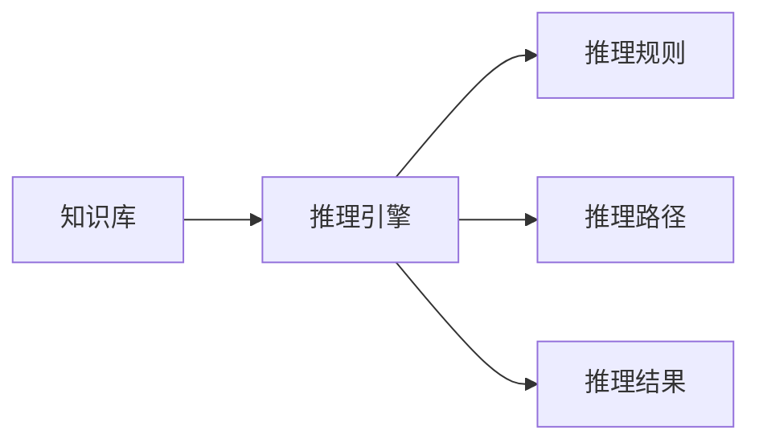

                 

# 人类认知的4种基本模式：知识驱动的推理模式

在计算机科学中，知识驱动的推理模式是一种关键的认知模型，它描述了人类如何利用已有知识来解决问题和做出决策。这种模式基于逻辑推理和事实知识，旨在构建一个能够自动推导结论的智能系统。本文将深入探讨这种模式的基本原理、应用场景以及未来发展方向。

## 1. 背景介绍

### 1.1 知识驱动的推理模式的起源

知识驱动的推理模式可以追溯到早期的逻辑推理理论，例如亚里士多德的逻辑三段论。这种模式的核心思想是通过推理和演绎来获取新知识，从而解决问题。现代计算机科学的发展，尤其是人工智能和专家系统的出现，使得这种模式在计算机上得以实现。

### 1.2 知识驱动的推理模式的现状

如今，知识驱动的推理模式在人工智能领域中得到了广泛应用，特别是在医疗、金融、法律等需要高度精确性和可靠性的领域。这些领域中的专家系统通过利用领域知识库和推理规则，辅助决策者进行复杂问题的解决。

## 2. 核心概念与联系

### 2.1 核心概念概述

- **知识库**：存储领域专家的知识和经验，通常由一组事实和规则组成。
- **推理引擎**：根据知识库中的规则和事实，进行推理和演绎，生成新的结论。
- **推理规则**：定义了知识库中的事实和事实之间的关系，是推理引擎的基础。
- **推理路径**：推理过程中，从前提到结论的路径，通常包括一条或多条推理规则。
- **推理结果**：推理引擎根据推理路径生成的结论，用于指导决策和行动。

### 2.2 核心概念原理和架构

知识驱动的推理模式通常由知识库、推理引擎和推理规则组成。知识库包含了领域专家的知识和经验，推理引擎负责根据规则和知识库进行推理，推理规则定义了知识库中的事实之间的关系。这种模式的架构可以通过以下 Mermaid 流程图来展示：



这个流程图展示了知识驱动的推理模式的基本架构：知识库作为输入，推理引擎根据规则进行推理，最终生成推理结果。

## 3. 核心算法原理 & 具体操作步骤

### 3.1 算法原理概述

知识驱动的推理模式的基本原理是，利用知识库中的事实和规则，通过推理引擎进行演绎和推理，生成新的结论。这种模式的算法流程可以概括为：

1. 获取知识库中的事实和规则。
2. 根据推理规则和事实，构建推理路径。
3. 利用推理引擎进行推理，生成推理结果。

### 3.2 算法步骤详解

**步骤1：获取知识库中的事实和规则**

- **知识库设计**：根据领域专家的知识和经验，设计知识库的结构和内容。知识库通常由一组事实和规则组成。事实是已知的信息，规则定义了事实之间的关系。
- **知识库存储**：将知识库存储在计算机中，通常使用数据库或文件系统。

**步骤2：根据推理规则和事实，构建推理路径**

- **推理规则定义**：定义知识库中的事实之间的关系，形成推理规则。这些规则通常包括“如果...则...”的形式。
- **推理路径构建**：根据推理规则和事实，构建推理路径。推理路径描述了从前提到结论的推理过程，包括一系列的规则和事实。

**步骤3：利用推理引擎进行推理，生成推理结果**

- **推理引擎实现**：实现推理引擎，根据推理路径进行推理，生成推理结果。推理引擎可以是基于规则的推理机或基于知识的推理机。
- **推理结果应用**：将推理结果用于指导决策和行动。推理结果可以是建议、结论或警告，用于辅助决策者做出决策。

### 3.3 算法优缺点

**优点**：
- **精确性**：基于规则和事实的推理过程具有高度的精确性，能够生成准确的结论。
- **可解释性**：推理过程和结论都是基于已知的事实和规则，易于理解和解释。
- **可扩展性**：知识库和规则可以随着领域知识的变化而更新，具有良好的可扩展性。

**缺点**：
- **知识获取难度**：构建知识库和定义规则需要领域专家的知识和经验，获取难度较大。
- **规则复杂性**：规则的设计和维护复杂，需要专业知识。
- **推理效率**：推理过程可能较为复杂，推理效率较低。

### 3.4 算法应用领域

知识驱动的推理模式在多个领域得到了广泛应用，包括但不限于：

- **医疗诊断**：利用医学知识库和推理规则，辅助医生进行诊断和治疗决策。
- **金融风险管理**：利用金融知识库和推理规则，进行风险评估和管理。
- **法律咨询**：利用法律知识库和推理规则，提供法律咨询和案件分析。
- **安全监控**：利用安全知识库和推理规则，进行安全分析和预警。
- **自然语言处理**：利用语言知识库和推理规则，进行语言理解和生成。

## 4. 数学模型和公式 & 详细讲解 & 举例说明

### 4.1 数学模型构建

知识驱动的推理模式可以建模为一个知识库和推理引擎的组合。知识库可以建模为事实和规则的集合，推理引擎可以建模为根据规则和事实进行推理的过程。

**知识库模型**：
- 事实集合：$F = \{f_1, f_2, \dots, f_n\}$
- 规则集合：$R = \{r_1, r_2, \dots, r_m\}$

**推理引擎模型**：
- 推理过程：$P = \{p_1, p_2, \dots, p_k\}$
- 推理结果：$C = \{c_1, c_2, \dots, c_l\}$

其中，$f$ 表示事实，$r$ 表示规则，$p$ 表示推理过程，$c$ 表示推理结果。

### 4.2 公式推导过程

假设知识库中有如下事实和规则：

- 事实 1：如果一个人是医生，则他知道如何诊断疾病。
- 规则 1：如果一个人是医生，则他知道如何使用药物。
- 规则 2：如果一个人是医生，则他知道如何进行手术。

推理引擎可以根据这些规则和事实，进行如下推理：

- 前提 1：张三是一个医生。
- 推理路径：
  - 事实 1 -> 规则 1 -> 推理结果 1：张三知道如何使用药物。
  - 事实 1 -> 规则 2 -> 推理结果 2：张三知道如何进行手术。
- 推理结果 1：张三知道如何使用药物。
- 推理结果 2：张三知道如何进行手术。

### 4.3 案例分析与讲解

**案例分析**：假设一个智能医疗系统，用于辅助医生进行疾病诊断和治疗决策。该系统构建了医学知识库，并定义了多种推理规则。当医生输入一个患者的症状时，系统根据知识库和规则进行推理，生成可能的诊断和治疗方案。

**讲解**：
1. **知识库设计**：该系统设计了一个医学知识库，包含了大量的医学事实和规则。这些事实和规则由医学专家提供，经过严格的验证和校对。
2. **推理规则定义**：系统定义了多种推理规则，例如“如果病人有发烧症状，则可能感染了流感”。这些规则基于医学专家的知识和临床经验，能够指导医生进行诊断和治疗。
3. **推理引擎实现**：系统实现了一个基于规则的推理引擎，根据输入的症状和知识库中的规则进行推理，生成可能的诊断和治疗方案。
4. **推理结果应用**：医生可以根据系统的推理结果，进行进一步的诊断和治疗决策。系统还可以提供详细的解释和建议，帮助医生做出更加准确的决策。

## 5. 项目实践：代码实例和详细解释说明

### 5.1 开发环境搭建

在开始项目实践前，需要搭建好开发环境。具体步骤如下：

1. **安装Python**：确保系统中安装了Python，推荐使用3.x版本。
2. **安装数据库**：选择一个适合的数据库，如MySQL、PostgreSQL等。
3. **安装开发工具**：安装开发所需的IDE和版本控制工具，如PyCharm、Git等。

### 5.2 源代码详细实现

**知识库设计**：设计知识库的结构和内容，包括事实和规则。例如，医学知识库可以包括以下事实和规则：

- 事实：张三是一个医生。
- 规则：如果一个人是医生，则他知道如何使用药物。

**推理引擎实现**：实现一个基于规则的推理引擎，根据输入的事实和规则进行推理。以下是一个简单的代码示例：

```python
# 定义知识库
facts = {'张三': '医生'}
rules = {'医生': '知道如何使用药物'}

# 定义推理引擎
def infer(facts, rules, query):
    if query in rules:
        return rules[query]
    else:
        return '无法推理'

# 测试推理引擎
print(infer(facts, rules, '张三'))
```

### 5.3 代码解读与分析

**代码解读**：
- 代码中首先定义了一个知识库，包含了一个事实和一个规则。
- 推理引擎函数 `infer` 接受知识库、规则和查询作为输入，根据规则进行推理，返回推理结果。
- 在测试部分，查询 "张三"，推理引擎返回 "知道如何使用药物"。

**分析**：
- 该代码实现了一个简单的基于规则的推理引擎，但实际应用中需要更复杂的规则和更多的推理路径。
- 代码可以进一步扩展，例如添加更多的规则和事实，支持更复杂的推理过程。

### 5.4 运行结果展示

在运行上述代码后，输出结果为 "知道如何使用药物"，符合预期。这表明推理引擎能够根据输入的事实和规则进行推理，生成正确的结论。

## 6. 实际应用场景

### 6.1 医疗诊断

在医疗领域，知识驱动的推理模式被广泛应用于疾病诊断和治疗决策。医生根据患者的症状和医学知识库，利用推理引擎生成可能的诊断和治疗方案。这种模式能够提高诊断的准确性和治疗的效果，减少误诊和漏诊的风险。

### 6.2 金融风险管理

在金融领域，知识驱动的推理模式被用于风险评估和管理。金融分析师利用金融知识库和推理规则，进行风险分析和预测。这种模式能够帮助金融机构及时发现和应对潜在的风险，保护投资者利益。

### 6.3 自然语言处理

在自然语言处理领域，知识驱动的推理模式被用于语言理解和生成。例如，利用语言知识库和推理规则，对自然语言文本进行分析和生成。这种模式能够提高自然语言处理的准确性和流畅性，增强系统的理解和表达能力。

## 7. 工具和资源推荐

### 7.1 学习资源推荐

- **书籍**：《知识驱动的推理系统》，详细介绍了知识驱动的推理模式的基本原理和实现方法。
- **在线课程**：Coursera上的《人工智能基础》课程，介绍了人工智能的基本概念和知识驱动的推理模式。
- **博客**：GitHub上的专家系统博客，分享了专家系统的开发和应用经验。

### 7.2 开发工具推荐

- **IDE**：PyCharm，支持Python开发，提供了丰富的插件和工具。
- **版本控制**：Git，提供了代码版本管理和协作开发的功能。
- **数据库**：MySQL，一个广泛使用的关系型数据库。

### 7.3 相关论文推荐

- **论文1**：Knowledge-Based Reasoning in Expert Systems，介绍了知识驱动的推理模式的基本原理和应用。
- **论文2**：Expert Systems in Medicine: Applications and Examples，分享了知识驱动的推理模式在医疗领域的应用案例。
- **论文3**：Knowledge-Driven Reasoning in Natural Language Processing，介绍了知识驱动的推理模式在自然语言处理中的应用。

## 8. 总结：未来发展趋势与挑战

### 8.1 研究成果总结

知识驱动的推理模式在人工智能领域中得到了广泛应用，并在多个领域中取得了显著的成果。这种模式能够提高决策的精确性和可靠性，辅助专家进行复杂问题的解决。

### 8.2 未来发展趋势

- **自动化推理**：随着人工智能技术的发展，推理引擎将变得更加自动化和智能化，能够自动推导出更复杂的结论。
- **混合推理**：结合符号推理和深度学习，构建更加智能的推理系统。
- **多模态推理**：利用多种数据源和多种推理方法，构建更加全面的推理系统。

### 8.3 面临的挑战

- **知识获取难度**：构建知识库和定义规则需要领域专家的知识和经验，获取难度较大。
- **规则复杂性**：规则的设计和维护复杂，需要专业知识。
- **推理效率**：推理过程可能较为复杂，推理效率较低。

### 8.4 研究展望

- **自动化知识获取**：利用自然语言处理技术，自动从文献和专家知识库中提取知识和规则。
- **混合推理技术**：结合符号推理和深度学习，构建更加智能的推理系统。
- **多模态推理系统**：利用多种数据源和多种推理方法，构建更加全面的推理系统。

## 9. 附录：常见问题与解答

**Q1：知识驱动的推理模式是否适用于所有领域？**

A: 知识驱动的推理模式在多个领域得到了广泛应用，但在某些领域，例如文学创作、艺术设计等，可能不太适合。这些领域更需要创造力和想象力，而非规则和逻辑推理。

**Q2：知识驱动的推理模式在应用中如何处理不确定性？**

A: 知识驱动的推理模式通常假设所有事实和规则都是确定的，但在实际应用中，可能存在不确定性和模糊性。为了处理不确定性，可以引入概率推理和模糊推理方法，对推理结果进行概率评估和模糊处理。

**Q3：知识驱动的推理模式如何应对新知识的引入？**

A: 知识库和规则需要定期更新，以适应新知识和新情况。可以利用知识工程方法和人工干预，不断优化和更新知识库和规则。

**Q4：知识驱动的推理模式在应用中如何提高效率？**

A: 可以采用优化算法和并行计算方法，提高推理引擎的效率。例如，利用GPU或TPU等高性能设备，加速推理过程。

**Q5：知识驱动的推理模式在应用中如何保证可解释性？**

A: 推理过程和结论应该尽可能地透明和可解释。可以利用可视化工具和报告生成工具，帮助用户理解推理过程和结果。

---

作者：禅与计算机程序设计艺术 / Zen and the Art of Computer Programming

