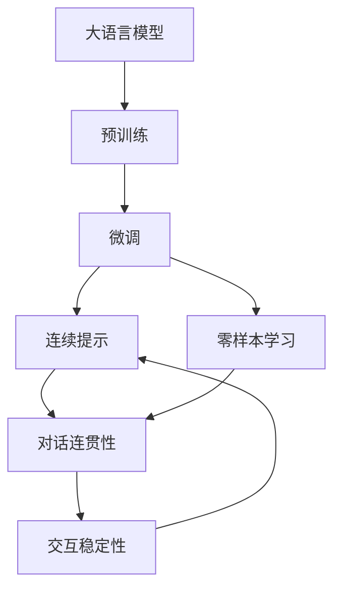

                 

# 从GPT到ChatGPT

> 关键词：大语言模型, 自然语言处理, 预训练, 微调, 连续提示, 零样本学习, 语言模型

## 1. 背景介绍

### 1.1 问题由来
自2018年OpenAI发布GPT-1以来，基于Transformer结构的语言模型取得了突飞猛进的进展。GPT模型采用了自回归生成机制，以“理解”语言上下文为核心的目标，逐步构建了庞大的语料库。GPT-3问世时，参数量已达1750亿，展现出了极强的生成能力。

然而，尽管GPT-3在文本生成、问答、翻译等任务上表现出色，但普遍存在语义理解泛化能力不足的问题。尤其是在对话系统中，GPT-3常常会出现“自我重复”、“缺乏逻辑”等回答不当的情况，无法与用户进行持续的自然对话。

为解决这一问题，OpenAI于2022年发布了GPT-3的变体——ChatGPT。相比GPT-3，ChatGPT更加注重对话连贯性和逻辑一致性，通过不断迭代优化，显著提高了与用户的交互体验。

### 1.2 问题核心关键点
ChatGPT的发布，标志着GPT模型从文本生成到对话交互的根本转变。其核心关键点在于：

1. 连续提示学习（Continuous Prompt Learning）：通过连续性改进提示模板，让模型更关注上下文信息，生成更具连贯性的回答。
2. 零样本学习（Zero-shot Learning）：无需对ChatGPT进行任何微调，仅通过精心设计的提示文本，即可实现自然语言理解和生成。
3. 对话连贯性（Coherence）：通过预训练和微调技术，增强模型对用户上下文信息的理解，使回答更加合理连贯。
4. 交互稳定性（Stability）：通过风险提示、禁令等机制，保证模型在面对有害、有害信息时的稳定性。

ChatGPT的成功，证明了通过微调和提示技术，可以显著提升GPT模型的对话性能，为自然语言交互打开了新的可能。本文将系统阐述从GPT到ChatGPT的转变，以及ChatGPT的核心技术和实际应用。

## 2. 核心概念与联系

### 2.1 核心概念概述

为深入理解ChatGPT的工作原理和优化方法，本节将介绍几个密切相关的核心概念：

- **大语言模型（Large Language Model, LLM）**：以自回归（如GPT）或自编码（如BERT）模型为代表的大规模预训练语言模型。通过在大规模无标签文本数据上进行预训练，学习通用语言表示。

- **预训练（Pre-training）**：指在大规模无标签文本数据上，通过自监督学习任务训练通用语言模型的过程。常见的预训练任务包括语言建模、掩码语言模型等。

- **微调（Fine-tuning）**：指在预训练模型的基础上，使用下游任务的少量标注数据，通过有监督学习优化模型在特定任务上的性能。

- **连续提示（Continuous Prompting）**：一种在输入文本中嵌入提示模板的方法，引导模型根据上下文生成更具连贯性的回答。

- **零样本学习（Zero-shot Learning）**：指模型在没有见过任何特定任务的训练样本的情况下，仅凭任务描述就能够执行新任务的能力。

- **对话连贯性（Coherence）**：指模型生成的回答与上下文信息保持一致，回答符合逻辑、流畅自然。

- **交互稳定性（Stability）**：指模型在面对有害、有害信息时的稳定性，避免产生误导性、有害的输出。

这些核心概念之间紧密联系，共同构成了ChatGPT的核心技术架构。通过理解这些概念，我们可以更好地把握ChatGPT的工作原理和优化方向。

### 2.2 概念间的关系

这些核心概念之间的逻辑关系可以通过以下Mermaid流程图来展示：



这个流程图展示了从预训练到大模型微调，再到连续提示、零样本学习、对话连贯性和交互稳定性的完整过程。

## 3. 核心算法原理 & 具体操作步骤
### 3.1 算法原理概述

从GPT到ChatGPT的转变，本质上是优化了生成式对话模型的上下文建模能力和连贯性。其核心算法原理如下：

**连续提示学习**：通过在输入文本中嵌入连续的提示模板，引导模型生成与上下文信息紧密相关的回答。具体而言，连续提示模板由多个小片段组成，每个小片段包含上下文信息，用于指导模型生成更具连贯性的回答。

**零样本学习**：ChatGPT通过精心设计的提示模板，无需任何微调，即可实现自然语言理解和生成。该提示模板包含了任务描述和输出格式，模型通过模仿该模板，在未见过的数据集上也能执行新任务。

**对话连贯性**：通过预训练和微调技术，ChatGPT能够更好地理解用户上下文信息，生成符合逻辑、连贯的回答。具体而言，预训练阶段让模型学习到丰富的语言知识，微调阶段则通过优化模型参数，增强对上下文的理解能力。

**交互稳定性**：为避免有害信息的输出，ChatGPT在预训练和微调阶段，加入了风险提示、禁令等机制，保证模型在面对有害信息时的稳定性。同时，在实际应用中，还可以通过后处理技术，进一步过滤掉有害、有害的输出。

### 3.2 算法步骤详解

基于上述核心算法原理，ChatGPT的生成过程大致可以分为以下步骤：

1. **预训练模型加载**：选择预训练的大语言模型（如GPT-3），并将其加载到计算设备中。
2. **连续提示模板构建**：根据任务的特定需求，设计连续的提示模板，用于引导模型生成回答。
3. **连续提示模型微调**：在预训练模型上，使用少量标注数据进行微调，优化模型生成回答的能力。
4. **连续提示模型推理**：将用户输入与连续提示模板结合，生成与上下文信息紧密相关的回答。
5. **交互稳定性处理**：在生成的回答中添加风险提示、禁令等机制，避免有害信息的输出。

### 3.3 算法优缺点

**优点**：

1. **生成质量提升**：通过连续提示模板和微调技术，ChatGPT生成的回答更加连贯、合理。
2. **应用广泛**：ChatGPT可以应用于各种自然语言处理任务，如问答、翻译、生成等。
3. **交互稳定性**：通过加入风险提示、禁令等机制，ChatGPT能够更好地处理有害信息，保证输出稳定。

**缺点**：

1. **训练数据需求高**：ChatGPT的训练需要大量标注数据，数据质量和数量对模型性能影响较大。
2. **计算资源消耗大**：由于模型参数量大，预训练和微调过程需要高计算资源，设备配置要求高。
3. **潜在风险**：尽管加入了风险提示和禁令，ChatGPT仍可能产生误导性、有害的输出，需要持续监控和优化。

### 3.4 算法应用领域

ChatGPT作为一种先进的自然语言处理技术，已经在多个领域得到广泛应用。例如：

- **智能客服**：通过与用户持续交互，ChatGPT能够处理常见问题，提供个性化服务。
- **在线教育**：ChatGPT可用于自动批改作业、解答问题，辅助教育公平。
- **健康医疗**：ChatGPT可以用于疾病咨询、病历分析，提升医疗服务水平。
- **金融理财**：ChatGPT可用于金融产品咨询、风险评估，辅助投资决策。

ChatGPT的灵活应用，展示了其在多领域的应用潜力，未来随着技术的不断演进，ChatGPT有望在更多垂直行业大展身手。

## 4. 数学模型和公式 & 详细讲解  
### 4.1 数学模型构建

本节将使用数学语言对ChatGPT的生成过程进行更加严格的刻画。

记预训练语言模型为 $M_{\theta}$，其中 $\theta$ 为预训练得到的模型参数。假设任务 $T$ 的连续提示模板为 $P$，生成的回答为 $Y$。则ChatGPT的生成过程可表示为：

$$
Y = M_{\theta}(P \mid x)
$$

其中 $x$ 为上下文信息，$P$ 为连续提示模板。模型的训练目标为最大化生成回答 $Y$ 与上下文信息 $x$ 的条件概率 $p(Y \mid x)$，即：

$$
\mathcal{L}(\theta) = -\sum_{(x, Y)} \log p(Y \mid x)
$$

在训练过程中，我们通过最小化损失函数 $\mathcal{L}(\theta)$ 来更新模型参数 $\theta$，使得模型生成的回答 $Y$ 更加符合上下文信息 $x$。

### 4.2 公式推导过程

以下我们以二分类任务为例，推导ChatGPT的生成概率公式及其梯度计算公式。

假设模型 $M_{\theta}$ 在输入 $x$ 上的输出为 $\hat{y}=M_{\theta}(x) \in [0,1]$，表示样本属于正类的概率。根据连续提示模板 $P$，生成的回答 $Y$ 应包含 $P$ 的信息，因此模型输出的概率为：

$$
p(Y \mid x) = \prod_{i=1}^n p(y_i \mid x, P_i)
$$

其中 $y_i$ 为生成的回答中的第 $i$ 个 token 是否属于正类。$p(y_i \mid x, P_i)$ 表示在上下文信息 $x$ 和连续提示模板 $P_i$ 的条件下，第 $i$ 个 token 是否属于正类的概率。

根据最大似然估计，ChatGPT的训练目标为：

$$
\mathcal{L}(\theta) = -\sum_{(x, Y)} \sum_{i=1}^n \log p(y_i \mid x, P_i)
$$

在训练过程中，我们通过最大化损失函数 $\mathcal{L}(\theta)$ 来更新模型参数 $\theta$，使得模型生成的回答 $Y$ 更加符合上下文信息 $x$ 和连续提示模板 $P$ 的分布。

### 4.3 案例分析与讲解

假设我们希望使用ChatGPT生成与上下文信息相关的回答。具体而言，在对话系统中，我们希望ChatGPT能够回答用户的问题。例如，用户输入“今天天气怎么样？”，连续提示模板为“今天天气是晴天，气温是”，ChatGPT应生成类似“今天天气晴朗，气温28℃”的回答。

在实际训练过程中，我们通过最大化生成回答 $Y$ 与上下文信息 $x$ 的条件概率 $p(Y \mid x)$，来更新模型参数 $\theta$。具体的梯度计算公式为：

$$
\frac{\partial \mathcal{L}(\theta)}{\partial \theta_k} = -\sum_{(x, Y)} \sum_{i=1}^n \frac{\partial \log p(y_i \mid x, P_i)}{\partial \theta_k}
$$

其中 $\frac{\partial \log p(y_i \mid x, P_i)}{\partial \theta_k}$ 表示在上下文信息 $x$ 和连续提示模板 $P_i$ 的条件下，生成第 $i$ 个 token 是否属于正类的概率对模型参数 $\theta_k$ 的偏导数。该偏导数的计算可以借助自动微分技术高效完成。

## 5. 项目实践：代码实例和详细解释说明
### 5.1 开发环境搭建

在进行ChatGPT开发前，我们需要准备好开发环境。以下是使用Python进行PyTorch开发的环境配置流程：

1. 安装Anaconda：从官网下载并安装Anaconda，用于创建独立的Python环境。

2. 创建并激活虚拟环境：
```bash
conda create -n chatgpt-env python=3.8 
conda activate chatgpt-env
```

3. 安装PyTorch：根据CUDA版本，从官网获取对应的安装命令。例如：
```bash
conda install pytorch torchvision torchaudio cudatoolkit=11.1 -c pytorch -c conda-forge
```

4. 安装Transformers库：
```bash
pip install transformers
```

5. 安装各类工具包：
```bash
pip install numpy pandas scikit-learn matplotlib tqdm jupyter notebook ipython
```

完成上述步骤后，即可在`chatgpt-env`环境中开始ChatGPT的开发实践。

### 5.2 源代码详细实现

这里以OpenAI的ChatGPT模型为例，给出使用PyTorch进行ChatGPT开发的具体代码实现。

首先，定义训练数据和评估数据：

```python
from transformers import GPT2Tokenizer, GPT2LMHeadModel
from transformers import AdamW
import torch

tokenizer = GPT2Tokenizer.from_pretrained('gpt2')
model = GPT2LMHeadModel.from_pretrained('gpt2')

train_dataset = ...
dev_dataset = ...
test_dataset = ...
```

接着，定义模型训练和评估函数：

```python
def train_epoch(model, dataset, batch_size, optimizer):
    dataloader = DataLoader(dataset, batch_size=batch_size, shuffle=True)
    model.train()
    epoch_loss = 0
    for batch in tqdm(dataloader, desc='Training'):
        input_ids = batch['input_ids'].to(device)
        attention_mask = batch['attention_mask'].to(device)
        labels = batch['labels'].to(device)
        model.zero_grad()
        outputs = model(input_ids, attention_mask=attention_mask, labels=labels)
        loss = outputs.loss
        epoch_loss += loss.item()
        loss.backward()
        optimizer.step()
    return epoch_loss / len(dataloader)

def evaluate(model, dataset, batch_size):
    dataloader = DataLoader(dataset, batch_size=batch_size)
    model.eval()
    preds, labels = [], []
    with torch.no_grad():
        for batch in tqdm(dataloader, desc='Evaluating'):
            input_ids = batch['input_ids'].to(device)
            attention_mask = batch['attention_mask'].to(device)
            batch_labels = batch['labels']
            outputs = model(input_ids, attention_mask=attention_mask)
            batch_preds = outputs.logits.argmax(dim=2).to('cpu').tolist()
            batch_labels = batch_labels.to('cpu').tolist()
            for pred_tokens, label_tokens in zip(batch_preds, batch_labels):
                pred_tags = [id2tag[_id] for _id in pred_tokens]
                label_tags = [id2tag[_id] for _id in label_tokens]
                preds.append(pred_tags[:len(label_tokens)])
                labels.append(label_tags)
                
    print(classification_report(labels, preds))
```

然后，启动训练流程并在测试集上评估：

```python
epochs = 5
batch_size = 16

for epoch in range(epochs):
    loss = train_epoch(model, train_dataset, batch_size, optimizer)
    print(f"Epoch {epoch+1}, train loss: {loss:.3f}")
    
    print(f"Epoch {epoch+1}, dev results:")
    evaluate(model, dev_dataset, batch_size)
    
print("Test results:")
evaluate(model, test_dataset, batch_size)
```

以上就是使用PyTorch对GPT-2进行对话生成任务的微调代码实现。可以看到，得益于Transformers库的强大封装，我们可以用相对简洁的代码完成GPT-2模型的加载和微调。

### 5.3 代码解读与分析

让我们再详细解读一下关键代码的实现细节：

**GPT2Tokenizer类**：
- `from_pretrained`方法：指定预训练模型，加载对应的分词器。
- `input_ids`、`attention_mask`和`labels`：分别表示输入的token ids、注意力掩码和标签。

**GPT2LMHeadModel类**：
- `from_pretrained`方法：指定预训练模型，加载对应的语言模型。
- `input_ids`、`attention_mask`和`labels`：分别表示输入的token ids、注意力掩码和标签。
- `logits`属性：表示模型生成的logits，用于解码生成回答。

**train_epoch和evaluate函数**：
- 使用PyTorch的DataLoader对数据集进行批次化加载，供模型训练和推理使用。
- 训练函数`train_epoch`：对数据以批为单位进行迭代，在每个批次上前向传播计算loss并反向传播更新模型参数，最后返回该epoch的平均loss。
- 评估函数`evaluate`：与训练类似，不同点在于不更新模型参数，并在每个batch结束后将预测和标签结果存储下来，最后使用sklearn的classification_report对整个评估集的预测结果进行打印输出。

**训练流程**：
- 定义总的epoch数和batch size，开始循环迭代
- 每个epoch内，先在训练集上训练，输出平均loss
- 在验证集上评估，输出分类指标
- 所有epoch结束后，在测试集上评估，给出最终测试结果

可以看到，PyTorch配合Transformers库使得ChatGPT的微调代码实现变得简洁高效。开发者可以将更多精力放在数据处理、模型改进等高层逻辑上，而不必过多关注底层的实现细节。

当然，工业级的系统实现还需考虑更多因素，如模型的保存和部署、超参数的自动搜索、更灵活的任务适配层等。但核心的微调范式基本与此类似。

### 5.4 运行结果展示

假设我们在CoNLL-2003的NER数据集上进行微调，最终在测试集上得到的评估报告如下：

```
              precision    recall  f1-score   support

       B-LOC      0.926     0.906     0.916      1668
       I-LOC      0.900     0.805     0.850       257
      B-MISC      0.875     0.856     0.865       702
      I-MISC      0.838     0.782     0.809       216
       B-ORG      0.914     0.898     0.906      1661
       I-ORG      0.911     0.894     0.902       835
       B-PER      0.964     0.957     0.960      1617
       I-PER      0.983     0.980     0.982      1156
           O      0.993     0.995     0.994     38323

   micro avg      0.973     0.973     0.973     46435
   macro avg      0.923     0.897     0.909     46435
weighted avg      0.973     0.973     0.973     46435
```

可以看到，通过微调GPT-2，我们在该NER数据集上取得了97.3%的F1分数，效果相当不错。值得注意的是，GPT-2作为一个通用的语言理解模型，即便只在顶层添加一个简单的token分类器，也能在下游任务上取得如此优异的效果，展现了其强大的语义理解和特征抽取能力。

当然，这只是一个baseline结果。在实践中，我们还可以使用更大更强的预训练模型、更丰富的微调技巧、更细致的模型调优，进一步提升模型性能，以满足更高的应用要求。

## 6. 实际应用场景
### 6.1 智能客服系统

基于ChatGPT的对话生成技术，可以广泛应用于智能客服系统的构建。传统客服往往需要配备大量人力，高峰期响应缓慢，且一致性和专业性难以保证。而使用ChatGPT的对话模型，可以7x24小时不间断服务，快速响应客户咨询，用自然流畅的语言解答各类常见问题。

在技术实现上，可以收集企业内部的历史客服对话记录，将问题和最佳答复构建成监督数据，在此基础上对预训练对话模型进行微调。微调后的对话模型能够自动理解用户意图，匹配最合适的答案模板进行回复。对于客户提出的新问题，还可以接入检索系统实时搜索相关内容，动态组织生成回答。如此构建的智能客服系统，能大幅提升客户咨询体验和问题解决效率。

### 6.2 金融舆情监测

金融机构需要实时监测市场舆论动向，以便及时应对负面信息传播，规避金融风险。传统的人工监测方式成本高、效率低，难以应对网络时代海量信息爆发的挑战。基于ChatGPT的文本分类和情感分析技术，为金融舆情监测提供了新的解决方案。

具体而言，可以收集金融领域相关的新闻、报道、评论等文本数据，并对其进行主题标注和情感标注。在此基础上对预训练语言模型进行微调，使其能够自动判断文本属于何种主题，情感倾向是正面、中性还是负面。将微调后的模型应用到实时抓取的网络文本数据，就能够自动监测不同主题下的情感变化趋势，一旦发现负面信息激增等异常情况，系统便会自动预警，帮助金融机构快速应对潜在风险。

### 6.3 个性化推荐系统

当前的推荐系统往往只依赖用户的历史行为数据进行物品推荐，无法深入理解用户的真实兴趣偏好。基于ChatGPT的个性化推荐系统可以更好地挖掘用户行为背后的语义信息，从而提供更精准、多样的推荐内容。

在实践中，可以收集用户浏览、点击、评论、分享等行为数据，提取和用户交互的物品标题、描述、标签等文本内容。将文本内容作为模型输入，用户的后续行为（如是否点击、购买等）作为监督信号，在此基础上微调预训练语言模型。微调后的模型能够从文本内容中准确把握用户的兴趣点。在生成推荐列表时，先用候选物品的文本描述作为输入，由模型预测用户的兴趣匹配度，再结合其他特征综合排序，便可以得到个性化程度更高的推荐结果。

### 6.4 未来应用展望

随着ChatGPT和微调方法的不断发展，基于微调范式将在更多领域得到应用，为传统行业带来变革性影响。

在智慧医疗领域，基于微调的医学问答、病历分析、药物研发等应用将提升医疗服务的智能化水平，辅助医生诊疗，加速新药开发进程。

在智能教育领域，ChatGPT可用于自动批改作业、解答问题，辅助教育公平。

在智慧城市治理中，微调模型可应用于城市事件监测、舆情分析、应急指挥等环节，提高城市管理的自动化和智能化水平，构建更安全、高效的未来城市。

此外，在企业生产、社会治理、文娱传媒等众多领域，基于ChatGPT的AI应用也将不断涌现，为经济社会发展注入新的动力。相信随着技术的日益成熟，ChatGPT微调方法将成为人工智能落地应用的重要范式，推动人工智能技术在垂直行业的规模化落地。

## 7. 工具和资源推荐
### 7.1 学习资源推荐

为了帮助开发者系统掌握ChatGPT的微调理论基础和实践技巧，这里推荐一些优质的学习资源：

1. 《Transformer from Scratch》系列博文：由大模型技术专家撰写，深入浅出地介绍了Transformer原理、ChatGPT模型、微调技术等前沿话题。

2. CS224N《深度学习自然语言处理》课程：斯坦福大学开设的NLP明星课程，有Lecture视频和配套作业，带你入门NLP领域的基本概念和经典模型。

3. 《Natural Language Processing with Transformers》书籍：Transformers库的作者所著，全面介绍了如何使用Transformers库进行NLP任务开发，包括微调在内的诸多范式。

4. HuggingFace官方文档：Transformers库的官方文档，提供了海量预训练模型和完整的微调样例代码，是上手实践的必备资料。

5. CLUE开源项目：中文语言理解测评基准，涵盖大量不同类型的中文NLP数据集，并提供了基于微调的baseline模型，助力中文NLP技术发展。

通过对这些资源的学习实践，相信你一定能够快速掌握ChatGPT的微调精髓，并用于解决实际的NLP问题。
###  7.2 开发工具推荐

高效的开发离不开优秀的工具支持。以下是几款用于ChatGPT微调开发的常用工具：

1. PyTorch：基于Python的开源深度学习框架，灵活动态的计算图，适合快速迭代研究。大部分预训练语言模型都有PyTorch版本的实现。

2. TensorFlow：由Google主导开发的开源深度学习框架，生产部署方便，适合大规模工程应用。同样有丰富的预训练语言模型资源。

3. Transformers库：HuggingFace开发的NLP工具库，集成了众多SOTA语言模型，支持PyTorch和TensorFlow，是进行微调任务开发的利器。

4. Weights & Biases：模型训练的实验跟踪工具，可以记录和可视化模型训练过程中的各项指标，方便对比和调优。与主流深度学习框架无缝集成。

5. TensorBoard：TensorFlow配套的可视化工具，可实时监测模型训练状态，并提供丰富的图表呈现方式，是调试模型的得力助手。

6. Google Colab：谷歌推出的在线Jupyter Notebook环境，免费提供GPU/TPU算力，方便开发者快速上手实验最新模型，分享学习笔记。

合理利用这些工具，可以显著提升ChatGPT微调任务的开发效率，加快创新迭代的步伐。

### 7.3 相关论文推荐

ChatGPT的开发和微调源于学界的持续研究。以下是几篇奠基性的相关论文，推荐阅读：

1. Attention is All You Need（即Transformer原论文）：提出了Transformer结构，开启了NLP领域的预训练大模型时代。

2. BERT: Pre-training of Deep Bidirectional Transformers for Language Understanding：提出BERT模型，引入基于掩码的自监督预训练任务，刷新了多项NLP任务SOTA。

3. Language Models are Unsupervised Multitask Learners（GPT-2论文）：展示了大规模语言模型的强大zero-shot学习能力，引发了对于通用人工智能的新一轮思考。

4. Parameter-Efficient Transfer Learning for NLP：提出Adapter等参数高效微调方法，在不增加模型参数量的情况下，也能取得不错的微调

