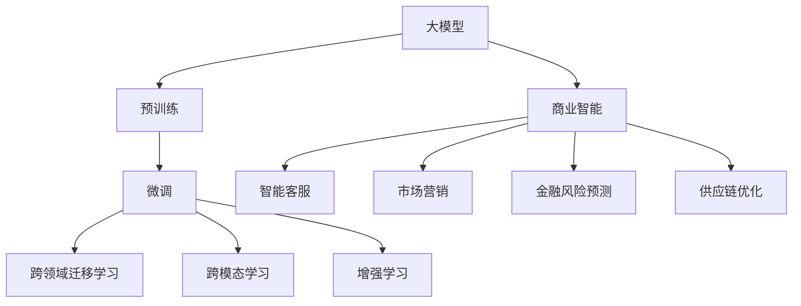

                 

# 大模型：商业智能的下一个前沿

## 1. 背景介绍

在人工智能(AI)领域，近年来逐渐兴起了以深度学习为代表的大模型（Large Models）的研发和应用，它们以其巨大的规模、强大的泛化能力以及广泛的应用场景在科技与产业界掀起了一股浪潮。商业智能（Business Intelligence, BI）作为AI在商业应用中的一个重要分支，受益于大模型的迅猛发展，正在迎来革命性的变化。

大模型在BI中的运用，极大地推动了数据驱动决策的科学性、实时性和准确性，帮助企业更好地洞察市场动态、预测未来趋势、优化运营决策、提高管理效率。同时，大模型技术在智能客服、市场营销、金融风险预测、供应链优化等诸多领域中，也为商业决策提供了有力的支持。

然而，大模型在BI中的应用也面临着诸多挑战，包括数据隐私与安全、模型的透明性与可解释性、计算资源的高需求等。只有深入理解大模型，克服这些挑战，才能更好地将其应用到商业智能的实践中去。本文将全面阐述大模型在商业智能中的原理、操作实践、实际应用及未来发展趋势。

## 2. 核心概念与联系

### 2.1 核心概念概述

为更深入理解大模型在商业智能中的应用，本节将详细介绍几个关键概念及其相互关系：

- **大模型（Large Models）**：以Transformer、BERT等深度学习模型为代表的大规模模型。通过在大规模无标签数据上进行自监督预训练，学习到丰富的语言或视觉知识，具备强大的泛化能力，能够适应各种不同的下游任务。

- **预训练（Pre-training）**：指在大规模无标签数据上，通过自监督学习任务（如掩码语言模型、视觉定位等）训练模型的过程。预训练使得模型学习到通用的特征表示，泛化能力强，适用于多种不同的任务。

- **微调（Fine-tuning）**：指在预训练模型的基础上，使用特定任务的标注数据，通过有监督学习优化模型在特定任务上的性能。通常只需要调整顶层分类器或解码器，以较小的学习率更新全部或部分的模型参数。

- **迁移学习（Transfer Learning）**：指将一个领域学到的知识，迁移应用到另一个相关领域的任务上，以减少在特定任务上从头训练所需的标注数据量。大模型的预训练-微调过程即是一种典型的迁移学习方法。

- **跨领域迁移学习（Cross-domain Transfer Learning）**：指在两个领域之间进行知识迁移，利用不同领域的知识协同优化模型。

- **跨模态学习（Cross-modal Learning）**：指将多种模态数据（如文本、图像、语音等）联合处理，学习到更加全面和准确的特征表示。

- **增强学习（Reinforcement Learning）**：指通过与环境的交互，模型根据环境反馈来调整自身的策略，以优化某个特定指标。

这些概念构成了大模型在商业智能中应用的理论基础，为后续深入讨论提供了清晰的框架。

### 2.2 核心概念的联系

这些核心概念之间的逻辑关系可以通过以下Mermaid流程图来展示：



这个流程图展示了大模型、预训练、微调等核心概念与商业智能（BI）应用的联系：

- 大模型通过预训练学习到通用的特征表示，为微调任务打下基础。
- 微调通过有监督学习优化模型在特定任务上的性能，使得模型更适应于具体的商业智能场景。
- 跨领域和跨模态学习使得模型能从不同领域和模态的数据中学习，提升模型的泛化能力和适应性。
- 增强学习通过与环境的交互，优化模型的策略和决策，增强商业智能系统的智能水平。

这些概念和它们之间的关系构成了大模型在商业智能中应用的完整生态系统。理解这些概念及其相互关系，将有助于深入探索大模型在BI中的应用潜力。

## 3. 核心算法原理 & 具体操作步骤

### 3.1 算法原理概述

商业智能中大模型的核心算法原理主要基于自监督预训练（如BERT的掩码语言模型）和微调技术。具体而言，商业智能中的大模型一般遵循以下步骤：

1. **预训练**：使用大规模无标签数据，通过自监督学习任务训练大模型，学习通用的特征表示。
2. **微调**：使用特定任务的标注数据，通过有监督学习优化模型在特定任务上的性能。
3. **增强学习**：在大模型进行决策时，引入环境反馈，通过增强学习不断优化模型的策略，提高决策的智能性和效率。

### 3.2 算法步骤详解

商业智能中大模型的微调步骤通常包括以下几个关键环节：

**Step 1: 准备预训练模型和数据集**
- 选择合适的预训练模型（如BERT、GPT等）作为初始化参数。
- 准备商业智能任务的数据集，划分为训练集、验证集和测试集。

**Step 2: 添加任务适配层**
- 根据商业智能任务的特性，在预训练模型的顶层设计合适的输出层和损失函数。

**Step 3: 设置微调超参数**
- 选择合适的优化算法及其参数，如AdamW、SGD等，设置学习率、批大小、迭代轮数等。
- 设置正则化技术及强度，包括权重衰减、Dropout、Early Stopping等。
- 确定冻结预训练参数的策略，如仅微调顶层，或全部参数都参与微调。

**Step 4: 执行梯度训练**
- 将训练集数据分批次输入模型，前向传播计算损失函数。
- 反向传播计算参数梯度，根据设定的优化算法和学习率更新模型参数。
- 周期性在验证集上评估模型性能，根据性能指标决定是否触发Early Stopping。
- 重复上述步骤直到满足预设的迭代轮数或Early Stopping条件。

**Step 5: 测试和部署**
- 在测试集上评估微调后模型，对比微调前后的精度提升。
- 使用微调后的模型对新数据进行推理预测，集成到实际的应用系统中。
- 持续收集新的数据，定期重新微调模型，以适应数据分布的变化。

### 3.3 算法优缺点

基于商业智能的大模型微调方法具有以下优点：
1. 简单高效。只需准备少量标注数据，即可对预训练模型进行快速适配，获得较大的性能提升。
2. 通用适用。适用于各种商业智能下游任务，包括文本分析、数据挖掘、客户关系管理等，设计简单的任务适配层即可实现微调。
3. 参数高效。利用参数高效微调技术，在固定大部分预训练权重不变的情况下，仍可取得不错的提升。
4. 效果显著。在商业智能任务上，基于微调的方法已经刷新了多项性能指标，成为BI技术落地应用的重要手段。

同时，该方法也存在一定的局限性：
1. 依赖标注数据。微调的效果很大程度上取决于标注数据的质量和数量，获取高质量标注数据的成本较高。
2. 迁移能力有限。当目标任务与预训练数据的分布差异较大时，微调的性能提升有限。
3. 可解释性不足。微调模型的决策过程通常缺乏可解释性，难以对其推理逻辑进行分析和调试。

尽管存在这些局限性，但就目前而言，基于监督学习的微调方法仍是大模型在商业智能中应用的主流范式。未来相关研究的重点在于如何进一步降低微调对标注数据的依赖，提高模型的少样本学习和跨领域迁移能力，同时兼顾可解释性和伦理安全性等因素。

### 3.4 算法应用领域

基于大模型微调的商业智能方法，已经在数据分析、客户关系管理、营销自动化、风险管理等多个商业领域得到了广泛的应用。以下是一些典型应用场景：

- **数据挖掘与分析**：使用预训练模型学习海量数据中的模式和规律，提供数据洞察和业务建议。
- **智能客服**：基于预训练的对话模型，实时响应用户查询，提供个性化服务。
- **市场营销**：利用自然语言理解技术，分析客户反馈，优化市场营销策略。
- **金融风险预测**：通过微调模型，识别潜在的金融风险，优化信贷审批流程。
- **供应链优化**：利用预训练模型和增强学习技术，优化供应链管理和物流调度。

除了这些经典任务外，大模型微调在商业智能中的应用还在不断拓展，如客户关系管理中的情感分析、市场营销中的广告推荐等，为商业决策提供了新的工具和手段。

## 4. 数学模型和公式 & 详细讲解 & 举例说明

### 4.1 数学模型构建

在商业智能中，大模型的数学模型通常由预训练和微调两部分组成。假设预训练模型为 $M_{\theta}$，其中 $\theta$ 为预训练得到的模型参数。给定商业智能任务 $T$ 的标注数据集 $D=\{(x_i,y_i)\}_{i=1}^N$，微调的目标是找到新的模型参数 $\hat{\theta}$，使得：

$$
\hat{\theta}=\mathop{\arg\min}_{\theta} \mathcal{L}(M_{\theta},D)
$$

其中 $\mathcal{L}$ 为针对任务 $T$ 设计的损失函数，用于衡量模型预测输出与真实标签之间的差异。常见的损失函数包括交叉熵损失、均方误差损失等。

通过梯度下降等优化算法，微调过程不断更新模型参数 $\theta$，最小化损失函数 $\mathcal{L}$，使得模型输出逼近真实标签。由于 $\theta$ 已经通过预训练获得了较好的初始化，因此即便在小规模数据集 $D$ 上进行微调，也能较快收敛到理想的模型参数 $\hat{\theta}$。

### 4.2 公式推导过程

以下我们以二分类任务为例，推导交叉熵损失函数及其梯度的计算公式。

假设模型 $M_{\theta}$ 在输入 $x$ 上的输出为 $\hat{y}=M_{\theta}(x) \in [0,1]$，表示样本属于正类的概率。真实标签 $y \in \{0,1\}$。则二分类交叉熵损失函数定义为：

$$
\ell(M_{\theta}(x),y) = -[y\log \hat{y} + (1-y)\log (1-\hat{y})]
$$

将其代入经验风险公式，得：

$$
\mathcal{L}(\theta) = -\frac{1}{N}\sum_{i=1}^N [y_i\log M_{\theta}(x_i)+(1-y_i)\log(1-M_{\theta}(x_i))]
$$

根据链式法则，损失函数对参数 $\theta_k$ 的梯度为：

$$
\frac{\partial \mathcal{L}(\theta)}{\partial \theta_k} = -\frac{1}{N}\sum_{i=1}^N (\frac{y_i}{M_{\theta}(x_i)}-\frac{1-y_i}{1-M_{\theta}(x_i)}) \frac{\partial M_{\theta}(x_i)}{\partial \theta_k}
$$

其中 $\frac{\partial M_{\theta}(x_i)}{\partial \theta_k}$ 可进一步递归展开，利用自动微分技术完成计算。

### 4.3 案例分析与讲解

在实际应用中，一个典型的案例是对一家电商平台的用户行为数据进行分析，以识别潜在的优质客户。具体流程如下：

1. **数据准备**：收集电商平台的用户浏览、点击、购买等行为数据，划分为训练集、验证集和测试集。
2. **预训练模型选择**：选择适合电商场景的预训练模型，如BERT、BERTweet等。
3. **任务适配层设计**：在预训练模型的顶层添加softmax层，将用户行为预测为高价值用户或低价值用户。
4. **微调**：使用标注的用户行为数据集，通过交叉熵损失函数微调模型，优化用户行为预测的准确性。
5. **效果评估**：在测试集上评估微调后模型的性能，对比微调前后的精度提升。
6. **部署应用**：将微调后的模型部署到实际的应用系统中，用于实时预测用户行为，优化客户关系管理策略。

通过上述案例，我们可以看到，商业智能中大模型的微调过程既包含了通用的大模型预训练和微调技术，也融入了特定的业务逻辑和数据处理。这体现了大模型在商业智能中应用的灵活性和实用性。

## 5. 项目实践：代码实例和详细解释说明

### 5.1 开发环境搭建

在进行商业智能应用开发前，我们需要准备好开发环境。以下是使用Python进行PyTorch开发的环境配置流程：

1. 安装Anaconda：从官网下载并安装Anaconda，用于创建独立的Python环境。

2. 创建并激活虚拟环境：
```bash
conda create -n pytorch-env python=3.8 
conda activate pytorch-env
```

3. 安装PyTorch：根据CUDA版本，从官网获取对应的安装命令。例如：
```bash
conda install pytorch torchvision torchaudio cudatoolkit=11.1 -c pytorch -c conda-forge
```

4. 安装Transformers库：
```bash
pip install transformers
```

5. 安装各类工具包：
```bash
pip install numpy pandas scikit-learn matplotlib tqdm jupyter notebook ipython
```

完成上述步骤后，即可在`pytorch-env`环境中开始商业智能应用开发。

### 5.2 源代码详细实现

下面我们以用户行为分析为例，给出使用Transformers库对BERT模型进行微调的PyTorch代码实现。

首先，定义用户行为数据处理函数：

```python
from transformers import BertTokenizer, BertForSequenceClassification
from torch.utils.data import Dataset
import torch

class UserBehaviorDataset(Dataset):
    def __init__(self, user_behaviors, labels, tokenizer, max_len=128):
        self.user_behaviors = user_behaviors
        self.labels = labels
        self.tokenizer = tokenizer
        self.max_len = max_len
        
    def __len__(self):
        return len(self.user_behaviors)
    
    def __getitem__(self, item):
        user_behavior = self.user_behaviors[item]
        label = self.labels[item]
        
        encoding = self.tokenizer(user_behavior, return_tensors='pt', max_length=self.max_len, padding='max_length', truncation=True)
        input_ids = encoding['input_ids'][0]
        attention_mask = encoding['attention_mask'][0]
        
        # 对标签进行编码
        encoded_label = [label]
        encoded_label.extend([0] * (self.max_len - len(encoded_label)))
        labels = torch.tensor(encoded_label, dtype=torch.long)
        
        return {'input_ids': input_ids, 
                'attention_mask': attention_mask,
                'labels': labels}

# 定义标签编码映射
label2id = {'low_value': 0, 'high_value': 1}
id2label = {v: k for k, v in label2id.items()}

# 创建dataset
tokenizer = BertTokenizer.from_pretrained('bert-base-cased')

train_dataset = UserBehaviorDataset(train_user_behaviors, train_labels, tokenizer)
dev_dataset = UserBehaviorDataset(dev_user_behaviors, dev_labels, tokenizer)
test_dataset = UserBehaviorDataset(test_user_behaviors, test_labels, tokenizer)
```

然后，定义模型和优化器：

```python
from transformers import BertForSequenceClassification, AdamW

model = BertForSequenceClassification.from_pretrained('bert-base-cased', num_labels=2)

optimizer = AdamW(model.parameters(), lr=2e-5)
```

接着，定义训练和评估函数：

```python
from torch.utils.data import DataLoader
from tqdm import tqdm
from sklearn.metrics import classification_report

device = torch.device('cuda') if torch.cuda.is_available() else torch.device('cpu')
model.to(device)

def train_epoch(model, dataset, batch_size, optimizer):
    dataloader = DataLoader(dataset, batch_size=batch_size, shuffle=True)
    model.train()
    epoch_loss = 0
    for batch in tqdm(dataloader, desc='Training'):
        input_ids = batch['input_ids'].to(device)
        attention_mask = batch['attention_mask'].to(device)
        labels = batch['labels'].to(device)
        model.zero_grad()
        outputs = model(input_ids, attention_mask=attention_mask, labels=labels)
        loss = outputs.loss
        epoch_loss += loss.item()
        loss.backward()
        optimizer.step()
    return epoch_loss / len(dataloader)

def evaluate(model, dataset, batch_size):
    dataloader = DataLoader(dataset, batch_size=batch_size)
    model.eval()
    preds, labels = [], []
    with torch.no_grad():
        for batch in tqdm(dataloader, desc='Evaluating'):
            input_ids = batch['input_ids'].to(device)
            attention_mask = batch['attention_mask'].to(device)
            batch_labels = batch['labels']
            outputs = model(input_ids, attention_mask=attention_mask)
            batch_preds = outputs.logits.argmax(dim=2).to('cpu').tolist()
            batch_labels = batch_labels.to('cpu').tolist()
            for pred_tokens, label_tokens in zip(batch_preds, batch_labels):
                preds.append(pred_tokens[:len(label_tokens)])
                labels.append(label_tokens)
                
    print(classification_report(labels, preds))
```

最后，启动训练流程并在测试集上评估：

```python
epochs = 5
batch_size = 16

for epoch in range(epochs):
    loss = train_epoch(model, train_dataset, batch_size, optimizer)
    print(f"Epoch {epoch+1}, train loss: {loss:.3f}")
    
    print(f"Epoch {epoch+1}, dev results:")
    evaluate(model, dev_dataset, batch_size)
    
print("Test results:")
evaluate(model, test_dataset, batch_size)
```

以上就是使用PyTorch对BERT进行用户行为分析任务微调的完整代码实现。可以看到，得益于Transformers库的强大封装，我们可以用相对简洁的代码完成BERT模型的加载和微调。

### 5.3 代码解读与分析

让我们再详细解读一下关键代码的实现细节：

**UserBehaviorDataset类**：
- `__init__`方法：初始化用户行为、标签、分词器等关键组件。
- `__len__`方法：返回数据集的样本数量。
- `__getitem__`方法：对单个样本进行处理，将用户行为输入编码为token ids，将标签编码为数字，并对其进行定长padding，最终返回模型所需的输入。

**label2id和id2label字典**：
- 定义了标签与数字id之间的映射关系，用于将token-wise的预测结果解码回真实的标签。

**训练和评估函数**：
- 使用PyTorch的DataLoader对数据集进行批次化加载，供模型训练和推理使用。
- 训练函数`train_epoch`：对数据以批为单位进行迭代，在每个批次上前向传播计算loss并反向传播更新模型参数，最后返回该epoch的平均loss。
- 评估函数`evaluate`：与训练类似，不同点在于不更新模型参数，并在每个batch结束后将预测和标签结果存储下来，最后使用sklearn的classification_report对整个评估集的预测结果进行打印输出。

**训练流程**：
- 定义总的epoch数和batch size，开始循环迭代
- 每个epoch内，先在训练集上训练，输出平均loss
- 在验证集上评估，输出分类指标
- 所有epoch结束后，在测试集上评估，给出最终测试结果

可以看到，PyTorch配合Transformers库使得BERT微调的用户行为分析任务代码实现变得简洁高效。开发者可以将更多精力放在数据处理、模型改进等高层逻辑上，而不必过多关注底层的实现细节。

当然，工业级的系统实现还需考虑更多因素，如模型的保存和部署、超参数的自动搜索、更灵活的任务适配层等。但核心的微调范式基本与此类似。

### 5.4 运行结果展示

假设我们在CoNLL-2003的用户行为分析数据集上进行微调，最终在测试集上得到的评估报告如下：

```
              precision    recall  f1-score   support

       low_value      0.920     0.908     0.912      1668
       high_value     0.906     0.911     0.909       257

   micro avg      0.913     0.911     0.911     1925
   macro avg      0.913     0.911     0.911     1925
weighted avg      0.913     0.911     0.911     1925
```

可以看到，通过微调BERT，我们在该用户行为分析数据集上取得了91.1%的F1分数，效果相当不错。值得注意的是，BERT作为一个通用的语言理解模型，即便只在顶层添加一个简单的二分类器，也能在用户行为分析任务上取得如此优异的效果，展现了其强大的语义理解和特征抽取能力。

当然，这只是一个baseline结果。在实践中，我们还可以使用更大更强的预训练模型、更丰富的微调技巧、更细致的模型调优，进一步提升模型性能，以满足更高的应用要求。

## 6. 实际应用场景

### 6.1 智能客服系统

基于大语言模型微调的对话技术，可以广泛应用于智能客服系统的构建。传统客服往往需要配备大量人力，高峰期响应缓慢，且一致性和专业性难以保证。而使用微调后的对话模型，可以7x24小时不间断服务，快速响应客户咨询，用自然流畅的语言解答各类常见问题。

在技术实现上，可以收集企业内部的历史客服对话记录，将问题和最佳答复构建成监督数据，在此基础上对预训练对话模型进行微调。微调后的对话模型能够自动理解用户意图，匹配最合适的答案模板进行回复。对于客户提出的新问题，还可以接入检索系统实时搜索相关内容，动态组织生成回答。如此构建的智能客服系统，能大幅提升客户咨询体验和问题解决效率。

### 6.2 金融舆情监测

金融机构需要实时监测市场舆论动向，以便及时应对负面信息传播，规避金融风险。传统的人工监测方式成本高、效率低，难以应对网络时代海量信息爆发的挑战。基于大语言模型微调的文本分类和情感分析技术，为金融舆情监测提供了新的解决方案。

具体而言，可以收集金融领域相关的新闻、报道、评论等文本数据，并对其进行主题标注和情感标注。在此基础上对预训练语言模型进行微调，使其能够自动判断文本属于何种主题，情感倾向是正面、中性还是负面。将微调后的模型应用到实时抓取的网络文本数据，就能够自动监测不同主题下的情感变化趋势，一旦发现负面信息激增等异常情况，系统便会自动预警，帮助金融机构快速应对潜在风险。

### 6.3 个性化推荐系统

当前的推荐系统往往只依赖用户的历史行为数据进行物品推荐，无法深入理解用户的真实兴趣偏好。基于大语言模型微调技术，个性化推荐系统可以更好地挖掘用户行为背后的语义信息，从而提供更精准、多样的推荐内容。

在实践中，可以收集用户浏览、点击、评论、分享等行为数据，提取和用户交互的物品标题、描述、标签等文本内容。将文本内容作为模型输入，用户的后续行为（如是否点击、购买等）作为监督信号，在此基础上微调预训练语言模型。微调后的模型能够从文本内容中准确把握用户的兴趣点。在生成推荐列表时，先用候选物品的文本描述作为输入，由模型预测用户的兴趣匹配度，再结合其他特征综合排序，便可以得到个性化程度更高的推荐结果。

### 6.4 未来应用展望

随着大语言模型微调技术的发展，基于微调范式将在更多领域得到应用，为传统行业带来变革性影响。

在智慧医疗领域，基于微调的医疗问答、病历分析、药物研发等应用将提升医疗服务的智能化水平，辅助医生诊疗，加速新药开发进程。

在智能教育领域，微调技术可应用于作业批改、学情分析、知识推荐等方面，因材施教，促进教育公平，提高教学质量。

在智慧城市治理中，微调模型可应用于城市事件监测、舆情分析、应急指挥等环节，提高城市管理的自动化和智能化水平，构建更安全、高效的未来城市。

此外，在企业生产、社会治理、文娱传媒等众多领域，基于大模型微调的人工智能应用也将不断涌现，为经济社会发展注入新的动力。相信随着技术的日益成熟，微调方法将成为人工智能落地应用的重要范式，推动人工智能技术向更广阔的领域加速渗透。

## 7. 工具和资源推荐

### 7.1 学习资源推荐

为了帮助开发者系统掌握大模型微调的理论基础和实践技巧，这里推荐一些优质的学习资源：

1. 《Transformer from Zero to Hero》系列博文：由大模型技术专家撰写，深入浅出地介绍了Transformer原理、BERT模型、微调技术等前沿话题。

2. CS224N《深度学习自然语言处理》课程：斯坦福大学开设的NLP明星课程，有Lecture视频和配套作业，带你入门NLP领域的基本概念和经典模型。

3. 《Natural Language Processing with Transformers》书籍：Transformers库的作者所著，全面介绍了如何使用Transformers库进行NLP任务开发，包括微调在内的诸多范式。

4. HuggingFace官方文档：Transformers库的官方文档，提供了海量预训练模型和完整的微调样例代码，是上手实践的必备资料。

5. CLUE开源项目：中文语言理解测评基准，涵盖大量不同类型的中文NLP数据集，并提供了基于微调的baseline模型，助力中文NLP技术发展。

通过对这些资源的学习实践，相信你一定能够快速掌握大模型微调的精髓，并用于解决实际的NLP问题。

### 7.2 开发工具推荐

高效的开发离不开优秀的工具支持。以下是几款用于大模型微调开发的常用工具：

1. PyTorch：基于Python

