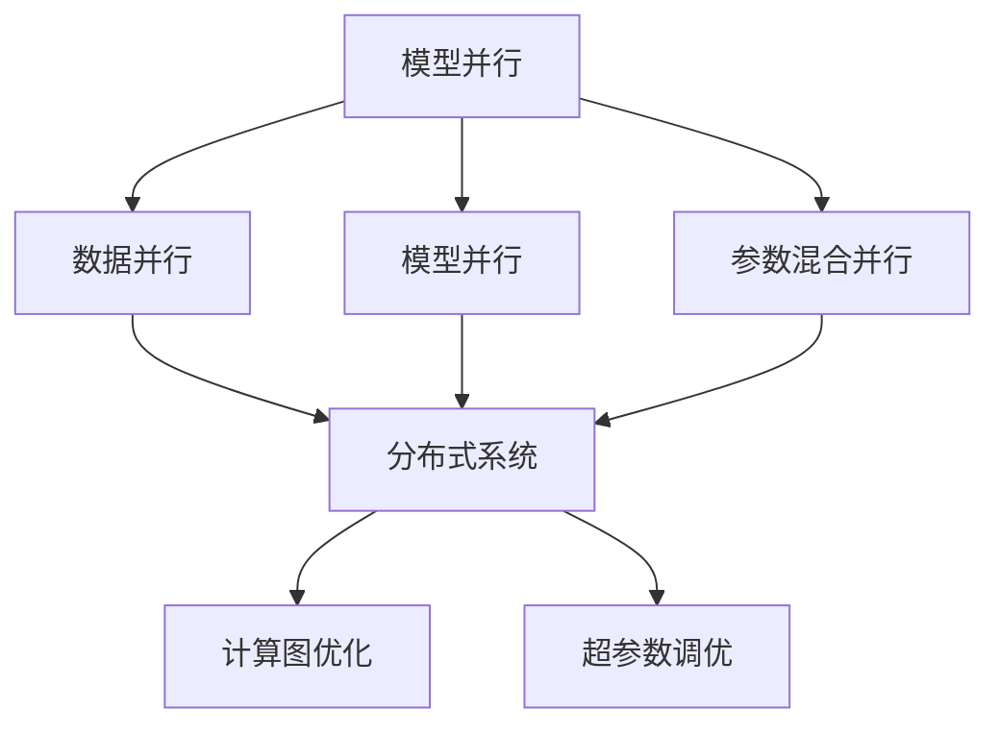
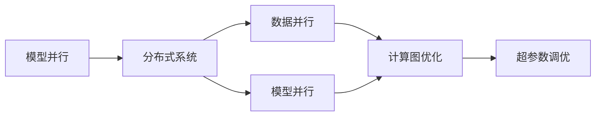
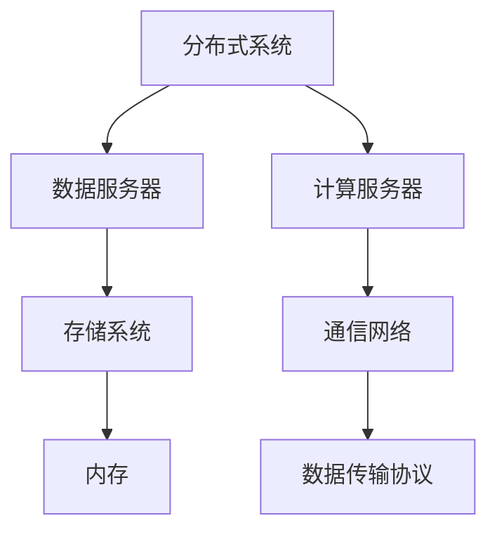
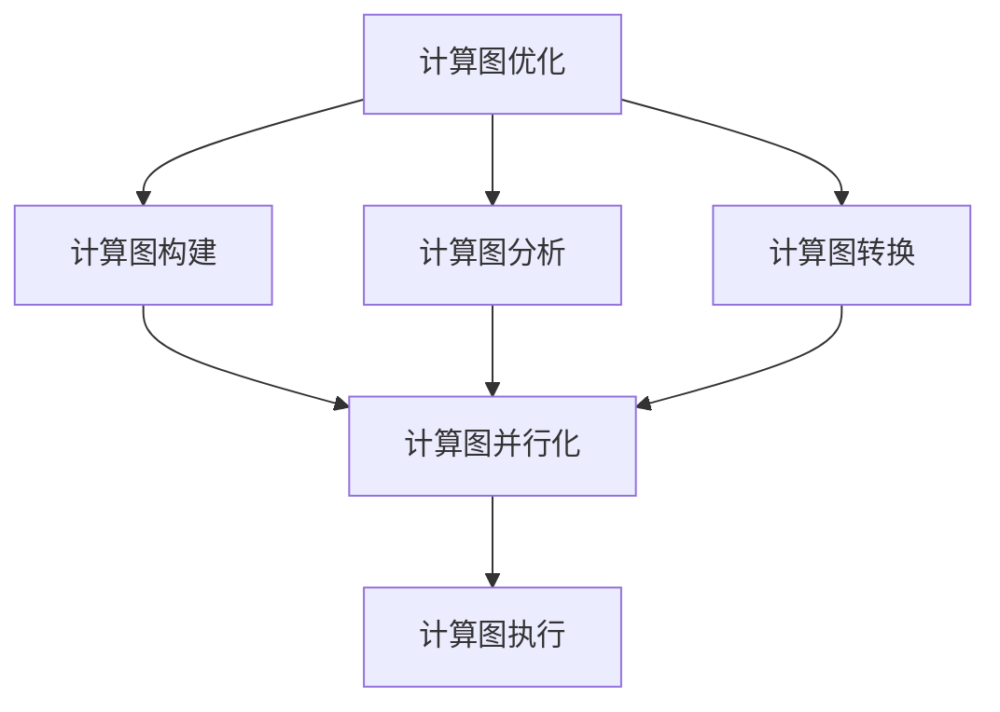
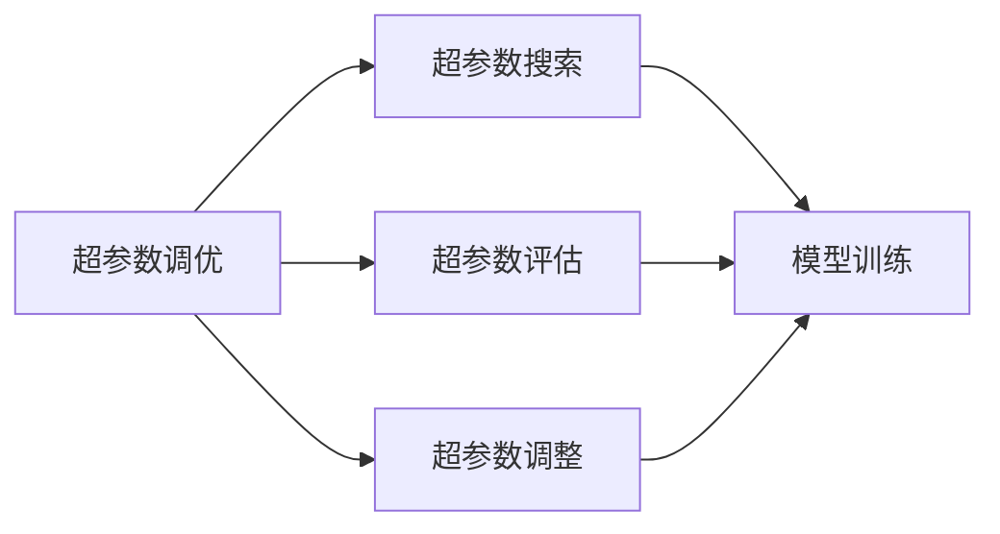
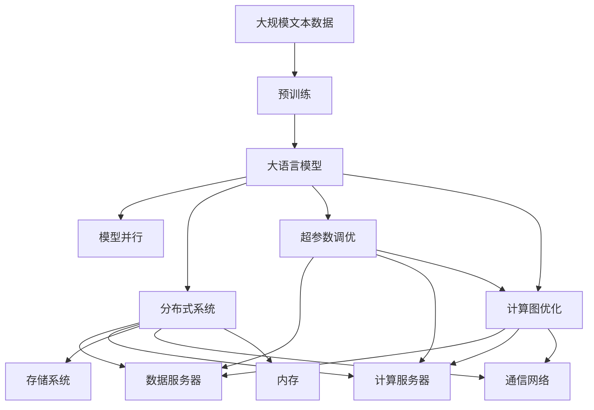

                 

# 大语言模型原理与工程实践：模型并行

> 关键词：大语言模型,模型并行,分布式训练,分布式系统,超参数调优,计算图优化,加速计算

## 1. 背景介绍

### 1.1 问题由来
近年来，深度学习技术的发展在各个领域取得了显著成就。特别是在自然语言处理(NLP)领域，大规模预训练语言模型（Large Language Models, LLMs）的横空出世，显著提升了模型的语言理解和生成能力。这些大模型通常包含数十亿甚至数百亿参数，具有强大的表征能力，能够在大规模无标签文本数据上自监督地预训练，并在下游任务上微调以获得优异的性能。

然而，由于大模型的参数量巨大，单机的计算资源难以满足大规模模型的训练需求。尽管分布式训练(Distributed Training)技术可以在多个GPU或TPU上并行训练，但大模型训练仍然面临计算资源、存储资源和时间消耗等方面的挑战。因此，模型并行(Model Parallelism)技术在优化大语言模型的训练和推理中显得尤为重要。

### 1.2 问题核心关键点
模型并行是一种在多台计算设备上并行训练和推理的技术，其核心思想是将大模型的不同部分分配到不同的设备上，以提高训练和推理的速度和效率。模型并行通常分为数据并行、模型并行和参数混合并行三种形式。其中，数据并行是最常见的一种并行方式，适用于分布式训练场景；模型并行则将模型的不同层分配到不同的设备上，适用于硬件资源有限的情况；参数混合并行则是将两种方式结合，进一步优化模型的训练和推理性能。

模型并行技术通过细粒度的硬件资源分配，能够显著提升大模型的训练和推理速度，同时降低对内存和存储的需求，提高模型的可扩展性和适应性。但模型并行也带来了一些挑战，如模型通信开销、参数同步问题等。因此，在实际应用中，需要结合具体的硬件配置和模型特点，选择合适的并行策略。

### 1.3 问题研究意义
研究模型并行技术，对于拓展大模型的应用范围，提升模型训练和推理的效率，加速NLP技术的产业化进程，具有重要意义：

1. 降低计算成本。通过并行训练，可以显著降低大模型训练所需的计算资源和时间成本，提高资源利用率。
2. 提升训练效率。模型并行通过多台设备的协同训练，能够在更短的时间内完成训练过程，加快模型迭代速度。
3. 增强模型的可扩展性。模型并行技术能够适应不同规模的计算资源，使大模型能够快速扩展和升级。
4. 优化资源利用。并行训练能够利用分布式系统的冗余资源，提高硬件设备的利用效率，降低存储和内存的开销。
5. 推动高性能计算发展。模型并行技术促进了高性能计算技术的发展，为解决大规模数据和复杂模型问题提供了新的解决方案。

## 2. 核心概念与联系

### 2.1 核心概念概述

为更好地理解模型并行技术，本节将介绍几个密切相关的核心概念：

- 模型并行：指将大模型的不同部分分配到不同的计算设备上进行并行训练和推理的技术。常用于分布式计算环境，可以有效提升训练和推理速度。
- 数据并行：一种常见的模型并行方式，将训练数据分成多个批次，并行地在前向和后向传播过程中进行计算。常用于GPU/TPU等高性能计算设备上。
- 模型并行：将模型的不同层或模块分配到不同的计算设备上进行并行训练。常用于CPU等资源有限的场景。
- 参数混合并行：结合数据并行和模型并行，既并行训练数据，又并行训练模型参数。适用于具有多层结构和复杂任务的大模型。
- 分布式系统：指由多个计算设备构成的分布式计算环境，常用于高性能计算和大规模数据处理。
- 计算图优化：指在计算图级别进行优化，以提高计算效率和降低内存消耗的技术。常用于深度学习模型的优化中。
- 超参数调优：指在模型训练过程中，通过调整超参数来优化模型性能的技术。常用于并行训练中，以平衡资源利用和模型性能。

这些核心概念之间的逻辑关系可以通过以下Mermaid流程图来展示：



这个流程图展示了模型并行技术的基本构成及其与相关概念的关系：

1. 模型并行是整个技术的基础。
2. 数据并行和模型并行是两种常见的模型并行方式，常用于不同的计算环境。
3. 参数混合并行是进一步的优化方式，适用于复杂模型。
4. 分布式系统是模型并行的硬件基础。
5. 计算图优化和超参数调优是模型并行的重要优化手段。

这些概念共同构成了模型并行技术的核心框架，使其能够在多种计算环境中发挥其高效训练和推理的优势。

### 2.2 概念间的关系

这些核心概念之间存在着紧密的联系，形成了模型并行技术的完整生态系统。下面我们通过几个Mermaid流程图来展示这些概念之间的关系。

#### 2.2.1 模型并行的基本架构



这个流程图展示了模型并行的基本架构，包括分布式系统、数据并行、模型并行、计算图优化和超参数调优等关键技术。

#### 2.2.2 分布式系统的组成



这个流程图展示了分布式系统的组成，包括数据服务器、计算服务器、存储系统、通信网络和内存等关键组件。

#### 2.2.3 计算图优化的流程



这个流程图展示了计算图优化的基本流程，包括计算图构建、计算图分析、计算图转换和计算图并行化等步骤。

#### 2.2.4 超参数调优的流程



这个流程图展示了超参数调优的基本流程，包括超参数搜索、超参数评估和超参数调整等步骤。

### 2.3 核心概念的整体架构

最后，我们用一个综合的流程图来展示这些核心概念在大模型并行训练过程中的整体架构：



这个综合流程图展示了从预训练到并行训练，再到超参数调优和计算图优化的完整过程。大语言模型首先在大规模文本数据上进行预训练，然后通过模型并行技术在分布式系统上进行并行训练，同时进行超参数调优和计算图优化，以提高训练效率和性能。 通过这些流程图，我们可以更清晰地理解模型并行技术的工作原理和优化方向。

## 3. 核心算法原理 & 具体操作步骤

### 3.1 算法原理概述

模型并行技术的基本原理是利用多台计算设备对模型的不同部分进行并行计算，从而加速训练和推理过程。模型并行可以分为数据并行、模型并行和参数混合并行三种形式。

#### 3.1.1 数据并行
数据并行是将训练数据分成多个批次，每个批次的数据由不同的计算设备并行处理。具体实现方式如下：

1. 将训练数据 $D=\{(x_i, y_i)\}_{i=1}^N$ 划分为 $M$ 个子集 $D_1, D_2, ..., D_M$，每个子集的大小相等。
2. 每个计算设备 $k$ 负责处理 $D_k$ 中的样本，前向传播计算模型对 $x_i$ 的输出 $y_i$。
3. 计算设备 $k$ 将输出 $y_i$ 发送给所有其他设备 $j$，接收其他设备 $j$ 发送的输出 $y_j$。
4. 所有计算设备 $k$ 对所有 $y_i$ 求平均，得到最终输出 $y'$。
5. 反向传播计算损失函数对模型参数的梯度，每个计算设备对梯度求平均后更新模型参数。

数据并行适用于计算设备性能较高，存储资源较少的场景。通过将训练数据平分为多个批次，能够在较短的时间内完成训练，同时避免因模型过拟合导致的性能下降。

#### 3.1.2 模型并行
模型并行是将模型的不同层或模块分配到不同的计算设备上进行并行训练。具体实现方式如下：

1. 将模型划分为 $P$ 个子模型 $M_1, M_2, ..., M_P$，每个子模型的大小相等。
2. 每个计算设备 $k$ 负责处理 $M_k$ 中的层或模块，前向传播计算模型对 $x_i$ 的输出 $y_i$。
3. 计算设备 $k$ 将输出 $y_i$ 发送给所有其他设备 $j$，接收其他设备 $j$ 发送的输出 $y_j$。
4. 所有计算设备 $k$ 对所有 $y_i$ 求平均，得到最终输出 $y'$。
5. 反向传播计算损失函数对模型参数的梯度，每个计算设备对梯度求平均后更新模型参数。

模型并行适用于计算设备资源有限，但模型结构复杂的情况。通过将模型的不同部分分配到不同的设备上，能够充分利用计算资源，同时避免因数据通信导致的性能损失。

#### 3.1.3 参数混合并行
参数混合并行是结合数据并行和模型并行的方式，既并行处理训练数据，又并行处理模型参数。具体实现方式如下：

1. 将训练数据 $D=\{(x_i, y_i)\}_{i=1}^N$ 划分为 $M$ 个子集 $D_1, D_2, ..., D_M$。
2. 将模型划分为 $P$ 个子模型 $M_1, M_2, ..., M_P$，每个子模型的大小相等。
3. 每个计算设备 $k$ 负责处理 $D_k$ 和 $M_k$ 中的样本和层，前向传播计算模型对 $x_i$ 的输出 $y_i$。
4. 计算设备 $k$ 将输出 $y_i$ 发送给所有其他设备 $j$，接收其他设备 $j$ 发送的输出 $y_j$。
5. 所有计算设备 $k$ 对所有 $y_i$ 求平均，得到最终输出 $y'$。
6. 反向传播计算损失函数对模型参数的梯度，每个计算设备对梯度求平均后更新模型参数。

参数混合并行适用于计算资源有限，但模型结构复杂的情况。通过同时并行处理数据和参数，能够进一步提高训练效率，同时避免数据通信和模型通信的性能损失。

### 3.2 算法步骤详解

#### 3.2.1 数据并行步骤详解

数据并行的具体步骤如下：

1. 将训练数据 $D=\{(x_i, y_i)\}_{i=1}^N$ 划分为 $M$ 个子集 $D_1, D_2, ..., D_M$，每个子集的大小相等。
2. 每个计算设备 $k$ 负责处理 $D_k$ 中的样本，前向传播计算模型对 $x_i$ 的输出 $y_i$。
3. 计算设备 $k$ 将输出 $y_i$ 发送给所有其他设备 $j$，接收其他设备 $j$ 发送的输出 $y_j$。
4. 所有计算设备 $k$ 对所有 $y_i$ 求平均，得到最终输出 $y'$。
5. 反向传播计算损失函数对模型参数的梯度，每个计算设备对梯度求平均后更新模型参数。

#### 3.2.2 模型并行步骤详解

模型并行的具体步骤如下：

1. 将模型划分为 $P$ 个子模型 $M_1, M_2, ..., M_P$，每个子模型的大小相等。
2. 每个计算设备 $k$ 负责处理 $M_k$ 中的层或模块，前向传播计算模型对 $x_i$ 的输出 $y_i$。
3. 计算设备 $k$ 将输出 $y_i$ 发送给所有其他设备 $j$，接收其他设备 $j$ 发送的输出 $y_j$。
4. 所有计算设备 $k$ 对所有 $y_i$ 求平均，得到最终输出 $y'$。
5. 反向传播计算损失函数对模型参数的梯度，每个计算设备对梯度求平均后更新模型参数。

#### 3.2.3 参数混合并行步骤详解

参数混合并行的具体步骤如下：

1. 将训练数据 $D=\{(x_i, y_i)\}_{i=1}^N$ 划分为 $M$ 个子集 $D_1, D_2, ..., D_M$。
2. 将模型划分为 $P$ 个子模型 $M_1, M_2, ..., M_P$，每个子模型的大小相等。
3. 每个计算设备 $k$ 负责处理 $D_k$ 和 $M_k$ 中的样本和层，前向传播计算模型对 $x_i$ 的输出 $y_i$。
4. 计算设备 $k$ 将输出 $y_i$ 发送给所有其他设备 $j$，接收其他设备 $j$ 发送的输出 $y_j$。
5. 所有计算设备 $k$ 对所有 $y_i$ 求平均，得到最终输出 $y'$。
6. 反向传播计算损失函数对模型参数的梯度，每个计算设备对梯度求平均后更新模型参数。

### 3.3 算法优缺点

模型并行技术具有以下优点：

1. 提高训练效率：通过并行处理数据和模型参数，能够在较短时间内完成训练。
2. 降低内存消耗：通过将模型参数分布在多个设备上，能够降低单个设备的内存消耗。
3. 提升计算能力：通过多台计算设备的协同计算，能够提高整体计算能力。
4. 适应不同硬件：适用于不同的硬件配置，如GPU/TPU、CPU等。

模型并行技术也存在一些缺点：

1. 数据通信开销：每个计算设备需要与其他设备进行数据通信，可能增加通信开销。
2. 参数同步问题：不同设备上的参数需要同步更新，可能增加计算复杂度。
3. 模型并行复杂度高：模型并行需要分配模型层或模块，增加模型设计复杂度。
4. 硬件资源要求高：需要配备多个高性能计算设备，硬件成本较高。

尽管存在这些缺点，但模型并行技术在大规模模型训练和推理中具有不可替代的作用，是优化大语言模型性能的重要手段之一。

### 3.4 算法应用领域

模型并行技术已经被广泛应用于深度学习模型的训练和推理中，特别是在大语言模型等大规模模型的应用场景中。以下是一些常见的应用领域：

1. 自然语言处理：在文本分类、命名实体识别、机器翻译等NLP任务中，模型并行技术能够显著提升模型的训练和推理速度。
2. 计算机视觉：在大规模图像识别、图像分割等CV任务中，模型并行技术能够提高模型的计算效率。
3. 语音识别：在大规模语音识别任务中，模型并行技术能够提高模型的训练和推理速度。
4. 推荐系统：在大规模推荐系统任务中，模型并行技术能够提高推荐模型的计算效率。
5. 强化学习：在多智能体协同学习等强化学习任务中，模型并行技术能够提高模型的训练和推理速度。
6. 科学研究：在大型科学计算任务中，模型并行技术能够提高计算效率和模型精度。

除了上述应用领域外，模型并行技术还被应用于各种需要高性能计算和数据处理的任务中，如医学图像分析、生物信息学、金融风险评估等。未来，随着硬件技术的不断进步，模型并行技术的应用范围将进一步扩大。

## 4. 数学模型和公式 & 详细讲解  
### 4.1 数学模型构建

本节将使用数学语言对模型并行技术进行更加严格的刻画。

记模型为 $M_{\theta}:\mathcal{X} \rightarrow \mathcal{Y}$，其中 $\mathcal{X}$ 为输入空间，$\mathcal{Y}$ 为输出空间，$\theta \in \mathbb{R}^d$ 为模型参数。假设训练数据集为 $D=\{(x_i, y_i)\}_{i=1}^N, x_i \in \mathcal{X}, y_i \in \mathcal{Y}$。

定义模型 $M_{\theta}$ 在输入 $x$ 上的输出为 $y=M_{\theta}(x)$，则模型并行的损失函数为：

$$
\mathcal{L}(\theta) = \frac{1}{N}\sum_{i=1}^N \ell(y_i, y)
$$

其中 $\ell$ 为模型输出与真实标签之间的差异函数，如均方误差、交叉熵等。

在模型并行中，假设模型被划分为 $P$ 个子模型 $M_1, M_2, ..., M_P$，每个子模型的大小相等。则并行训练的目标是最小化如下平均损失函数：

$$
\mathcal{L}(\theta) = \frac{1}{N}\sum_{i=1}^N \ell(M_1(x_i), M_2(x_i), ..., M_P(x_i), y_i)
$$

其中 $M_1, M_2, ..., M_P$ 分别表示模型在计算设备上的并行化实现。

### 4.2 公式推导过程

以下我们以数据并行和模型并行为例，推导并行训练的数学公式。

#### 4.2.1 数据并行

假设训练数据 $D=\{(x_i, y_i)\}_{i=1}^N$ 被划分为 $M$ 个子集 $D_1, D_2, ..., D_M$，每个子集的大小相等。则数据并行的平均损失函数为：

$$
\mathcal{L}(\theta) = \frac{1}{N}\sum_{i=1}^M \frac{1}{|D_i|} \sum_{x \in D_i} \ell(M_{\theta}(x), y_i)
$$

其中 $|D_i|$ 表示子集 $D_i$ 的大小。

数据并行的前向传播和反向传播过程如下：

- 前向传播：将训练数据 $D$ 划分为 $M$ 个子集，每个子集分配给不同的计算设备进行并行计算。
- 反向传播：计算设备将输出 $y_i$ 发送给所有其他设备，接收其他设备发送的输出 $y_j$。所有计算设备对所有 $y_i$ 求平均，得到最终输出 $y'$。
- 参数更新：反向传播计算损失函数对模型参数的梯度，每个计算设备对梯度求平均后更新模型参数。

#### 4.2.2 模型并行

假设模型 $M_{\theta}$ 被划分为 $P$ 个子模型 $M_1, M_2, ..., M_P$，每个子模型的大小相等。则模型并行的平均损失函数为：

$$
\mathcal{L}(\theta) = \frac{1}{N}\sum_{i=1}^M \frac{1}{|D_i|} \sum_{x \in D_i} \ell(M_1(x), M_2(x), ..., M_P(x), y_i)
$$

其中 $|D_i|$ 表示子集 $D_i$ 的大小。

模型并行的前向传播和反向传播过程如下：

- 前向传播：将训练数据 $D$ 划分为 $M$ 个子集，每个子集分配给不同的计算设备进行并行计算。每个子模型在相应的计算设备上独立计算。
- 反向传播：计算设备将输出 $y_i$ 发送给所有其他设备，接收其他设备发送的输出 $y_j$。所有计算设备对所有 $y_i$ 求平均，得到最终输出 $y'$。
- 参数更新：反向传播计算损失函数对模型参数的梯度，每个计算设备对梯度求平均后更新模型参数。

### 4.3 案例分析与讲解

以模型并行为例，我们来看一个具体的案例：

假设我们有 $P=4$ 个子模型，每个子模型大小相等。使用 $M_1, M_2, M_3, M_4$ 表示这四个子模型，分别在计算设备上并行计算。训练数据 $D=\{(x_i, y_i)\}_{i=1}^N$ 被划分为 $M=2$ 个子集 $D_1, D_2$，每个子集大小相等。

具体步骤如下：

1. 计算设备 $1, 2, 3, 4$ 分别计算 $D_1$ 中的样本 $x_i$，得到输出 $y_i^{(1)}$。
2. 计算设备 $1, 2, 3, 4$ 将 $y_i^{(1)}$ 发送给所有其他设备，接收其他设备发送的输出 $y_j^{(1)}$。所有计算设备对所有 $y_i^{(1)}$ 求平均，得到最终输出 $y_i^{'}$。
3. 计算设备 $1, 2, 3, 4$ 分别计算 $D_2$ 中的样本 $x_i$，得到输出 $y_i^{(2)}$。
4. 计算设备 $1, 2, 3, 4$ 将 $y_i^{(2)}$ 发送给所有其他设备，接收其他设备发送的输出 $y_j^{(2)}$。所有计算设备对所有 $y_i^{(2)}$ 求平均，得到最终输出 $y_i^{'}$。
5. 计算设备 $1, 2, 3, 4$ 对所有输出 $y_i^{'}$ 求平均，得到最终输出 $y'$。
6. 反向传播计算损失函数对模型参数的梯度，每个计算设备对梯度求平均后更新模型参数。

通过以上步骤，我们可以实现模型并行的训练和推理过程，显著提高大语言模型的计算效率。

## 5. 项目实践：代码实例和详细解释说明
### 5.1 开发环境搭建

在进行模型并行实践前，我们需要准备好开发环境。以下是使用Python进行PyTorch开发的环境配置流程：

1. 安装Anaconda：从官网下载并安装Anaconda，用于创建独立的Python环境。

2. 创建并激活虚拟环境：
```bash
conda create -n pytorch-env python=3.8 
conda activate pytorch-env
```

3. 安装PyTorch：根据CUDA版本，从官网获取对应的安装命令。例如：
```bash
conda install pytorch torchvision torchaudio cudatoolkit=11.1 -c pytorch -c conda-forge
```

4. 安装Transformers库：
```bash
pip install transformers
```

5. 安装各类工具包：
```bash
pip install numpy pandas scikit-learn matplotlib tqdm jupyter notebook ipython
```

完成上述步骤后，即可在`pytorch-env`环境中开始模型并行实践。

### 5.2 源代码详细实现

下面我们以BERT模型在数据并行和模型并行上的实现为例，给出使用PyTorch和Transformers库进行模型并行训练的代码实现。

首先，定义数据处理函数：

```python
from transformers import BertTokenizer
from torch.utils.data import Dataset, DataLoader
import torch

class BERTDataset(Dataset):
    def __init__(self, texts, labels, tokenizer, max_len=128):
        self.texts = texts
        self.labels = labels
        self.tokenizer = tokenizer
        self.max_len = max_len
        
    def __len__(self):
        return len(self.texts)
    
    def __getitem__(self, item):
        text = self.texts[item]
        label = self.labels

