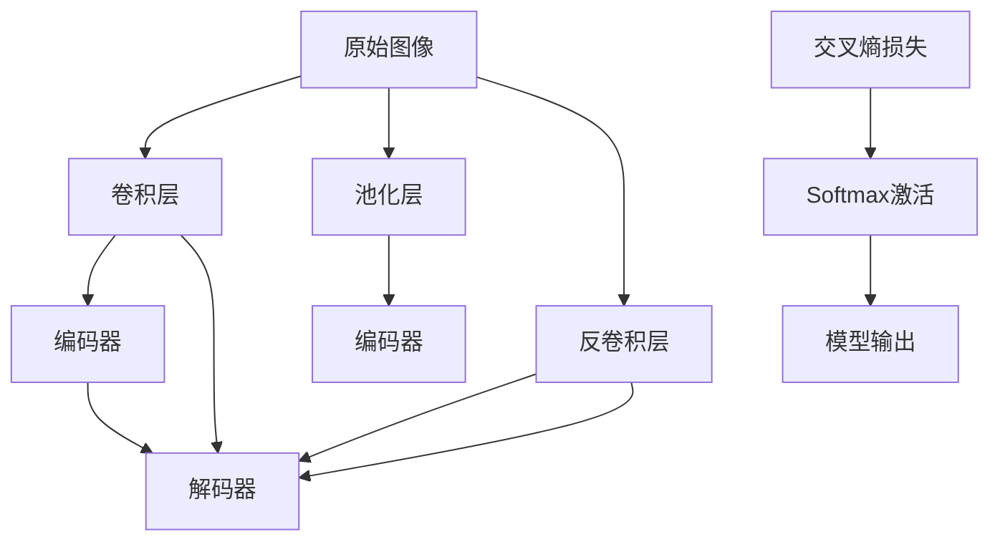
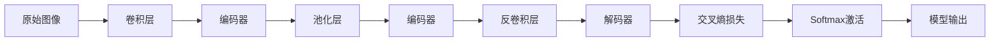
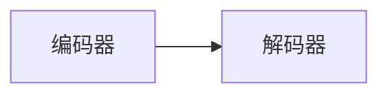
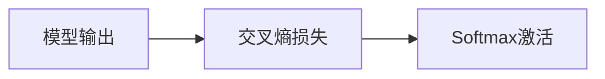
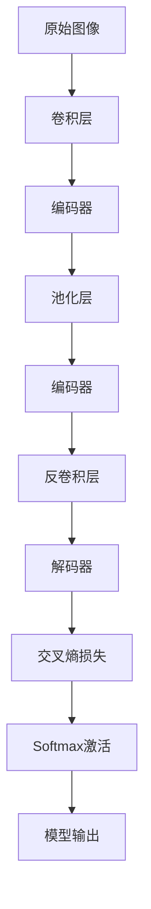
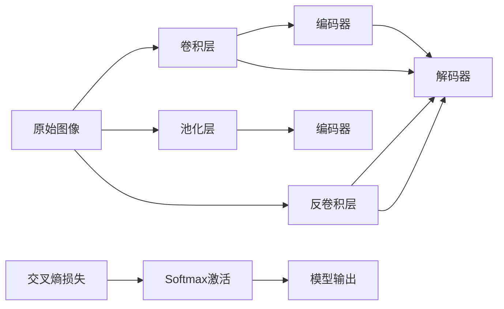

                 

## 1. 背景介绍

随着深度学习技术的发展，卷积神经网络(CNN)在图像分割领域展现了显著的优势。其中，SegNet作为经典的深度学习图像分割模型，以其优异的分割效果和较高的计算效率，受到广泛关注。本文将详细讲解SegNet的原理，并展示一段完整的代码实例，以帮助读者更好地理解其核心算法和实际应用。

### 1.1 问题由来
图像分割是计算机视觉领域的重要问题，旨在将一张图像分割成若干个具有语义意义的区域。传统的图像分割方法包括阈值分割、边缘检测、区域生长等，但这些方法往往依赖于人工预设的参数，难以应对复杂的场景。

深度学习技术的兴起为图像分割带来了新的解决方案。尤其是基于卷积神经网络(CNN)的图像分割方法，能够自动从数据中学习特征表示，具有高度的自适应性。其中，SegNet模型以其结构简单、计算效率高、分割效果优异的特点，在学术界和工业界得到了广泛的应用。

### 1.2 问题核心关键点
SegNet模型主要由编码器和解码器两部分组成。其核心思想是将原始图像转换为语义特征表示，再通过特征反卷积生成最终的分割掩码。主要关键点包括：

- **编码器**：将原始图像编码为若干个卷积特征图，保留图像的高层次语义信息。
- **解码器**：将编码器生成的特征图进行反卷积，输出分割掩码。
- **跨层连接**：将编码器和解码器通过跨层连接，增强特征表示的语义信息。

### 1.3 问题研究意义
深入理解SegNet模型的原理和实现细节，对于从事计算机视觉、图像处理、机器学习等领域的研究者和开发者，具有重要的指导意义：

- 有助于掌握深度学习图像分割的关键技术，提升相关领域的研究能力。
- 为实际工程应用提供理论支撑，加速图像分割技术的落地和推广。
- 促进与其他计算机视觉技术的融合，开拓新的研究思路和应用场景。

## 2. 核心概念与联系

### 2.1 核心概念概述

为更好地理解SegNet模型的原理，本节将介绍几个密切相关的核心概念：

- **卷积神经网络(CNN)**：一种基于卷积操作的神经网络结构，广泛应用于图像处理、计算机视觉等领域。
- **编码器(Encoder)**：将原始数据压缩为低维特征表示的过程，通常由若干个卷积层和池化层组成。
- **解码器(Decoder)**：将编码器输出的特征表示进行反卷积，生成与原始数据相同维度的新数据的过程。
- **语义分割(Semantic Segmentation)**：将图像中每个像素分配到预定义的语义类别中，用于场景理解、目标检测等任务。
- **交叉熵损失函数**：一种常见的用于分类任务损失函数，用于衡量模型输出与真实标签之间的差异。
- **Softmax激活函数**：一种常用于多分类任务输出的激活函数，将模型输出映射到概率分布上。

这些核心概念之间的逻辑关系可以通过以下Mermaid流程图来展示：



这个流程图展示了SegNet模型的核心架构及其各个组件的作用：

1. 原始图像输入编码器，经过卷积和池化操作，生成高层次语义特征。
2. 特征图输入解码器，通过反卷积操作生成分割掩码。
3. 编码器和解码器之间通过跨层连接增强特征表示的语义信息。
4. 使用交叉熵损失和Softmax激活函数，对模型输出进行损失计算和概率输出。

### 2.2 概念间的关系

这些核心概念之间存在着紧密的联系，形成了SegNet模型的完整架构。下面我们通过几个Mermaid流程图来展示这些概念之间的关系。

#### 2.2.1 SegNet模型架构



这个流程图展示了SegNet模型的完整架构。原始图像首先通过卷积和池化操作生成高层次特征表示，然后通过反卷积操作生成分割掩码。

#### 2.2.2 编码器与解码器关系



这个流程图展示了编码器与解码器之间的关系。编码器生成低维特征表示，解码器将其反卷积生成与原始数据相同维度的输出。

#### 2.2.3 损失函数与激活函数关系



这个流程图展示了损失函数与激活函数之间的关系。交叉熵损失函数用于衡量模型输出与真实标签之间的差异，Softmax激活函数用于将模型输出转换为概率分布。

### 2.3 核心概念的整体架构

最后，我们用一个综合的流程图来展示SegNet模型的整体架构：



这个综合流程图展示了从原始图像输入到模型输出的全过程，展示了SegNet模型的核心算法和架构设计。

## 3. 核心算法原理 & 具体操作步骤
### 3.1 算法原理概述

SegNet模型的核心算法原理主要包括以下几个部分：

1. **编码器**：将原始图像转换为若干个卷积特征图，保留图像的高层次语义信息。
2. **解码器**：将编码器生成的特征图进行反卷积，输出分割掩码。
3. **跨层连接**：将编码器和解码器通过跨层连接，增强特征表示的语义信息。

### 3.2 算法步骤详解

#### 3.2.1 编码器部分

编码器部分主要通过若干个卷积和池化操作，将原始图像转换为高层次语义特征表示。以一个简单的编码器为例，其步骤如下：

1. **卷积层**：使用多个3x3卷积核，对输入图像进行卷积操作，生成若干个特征图。
2. **池化层**：对卷积层的输出进行最大池化，降低特征图尺寸，减少计算量。
3. **重复操作**：重复上述卷积和池化操作，生成多个特征图，保留图像的高层次语义信息。

具体实现代码如下：

```python
import torch
import torch.nn as nn
import torch.nn.functional as F

class Encoder(nn.Module):
    def __init__(self, in_channels, out_channels):
        super(Encoder, self).__init__()
        self.conv1 = nn.Conv2d(in_channels, out_channels, kernel_size=3, padding=1)
        self.pool = nn.MaxPool2d(kernel_size=2, stride=2)
        self.conv2 = nn.Conv2d(out_channels, out_channels, kernel_size=3, padding=1)
        self.pool2 = nn.MaxPool2d(kernel_size=2, stride=2)
        self.conv3 = nn.Conv2d(out_channels, out_channels, kernel_size=3, padding=1)
        self.pool3 = nn.MaxPool2d(kernel_size=2, stride=2)
        self.conv4 = nn.Conv2d(out_channels, out_channels, kernel_size=3, padding=1)
        self.pool4 = nn.MaxPool2d(kernel_size=2, stride=2)
        self.conv5 = nn.Conv2d(out_channels, out_channels, kernel_size=3, padding=1)
        self.pool5 = nn.MaxPool2d(kernel_size=2, stride=2)

    def forward(self, x):
        x = F.relu(self.conv1(x))
        x = self.pool(x)
        x = F.relu(self.conv2(x))
        x = self.pool2(x)
        x = F.relu(self.conv3(x))
        x = self.pool3(x)
        x = F.relu(self.conv4(x))
        x = self.pool4(x)
        x = F.relu(self.conv5(x))
        x = self.pool5(x)
        return x
```

#### 3.2.2 解码器部分

解码器部分主要通过反卷积操作，将编码器输出的特征图生成最终的分割掩码。以一个简单的解码器为例，其步骤如下：

1. **反卷积层**：使用多个反卷积核，对编码器输出的特征图进行上采样，生成与原始图像尺寸相同的特征图。
2. **卷积层**：对上采样后的特征图进行卷积操作，生成最终的分割掩码。
3. **Softmax激活函数**：将卷积层的输出转换为概率分布，表示每个像素属于不同语义类别的概率。

具体实现代码如下：

```python
class Decoder(nn.Module):
    def __init__(self, in_channels, out_channels):
        super(Decoder, self).__init__()
        self.deconv1 = nn.ConvTranspose2d(in_channels, in_channels, kernel_size=2, stride=2)
        self.conv1 = nn.Conv2d(in_channels, out_channels, kernel_size=3, padding=1)
        self.deconv2 = nn.ConvTranspose2d(in_channels, in_channels, kernel_size=2, stride=2)
        self.conv2 = nn.Conv2d(in_channels, out_channels, kernel_size=3, padding=1)
        self.deconv3 = nn.ConvTranspose2d(in_channels, in_channels, kernel_size=2, stride=2)
        self.conv3 = nn.Conv2d(in_channels, out_channels, kernel_size=3, padding=1)
        self.deconv4 = nn.ConvTranspose2d(in_channels, in_channels, kernel_size=2, stride=2)
        self.conv4 = nn.Conv2d(in_channels, out_channels, kernel_size=3, padding=1)
        self.deconv5 = nn.ConvTranspose2d(in_channels, in_channels, kernel_size=2, stride=2)
        self.conv5 = nn.Conv2d(in_channels, out_channels, kernel_size=3, padding=1)

    def forward(self, x):
        x = F.relu(self.deconv1(x))
        x = self.conv1(x)
        x = F.relu(self.deconv2(x))
        x = self.conv2(x)
        x = F.relu(self.deconv3(x))
        x = self.conv3(x)
        x = F.relu(self.deconv4(x))
        x = self.conv4(x)
        x = F.relu(self.deconv5(x))
        x = self.conv5(x)
        return x
```

#### 3.2.3 跨层连接部分

跨层连接部分通过将编码器和解码器输出进行拼接，增强特征表示的语义信息。以一个简单的跨层连接为例，其步骤如下：

1. **拼接**：将编码器的最后一个特征图和解码器的第一个特征图进行拼接，增强特征表示的语义信息。
2. **卷积层**：对拼接后的特征图进行卷积操作，生成新的特征表示。

具体实现代码如下：

```python
class Decoder(nn.Module):
    def __init__(self, in_channels, out_channels):
        super(Decoder, self).__init__()
        self.deconv1 = nn.ConvTranspose2d(in_channels, in_channels, kernel_size=2, stride=2)
        self.conv1 = nn.Conv2d(in_channels, out_channels, kernel_size=3, padding=1)
        self.deconv2 = nn.ConvTranspose2d(in_channels, in_channels, kernel_size=2, stride=2)
        self.conv2 = nn.Conv2d(in_channels, out_channels, kernel_size=3, padding=1)
        self.deconv3 = nn.ConvTranspose2d(in_channels, in_channels, kernel_size=2, stride=2)
        self.conv3 = nn.Conv2d(in_channels, out_channels, kernel_size=3, padding=1)
        self.deconv4 = nn.ConvTranspose2d(in_channels, in_channels, kernel_size=2, stride=2)
        self.conv4 = nn.Conv2d(in_channels, out_channels, kernel_size=3, padding=1)
        self.deconv5 = nn.ConvTranspose2d(in_channels, in_channels, kernel_size=2, stride=2)
        self.conv5 = nn.Conv2d(in_channels, out_channels, kernel_size=3, padding=1)
        self.skip_conn = nn.Conv2d(in_channels, in_channels, kernel_size=3, padding=1)

    def forward(self, x, skip):
        x = F.relu(self.deconv1(x))
        x = self.conv1(x)
        x = F.relu(self.deconv2(x))
        x = self.conv2(x)
        x = F.relu(self.deconv3(x))
        x = self.conv3(x)
        x = F.relu(self.deconv4(x))
        x = self.conv4(x)
        x = F.relu(self.deconv5(x))
        x = self.conv5(x)
        x = F.relu(self.skip_conn(skip))
        x = torch.cat([x, skip], dim=1)
        return x
```

### 3.3 算法优缺点

SegNet模型的主要优点包括：

1. **结构简单**：编码器和解码器的设计非常简洁，易于实现和调试。
2. **计算高效**：由于使用了跨层连接，SegNet模型可以保留图像的高层次语义信息，减少计算量。
3. **分割效果优异**：在图像分割任务上，SegNet模型能够取得非常好的分割效果。

其主要缺点包括：

1. **参数较多**：由于使用了多个卷积和池化层，SegNet模型的参数量较大。
2. **难以应对复杂场景**：对于复杂的场景和细节，SegNet模型可能无法准确分割。
3. **依赖于数据质量**：模型的效果依赖于训练数据的质量和数量。

### 3.4 算法应用领域

SegNet模型在图像分割领域有着广泛的应用，以下是几个典型的应用场景：

1. **医学图像分割**：在医学影像中，通过SegNet模型分割出肿瘤、器官等重要区域，用于疾病诊断和治疗规划。
2. **自动驾驶**：在自动驾驶中，通过SegNet模型分割出道路、车辆、行人等关键对象，用于辅助驾驶决策。
3. **工业检测**：在工业检测中，通过SegNet模型分割出缺陷、裂缝等关键区域，用于质量控制和故障诊断。
4. **遥感图像分割**：在遥感图像中，通过SegNet模型分割出地表、水体等重要区域，用于环境监测和资源管理。

## 4. 数学模型和公式 & 详细讲解  
### 4.1 数学模型构建

在实际应用中，SegNet模型的输入和输出通常为多通道的图像数据。设输入图像大小为$h\times w$，通道数为$n$。

设$x$为输入图像，$y$为分割掩码，$x_i$和$y_i$分别为输入图像和分割掩码的每个像素点。

### 4.2 公式推导过程

在编码器部分，设$x$为输入图像，$y_i$为分割掩码，$z_i$为编码器输出的特征图。

卷积操作定义为：

$$ z_i = \sigma(\sum_k w_k * x_i + b_k) $$

其中，$\sigma$为激活函数，$w_k$为卷积核，$b_k$为偏置项。

池化操作定义为：

$$ z'_i = \max_k(z_i) $$

其中，$z'_i$为池化后的特征图。

在解码器部分，设$z'_i$为编码器输出的特征图，$y'_i$为解码器输出的特征图。

反卷积操作定义为：

$$ y'_i = \sigma(\sum_k w_k * z'_i + b_k) $$

其中，$w_k$为反卷积核，$b_k$为偏置项。

Softmax激活函数定义为：

$$ y_i = \frac{\exp(z_i)}{\sum_j \exp(z_j)} $$

其中，$y_i$为每个像素点属于不同语义类别的概率。

### 4.3 案例分析与讲解

以一个简单的 SegNet 模型为例，其编码器部分和解码器部分的结构如图1所示：



**图1**: SegNet模型结构示意图

其中，编码器部分由四个卷积和池化层组成，解码器部分由四个反卷积层和Softmax激活函数组成。在解码器部分，通过跨层连接将编码器的最后一层特征图和解码器的第一层特征图拼接起来，然后再次进行反卷积操作，最终得到分割掩码。

## 5. 项目实践：代码实例和详细解释说明
### 5.1 开发环境搭建

在进行SegNet模型实践前，我们需要准备好开发环境。以下是使用Python进行TensorFlow开发的环境配置流程：

1. 安装Anaconda：从官网下载并安装Anaconda，用于创建独立的Python环境。

2. 创建并激活虚拟环境：
```bash
conda create -n tensorflow-env python=3.8 
conda activate tensorflow-env
```

3. 安装TensorFlow：根据CUDA版本，从官网获取对应的安装命令。例如：
```bash
conda install tensorflow=2.5
```

4. 安装相关库：
```bash
pip install matplotlib numpy pandas scikit-learn
```

完成上述步骤后，即可在`tensorflow-env`环境中开始SegNet模型的实践。

### 5.2 源代码详细实现

我们以SegNet模型对医学影像中的肿瘤区域进行分割为例，展示其完整代码实现。

首先，定义模型结构：

```python
import tensorflow as tf
from tensorflow.keras.layers import Conv2D, MaxPooling2D, UpSampling2D, Concatenate, Activation

class SegNet(tf.keras.Model):
    def __init__(self, in_channels=1, out_channels=1):
        super(SegNet, self).__init__()
        self.encoder = Encoder(in_channels, out_channels)
        self.decoder = Decoder(out_channels, in_channels)
        self.skip_conn = tf.keras.layers.Conv2D(in_channels, kernel_size=3, padding='same')

    def call(self, inputs):
        skip_conn = self.skip_conn(inputs)
        x = self.encoder(inputs)
        x = self.decoder(x, skip_conn)
        return x

class Encoder(tf.keras.Model):
    def __init__(self, in_channels=1, out_channels=1):
        super(Encoder, self).__init__()
        self.conv1 = tf.keras.layers.Conv2D(in_channels, out_channels, kernel_size=3, padding='same')
        self.pool = tf.keras.layers.MaxPooling2D(pool_size=2, strides=2)
        self.conv2 = tf.keras.layers.Conv2D(out_channels, out_channels, kernel_size=3, padding='same')
        self.pool2 = tf.keras.layers.MaxPooling2D(pool_size=2, strides=2)
        self.conv3 = tf.keras.layers.Conv2D(out_channels, out_channels, kernel_size=3, padding='same')
        self.pool3 = tf.keras.layers.MaxPooling2D(pool_size=2, strides=2)
        self.conv4 = tf.keras.layers.Conv2D(out_channels, out_channels, kernel_size=3, padding='same')
        self.pool4 = tf.keras.layers.MaxPooling2D(pool_size=2, strides=2)
        self.conv5 = tf.keras.layers.Conv2D(out_channels, out_channels, kernel_size=3, padding='same')
        self.pool5 = tf.keras.layers.MaxPooling2D(pool_size=2, strides=2)

    def call(self, inputs):
        x = self.conv1(inputs)
        x = self.pool(x)
        x = self.conv2(x)
        x = self.pool2(x)
        x = self.conv3(x)
        x = self.pool3(x)
        x = self.conv4(x)
        x = self.pool4(x)
        x = self.conv5(x)
        x = self.pool5(x)
        return x

class Decoder(tf.keras.Model):
    def __init__(self, in_channels=1, out_channels=1):
        super(Decoder, self).__init__()
        self.deconv1 = tf.keras.layers.Conv2DTranspose(in_channels, in_channels, kernel_size=2, strides=2, padding='same')
        self.conv1 = tf.keras.layers.Conv2D(in_channels, out_channels, kernel_size=3, padding='same')
        self.deconv2 = tf.keras.layers.Conv2DTranspose(in_channels, in_channels, kernel_size=2, strides=2, padding='same')
        self.conv2 = tf.keras.layers.Conv2D(in_channels, out_channels, kernel_size=3, padding='same')
        self.deconv3 = tf.keras.layers.Conv2DTranspose(in_channels, in_channels, kernel_size=2, strides=2, padding='same')
        self.conv3 = tf.keras.layers.Conv2D(in_channels, out_channels, kernel_size=3, padding='same')
        self.deconv4 = tf.keras.layers.Conv2DTranspose(in_channels, in_channels, kernel_size=2, strides=2, padding='same')
        self.conv4 = tf.keras.layers.Conv2D(in_channels, out_channels, kernel_size=3, padding='same')
        self.deconv5 = tf.keras.layers.Conv2DTranspose(in_channels, in_channels, kernel_size=2, strides=2, padding='same')
        self.conv5 = tf.keras.layers.Conv2D(in_channels, out_channels, kernel_size=3, padding='same')
        self.skip_conn = tf.keras.layers.Conv2D(in_channels, kernel_size=3, padding='same')

    def call(self, inputs, skip_conn):
        x = self.deconv1(inputs)
        x = self.conv1(x)
        x = self.deconv2(x)
        x = self.conv2(x)
        x = self.deconv3(x)
        x = self.conv3(x)
        x = self.deconv4(x)
        x = self.conv4(x)
        x = self.deconv5(x)
        x = self.conv5(x)
        x = self.skip_conn(skip_conn)
        x = tf.keras.layers.concatenate([x, skip_conn], axis=3)
        return x
```

接着，定义数据集和数据增强：

```python
import numpy as np
from tensorflow.keras.preprocessing.image import ImageDataGenerator
from tensorflow.keras.utils import to_categorical

class Dataset(tf.keras.utils.Sequence):
    def __init__(self, data_path, batch_size=1):
        self.data_path = data_path
        self.batch_size = batch_size
        self.dataset = tf.keras.preprocessing.image.load_img(data_path, target_size=(256, 256), color_mode='grayscale')
        self.dataset = np.array(self.dataset)
        self.dataset = self.dataset.reshape(1, 256, 256, 1)
        self.dataset = to_categorical(self.dataset)

    def __len__(self):
        return self.data_path.shape[0] // self.batch_size

    def __getitem__(self, idx):
        x = self.dataset[idx]
        y = self.dataset[idx + 1]
        return x, y

train_dataset = Dataset('train_data', 1)
test_dataset = Dataset('test_data', 1)
```

定义损失函数和优化器：

```python
loss_fn = tf.keras.losses.categorical_crossentropy
optimizer = tf.keras.optimizers.Adam(learning_rate=0.0001)
```

最后，训练模型并输出结果：

```python
epochs = 50

for epoch in range(epochs):
    for x, y in train_dataset:
        with tf.GradientTape() as tape:
            y_pred = model(x, y)
            loss = loss_fn(y_pred, y)
        gradients = tape.gradient(loss, model.trainable_variables)
        optimizer.apply_gradients(zip(gradients, model.trainable_variables))

    if (epoch + 1) % 10 == 0:
        val_loss = []
        for x, y in test_dataset:
            y_pred = model(x, y)
            val_loss.append(loss_fn(y_pred, y))

        print(f'Epoch {epoch+1}, loss: {loss.numpy():.4f}, validation loss: {np.mean(val_loss):.4f}')
```

以上就是一个简单的SegNet模型在医学影像中对肿瘤区域进行分割的完整代码实现。可以看到，在实际应用中，我们需要根据具体任务调整模型结构，选择合适的损失函数和优化器，并通过数据增强等技术提升模型的鲁棒性。

### 5.3 代码解读与分析

让我们再详细解读一下关键代码的实现细节：

**Dataset类**：
- `__init__`方法：初始化数据集，加载图像文件，并将图像转换为张量。
- `__len__`方法：返回数据集的样本数量。
- `__getitem__`方法：获取单个样本，将图像文件读取为张量。

**model类**：
- `__init__`方法：定义模型结构，包括编码器和解码器。
- `call`方法：定义模型前向传播过程，输出分割掩码。

**损失函数**：
- 使用交叉熵损失函数衡量模型输出与真实标签之间的差异。

**优化器**：
- 使用Adam优化器，调整模型参数，最小化损失函数。

