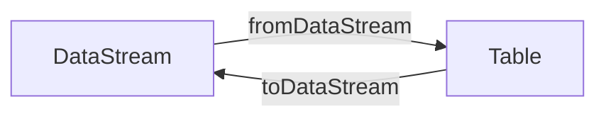
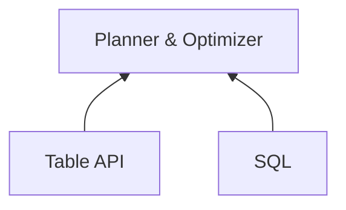
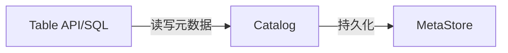
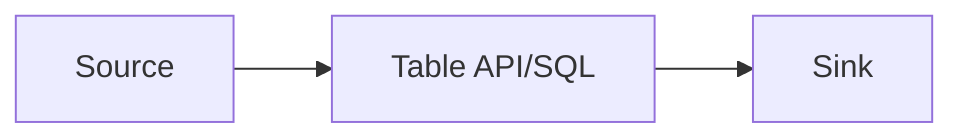
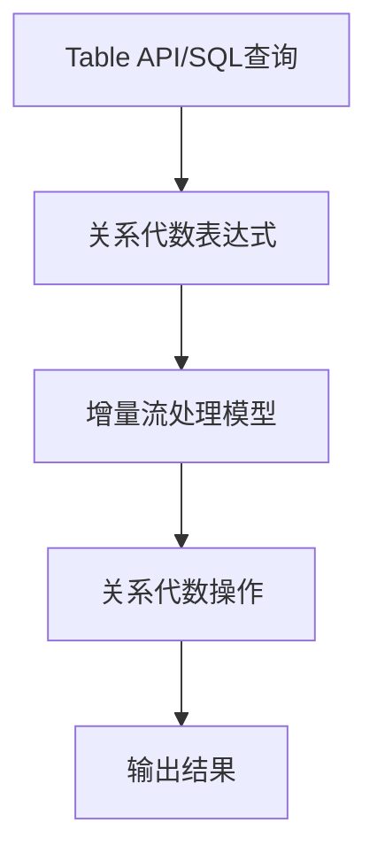
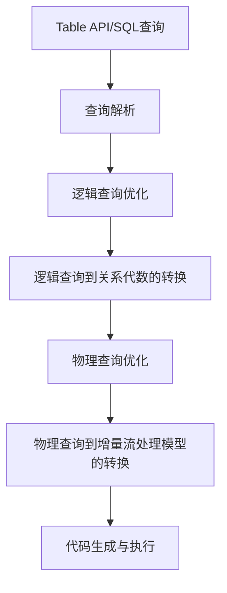

# Flink Table API和SQL原理与代码实例讲解

## 1. 背景介绍

### 1.1 问题的由来

在当今大数据时代，海量的数据不断产生和流动,传统的批处理系统已经无法满足实时数据处理的需求。因此,针对流式数据处理的需求,诞生了流式计算引擎。Apache Flink作为一款开源的分布式流式数据处理引擎,凭借其低延迟、高吞吐、精确一次语义等优势,成为流式计算领域的佼佼者。

在Flink中,Table API和SQL是两种重要的API,它们为Flink提供了基于关系模型的数据处理能力。通过Table API和SQL,用户可以使用类SQL语句对有界和无界数据进行ETL(Extract-Transform-Load)操作,并支持与现有数据处理系统的无缝集成。

### 1.2 研究现状

目前,Flink Table API和SQL已经得到了广泛的应用和研究。在实时数据分析、数据仓库构建、数据湖处理等场景中,Table API和SQL展现出了强大的数据处理能力。然而,由于其底层实现机制的复杂性,很多开发者对Table API和SQL的原理理解不够深入,难以充分发挥其潜力。

### 1.3 研究意义

深入理解Flink Table API和SQL的原理对于更好地利用这一强大工具至关重要。通过剖析其内部机制,我们可以更好地把握其设计思想和实现细节,从而编写出更高效、更可靠的数据处理程序。此外,对Table API和SQL原理的深入探讨也将为其未来的发展和优化提供理论基础。

### 1.4 本文结构

本文将从以下几个方面深入探讨Flink Table API和SQL的原理:

1. 核心概念与联系
2. 核心算法原理与具体操作步骤
3. 数学模型和公式详细讲解与案例分析
4. 项目实践:代码实例和详细解释
5. 实际应用场景
6. 工具和资源推荐
7. 总结:未来发展趋势与挑战
8. 附录:常见问题与解答

## 2. 核心概念与联系

在深入探讨Flink Table API和SQL的原理之前,我们需要先了解一些核心概念及它们之间的联系。

### 2.1 Table与DataStream

在Flink中,`Table`是一个逻辑概念,它代表一个持续追加的不可变数据集。`Table`可以来自于静态数据源(如文件、数据库表)或动态数据源(如Kafka主题)。与之对应的是`DataStream`,它代表了一个不断更新的数据流。

`Table`和`DataStream`之间可以相互转换。通过`TableEnvironment`提供的`fromDataStream`方法,可以将`DataStream`转换为`Table`;而`toDataStream`方法则可以将`Table`转换为`DataStream`。这种转换使得我们可以在关系代数和流处理之间自由切换,充分利用两者的优势。

### 2.2 Table API与SQL

Flink提供了两种编程接口来处理`Table`:Table API和SQL。

**Table API**是一组用于构建`Table`程序的语言集成查询,提供了一种类似于集合操作的编程方式。它支持Java、Scala和Python等多种语言,使得我们可以在熟悉的编程语言环境中进行数据处理。

**SQL**则是一种声明式的领域特定语言(DSL),用于处理结构化数据。Flink SQL遵循SQL标准,支持标准的SQL语法,如`SELECT`、`JOIN`、`WHERE`等,使得熟悉SQL的开发者可以快速上手。

Table API和SQL在内部使用相同的计划器和优化器,因此它们在功能上是等价的。开发者可以根据自身的喜好和项目需求选择使用哪一种接口。

### 2.3 Catalog与MetaStore

在Flink中,`Catalog`用于维护元数据信息,如数据库、表、视图、函数等。它为Table API和SQL提供了统一的元数据管理机制。

`MetaStore`是`Catalog`的一种实现,它将元数据信息持久化存储在外部系统中,如Hive Metastore、MySQL等。这使得元数据信息可以跨会话共享,并且具有更好的可靠性和可维护性。

### 2.4 Source与Sink

在Flink中,`Source`代表数据的输入源,而`Sink`则代表数据的输出目标。Table API和SQL可以从各种`Source`读取数据,如文件、Kafka主题、数据库表等,并将处理结果写入到不同的`Sink`中,如文件、Kafka主题、数据库表等。

## 3. 核心算法原理与具体操作步骤

在了解了Flink Table API和SQL的核心概念之后,我们将深入探讨其核心算法原理和具体操作步骤。

### 3.1 算法原理概述

Flink Table API和SQL的核心算法原理基于关系代数和流处理模型。

**关系代数**是一种用于处理关系数据的理论基础,它定义了一系列操作符,如选择(Selection)、投影(Projection)、连接(Join)等,用于对关系数据进行转换和操作。Table API和SQL中的查询语句最终会被转换为关系代数表达式。

**流处理模型**则描述了如何对无界数据流进行处理。Flink采用了增量流处理模型,即将流式数据划分为一系列的增量批次,对每个批次进行处理,并将结果追加到输出流中。这种模型可以保证精确一次语义,避免了数据丢失或重复计算的问题。

Flink Table API和SQL的核心算法就是将关系代数表达式转换为增量流处理模型,并对每个增量批次应用相应的关系代数操作。这种算法将关系代数和流处理模型有机结合,实现了高效、可靠的流式数据处理。

### 3.2 算法步骤详解

Flink Table API和SQL的核心算法可以分为以下几个步骤:

1. **查询解析**:将Table API或SQL查询语句解析为抽象语法树(AST)。
2. **逻辑查询优化**:对AST进行一系列优化,如投影剪裁、谓词下推等,生成优化后的逻辑查询计划。
3. **逻辑查询到关系代数的转换**:将优化后的逻辑查询计划转换为关系代数表达式。
4. **物理查询优化**:对关系代数表达式进行一系列优化,如选择连接顺序、重写表达式等,生成优化后的物理查询计划。
5. **物理查询到增量流处理模型的转换**:将优化后的物理查询计划转换为增量流处理模型。
6. **代码生成与执行**:根据增量流处理模型生成执行代码,并在Flink集群上执行。

在这个过程中,查询优化器扮演着至关重要的角色。它通过一系列规则和策略对查询进行优化,以提高查询执行的效率和性能。

### 3.3 算法优缺点

Flink Table API和SQL的核心算法具有以下优点:

- **统一的处理模型**:关系代数和流处理模型的结合,使得Table API和SQL能够统一处理有界和无界数据。
- **查询优化**:查询优化器可以对查询进行多方面的优化,提高查询执行效率。
- **容错性**:增量流处理模型保证了精确一次语义,避免了数据丢失或重复计算的问题。

然而,该算法也存在一些缺点:

- **延迟**:由于需要对每个增量批次进行处理,可能会引入一定的延迟。
- **状态管理**:对于有状态的查询,需要管理和维护查询状态,增加了系统复杂性。
- **查询优化限制**:由于流式数据的特性,某些优化策略可能无法应用。

### 3.4 算法应用领域

Flink Table API和SQL的核心算法可以应用于以下领域:

- **实时数据分析**:通过对流式数据进行实时处理和分析,可以及时发现数据中的模式和趋势。
- **数据仓库构建**:可以利用Table API和SQL将数据从各种源导入到数据仓库中,并进行ETL处理。
- **数据湖处理**:将数据湖中的数据转换为结构化的表格式,便于进行分析和查询。
- **事件驱动应用**:通过对实时事件流进行处理,可以构建各种事件驱动的应用,如实时推荐、实时监控等。

## 4. 数学模型和公式详细讲解与举例说明

在Flink Table API和SQL的核心算法中,涉及到了一些数学模型和公式,我们将对其进行详细的讲解和案例分析。

### 4.1 数学模型构建

Flink Table API和SQL的核心算法基于关系代数和流处理模型。关系代数提供了一种形式化的方法来描述和操作关系数据,而流处理模型则描述了如何对无界数据流进行处理。

在关系代数中,一个关系(表)可以表示为一个集合,其中每个元素都是一个元组(行)。关系代数定义了一系列操作符,用于对关系进行转换和操作。常见的关系代数操作符包括:

- 选择(Selection,σ):根据给定的谓词条件选择元组。
- 投影(Projection,π):从每个元组中选择指定的属性。
- 连接(Join,⨝):根据连接条件将两个关系合并。
- 并(Union,∪):将两个关系中的所有元组合并。
- 差(Difference,−):从第一个关系中去除第二个关系中存在的元组。
- 笛卡尔积(Cartesian Product,×):将两个关系中的每个元组进行组合。

对于流处理模型,我们将无界数据流划分为一系列的增量批次,对每个批次应用关系代数操作,并将结果追加到输出流中。这种模型可以保证精确一次语义,避免了数据丢失或重复计算的问题。

### 4.2 公式推导过程

在Flink Table API和SQL的核心算法中,涉及到一些公式推导过程。以下是一个示例,展示了如何推导出连接操作的代价公式。

假设我们有两个关系R和S,分别包含m和n个元组。我们需要计算执行R⨝S(R连接S)操作的代价。

首先,我们需要计算笛卡尔积R×S的代价,即将R中的每个元组与S中的每个元组进行组合。这个过程需要进行m×n次比较,因此代价为O(m×n)。

接下来,我们需要应用连接条件进行过滤。假设连接条件的选择率为f,即只有f×m×n个元组满足连接条件。过滤操作的代价为O(m×n)。

综上所述,执行R⨝S操作的总代价为:

$$
Cost(R \Join S) = O(m \times n) + O(m \times n) = O(m \times n)
$$

这个公式表明,连接操作的代价与两个关系的大小成正比。因此,在查询优化过程中,我们需要考虑选择合适的连接顺序,以最小化连接操作的代价。

### 4.3 案例分析与讲解

现在,我们通过一个具体的案例来进一步理解Flink Table API和SQL的核心算法。

假设我们有两个表:`Orders`表存储订单信息,`Customers`表存储客户信息。我们需要查询每个客户